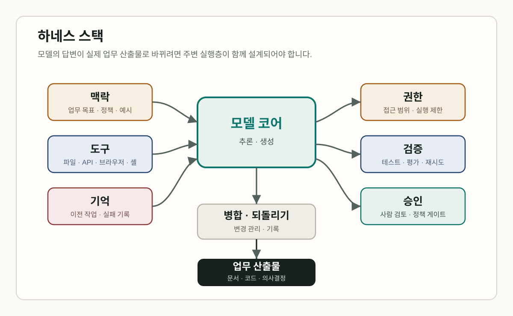
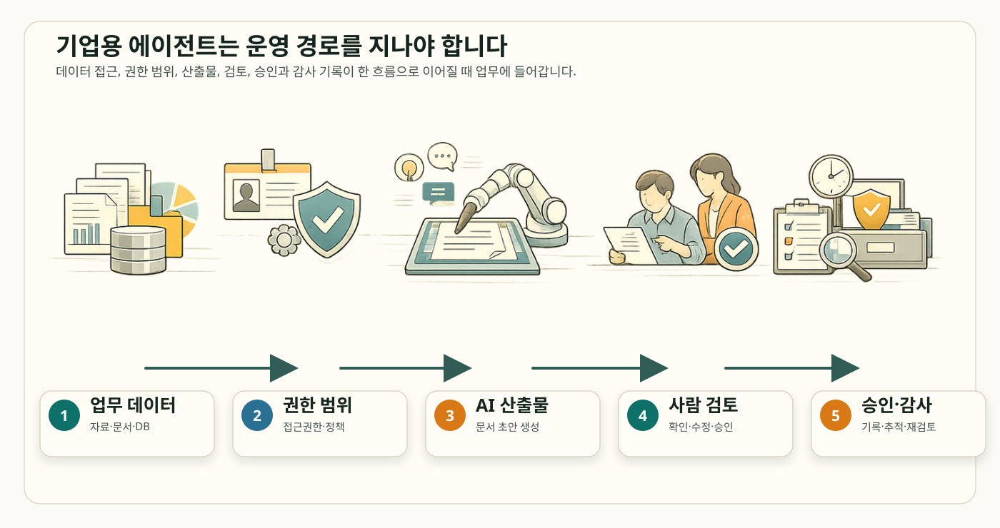
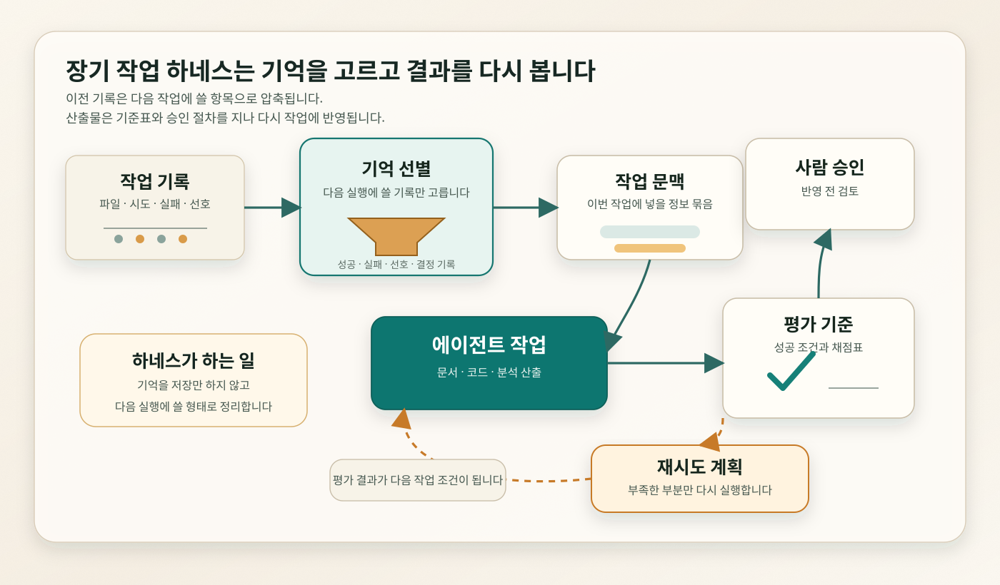
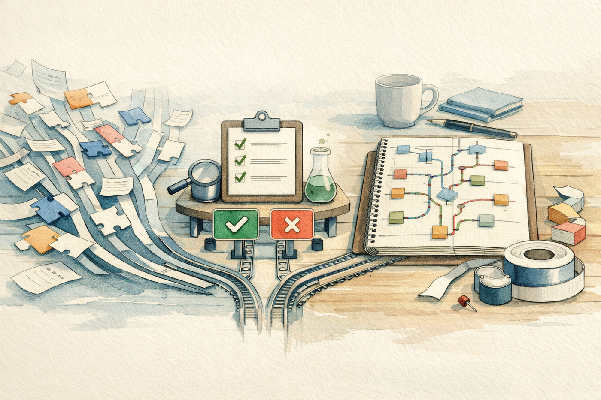
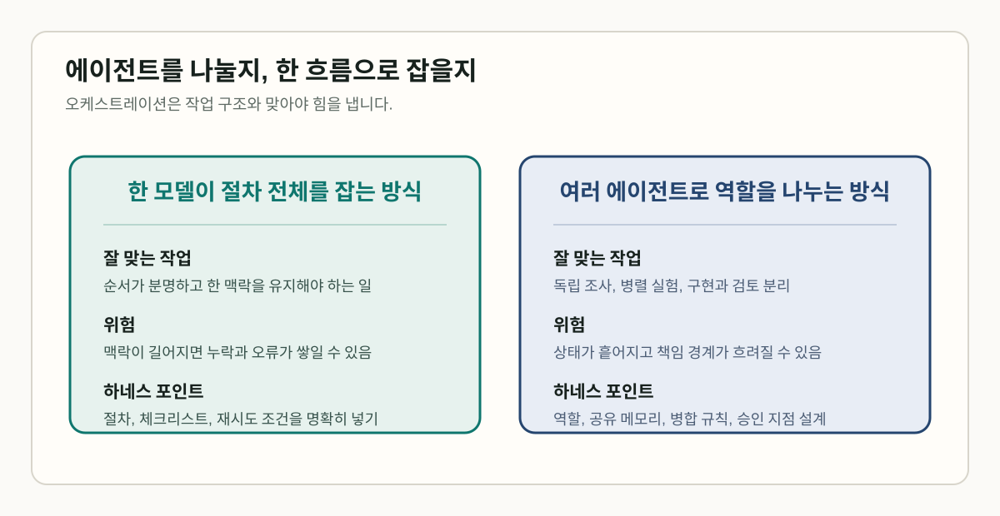
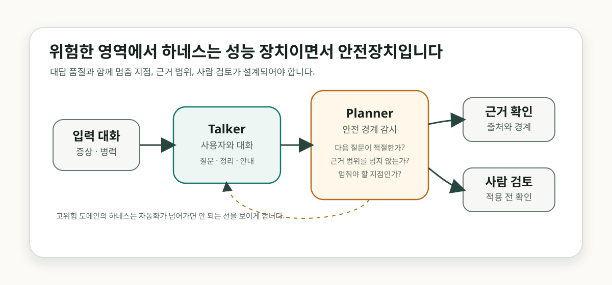

# AI 에이전트를 일하게 하는 기술: 하네스 엔지니어링

<figure class="article-hero-figure">
  
  <figcaption><strong>그림 1.</strong> 에이전트가 실제 업무 도구가 되는 순간, 문서, 도구 연결, 체크리스트, 권한 장치가 모델 주변에 함께 놓입니다.</figcaption>
</figure>

## 똑똑한 에이전트를 위한 업무 단도리: 하네스 구축

AI 에이전트 소식을 들을 때 처음 눈에 들어오는 것은 대개 모델 이름입니다. GPT-5.5, Claude Opus 4.7, Gemini-3 같은 모델들 중 어떤 모델이 더 빠른가, 코딩 벤치마크에서 누가 앞섰는가, 얼마나 긴 작업을 맡길 수 있는가가 먼저 이야기됩니다. 그런데 팀 안에서 실제로 AI에게 일을 맡기면 곧 다른 종류의 걱정이 생깁니다.

*“이 모델이 우리 파일을 어디까지 읽어도 될까?”*

*“테스트가 실패하면 다시 고치게 해도 될까?”*

*“결과를 바로 반영하지 말고 누가 확인하게 하지?”*

코드 수정을 AI에게 맡겨본 적 있으신가요? 처음에는 “생각보다 잘하네”라는 반응이 나옵니다. 곧 다음 일이 따라옵니다. 어떤 파일을 고쳤는지 봐야 하고, 테스트를 돌려야 하고, 잘못 바뀐 부분은 되돌려야 합니다. 여러 에이전트가 동시에 움직이면 병합 충돌도 생깁니다. 이때는 파일 접근 범위, 테스트 재실행, 승인, 되돌리기 경로를 미리 정해두는 운영 방식이 필요해집니다.

이러한 에이전트 작업을 실행하고, 검증하고, 제어하는 체계를 보통 **하네스**라고 부릅니다. 원래 소프트웨어 테스트에서 [test harness](https://www.techtarget.com/searchsoftwarequality/definition/test-harness)는 테스트를 실행하고, 필요한 데이터나 driver/stub을 연결하고, 결과를 확인하는 환경을 가리켰습니다. LLM 평가에서도 [EleutherAI Language Model Evaluation Harness](https://github.com/EleutherAI/lm-evaluation-harness)처럼 모델을 같은 기준으로 시험하기 위한 실행 환경이라는 의미로 쓰여 왔습니다.

최근 에이전트 연구에서는 이 말이 실제 업무 운영 쪽으로 확장되고 있습니다. [Natural-Language Agent Harnesses](https://arxiv.org/abs/2603.25723)는 에이전트 성능이 하네스 엔지니어링에 점점 더 의존한다고 설명합니다. [Meta-Harness](https://arxiv.org/abs/2603.28052)는 하네스를 모델에 어떤 정보를 저장하고, 검색하고, 제시할지 정하는 코드로 설명합니다. 에이전트 문맥에서 하네스는 테스트 환경의 의미를 넘어 권한, 도구, 기억, 검증, 승인, 되돌리기 절차까지 포함하는 운영 체계로 다뤄집니다.

지금부터 최근 AI 하네스 엔지니어링을 다룬 논문, 공식 발표, 저장소 문서를 바탕으로 하네스 설계가 왜 모델 성능과 나란히 검토해야 할 문제가 되었는지 짚어보겠습니다. 기업처럼 권한과 책임이 분명한 조직 안에서 AI 에이전트를 쓰기 시작하면, 곧 권한, 기억, 검증, 승인, 되돌리기 같은 운영과 통제, 거버넌스 이슈가 부각됩니다. 이 흐름을 하나씩 살펴보겠습니다.

## 하네스는 모델 주변의 운영 조건을 정합니다

모델은 문장을 만들고 코드를 제안할 수 있습니다. 업무에는 그 다음 절차가 필요합니다. 메일을 읽고, 문서를 찾고, 표를 고치고, 코드 저장소를 수정하고, 테스트를 돌리고, 누군가의 승인을 받아야 합니다. 이 절차를 모델 혼자 “알아서” 처리하게 두면 책임 경계가 흐려집니다. 그래서 모델 주변에는 실행과 검증을 담당하는 운영층이 필요합니다.

<figure class="figure-panel">
  
  <figcaption><strong>그림 2.</strong> 하네스는 모델 주변의 실행층입니다. 맥락, 도구, 기억, 권한, 평가, 승인, 병합과 되돌리기가 맞물려야 모델 출력이 실제 업무 산출물로 넘어갑니다.</figcaption>
</figure>

가운데에는 모델이 있습니다. 하지만 실제 차이는 주변 운영 조건에서 자주 갈립니다. 같은 모델이라도 어떤 파일을 읽는지, 실패한 테스트를 어떻게 다시 보는지, 도구 실행 결과를 어떤 기록으로 남기는지, 언제 사용자에게 멈춰서 묻는지에 따라 결과가 달라집니다.

앞으로 자주 나올 말들을 짧게 정리하면 이렇습니다.

| 용어 | 쉽게 말하면 |
|---|---|
| 하네스 | 모델을 실제 업무 안에서 쓰기 위해 마련하는 실행·검증·제어 체계입니다. 똑똑한 동료에게 책상, 출입증, 체크리스트, 검토 절차를 마련해주는 일로 생각하면 이해하기 쉽습니다. |
| connector | Gmail, Drive, Calendar, GitHub처럼 외부 업무 도구와 AI를 연결하는 통로입니다. |
| memory | 에이전트가 이전 작업, 선호, 실패 기록을 다시 활용하도록 저장하는 기억 구조입니다. |
| evaluation loop | 결과를 기준에 맞춰 평가하고, 부족하면 다시 시도하게 하는 루프입니다. |
| orchestration | 여러 에이전트나 작업 단계를 나눠 순서와 역할을 조정하는 방식입니다. |
| semantic merge | 줄 단위 병합을 넘어 함수, 클래스, 문법 구조 같은 의미 단위로 변경을 병합하려는 접근입니다. |

이 용어들을 하나씩 따라가면 결국 한 가지 운영 질문으로 모입니다. 모델이 조직의 일을 하려면 어떤 권한, 어떤 도구, 어떤 기억, 어떤 검증 절차가 필요할까요? 이 질문이 하네스 논의를 이해하는 가장 쉬운 입구입니다.

## 모델 성능을 결정하는 실행 조건: 하네스 엔지니어링

최근의 여러 논문과 AI 관련 벤치마크 논의를 보면, 모델의 성능을 이야기할 때 실행 조건을 함께 묻는 장면이 많아졌습니다. 어떤 자료를 기준으로 삼는지, 어떤 업무 앱과 연결되는지, 실패했을 때 무엇을 기록하고 누가 승인하는지가 같이 고려되고 있습니다. 바로 이처럼 에이전트가 실제 업무에 들어가기 위한 설계 문제를 다룰 때 등장하는 말이 하네스 엔지니어링입니다.

<figure class="figure-panel">
  
  <figcaption><strong>그림 3.</strong> 하네스 설계에는 기준 자료, 작업 절차, 업무 앱 연결, 오픈소스 도구, 개발자 워크플로, 거버넌스가 모두 들어갑니다.</figcaption>
</figure>

| 검토한 지점 | 주요 참고자료 | 읽어볼 대목 |
|---|---|---|
| 하네스 연구 | [Natural-Language Agent Harnesses](https://arxiv.org/abs/2603.25723), [Meta-Harness](https://arxiv.org/abs/2603.28052) | 하네스가 에이전트 성능과 연결되고, 하네스 자체가 최적화 대상으로 다뤄집니다. |
| 오케스트레이션의 적정선 | [In-Context Prompting Obsoletes Agent Orchestration for Procedural Tasks](https://arxiv.org/abs/2604.27891) | 절차가 분명한 작업에서는 여러 에이전트보다 한 모델이 전체 절차를 유지하는 방식이 나을 수 있습니다. |
| 기업용 작업면 | [Anthropic 금융 서비스 에이전트](https://www.anthropic.com/news/finance-agents), [Claude Code Security](https://www.anthropic.com/news/claude-code-security), [Claude Managed Agents](https://claude.com/blog/new-in-claude-managed-agents) | 업무 문서, 보안 검토, 기억 관리, 평가 루프, 승인 지점이 제품 경험 안으로 들어옵니다. |
| 업무 데이터 연결 | [xAI Grok connectors](https://docs.x.ai/grok/connectors) | connector가 비기술 사용자에게 가장 먼저 체감되는 하네스 구성요소가 됩니다. |
| 오픈소스 실행 환경 | [DeepSeek-TUI](https://github.com/Hmbown/DeepSeek-TUI), [Hermes Agent](https://github.com/nousresearch/hermes-agent), [OpenSwarm](https://github.com/VRSEN/OpenSwarm), [InsForge](https://github.com/InsForge/InsForge) | 파일 수정, 명령 실행, 세션 재개, 산출물 생성, 백엔드 작업면이 전면에 나옵니다. |
| AI 코딩 병목 | [Zed AI overview](https://zed.dev/docs/ai/overview), [Jujutsu](https://github.com/jj-vcs/jj), [Mergiraf](https://mergiraf.org/), [Weave](https://ataraxy-labs.github.io/weave/) | 생성 이후의 테스트, 병합, 되돌리기, 협업 제어가 새로운 병목으로 남습니다. |

## 같은 모델도 절차가 바뀌면 결과가 달라집니다

[Natural-Language Agent Harnesses](https://arxiv.org/abs/2603.25723)는 하네스를 자연어로 표현하고 이식할 수 있는 실행 지식으로 설명합니다. 예를 들어 “수정 전에는 관련 테스트를 찾는다”, “실패한 테스트만 다시 돌린다”, “불확실하면 사용자에게 계획을 보여준다” 같은 규칙이 하네스의 일부가 됩니다.

특정 모델에 맞춰 만든 작업 구조나 워크플로는 모델이 바뀌는 순간 비용, 속도, 품질, 사용성에 영향을 받을 수 있습니다. 그래서 하네스를 설계할 때는 모델을 바꾸지 않고 조정할 수 있는 지점과, 모델 변경에 취약한 지점을 구분해두는 일이 중요합니다. 같은 모델을 유지한 채 읽는 자료, 재시도 방식, 검증 절차, 승인 지점을 따로 비교할 수 있어야 합니다.

[Meta-Harness](https://arxiv.org/abs/2603.28052)는 이 생각을 하네스 최적화 문제로 바라봅니다. 이전 하네스 후보의 코드, 점수, 실행 기록을 다시 읽고, 같은 모델에서 더 나은 절차를 찾는 문제로 말입니다. 모델 자체를 바꾸기보다 일을 맡기는 조건을 조정해 성능을 개선하려는 접근입니다.

팀이 반복해서 처리하는 코드 리뷰, 문서 요약, 보안 점검, 회의록 정리 같은 업무에서는 모델을 매번 바꾸기보다 하네스를 먼저 손보는 편이 더 빠를 수 있습니다. 읽을 자료를 조정하고, 실패했을 때 다시 시도하는 방식을 바꾸고, 승인 지점을 분명히 하는 것만으로도 비용과 속도를 개선할 수 있습니다.

## 회사 업무에는 권한 범위와 승인 기록이 따라옵니다

회사에서 AI가 만든 답변을 바로 결과물로 쓰기는 어렵습니다. 어떤 데이터에 접근했는지, 누가 문서를 검토했는지, 보안상 문제가 없는지, 나중에 감사 기록으로 확인할 수 있는지까지 관리되어야 합니다. 때문에, 답을 잘 만드는 일만큼이나, 그 답이 조직의 절차를 통과하게 만드는 일이 중요합니다.

[Anthropic의 금융 서비스 에이전트 발표](https://www.anthropic.com/news/finance-agents)를 보면, 하네스 논의가 왜 기업 업무에서 중요해지는지 더 선명해집니다. 발표에는 투자제안서 작성, KYC 고객확인 심사, 월말 결산 같은 업무 템플릿이 들어 있습니다. 모두 민감한 데이터 접근, 문서 생성, 검토, 승인, 감사 기록을 요구하는 일입니다. Microsoft Excel, PowerPoint, Word, Outlook add-in, 금융 데이터 connector, Moody's MCP app이 같이 언급되는 것도 같은 이유입니다. AI가 채팅창을 넘어 업무 문서가 만들어지는 자리로 들어가기 때문입니다.

<figure class="figure-panel">
  
  <figcaption><strong>그림 4.</strong> 기업용 에이전트가 업무에 활용되려면 데이터 접근, 권한 범위, 산출물, 사람 검토, 승인과 감사 기록이 하나의 운영 체계 안에 녹아들어야 합니다.</figcaption>
</figure>

[Claude Code Security 발표](https://www.anthropic.com/news/claude-code-security)를 보면, 보안 검토에서도 하네스 설계가 왜 중요한지 다시 확인할 수 있습니다. 가령 Claude가 코드 저장소를 읽고, 데이터 흐름을 추적하고, 취약점을 찾고, 수정안을 제안한다고 생각해보세요. 여기까지는 자동화가 큰 도움을 줍니다. 그러나 수정안을 실제 코드에 반영하려면 사람이 확인하고 승인해야 합니다. 하네스가 잘 설계되면 반복 탐지와 초안 작성은 빨라지고, 사람이 책임지고 검토하는 절차도 작업 흐름 안에 남길 수 있습니다.

**기업용 에이전트를 업무에 도입하려면 답변 품질과 운영 절차를 같이 설계해야 합니다. 어디까지 권한을 줄지, 어떤 산출물을 남길지, 누가 승인할지를 명확히 정의하고 구조화해야 합니다.**

## 장기 작업 에이전트에는 기억을 고르는 하네스가 필요합니다

짧은 호흡으로 문답을 주고받는 ChatGPT와 같은 AI 어시스턴트와, 장시간 작업을 맡는 AI 에이전트는 같은 방식으로 다루기 어렵습니다. 작업이 길어지면 파일을 읽은 기록, 실패한 시도, 사용자의 선호, 결과를 평가한 기준이 다음 작업에 계속 영향을 줍니다. 그래서 장기 작업에서는 기억을 많이 쌓는 것보다, 다음 단계에 쓸 기억을 고르고 결과를 다시 평가하는 절차도 중요해집니다.

<figure class="figure-panel">
  
  <figcaption><strong>그림 5.</strong> 장기 작업 하네스는 다음 작업에 쓸 기억을 선별하고, 결과를 기준에 맞춰 평가한 뒤, 부족한 부분만 다시 시도하게 만듭니다.</figcaption>
</figure>

[Claude Managed Agents 업데이트](https://claude.com/blog/new-in-claude-managed-agents)는 기억 선별과 결과 평가를 Claude의 장기 작업 에이전트 기능으로 다루기 시작했습니다. **Dreaming**은 과거 세션과 기억 저장소를 정기적으로 검토해 반복되는 패턴과 선호, 실패 기록을 추려내는 기억 정리 기능입니다. **Outcomes**는 성공 기준을 평가 기준표로 정의하고, 별도의 채점기가 결과를 평가해 에이전트가 다시 시도하도록 만드는 평가 루프입니다.

장기 작업에서 기억은 다음 실행을 준비하는 재료가 됩니다. 실패한 작업, 적절했던 결정, 사용자의 선호, 반복되는 검토 기준이 다음 작업에 도움이 되려면 다시 꺼내 쓸 수 있는 형태로 정리되어야 합니다. 하네스는 무엇을 저장하고, 무엇을 버리고, 어떤 기억을 다음 작업에 다시 가져올지 정하는 기준까지 포함합니다.

장기 작업에서는 계산 자원도 고려해야 합니다. [Anthropic의 SpaceX compute deal 발표](https://www.anthropic.com/news/higher-limits-spacex)에 따르면 Anthropic은 SpaceX Colossus 1 데이터센터의 계산 자원을 활용해 Claude Code의 5시간 사용량 제한을 늘리고, 피크 시간 제한을 제거한다고 설명했습니다. 에이전트에게 긴 작업을 맡기려면 기억과 평가 루프뿐 아니라, 그 작업을 충분히 오래 실행할 수 있는 계산 여력도 필요합니다.

## 업무 도구를 열어주는 문: Connector와 권한 설계

비기술 사용자에게 하네스가 가장 먼저 보이는 지점은 connector일 가능성이 큽니다. [xAI Grok connectors](https://docs.x.ai/grok/connectors)는 **Gmail**, **Google Calendar**, **Google Drive**, **OneDrive**, **Outlook Mail & Calendar**, **SharePoint** 같은 업무 도구 연결을 제공합니다. OAuth로 한 번 연결하면 Grok이 대화 안에서 메일, 파일, 일정 정보를 활용할 수 있습니다.

<figure class="figure-panel">
  
  <figcaption><strong>그림 6.</strong> Connector는 사용자에게는 업무 데이터로 들어가는 손잡이입니다. 동시에 관리자에게는 읽기 범위, 민감 정보 정책, 감사 로그를 정해야 하는 제어 지점입니다.</figcaption>
</figure>

AI가 아무리 말을 잘해도 내 메일함, 회의 일정, 문서 폴더를 모르면 실제 업무는 중간에서 멈춥니다. connector가 연결되면 질문도 달라집니다. “이 내용을 요약해줘”에서 “지난주 미팅 자료와 메일을 보고 다음 액션을 정리해줘”로 넘어갑니다.

바로 이 편리함 때문에 connector는 권한 관리의 출입구가 됩니다. 어디까지 읽을 수 있는지, 어떤 데이터를 제외해야 하는지, 호출 기록을 어떻게 남길지, 잘못된 도구 호출을 어떻게 막을지까지 정해져야 합니다. 운영 수준의 connector는 필요한 범위만 연결하고, 호출 기록을 남기며, 민감한 데이터 경계를 관리합니다.

## 개발자 에이전트의 하네스는 파일/실행 권한 위임 구조로 완성됩니다

오픈소스 터미널 에이전트에서는 하네스를 직접 구현하기가 비교적 쉽고, 동시에 그 필요성도 더 뚜렷하게 드러납니다. 모델 호출 이전에 어떤 파일을 수정할지, 어떤 명령을 실행할지, 작업을 어떻게 재개할지, 스킬과 산출물을 어떻게 관리할지에 대한 정책이 먼저 필요해지기 때문입니다. DeepSeek-TUI, Hermes Agent, OpenSwarm, InsForge 같은 프로젝트에는 이런 정책이 실제 개발 환경의 기능으로 들어가 있습니다.

| 프로젝트 | 하네스 관점에서 읽을 대목 |
|---|---|
| [DeepSeek-TUI](https://github.com/Hmbown/DeepSeek-TUI) | 터미널 코딩 에이전트로 파일 수정, 셸 명령, Git 작업, 웹 검색, MCP, 하위 에이전트, 세션 재개를 제시합니다. |
| [Hermes Agent](https://github.com/nousresearch/hermes-agent) | 터미널 화면과 메시징 게이트웨이를 제공하고, [Hermes Curator](https://hermes-agent.nousresearch.com/docs/user-guide/features/curator)는 스킬을 `active`, `stale`, `archived`로 관리합니다. |
| [OpenSwarm](https://github.com/VRSEN/OpenSwarm) | 슬라이드, 리서치 보고서, 데이터 시각화, 문서, 이미지, 영상 같은 산출물을 하나의 프롬프트에서 만드는 다중 에이전트 시스템을 지향합니다. |
| [InsForge](https://github.com/InsForge/InsForge) | 코딩 에이전트가 데이터베이스, 인증, 저장소, 계산 자원, 호스팅, AI 게이트웨이를 다룰 수 있게 하는 백엔드 작업면을 표방합니다. |

Hermes Curator 사례에서는 스킬 관리가 하네스의 일부가 됩니다. 에이전트가 작업 중 스킬을 만들고 축적하면 작업 속도는 빨라질 수 있습니다. 그러나 오래된 스킬, 중복 스킬, 거의 쓰이지 않는 스킬이 계속 쌓이면 다음 작업의 맥락을 흐릴 수 있습니다. 그래서 하네스에는 스킬 추가 방법, 스킬 정리 기준, 보관 상태를 나누는 기준이 모두 필요합니다.

에이전트가 도구를 만드는 시대에는 도구 관리도 자동화 대상이 됩니다. 도구 연결, 사용 기록, 오래된 도구의 정리 기준이 하네스 안에 들어와야 합니다.

## 바이브코딩 Audit을 위한 하네스

AI 코딩 에이전트가 늘어나면 코드 작성 속도는 빨라집니다. 그런데 바이브코딩 결과를 팀 코드베이스에 넣으려면 그다음 절차가 필요합니다. 테스트는 통과했는지, 어떤 파일이 바뀌었는지, 여러 에이전트가 만든 수정안을 어떻게 병합할지, 문제가 생기면 어디까지 되돌릴지를 확인하는 Audit, 즉 AI가 만든 변경을 팀 작업으로 받아들이기 위한 검토와 기록 절차가 있어야 합니다.

<figure class="figure-panel">
  
  <figcaption><strong>그림 7.</strong> 바이브코딩 결과를 팀 코드베이스에 넣으려면 테스트, 리뷰, 병합, 되돌리기와 변경 기록을 확인하는 Audit 절차가 필요합니다.</figcaption>
</figure>

[Zed AI overview](https://zed.dev/docs/ai/overview)는 Zed를 오픈소스 AI 코드 편집기로 설명합니다. 에이전트, 인라인 변환, 자동완성, 모델 대화를 GPU 가속 Rust 앱 안에서 제공합니다. 편집기는 이제 텍스트를 고치는 창을 넘어, 에이전트와 함께 일하는 작업 공간이 되고 있습니다.

[Jujutsu](https://github.com/jj-vcs/jj)는 Git 호환 버전관리 시스템입니다. Git 저장소를 저장 계층으로 쓰지만, 스테이징 영역 없는 작업 방식, 익명 브랜치, 이력 재작성 중심의 모델을 제시합니다. AI 에이전트가 여러 변경을 실험하고 되돌리는 환경에서는 이런 버전관리 모델이 더 자연스럽게 맞을 수 있습니다.

[Mergiraf](https://mergiraf.org/)는 구문 트리를 이해하는 병합을 제공합니다. 줄 단위 대신 코드 구조를 보고 병합하려는 접근입니다. [Weave](https://ataraxy-labs.github.io/weave/)는 entity-level semantic merge driver와 multi-agent coordination layer, MCP server를 표방합니다. entity-level merge는 함수나 클래스 같은 코드 단위를 기준으로 변경을 합치려는 접근으로 이해하면 됩니다.

**바이브코딩 Audit 하네스는 생성 이후의 변경을 검토하고, 병합하고, 되돌리는 절차를 포함해야 합니다.** 빠르게 만든 코드를 팀 작업으로 들여오려면 테스트, 리뷰, 의미 단위 병합, 되돌리기, 이력 관리가 같이 마련되어야 합니다.

## 작업 분배와 R&R 조정: 오케스트레이션의 역할

에이전트 이야기를 하면 계획 담당, 조사 담당, 구현 담당, 검토 담당, 테스트 담당처럼 역할을 나누는 구성을 먼저 떠올리기 쉽습니다. 조직에서 말하는 R&R, 즉 누가 무엇을 맡고 어디까지 책임질지를 에이전트 작업에도 적용하는 방식입니다. 자료 조사, 검증, 병렬 실험처럼 독립적으로 나눌 수 있는 작업에서는 이런 구성이 도움이 됩니다. 반대로 절차가 정해져 있고 순서를 놓치면 실패하는 작업도 있습니다.

절차형 작업에서는 역할을 나누는 방식이 오히려 불리할 수도 있습니다. [In-Context Prompting Obsoletes Agent Orchestration for Procedural Tasks](https://arxiv.org/abs/2604.27891)는 여행 예약, Zoom 기술 지원, 보험 청구 처리처럼 순서가 중요한 작업을 다뤘습니다. 논문은 전체 절차를 시스템 프롬프트에 넣고 모델이 한 흐름으로 처리하게 한 설정에서, LangGraph 기반 외부 오케스트레이션보다 더 높은 점수와 낮은 실패율을 보고했습니다.

<figure class="figure-panel">
  
  <figcaption><strong>그림 8.</strong> 오케스트레이션은 작업 성격에 맞게 R&R을 조정하는 설계입니다. 순서가 중요한 작업은 한 흐름으로 유지하고, 독립적인 조사와 검토는 역할을 나누는 편이 유리할 수 있습니다.</figcaption>
</figure>

이 논문 결과를 모든 에이전트 작업에 그대로 가져오기는 어렵습니다. 논문이 다룬 것은 절차가 정의된 다중 턴 작업입니다. 자료 조사, 권한 분리, 구현과 검토의 분리, 병렬 실험처럼 작업을 나누어야 선명해지는 경우도 많습니다.

결국 하네스 설계에서는 작업의 성격을 먼저 구분해야 합니다. 한 모델이 전체 절차를 유지해야 안정적인 일인지, 역할을 나누어 진행하는 편이 더 빠르고 명확한 일인지 판단해야 합니다.

## 고위험 영역에서는 멈춤 지점도 설계 대상입니다

의료처럼 위험도가 높은 영역에서는 하네스의 역할이 더 분명해집니다. [Google DeepMind의 AI co-clinician](https://deepmind.google/blog/ai-co-clinician/)은 AI가 어디까지 보조하고, 어디에서 멈추며, 어떤 근거를 사람에게 넘겨야 하는지를 생각하게 하는 사례입니다.

<figure class="figure-panel">
  
  <figcaption><strong>그림 9.</strong> 고위험 도메인의 하네스는 성능과 안전을 동시에 다룹니다. 모델이 멈춰야 할 지점, 근거를 확인할 절차, 사람이 검토할 구간을 구조 안에 둡니다.</figcaption>
</figure>

DeepMind는 AI co-clinician을 환자 병력 수집, 진단 추론, 진찰 안내를 보조하는 연구 프로젝트로 설명합니다. 특히 임상 대화 시뮬레이션에서 Planner 모듈이 Talker 에이전트가 안전한 임상 경계 안에 머무는지 감시하는 구조를 언급합니다.

이 사례를 곧바로 의료 자동화의 성공 사례로 확대하기는 힘들 수도 있습니다. 실제 진단, 치료, 질병 예방, 의료 조언 제공 단계와 구분해야 하기 때문입니다. 그럼에도 고위험 도메인에서 하네스는 답변 품질뿐 아니라 멈춤 지점, 근거 범위, 안전 경계, 사람 검토를 정의하는 운영 구조로 설계되어야 합니다.

## 효과적인 하네스 구축을 위한 질문

여기까지 살펴보면 최근 에이전트 경쟁에서 무엇이 달라지고 있는지 조금 더 또렷해집니다. 모델 선택과 더불어 이 모델을 운영하는 단계에서의 운영 조건을 묻게 되는 것을 알 수 있습니다.

어떤 모델을 쓸까?

이 모델은 우리 업무에서 어떤 규칙과 권한 안에서 일하게 할 것인가?

Anthropic의 금융 업무 에이전트와 Claude Code Security는 문서 생성, 코드 저장소 접근, 보안 검토, 승인 절차를 하나의 업무 흐름 안에서 다룹니다. xAI의 Grok connectors는 메일, 일정, 문서 같은 업무 데이터에 접근할 때 권한 범위를 어떻게 정할지 묻게 합니다. DeepSeek-TUI와 Hermes는 파일 수정, 명령 실행, 작업 재개처럼 에이전트가 실제 개발 환경에서 움직일 때 필요한 실행 구조를 보여줍니다. Jujutsu, Mergiraf, Weave는 AI가 만든 변경을 어떻게 병합하고, 문제가 생겼을 때 어디까지 되돌릴지라는 다음 질문을 남깁니다.

효과적인 하네스를 설계하려면 다음 세 가지 질문이 먼저 정리되어야 합니다.

- 어떤 데이터를 연결할 수 있는가
- 실패했을 때 누가 확인하고 어떻게 되돌리는가
- 여러 에이전트가 만든 변경을 어떻게 합치는가

모델 이름은 여전히 중요한 선택지입니다. 다만 조직 안에서 에이전트가 실제 업무를 맡게 되면 권한, 기억, 검증, 병합 절차가 함께 설계되어야 합니다. 그래서 앞으로 AI 에이전트를 검토할 때는 다음 질문을 자연스럽게 떠올리게 될 것입니다.

> 이 모델을 어떤 하네스 안에서 일하게 할 것인가?

## 작성 정보

- 작성자: 김현중, AI Governance 팀
- 작성 보조 및 퇴고: Codex 기반 GPT-5 계열 에이전트 하네스
- 작성일: 2026-05-09
- 발행 라벨: AI Tech Review Letters: Week 19 (2026-05-10)
- 바이브퇴고 및 최종 수정: 2026-05-13
- 주제 탐색 참고자료: [AI Updates Weekly - May 8, 2026](https://www.youtube.com/watch?v=yDfupTHYshQ)와 [원본 슬라이드](https://raw.githubusercontent.com/lselector/seminar/master/2026/2026-05-08-AI-Updates.pptx)를 참고했습니다. 본문 결론은 논문, 공식 발표, 공식 문서, 저장소 문서를 다시 확인해 정리했습니다.
- 주요 검증 참고자료: arXiv 논문 3건, Anthropic 공식 발표, xAI 공식 문서, Google DeepMind 공식 블로그, GitHub 저장소 문서.
- 작성 및 검토 방식: 도입부, 섹션 제목, 캡션, 결론 문단에 대해 AI식 관용 표현, 번역체, 과한 대비 구조, 모호한 주어를 점검했고, 문체 기준은 [writing-style-audit-harness](../../.automation/writing-style-audit-harness.md), [writing-harness](../../.codex/rules/writing-harness.md), [horizon-style-patterns](../../.automation/horizon-style-patterns.md), [editorial-reference-pool](../../.automation/editorial-reference-pool.md)를 참고했습니다.
- 시각 자료 작성 방식: 그래픽 배치는 [editorial-graphics-audit-harness](../../.automation/editorial-graphics-audit-harness.md)와 [visuals-and-image-generation](../../.codex/rules/visuals-and-image-generation.md)를 기준으로 점검했습니다. Skywork Image와 imagegen으로 생성한 기사형 인포그래픽 후보를 사용했고, 정확한 한국어 라벨과 화살표가 필요한 그림은 SVG로 보정했습니다.
- 배포 패키지 작성 방식: [html_to_dist.py](../../scripts/html_to_dist.py)로 HTML, 이미지, SVG, 로컬 참고 문서를 `dist` 폴더에 모으고, 같은 폴더 기준으로 로컬 참조를 검증했습니다.

## References

### 직접 검증 참고자료

- [Natural-Language Agent Harnesses](https://arxiv.org/abs/2603.25723) - 하네스를 자연어 실행 지식으로 다루는 연구.
- [Meta-Harness](https://arxiv.org/abs/2603.28052) - 하네스 자체를 실행 기록과 점수로 최적화하는 연구.
- [TechTarget: What is test harness?](https://www.techtarget.com/searchsoftwarequality/definition/test-harness) - 소프트웨어 테스트에서 test harness가 쓰이는 기본 의미.
- [EleutherAI Language Model Evaluation Harness](https://github.com/EleutherAI/lm-evaluation-harness) - LLM 평가에서 harness가 실행 환경으로 쓰이는 대표 사례.
- [In-Context Prompting Obsoletes Agent Orchestration for Procedural Tasks](https://arxiv.org/abs/2604.27891) - 절차형 작업에서 외부 오케스트레이션과 단일 모델 컨텍스트 방식을 비교한 논문.
- [Anthropic: Claude for financial services](https://www.anthropic.com/news/finance-agents) - 금융 업무 에이전트, 문서 도구, 금융 데이터 connector 사례.
- [Anthropic: Claude Code for security teams](https://www.anthropic.com/news/claude-code-security) - 코드 보안 검토와 사람 승인 흐름.
- [Claude Managed Agents 업데이트](https://claude.com/blog/new-in-claude-managed-agents) - Dreaming, Outcomes, 장기 실행 에이전트 기억/평가 루프.
- [Anthropic: higher limits with SpaceX](https://www.anthropic.com/news/higher-limits-spacex) - 장기 작업에서 계산 자원이 사용자 경험과 연결되는 사례.
- [xAI Grok connectors](https://docs.x.ai/grok/connectors) - Gmail, Drive, Calendar, Outlook, SharePoint connector 문서.
- [DeepSeek-TUI](https://github.com/Hmbown/DeepSeek-TUI), [Hermes Agent](https://github.com/nousresearch/hermes-agent), [Hermes Curator](https://hermes-agent.nousresearch.com/docs/user-guide/features/curator), [OpenSwarm](https://github.com/VRSEN/OpenSwarm), [InsForge](https://github.com/InsForge/InsForge) - 오픈소스 실행 환경 사례.
- [Zed AI overview](https://zed.dev/docs/ai/overview), [Jujutsu](https://github.com/jj-vcs/jj), [Mergiraf](https://mergiraf.org/), [Weave](https://ataraxy-labs.github.io/weave/) - AI 코딩 이후의 변경 관리, 병합, 되돌리기 사례.
- [Google DeepMind: AI co-clinician](https://deepmind.google/blog/ai-co-clinician/) - 고위험 도메인에서 Planner/Talker 구조와 안전 경계.

### 처음 참고한 자료

- [AI Updates Weekly - May 8, 2026](https://www.youtube.com/watch?v=yDfupTHYshQ) - 주제 탐색 자료.
- [lselector/seminar 원본 슬라이드](https://raw.githubusercontent.com/lselector/seminar/master/2026/2026-05-08-AI-Updates.pptx) - 주제 탐색 자료.

### 문체와 시각 자료 참고

- [고등과학원 HORIZON](https://horizon.kias.re.kr/) - 한국어 과학 대중 글쓰기 참고.
- [최종현학술원 Science Note 과학노트](https://www.chey.org/Kor/ScienceNote/ScienceNoteList.aspx) - 과학기술 뉴스레터형 프레이밍 참고.
- [Quanta Magazine](https://www.quantamagazine.org/) - 과학 기사형 figure와 caption 리듬 참고.
