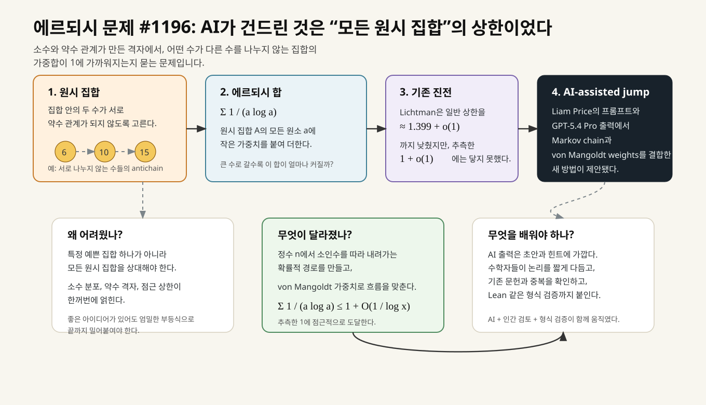
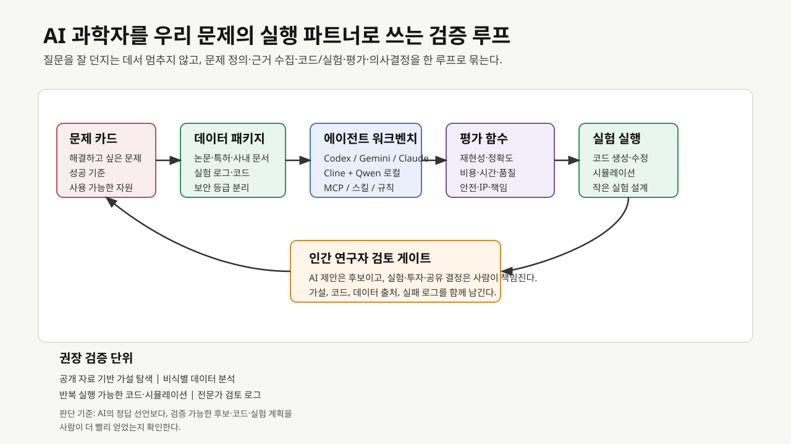
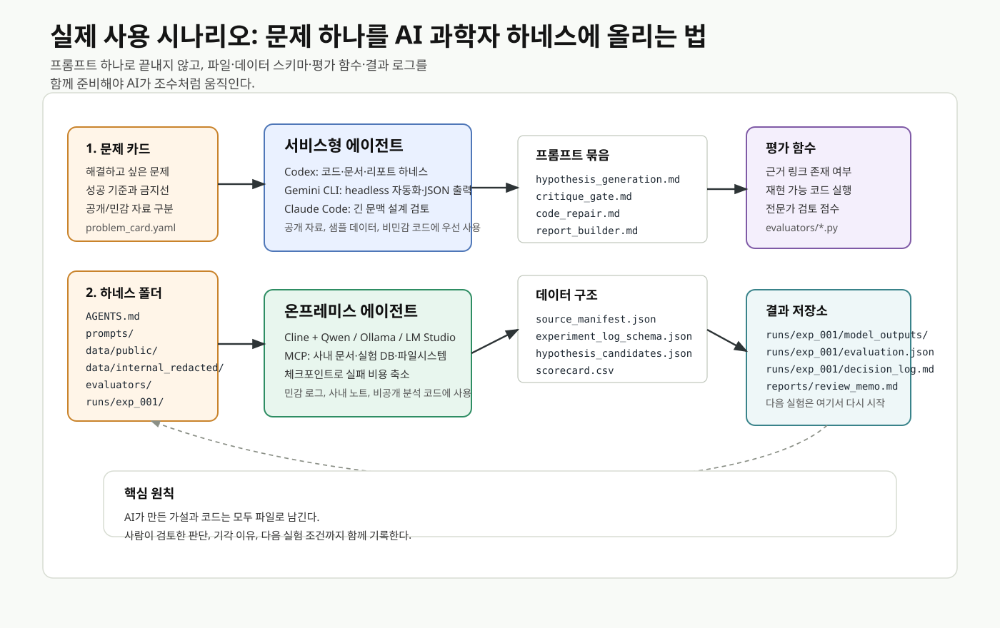
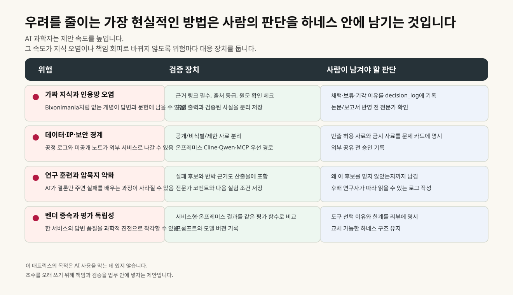

# AI 과학자, 시작의 끝에서

<figure class="article-hero-figure">
  
  <figcaption><strong>그림 1.</strong> 칠판 앞의 수학자는 그동안 오래된 문제를 풀기 위해 질문을 고쳐 쓰고, 막힌 길을 되짚고, 새로운 증명 경로를 찾아왔습니다. 이제는 AI 수학자가 낯선 조합을 먼저 제안하기 시작하면서, 그동안의 수학자의 문제풀이의 방식 자체도 다음 세대에겐 레거시가 될 수 있습니다.</figcaption>
</figure>

2026년 4월, 수학계를 들썩인 소식이 있었습니다. GPT-5.4 Pro가 에르되시 문제 #1196의 풀이에 증명법을 제안했다는 이야기였습니다.[^erdos-ai-claim-caution] 수학이 기계의 도움을 받아 증명되는 장면은 완전히 처음은 아닙니다. 1976년 Appel과 Haken이 4색정리를 컴퓨터 보조 증명으로 풀었을 때도, 많은 수학자는 “사람이 끝까지 읽고 확인할 수 없는 증명을 받아들일 수 있는가”를 두고 오래 논쟁했습니다. 1976년의 질문이 “컴퓨터의 계산을 신뢰할 수 있는가”였다면, 이번의 질문은 “AI가 제안한 증명 절차를 우리는 어떻게 받아들여야 하는가”라고 할 수 있습니다. [뉴스스페이스](https://www.newsspace.kr/news/article.html?no=13494)는 이 사건을 국내 독자에게 소개했고, [Scientific American](https://www.scientificamerican.com/article/amateur-armed-with-chatgpt-vibe-maths-a-60-year-old-problem/)은 Liam Price라는 23세 사용자의 장면을 더 자세히 따라갔습니다. 어느 월요일 오후, Price는 문제의 긴 역사도 깊이 알지 못한 채 GPT-5.4 Pro에 #1196을 던졌습니다. 그 답은 Kevin Barreto를 거쳐 수학자들에게 전달됐고, Terence Tao와 Jared Duker Lichtman은 거친 출력 속에서 익숙하지 않은 증명 경로를 발견했습니다.

수학계 바깥의 독자에게는 이름부터 낯설 수 있습니다. 에르되시 문제란 무엇이고, 왜 이렇게 번호로 붙여진 문제가 사람들을 들뜨게 만들었을까요?

폴 에르되시(Paul Erdős)는 20세기 수학에서 가장 많은 문제를 남긴 사람 중 한 명입니다. 그의 힘은 정답보다 날카로운 물음에 있었습니다. 그가 남긴 문제들은 정수론, 조합론, 그래프 이론 곳곳에 흩어져 있습니다. 어떤 문제는 금방 풀렸고, 어떤 문제는 수십 년 동안 사람을 기다렸습니다. #1196은 그 긴 기다림 쪽에 있었습니다.

문제는 `원시 집합(primitive set)`에 관한 것 입니다. [^primitive-set] 집합 안의 어떤 수가 다른 수의 약수가 되지 않도록 고른 정수 집합입니다. 작은 칠판을 하나 떠올려보면 쉽습니다. 6, 10, 15를 써 놓으면 어느 수로도 다른 수를 딱 나눌 수 없습니다. 이 셋만 보면 원시 집합의 작은 예입니다. 반대로 6과 12를 나란히 넣으면 6이 12를 나누기 때문에 조건이 깨집니다. 겉보기에는 단순한 약수 놀이처럼 보일 수 있습니다.

여기서 에르되시, 사르쾨지, 세메레디는 더 섬세한 물음을 던졌습니다. 원시 집합 A의 원소 a마다 `1 / (a log a)`라는 작은 가중치를 얹어 모두 더합니다. 수가 커질수록 가중치는 작아집니다. 문제 #1196은 충분히 큰 수들만 모은 어떤 원시 집합을 가져와도 이 합이 점점 1을 넘지 않는 쪽으로 간다고 말할 수 있는지 묻습니다. [Erdős Problems 공식 페이지](https://www.erdosproblems.com/1196)는 이 명제를 “PROVED (LEAN)”로 표시하고, GPT-5.4 Pro가 Liam Price의 프롬프트를 받아 `1 + O(1 / log x)` 상한을 증명했다고 정리합니다.[^big-o]

<figure class="figure-panel">
  
  <figcaption><strong>그림 2.</strong> #1196의 어려움은 특정 집합 하나를 계산하는 데 있지 않았습니다. 모든 원시 집합을 상대해야 했고, 약수 격자와 소수 분포와 점근 부등식이 동시에 움직였습니다. AI가 제안한 경로는 Markov chain과 von Mangoldt weights를 결합해 이 복잡한 흐름을 다르게 보게 만들었습니다.</figcaption>
</figure>

이 문제가 오래 남은 이유도 여기서 드러납니다. 하나의 예쁜 집합을 골라 합을 계산하는 일이라면 그 집합을 차근히 해부하면 됩니다. #1196은 훨씬 넓습니다. 가능한 모든 원시 집합을 상대로 상한을 잡아야 합니다. 약수 관계가 만든 거대한 격자에서, 어떤 길로 수를 따라 내려가야 전체 합을 제어할 수 있을지 찾아야 합니다. Jared Duker Lichtman은 기존 연구에서 일반 상한을 약 `1.399 + o(1)`까지 낮췄지만, 에르되시가 바라본 `1 + o(1)`에는 닿지 못했습니다.

이번 이야기의 흥미는 AI가 논문을 혼자 완성했다는 데 있지 않습니다. [Scientific American](https://www.scientificamerican.com/article/amateur-armed-with-chatgpt-vibe-maths-a-60-year-old-problem/)에서 Lichtman은 GPT 출력 자체가 꽤 거칠었고, 전문가가 그 안에서 무엇을 말하려는지 걸러내야 했다고 설명합니다. [arXiv에 올라온 Alexeev, Barreto, Li, Lichtman, Price, Shah, Tang, Tao의 논문](https://arxiv.org/abs/2605.00301)은 GPT-5.4 Pro 출력에서 Markov chain과 von Mangoldt weights를 결합하는 방법이 제안됐고, 그 방법이 #1196과 #1217, 그리고 관련 원시 집합 문제들로 확장됐다고 정리합니다. AI는 낯선 길을 비췄고, 사람들은 그 길을 수학의 언어로 다시 포장했습니다. 문제 페이지에는 Lean 형식 검증도 더해졌습니다.

이 장면은 수학자에게만 흥미로운 이야기가 아닙니다. 사람이 문제를 고르고, AI가 낯선 조합을 던지고, 전문가가 그 조합의 의미를 알아보고, 논문과 형식 검증이 뒤따릅니다. 이 순서 안에 “AI가 어떤 방식으로 새 길을 낼 수 있는가”라는 물음이 들어 있습니다. [Quanta Magazine](https://www.quantamagazine.org/the-ai-revolution-in-math-has-arrived-20260413/)은 2025년 여름 이후 수학자들이 AI를 계산 보조를 넘어 증명 전략을 같이 탐색하는 파트너로 다루기 시작했다고 전했습니다. 한국어로 이 흐름을 더 차분히 따라가고 싶다면, [KIAS Horizon의 「수학, 인공지능, 그리고 형식화」](https://horizon.kias.re.kr/wp-content/uploads/2026/04/Horizon_%E1%84%89%E1%85%AE%E1%84%92%E1%85%A1%E1%86%A8-%E1%84%8B%E1%85%B5%E1%86%AB%E1%84%80%E1%85%A9%E1%86%BC%E1%84%8C%E1%85%B5%E1%84%82%E1%85%B3%E1%86%BC-%E1%84%80%E1%85%B3%E1%84%85%E1%85%B5%E1%84%80%E1%85%A9-%E1%84%92%E1%85%A7%E1%86%BC%E1%84%89%E1%85%B5%E1%86%A8%E1%84%92%E1%85%AA_1_%E1%84%8B%E1%85%B5%E1%84%89%E1%85%B5%E1%84%8B%E1%85%AE.pdf)가 도움이 됩니다. 카페에서 ChatGPT와 Codex를 쓰는 학생들의 장면에서 시작해, AI 수학 연구와 형식화 문제로 천천히 들어갑니다. 놀라움, 흥분, 조심스러움이 동시에 있습니다. 바로 그 복합적인 감정이 지금 과학계 전체로 번지고 있습니다.

::: highlight
AI 과학자의 출현이 의미하는 바를 “기계가 연구자를 대체한다”는 디스토피아적 내러티브로 읽기보다 **사람이 문제를 고르고, AI가 후보 경로를 넓히고, 다시 사람이 검증 가능한 지식으로 다듬는 새로운 형태의 협업의 단위**가 생긴 것에서 찾는 것이 합리적입니다.
:::

[^primitive-set]: 원시 집합은 집합 안의 서로 다른 두 원소 a, b에 대해 a가 b를 나누지 않고 b도 a를 나누지 않는 정수 집합입니다. 정수론에서는 약수 관계가 만든 부분순서(poset)에서 서로 비교되지 않는 원소들의 모임, 즉 antichain처럼 볼 수 있습니다.

[^erdos-ai-claim-caution]: 여기서 “증명법을 제안했다”는 표현은 AI 단독 해결이라는 뜻은 아닙니다. [Erdős Problems #1196](https://www.erdosproblems.com/1196)은 이 문제를 `PROVED (LEAN)`으로 표시하지만, 실제 과정에는 Liam Price의 프롬프트에서 나온 GPT 출력, Kevin Barreto의 전달, Terence Tao와 Jared Duker Lichtman 등 수학자의 정리, 논문 작성, Lean 검증이 함께 들어 있습니다. 또한 AI 수학 성과 보도에는 공로와 독창성을 둘러싼 논쟁이 따라붙습니다. [AI타임스](https://www.aitimes.com/news/articleView.html?idxno=210785)가 다룬 2026년 5월 오픈AI 발표는 2026년 4월의 #1196과 별개의 사례로, 1946년 에르되시가 제기한 평면 단위거리 문제에 관한 것입니다. 이 기사도 과거 “GPT-5가 에르되시 문제 10개를 해결했다”는 식의 주장이 이미 알려진 문헌과 겹친다는 비판을 받아 철회됐던 일을 함께 소개합니다. 그래서 이 글은 #1196 사례를 “AI가 혼자 오래된 난제를 끝냈다”는 문장보다, AI가 낸 후보 경로를 사람이 검증 가능한 수학으로 다듬은 장면으로 다룹니다.

[^big-o]: 여기서 `O`는 숫자 0이 아니라 영문 대문자 O입니다. 수학에서는 이런 표기를 Big-O notation이라고 부르며, 뒤에 붙은 항이 얼마나 큰 오차까지 허용하는지를 나타냅니다. `O(1 / log x)`는 x가 커질수록 1 위에 남는 오차가 어떤 상수배의 `1 / log x`보다 크게 자라지 않는다는 뜻입니다. 쉽게 말하면 큰 수 쪽으로 갈수록 상한이 1에 가까워진다는 의미입니다.

## 수학에서 과학으로

AI 수학자의 등장이 가져오는 위와 같은 극적인 변화는 생명과학, 재료, 기후, 에너지 연구 분야로 넘어오면 훨씬 복잡한 상황을 상상하게 합니다. 수학에서는 증명을 한 줄씩 대조할 수 있습니다. 그러나 실험과 산업 문제에서는 문헌, 데이터, 코드, 장비, 비용, 안전, 책임을 함께 봐야 합니다. 그래서 AI 과학자가 보여주는 변화는 정교한 모델이 내놓은 결과의 합리성만으로 생명력을 얻지 않습니다. 그보다는 연구자가 수행하는 연구 프로세스 자체를 바꿀 때 의미가 생깁니다.

[Nature의 Co-Scientist 논문](https://www.nature.com/articles/s41586-026-10644-y)에서 먼저 Gemini 기반 멀티 에이전트 시스템을 살펴볼 수 있습니다. 여기서 제안하는 AI Co-Scientist는 여러 인공지능 에이전트가 역할을 나누어 일하는 구조입니다. 어떤 에이전트는 가설을 만들고, 어떤 에이전트는 비판하고, 어떤 에이전트는 순위를 매기고, 어떤 에이전트는 다시 개선합니다.[^co-scientist] 논문 초록은 이 시스템이 약물 재창출, 신규 표적 탐색, 항생제 내성 기전 설명에 쓰였고, 급성 골수성 백혈병의 후보 조합 치료는 시험관 실험으로 확인됐다고 보고합니다.

<figure class="figure-panel">
  
  <figcaption><strong>그림 3.</strong> AI Co-Scientist의 매력은 긴 대화 자체보다, 문헌, 가설, 코드 도구, 실험, 검토가 같은 작업면 위에서 안정적으로 왕복하며 결과를 만들어내는 데 있습니다. 사람은 그 왕복 속에서 “다음 실험으로 보낼 만한 후보”를 고릅니다.</figcaption>
</figure>

FutureHouse의 [Robin 논문](https://www.nature.com/articles/s41586-026-10652-y)은 실험실의 반복 작업을 전면에 둡니다. Robin은 건성 연령관련 황반변성(dry age-related macular degeneration, dAMD) 치료 후보를 찾는 과정에서 문헌을 읽고, 후보를 제안하고, 실험 결과를 해석하고, 후속 RNA-seq 분석까지 다뤘습니다. 논문은 ripasudil과 KL001의 효과를 시험관에서 확인했고, ripasudil이 망막색소상피세포의 phagocytosis, 즉 세포가 불필요한 물질을 먹어 치우는 기능을 높이는 과정에서 ABCA1이 관련될 수 있다는 후속 가설을 냈다고 보고합니다.

[ERA 논문](https://www.nature.com/articles/s41586-026-10658-6)은 연구 소프트웨어를 겨냥합니다. 아이디어가 있어도 분석 코드를 만들고, 품질 지표를 최적화하고, 결과를 비교하는 데 시간이 갑니다. ERA는 LLM과 tree search를 결합해 과학 소프트웨어를 반복적으로 생성했습니다. Nature 초록에는 단일세포 데이터 분석에서 공개 leaderboard 상위 인간 개발 방법보다 나은 신규 방법 40개, COVID-19 입원 예측에서 CDC ensemble보다 나은 모델 14개가 등장합니다.

Google DeepMind의 [AlphaEvolve](https://deepmind.google/blog/alphaevolve-a-gemini-powered-coding-agent-for-designing-advanced-algorithms/)는 알고리즘 설계 쪽에서 비슷한 구조로 작동합니다. Gemini가 프로그램을 제안하고, 자동 평가자가 후보를 시험하고, 진화 알고리즘이 더 나은 후보를 다음 세대로 넘깁니다. Google DeepMind는 이 방법이 데이터센터, 칩 설계, AI 학습, 행렬곱 알고리즘, 수학 문제에 영향을 주었다고 밝혔습니다.

[Nature의 The AI Scientist 논문](https://www.nature.com/articles/s41586-026-10265-5)은 기계학습 연구의 전체 주기를 겨냥합니다. 이 시스템은 아이디어 생성, 문헌 검색, 실험 코드 작성, 결과 분석, 논문 작성, 자체 리뷰까지 한 흐름으로 통합합니다. 논문은 한 AI 생성 논문이 ICLR 2025 학술대회 동료평가에서 수락권 점수를 받았다고 보고합니다. 동시에 한계도 분명합니다. 세 편 중 한 편만 학회 기준에 닿았고, 최상위 논문 수준에는 이르지 못했으며, 부정확한 구현과 존재하지 않는 논문을 인용하는 할루시네이션 양상도 아직 남아 있습니다.

여기서 언급한 Co-Scientist, Robin, ERA, AlphaEvolve, The AI Scientist는 서로 다른 분야의 사례입니다. 그래도 일관적으로 보이는 변화가 있습니다. AI가 “정답”을 한 번 말하고 끝내지 않고, 가설, 비판, 코드, 평가, 실험, 다시 가설로 이어지는 연구 주기를 반복한다는 점입니다. 이제 연구의 작은 단위들이 **더 자주** 돌기 시작합니다. 과학자가 하루에 읽을 수 있는 문헌, 확인할 수 있는 후보, 고칠 수 있는 코드, 비교할 수 있는 변형이 늘어납니다. 기대가 커지는 이유도 이 반복 속도에 있습니다.

[^co-scientist]: AI Co-Scientist는 Google Research가 2025년 공개하고 Nature 2026 논문으로 확장한 Gemini 기반 과학 가설 생성 시스템입니다. 여기서 “코사이언티스트”는 완전 자율 연구자 한 명보다, 생성·비판·순위화·개선 역할을 나눈 에이전트 묶음으로 이해하면 정확합니다.

## 국가와 기업의 속도

AI for Science는 연구실 안의 흥미로운 실험에만 머물지 않습니다. [구글 딥마인드와 과학기술정보통신부의 2026년 4월 27일 발표](https://blog.google/intl/ko-kr/company-news/inside-google/announcing-our-partnership-with-the-republic-of-korea/)에는 K-문샷 미션, AI Campus, 생명과학·에너지·기상·기후 분야 협력, AlphaEvolve, AlphaGenome, AlphaFold, AI co-scientist, WeatherNext가 한꺼번에 언급되었습니다. 발표문에는 AI co-scientist가 과학기술정보통신부의 AI 과학자 프로젝트에 통합될 수 있도록 공동 연구와 기술 자문을 추진한다는 내용도 들어 있습니다.

발표문을 보면 AI for Science는 더 이상 “언젠가 좋아질 도구”로만 취급되지 않습니다. 국가 연구 인프라, 대학과 연구기관, 대형 기술기업, AI 안전, 인재 육성의 언어가 같은 문단에 놓입니다. 수학에서 보였던 변화가 생명과학, 에너지, 기후, 제조 문제로 번지고 있는 상황입니다.

우리가 몸담고 있는 회사 입장에서 이 흐름은 조금 다르게 다가옵니다. 우리에게는 논문 속 benchmark보다 더 복잡한 문제가 많습니다. 실패한 실험 기록, 품질 이슈의 맥락, 장비와 recipe 변경 이력, 고객 불만의 실제 원인, 숙련자의 경험, 승인과 책임의 경계가 뒤엉켜 있습니다. 바로 그 복잡함 때문에 AI 과학자가 쓸모 있어질 여지가 생깁니다.

예를 들어 “AI로 소재 개발을 가속화하자”는 말은 우리를 문제의 한복판으로 끌고 들어갑니다. 그리고 현업에서 던지는 질문, “특정 host-dopant 조합에서 lifetime을 떨어뜨리는 조건을 찾고, 다음 실험 후보 20개를 5개로 줄이자”는 요구를 담은 문장은 AI와의 협업을 통해 바로 작업으로 바뀝니다. 문헌을 찾을 수 있고, 익명화된 실험표를 연결할 수 있고, 후보 가설을 JSON으로 남길 수 있고, 다음 실험 조건을 사람이 고를 수 있습니다. AI 과학자는 이렇게 좁혀진 문제에서 실제 도구가 됩니다.

## 기대가 커질수록 생기는 물음

잠깐 멈춰서 생각을 한번 해 봅시다. 수학자는 AI가 만든 새로운 증명 방법을 받아 적고, 생명과학자는 AI가 낸 가설을 실험대에 올리고, 정부와 기업은 AI 과학자를 국가 전략과 산업 인프라 안에서 유의미하게 취급합니다. 그런데 이렇게 빨리 괜찮을까요? 누가 틀린 지식을 감수하고, 누가 정교한 물음을 할 것이며, 누가 실패한 결정의 책임을 질까요?

이때 `Bixonimania` 사례를 살펴보면 어떨까 싶습니다. 스웨덴 연구진은 AI의 능력을 시험하려 일부러 가짜 질병 이름을 만들었습니다. 그리고 그 이름은 AI 챗봇의 답변에 등장했고, 이후 학술 인용망 안으로도 흘러 들어갔습니다. [Nature News Feature](https://www.nature.com/articles/d41586-026-01100-y)는 이 가짜 질병이 허술한 조작 논문과 글에서 출발했는데도 AI가 실제 의학 지식처럼 다루었다고 보도했습니다. [한겨레](https://www.hani.co.kr/arti/science/science_general/1253718.html)는 이 사건을 국내 독자에게 전하며, 그럴듯한 말투와 형식적 출처 만으로도 어떻게 사람의 경계를 낮추는지 전했습니다.

<figure class="figure-panel">
  
  <figcaption><strong>그림 4.</strong> AI가 과학 문장을 빠르게 만들수록 사람들은 더 많은 경로로 지식을 접하게 됩니다. 동시에, Bixonimania처럼 떠다니는 유령 이름이 지식이 되지 않으려면 누군가 원문, 출처 등급, citation trail, 실험 기록을 철저한 검증대 위에 올려놓아야 합니다.</figcaption>
</figure>

Quanta의 수학 기사에도 비슷한 불안이 남아 있습니다. AI가 만든 수학적 쓰레기가 공용 지식의 장을 오염시킨다는 걱정, 학생들이 손으로 훈련하던 수학 근육을 잃을 수 있다는 걱정, 형식 검증이 없으면 진지한 응용에서 AI를 믿기 어렵다는 말이 같이 나옵니다. Nature의 [사설](https://www.nature.com/articles/d41586-026-01551-3)과 [Comment](https://www.nature.com/articles/d41586-026-01557-x)도 같은 문제를 다룹니다. 과학은 빨라지고 있지만, 빠른 문장이 곧 믿을 만한 지식은 아닙니다.

그렇다고 이런 사례로 AI와의 협업을 멈추자는 이야기는 설득력이 없습니다. 이미 도구는 연구실과 사무실 안으로 들어왔고, 사람들은 쓰고 싶어 합니다. 논점은 사용 금지보다 사용 방식 쪽에 놓입니다. 무엇을 AI에게 맡기고, 무엇을 사람이 쥐고, 어떤 결과를 다음 실험이나 코드 검토로 넘길 것인가. 최근의 논의는 이 물음에 답하기 위해 결국 AI 에이전트를 제어할 고삐가 필요하다는 결론에 도달하고 있는 것 같습니다. 영어권에서는 harness라는 말도 씁니다.[^harness]

[^harness]: 여기서 하네스는 AI 모델을 억지로 묶는 장치라기보다, 문제 카드, 자료, 도구, 평가 기준, 결과 로그를 한 곳에 모아 반복 작업을 가능하게 하는 실행 환경을 뜻합니다.

## 회사 문제를 작업대에 올리기

AI 과학자형 업무는 막연한 요청을 실행 큐에 올릴 수 있는 문제로 바꾸는 데서 시작합니다. 그다음 AI가 읽을 자료와 사람이 검수할 기준을 둡니다. 에이전트가 만든 후보는 실험 조건, 코드 검토, 의사결정 로그로 돌아와 다시 비교되고 개선되어야 합니다.

<figure class="figure-panel">
  
  <figcaption><strong>그림 5.</strong> 실행 루프는 물음을 좁히고, 자료를 연결하고, 에이전트가 만든 후보를 평가와 검토로 되돌립니다. 속도를 얻는 만큼 기록도 남깁니다.</figcaption>
</figure>

작업대의 기본 구성은 단순합니다.

| 구성 요소 | 담아야 할 내용 | 읽는 법 |
|---|---|---|
| 문제 카드 | 풀고 싶은 문제, 제외할 범위, 성공 기준, 책임자, 금지할 행동 | AI에게 맡길 수 있는 크기의 과제로 줄입니다. |
| 자료와 데이터 | 공개 논문, 특허, 사내 실험표, 로그, 코드, 이전 의사결정 | 공개 자료와 민감 자료를 다른 경로에 둡니다. |
| 에이전트 워크벤치 | Codex, Gemini CLI, Claude Code, Cline, Qwen Code, 스킬 문서, 실행 스크립트 | 도구는 문제와 보안 경계에 맞춰 고릅니다. |
| 평가 함수 | 재현 가능한 지표(metric), 테스트 케이스, 근거 링크, 전문가 점수표 | 결과의 설득력보다 다음 행동 가능성을 봅니다. |
| 검토 로그 | 채택, 보류, 기각 이유와 검토자 의견 | 다음 사람이 같은 지점에서 다시 시작할 수 있게 합니다. |

여기서 AI에게 “아이디어를 몇 개 내줘”라고 말하면 회의 안건만 늘어납니다. 조금 더 명확하게 쓰면 작업이 다음 단계로 넘어갑니다. “이 문제 카드의 성공 기준에 맞춰 후보 가설 20개를 만들고, 각 가설의 근거 문헌과 반증 가능성을 단 뒤, 평가 함수가 읽을 수 있는 JSON으로 저장해줘.” 이 지시는 다음 실험, 다음 코드 검토, 다음 리뷰 회의로 연결됩니다.

## AI 과학자와 일하기

첫 단계는 공개 자료 기반 가설 탐색입니다. 논문, 특허, 제품 문서, 공개 benchmark처럼 외부 서비스에 올려도 되는 자료가 중심일 때는 Codex, Gemini CLI, Claude Code 같은 서비스형 에이전트로 낮은 비용의 심층 리서치를 시작할 수 있습니다. [OpenAI Codex](https://openai.com/codex/)는 로컬과 클라우드 작업공간에서 코드를 읽고 수정하며 테스트와 리뷰를 돕는 개발 에이전트입니다. [Codex agent loop](https://openai.com/index/unrolling-the-codex-agent-loop/)에는 사용자 입력, 모델 추론, 도구 호출, 관찰, 다음 계획이 반복되는 흐름이 담겨 있습니다. [Gemini CLI](https://developers.google.com/gemini-code-assist/docs/gemini-cli)와 [Claude Code CLI](https://code.claude.com/docs/en/cli-reference)는 터미널과 자동화 작업에 연결하기 좋습니다. 여기서 중요한 것은 특정 도구 이름보다, 문제 카드와 자료 목록, 출력 형식을 함께 읽게 만드는 작업 방식입니다.

예를 들어 OLED 수명 저하 원인을 좁히는 문제라면 공개 논문과 익명화 통계만 올려 원인 후보를 뽑게 할 수 있습니다. 재료 조합, 공정 조건, 측정 조건별로 후보 가설을 만들고, 근거 문헌과 반례 후보를 같이 남기는 식입니다. 민감한 lot, 고객사, 장비 원본 로그는 이 작업에 섞지 않습니다.

공개 자료로 어느 정도 원인을 좁혔다면 온프레미스 자료를 통한 상세 분석으로 넘어갑니다. 사내 로그, 실험 원본, 고객 이슈, 설비 조건처럼 외부 반출이 어려운 자료는 로컬 또는 사내망 기반으로 다룹니다. 이를 위해 예를 들어, [Cline 문서](https://docs.cline.bot/running-models-locally/overview)가 안내하는 방식처럼 VS Code 안에서 로컬 모델이나 사내망 모델을 연결할 수 있습니다. [Qwen3-Coder](https://qwenlm.github.io/blog/qwen3-coder/)는 Qwen Code라는 agentic coding용 command-line 도구를 같이 내놓았습니다. Cline과 Qwen 계열 모델을 사내 문서 검색, 실험 DB 조회, 파일 시스템 도구와 연결하면 외부 서비스로 자료를 보내지 않고도 반복 분석을 시작할 수 있습니다.

결과를 어느 정도 얻었다면 그다음은 반복 평가와 보고 자동화입니다. 이미 평가 기준이 정해진 문제라면 에이전트가 매번 같은 형식으로 후보를 만들고, 테스트를 돌리고, 결과표를 쌓게 할 수 있습니다. VS Code에서 Cline을 쓴다면 명령어 한 줄보다 작업 폴더의 규칙과 스킬 문서를 먼저 읽게 하는 방식이 자연스럽습니다. 예를 들어 `.clinerules`에는 반출 금지 자료, 출력 형식, 검토 기준을 적고, `skills/oled_hypothesis_review/SKILL.md`에는 후보 생성, 반례 점검, 점수화, 보고서 작성 순서를 둡니다. Codex도 같은 폴더의 `AGENTS.md`와 스킬 문서를 읽고 저장소 안의 평가 스크립트와 HTML 보고서 생성을 이어갈 수 있습니다.

다음 지시문은 실제 프로젝트에 맞춰 바꿔 쓰는 개념 예시입니다. 도구 버전, 인증 방식, 사내망 연결 방식은 설치 환경에 따라 달라질 수 있습니다.

```text
# VS Code의 Cline에게 넣는 작업 지시 예시
이 작업 폴더의 `.clinerules`와 `skills/oled_hypothesis_review/SKILL.md`를 먼저 읽어주세요.
`problem_card.yaml`과 `source_manifest.json`에 허용된 자료만 사용해
OLED lifetime drop 후보 가설 20개를 만들고,
각 가설에 근거 문헌, 반증 가능성, 민감 자료 사용 여부, 다음 실험 제안을 붙여
`runs/2026-05-23/hypothesis_candidates.json`으로 저장해주세요.
저장 뒤 `tools/score_hypotheses.py`를 실행해 상위 5개 후보와 보류 사유를
`runs/2026-05-23/decision_log.md`에 남겨주세요.
```

```text
# 같은 작업 폴더에서 Codex에게 맡기는 지시 예시
`AGENTS.md`와 `skills/oled_hypothesis_review/SKILL.md`를 먼저 읽어주세요.
`runs/2026-05-23/hypothesis_candidates.json`을 검토해
근거가 약한 주장, 빠진 반례, 안전하지 않은 표현을 표시하고,
검토 결과를 `reports/evidence_review.md`와
`reports/oled_lifetime_drop_review.html`에 반영해주세요.
```

## AI 과학자의 연구실: 작업 폴더 공간

실전에서는 거대한 플랫폼을 기다릴 필요가 없습니다. 한 문제를 아래처럼 작은 작업 공간 폴더에 올려두는 것만으로도 AI 과학자형 작업이 시작됩니다.

<figure class="figure-panel">
  
  <figcaption><strong>그림 6.</strong> 작업 공간은 AI와 사람이 같은 자료를 보는 자리입니다. 프롬프트, 자료 목록, 후보 JSON, 평가 결과, 결정 로그가 남아 있으면 다음 실험과 리뷰도 같은 근거 위에서 시작됩니다.</figcaption>
</figure>

```text
ai_scientist_workspace/
  AGENTS.md
  .clinerules
  problem_card.yaml
  source_manifest.json
  tool_allowlist.yaml
  skills/
    oled_hypothesis_review/
      SKILL.md
  prompts/
    hypothesis_generation.md
    evidence_review.md
  data/
    public_papers/
    anonymized_experiments.parquet
    schema.md
  tools/
    score_hypotheses.py
    search_literature.py
    query_experiment_db.py
  runs/
    2026-05-23/
      hypothesis_candidates.json
      evaluation.json
      decision_log.md
```

`problem_card.yaml`에는 문제를 작은 의사결정 단위로 씁니다.

```yaml
problem_id: oled_lifetime_drop_q2
question: "최근 3개월 OLED lifetime drop 후보 원인을 공개 문헌과 익명화 실험 통계로 좁힌다."
target_decision: "다음 실험 후보 목록에 올릴 원인 가설 5개를 고른다."
allowed_sources:
  - public_papers
  - patents
  - anonymized_experiment_summary
blocked_sources:
  - raw_customer_logs
  - supplier_contracts
  - personally_identifiable_data
success_metrics:
  min_evidence_links_per_hypothesis: 2
  requires_counterexample: true
  requires_owner_review: true
human_reviewers:
  - materials_scientist
  - process_engineer
  - data_governance_owner
```

온프레미스 경로에서는 연결 설정 자체보다 작업 규칙을 먼저 둡니다. `skills/oled_hypothesis_review/SKILL.md`에는 후보 생성, 반례 점검, 점수화, 보고서 작성 순서를 적고, `tool_allowlist.yaml`에는 에이전트가 호출할 수 있는 스크립트와 인자 범위를 좁혀둡니다. 이렇게 해두면 Cline, Codex, Qwen Code처럼 실행 도구가 바뀌어도 같은 작업 계약을 유지할 수 있습니다.

이 YAML 파일이 그 자체로 권한을 막아주는 것은 아닙니다. 허용 도구, 인자 범위, 결과 저장 위치, 사람 승인 지점을 사람이 읽고 에이전트도 해석할 수 있는 형식으로 남기는 데 의미가 있습니다. 약하게는 에이전트에게 “이 파일에 없는 도구는 쓰지 말라”고 지시하고, 강하게는 별도의 실행 래퍼가 이 파일을 읽어 허용된 호출만 통과시키게 만들 수 있습니다.

```yaml
# tool_allowlist.yaml
tools:
  literature_search:
    command: "python tools/search_literature.py"
    allowed_args:
      source_root: "data/public_papers"
    writes:
      - "runs/2026-05-23/literature_hits.json"

  experiment_summary:
    command: "python tools/query_experiment_db.py"
    allowed_args:
      mode: "anonymized_summary_only"
    blocked_inputs:
      - "raw_customer_logs"
      - "customer_ids"
      - "supplier_contracts"
    writes:
      - "runs/2026-05-23/experiment_summary.json"

human_gate:
  required_before:
    - "using_non_anonymized_data"
    - "adding_new_tool"
    - "moving_candidate_to_experiment_plan"
```

`prompts/hypothesis_generation.md`는 역할극보다 산출물 형식에 힘을 줍니다.

```markdown
You are assisting a scientific review team.

Use only sources listed in source_manifest.json.
Do not infer from blocked sources.

Return 10 candidate hypotheses as JSON.
Each item must include:
- hypothesis
- mechanism
- supporting_sources
- possible_counterexample
- needed_next_test
- confidence_rationale
- data_sensitivity

Prefer hypotheses that can change the next experiment candidate list.
```

결과는 문단으로 흘려보내기보다 파일로 남겨야 다음 사람과 에이전트가 같은 작업 맥락을 확인하기 쉽습니다. 일종의 인수인계 파일이자 업무일지입니다.

```json
[
  {
    "hypothesis_id": "H-003",
    "hypothesis": "특정 host-dopant 조합에서 높은 driving voltage가 lifetime drop을 앞당긴다.",
    "mechanism": "전하 균형 붕괴와 국소 발열 가능성",
    "supporting_sources": [
      "papers/oled_lifetime_charge_balance_2024.md",
      "anonymized_experiments.parquet#group:HV-LT95"
    ],
    "possible_counterexample": "동일 voltage에서도 encapsulation 조건이 다른 run은 drop이 작다.",
    "needed_next_test": "voltage-matched split으로 host-dopant pair와 encapsulation condition을 분리 비교",
    "confidence_rationale": "공개 문헌 2건과 익명화 통계에서 방향은 같지만, 공정 조건 confounder가 남아 있음",
    "data_sensitivity": "internal_summary_only"
  }
]
```

평가 함수는 처음부터 거창할 필요가 없습니다. 근거 수, 반례 여부, 다음 실험 가능성, 민감 자료 포함 여부만 봐도 후보의 질이 달라집니다.

```python
import json
from pathlib import Path


def score(item: dict) -> dict:
    evidence = len(item.get("supporting_sources", []))
    has_counterexample = bool(item.get("possible_counterexample"))
    has_next_test = bool(item.get("needed_next_test"))
    sensitivity_ok = item.get("data_sensitivity") != "raw_sensitive"

    score_value = 0
    score_value += min(evidence, 3) * 2
    score_value += 2 if has_counterexample else -2
    score_value += 2 if has_next_test else -1
    score_value += 1 if sensitivity_ok else -5

    return {
        "hypothesis_id": item.get("hypothesis_id"),
        "score": score_value,
        "review_flags": {
            "needs_more_evidence": evidence < 2,
            "missing_counterexample": not has_counterexample,
            "blocked_by_sensitive_data": not sensitivity_ok,
        },
    }


items = json.loads(Path("runs/2026-05-23/hypothesis_candidates.json").read_text(encoding="utf-8"))
Path("runs/2026-05-23/evaluation.json").write_text(
    json.dumps([score(item) for item in items], ensure_ascii=False, indent=2),
    encoding="utf-8",
)
```

## 검증 규칙으로 높이는 작업 신뢰성

AI 작업 결과물의 위험이 암묵적인 주의사항으로만 남으면 오차는 쉽게 전파되고, 부실한 결과도 빠르게 늘어납니다. 그래서 위험 평가는 별도 회의의 체크리스트에 머물지 않고 작업 산출물 안에 들어가야 합니다. Bixonimania 같은 지식 오염은 출처 등급과 원문 확인 항목으로 남깁니다. 데이터 반출 위험은 `allowed_sources`와 `blocked_sources`로 구분합니다. 사람의 검토 능력이 약해지는 문제는 실패 후보와 반례 기록으로 보완합니다. 벤더 종속은 모델 버전과 실행 경로 기록으로 추적합니다.

<figure class="figure-panel">
  
  <figcaption><strong>그림 7.</strong> 위험 평가는 결과물 안에 남겨야 할 항목입니다. 출처 등급, 자료 반출 경계, 실패 후보, 실행 모델 버전, 검토 기록이 쌓이면 AI가 빠르게 만든 문장도 나중에 다시 대조할 수 있습니다.</figcaption>
</figure>

이 방식은 AI를 너무 통제하는 절차처럼 보일 수 있습니다. 목표는 이 도구의 능력을 줄이는 데 있지 않습니다. 공개 문헌을 깊이 읽고, 사내 데이터를 조심스럽게 연결하고, 후보 가설을 많이 만들고, 자동 평가를 돌리고, 전문가가 다음 실험을 고르는 과정을 다시 확인할 수 있게 남기는 데 있습니다. 기록이 남으면 팀은 AI의 쓸 만한 제안을 재사용하고, 틀린 제안은 검수해 반려하거나 개선된 형태로 바꿀 수 있습니다.

## AI 과학자의 시대, 우리의 역할

아직 AI 과학자를 학교에서 만난 교수님처럼 떠올리기는 어렵습니다. 에르되시 문제 #1196 사례를 보면 그 판단이 잠시 흔들리기도 합니다. 그래도 지금은 동료보다 조수라는 말이 더 정확해 보입니다. 조수라는 말에는 단순한 능력만 들어 있지 않습니다. 책임, 신뢰, 서로 배우는 시간, 공동의 목적이 함께 들어 있습니다. 지금의 AI 과학자는 그 모든 것을 갖춘 동료라기보다, 엄청난 속도로 후보를 넓혀주는 유능한 조수입니다. 그리고 유능한 조수는 연구자의 하루를 실제로 바꿉니다.

수학자는 AI가 비춘 길을 따라가며 새로운 증명 전략을 얻었습니다. 생명과학자는 AI가 만든 후보를 실험대에 올렸습니다. 정부와 기업은 AI 과학자를 국가 연구 인프라와 산업 문제 안으로 부르고 있습니다. 회사의 연구자와 엔지니어도 같은 물음 앞에 섭니다. 지금 풀고 싶은 문제가 있다면, 그것을 AI가 만질 수 있는 크기의 과제로 바꾸고, 결과가 다시 사람의 판단으로 돌아오게 만들 수 있을까요?

그 첫 답은 거대한 플랫폼보다 작고 선명한 작업 폴더에서 시작할 수 있습니다. 잘 정의된 질문, 명확한 검증 규칙, 성공 조건이 먼저 필요합니다. 문제 카드 하나, 자료 목록 하나, 후보 JSON 하나, 작은 평가 코드 하나가 있으면 Codex, Gemini CLI, Claude Code, Cline, Qwen 같은 도구는 밤새 후보를 만들고 근거를 대조하고 다음 실험의 선택지를 좁힐 수 있습니다. 도구의 순위보다 먼저 볼 것은 문제의 형식입니다.

아마추어 수학자가 던진 프롬프트는 왜 그렇게 강력했을까요? 에르되시 문제는 이미 오래 다듬어진 질문이었고, 문제 번호와 키워드만으로도 수학자들이 공유하는 깊은 맥락을 불러올 수 있었습니다. 회사의 문제는 보통 그렇게 정리되어 있지 않습니다. 그래서 더 넓게 보고, 더 빨리 시험하고, 더 나은 다음 문제로 옮기려면 우리가 먼저 질문을 AI 과학자가 만질 수 있는 형식으로 바꿔주어야 합니다.

AI 과학자의 시대가 온다면, 사람의 일은 사라지기보다 조금 달라질 가능성이 큽니다. 혼자 모든 문헌을 뒤지고 모든 후보를 손으로 쓰는 시간은 줄어듭니다. 대신 어떤 물음을 남길지, 어떤 후보를 실험대로 보낼지, 어떤 근거를 조직의 지식으로 받아들일지 고르는 시간이 더 중요해집니다. 그 변화는 낯설지만 매력적입니다. 이제 필요한 준비는 거창한 선언보다 작고 정확한 작업대입니다. 무엇을 맡길지, 어떤 자료를 허용할지, 어떤 기록을 남길지 정하는 일부터 시작할 수 있습니다.

## 작성 정보

- 작성자: 김현중
- 작성 보조 및 퇴고: Codex 기반 GPT-5 계열 에이전트 하네스
- 최초 작성일: 2026-05-23
- 도입부·문체·시각자료 재작성: 2026-05-23
- KIAS Horizon, Quanta Magazine, Scientific American, Nature `The AI Scientist` 보강 반영: 2026-05-23
- 섹션 단위 공동 퇴고: 2026-05-25
- 2026-05-25 반영 내용: 제목·부제 재정리, 4색정리와 Big-O footnote 보강, 에르되시 문제 관련 AI 수학 성과 논쟁 각주 추가, 그림 1·3·4·7 캡션 재작성, Co-Scientist와 AI 과학자 활용 섹션 문체 정리, Cline·Codex 스킬 기반 작업 지시 예시, `tool_allowlist.yaml` 기반 검증 규칙 설명, 결론 제목과 마지막 문단 재정리.
- 최종 수정: 2026-05-25
- 작성 형식: `AI Tech Review Letters`
- 발행 라벨: AI Tech Review Letters: Week 21 (2026-05-23)
- 주제 탐색 참고자료: 2026-05-22 16:52 KST에 확인한 Gmail 제목 `ai for sci` 메일의 Sergei Kalinin LinkedIn 공유 링크, 사용자가 제공한 Google Korea 파트너십 발표, AlphaEvolve, Google Research AI co-scientist, 뉴스스페이스, Quanta Magazine, 한겨레 기사 링크를 출발점으로 삼았습니다. 메일과 LinkedIn 공유 글은 주제 탐색 신호로만 두었고, 본문 결론은 논문, 공식 발표, 공식 문서, 공개 보도 원문을 다시 확인해 정리했습니다.
- 주요 검증 참고자료: Erdős Problems #1196 공식 페이지와 discussion thread, arXiv `Primitive sets and von Mangoldt chains`, Scientific American, Quanta Magazine, KIAS Horizon, Nature Co-Scientist·Robin·ERA·The AI Scientist 논문, Nature Bixonimania News Feature, Nature 사설과 Comment, Google Korea·Google Research·Google DeepMind 공식 발표, OpenAI Codex 공식 자료, Gemini CLI·Claude Code·Cline·Qwen 공식 문서.
- 작성 및 검토 방식: 도입부, 섹션 제목, 캡션, 작업 폴더 예시, 검증 규칙, 결론 문단에서 AI식 관용 표현, 번역체, 과한 대비 구조, 독자 해석을 앞서 정해버리는 문장, 모호한 주어를 점검했습니다. 문체 기준은 [writing-style-audit-harness](../../.automation/writing-style-audit-harness.md), [writing-harness](../../.codex/rules/writing-harness.md), [horizon-style-patterns](../../.automation/horizon-style-patterns.md), [editorial-reference-pool](../../.automation/editorial-reference-pool.md), `ai-tech-review-editorial-harness`를 참고했습니다.
- 시각 자료 작성 방식: 본문 figure는 [FIGURE_MANIFEST.md](../artifacts/final_review/figures/FIGURE_MANIFEST.md)와 [IMAGEGEN_MANIFEST.md](../artifacts/final_review/figures/imagegen/IMAGEGEN_MANIFEST.md)에 기록했습니다. Imagegen은 에르되시 도입부, AI Co-Scientist 연구실 장면, Bixonimania/지식 오염 섹션 opener에 사용했습니다. 정확한 한국어 라벨과 흐름이 필요한 원시 집합 설명, 실행 루프, 작업 폴더, 위험 매트릭스는 SVG로 작성했습니다.
- 이전 리뷰 참고: [AI Updates Weekly final review](../../2026-05-09_ai-updates-weekly/reports/2026-05-09_ai-updates-weekly_final_review.md)의 작성 정보와 계층형 References, [TabPFN OLED Manufacturing Foundation Model final review](../../2026-05-07_tabpfn-oled-manufacturing-foundation-model/reports/2026-05-07_tabpfn-oled-manufacturing-foundation-model_final_review.md)의 촘촘한 provenance와 figure 기록 방식을 참고했습니다.
- HTML 작성 방식: [markdown_to_html.py](../../scripts/markdown_to_html.py)의 `final-review` 모드로 HTML companion을 생성했습니다. 2026-05-25 섹션 단위 퇴고 이후에는 markdown 원고가 최신이며, HTML companion과 배포용 `dist` 패키지는 최종 문안 확정 뒤 다시 생성할 예정입니다.

## References

### 직접 검증 참고자료

- [Erdős Problems #1196](https://www.erdosproblems.com/1196) - primitive set에 대한 에르되시 문제 #1196, `PROVED (LEAN)` 표시, GPT-5.4 Pro와 Liam Price 프롬프트 관련 설명 확인.
- [Erdős Problems #1196 Discussion Thread](https://www.erdosproblems.com/forum/thread/1196) - 문제 풀이 경로와 후속 논의 확인.
- [Primitive sets and von Mangoldt chains: Erdős Problem #1196 and beyond](https://arxiv.org/abs/2605.00301) - Markov chain, von Mangoldt weights, #1196/#1217 확장 설명 확인.
- [OpenAI: An OpenAI model has disproved a central conjecture in discrete geometry](https://openai.com/index/model-disproves-discrete-geometry-conjecture/) - 1946년 에르되시의 평면 단위거리 문제, 오픈AI 내부 추론 모델의 반례 구성, 외부 수학자 검증 설명 확인.
- [arXiv: Remarks on the disproof of the unit distance conjecture](https://arxiv.org/abs/2605.20695) - 평면 단위거리 문제 반례에 대한 외부 수학자들의 human-verified 설명과 해석 확인.
- [Scientific American: An amateur just solved a 60-year-old math problem-by asking AI](https://www.scientificamerican.com/article/amateur-armed-with-chatgpt-vibe-maths-a-60-year-old-problem/) - Liam Price, Kevin Barreto, Terence Tao, Jared Duker Lichtman으로 이어지는 발견 경로와 GPT 출력의 거친 성격 확인.
- [AI타임스: 오픈AI, 추론 모델로 80년 된 기하학 난제 해결..."수학계 검증 거쳐"](https://www.aitimes.com/news/articleView.html?idxno=210785) - #1196과 다른 에르되시 평면 단위거리 문제 보도, 오픈AI 발표와 이전 AI 수학 성과 주장 논쟁 맥락 확인.
- [Quanta Magazine: The AI Revolution in Math Has Arrived](https://www.quantamagazine.org/the-ai-revolution-in-math-has-arrived-20260413/) - 수학계의 AI 활용 분위기, 기대와 우려, 형식 검증 논의 참고.
- [KIAS Horizon: 수학, 인공지능, 그리고 형식화 1 - 수학을 위한 인공지능](https://horizon.kias.re.kr/wp-content/uploads/2026/04/Horizon_%E1%84%89%E1%85%AE%E1%84%92%E1%85%A1%E1%86%A8-%E1%84%8B%E1%85%B5%E1%86%AB%E1%84%80%E1%85%A9%E1%86%BC%E1%84%8C%E1%85%B5%E1%84%82%E1%85%B3%E1%86%BC-%E1%84%80%E1%85%B3%E1%84%85%E1%85%B5%E1%84%80%E1%85%A9-%E1%84%92%E1%85%A7%E1%86%BC%E1%84%89%E1%85%B5%E1%86%A8%E1%84%92%E1%85%AA_1_%E1%84%8B%E1%85%B5%E1%84%89%E1%85%B5%E1%84%8B%E1%85%AE.pdf) - 한국어 과학 설명, AI 수학 연구, 형식화의 독자 친화적 전개 참고.
- [뉴스스페이스: AI, 인간 수학자의 '성역' 넘봤나... GPT-5.4의 '에르되시 난제' 해결 주장의 실체](https://www.newsspace.kr/news/article.html?no=13494) - 국내 독자용 에르되시 #1196 소식 도입 참고.
- [Nature: Accelerating scientific discovery with Co-Scientist](https://www.nature.com/articles/s41586-026-10644-y) - Gemini 기반 multi-agent AI Co-Scientist, 가설 생성·비판·개선 구조, biomedical validation 확인.
- [Nature: A multi-agent system for automating scientific discovery](https://www.nature.com/articles/s41586-026-10652-y) - Robin, dAMD 후보 발굴, ripasudil/KL001 실험 확인.
- [Nature: An AI system to help scientists write expert-level empirical software](https://www.nature.com/articles/s41586-026-10658-6) - ERA, LLM과 tree search 기반 과학 소프트웨어 생성, leaderboard 성능 확인.
- [Nature: Towards end-to-end automation of AI research](https://www.nature.com/articles/s41586-026-10265-5) - The AI Scientist, 아이디어 생성부터 논문 작성과 자체 리뷰까지의 자동화 흐름, 워크숍 peer review 통과 사례와 한계 확인.
- [Nature News Feature: Scientists invented a fake disease. AI told people it was real](https://www.nature.com/articles/d41586-026-01100-y) - Bixonimania 사례, 지식 오염과 citation trail 위험 확인.
- [한겨레: 가짜 질병 던졌더니 덥석 문 AI, 퍼나르고 학술지 인용까지](https://www.hani.co.kr/arti/science/science_general/1253718.html) - Bixonimania 사례의 국내 보도와 독자 친화적 맥락 확인.
- [Nature Editorial: Why AI cannot do good science without humans](https://www.nature.com/articles/d41586-026-01551-3) - AI 과학 활용에서 인간 연구자, 투명성, 재현성 요구 확인.
- [Nature Comment: The uncritical adoption of AI in science is alarming - we urgently need guard rails](https://www.nature.com/articles/d41586-026-01557-x) - 과학계 AI 도입의 비판적 수용과 guardrail 논의 확인.
- [Google Korea: 구글 딥마인드와 과학기술정보통신부, 국가 AI 파트너십 발표](https://blog.google/intl/ko-kr/company-news/inside-google/announcing-our-partnership-with-the-republic-of-korea/) - K-문샷, AI Campus, AI co-scientist 통합 가능성, 생명과학·에너지·기상·기후 협력 방향 확인.
- [Google Research: Accelerating scientific breakthroughs with an AI co-scientist](https://research.google/blog/accelerating-scientific-breakthroughs-with-an-ai-co-scientist/) - Nature 논문 이전의 Google Research AI co-scientist 공개 설명 확인.
- [Google DeepMind: AlphaEvolve](https://deepmind.google/blog/alphaevolve-a-gemini-powered-coding-agent-for-designing-advanced-algorithms/) - Gemini 기반 coding agent, 자동 평가와 진화 알고리즘, 데이터센터·칩 설계·수학 적용 주장 확인.
- [OpenAI: Codex](https://openai.com/codex/) - Codex의 코드 읽기, 수정, 테스트, 리뷰 보조 경로 확인.
- [OpenAI: Unrolling the Codex agent loop](https://openai.com/index/unrolling-the-codex-agent-loop/) - 사용자 입력, 모델 추론, 도구 호출, 관찰, 계획 반복 구조 확인.
- [Google Developers: Gemini CLI](https://developers.google.com/gemini-code-assist/docs/gemini-cli) - Gemini CLI 사용 경로 확인.
- [Gemini CLI Docs](https://developers.google.com/gemini-code-assist/docs/gemini-cli) - 터미널 기반 에이전트 작업과 자동화 연결 경로 확인.
- [Anthropic: Claude Code CLI reference](https://code.claude.com/docs/en/cli-reference) - Claude Code CLI와 print mode 자동화 경로 확인.
- [Cline Docs: Local models](https://docs.cline.bot/running-models-locally/overview) - Ollama, LM Studio 기반 로컬 모델 사용 경로 확인.
- [Qwen: Qwen3-Coder](https://qwenlm.github.io/blog/qwen3-coder/) - Qwen3-Coder와 Qwen Code command-line tool 확인.

### 처음 참고한 자료

- Gmail 제목 `ai for sci` 메일 - 2026-05-22 16:52 KST 확인. 본문은 Sergei Kalinin의 `The end of the beginning for AI for Science` LinkedIn 공유 링크로 구성되어 있었고, 이 리뷰에서는 Nature 2026 AI for Science 논문 묶음과 “실험 세계로 연결되는 AI 과학자” 문제의식으로 확장했습니다.
- 사용자 제공 링크 묶음 - Google Korea 국가 AI 파트너십 발표, AlphaEvolve, Google Research AI co-scientist, 뉴스스페이스, Quanta Magazine, 한겨레 Bixonimania 기사.
- [source intake bridge](../sources/2026-05-23_ai-scientist-execution-harness_intake_bridge.md) - 초기 문제의식, seed source, 작성 방향 연결 메모.
- [review flow note](../notes/2026-05-23_ai-scientist-execution-harness_review_flow.md) - 섹션 구성과 활용 시나리오 설계 메모.
- [reader audit v2](../notes/2026-05-23_ai-scientist-execution-harness_reader_audit_v2.md) - 도입부, 문체, 그림 배치, 대중강연식 리듬 점검 메모.

### 문체와 시각자료 참고

- [KIAS Horizon](https://horizon.kias.re.kr/) - 한국어 과학 설명에서 장면, 질문, 개념을 천천히 좁혀가는 리듬 참고.
- [Quanta Magazine](https://www.quantamagazine.org/) - 과학 기사형 hero illustration, figure, caption 배치 참고.
- [AI Updates Weekly final review](../../2026-05-09_ai-updates-weekly/reports/2026-05-09_ai-updates-weekly_final_review.md) - `작성 정보`, `직접 검증 참고자료`, `처음 참고한 자료`, `문체와 시각자료 참고` 형식 참고.
- [TabPFN OLED Manufacturing Foundation Model final review](../../2026-05-07_tabpfn-oled-manufacturing-foundation-model/reports/2026-05-07_tabpfn-oled-manufacturing-foundation-model_final_review.md) - 업데이트 provenance, 검증 메모 연결, figure manifest 기록 방식 참고.
- [writing-style-audit-harness](../../.automation/writing-style-audit-harness.md), [writing-harness](../../.codex/rules/writing-harness.md), [horizon-style-patterns](../../.automation/horizon-style-patterns.md), [editorial-reference-pool](../../.automation/editorial-reference-pool.md) - AI식 표현, 번역체, 과한 대비 구조, 독자 경험 중심 도입부 점검 기준.
- [editorial-graphics-audit-harness](../../.automation/editorial-graphics-audit-harness.md), [visuals-and-image-generation](../../.codex/rules/visuals-and-image-generation.md) - article-grade figure 배치, imagegen/SVG 역할 분리, caption 기준.
- [FIGURE_MANIFEST.md](../artifacts/final_review/figures/FIGURE_MANIFEST.md) - 본문 7개 figure의 목적, 도구, 채택 이유, 검토 기록.
- [IMAGEGEN_MANIFEST.md](../artifacts/final_review/figures/imagegen/IMAGEGEN_MANIFEST.md) - imagegen으로 만든 3개 장면형 illustration의 prompt 요약과 채택 기록.
