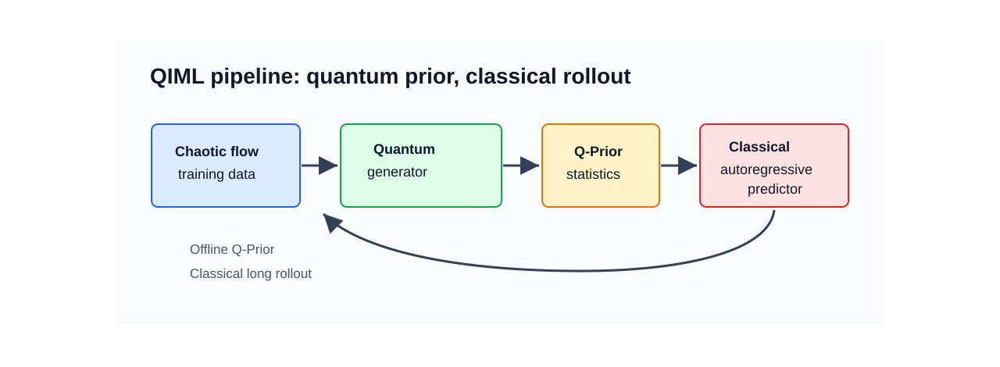
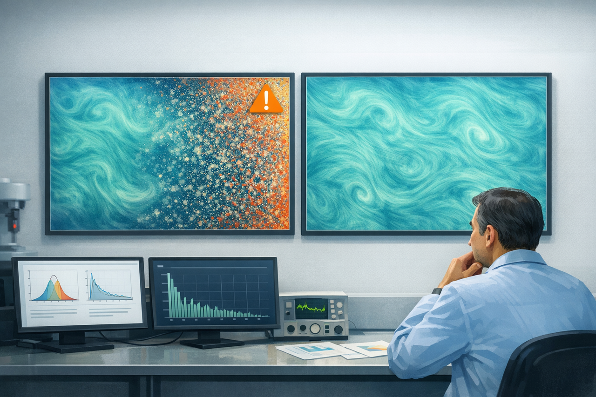
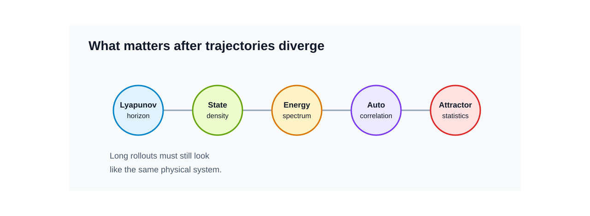
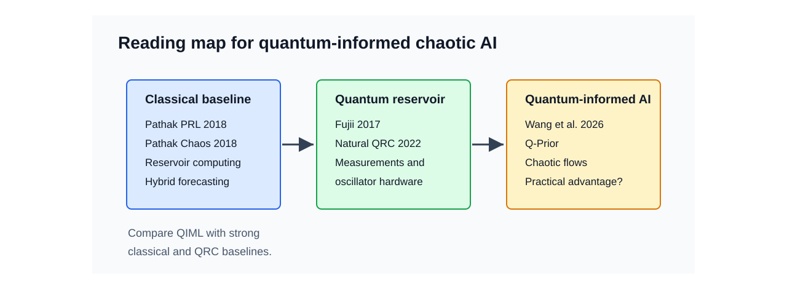
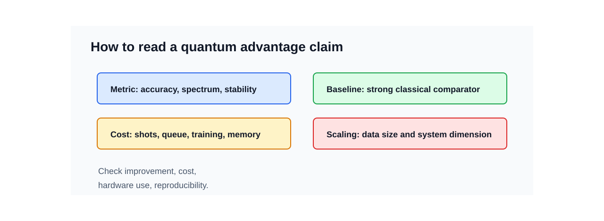

# 혼돈계 예측에 양자 prior를 더하면 무엇이 달라질까

<figure class="article-hero-figure">
  
  <figcaption><strong>그림 1.</strong> QIML이 다루는 장면을 한 화면에 묶었습니다. 왼쪽의 turbulent flow는 작은 오차가 커지는 혼돈계를, 가운데의 Q-Prior 장치는 양자 생성 모델이 압축한 장기 통계를, 오른쪽의 scientific ML 대시보드는 그 prior를 이용한 long rollout 검증 도구를 나타냅니다.</figcaption>
</figure>

먼저 아주 작은 실험을 떠올려보겠습니다. 투명한 물통에 잉크 한 방울을 떨어뜨리면 처음에는 어디서 시작했는지 보입니다. 몇 초가 지나면 잉크는 가느다란 실처럼 휘고, 갈라지고, 서로 말려 들어갑니다. 처음 위치가 아주 조금 달랐다면 나중의 무늬도 달라집니다. 그런데 멀리서 보면 여전히 비슷한 점도 있습니다. 잉크가 퍼지는 속도, 소용돌이의 크기, 진해지는 구역과 옅어지는 구역의 분포는 완전히 아무렇게나 움직이지 않습니다.

혼돈계 예측도 이 장면과 닮았습니다. 여기서 혼돈은 "아무 규칙도 없다"는 뜻이 아닙니다. 규칙은 있지만, 시작점의 작은 차이가 시간이 지나며 크게 벌어지는 동역학계를 말합니다. 그래서 모델이 처음 몇 step을 맞히는 것과, 긴 시간이 지난 뒤에도 그 시스템다운 분포와 물리량을 유지하는 것은 서로 다른 능력입니다.

<figure class="figure-panel">
  
  <figcaption><strong>그림 2.</strong> 물속 잉크 한 방울은 sensitivity to initial conditions를 설명하기 좋은 도구입니다. 자세한 무늬는 조금만 지나도 달라지지만, probability density나 소용돌이 scale처럼 장기 통계 검증에 쓰이는 특징은 남습니다.</figcaption>
</figure>

난류, 유체 흐름, 플라즈마, 일부 화학 반응을 예측할 때도 같은 문제가 나타납니다. 처음에는 그럴듯한 예측이 나옵니다. 하지만 예측을 길게 굴리면 에너지 분포가 흐려지고, 작은 스케일의 움직임이 사라지거나 과장되고, 결국 실제 시스템과 다른 상태로 갑니다. 이때 연구자가 묻는 질문은 단순한 정확도 하나로 끝나지 않습니다. "얼마나 오래 비슷한 장면을 따라갔는가"와 함께 "나중에도 같은 물리계처럼 보이는가"를 봐야 합니다.

[Lev Selector의 2026년 5월 29일 AI Updates Weekly](https://www.youtube.com/watch?v=na-sQ-g2MAc)에서 눈에 들어온 대목도 여기에 있습니다. 영상의 `Quantum-informed AI for Chaotic Processes` 장은 University College London 쪽 연구를 소개하며, 양자 계산이 chaotic/complex system 예측에 도움을 줄 수 있다는 신호를 짧게 다룹니다. 중심 논문은 Wang, Xue, Gao, Coveney의 [Quantum-Informed Machine Learning for Predicting Spatiotemporal Chaos with Practical Quantum Advantage](https://arxiv.org/abs/2507.19861)입니다. 이 논문은 2026년 *Science Advances*에 실렸고 DOI는 [10.1126/sciadv.aec5049](https://doi.org/10.1126/sciadv.aec5049)입니다.

::: highlight
이 논문의 목표는 양자컴퓨터로 유체 시뮬레이션 전체를 대신하겠다는 데 있지 않습니다. 더 현실적인 목표는 **양자 생성 모델이 혼돈계의 장기 통계 구조를 작은 prior로 압축하고, 고전적 scientific ML 예측기가 그 prior를 재사용할 수 있는지** 확인하는 것입니다.
:::

## Q-Prior가 맡는 일

`prior`라는 말부터 풀어보겠습니다. prior는 모델이 예측을 시작하기 전에 가지고 들어가는 배경 지식입니다. 숙련된 연구자가 난류 화면을 볼 때 모든 픽셀을 외우지는 않습니다. 대신 "이 정도 스케일의 소용돌이가 생긴다", "에너지가 이런 식으로 분포한다", "시간 상관은 이 정도로 줄어든다" 같은 감각을 가지고 봅니다. QIML 논문은 이런 감각의 일부를 양자 생성 모델로 배워보려 합니다.

Wang et al. 논문에서 양자 구성요소가 맡는 일은 예측 전체를 실행하는 것이 아닙니다. 먼저 chaotic flow 데이터에서 장기적으로 유지되는 통계 구조를 양자 생성 모델이 학습합니다. 논문은 이 결과를 **Q-Prior**라고 부릅니다. 그다음 Koopman-style 고전 autoregressive predictor가 이 Q-Prior를 loss에 넣어 학습합니다.

<figure class="figure-panel">
  
  <figcaption><strong>그림 3.</strong> Q-Prior는 복잡한 유동장 전체를 저장하는 장치가 아닙니다. 긴 예측에서 잃기 쉬운 invariant statistics를 작은 형태로 보존하고, Koopman-style predictor가 학습과 검증 과정에서 다시 참고하는 도구 역할을 맡습니다.</figcaption>
</figure>

<figure class="figure-panel">
  
  <figcaption><strong>그림 4.</strong> QIML은 양자 생성 모델이 혼돈계의 불변 통계를 Q-Prior로 압축하고, 고전 예측기가 이를 재사용하는 구조입니다. 양자 하드웨어는 prior 학습 단계에 집중됩니다.</figcaption>
</figure>

이 설계는 현재 양자 하드웨어의 제약과도 맞물립니다. NISQ 장비는 잡음, 보정, 샷 수, 대기열, 측정 비용이 모두 부담입니다. QIML은 양자 하드웨어를 매 예측 단계마다 쓰지 않고, 한 번 오프라인으로 prior를 만든 뒤 고전 모델이 그 prior를 계속 사용하게 합니다. 양자가 과학 AI 파이프라인 안에서 좁지만 유용한 역할을 맡을 수 있는지 보는 접근입니다.

논문이 직접 평가한 대상은 세 가지입니다. Kuramoto-Sivashinsky equation, 2D Kolmogorov flow, 3D turbulent channel flow입니다. 영상에서는 weather나 disease spread 같은 응용 가능성도 언급되지만, 이 논문의 직접 benchmark는 위 세 시스템입니다. 보고된 수치도 둥글게 "20% 정도"로 받아들이기보다 정확히 읽는 편이 좋습니다. 논문은 classical baseline 대비 predictive distribution accuracy를 최대 17.25%, full-spectrum fidelity를 최대 29.36% 개선했다고 보고합니다.

## 긴 예측에서 남아야 할 물리량

혼돈계 예측을 평가할 때 one-step MSE만 보면 놓치는 부분이 많습니다. 한 장면의 픽셀이나 상태 벡터가 잠깐 맞는 것과, 긴 rollout 뒤에도 실제 시스템의 분포와 스펙트럼을 유지하는 것은 다른 문제입니다. 쉽게 말하면, "다음 사진 한 장"을 맞히는 시험과 "오래 지나도 같은 종류의 물리 현상을 만들고 있는지"를 보는 시험은 다릅니다.

<figure class="figure-panel">
  
  <figcaption><strong>그림 5.</strong> 긴 예측에서는 화면이 그럴듯해 보이는지와 함께 probability density, energy spectrum, autocorrelation이 실제 물리계의 범위 안에 남아 있는지를 검증해야 합니다. 이때 대시보드와 비교 도구는 예측의 물리적 일관성을 보는 데 쓰입니다.</figcaption>
</figure>

<figure class="figure-panel">
  
  <figcaption><strong>그림 6.</strong> 혼돈계 예측에서는 단기 오차와 함께 상태 분포, 에너지 스펙트럼, 자기상관, attractor statistics를 확인해야 합니다. 긴 시간 뒤에도 같은 물리계처럼 보이는지가 평가의 핵심입니다.</figcaption>
</figure>

| 평가 관점 | 확인할 질문 |
|---|---|
| Lyapunov-time horizon | 개별 궤적을 몇 Lyapunov time 동안 따라가는가 |
| Probability density | 상태 분포의 중심과 tail이 유지되는가 |
| Energy spectrum | 큰 scale과 작은 scale의 에너지 분포가 보존되는가 |
| Autocorrelation | 시간 상관이 실제 시스템과 비슷하게 줄어드는가 |
| Attractor statistics | Lyapunov exponent, correlation dimension 같은 장기 구조를 재현하는가 |

QIML 논문이 흥미로운 이유는 이런 장기 통계 평가를 전면에 놓기 때문입니다. 특히 turbulent channel inflow 사례에서는 Q-Prior가 빠졌을 때 예측이 불안정해지고, Q-Prior가 들어간 모델은 더 물리적으로 일관된 장기 예측을 보였다고 설명합니다.

이 지점은 제조, 소재, 공정 데이터에서도 의미가 있습니다. 많은 공정 데이터와 물리 시뮬레이션은 시간이 길어질수록 분포가 무너지는 문제를 겪습니다. OLED 소재 계산, 열 공정, plasma, chemical kinetics, biofluid, 일부 이상징후 예측도 모두 "긴 시간 뒤의 평균적인 모양"이 중요해지는 순간을 가질 수 있습니다. Q-Prior가 정말로 invariant statistical property를 작게 보존한다면, 양자 AI의 실용성은 "멋진 가속"보다 "긴 예측에서 분포가 덜 무너지는가"라는 질문으로 평가해야 합니다.

## 같이 읽어야 하는 세 갈래

QIML 논문 하나만 읽으면 이 분야를 과대평가하거나 과소평가하기 쉽습니다. 최소한 세 갈래를 같이 놓고 봐야 합니다.

<figure class="figure-panel">
  
  <figcaption><strong>그림 7.</strong> QIML의 의미는 classical reservoir computing, quantum reservoir computing, quantum-informed prior 설계를 함께 비교할 때 선명해집니다. 특히 강한 고전 baseline과 비용 포함 비교가 중요합니다.</figcaption>
</figure>

첫째, classical reservoir computing입니다. Pathak et al.의 [Model-Free Prediction of Large Spatiotemporally Chaotic Systems from Data](https://doi.org/10.1103/PhysRevLett.120.024102)는 chaotic forecasting에서 reservoir computing이 왜 강한 baseline인지 보여준 논문입니다. 이어지는 [Hybrid Forecasting of Chaotic Processes](https://doi.org/10.1063/1.5028373)는 물리 모델과 ML을 섞는 관점을 제공합니다. QIML을 읽을 때도 이 계열과 비교하지 않으면 양자 구성요소의 실제 기여를 분리하기 어렵습니다.

둘째, quantum reservoir computing입니다. Fujii and Nakajima의 [Harnessing Disordered-Ensemble Quantum Dynamics for Machine Learning](https://doi.org/10.1103/PhysRevApplied.8.024030)은 QRC의 초기 핵심 논문입니다. 이후 [Natural quantum reservoir computing](https://www.nature.com/articles/s41598-022-05061-w), [Time-series QRC with weak and projective measurements](https://www.nature.com/articles/s41534-023-00682-z), [QRC with coherently coupled quantum oscillators](https://www.nature.com/articles/s41534-023-00734-4)는 실제 하드웨어, 측정 방식, oscillator 기반 구현 문제를 넓혔습니다.

셋째, chaotic process에 직접 붙은 최신 QRC 연구입니다. Ahmed, Tennie, Magri의 [recurrence-free quantum reservoir computing](https://arxiv.org/abs/2405.03390)은 Lorenz-63, Lorenz-96, MFE turbulent shear flow의 extreme event 예측을 다룹니다. Steinegger and Raeth의 [four-qubit QRC](https://www.nature.com/articles/s41598-025-87768-0)는 작은 qubit system으로 3D chaotic systems의 short-term forecast와 long-term climate를 평가합니다. Kobayashi and Motome의 [Edge of Many-Body Quantum Chaos in Quantum Reservoir Computing](https://arxiv.org/abs/2506.17547)는 classical reservoir의 edge-of-chaos 직관을 quantum many-body system으로 확장하려는 설계 원리입니다.

## Quantum advantage라는 말을 분해해서 읽기

이 분야에서는 `quantum advantage`라는 표현이 자주 나옵니다. 좋은 연구 신호와 홍보성 표현이 함께 섞이기 쉬운 단어입니다. 그래서 주장을 볼 때는 먼저 metric, baseline, 비용, 하드웨어 조건을 나누어야 합니다.

<figure class="figure-panel">
  
  <figcaption><strong>그림 8.</strong> `practical quantum advantage`는 정확도 개선만으로 충분하지 않습니다. 어떤 metric에서 좋아졌는지, 어떤 고전 baseline과 비교했는지, QPU shot과 보정 비용까지 고려했는지 확인해야 합니다.</figcaption>
</figure>

| 주장 | 확인할 것 |
|---|---|
| 더 정확하다 | 어떤 metric에서, 어떤 baseline 대비, 어떤 데이터셋에서 좋아졌는가 |
| 더 작다 | parameter 수인지, 저장공간인지, 학습 데이터인지, QPU shot 비용까지 포함한 것인지 |
| 더 안정적이다 | long rollout에서 PDF, spectrum, autocorrelation이 유지되는가 |
| 양자 하드웨어를 썼다 | emulator인지 실제 QPU인지, qubit 수와 shot 수, error mitigation 방식은 무엇인지 |
| practical quantum advantage | classical prior와 비용 포함 비교, 독립 재현, scaling test가 있는지 |

Wang et al. 논문은 이 중 일부를 꽤 진지하게 다룹니다. [공식 GitHub 저장소](https://github.com/UCL-CCS/QIML)와 [Zenodo 데이터](https://doi.org/10.5281/zenodo.16419085)가 공개되어 있어 재현 검토의 출발점도 있습니다. 다만 저장소 README를 보면 training script 경로와 hard-coded data path 같은 실무적 caveat가 보입니다. 재현 가능성은 "코드가 있다"에서 끝나지 않고, 데이터 경로, QPU 조건, classical baseline 재학습, 비용 산정까지 따라가야 합니다.

## 용어 정리

| 용어 | 짧은 설명 | 이 글에서의 의미 |
|---|---|---|
| Chaotic process | 초기 조건의 작은 차이가 시간이 지나며 크게 벌어지는 동역학계입니다. | 한 궤적을 오래 맞히기보다 장기 통계를 유지하는 평가가 중요합니다. |
| Q-Prior | QIML 논문에서 양자 생성 모델이 학습한 통계적 prior입니다. | 고전 예측기의 loss에 들어가 장기 통계 일관성을 보완합니다. |
| Koopman-style predictor | 비선형 동역학을 더 다루기 쉬운 표현 공간에서 예측하려는 계열의 모델입니다. | QIML에서는 autoregressive predictor의 고전적 예측 골격으로 사용됩니다. |
| Reservoir computing | 고정된 동역학 reservoir와 학습 가능한 readout을 이용하는 시계열 예측 접근입니다. | chaotic forecasting의 강한 classical baseline입니다. |
| Quantum reservoir computing | 양자계의 동역학을 reservoir로 활용하는 QML 접근입니다. | QIML과 직접 같은 구조는 아니지만 비교해야 할 인접 계열입니다. |
| Full-spectrum fidelity | 예측된 에너지 스펙트럼이 실제 시스템의 스펙트럼을 얼마나 잘 유지하는지 보는 평가입니다. | 난류와 유동 예측에서 long rollout 품질을 읽는 중요한 지표입니다. |

## 리뷰 결론

이 주제는 AI_Tech_Review Letters로 다룰 만한 가치가 있습니다. 지금 단계에서 가장 생산적인 결론은 양자 AI가 고전 ML을 대체한다는 선언이 아닙니다. QIML은 고전 모델이 긴 rollout에서 잃어버리기 쉬운 장기 통계 감각을 양자 생성 prior가 보완할 수 있는지 보여준 초기 강한 신호입니다.

다음 리뷰에서는 세 가지를 더 확인하면 좋겠습니다.

1. Q-Prior는 classical VAE, diffusion prior, tensor-network prior보다 어떤 조건에서 실제로 낫습니까?
2. QPU shot 수, calibration, queue, 데이터 전처리 비용을 포함해도 memory/accuracy 이득이 유지됩니까?
3. noisy measurement와 partial observation이 있는 실제 공정 데이터에서도 invariant measure를 배울 수 있습니까?

논문이 제시한 개선 수치만 보면 매력적입니다. 하지만 이 분야의 가치는 benchmark 숫자보다 조금 더 깊은 곳에 있습니다. 양자 하드웨어가 과학 AI 파이프라인에서 맡을 수 있는 역할을 "장기 통계 prior"로 좁혀 본 점, 그리고 그 prior가 실제 난류 예측에서 물리적 일관성을 얼마나 보존하는지 검토한 점이 중요합니다.

## 참고자료

- Lev Selector, [Exciting AI Updates Weekly - May 29, 2026](https://www.youtube.com/watch?v=na-sQ-g2MAc)
- Wang et al., [Quantum-Informed Machine Learning for Predicting Spatiotemporal Chaos with Practical Quantum Advantage](https://arxiv.org/abs/2507.19861)
- Wang et al., [Science Advances DOI 10.1126/sciadv.aec5049](https://doi.org/10.1126/sciadv.aec5049)
- UCL CCS, [QIML official implementation](https://github.com/UCL-CCS/QIML)
- Wang et al., [QIML dataset on Zenodo](https://doi.org/10.5281/zenodo.16419085)
- Pathak et al., [Model-Free Prediction of Large Spatiotemporally Chaotic Systems from Data](https://doi.org/10.1103/PhysRevLett.120.024102)
- Pathak et al., [Hybrid Forecasting of Chaotic Processes](https://doi.org/10.1063/1.5028373)
- Fujii and Nakajima, [Harnessing Disordered-Ensemble Quantum Dynamics for Machine Learning](https://doi.org/10.1103/PhysRevApplied.8.024030)
- Negoro et al., [Natural quantum reservoir computing](https://www.nature.com/articles/s41598-022-05061-w)
- Mujal et al., [Time-series quantum reservoir computing with weak and projective measurements](https://www.nature.com/articles/s41534-023-00682-z)
- Ghosh et al., [Quantum reservoir processing with coherently coupled quantum oscillators](https://www.nature.com/articles/s41534-023-00734-4)
- Ahmed, Tennie, Magri, [Prediction of chaotic dynamics and extreme events: RF-QRC](https://arxiv.org/abs/2405.03390)
- Steinegger and Raeth, [Predicting three-dimensional chaotic systems with four qubit quantum systems](https://www.nature.com/articles/s41598-025-87768-0)
- Kobayashi and Motome, [Edge of Many-Body Quantum Chaos in Quantum Reservoir Computing](https://arxiv.org/abs/2506.17547)

## Article Metadata

- 작성 형식: `AI Tech Review Letters`
- 발행 라벨: AI Tech Review Letters: Week 22 (2026-05-30)
- 영상 intake: `Exciting AI Updates Weekly - May 29, 2026`
- 원고 생성: 2026-05-30
- 그림 manifest: `artifacts/final_review/figure_manifest.md`
