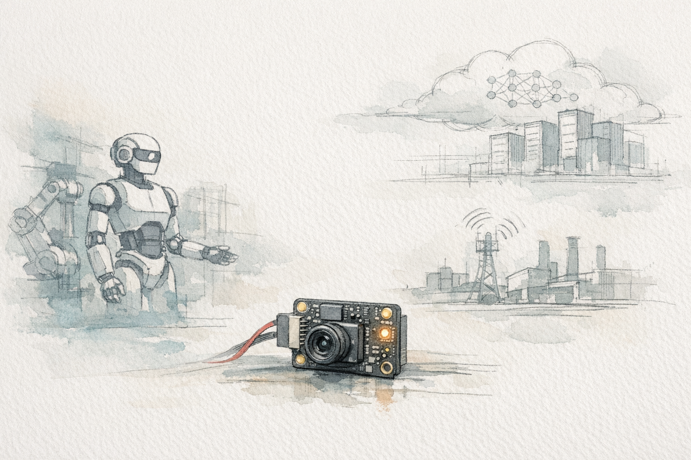
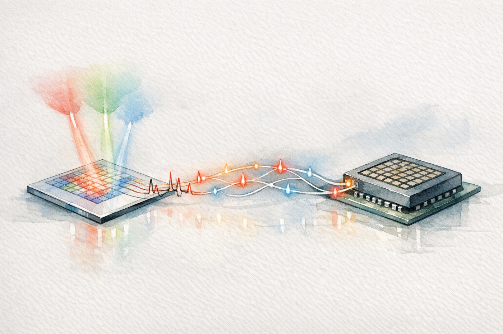
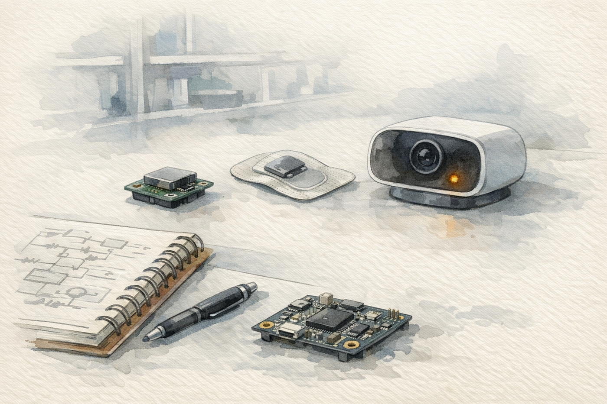

# 뉴로모픽, 물리적 AI의 반응 시간을 줄이는 기술

<figure class="article-hero-figure">
  
  <figcaption><strong>그림 1.</strong> 생성 일러스트. 이 글의 핵심 질문은 "뉴로모픽이 LLM을 대체하는가"보다 "실제 세계의 빠른 센서 신호를 어느 계층에서 먼저 처리할 것인가"입니다. 그림은 물리 세계, 센서 가까운 지각 계층, 상위 에이전트 모델 계층, 검증 대상 로봇 환경의 역할 분리를 설명하기 위한 편집 이미지입니다.</figcaption>
</figure>

::: highlight
뉴로모픽 컴퓨팅은 LLM의 언어 추론을 곧바로 대체하기보다, 물리적 AI가 센서 데이터를 너무 늦게, 너무 많이, 너무 멀리 보내지 않도록 돕는 감각·반응 계층을 만듭니다. 2026년의 중요한 변화는 이 계층이 논문 속 소자 시연을 넘어 edge SoC, event vision, radar, audio, wearable 쪽의 구체적 검토 대상으로 이동하고 있다는 점입니다.
:::

최근 로봇과 에이전트 AI를 따라가다 보면 이상한 긴장감이 생깁니다. 한쪽에서는 더 큰 LLM과 VLA(vision-language-action model)가 로봇의 뇌가 될 것처럼 이야기합니다. 다른 한쪽에서는 그 모델을 실제 로봇과 공장, 웨어러블에 올리려는 순간 전력, 지연, 센서 데이터, 네트워크 의존성 문제가 바로 튀어나옵니다. 텍스트 화면 안에서는 몇 초 늦은 답변도 참을 수 있지만, 로봇의 눈과 팔은 그렇게 기다려주지 않습니다.

이 지점에서 뉴로모픽 컴퓨팅이 다시 흥미로워집니다. 뉴로모픽은 뇌의 신경 구조와 계산 방식을 본뜬 하드웨어·알고리즘 접근입니다. 오래된 연구 분야지만, 2026년에 다시 눈에 띄는 배경에는 physical AI의 현실적인 제약이 있습니다. 모든 감각 데이터를 큰 모델로 보내는 방식은 실제 세계의 속도와 전력 조건을 감당하기 어렵습니다. 센서 가까이에서 중요한 변화만 잡고, 낮은 전력으로 반응하고, 필요한 정보만 상위 모델로 넘기는 층이 필요합니다.

[사이언스타임즈가 2026년 3월 소개한 기사](https://www.sciencetimes.co.kr/nscvrg/view/menu/250?nscvrgSn=261508&searchCategory=222)는 이 흐름을 잘 보여주는 논문 하나를 다룹니다. 기사 제목은 “로봇의 눈이 스스로 생각도 하는 뉴로모픽 비전”입니다. 표현은 대중적이지만, 문제의식은 정확합니다. 로봇의 카메라가 세상을 본 뒤 CPU나 GPU로 모든 영상을 보내고, 다시 계산 결과를 받아 움직이는 구조는 지연과 전력 소모를 피하기 어렵습니다. 카메라가 들어오는 순간부터 어느 정도 의미 있는 신호를 만들 수 있다면, 피지컬 AI의 반응 시간은 달라질 수 있습니다.

<figure class="figure-panel">
  
  <figcaption><strong>그림 2.</strong> 피지컬 AI에서 큰 모델은 계획과 언어 이해를 맡을 수 있지만, 실제 세계의 센서 신호는 훨씬 빠르고 전력에 민감합니다. 뉴로모픽 edge layer는 raw data를 모두 보내지 않고 중요한 이벤트를 먼저 걸러내는 하위 계층으로 검토할 수 있습니다.</figcaption>
</figure>

## MoS2 시각 소자

기사에 연결된 논문은 [Wang et al.의 Nature Communications 2026 논문](https://www.nature.com/articles/s41467-026-68905-3)입니다. 연구진은 이황화몰리브덴(MoS2) 기반 광트랜지스터를 optoelectronic LIF neuron으로 사용하고, HZO(hafnium-zirconium oxide) 강유전층을 포함한 MoS2 FeFET를 인공 시냅스로 사용했습니다. LIF neuron은 leaky integrate-and-fire neuron의 줄임말입니다. 들어오는 신호를 조금씩 쌓다가 기준값을 넘으면 spike를 내고 다시 초기화되는 간단한 신경세포 모델입니다.

이 연구의 의미는 빛 감지와 스파이크 인코딩, 비휘발성 가중치 저장을 하나의 플랫폼 안에 올렸다는 데 있습니다. 기존 카메라는 빛을 전기 신호로 바꾼 뒤, 그 데이터를 별도 프로세서로 보냅니다. 연구진의 구조에서는 센서가 빛의 세기와 파장을 받아 spike train을 만들고, 그 spike가 ferroelectric synapse array의 가중합 연산에 입력됩니다.

<figure class="figure-panel">
  
  <figcaption><strong>그림 3.</strong> 생성 일러스트. Wang et al. 논문의 실제 장치 사진으로 보기는 어렵고, 빛 감지, spike 인코딩, 시냅스 가중치 저장이 한 흐름으로 붙는다는 개념을 설명하기 위한 편집 이미지입니다. 근거 구조와 테스트 조건은 아래 그림 4와 논문 원문을 기준으로 확인해야 합니다.</figcaption>
</figure>

<figure class="figure-panel">
  
  <figcaption><strong>그림 4.</strong> Wang et al. 2026 논문은 만능 카메라보다 통합 방향을 제시합니다. MoS2 광트랜지스터가 빛을 spike로 바꾸고, HZO/MoS2 FeFET가 가중치를 저장하며, 작은 SNN 시스템이 그 신호를 분류합니다.</figcaption>
</figure>

논문은 두 가지 encoding을 함께 씁니다. 하나는 rate coding입니다. 빛이 강할수록 일정 시간 안에 spike가 더 많이 나옵니다. 다른 하나는 TTFS(time-to-first-spike)입니다. 자극이 강할수록 첫 spike가 더 빨리 나옵니다. 자율주행이나 로봇 안전 감시처럼 갑작스러운 위험을 빨리 잡아야 하는 장면에서는 첫 반응 시간이 중요합니다. 반대로 색상과 패턴을 더 안정적으로 구분하려면 spike 빈도도 의미가 있습니다.

여기서 용어를 조금만 더 풀어보면 이렇습니다. Spike는 연속적인 숫자 벡터와 달리 짧은 사건 신호입니다. SNN(spiking neural network)은 이런 사건 신호의 시간 패턴을 다루는 신경망입니다. FeFET(ferroelectric field-effect transistor)는 강유전 물질의 분극 상태를 이용해 전도 상태, 즉 가중치에 해당하는 값을 오래 보존할 수 있는 트랜지스터입니다. 그래서 이 논문의 장점은 "카메라가 사진을 찍고 AI가 나중에 보는 구조"에서 벗어나, 빛이 들어온 자리에서 시간 신호와 가중치 연산의 일부가 이미 시작된다는 데 있습니다.

논문은 이 통합 SNN 시스템이 RGB 색상 인식에서 91.7%, 객체 검출에서 93.5%의 정확도를 얻었다고 보고합니다. 사이언스타임즈 기사의 주요 수치도 여기서 나왔습니다. 다만 이 수치는 상용 로봇 카메라의 성능 지표라기보다 실험실 규모의 시스템 검증 결과입니다. 논문 본문은 현재 하드웨어 한계 때문에 RGB color classification capability를 simulation으로 검증했다고 밝힙니다. 또한 상용 neuromorphic chip과 비교하면서 이 구조가 optoelectronic fusion과 circuit simplification의 장점은 있지만, system scale과 energy efficiency가 아직 개선 영역이라고 적습니다.

그래서 이 논문은 “로봇의 눈이 곧 사람처럼 생각한다”는 결론보다 “센서와 계산의 경계가 앞으로 어디까지 당겨질 수 있는가”를 확인하는 논문으로 읽는 편이 정확합니다.

::: evidence
이 연구의 확인된 성과는 MoS2 광전자 neuron과 MoS2/HZO ferroelectric synapse의 통합, rate/TTFS coding, 91.7%/93.5% task 결과입니다. 상용 robot vision module 수준의 검증이나 대규모 array 실증은 아직 아닙니다.
:::

## 큰 모델이 놓치는 물리적 시간

LLM의 한계를 말할 때 우리는 보통 데이터, 비용, hallucination, reasoning, 저작권 같은 문제를 떠올립니다. physical AI에서는 여기에 더 단순하지만 더 치명적인 문제가 붙습니다. 느리면 부딪히고, 많이 쓰면 배터리가 떨어지고, 계속 보내면 네트워크가 막히고, raw sensor data를 밖으로 내보내면 프라이버시가 깨집니다.

2026년의 physical AI 발표들을 보면 이 수요가 더 뚜렷합니다. [NVIDIA는 GTC 2026에서 Physical AI Data Factory Blueprint](https://nvidianews.nvidia.com/news/nvidia-announces-open-physical-ai-data-factory-blueprint-to-accelerate-robotics-vision-ai-agents-and-autonomous-vehicle-development)를 발표하며 로봇, vision AI agent, autonomous vehicle을 위한 데이터 생성·증강·평가 구조를 강조했습니다. [Qualcomm도 2026년 초 robotics technology suite](https://www.qualcomm.com/news/releases/2026/01/qualcomm-introduces-a-full-suite-of-robotics-technologies-power)를 physical AI 스택으로 설명했습니다. 큰 모델과 simulation, VLA, VLM이 로봇 지능의 상위 계층을 밀어 올리고 있습니다.

그런데 실제 기계는 상위 계층만으로 움직이지 않습니다. 카메라, 레이더, 마이크, 촉각 센서, 생체 신호 센서는 계속 데이터를 만듭니다. 모든 데이터를 큰 모델로 넘기면 모델은 똑똑해도 시스템은 둔해질 수 있습니다. 뉴로모픽이 노리는 자리는 바로 그 사이입니다. 입력이 있을 때만 계산하는 event-driven processing, 메모리와 연산을 가까이 두는 compute-memory co-location, 센서 단계에서 feature를 만드는 in-sensor computing은 큰 모델의 지능과 다른 종류의 지능입니다.

[npj Unconventional Computing의 2026년 AI-native robotic vision 리뷰](https://www.nature.com/articles/s44335-025-00047-z)는 이 문제를 로봇 시각 관점에서 잘 정리합니다. 기존 robotic vision system은 image sensor와 processor가 분리되어 있고, raw data는 noise reduction, white balance, contour extraction, motion detection 같은 여러 image signal processing 단계를 거쳐야 합니다. 이 과정은 지연과 전력 소모를 만듭니다. 반면 in-sensor computing은 feature enhancement, spike encoding, convolutional filtering 같은 연산을 sensory level에서 수행해 AI inference에 맞는 visual data를 바로 만들 수 있습니다.

조금 더 쉽게 말하면, 뉴로모픽은 로봇에게 “모든 장면을 고해상도 영상으로 설명한 뒤 생각하자”고 말하지 않습니다. 먼저 “방금 무언가 움직였다”, “소리가 특정 패턴으로 바뀌었다”, “이 vibration은 평소와 다르다”, “이 빛의 변화는 위험 신호일 수 있다”를 낮은 비용으로 감지합니다. 큰 모델은 그 다음 판단을 맡을 수 있습니다.

## 상용화의 첫 시장

뉴로모픽을 이야기할 때 흔히 나오는 질문이 있습니다. “그럼 GPU를 대체해서 LLM을 학습시키는가?” 지금의 가까운 시장은 데이터센터 LLM 훈련보다 edge sensing과 always-on inference 쪽입니다.

[Nature Communications의 2025년 상용화 전망 논문](https://www.nature.com/articles/s41467-025-57352-1)은 이 지점을 매우 분명히 짚습니다. 저자들은 뉴로모픽의 killer app 하나를 찾기보다, 어떤 기존 processor와 application을 보강할 수 있는지 보는 편이 더 적절하다고 말합니다. 그리고 초기 상용 시장으로 battery-powered system, local compute for IoT, consumer wearable, audio/visual wake phrase, gesture interaction, condition and anomaly detection을 제시합니다.

<figure class="figure-panel">
  
  <figcaption><strong>그림 5.</strong> 뉴로모픽은 GPT 계열 모델보다 MCU, DSP, NPU, low-power accelerator와 가까운 자리에서 먼저 경쟁합니다. 특히 항상 켜진 시간 신호와 센서 이벤트를 다루는 workload에서 강점이 먼저 드러납니다.</figcaption>
</figure>

상용화 논문에서 또 중요한 부분은 programming model입니다. 과거에는 SNN application을 만들려면 뉴로모픽 hardware를 잘 아는 전문가가 직접 구조를 설계해야 했습니다. 이제 surrogate gradient와 gradient-based training, deep learning toolchain과 이어지는 open-source framework가 나오면서, 개발자가 기존 ML workflow에 가깝게 SNN을 만들 수 있는 길이 생기고 있습니다. 뉴로모픽이 제품으로 들어가려면 소자의 물리적 효율만큼이나 software API와 benchmark가 중요해집니다.

[Nature의 "Neuromorphic computing at scale"](https://www.nature.com/articles/s41586-024-08253-8)도 같은 결론에 닿습니다. 대규모 neuromorphic system은 hardware architecture, algorithm, software ecosystem, benchmark, community readiness가 함께 성숙해야 합니다. [NeuroBench](https://www.nature.com/articles/s41467-025-56739-4)가 등장한 이유도 여기에 있습니다. 뉴로모픽 분야는 이제 “이 칩이 뇌처럼 멋지다”에서 “같은 task에서 기존 방법보다 얼마나 낫고, 그 차이를 어떻게 공정하게 재는가”로 평가 질문을 바꾸고 있습니다.

2026년 5월 공개된 [edge-oriented SNN hardware review](https://www.sciencedirect.com/science/article/pii/S1383762126001876)는 이 논지를 더 좁혀 줍니다. 큰 brain-simulation 플랫폼은 작은 edge workload에는 과한 경우가 많고, 실제 제품에 들어갈 small-scale neuromorphic SoC는 아직 희소합니다. 이 리뷰가 SoC integration과 Network-on-Chip communication을 강조하는 이유도 여기에 있습니다. 뉴로모픽의 다음 관문은 대형 데모보다, 100 mW 이하의 extreme edge와 200 mW-2 W급 embedded edge에서 반복 가능한 inference를 어떻게 구현하느냐입니다.

## 2026년 연구들은 같은 쪽을 보고 있다

Wang et al.의 MoS2/HZO 논문은 하나의 사례입니다. 2026년 들어 비슷한 방향의 논문들이 계속 나오고 있습니다.

[AI-native robotic vision 리뷰](https://www.nature.com/articles/s44335-025-00047-z)는 in-sensor computing을 synaptic, neuronal, hierarchical motif로 나눠 정리합니다. Synaptic vision은 의미 있는 feature를 강화하고 noise를 줄입니다. Neuronal vision은 analog stimulus를 spike train으로 바꿉니다. Hierarchical vision은 망막처럼 공간 feature를 줄이고 downstream compute 부담을 낮춥니다.

[Nature Reviews Materials의 2026년 회고](https://www.nature.com/articles/s41578-026-00924-4)는 지난 10년의 뉴로모픽 흐름을 더 넓은 재료·소자 관점에서 봅니다. AI가 기존 컴퓨터가 감당하기 어려운 방향으로 커졌고, 이를 한 분야만으로 따라잡기 어렵다는 문제의식이 핵심입니다. 이 회고는 analogue in-memory computing, physical neural networks, memristor 기반 edge learning을 함께 언급합니다. 즉 뉴로모픽은 특정 칩 하나의 이름을 넘어, sensing, memory, computation을 다시 붙이려는 여러 하드웨어 접근의 교차점에 있습니다.

[Retinocortical in-sensor neuromorphic vision platform 논문](https://www.nature.com/articles/s41467-026-71678-4_reference.pdf)은 NIR, 즉 near-infrared 감도를 갖는 in-sensor neuromorphic vision platform을 제안합니다. 저조도와 멀티스펙트럼 환경은 로봇 시각에서 중요합니다. 이 논문은 Article in Press 형태로 공개되었고, 한국 연구진과 LG Display 소속 저자도 포함되어 있어 우리에게 더 가까운 신호입니다.

[Nature Electronics의 signal-folding 논문](https://www.nature.com/articles/s41928-026-01626-z)은 MoS2 기반 compute-in-memory hardware에서 weight precision과 energy efficiency 사이의 trade-off를 줄이려 합니다. preview abstract 기준으로 vector-matrix multiplication power consumption을 최대 90% 줄였다고 보고합니다. [Stretchable neuromorphic circuit 논문](https://www.nature.com/articles/s41928-026-01639-8)은 on-body edge computing을 위해 stretchable neuromorphic circuit을 제안합니다. 로봇과 웨어러블, implantable healthcare는 모두 같은 평가를 요구합니다. 센서 가까이에서 얼마나 빨리, 얼마나 적은 전력으로, 얼마나 덜 보내고도 판단할 수 있는가.

[2D material artificial neuron/synapse review](https://link.springer.com/article/10.1007/s40820-026-02139-2)와 [multisensory neuromorphic devices review](https://link.springer.com/article/10.1007/s40820-025-01940-9)도 이 해석을 보강합니다. 2D 소재는 초박막, 조절 가능한 물성, 광·전기 반응을 통해 neuron과 synapse를 만들 수 있다는 점에서 Wang et al. 논문의 MoS2 선택과 맞닿아 있습니다. 멀티센서 리뷰는 시각, 촉각, 열, 화학 신호를 하나의 하드웨어가 어떻게 받아들이고 융합할 수 있는지 묻습니다. physical AI가 로봇, 웨어러블, 설비, 차량으로 넓어질수록 이 질문은 더 중요해집니다.

이 흐름을 보면 뉴로모픽은 하나의 소자 명칭보다 넓은 기술 묶음입니다. SNN processor, memristor/FeFET compute-in-memory, optoelectronic in-sensor computing, event camera, stretchable OECT array, spintronic neuron이 서로 다른 방향에서 같은 제약을 다룹니다. 공통 제약은 데이터 이동, 전력, 지연, 항상 켜진 sensing, 그리고 physical world와 digital model 사이의 변환 비용입니다.

## 이미 움직이는 산업 신호

산업 신호도 있습니다. 이 부분은 회사 발표와 논문 검증을 분리해서 읽어야 합니다.

[Intel은 2024년 Hala Point](https://newsroom.intel.com/artificial-intelligence/intel-builds-worlds-largest-neuromorphic-system-to-enable-more-sustainable-ai)를 발표했습니다. Intel 발표 기준으로 Hala Point는 1.15 billion neurons, 128 billion synapses, 1,152 Loihi 2 processors를 포함한 research prototype입니다. 최대 전력은 2,600 W로 제시되었습니다. 이는 상용 제품이라기보다 대규모 뉴로모픽 연구 시스템이지만, billion-neuron scale에서 software와 workload를 실험할 수 있는 플랫폼이라는 의미가 있습니다.

[IBM NorthPole](https://research.ibm.com/publications/neural-inference-at-the-frontier-of-energy-space-and-time)은 조금 다른 계열입니다. Strict하게 말해 SNN neuromorphic chip이라기보다, off-chip memory를 없애고 compute와 memory를 chip 내부에서 엮은 neural inference architecture입니다. IBM은 ResNet50 기준 comparable 12 nm GPU 대비 25배 높은 FPS/W, 5배 높은 FPS/transistor, 22배 낮은 latency를 보고했습니다. 이 결과는 뉴로모픽과 인메모리 AI 하드웨어가 데이터 이동 비용을 줄인다는 같은 문제의식 위에 서 있음을 뜻합니다.

상용 edge 쪽에서는 [Innatera Pulsar](https://innatera.com/press-releases/redefining-the-cutting-edge-innatera-debuts-real-world-neuromorphic-edge-ai-at-ces-2026)가 SNN, RISC-V CPU, CNN/DSP accelerator를 결합한 neuromorphic microcontroller를 내세웁니다. [SynSense Speck](https://www.synsense.ai/products/speck-2/)은 Dynamic Vision Sensor와 SNN processor를 single chip으로 결합한 event-driven vision SoC입니다. [BrainChip의 radar reference platform](https://investor.brainchip.com/brainchip-unveils-radar-reference-platform-to-bridge-the-identification-gap-in-edge-ai/)은 Akida neuromorphic intelligence를 radar data classification at the edge에 적용한다고 발표했습니다.

2026년 들어 Innatera 쪽 산업 신호는 더 구체적입니다. [Socionext-Innatera 60 GHz FMCW radar 발표](https://www.innatera.com/newsroom/socionext-and-innatera-introduce-integrated-60-ghz-fmcw-radar-and-neuromorphic-edge-ai-for-human-presence-detection/)는 presence detection을 sub-milliwatt power level과 3-6배 battery life extension이라는 회사 claim으로 제시했습니다. [Joya Design의 Pulsar 기반 consumer audio module 발표](https://www.innatera.com/newsroom/joya-design-takes-neuromorphic-chip-from-design-to-device-with-first-innatera-powered-consumer-audio-product-at-awe-china/)는 evaluation board를 넘어 실제 제품 설계에 들어가는 신호로 볼 수 있습니다. 두 자료 모두 회사 발표이므로 peer-reviewed 성능 근거와 구분해야 하지만, vision만이 아니라 radar와 audio가 먼저 움직인다는 점은 중요합니다.

<figure class="figure-panel">
  
  <figcaption><strong>그림 6.</strong> 생성 일러스트. 최근 산업 신호는 데이터센터 학습보다 radar, audio, smart camera, wearable 같은 always-on edge sensing에서 먼저 나옵니다. 이 그림은 Innatera, SynSense, BrainChip 발표의 공통 방향을 설명하기 위한 편집 이미지이며, 성능 근거는 각 회사 발표와 peer-reviewed 테스트·검증 자료를 분리해 읽어야 합니다.</figcaption>
</figure>

이 신호들의 공통점은 거창한 AGI보다 항상 켜져 있고 전력이 제한된 작은 지능입니다. smart home, industrial IoT, radar, audio, gesture, wearable이 먼저 등장하는 이유도 여기에 있습니다.

<figure class="figure-panel">
  
  <figcaption><strong>그림 7.</strong> 2023-2026년의 흐름은 소자 시연, 대형 research platform, benchmark, 상용 edge signal이 함께 움직인다는 점에서 중요합니다. 뉴로모픽은 아직 주류 컴퓨팅을 대체하지 않았지만, 검토 가능한 산업 질문으로 들어왔습니다.</figcaption>
</figure>

## LLM 다음 기술인가, LLM 아래 기술인가

사용자의 질문처럼, 최근 LLM의 성장 한계가 눈에 보인다고 느끼면 뉴로모픽을 “대안 LLM” 후보로 보고 싶어집니다. 이 직감에는 중요한 포인트가 있습니다. 전력과 지연이 AI의 병목이 되고 있고, 더 큰 모델만으로는 실제 세계의 모든 문제를 해결하기 어렵습니다. 양자 AI보다 빠른 시점에 산업 적용이 가능한 대안 하드웨어라는 점에서도 뉴로모픽은 매우 현실적입니다.

다만 표현은 조금 더 정밀해야 합니다. 뉴로모픽을 LLM을 곧바로 대체하는 언어 모델 기술로 보기는 어렵습니다. 자연어 추론, 긴 문맥, 도구 계획, 복잡한 지식 합성에서는 여전히 transformer 계열 모델과 agentic software stack이 강합니다. 뉴로모픽이 먼저 잘할 일은 그 아래에 있습니다. 센서 신호를 줄이고, 위험 이벤트를 빨리 잡고, 상위 모델을 깨울지 말지 결정하고, 네트워크 없이 현장에서 작동하는 것입니다.

그래서 앞으로의 physical AI stack은 한 종류의 지능으로 끝나지 않을 가능성이 큽니다.

- LLM/VLM/VLA는 명령 이해, 상황 설명, 계획, 사람과의 대화를 맡습니다.
- NPU/GPU는 고해상도 perception과 큰 모델 inference를 맡습니다.
- 뉴로모픽 edge layer는 항상 켜진 센서 감지, spike/event stream 처리, 빠른 reflex, privacy-preserving preprocessing을 맡습니다.
- 기존 MCU/DSP는 제어, 통신, 시스템 관리를 계속 맡습니다.

이렇게 보면 뉴로모픽은 "LLM 다음"이면서 동시에 "LLM 아래"입니다. 큰 모델의 지능을 부정하지 않고, 그 모델이 실제 세계에서 너무 비싼 방식으로 일하지 않도록 감각 계층을 바꿉니다.

::: highlight
뉴로모픽의 가장 가까운 의미는 범용 LLM의 후계자라기보다, physical AI가 실제 세계를 놓치지 않도록 돕는 저전력 반응 계층입니다. 이 계층이 성숙하면 큰 모델은 모든 것을 직접 보지 않아도 됩니다.
:::

## 양자 AI와 산업 시계

양자 AI와 비교하면 답은 더 선명합니다. 양자 컴퓨팅은 특정 최적화, sampling, materials simulation에서 장기적으로 중요한 가능성을 갖습니다. 하지만 가까운 제품화 경로는 아직 제한적이고, AI 서비스의 일반적인 edge workload와 바로 맞물리지는 않습니다.

뉴로모픽은 다릅니다. 이미 event camera, audio wake-word, radar classification, wearable biosignal, industrial anomaly detection 같은 구체적인 workload가 있습니다. Intel, IBM, Innatera, SynSense, BrainChip 같은 회사가 각자 다른 방식으로 산업 신호를 내고 있습니다. Nature 계열 리뷰도 상용화의 가까운 시장을 edge/wearable/IoT로 보고 있습니다. 양자 AI보다 빠른 시점에 edge AI 대안 또는 보조 계층으로 자리 잡을 가능성은 충분히 있습니다.

하지만 여기서도 과장은 피해야 합니다. 뉴로모픽이 "AI의 다음 패권"을 혼자 가져간다는 이야기는 아직 근거가 약합니다. 오히려 더 설득력 있는 전망은 하이브리드입니다. sensor-near neuromorphic layer, on-device NPU, cloud/fleet-scale model, agentic software harness가 함께 움직입니다. 전부를 한 기술이 대체하기보다, 각자 전력과 지연, 데이터의 성격에 맞는 자리를 찾게 됩니다.

## 우리에게 남는 질문

이 주제는 연구 논문을 읽는 데서 끝나지 않습니다. 디스플레이, 센서, 소재, 제조 장비, 품질 시스템을 가진 조직이라면 뉴로모픽을 제품과 공정 양쪽에서 볼 수 있습니다.

첫째, in-sensor preprocessing이 필요한 제품 영역이 있는지 봐야 합니다. XR, 웨어러블, 로봇 interface, 저조도 시각, 생체신호, 환경 센서에서 raw data를 모두 보내는 방식이 병목이라면 뉴로모픽 방식이 후보가 됩니다.

둘째, 소재와 소자 자산을 살펴볼 필요가 있습니다. MoS2, HZO, IGZO, ferroelectric, memristive device, OECT, stretchable electronics는 서로 다른 기술이지만, AI hardware 관점에서는 memory, sensing, switching, analog state를 다룹니다. 기존 display/sensor 제조 역량이 edge AI hardware와 만나는 지점이 생길 수 있습니다.

셋째, LLM 중심 AI 전략과 별도로 physical edge intelligence 전략을 가져가야 합니다. LLM이 공정 문서, 실험 기록, 분석 코드, 작업 계획을 돕는다면, 뉴로모픽은 센서와 설비가 만드는 시간 신호를 담당합니다. 두 기술은 단순 경쟁 구도로 묶기보다, 서로 다른 계층으로 보는 편이 실무 판단에 유리합니다.

뉴로모픽을 보며 가장 조심해야 할 문장은 “뇌처럼 생각하는 칩이 곧 모든 AI를 바꾼다”입니다. 대신 이렇게 묻는 편이 좋습니다. **우리 제품과 공정에서 너무 늦고, 너무 많이 보내고, 너무 오래 켜져 있어야 해서 생기는 제약은 어디인가.** 그 제약이 센서와 시간 신호에 있다면, 뉴로모픽은 꽤 가까운 답이 될 수 있습니다.

## 작성 정보

- 작성자: 김현중 with Codex Agent | AI Governance Team
- 작성일: 2026-06-05
- 작성 형식: AI Tech Review Letters
- 검토 범위: ScienceTimes 기사, Nature Communications 대상 논문, 2025-2026년 뉴로모픽 리뷰/벤치마크/상용화 자료, 2026년 edge-oriented SNN 및 multisensory neuromorphic review
- 이미지: OpenAI `imagegen` 생성 일러스트 3장, deterministic SVG 설명도 4장
- 검증 상태: source link refresh, figure audit, Korean prose audit, HTML rendering 완료 후 배포본 생성 예정

## References

### 직접 검증 참고자료

- [ScienceTimes, 로봇의 눈이 스스로 생각도 하는 뉴로모픽 비전, 2026-03-04](https://www.sciencetimes.co.kr/nscvrg/view/menu/250?nscvrgSn=261508&searchCategory=222)
- [Wang et al., Homogeneous integration of two-dimensional material-based optoelectronic neurons and ferroelectric synapses for neuromorphic vision, Nature Communications, 2026](https://www.nature.com/articles/s41467-026-68905-3)
- [Kudithipudi et al., Neuromorphic computing at scale, Nature, 2025](https://www.nature.com/articles/s41586-024-08253-8)
- [Muir and Sheik, The road to commercial success for neuromorphic technologies, Nature Communications, 2025](https://www.nature.com/articles/s41467-025-57352-1)
- [Yik et al., The neurobench framework for benchmarking neuromorphic computing algorithms and systems, Nature Communications, 2025](https://www.nature.com/articles/s41467-025-56739-4)
- [Goswami, Reflections on the past decade of neuromorphic computing, Nature Reviews Materials, 2026](https://www.nature.com/articles/s41578-026-00924-4)
- [Kim et al., AI-native robotic vision systems enabled by in-sensor computing, npj Unconventional Computing, 2026](https://www.nature.com/articles/s44335-025-00047-z)
- [Zhu et al., Bio-inspired optoelectronic devices and systems for energy-efficient in-sensor computing, npj Unconventional Computing, 2025](https://www.nature.com/articles/s44335-025-00031-7)
- [Gunawardana et al., Neuromorphic architectures for edge-oriented spiking neural networks: A review, Journal of Systems Architecture, 2026](https://www.sciencedirect.com/science/article/pii/S1383762126001876)
- [Kim et al., A Review on Memristor-Based In-Sensor Computing for Neuromorphic and Edge Intelligence, Nano Energy, 2026](https://www.sciencedirect.com/science/article/abs/pii/S2211285526003137)
- [Liu et al., Dedicated and Reconfigurable Artificial Neurons and Synapses based on Two-Dimensional Materials for Efficient Neuromorphic Application, Nano-Micro Letters, 2026](https://link.springer.com/article/10.1007/s40820-026-02139-2)
- [Multisensory Neuromorphic Devices: From Physics to Integration, Nano-Micro Letters, 2026](https://link.springer.com/article/10.1007/s40820-025-01940-9)
- [Tong et al., Signal-folding-based neuromorphic hardware for energy-efficient computing, Nature Electronics, 2026](https://www.nature.com/articles/s41928-026-01626-z)
- [Li et al., A large-scale stretchable neuromorphic circuit for on-body edge computing, Nature Electronics, 2026](https://www.nature.com/articles/s41928-026-01639-8)
- [An et al., Retinocortical in-sensor neuromorphic vision platform for NIR-augmented artificial vision, Nature Communications Article in Press, 2026](https://www.nature.com/articles/s41467-026-71678-4_reference.pdf)

### 산업 신호와 배경자료

- [Intel, Hala Point announcement, 2024](https://newsroom.intel.com/artificial-intelligence/intel-builds-worlds-largest-neuromorphic-system-to-enable-more-sustainable-ai)
- [IBM Research, NorthPole Science paper page, 2023](https://research.ibm.com/publications/neural-inference-at-the-frontier-of-energy-space-and-time)
- [Innatera, Pulsar at CES 2026 announcement](https://innatera.com/press-releases/redefining-the-cutting-edge-innatera-debuts-real-world-neuromorphic-edge-ai-at-ces-2026)
- [Socionext and Innatera, 60 GHz FMCW radar and neuromorphic edge AI for human presence detection, 2026](https://www.innatera.com/newsroom/socionext-and-innatera-introduce-integrated-60-ghz-fmcw-radar-and-neuromorphic-edge-ai-for-human-presence-detection/)
- [Innatera and Joya Design, Pulsar-powered consumer audio module, 2026](https://www.innatera.com/newsroom/joya-design-takes-neuromorphic-chip-from-design-to-device-with-first-innatera-powered-consumer-audio-product-at-awe-china/)
- [SynSense Speck product page](https://www.synsense.ai/products/speck-2/)
- [BrainChip Radar Reference Platform, 2026](https://investor.brainchip.com/brainchip-unveils-radar-reference-platform-to-bridge-the-identification-gap-in-edge-ai/)
- [NVIDIA Physical AI Data Factory Blueprint, 2026](https://nvidianews.nvidia.com/news/nvidia-announces-open-physical-ai-data-factory-blueprint-to-accelerate-robotics-vision-ai-agents-and-autonomous-vehicle-development)
- [Qualcomm robotics technologies for Physical AI, 2026](https://www.qualcomm.com/news/releases/2026/01/qualcomm-introduces-a-full-suite-of-robotics-technologies-power)
