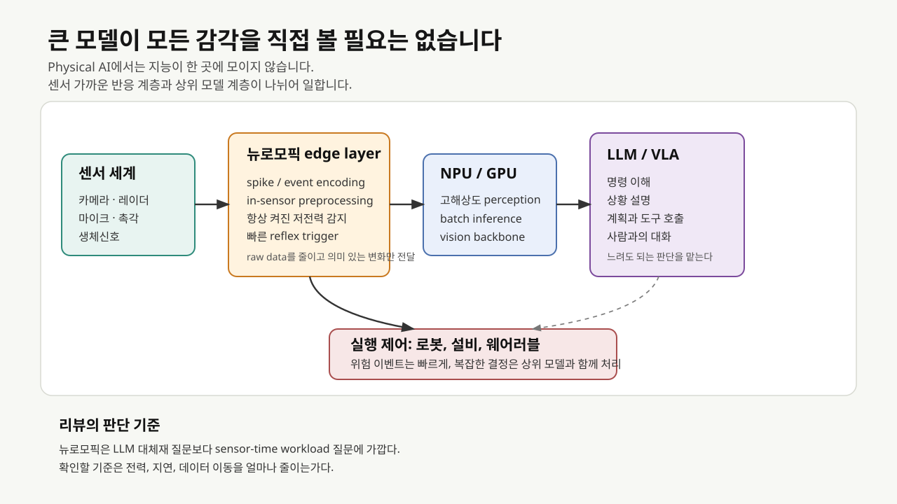
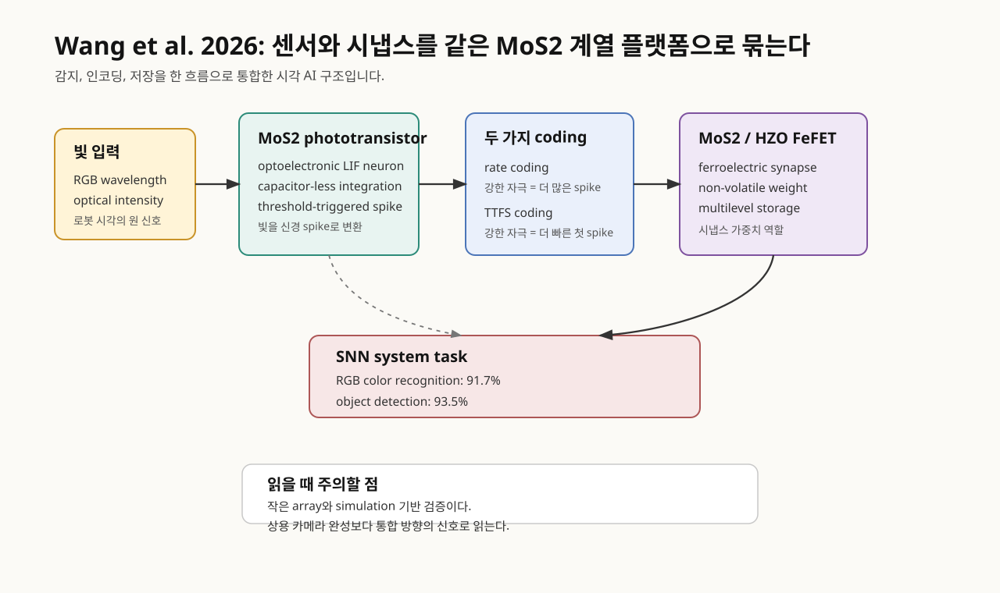
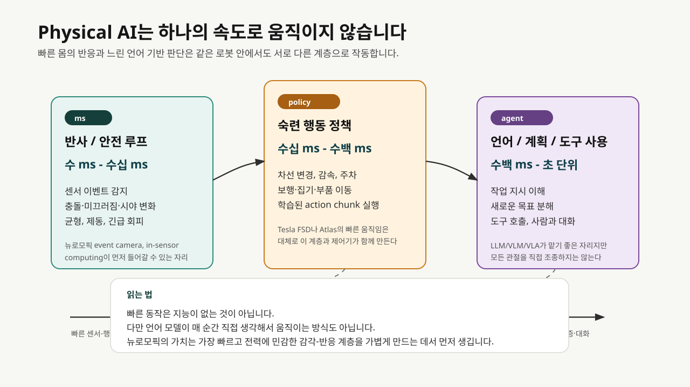
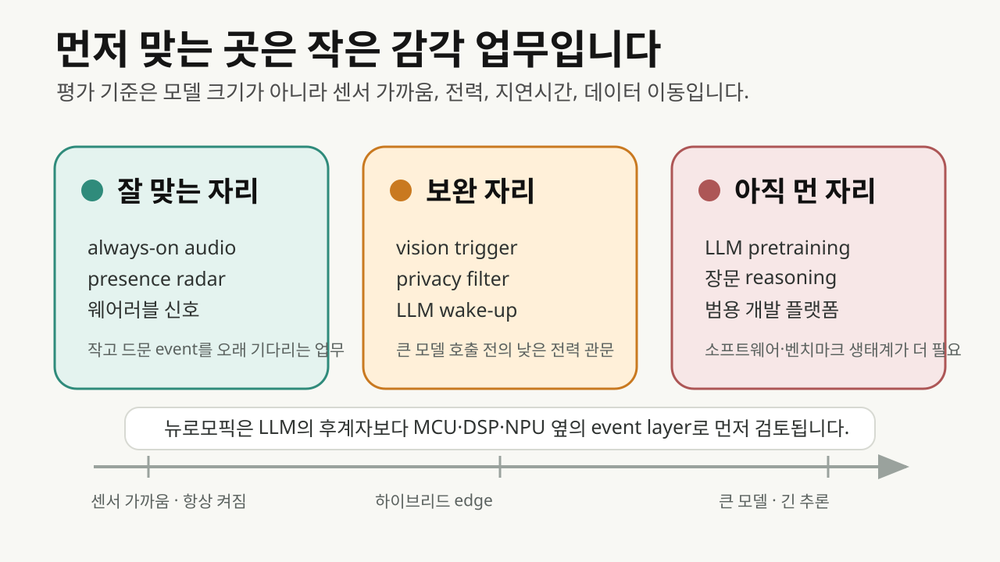
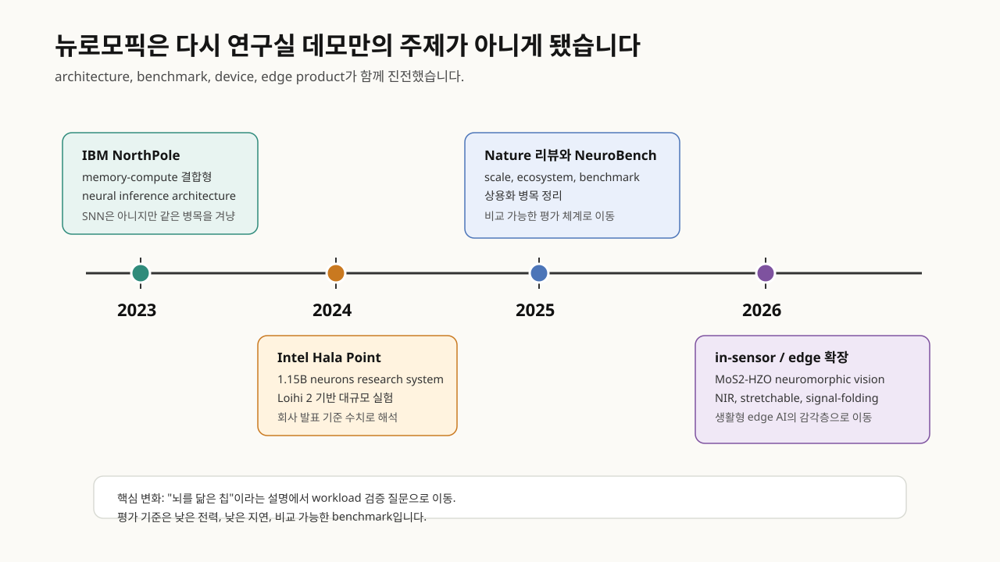

# 뉴로모픽, Physical AI의 감각을 가볍게 만드는 기술

<figure class="article-hero-figure">
  
  <figcaption><strong>그림 1.</strong> 생성 일러스트. 이 글은 뉴로모픽을 "LLM을 대신할 새 두뇌"로 보기보다, 실제 세계의 빠른 센서 신호를 어디에서 먼저 다룰지 묻습니다. 그림은 물리 세계, 센서 가까운 지각 계층, 상위 에이전트 모델 계층, 검증 대상 로봇 환경의 역할 분리를 설명하기 위한 편집 이미지입니다.</figcaption>
</figure>

::: highlight
뉴로모픽 컴퓨팅은 큰 언어 모델의 후계자라기보다, Physical AI가 현장에서 보고 듣고 반응하는 방식을 가볍게 만드는 기술입니다. 카메라, 레이더, 마이크, 촉각 센서가 만든 모든 데이터를 멀리 보내기 전에, 센서 가까운 곳에서 중요한 변화만 먼저 골라내려는 흐름입니다.
:::

로봇이 복도에서 사람을 피해야 한다고 생각해 보겠습니다. 카메라 영상 전체를 저장하고, 네트워크로 보내고, 큰 모델이 장면을 해석한 뒤, 다시 제어 명령을 내려오기를 기다리는 방식은 설명하기는 쉽지만 실제 기계에는 무겁습니다. 몇 초 늦은 챗봇 답변은 불편한 정도에서 끝날 수 있습니다. 하지만 로봇의 눈과 팔, 자율주행 차량의 레이더, 웨어러블의 생체신호 센서는 전력과 지연을 훨씬 엄격하게 봅니다.

뉴로모픽 컴퓨팅은 이 지점에서 다시 살아납니다. 뉴로모픽은 뇌의 신경세포와 시냅스가 신호를 다루는 방식을 참고해, 필요한 순간에만 계산하고 메모리와 연산을 가까이 두려는 하드웨어·알고리즘 접근입니다. 이름은 거창하지만 출발점은 간단합니다. 모든 것을 고해상도 데이터로 보낸 뒤 생각하기보다, 방금 중요한 변화가 생겼는지 센서 가까이에서 먼저 보자는 방식입니다.

[사이언스타임즈가 2026년 3월 소개한 기사](https://www.sciencetimes.co.kr/nscvrg/view/menu/250?nscvrgSn=261508&searchCategory=222)는 이 흐름을 대중적으로 잘 잡았습니다. 기사 제목은 "로봇의 눈이 스스로 생각도 하는 뉴로모픽 비전"입니다. 표현은 조금 과감하지만, 문제의식은 정확합니다. 로봇의 카메라가 빛을 받은 자리에서 어느 정도 의미 있는 신호를 만들 수 있다면, Physical AI의 반응 시간과 전력 조건은 달라질 수 있습니다.

<figure class="figure-panel">
  
  <figcaption><strong>그림 2.</strong> Physical AI에서 큰 모델은 계획, 언어 이해, 상황 설명을 맡을 수 있습니다. 반면 실제 세계의 센서 신호는 더 빠르고 전력에 민감합니다. 뉴로모픽 edge layer는 raw data를 모두 보내지 않고 중요한 이벤트를 먼저 걸러내는 하위 계층으로 검토할 수 있습니다.</figcaption>
</figure>

## MoS2 시각 소자

기사에 연결된 논문은 [Wang et al.의 Nature Communications 2026 논문](https://www.nature.com/articles/s41467-026-68905-3)입니다. 연구진은 이황화몰리브덴(MoS2) 기반 광트랜지스터를 optoelectronic LIF neuron으로 사용하고, HZO(hafnium-zirconium oxide) 강유전층을 포함한 MoS2 FeFET를 인공 시냅스로 사용했습니다. LIF neuron은 leaky integrate-and-fire neuron의 줄임말입니다. 신호를 조금씩 쌓다가 기준값을 넘으면 spike를 내고 다시 초기화되는 간단한 신경세포 모델입니다.

이 논문이 보여주는 변화는 빛 감지, spike 변환, 가중치 저장을 하나의 플랫폼 안에 붙였다는 점입니다. 기존 카메라는 빛을 전기 신호로 바꾼 뒤 그 데이터를 별도 프로세서로 보냅니다. 이 연구의 구조에서는 센서가 빛의 세기와 파장을 받아 spike train을 만들고, 그 spike가 ferroelectric synapse array의 가중합 연산에 입력됩니다. 카메라와 프로세서 사이의 경계가 조금 당겨진 셈입니다.

<figure class="figure-panel">
  
  <figcaption><strong>그림 3.</strong> 생성 일러스트. Wang et al. 논문의 실제 장치 사진으로 사용하면 안 됩니다. 빛 감지, spike 인코딩, 시냅스 가중치 저장이 한 흐름으로 붙는다는 개념을 설명하기 위한 편집 이미지입니다. 근거 구조와 테스트 조건은 아래 그림 4와 논문 원문을 기준으로 확인해야 합니다.</figcaption>
</figure>

<figure class="figure-panel">
  
  <figcaption><strong>그림 4.</strong> Wang et al. 2026 논문은 완성형 로봇 카메라보다 통합 방향을 제시합니다. MoS2 광트랜지스터가 빛을 spike로 바꾸고, HZO/MoS2 FeFET가 가중치를 저장하며, 작은 SNN 시스템이 그 신호를 분류합니다.</figcaption>
</figure>

논문은 두 가지 encoding을 함께 씁니다. 하나는 rate coding입니다. 빛이 강할수록 일정 시간 안에 spike가 더 많이 나옵니다. 다른 하나는 TTFS(time-to-first-spike)입니다. 자극이 강할수록 첫 spike가 더 빨리 나옵니다. 자율주행이나 로봇 안전 감시처럼 갑작스러운 위험을 빨리 잡아야 하는 장면에서는 첫 반응 시간이 중요합니다. 반대로 색상과 패턴을 더 안정적으로 구분하려면 spike 빈도도 의미가 있습니다.

용어를 조금 더 풀어보겠습니다. Spike는 연속적인 숫자 벡터와 달리 짧은 사건 신호입니다. SNN(spiking neural network)은 이런 사건 신호의 시간 패턴을 다루는 신경망입니다. FeFET(ferroelectric field-effect transistor)는 강유전 물질의 분극 상태를 이용해 전도 상태, 즉 가중치에 해당하는 값을 오래 보존할 수 있는 트랜지스터입니다. 이 논문의 장점은 "카메라가 사진을 찍고 AI가 나중에 보는 구조"에서 벗어나, 빛이 들어온 자리에서 시간 신호와 가중치 연산의 일부가 이미 시작된다는 데 있습니다.

논문은 이 통합 SNN 시스템이 RGB 색상 인식에서 91.7%, 객체 검출에서 93.5%의 정확도를 얻었다고 보고합니다. 사이언스타임즈 기사의 주요 수치도 여기서 나왔습니다. 다만 이 수치는 실험실 규모의 시스템 검증에서 나온 결과입니다. 상용 로봇 카메라의 성능 지표로 읽기에는 아직 이릅니다. 논문 본문은 현재 하드웨어 한계 때문에 RGB color classification capability를 simulation으로 검증했다고 밝힙니다. 또한 상용 neuromorphic chip과 비교하면서 optoelectronic fusion과 circuit simplification의 장점은 있지만, system scale과 energy efficiency는 아직 개선 영역이라고 적습니다.

그래서 이 논문은 "로봇의 눈이 곧 사람처럼 생각한다"는 결론보다, 센서와 계산의 경계가 앞으로 어디까지 당겨질 수 있는지 확인하는 논문으로 읽는 편이 정확합니다.

::: evidence
확인된 성과는 MoS2 광전자 neuron과 MoS2/HZO ferroelectric synapse의 통합, rate/TTFS coding, 91.7%/93.5% task 결과입니다. 상용 robot vision module 수준의 검증이나 대규모 array 실증은 아직 아닙니다.
:::

## Physical AI의 시간

Physical AI는 로봇, 자율주행, 산업 설비, 웨어러블처럼 실제 세계와 맞닿아 작동하는 AI를 가리키는 산업 용어로 쓰이고 있습니다. [NVIDIA의 2026년 Physical AI Data Factory Blueprint](https://nvidianews.nvidia.com/news/nvidia-announces-open-physical-ai-data-factory-blueprint-to-accelerate-robotics-vision-ai-agents-and-autonomous-vehicle-development)는 로봇, vision AI agent, autonomous vehicle을 위한 데이터 생성·증강·평가 구조를 강조합니다. [Qualcomm의 2026년 robotics technology suite](https://www.qualcomm.com/news/releases/2026/01/qualcomm-introduces-a-full-suite-of-robotics-technologies-power)도 VLA/VLM, edge AI, humanoid robotics를 Physical AI 스택으로 묶어 설명합니다.

이 자료들은 뉴로모픽 자체의 성능 근거가 아닙니다. 대신 왜 뉴로모픽이 다시 호출되는지 보여주는 배경입니다. Physical AI가 실제 제품과 설비로 내려가면, 큰 모델의 지능만으로는 부족한 문제가 생깁니다. 느리면 부딪히고, 많이 쓰면 배터리가 떨어지고, 계속 보내면 네트워크가 막히고, raw sensor data를 밖으로 내보내면 프라이버시와 보안 부담이 커집니다.

뉴로모픽이 노리는 자리는 바로 그 사이입니다. 입력이 있을 때만 계산하는 event-driven processing, 메모리와 연산을 가까이 두는 compute-memory co-location, 센서 단계에서 feature를 만드는 in-sensor computing은 큰 모델의 언어 추론과 다른 종류의 지능입니다.

[npj Unconventional Computing의 2026년 AI-native robotic vision 리뷰](https://www.nature.com/articles/s44335-025-00047-z)는 이 문제를 로봇 시각 관점에서 잘 정리합니다. 기존 robotic vision system은 image sensor와 processor가 분리되어 있고, raw image는 여러 image signal processing 단계를 지나 외부 processor로 전달됩니다. 이 과정은 지연과 전력 소모를 만듭니다. 반면 in-sensor computing은 feature enhancement, spike encoding, convolutional filtering 같은 연산을 sensory level에서 수행해 AI inference에 맞는 visual data를 바로 만들 수 있습니다.

[Communications Engineering의 2025년 robotic vision perspective](https://www.nature.com/articles/s44172-025-00492-5)도 같은 방향을 봅니다. 이 글은 event-based camera, SNN 및 SNN-ANN hybrid, 전용 neuromorphic hardware를 따로 보지 말고 system design 문제로 묶어야 한다고 설명합니다. 드론 시각 항법처럼 전력과 지연이 빠듯한 사례에서는 알고리즘과 하드웨어를 함께 설계해야 합니다. 이 관점은 Physical AI와 뉴로모픽의 연결을 억지로 만들지 않습니다. 실제 기계가 빨리 보고, 적게 쓰고, 현장에서 판단해야 하므로 두 논의가 자연스럽게 만납니다.

쉽게 말하면, 뉴로모픽은 로봇에게 "모든 장면을 고해상도 영상으로 설명한 뒤 생각하자"고 말하지 않습니다. 먼저 "방금 무언가 움직였다", "소리가 특정 패턴으로 바뀌었다", "이 진동은 평소와 다르다", "이 빛의 변화는 위험 신호일 수 있다"를 낮은 비용으로 감지합니다. 큰 모델은 그 다음 판단을 맡을 수 있습니다.

## 자율주행차라는 시험대

테슬라 FSD(Full Self-Driving)는 뉴로모픽 기술을 쓰는 사례로 보기는 어렵습니다. 지금 공개된 테슬라의 설명을 기준으로 하면, FSD는 frame-based camera, deep neural network, 차량 내 AI computer, 대규모 fleet data, OTA update를 중심으로 움직입니다. [Tesla FSD 페이지](https://www.tesla.com/fsd)는 외부 카메라의 360도 시야, route navigation, steering, lane change, parking을 설명하면서도 현재 기능은 active supervision이 필요하며 차량을 autonomous vehicle로 만들지는 않는다고 적습니다.

테슬라의 AI stack은 자율주행차가 실제로 어떤 순서로 판단하는지 보여주는 좋은 사례입니다. [Tesla AI & Robotics 페이지](https://www.tesla.com/AI)는 per-camera network가 raw image를 받아 semantic segmentation, object detection, monocular depth estimation을 수행하고, birds-eye-view network가 모든 카메라 영상을 모아 road layout, static infrastructure, 3D object를 top-down view로 출력한다고 설명합니다. 그 다음 autonomy algorithm은 이 세계 표현 안에서 trajectory를 계획합니다. 즉 카메라가 본 장면은 곧바로 steering wheel로 가지 않습니다. 먼저 차 주변의 공간 표현으로 바뀌고, 그 위에서 어느 차선으로 갈지, 어느 속도로 줄일지, 어느 방향으로 피할지 계산됩니다.

이 구조에서 순간적인 움직임은 세 층이 동시에 맞물릴 때 나옵니다. 첫째, perception layer가 앞차, 보행자, 차선, 신호, 도로 경계를 계속 갱신합니다. 둘째, planning layer가 가능한 경로와 위험도를 비교합니다. 셋째, control layer가 조향, 제동, 가속 명령으로 바꿉니다. [Tesla AI computer support 문서](https://www.tesla.com/support/ai-computer)는 이 컴퓨터가 neural network를 빠르게 처리하도록 설계되었다고 설명하지만, 동시에 현재 차량은 완전 자율이 아니며 운전자 감독과 규제 승인이 필요하다고 못박습니다.

이 지점에서 뉴로모픽과 테슬라의 접점이 생깁니다. 테슬라가 현재 쓰는 방식은 뉴로모픽보다 dense visual AI입니다. 그러나 두 기술이 다루는 제약은 상당히 겹칩니다. 카메라 데이터는 많고, 판단은 빨라야 하며, 차 안의 전력과 열은 제한되어 있습니다. 특히 camera-only 전략에서는 센서가 제대로 보지 못하는 순간을 빨리 알아차리는 일도 중요합니다. [NHTSA가 2026년 3월 연 Engineering Analysis](https://static.nhtsa.gov/odi/inv/2026/INOA-EA26002-10023.pdf)는 Tesla FSD의 reduced roadway visibility 조건, 즉 glare와 airborne obscurants 같은 상황에서 camera degradation을 제때 감지하고 운전자에게 충분히 알리는지 평가하겠다고 밝혔습니다. 이 조사는 테슬라에 대한 최종 판정은 아니지만, 자율주행에서 센서 신뢰도와 즉시 반응이 얼마나 중요한지 드러냅니다.

뉴로모픽 event camera와 SNN은 이 지점에서 보조 계층 후보가 됩니다. [Nature의 2024년 event camera 논문](https://www.nature.com/articles/s41586-024-07409-w)은 자동차 vision에서 RGB frame camera가 bandwidth-latency trade-off를 만든다고 보고, event camera가 밝기 변화만 비동기적으로 기록해 temporal resolution과 sparsity를 높일 수 있다고 설명합니다. [IEEE Signal Processing Magazine의 autonomous driving 리뷰](https://mediatum.ub.tum.de/doc/1550369/s510t7a878tkqb3bjfp1dku59.Event-Based_Neuromorphic_Vision_for_Autonomous_Driving_A_Paradigm_Shift_for_Bio-Inspired_Visual_Sensing_and_Perception.pdf)도 event-based neuromorphic vision이 낮은 지연, 높은 dynamic range, motion blur 감소에서 장점을 가진다고 정리합니다.

다만 이것이 "테슬라에 뉴로모픽이 필수"라는 뜻은 아닙니다. 테슬라는 현재 더 큰 fleet data, end-to-end learning, AI inference chip, simulation/evaluation infrastructure로 문제를 밀고 있습니다. 뉴로모픽이 들어간다면, 전체 FSD brain을 대체하기보다 급격한 움직임, glare/tunnel 전환, parking lot 주변 움직임, 낮은 전력의 always-on monitoring 같은 peripheral reflex layer에서 먼저 검토될 가능성이 큽니다. 자율주행차는 뉴로모픽의 필요성을 곧장 증명하지는 않습니다. 대신 어느 계층에 넣어야 실제 가치가 생기는지 따져볼 수 있는 시험대입니다.

## 빠른 몸과 느린 판단

이 대목에서 자주 생기는 오해가 있습니다. 자동차가 수 ms 단위로 주변을 보고, 로봇이 계단을 오르고, Atlas가 덤블링이나 춤처럼 매우 빠른 동작을 보여주면 기계가 사람처럼 그 순간마다 생각하고 결정하는 것처럼 보입니다. 실제 작동 방식은 조금 다릅니다. 빠른 움직임의 상당 부분은 운전, 보행, 균형, 물체 조작에 맞게 학습되거나 설계된 sensorimotor policy와 제어기의 결과입니다. 언어로 새 목표를 이해하고, 작업을 나누고, 도구를 호출하고, 사람에게 이유를 설명하는 agentic layer와 같은 층이 아닙니다.

그래서 "LLM이 로봇에 들어가면 모든 동작이 느려질 수밖에 없다"는 문장도 절반만 맞습니다. LLM/VLM/VLA가 모든 관절과 모터를 직접 조종한다면 당연히 너무 느립니다. 하지만 실제 Physical AI 시스템은 보통 계층형으로 짜입니다. 균형 유지, 충돌 회피, 제동, 미끄러짐 감지는 매우 빠른 하위 루프가 맡고, 차선 변경이나 물체 집기 같은 숙련 행동은 학습된 policy가 맡습니다. LLM/VLM/VLA는 그 위에서 "무엇을 하라"는 지시를 이해하고, 장면을 설명하고, 작업 순서를 세우고, 필요하면 도구나 업무 시스템을 호출합니다. 느린 판단이 빠른 몸을 매 순간 대신 움직이기보다, 빠른 행동 계층을 선택하고 제약하는 흐름입니다.

[Boston Dynamics가 2026년 공개한 Atlas 관련 글](https://bostondynamics.com/blog/atlas-evolution-from-research-robot-to-industrial-humanoid/)도 이 차이를 잘 드러냅니다. 회사는 Atlas가 전기식 산업용 humanoid로 전환되고, Hyundai와 Google DeepMind 배치가 예정되어 있으며, fleet 규모에서 learned behavior를 재배포하고 RL과 foundation model을 활용한다고 설명합니다. 동시에 첫 산업 과제는 자동차 제조의 part sequencing처럼 구체적인 작업입니다. 이는 사람 같은 자유의지를 얻었다는 뜻보다, 산업 현장에서 반복 가능한 작업을 학습·검증·배포하는 능력이 커지고 있다는 신호로 읽는 편이 정확합니다.

[Boston Dynamics와 Toyota Research Institute의 Large Behavior Models 글](https://bostondynamics.com/blog/large-behavior-models-atlas-find-new-footing/)은 더 직접적입니다. 공개 설명에 따르면 Atlas 정책은 이미지, proprioception, 언어 prompt를 입력으로 받아 Atlas 전신을 30 Hz로 제어합니다. 데이터는 teleoperation과 simulation에서 모으고, 품질 검토와 annotation을 거쳐 neural-network policy를 학습합니다. 450M parameter Diffusion Transformer와 flow matching을 사용하고, 1회 inference가 약 1.6초 길이의 action chunk를 예측한다는 설명도 나옵니다. 매우 인상적인 결과지만, 여전히 "사람처럼 매 순간 말로 생각하는 로봇"보다 "언어 조건을 받은 숙련 행동 정책"으로 읽는 편이 맞습니다.

춤, 계단, 덤블링, 부품 이동은 빠르게 보입니다. 그 빠름은 미리 확보한 dynamics, 제어기, 시뮬레이션, 학습 데이터, 정책 모델이 몸에 가까운 층에서 작동하기 때문에 가능합니다. 반대로 사람이 "지금 상황을 보고 새로운 작업 순서를 짜서 이 장비와 저 시스템을 함께 써 봐"라고 말하면, 로봇은 언어 이해, 환경 grounding, 계획 검증, 안전 제약, policy 선택, 실패 복구를 거쳐야 합니다. 이 계층은 훨씬 느릴 수 있고, 그렇게 느린 것이 오히려 정상입니다. 안전과 설명 가능성이 필요한 판단은 빠르게 휘두르는 팔보다 느리게 확인되어야 합니다.

<figure class="figure-panel">
  
  <figcaption><strong>그림 5.</strong> Physical AI는 하나의 속도로 움직이지 않습니다. 빠른 하위 루프는 센서 변화와 안전 반응을 맡고, 학습된 policy는 운전·보행·조작 같은 숙련 행동을 맡습니다. LLM/VLM/VLA는 언어 지시, 계획, 도구 사용을 담당하지만 모든 움직임을 직접 제어하지는 않습니다.</figcaption>
</figure>

여기서 뉴로모픽의 자리가 분명해집니다. 뉴로모픽 디바이스가 로봇에게 의지나 대화를 주는 것은 아닙니다. 대신 가장 빠르고 전력에 민감한 감각-반응 계층을 가볍게 만들 수 있습니다. event camera는 모든 frame을 보내지 않고 밝기 변화 이벤트를 보냅니다. in-sensor computing은 센서 단계에서 feature나 spike를 만들 수 있습니다. Wang et al.의 MoS2/HZO 논문은 바로 이 점에서 의미가 있습니다. 빛을 받은 자리에서 spike를 만들고, 가까운 synapse array가 가중치 상태를 저장하며, 작은 SNN이 그 신호를 처리하는 흐름을 구현했습니다. 지금은 실험실 규모이지만, Physical AI의 빠른 몸을 더 가볍게 만드는 하드웨어 연구에 힘을 싣는 결과입니다.

## 첫 시장은 작은 지능

뉴로모픽을 이야기할 때 흔히 나오는 질문이 있습니다. "그럼 GPU를 대체해서 LLM을 학습시키는가?" 가까운 시장은 데이터센터 LLM 훈련보다 edge sensing과 always-on inference 쪽입니다.

[Nature Communications의 2025년 상용화 전망 논문](https://www.nature.com/articles/s41467-025-57352-1)은 이 지점을 분명히 짚습니다. 저자들은 뉴로모픽의 killer app 하나를 찾기보다, 어떤 기존 processor와 application을 보강할 수 있는지 보는 편이 더 적절하다고 말합니다. 그리고 초기 상용 시장으로 battery-powered system, local compute for IoT, consumer wearable, audio/visual wake phrase, gesture interaction, condition and anomaly detection을 제시합니다.

<figure class="figure-panel">
  
  <figcaption><strong>그림 6.</strong> 뉴로모픽은 GPT 계열 모델보다 MCU, DSP, NPU, low-power accelerator와 가까운 자리에서 먼저 경쟁합니다. 특히 항상 켜진 시간 신호와 센서 이벤트를 다루는 workload에서 강점이 먼저 드러납니다.</figcaption>
</figure>

상용화 논문에서 또 중요한 부분은 programming model입니다. 과거에는 SNN application을 만들려면 뉴로모픽 hardware를 잘 아는 전문가가 직접 구조를 설계해야 했습니다. 이제 surrogate gradient와 gradient-based training, deep learning toolchain과 이어지는 open-source framework가 나오면서, 개발자가 기존 ML workflow에 가깝게 SNN을 만들 수 있는 길이 생기고 있습니다. 뉴로모픽이 제품으로 들어가려면 소자의 물리적 효율만큼이나 software API와 benchmark가 중요해집니다.

[Nature의 "Neuromorphic computing at scale"](https://www.nature.com/articles/s41586-024-08253-8)도 같은 문제를 봅니다. 대규모 neuromorphic system은 hardware architecture, algorithm, software ecosystem, benchmark, community readiness가 함께 성숙해야 합니다. [NeuroBench](https://www.nature.com/articles/s41467-025-56739-4)가 등장한 이유도 여기에 있습니다. 뉴로모픽 분야는 이제 "이 칩이 뇌처럼 멋지다"에서 "같은 task에서 기존 방법보다 얼마나 낫고, 그 차이를 어떻게 공정하게 재는가"로 평가 질문을 바꾸고 있습니다.

[Frontiers in Neuroscience의 2025년 비교 리뷰](https://www.frontiersin.org/journals/neuroscience/articles/10.3389/fnins.2025.1676570/full)는 edge AI 관점에서 DNN과 SNN을 비교합니다. DNN은 정확도와 개발 도구가 강하지만 계산량과 전력 부담이 큽니다. SNN은 event-driven 구조 덕분에 에너지 효율을 기대할 수 있지만, 학습 도구와 benchmark, 집적 기술은 더 성숙해야 합니다. 이 균형 감각이 중요합니다. 뉴로모픽은 매력적인 대안이지만, 도구와 검증 체계가 제품화 속도를 결정합니다.

2026년 5월 공개된 [edge-oriented SNN hardware review](https://www.sciencedirect.com/science/article/pii/S1383762126001876)는 이 논지를 더 좁혀 줍니다. 큰 brain-simulation 플랫폼은 작은 edge workload에는 과한 경우가 많고, 실제 제품에 들어갈 small-scale neuromorphic SoC는 아직 희소합니다. 이 리뷰가 SoC integration과 Network-on-Chip communication을 강조하는 이유도 여기에 있습니다. 뉴로모픽의 다음 관문은 대형 데모보다, 100 mW 이하의 extreme edge와 200 mW-2 W급 embedded edge에서 반복 가능한 inference를 어떻게 구현하느냐입니다.

## 2026년의 연구 방향

Wang et al.의 MoS2/HZO 논문은 하나의 사례입니다. 2026년의 문헌을 함께 보면 연구 방향은 네 갈래로 보입니다.

첫째, 센서 안쪽으로 계산이 들어갑니다. [AI-native robotic vision 리뷰](https://www.nature.com/articles/s44335-025-00047-z)는 in-sensor computing을 synaptic, neuronal, hierarchical motif로 나눠 정리합니다. Synaptic vision은 의미 있는 feature를 강화하고 noise를 줄입니다. Neuronal vision은 analog stimulus를 spike train으로 바꿉니다. Hierarchical vision은 망막처럼 공간 feature를 줄이고 downstream compute 부담을 낮춥니다.

둘째, near-sensor와 in-sensor computing이 AIoT의 기본 설계 과제로 자리 잡고 있습니다. [npj Unconventional Computing의 2025년 리뷰](https://www.nature.com/articles/s44335-025-00040-6)는 memory와 logic을 물리적으로 결합하는 in-memory computing, 이벤트 기반 neuromorphic architecture, dynamic vision camera와 silicon cochlea 같은 센서 인터페이스를 함께 다룹니다. 이 문헌은 뉴로모픽을 단일 칩 이름보다 넓은 edge intelligence 설계 묶음으로 보게 합니다.

셋째, 재료와 소자 연구가 계속 확장되고 있습니다. [Nature Reviews Materials의 2026년 회고](https://www.nature.com/articles/s41578-026-00924-4)는 analogue in-memory computing, physical neural networks, memristor 기반 edge learning을 함께 언급합니다. [2D material artificial neuron/synapse review](https://link.springer.com/article/10.1007/s40820-026-02139-2)와 [multisensory neuromorphic devices review](https://link.springer.com/article/10.1007/s40820-025-01940-9)는 시각, 촉각, 열, 화학 신호를 하나의 하드웨어가 어떻게 받아들이고 융합할 수 있는지 묻습니다. Physical AI가 로봇, 웨어러블, 설비, 차량으로 넓어질수록 이 질문은 더 중요해집니다.

넷째, 2026년 논문들은 "눈"만 보지 않습니다. [Retinocortical in-sensor neuromorphic vision platform 논문](https://www.nature.com/articles/s41467-026-71678-4_reference.pdf)은 NIR, 즉 near-infrared 감도를 갖는 in-sensor neuromorphic vision platform을 제안합니다. [Nature Electronics의 signal-folding 논문](https://www.nature.com/articles/s41928-026-01626-z)은 MoS2 기반 compute-in-memory hardware에서 weight precision과 energy efficiency 사이의 trade-off를 줄이려 합니다. [Stretchable neuromorphic circuit 논문](https://www.nature.com/articles/s41928-026-01639-8)은 on-body edge computing을 위해 stretchable neuromorphic circuit을 제안합니다. [Frontiers in Neuroscience의 Neuromorphic Engineering 최신 목록](https://www.frontiersin.org/journals/neuroscience/sections/neuromorphic-engineering/articles)을 보면 2026년 5월에도 radar gesture recognition, sparse signal classification processor, traffic sign recognition, edge hardware audio processing 같은 응용 논문이 이어지고 있습니다.

이 흐름을 묶으면 뉴로모픽은 하나의 소자 명칭보다 넓은 기술군입니다. SNN processor, memristor/FeFET compute-in-memory, optoelectronic in-sensor computing, event camera, stretchable OECT array, spintronic neuron이 서로 다른 방향에서 같은 제약을 다룹니다. 공통 제약은 데이터 이동, 전력, 지연, 항상 켜진 sensing, 그리고 physical world와 digital model 사이의 변환 비용입니다.

## 디스플레이 논의의 이동

몇 년 전에는 뉴로모픽과 차세대 디스플레이를 연결한 논의가 꽤 눈에 띄었습니다. 이 흐름이 사라진 것은 아닙니다. 다만 2025-2026년에는 표현의 중심이 "neuromorphic display"에서 in-sensor computing, near-sensor computing, edge AI, wearable interface, AR/VR, robot vision 쪽으로 넓어졌습니다. 디스플레이 단독 시장의 이야기라기보다, 센서와 표시 장치, 메모리와 연산을 한 기판이나 한 device stack 안에서 얼마나 가까이 붙일 수 있는가라는 질문으로 이동한 셈입니다.

[Advanced Materials의 2024년 intelligent display 리뷰](https://advanced.onlinelibrary.wiley.com/doi/10.1002/adma.202401821)는 storage, processing, light-emitting 기능을 통합하는 neuromorphic display를 차세대 display 병목을 푸는 방향으로 정리했습니다. 당시에는 display가 사람과 기계가 만나는 면이고, 동시에 대면적 박막전자·광전자 소자 플랫폼이라는 점이 강조되었습니다. 기존 display 산업이 가진 TFT backplane, 산화물/유기 반도체, 광검출·발광 소재, 대면적 array 공정 경험이 AI hardware와 만날 수 있다는 기대도 있었습니다.

최근 문헌은 이 주제를 더 넓은 edge device 문제로 다시 씁니다. [National Science Review의 2025년 EP-IDNC 논문](https://academic.oup.com/nsr/article/12/8/nwaf224/8156810)은 electrically programmable in-display neuromorphic computing을 제안했습니다. 이 장치는 organic electrochromic platform 안에서 memory, processing, display 기능을 함께 다루고, noise reduction, motion object perception, car steering reminder를 작은 prototype array로 보였습니다. [같은 저널의 해설](https://academic.oup.com/nsr/advance-article/doi/10.1093/nsr/nwaf515/8340374?searchresult=1)은 이 연구가 AR, wearable electronics, autonomous systems로 이어질 수 있다고 보면서도 cycling endurance와 switching speed는 더 개선되어야 한다고 짚었습니다.

왜 지금은 이 논의가 덜 보이는 것처럼 느껴질까요. 첫째, 뉴로모픽 분야의 응용 pull이 robot vision, radar, audio, wearable, industrial IoT처럼 더 직접적인 edge sensing 문제로 이동했습니다. 시장과 논문 제목이 display보다 "항상 켜진 센서"와 "낮은 지연"을 앞세웁니다. 둘째, neuromorphic display는 멋진 개념이지만 실제 제품 조건이 까다롭습니다. 화소 균일도, 수명, 색 안정성, switching speed, backplane 통합, 대면적 수율을 동시에 만족해야 합니다. 셋째, AI hardware 담론이 2025년 이후 benchmark, programming model, SoC integration, hybrid edge stack으로 옮겨 가면서 display-specific 용어가 큰 흐름 안에 흡수되었습니다.

그래도 디스플레이 관점의 의미는 남아 있습니다. 앞으로의 smart display는 단순히 이미지를 보여주는 면을 넘어, 주변 빛과 움직임을 감지하고, 일부 신호를 저장하고, 사람에게 필요한 변화만 낮은 전력으로 보여주는 interface가 될 수 있습니다. 이때 뉴로모픽은 display panel 자체가 GPU를 대체한다는 주장보다, pixel·sensor plane이 조금 더 똑똑한 front-end가 되는 방향으로 이해하는 편이 좋습니다. Wang et al.의 MoS2/HZO 논문도 이 넓은 흐름 안에 놓을 수 있습니다. display 산업의 언어로 보면 photodetector, 2D material, ferroelectric layer, array integration이 AI sensing 쪽으로 넘어오는 사례입니다.

## 움직이는 산업 신호

산업 신호도 있습니다. 이 부분은 회사 발표와 peer-reviewed 검증을 분리해서 읽어야 합니다.

[Intel은 2024년 Hala Point](https://newsroom.intel.com/artificial-intelligence/intel-builds-worlds-largest-neuromorphic-system-to-enable-more-sustainable-ai)를 발표했습니다. Intel 발표 기준으로 Hala Point는 1.15 billion neurons, 128 billion synapses, 1,152 Loihi 2 processors를 포함한 research prototype입니다. 최대 전력은 2,600 W로 제시되었습니다. 이는 상용 제품이라기보다 대규모 뉴로모픽 연구 시스템이지만, billion-neuron scale에서 software와 workload를 실험할 수 있는 플랫폼이라는 의미가 있습니다.

[IBM NorthPole](https://research.ibm.com/publications/neural-inference-at-the-frontier-of-energy-space-and-time)은 조금 다른 계열입니다. Strict하게 말해 SNN neuromorphic chip이라기보다, off-chip memory를 없애고 compute와 memory를 chip 내부에서 엮은 neural inference architecture입니다. IBM은 ResNet50 기준 comparable 12 nm GPU 대비 25배 높은 FPS/W, 5배 높은 FPS/transistor, 22배 낮은 latency를 보고했습니다. 이 결과는 뉴로모픽과 인메모리 AI 하드웨어가 데이터 이동 비용을 줄인다는 같은 문제의식 위에 서 있음을 뜻합니다.

상용 edge 쪽에서는 [Innatera Pulsar](https://innatera.com/press-releases/redefining-the-cutting-edge-innatera-debuts-real-world-neuromorphic-edge-ai-at-ces-2026)가 SNN, RISC-V CPU, CNN/DSP accelerator를 결합한 neuromorphic microcontroller를 내세웁니다. [SynSense Speck](https://www.synsense.ai/products/speck-2/)은 Dynamic Vision Sensor와 SNN processor를 single chip으로 결합한 event-driven vision SoC입니다. [BrainChip의 radar reference platform](https://investor.brainchip.com/brainchip-unveils-radar-reference-platform-to-bridge-the-identification-gap-in-edge-ai/)은 Akida neuromorphic intelligence를 radar data classification at the edge에 적용한다고 발표했습니다.

2026년 들어 Innatera 쪽 산업 신호는 더 구체적입니다. [Socionext-Innatera 60 GHz FMCW radar 발표](https://www.innatera.com/newsroom/socionext-and-innatera-introduce-integrated-60-ghz-fmcw-radar-and-neuromorphic-edge-ai-for-human-presence-detection/)는 presence detection을 sub-milliwatt power level과 3-6배 battery life extension이라는 회사 claim으로 제시했습니다. [Joya Design의 Pulsar 기반 consumer audio module 발표](https://www.innatera.com/newsroom/joya-design-takes-neuromorphic-chip-from-design-to-device-with-first-innatera-powered-consumer-audio-product-at-awe-china/)는 evaluation board를 넘어 실제 제품 설계에 들어가는 신호로 볼 수 있습니다. [Synopsys의 2026년 6월 Physical AI at the edge 글](https://www.synopsys.com/blogs/chip-design/neuromorphic-computing-physical-ai-edge.html)과 [Innatera-Synopsys 발표](https://news.synopsys.com/2026-03-02-Innatera-Selects-Synopsys-Simulation-to-Scale-Brain-Inspired-Processors-for-Edge-Devices)는 설계 자동화, 회로 검증, 시뮬레이션 쪽에서도 뉴로모픽과 Physical AI를 edge 설계 문제로 보기 시작했다는 신호입니다.

<figure class="figure-panel">
  
  <figcaption><strong>그림 7.</strong> 생성 일러스트. 최근 산업 신호는 데이터센터 학습보다 radar, audio, smart camera, wearable 같은 always-on edge sensing에서 먼저 나옵니다. 이 그림은 Innatera, SynSense, BrainChip 발표의 공통 방향을 설명하기 위한 편집 이미지이며, 성능 근거는 각 회사 발표와 peer-reviewed 테스트·검증 자료를 분리해 읽어야 합니다.</figcaption>
</figure>

이 신호들의 공통점은 거창한 AGI보다 항상 켜져 있고 전력이 제한된 작은 지능입니다. smart home, industrial IoT, radar, audio, gesture, wearable이 먼저 등장하는 이유도 여기에 있습니다.

<figure class="figure-panel">
  
  <figcaption><strong>그림 8.</strong> 2023-2026년의 흐름은 소자 시연, 대형 research platform, benchmark, 상용 edge signal이 함께 움직인다는 점에서 중요합니다. 뉴로모픽은 아직 주류 컴퓨팅을 대체하지 않았지만, 검토 가능한 산업 질문으로 들어왔습니다.</figcaption>
</figure>

## LLM 다음인가, LLM 아래인가

최근 LLM의 성장 한계가 눈에 보인다고 느끼면 뉴로모픽을 "대안 LLM" 후보로 보고 싶어집니다. 이 직감에는 중요한 포인트가 있습니다. 전력과 지연이 AI의 병목이 되고 있고, 더 큰 모델만으로는 실제 세계의 모든 문제를 해결하기 어렵습니다. 양자 AI보다 빠른 시점에 산업 적용이 가능한 대안 하드웨어라는 점에서도 뉴로모픽은 현실적인 후보입니다.

다만 표현은 더 정밀해야 합니다. 뉴로모픽을 LLM을 바로 대체하는 언어 모델 기술로 보기는 어렵습니다. 자연어 추론, 긴 문맥, 도구 계획, 복잡한 지식 합성에서는 transformer 계열 모델과 agentic software stack이 여전히 강합니다. 뉴로모픽이 먼저 잘할 일은 그 아래에 있습니다. 센서 신호를 줄이고, 위험 이벤트를 빨리 잡고, 상위 모델을 깨울지 말지 결정하고, 네트워크 없이 현장에서 작동하는 일입니다.

앞으로의 Physical AI stack은 한 종류의 지능으로 끝나지 않을 가능성이 큽니다.

- LLM/VLM/VLA는 명령 이해, 상황 설명, 계획, 사람과의 대화를 맡습니다.
- NPU/GPU는 고해상도 perception과 큰 모델 inference를 맡습니다.
- 뉴로모픽 edge layer는 항상 켜진 센서 감지, spike/event stream 처리, 빠른 reflex, privacy-preserving preprocessing을 맡습니다.
- 기존 MCU/DSP는 제어, 통신, 시스템 관리를 계속 맡습니다.

이렇게 보면 뉴로모픽은 "LLM 다음"이면서 동시에 "LLM 아래"입니다. 큰 모델의 지능을 부정하지 않고, 그 모델이 실제 세계에서 너무 비싼 방식으로 일하지 않도록 감각 계층을 바꿉니다.

::: highlight
뉴로모픽의 가까운 의미는 범용 LLM의 후계자보다, Physical AI가 실제 세계를 놓치지 않도록 돕는 저전력 반응 계층입니다. 이 계층이 성숙하면 큰 모델은 모든 것을 직접 보지 않아도 됩니다.
:::

## 양자 AI와 다른 시계

양자 AI와 비교하면 시간표가 다릅니다. 양자 컴퓨팅은 특정 최적화, sampling, materials simulation에서 장기적으로 중요한 가능성을 갖습니다. 하지만 가까운 제품화 경로는 아직 제한적이고, AI 서비스의 일반적인 edge workload와 바로 맞물리지는 않습니다.

뉴로모픽은 더 가까운 문제를 다룹니다. 이미 event camera, audio wake-word, radar classification, wearable biosignal, industrial anomaly detection 같은 구체적인 workload가 있습니다. Intel, IBM, Innatera, SynSense, BrainChip 같은 회사가 각자 다른 방식으로 산업 신호를 내고 있습니다. Nature 계열 리뷰도 상용화의 가까운 시장을 edge/wearable/IoT로 봅니다. 양자 AI보다 빠른 시점에 edge AI 대안 또는 보조 계층으로 자리 잡을 가능성은 충분히 있습니다.

하지만 여기서도 과장은 피해야 합니다. 뉴로모픽이 "AI의 다음 패권"을 혼자 가져간다는 이야기는 아직 근거가 약합니다. 더 설득력 있는 전망은 하이브리드입니다. sensor-near neuromorphic layer, on-device NPU, cloud/fleet-scale model, agentic software harness가 함께 움직입니다. 전부를 한 기술이 대체하기보다, 각자 전력과 지연, 데이터의 성격에 맞는 자리를 찾게 됩니다.

## 우리에게 남는 질문

이 주제는 연구 논문을 읽는 데서 끝나지 않습니다. 디스플레이, 센서, 소재, 제조 장비, 품질 시스템을 가진 조직이라면 뉴로모픽을 제품과 공정 양쪽에서 볼 수 있습니다.

첫째, in-sensor preprocessing이 필요한 제품 영역이 있는지 봐야 합니다. XR, 웨어러블, 로봇 interface, 저조도 시각, 생체신호, 환경 센서에서 raw data를 모두 보내는 방식이 병목이라면 뉴로모픽 방식이 후보가 됩니다.

둘째, 소재와 소자 자산을 살펴볼 필요가 있습니다. MoS2, HZO, IGZO, ferroelectric, memristive device, OECT, stretchable electronics는 서로 다른 기술이지만, AI hardware 관점에서는 memory, sensing, switching, analog state를 다룹니다. 기존 display/sensor 제조 역량이 edge AI hardware와 만나는 지점이 생길 수 있습니다.

셋째, LLM 중심 AI 전략과 별도로 physical edge intelligence 전략을 가져가야 합니다. LLM이 공정 문서, 실험 기록, 분석 코드, 작업 계획을 돕는다면, 뉴로모픽은 센서와 설비가 만드는 시간 신호를 담당합니다. 두 기술은 단순 경쟁 구도로 묶기보다, 서로 다른 계층으로 보는 편이 실무 판단에 유리합니다.

뉴로모픽을 보며 가장 조심해야 할 문장은 "뇌처럼 생각하는 칩이 곧 모든 AI를 바꾼다"입니다. 대신 이렇게 묻는 편이 좋습니다. **우리 제품과 공정에서 너무 늦고, 너무 많이 보내고, 너무 오래 켜져 있어야 해서 생기는 제약은 어디인가.** 그 제약이 센서와 시간 신호에 있다면, 뉴로모픽은 꽤 가까운 답이 될 수 있습니다.

## 작성 정보

- 작성자: 김현중 with Codex Agent | AI Governance Team
- 작성일: 2026-06-05
- 업데이트: 2026-06-16
- 추가 업데이트: 2026-06-17
- 작성 형식: AI Tech Review Letters
- 검토 범위: ScienceTimes 기사, Nature Communications 대상 논문, 2025-2026년 뉴로모픽 리뷰/벤치마크/상용화 자료, 2026년 edge-oriented SNN 및 multisensory neuromorphic review, 2026년 6월 Physical AI/edge neuromorphic 산업 신호, Tesla FSD/AI stack 공개 자료와 NHTSA FSD visibility investigation, Boston Dynamics Atlas/Large Behavior Models 공개 자료, intelligent display 및 in-display neuromorphic computing 문헌
- 이미지: OpenAI `imagegen` 생성 일러스트 3장, deterministic SVG 설명도 5장
- 검증 상태: source link refresh, Physical AI 용어 통일, Korean prose audit, HTML rendering, dist package regeneration, public site publish 대상으로 업데이트

## References

### 직접 검증 참고자료

- [ScienceTimes, 로봇의 눈이 스스로 생각도 하는 뉴로모픽 비전, 2026-03-04](https://www.sciencetimes.co.kr/nscvrg/view/menu/250?nscvrgSn=261508&searchCategory=222)
- [Wang et al., Homogeneous integration of two-dimensional material-based optoelectronic neurons and ferroelectric synapses for neuromorphic vision, Nature Communications, 2026](https://www.nature.com/articles/s41467-026-68905-3)
- [Kudithipudi et al., Neuromorphic computing at scale, Nature, 2025](https://www.nature.com/articles/s41586-024-08253-8)
- [Muir and Sheik, The road to commercial success for neuromorphic technologies, Nature Communications, 2025](https://www.nature.com/articles/s41467-025-57352-1)
- [Yik et al., The neurobench framework for benchmarking neuromorphic computing algorithms and systems, Nature Communications, 2025](https://www.nature.com/articles/s41467-025-56739-4)
- [Chowdhury et al., Neuromorphic computing for robotic vision: algorithms to hardware advances, Communications Engineering, 2025](https://www.nature.com/articles/s44172-025-00492-5)
- [Goswami, Reflections on the past decade of neuromorphic computing, Nature Reviews Materials, 2026](https://www.nature.com/articles/s41578-026-00924-4)
- [Kim et al., AI-native robotic vision systems enabled by in-sensor computing, npj Unconventional Computing, 2026](https://www.nature.com/articles/s44335-025-00047-z)
- [Edge intelligence through in-sensor and near-sensor computing for the artificial intelligence of things, npj Unconventional Computing, 2025](https://www.nature.com/articles/s44335-025-00040-6)
- [Zhu et al., Bio-inspired optoelectronic devices and systems for energy-efficient in-sensor computing, npj Unconventional Computing, 2025](https://www.nature.com/articles/s44335-025-00031-7)
- [Gunawardana et al., Neuromorphic architectures for edge-oriented spiking neural networks: A review, Journal of Systems Architecture, 2026](https://www.sciencedirect.com/science/article/pii/S1383762126001876)
- [A comparative review of deep and spiking neural networks for edge AI neuromorphic circuits, Frontiers in Neuroscience, 2025](https://www.frontiersin.org/journals/neuroscience/articles/10.3389/fnins.2025.1676570/full)
- [Kim et al., A Review on Memristor-Based In-Sensor Computing for Neuromorphic and Edge Intelligence, Nano Energy, 2026](https://www.sciencedirect.com/science/article/abs/pii/S2211285526003137)
- [Liu et al., Dedicated and Reconfigurable Artificial Neurons and Synapses based on Two-Dimensional Materials for Efficient Neuromorphic Application, Nano-Micro Letters, 2026](https://link.springer.com/article/10.1007/s40820-026-02139-2)
- [Multisensory Neuromorphic Devices: From Physics to Integration, Nano-Micro Letters, 2026](https://link.springer.com/article/10.1007/s40820-025-01940-9)
- [Tong et al., Signal-folding-based neuromorphic hardware for energy-efficient computing, Nature Electronics, 2026](https://www.nature.com/articles/s41928-026-01626-z)
- [Li et al., A large-scale stretchable neuromorphic circuit for on-body edge computing, Nature Electronics, 2026](https://www.nature.com/articles/s41928-026-01639-8)
- [An et al., Retinocortical in-sensor neuromorphic vision platform for NIR-augmented artificial vision, Nature Communications Article in Press, 2026](https://www.nature.com/articles/s41467-026-71678-4_reference.pdf)
- [Frontiers in Neuroscience, Neuromorphic Engineering latest articles](https://www.frontiersin.org/journals/neuroscience/sections/neuromorphic-engineering/articles)
- [Tulyakov et al., Low-latency automotive vision with event cameras, Nature, 2024](https://www.nature.com/articles/s41586-024-07409-w)
- [Event-Based Neuromorphic Vision for Autonomous Driving, IEEE Signal Processing Magazine, 2020](https://mediatum.ub.tum.de/doc/1550369/s510t7a878tkqb3bjfp1dku59.Event-Based_Neuromorphic_Vision_for_Autonomous_Driving_A_Paradigm_Shift_for_Bio-Inspired_Visual_Sensing_and_Perception.pdf)
- [Zhang et al., Toward Intelligent Display with Neuromorphic Technology, Advanced Materials, 2024](https://advanced.onlinelibrary.wiley.com/doi/10.1002/adma.202401821)
- [Dai et al., Electrically programmable organic in-display neuromorphic computing, National Science Review, 2025](https://academic.oup.com/nsr/article/12/8/nwaf224/8156810)
- [An all-in-one electrochromic neuromorphic display, National Science Review, 2025](https://academic.oup.com/nsr/advance-article/doi/10.1093/nsr/nwaf515/8340374?searchresult=1)

### 산업 신호와 배경자료

- [Tesla, Full Self-Driving (Supervised)](https://www.tesla.com/fsd)
- [Tesla, AI & Robotics](https://www.tesla.com/AI)
- [Tesla Support, AI Computer Installations](https://www.tesla.com/support/ai-computer)
- [NHTSA ODI Resume EA26002, FSD Collisions in Reduced Roadway Visibility Conditions, 2026-03-18](https://static.nhtsa.gov/odi/inv/2026/INOA-EA26002-10023.pdf)
- [Boston Dynamics, Atlas' Evolution From Research Robot to Industrial Humanoid, 2026](https://bostondynamics.com/blog/atlas-evolution-from-research-robot-to-industrial-humanoid/)
- [Boston Dynamics, Large Behavior Models and Atlas Find New Footing, 2026](https://bostondynamics.com/blog/large-behavior-models-atlas-find-new-footing/)
- [Intel, Hala Point announcement, 2024](https://newsroom.intel.com/artificial-intelligence/intel-builds-worlds-largest-neuromorphic-system-to-enable-more-sustainable-ai)
- [IBM Research, NorthPole Science paper page, 2023](https://research.ibm.com/publications/neural-inference-at-the-frontier-of-energy-space-and-time)
- [Innatera, Pulsar at CES 2026 announcement](https://innatera.com/press-releases/redefining-the-cutting-edge-innatera-debuts-real-world-neuromorphic-edge-ai-at-ces-2026)
- [Socionext and Innatera, 60 GHz FMCW radar and neuromorphic edge AI for human presence detection, 2026](https://www.innatera.com/newsroom/socionext-and-innatera-introduce-integrated-60-ghz-fmcw-radar-and-neuromorphic-edge-ai-for-human-presence-detection/)
- [Innatera and Joya Design, Pulsar-powered consumer audio module, 2026](https://www.innatera.com/newsroom/joya-design-takes-neuromorphic-chip-from-design-to-device-with-first-innatera-powered-consumer-audio-product-at-awe-china/)
- [SynSense Speck product page](https://www.synsense.ai/products/speck-2/)
- [BrainChip Radar Reference Platform, 2026](https://investor.brainchip.com/brainchip-unveils-radar-reference-platform-to-bridge-the-identification-gap-in-edge-ai/)
- [Synopsys, From Tokens to Physics: How Neuromorphic Computing Will Power Physical AI, 2026-06-03](https://www.synopsys.com/blogs/chip-design/neuromorphic-computing-physical-ai-edge.html)
- [Synopsys, Innatera Selects Synopsys Simulation to Scale Brain-Inspired Processors for Edge Devices, 2026-03-02](https://news.synopsys.com/2026-03-02-Innatera-Selects-Synopsys-Simulation-to-Scale-Brain-Inspired-Processors-for-Edge-Devices)
- [NVIDIA Physical AI Data Factory Blueprint, 2026](https://nvidianews.nvidia.com/news/nvidia-announces-open-physical-ai-data-factory-blueprint-to-accelerate-robotics-vision-ai-agents-and-autonomous-vehicle-development)
- [Qualcomm robotics technologies for Physical AI, 2026](https://www.qualcomm.com/news/releases/2026/01/qualcomm-introduces-a-full-suite-of-robotics-technologies-power)
