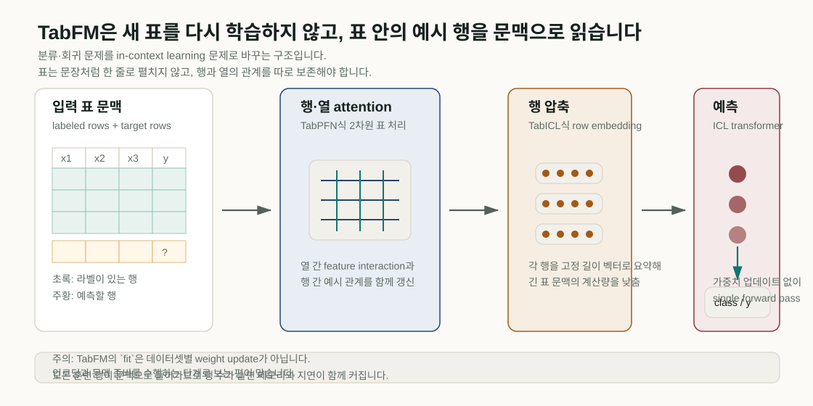
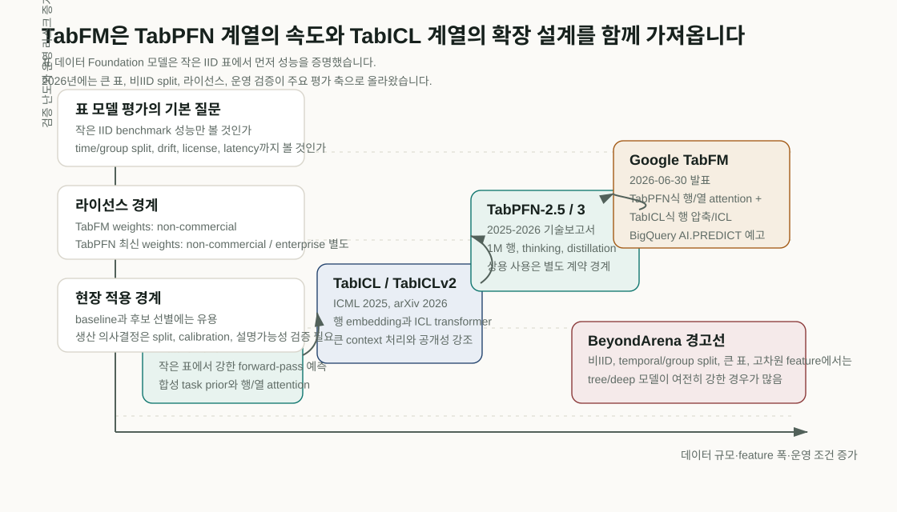
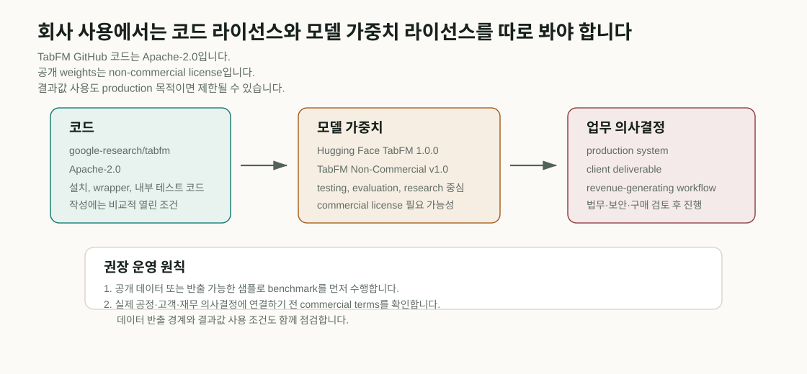
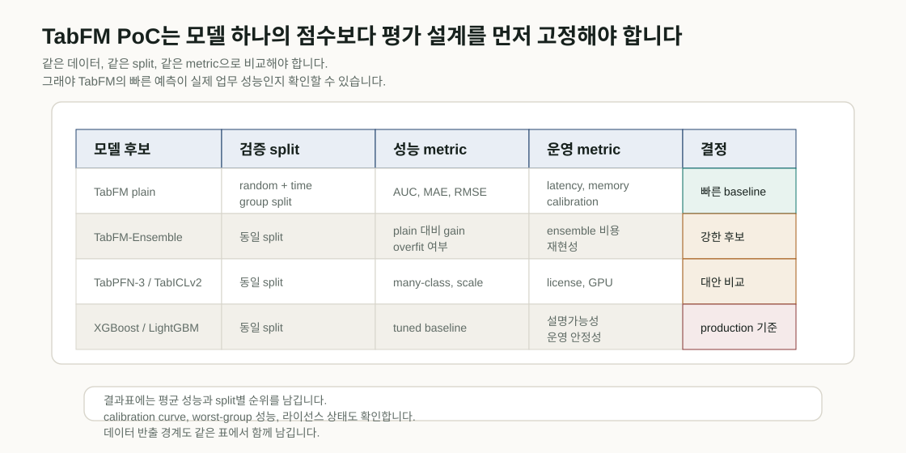

# TabFM: 표 데이터 Foundation 모델의 새 기준점

## Summary

- Google Research가 2026년 6월 30일 공개한 TabFM은 표 데이터 분류·회귀를 in-context learning 문제로 바꾸어, 데이터셋별 weight update 없이 single forward pass 예측을 내는 모델입니다.
- TabFM은 TabPFN식 행·열 attention과 TabICL식 row compression/ICL transformer를 결합합니다. 이 설계는 작은 표에서 강했던 TabPFN 계열을 더 큰 문맥 처리 쪽으로 밀어보려는 시도입니다.
- TabFM source code는 Apache-2.0이지만 공개 weights는 `TabFM Non-Commercial License v1.0`입니다. 회사 PoC와 production 의사결정을 분리해야 합니다.
- TabArena 성능 claim은 의미가 있지만, BeyondArena는 non-IID, temporal/group split, 큰 표, 고차원 feature에서는 tree/deep 모델이 여전히 강하다고 보고했습니다.
- TabPFN-3, TabFM, TabICLv2, XGBoost/LightGBM/CatBoost를 같은 split과 metric, 같은 latency·calibration 기준으로 비교하는 PoC가 가장 안전합니다.

<figure class="article-hero-figure">
  
  <figcaption><strong>그림 1.</strong> TabFM은 훈련 행과 예측 행을 하나의 표 문맥으로 넣고, 행·열 attention, 행 압축, ICL transformer를 거쳐 분류·회귀 예측을 냅니다. 모델 weight를 새 데이터셋에 맞춰 업데이트하지 않는다는 점이 기존 `fit -> tune -> predict` 업무와 다릅니다.</figcaption>
</figure>

표 데이터는 기업 업무에서 가장 오래된 AI 데이터 형식입니다. 고객 이탈, 불량 예측, 수율, 구매, 공급망, 가격, 위험 점수, 공정 recipe, 실험 결과가 모두 표로 남습니다. 그런데 표 데이터 모델링은 여전히 손이 많이 갑니다. 숫자와 범주형 변수를 정리하고, 결측의 의미를 확인하고, feature cross를 만들고, XGBoost나 LightGBM의 hyperparameter를 다시 돌리는 과정이 반복됩니다.

[Google Research가 2026년 6월 30일 공개한 TabFM](https://research.google/blog/introducing-tabfm-a-zero-shot-foundation-model-for-tabular-data/)은 이 반복을 줄이는 방향에서 나왔습니다. 새 표가 들어올 때마다 모델을 다시 학습하기보다, 라벨이 있는 행과 예측할 행을 하나의 context로 넣고 모델이 그 자리에서 관계를 읽게 합니다. Hugging Face model card는 TabFM을 classification과 regression을 지원하는 zero-shot tabular foundation model로 설명하고, training examples가 context로 전달되며 예측은 single forward pass에서 만들어진다고 정리합니다.

이 접근은 TabPFN 리뷰에서 다뤘던 질문과 바로 연결됩니다. TabPFN은 표 데이터에서 “모델 사전학습”과 “사용자가 제공하는 라벨 행 문맥”을 분리해 이해해야 했습니다. TabFM도 같은 계열의 질문을 던집니다. 모델은 사용자의 컬럼 의미를 미리 알고 있는 것이 아닙니다. 배포 전 합성 표 과제에서 학습한 절차적 prior를 가져오고, 실제 사용 시에는 표 안의 labeled rows가 target 의미를 정합니다.

::: highlight
TabFM은 표 데이터 프로젝트의 첫 비교 기준을 더 빠르게 세우는 모델입니다. XGBoost 대체 여부는 별도 검증 문제로 남습니다. 성능 주장보다 먼저 확인할 부분은 세 가지입니다. 어떤 split에서 비교했는가, 라이선스가 PoC와 production을 어떻게 나누는가, 그리고 우리 표의 시간·그룹·고차원 조건이 TabArena와 얼마나 다른가입니다.
:::

## TabFM 공개 자료에서 확인되는 것

TabFM은 현재 논문보다 공개 블로그, GitHub 저장소, Hugging Face model card가 앞서 나온 상태입니다. 2026년 7월 3일 기준으로 `TabFM: A Zero-Shot Foundation Model for Tabular Data`라는 별도 arXiv 논문은 확인하지 못했습니다. 따라서 성능과 구조는 Google의 공식 공개 자료를 1차 근거로 쓰되, 결론은 독립 벤치마크와 기존 tabular foundation model 문헌으로 보정해야 합니다.

[Google Research 블로그](https://research.google/blog/introducing-tabfm-a-zero-shot-foundation-model-for-tabular-data/)는 TabFM을 tabular classification과 regression workflow를 단순화하기 위한 foundation model로 소개합니다. 전통적인 tabular ML은 데이터셋마다 parameter update와 hyperparameter optimization, feature engineering이 필요했지만, TabFM은 tabular prediction을 in-context learning 문제로 바꿉니다. 사용자는 historical training examples와 target testing rows를 하나의 unified prompt처럼 넣고, 모델은 그 context에서 column-row 관계를 읽습니다.

[google-research/tabfm 저장소](https://github.com/google-research/tabfm)는 더 실무적인 정보를 줍니다. TabFM은 scikit-learn compatible API를 제공하고, JAX와 PyTorch backend를 지원합니다. Python은 3.11 이상이 필요하며, JAX/Flax와 PyTorch dependency가 분리되어 있습니다. 저장소는 2026년 6월 29일 `1.0.0` initial release를 changelog에 기록했고, source code는 Apache-2.0 license입니다. 다만 README에는 “officially supported Google product가 아니다”라는 문구가 들어 있습니다.

[Hugging Face model card](https://huggingface.co/google/tabfm-1.0.0-pytorch)는 적용 조건을 더 분명하게 적습니다. TabFM v1.0.0 PyTorch weights는 분류와 회귀를 지원하고, 분류는 최대 10개 class라는 hard architectural limit이 있습니다. model card는 TabFM이 numeric/categorical columns를 포함한 표에 쓰이며, fine-tuning이나 hyperparameter search 없이 zero-shot inference를 하는 용도라고 설명합니다. 반대로 raw text, graph, sequence, 10개 초과 class, task-specific fine-tuning, commercial use는 intended use 밖으로 둡니다.

## 모델 구조와 TabPFN 계열의 계보

표는 자연어 문장과 다릅니다. 문장은 앞뒤 순서가 의미를 만들지만, 표에서는 행 순서와 열 순서가 바뀌어도 데이터의 의미가 크게 달라지지 않는 경우가 많습니다. 열마다 단위와 분포가 다르고, 행은 같은 schema 안에서 서로 다른 사례를 나타냅니다. TabFM은 이 2차원 구조를 그대로 다루기 위해 세 단계를 씁니다.

첫째, TabFM은 column attention과 row attention을 번갈아 적용합니다. Google 블로그는 이 부분을 TabPFN과 유사한 설계로 설명합니다. Hugging Face model card는 Set Transformer 기반 column attention, Fourier features, per-group linear projection, induced self-attention을 언급합니다. 이 단계는 feature interaction과 row-level pattern을 함께 갱신하는 역할을 합니다.

둘째, TabFM은 각 행을 dense vector로 압축합니다. model card는 row-level attention과 RoPE를 쓰는 CLS tokens가 행을 요약한다고 설명합니다. 이 부분은 TabICL 계열의 설계와 닮았습니다. TabICL은 큰 training set을 다루기 위해 먼저 row embedding을 만들고, 그 embedding 위에서 efficient ICL을 수행했습니다.

셋째, TabFM은 압축된 row vector 위에서 24-block causal transformer를 돌립니다. training rows는 context가 되고, test rows에 대해 class나 regression target을 냅니다. 이때 모델 weight는 업데이트되지 않습니다. scikit-learn API에서는 `fit(X_train, y_train)`처럼 보이지만, 이 `fit` 단계는 전통적인 데이터셋별 학습과 다르게 인코딩과 context 준비를 수행합니다.

[Nature 2025 TabPFN 논문](https://www.nature.com/articles/s41586-024-08328-6)은 이 계열의 초반 기준을 만들었습니다. TabPFN은 합성 표 과제에서 미리 학습한 transformer가 작은 표에서 빠른 forward-pass 예측을 수행한다는 점을 제시했습니다. 논문은 최대 10,000 samples, 500 features 규모에서 gradient-boosted decision tree 계열과 비교하며 강한 성능을 보고했고, fine-tuning, data generation, density estimation, reusable embeddings 같은 foundation model 성격도 함께 제시했습니다.

[TabICL 논문](https://arxiv.org/abs/2502.05564)은 TabPFN의 큰 training set 처리 비용을 직접 겨냥했습니다. TabPFNv2가 작은 표에서 강하지만 alternating column-row attention이 큰 training set에는 부담이 된다는 문제의식에서 출발해, column-then-row attention으로 row embedding을 만들고 transformer로 ICL을 수행하는 구조를 제시했습니다. 논문은 500K samples까지 다룰 수 있다고 설명하고, 10K samples를 넘는 데이터셋에서 TabPFNv2와 CatBoost를 앞선다고 보고했습니다.

TabFM은 이 두 계열을 합친 발표로 읽힙니다. Google 블로그는 TabFM이 TabPFN과 TabICL 같은 architecture의 장점을 synthesize한다고 명시합니다. 이 점은 [Parul Pandey의 LinkedIn 공개 글](https://www.linkedin.com/posts/parulpandeyindia_another-release-in-the-tabular-foundation-activity-7478070275507535872-7_kC)에서도 다시 언급되었습니다. LinkedIn 글 자체는 성능 근거가 아니지만, 커뮤니티가 TabFM을 “TabPFN + TabICL” 계보 안에서 읽고 있음을 보여주는 신호입니다.

<figure class="figure-panel">
  
  <figcaption><strong>그림 2.</strong> TabPFN은 작은 표의 빠른 in-context 예측을 강하게 제시했고, TabICL은 더 큰 context를 다루기 위해 행 압축을 강조했습니다. TabPFN-3와 TabFM은 각각 scale, test-time compute, 제품형 공개, cloud 통합 쪽으로 경계를 넓히고 있습니다. BeyondArena는 이 계열이 아직 non-IID, 큰 표, 고차원 feature에서 완전히 해결되지 않았음을 확인하게 합니다.</figcaption>
</figure>

## TabFM과 TabPFN 비교

TabPFN과 TabFM은 모두 표 안의 labeled rows를 context로 읽는 모델입니다. 두 모델 모두 “사용자가 지금 다루는 컬럼 의미를 모델이 사전 지식으로 알고 있다”는 방식으로 작동하지 않습니다. 배포 전에는 합성 표 과제로 일반적인 예측 절차를 학습하고, 실제 사용 시에는 `X_train, y_train, X_test`가 주어진 문제의 의미를 정합니다.

차이는 구조와 공개 전략에서 나타납니다. TabPFN은 Prior-data Fitted Network 계열로, 합성 prior에서 학습한 모델이 새 표에서 Bayesian-style inference를 빠르게 수행한다는 쪽에 강한 설명을 갖습니다. TabFM은 TabPFN식 행·열 attention을 가져오면서, row compression과 ICL transformer를 결합해 더 제품형 zero-shot workflow로 제시됩니다. Google은 BigQuery `AI.PREDICT` 통합을 예고했기 때문에, TabFM은 연구 모델이면서 동시에 데이터웨어하우스 사용자에게 열리는 제품 경로의 신호입니다.

최신 비교 기준으로는 TabPFN-3를 봐야 합니다. [TabPFN-3 technical report](https://arxiv.org/abs/2605.13986)는 2026년 5월 공개되었고, 1M training rows, 더 빠른 추론, TabArena에서의 speed/performance frontier, test-time compute scaling, TabPFN-3-Plus Thinking을 강조합니다. RelBenchV1, TabSTAR, time-series benchmark, SHAP 계산 속도 개선 같은 확장도 포함합니다. 따라서 TabFM과 비교할 때는 “TabPFN v2와 TabFM”만 놓으면 최신 구도가 좁아집니다.

| 비교 항목 | TabFM | TabPFN-3 / 최신 TabPFN 계열 | 해석 |
|---|---|---|---|
| 공개 주체 | Google Research | Prior Labs / 관련 연구진 | TabFM은 Google Cloud/BigQuery와 연결될 가능성이 큼 |
| 공개 시점 | 2026-06-30 blog, 2026-06-29 initial release | 2026-05 TabPFN-3 technical report와 package default 전환 | 두 모델 모두 2026년 상반기에 빠르게 갱신 |
| 기본 문제 | classification, regression | classification, regression, plus API/extension ecosystem | 둘 다 표 예측이 중심 |
| 구조 | alternating row/column attention, row compression, 24-block ICL transformer | TabPFN architecture 확장, reduced KV cache, row chunking, thinking/test-time compute | TabFM은 TabPFN/TabICL 결합을 명시하고, TabPFN-3는 scale과 제품 기능을 밀어붙임 |
| 데이터 규모 주장 | TabArena 51 datasets, 700-150,000 samples 평가 claim. model card는 500 features 최적화와 memory scaling 경고 | technical report는 1M rows와 200 features, 100K x 2K 등 scale claim | 우리 데이터 규모·feature 폭·split 방식에 맞춰 재측정 필요 |
| class limit | HF model card 기준 최대 10 classes | TabPFN-3 docs/기존 검증 기준 160 classes까지 확장 claim | many-class 문제는 TabPFN 쪽이 더 직접적인 옵션일 수 있음 |
| text feature | current TabFM model card는 raw text intended use 밖 | TabPFN-3-Plus는 tabular-text claim 포함 | 텍스트가 많은 업무 표에서는 별도 검증 필요 |
| 사용 방식 | scikit-learn compatible, JAX/PyTorch, HF weights, BigQuery 예정 | pip package, Prior Labs API/UX, enterprise edition | 조직의 infra와 데이터 반출 정책에 따라 선택 |
| 라이선스 | code Apache-2.0, weights non-commercial | code와 일부 weights는 별도 Prior Labs License, 최신 weights는 non-commercial, enterprise/commercial 별도 | 둘 다 최신 weights production 사용은 법무 확인 필요 |
| 성능 claim의 성격 | Google 공식 blog/model card와 repo results 중심. 별도 paper 미확인 | Nature 논문, arXiv technical report, 공식 docs | TabFM은 초기 공개 claim으로 보수적으로 읽어야 함 |

이 표에서 가장 중요한 줄은 라이선스입니다. 코드가 열려 있다는 사실과 모델 weight를 회사 업무에 쓸 수 있다는 사실은 다릅니다. TabFM GitHub 저장소는 Apache-2.0이지만, Hugging Face weights는 non-commercial입니다. PriorLabs/TabPFN도 GitHub README에서 TabPFN-2.5, 2.6, 3 weights가 non-commercial license라고 설명하고, enterprise/production 환경에는 commercial license와 지원을 별도로 제시합니다.

## 성능 claim을 읽는 법

Google은 TabFM이 TabArena에서 heavily tuned supervised baselines를 앞선다고 설명합니다. Hugging Face model card는 TabArena 51 datasets, 38 classification과 13 regression 평가를 언급합니다. 또한 `TabFMClassifier.ensemble()` preset이 feature crosses, SVD features, NNLS blending을 추가해 성능을 더 끌어올린다고 적습니다.

이 대목은 plain TabFM과 TabFM-Ensemble을 나눠서 읽어야 합니다. LinkedIn 공개 글에서도 이 구분이 바로 언급되었습니다. plain TabFM은 single forward pass와 no hyperparameter search라는 메시지로 제시됩니다. TabFM-Ensemble은 cross features, SVD features, 32-way ensemble, classification calibration 같은 자동화된 pipeline 성격이 강합니다. 따라서 “feature engineering이 없다”는 문장은 plain TabFM에는 잘 맞지만, ensemble preset까지 포함한 성능 비교에서는 더 신중하게 표현해야 합니다.

[TabArena 논문](https://arxiv.org/html/2506.16791v1)은 benchmark 설계 자체의 중요성을 강조합니다. TabArena는 cross-validated ensembles, method author가 제공한 strong hyperparameter search spaces, early stopping, refitting, parallel bagging 등을 포함해 tabular model의 peak performance를 비교하려는 시스템입니다. 논문은 small dataset 조건에서 tabular foundation model이 강하다고 보고하지만, post-hoc ensembling과 cross-validation이 순위에 큰 영향을 준다는 점도 함께 제시합니다.

여기서 2026년 6월 말에 나온 [BeyondArena](https://arxiv.org/abs/2606.30410)를 같이 읽어야 합니다. BeyondArena는 standard benchmark가 tabular foundation model이 이미 잘하는 IID 데이터 쪽에 치우칠 수 있다고 지적합니다. 142 curated datasets, IID/temporal/grouped task, text와 high-cardinality features, 큰 row 수와 고차원 feature를 포함해 평가한 결과, 기존 TFM은 tiny-to-medium IID 데이터에서 강하지만 non-IID, large, high-dimensional 조건에서는 tree-based와 deep learning 모델이 여전히 우세한 경우가 많다고 보고했습니다.

이 결론은 회사 PoC에 바로 들어옵니다. 고객 이탈이나 품질 예측은 random split에서 좋아 보일 수 있습니다. 그러나 실제 업무에서는 다음 달 데이터, 다른 공장 line, 다른 supplier lot, 다른 제품 family, recipe 변경 이후 데이터가 들어옵니다. 이런 조건에서는 temporal split, group split, lot split, scaffold split 같은 검증이 필요합니다. TabFM과 TabPFN을 써볼 때도 `random split AUC` 하나로는 충분하지 않습니다.

## 라이선스와 회사 사용 경계

TabFM의 라이선스는 두 층으로 나뉩니다. [google-research/tabfm GitHub](https://github.com/google-research/tabfm)의 source code는 Apache-2.0입니다. 반면 [Hugging Face weights](https://huggingface.co/google/tabfm-1.0.0-pytorch)는 `TabFM Non-Commercial License v1.0`입니다. license text는 Non-Commercial Purpose를 testing, evaluation, research로 정의하고, commercial gain, production deployment, revenue generation과 연결된 사용을 제외합니다. commercial 또는 production activity에는 별도 commercial license가 필요하다고 적습니다.

특히 주의할 문구는 outputs입니다. license는 predictions, scores, probabilities, recommendations, explanations 같은 outputs를 정의하고, restriction 조항에서 commercial/production purposes를 위해 model, derivative, outputs and data produced by model을 쓰는 것을 금지합니다. 따라서 “모델 weight만 배포하지 않으면 된다”로 해석하기 어렵습니다. 내부 benchmark나 연구용 PoC와 생산 의사결정은 분리해야 합니다.

TabPFN도 비슷한 경계가 있습니다. [PriorLabs/TabPFN GitHub](https://github.com/PriorLabs/tabpfn)는 TabPFN-2.5, TabPFN-2.6, TabPFN-3 model weights가 non-commercial license라고 설명합니다. 코드와 TabPFN-2 weights는 Prior Labs License, 즉 Apache-2.0에 attribution requirement가 붙은 license라고 안내하지만, 최신 weights는 production 사용을 위해 commercial/enterprise 경로를 확인해야 합니다. 이전 TabPFN 리뷰에서 정리한 회사 사용 원칙도 그대로 유지됩니다. 공개 데이터 또는 반출 가능한 샘플 데이터로 가능성을 확인하고, 결과를 next experiment, production workflow, vendor/procurement, client deliverable, budget decision에 직접 연결하기 전에는 commercial license와 API agreement를 확인해야 합니다.

TabICLv2는 라이선스 비교에서 다른 위치를 가집니다. [soda-inria/tabicl 저장소](https://github.com/soda-inria/tabicl)는 TabICLv2와 TabICL의 official implementation을 제공하며, README는 permissive license와 open-source 구현을 강조합니다. license는 BSD-3-Clause이고, forecast 디렉터리 일부는 TabPFN-TS derived work로 Apache-2.0 항목을 포함합니다. 최신 성능과 운영 안정성은 별도 검증해야 하지만, 라이선스 면에서는 TabFM/TabPFN 최신 weights와 다른 선택지입니다.

<figure class="figure-panel">
  
  <figcaption><strong>그림 3.</strong> TabFM은 source code와 model weights의 라이선스가 다릅니다. 연구·평가용 PoC와 production workflow, 고객 deliverable, 매출 활동을 분리해서 검토해야 합니다.</figcaption>
</figure>

| 용도 | TabFM | TabPFN-3 | TabICLv2 | 기존 GBDT |
|---|---|---|---|---|
| 공개 데이터 benchmark | 가능 | 가능 | 가능 | 가능 |
| 사내 샘플 PoC | license 범위가 research/evaluation인지 확인 | license 범위가 research/evaluation인지 확인 | BSD-3-Clause 기반 사용 가능성이 큼 | 일반적으로 가능 |
| production dashboard | 현재 공개 weights만으로는 부적합. commercial license/API terms 필요 | commercial/enterprise license 필요 | 조직 정책과 dependency/license 검토 필요 | 일반적으로 가능 |
| 고객 deliverable | license상 주의. output 사용도 제한될 수 있음 | license상 주의 | license와 모델 품질 책임 검토 | 일반적으로 가능 |
| 데이터 반출 | HF local weights면 로컬 가능, BigQuery/API는 terms 확인 | local/API 선택 가능, API는 반출 심사 | local 가능 | local 가능 |

## 활용 후보

TabFM의 첫 활용은 “빠른 비교 기준”입니다. 사내 표 데이터 프로젝트에서 baseline을 만드는 데 걸리는 시간을 줄일 수 있습니다. 예를 들어 공정 품질 예측, defect classification, supplier risk scoring, 실험 후보 선별, 고객 churn, pricing risk 같은 업무에서 TabFM은 `X_train, y_train, X_test`를 빠르게 넣어 결과를 확인하는 모델이 될 수 있습니다.

두 번째 활용은 데이터웨어하우스 안의 low-friction prediction입니다. Google은 TabFM을 BigQuery에 통합해 `AI.PREDICT` SQL command로 regression과 classification을 수행할 예정이라고 밝혔습니다. 이 기능이 실제로 열리면, analyst도 SQL 안에서 표 예측을 요청할 수 있습니다. 이 경우에는 모델 성능, Cloud terms, 데이터 위치, audit log, 비용, model versioning, access control이 함께 검토 대상이 됩니다.

세 번째 활용은 모델 선택 자동화의 후보입니다. TabFM, TabPFN-3, TabICLv2, XGBoost, LightGBM, CatBoost, AutoGluon을 같은 harness에서 돌리고, 데이터 조건에 따라 어떤 모델이 빠르게 높은 점수를 내는지 기록할 수 있습니다. 이때 TabFM은 “튜닝 없는 첫 결과”로 유용하고, TabFM-Ensemble은 “자동 feature/ensemble까지 포함한 강한 후보”로 따로 평가해야 합니다.

네 번째 활용은 domain expert와 데이터 엔지니어의 협업을 빠르게 만드는 일입니다. TabFM이 feature engineering을 줄인다고 해서 domain knowledge가 사라지지는 않습니다. 표의 한 행이 무엇을 의미하는지, target이 언제 확정되는지, prediction time에 볼 수 없는 정보가 입력에 섞이지 않았는지, lot이나 시간축이 train/test에 섞였는지 확인하는 일은 여전히 사람이 해야 합니다.

## PoC 설계 체크리스트

TabFM을 회사에서 검토한다면, 첫 PoC는 모델 하나를 돌려보는 일보다 평가 설계를 먼저 정하는 작업입니다.

| 체크 항목 | 질문 | 권장 처리 |
|---|---|---|
| 라이선스 | 공개 weights를 어떤 목적으로 쓰는가 | research/evaluation PoC로 제한하고, production/상업 의사결정 전 legal review |
| 데이터 반출 | 데이터가 외부 API나 cloud service로 나가도 되는가 | local weights, BigQuery, API별로 보안·개인정보·영업비밀 경계 확인 |
| split | random split이 실제 배포 조건을 반영하는가 | time split, group split, lot split, product-family split을 최소 1개 이상 포함 |
| 비교 모델 | TabFM만 볼 것인가 | TabPFN-3, TabICLv2, XGBoost, LightGBM, CatBoost, AutoGluon을 같은 metric으로 비교 |
| metric | 평균 성능만 볼 것인가 | calibration, PR-AUC, recall at fixed precision, MAE/RMSE, prediction interval, latency 함께 기록 |
| feature width | 500 feature를 넘는가 | TabFM model card가 500 feature 최적화를 말하므로 feature selection/embedding/GBDT baseline 병행 |
| class count | 10개 class를 넘는가 | TabFM hard limit 확인. TabPFN-3, TabICLv2 many-class 옵션 검토 |
| drift | 새 기간·새 설비·새 supplier에서 유지되는가 | holdout month, new line, new supplier split을 별도 평가 |
| 설명가능성 | 누가 왜 이 예측을 신뢰해야 하는가 | SHAP/feature importance가 가능한 baseline과 함께 compare. ICL 모델의 설명 한계 기록 |
| robustness | 작은 입력 교란에 민감한가 | adversarial/test-time perturbation, missingness, category drift stress test |

<figure class="figure-panel">
  
  <figcaption><strong>그림 4.</strong> TabFM PoC는 단일 모델의 평균 점수표로 끝내지 않는 편이 좋습니다. plain TabFM, TabFM-Ensemble, TabPFN-3, TabICLv2, GBDT 계열을 같은 split과 운영 metric으로 비교해야 생산 적용 가능성을 판단할 수 있습니다.</figcaption>
</figure>

[On the Robustness of Tabular Foundation Models](https://arxiv.org/html/2506.02978v2)는 TabPFN과 TabICL 같은 tabular FM이 test-time perturbation과 adversarial manipulation에 취약할 수 있음을 보였습니다. 금융, 보안, 의료처럼 의사결정 책임이 큰 영역에서는 평균 성능보다 robust evaluation이 먼저 문제됩니다. TabFM도 같은 계열의 in-context tabular FM이므로, 사용 전에 입력 교란과 context 변화에 대한 민감도를 확인해야 합니다.

## LinkedIn 반응에서 드러난 도입 질문

LinkedIn 공개글은 현장의 반응을 보는 자료입니다. 성능 주장의 근거는 공식 문서와 논문에 두었습니다. [Weihao Kong의 공개 글](https://www.linkedin.com/posts/weihao-kong-a0514338_proud-to-share-tabfm-our-zero-shot-foundation-activity-7477835423990611969-ELm1)은 TabFM을 TabArena 1위, no training, no hyperparameter tuning, no feature engineering, BigQuery integration coming soon으로 소개했습니다. 이 표현에서는 Google이 TabFM을 모델 논문 형식에 머물지 않는 workflow 단축 도구로 positioning하고 있음이 드러납니다.

반응은 기대와 경계가 동시에 보입니다. [Google Research LinkedIn post](https://www.linkedin.com/posts/googleresearch_introducing-tabfm-a-foundation-model-designed-activity-7477824083703844865-hrqW)의 댓글에는 XGBoost를 너무 빨리 묻어서는 안 된다는 의견, TabFM-Ensemble의 자동 feature/ensemble 구성을 benchmark optimization bias로 봐야 한다는 비판, regulatory audit에서 ICL attention map이 충분한 설명이 되기 어렵다는 우려가 달렸습니다. [Mitko Vasilev의 글](https://www.linkedin.com/posts/mitkox_google-just-dropped-tabfm-a-zero-shot-foundation-activity-7478054705311576066-bm4w) 댓글에서도 representational capacity, drift, oversight 문제가 나왔습니다.

이 반응은 TabFM 리포트의 결론을 더 조심스럽게 만듭니다. TabFM은 표 모델링의 friction을 줄이는 유용한 후보입니다. 하지만 friction이 줄어든다고 검증 책임이 사라지는 것은 아닙니다. 모델이 데이터셋별 학습을 하지 않는다면, 오히려 context 구성, split 설계, label timing, feature leakage, drift monitoring이 더 눈에 띄어야 합니다.

## 업무 적용 판단

TabFM을 먼저 써볼 만한 업무는 작은 표 또는 중간 규모의 IID에 가까운 표입니다. 라벨이 충분히 있고 target 정의가 안정적이며, feature가 500개 안팎에서 관리되고, class 수가 10개 이하인 문제라면 좋은 첫 baseline이 될 수 있습니다. 고객 churn, 단순 fraud scoring, 초기 품질 분류, 실험 후보 ranking, 설비 이상 조기 신호 같은 문제에서 빠른 PoC를 만들기 좋습니다.

더 어려운 조건에서는 TabFM을 단독 후보로 두지 않는 편이 좋습니다. 월별 drift가 크거나, 설비·라인·공급사 group이 바뀌거나, feature가 수천 개 이상이거나, text column과 high-cardinality category가 많거나, class가 10개를 넘는 문제에서는 TabPFN-3, TabICLv2, GBDT, AutoGluon을 함께 비교해야 합니다. BeyondArena가 지적한 어려운 조건은 산업 표 데이터에서 자주 만나는 조건입니다.

기존 TabPFN 리뷰에서 다룬 OLED/제조 데이터에도 같은 원칙이 적용됩니다. OLED 후보, 공정 recipe, 검사 결과, SCM lot 이력은 모두 표로 만들 수 있지만, 한 행의 의미와 label 확정 시점이 중요합니다. TabFM이 feature engineering을 덜 요구한다는 발표를 그대로 받아들이기보다, 계산 protocol, 측정 조건, batch/lot, recipe revision, 설비 상태, operator, time window 같은 조건을 표 안에 어떻게 기록할지 먼저 결정해야 합니다.

## 결론

TabFM은 tabular foundation model 흐름이 연구 논문을 넘어 제품형 공개와 데이터웨어하우스 통합으로 이동하고 있음을 분명히 드러냅니다. 이 점에서 TabFM은 단순한 새 모델보다 신호가 큽니다. 표 데이터는 기업 업무의 기본 형식이고, BigQuery 같은 데이터 플랫폼 안에서 `AI.PREDICT` 형태로 열리면 모델 개발자와 analyst 사이의 경계가 달라질 수 있습니다.

다만 2026년 7월 현재 TabFM은 보수적으로 다뤄야 합니다. 공식 자료는 강한 TabArena 성능을 말하지만 별도 논문은 아직 확인되지 않았고, 공개 weights는 non-commercial license입니다. TabFM-Ensemble의 성능은 자동 feature/ensemble pipeline의 도움을 받습니다. BeyondArena는 tabular foundation model이 작은 IID 표에서 강하지만, 더 어려운 산업 조건에서는 기존 tree/deep 모델이 여전히 강하다고 보고했습니다.

사내 검토의 권장 순서는 분명합니다. 먼저 license와 데이터 반출 경계를 확인합니다. 그 다음 같은 split과 metric으로 TabFM, TabPFN-3, TabICLv2, XGBoost/LightGBM/CatBoost를 비교합니다. 마지막으로 time/group split, calibration, latency, robustness, 설명가능성을 확인합니다. 이 절차를 거치면 TabFM은 “새로운 대체재”보다 “빠른 검증 후보이자 데이터 플랫폼형 모델링의 신호”로 더 정확하게 자리 잡습니다.

## 작성정보

- 작성자: 김현중, AI Governance 팀
- 작성 보조 및 퇴고: Codex 기반 GPT-5 계열 에이전트 하네스
- 작성일: 2026-07-03
- 검증 기준일: 2026-07-03 06:39 KST
- 처음 참고한 맥락: 사용자 요청. 기존 `2026-05-07_tabpfn-oled-manufacturing-foundation-model` 리뷰의 비교축과 TabPFN pretraining/context 설명을 참고했습니다.
- 주요 검증 자료: Google Research TabFM blog, google-research/tabfm GitHub, Hugging Face TabFM model card and license, Nature 2025 TabPFN 논문, TabPFN-2.5/3 arXiv technical reports, TabICL/TabICLv2 arXiv, TabArena/BeyondArena, robustness paper, NeurIPS 2022 tree-vs-deep tabular benchmark, LinkedIn 공개글.
- 검증 메모: [2026-07-03_tabfm-tabular-foundation-model_sources.md](../notes/2026-07-03_tabfm-tabular-foundation-model_sources.md)
- 빠른 메모: [2026-07-03_tabfm-tabular-foundation-model_memo.md](2026-07-03_tabfm-tabular-foundation-model_memo.md)
- 시각 자료 기록: [figure_manifest.md](../artifacts/final_review/figure_manifest.md)
- OpenProject 동기화: target work package 미지정으로 보류했습니다.
- Skywork slide 생성: 사용자가 이번 요청에서 리포트 작성을 우선 요청했으므로 실행하지 않았습니다. 발표자료가 필요하면 이 리포트를 바탕으로 Skywork deck prompt를 별도 작성할 수 있습니다.
- Obsidian mirror: `C:\Users\angpa\Obsidian_Vault\AI_Tech_Review\2026-07-03_tabfm-tabular-foundation-model`에 Markdown mirror를 생성합니다.
- 문체 기준: `.codex/rules/writing-harness.md`, `.codex/rules/visuals-and-image-generation.md`, `.codex/rules/skills-and-verification.md`, `hkim_Writings/2026-05-10_KIAS_Quanta_CHEY_참고스타일_체크가이드.md`를 적용했습니다.

## References

### TabFM 공식 자료

- [Google Research Blog: Introducing TabFM: A zero-shot foundation model for tabular data](https://research.google/blog/introducing-tabfm-a-zero-shot-foundation-model-for-tabular-data/)
- [google-research/tabfm GitHub repository](https://github.com/google-research/tabfm)
- [google/tabfm-1.0.0-pytorch Hugging Face model card](https://huggingface.co/google/tabfm-1.0.0-pytorch)
- [TabFM Non-Commercial License v1.0](https://huggingface.co/google/tabfm-1.0.0-pytorch/blob/main/LICENSE)

### TabPFN, TabICL, benchmark 논문

- [Accurate predictions on small data with a tabular foundation model, Nature 2025](https://www.nature.com/articles/s41586-024-08328-6)
- [TabPFN-2.5: Advancing the State of the Art in Tabular Foundation Models](https://arxiv.org/abs/2511.08667)
- [TabPFN-3: Technical Report](https://arxiv.org/abs/2605.13986)
- [PriorLabs/TabPFN GitHub repository](https://github.com/PriorLabs/tabpfn)
- [TabICL: A Tabular Foundation Model for In-Context Learning on Large Data](https://arxiv.org/abs/2502.05564)
- [TabICLv2: A better, faster, scalable, and open tabular foundation model](https://arxiv.org/abs/2602.11139)
- [soda-inria/tabicl GitHub repository](https://github.com/soda-inria/tabicl)
- [TabArena: A Living Benchmark for Machine Learning on Tabular Data](https://arxiv.org/html/2506.16791v1)
- [autogluon/tabarena GitHub repository](https://github.com/autogluon/tabarena)
- [Beyond IID: How General Are Tabular Foundation Models, Really?](https://arxiv.org/abs/2606.30410)
- [On the Robustness of Tabular Foundation Models: Test-Time Attacks and In-Context Defenses](https://arxiv.org/html/2506.02978v2)
- [Why do tree-based models still outperform deep learning on tabular data?](https://arxiv.org/abs/2207.08815)

### LinkedIn 공개 신호

- [Google Research LinkedIn post on TabFM](https://www.linkedin.com/posts/googleresearch_introducing-tabfm-a-foundation-model-designed-activity-7477824083703844865-hrqW)
- [Weihao Kong LinkedIn post on TabFM](https://www.linkedin.com/posts/weihao-kong-a0514338_proud-to-share-tabfm-our-zero-shot-foundation-activity-7477835423990611969-ELm1)
- [Parul Pandey LinkedIn post on TabFM and TabFM-Ensemble](https://www.linkedin.com/posts/parulpandeyindia_another-release-in-the-tabular-foundation-activity-7478070275507535872-7_kC)
- [Mitko Vasilev LinkedIn post on enterprise TabFM use](https://www.linkedin.com/posts/mitkox_google-just-dropped-tabfm-a-zero-shot-foundation-activity-7478054705311576066-bm4w)
- [Christoph Molnar LinkedIn post: state of tabular foundation models in 2026](https://www.linkedin.com/posts/christoph-molnar_whats-the-state-of-tabular-foundation-models-activity-7429452806282956800-0lqV)
- [Lennart Purucker LinkedIn post on BeyondArena](https://www.linkedin.com/posts/lennart-purucker_machinelearning-tabulardata-foundationmodels-activity-7477657321989660673-IBhq)
