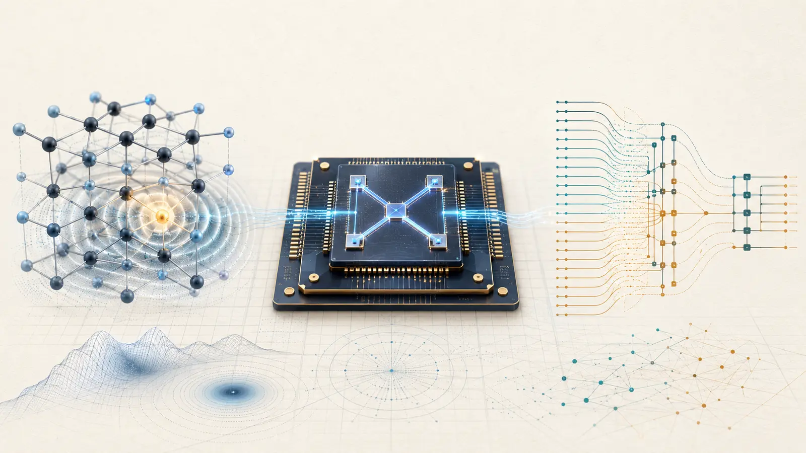
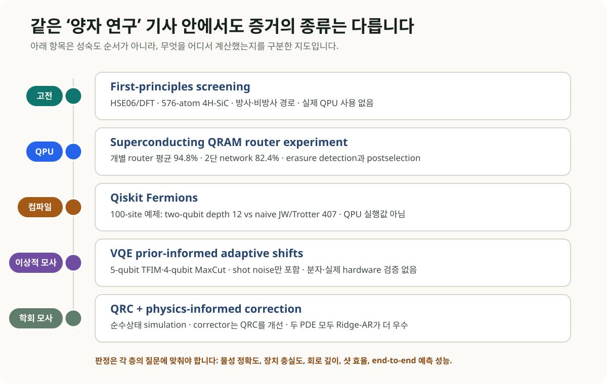
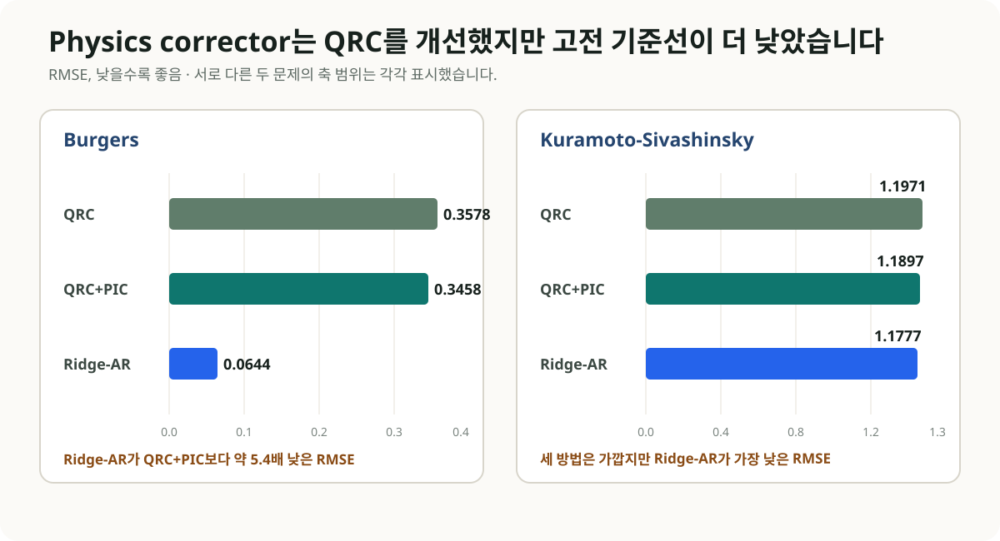

# 재료 계산에서 QRAM까지: 양자 연구를 계산 계층으로 읽는 법

양자컴퓨팅 소식을 한꺼번에 읽다 보면 서로 전혀 다른 종류의 결과가 같은 문장 안에 놓입니다. 4H-SiC 결함을 계산한 first-principles 연구, 초전도 프로세서에서 구현한 QRAM router, 100-site 회로를 줄인 compiler, VQE optimizer, 양자 reservoir simulation이 모두 ‘양자’라는 이름 아래 등장합니다. 어떤 하드웨어에서 무엇을 실제로 계산했는지부터 나누면, 성취와 미입증 범위가 훨씬 분명해집니다.

*그림 1. 생성 개념 일러스트. 왼쪽의 SiC 결함 계산, 가운데 실제 QPU router, 오른쪽의 회로·compiler 표현은 서로 다른 연구 층을 나타냅니다. SiC 계산이 양자칩에서 수행됐다는 뜻은 아닙니다.*

## 먼저 판정표를 세워보자

| 업데이트 | 실제 플랫폼 | 확인된 결과 | 아직 확인되지 않은 것 |
| --- | --- | --- | --- |
| 4H-SiC color-center screening | 고전 HSE06/DFT | 방사·비방사 경로를 함께 평가하고 네 후보 제시 | QPU 계산, 실험 확정, 완전한 multimode line shape |
| QRAM router | 초전도 QPU | erasure 검출·postselection 조건에서 개별 router 평균 94.8%, 2단 network 82.4% fidelity | 대규모 QRAM, 대용량 데이터 적재, QML end-to-end 가속 |
| Qiskit Fermions | compiler·고전 소프트웨어 | 100-site 예제에서 compiled two-qubit depth 12 | 100-site 실제 QPU 정확도·샷·실행시간 |
| VQE PAS | 이상적 고전 시뮬레이션 | shot budget에 따른 parameter shift 선택 개선 | 분자 Hamiltonian, hardware noise·drift, 실제 장치 성능 |
| QRC+PIC | 순수상태 고전 시뮬레이션 | physics corrector가 QRC 자체를 소폭 개선 | Ridge-AR 대비 우위, 실제 QPU 가속 |

*그림 2. 이 도식은 성숙도 순서를 표시하지 않습니다. 물성 정확도, 장치 충실도, 회로 깊이, 샷 효율, 예측 성능처럼 서로 다른 증거 유형을 각자 맞는 기준으로 평가해야 합니다.*

## 1. SiC 결함 계산: 양자소재 연구지만 계산은 고전 DFT다

2026년 8월 25일 *npj Computational Materials*에 공개된 연구는 4H-SiC에서 광학적으로 주소 지정 가능한 spin-qubit 결함을 고르는 first-principles framework를 제시했습니다. VASP와 HSE06을 이용한 576-atom supercell 계산으로 방사 전이, phonon sideband, 비방사 전이를 한 workflow에 넣었습니다. 실제 QPU와 양자 알고리즘은 사용하지 않았습니다.

연구진은 NCVSi-1, OCVSi0, FCVSi+1, ClCVSi+1를 유망 후보로 제시했습니다. zero-phonon-line 효율은 각각 8.7%, 11%, 7.9%, 3.4%였습니다. OCVSi0와 ClCVSi+1의 Debye-Waller factor는 10.1%와 3.0%였고, 기존 multimode 계산값 13.4%와 2.12%에 비교했습니다.

이 속도는 의도적인 근사에서 나옵니다. 논문은 1D effective phonon mode, constant electron-phonon matrix element, three-point approximation을 사용했습니다. 후보 선별에는 효율적이지만 상세 phonon line shape와 band-edge transition의 finite-size correction까지 대체하지는 못합니다.

### OLED 연구에 바로 가져올 부분

인광·TADF 후보도 수직 여기 에너지 하나만으로 순위를 정하기 어렵습니다. 방사율, 비방사 경로, vibronic coupling이 서로 다른 방향으로 움직일 수 있기 때문입니다. 넓은 chemical space에서는 저비용 근사로 세 채널을 함께 선별하고, 소수 후보만 multimode·고정밀 계산과 spectroscopy로 검증하는 계층형 설계가 현실적입니다. 이번 SiC framework는 물질은 다르지만 workflow 설계 측면에서 직접 참고할 만합니다.

## 2. QRAM router: 오늘 항목 중 실제 QPU 실험은 이것이다

같은 날 *Physical Review X*에 공개된 연구는 superconducting processor에서 bucket-brigade QRAM의 coherent router를 구현했습니다. auxiliary qutrit level을 사용하는 transition composite gate를 설계했고, erasure를 검출해 postselection한 조건에서 세 개의 개별 router 평균 fidelity 94.8%, 2단 routing network 82.4%를 보고했습니다. 2단 network의 non-erasure 구성은 81.9%였습니다. 주소를 서로 떨어진 qutrit 상태에 부호화해 일부 오류를 erasure로 검출하는 구조입니다.

이 실험은 HHL·QML 문헌에서 자주 가정하는 coherent data routing의 하드웨어 구성요소를 실제 장치에서 보여줍니다. 성능 수치는 동시에 확장 부담도 드러냅니다. 개별 router에서 2단 network로 이동할 때 fidelity가 낮아졌고, postselection을 적용한 조건부 결과는 무조건부 성공률과 구분해야 합니다.

2단 router는 대규모 QRAM과 같지 않습니다. 대용량 고전 데이터를 coherent state로 적재하는 비용, 주소·memory cell 규모, 오류정정, 전체 알고리즘의 wall-clock은 아직 측정되지 않았습니다. 따라서 이 결과를 QML data-loading bottleneck 해결이나 학습 가속으로 일반화할 수 없습니다.

## 3. Qiskit Fermions: 도메인 구조를 compiler 후단까지 보존한다

IBM이 8월 24일 소개한 Qiskit Fermions는 fermionic operator와 circuit, 사용자 정의 fermion-to-qubit mapping, Qiskit transpiler 연동을 제공하는 open-source toolbox입니다. Pauli string으로 너무 일찍 변환하지 않고 fermionic locality와 parity 구조를 compilation 단계까지 유지하는 것이 설계의 중심입니다. ffsim 고전 시뮬레이터와 SQD addon도 연동합니다.

1D Fermi-Hubbard time evolution 예제에서 one-ancilla flow-set encoding은 4-100 site에 걸쳐 compiled two-qubit depth 12를 유지했습니다. 100 site의 naive Jordan-Wigner/Trotter compilation은 depth 407이었습니다. 두 수치는 compiler가 만든 회로의 깊이입니다. 실행시간과 성공확률은 이 비교에서 측정하지 않았으며, 실제 100-site QPU의 정확도, shots, routing overhead, wall-clock 결과도 아직 없습니다.

이 사례는 양자 소프트웨어 합성에서 도메인별 중간표현이 왜 중요한지 보여줍니다. 전자구조 연산을 일반 Pauli 연산으로 조기에 풀어버리면 compiler가 활용할 수 있는 보존량과 locality 정보가 줄어듭니다. Classiq 같은 synthesis 플랫폼을 평가할 때도 최종 gate count만 보는 대신, 어떤 구조 정보가 synthesis 입력에 남아 있었는지 확인해야 합니다.

## 4. VQE optimizer: 더 좋은 qubit와 별개로 샷 배치가 남는다

8월 21일 제출된 PAS(prior-informed adaptive shifts) 프리프린트는 Rotosolve/NFT 계열의 세 energy evaluation 위치를 조절합니다. minimizer에 대한 von Mises prior가 약할 때 shift를 2π/3 부근에 두고, 확신이 커질수록 π/2 쪽으로 이동시키는 방식입니다.

검증은 Qiskit ideal simulation에서 수행했습니다. 5-qubit transverse-field Ising model의 3-layer EfficientSU2 ansatz는 40 parameters, 4-qubit MaxCut의 5-layer hardware-efficient ansatz는 20 parameters였습니다. hardware noise와 drift는 없고 shot noise만 포함했습니다. 분자 Hamiltonian과 실제 QPU에서 아직 검증되지 않았지만, VQE 총비용에서 샷을 어느 parameter와 shift에 배분할지라는 별도 최적화 문제를 명시적으로 다룹니다.

## 5. QML에서 간단한 고전 기준선이 결론을 바꾼 사례

QNRL@WCCI 2026 accepted workshop paper는 quantum reservoir computing(QRC)으로 reduced-order PDE의 POD coefficients를 예측하고 physics-informed corrector(PIC)로 후처리했습니다. 순수상태 QRC 시뮬레이션이며 실제 QPU 실험은 아닙니다.

Kuramoto-Sivashinsky 문제에서 QRC의 RMSE는 1.1971, QRC+PIC는 1.1897로 개선됐습니다. Ridge-AR는 1.1777로 더 낮았습니다. Burgers 문제에서는 QRC 0.3578, QRC+PIC 0.3458, Ridge-AR 0.0644였습니다. 다섯 seed의 held-out trajectory 결과입니다.

*그림 3. PIC는 QRC 자체를 개선했지만 두 문제 모두 Ridge-AR가 더 낮은 RMSE를 기록했습니다. 두 패널은 문제별 값의 차이를 보이기 위해 서로 다른 축 범위를 사용합니다.*

산업 CFD에서 참고할 부분은 physics-informed correction을 독립 모듈로 두는 구조입니다. 현재 수치만으로는 양자 reservoir의 필요성이나 우위를 말하기 어렵습니다. Ridge/AR, operator learning, neural PDE solver를 같은 데이터·계산 예산으로 비교해야 합니다.

## DFT·ML·OLED 업무에서 남길 평가 원장

오늘의 결과를 실제 연구 workflow에 넣으려면 각 계산층의 지표를 분리해 기록해야 합니다.

1. **재료 screening:** 에너지 오차와 함께 방사율, 비방사율, vibronic coupling, 실험 spectrum·lifetime을 기록합니다.
2. **양자화학 회로:** active space, mapping, compiled two-qubit depth, routing, fidelity, shots, total wall-clock을 함께 남깁니다.
3. **VQE:** optimizer iteration 수, parameter별 shots, drift, error mitigation, classical optimization 비용을 모두 합산합니다.
4. **QML·PDE:** 간단한 Ridge/AR부터 강한 operator-learning baseline까지 동일한 split과 compute budget으로 비교합니다.
5. **주장의 층:** 실제 QPU, noisy/ideal simulator, 고전 emulation, quantum-inspired 방법, compiler-only 결과를 표의 별도 열로 둡니다.

## 결론

8월 25일의 업데이트는 양자컴퓨팅이 하나의 단일 성능축으로 진전하지 않는다는 점을 보여줍니다. SiC 논문은 고전 first-principles screening을 정교하게 만들었고, QRAM 논문은 실제 QPU의 routing primitive를 시험했습니다. Qiskit Fermions는 회로 합성 전의 표현 계층을 개선했으며, PAS와 QRC+PIC는 각각 이상적 시뮬레이션과 워크숍 수준에서 알고리즘 아이디어를 평가했습니다.

OLED·재료 연구에서 당장 적용하기 좋은 부분은 방사·비방사 채널을 함께 거르는 screening 설계와 fermionic structure를 보존하는 compilation 원칙입니다. QRAM과 VQE/QML 결과는 향후 QPU 실험에서 비교할 지표를 구체화합니다. 같은 문제·정확도·총비용에서 강한 고전 기준선을 넘어섰는지는 별도의 검증으로 남겨야 합니다.

## References

1. [Unified first-principles framework for predicting radiative and non-radiative processes in color centers, npj Computational Materials (2026-08-25)](https://www.nature.com/articles/s41524-026-02267-8)
2. [Demonstrating Coherent Quantum Routers for Bucket-Brigade Quantum Random Access Memory on a Superconducting Processor, Physical Review X (2026-08-25)](https://journals.aps.org/prx/abstract/10.1103/h5m3-qrn9)
3. [IBM, Introducing Qiskit Fermions (2026-08-24)](https://www.ibm.com/quantum/blog/qiskit-fermions)
4. [Fermionic circuit synthesis reference, arXiv:2512.11418](https://arxiv.org/abs/2512.11418)
5. [Prior-Informed Adaptive Shifts for Sequential Minimal Optimization in VQE, arXiv:2608.21616](https://arxiv.org/abs/2608.21616)
6. [Quantum Reservoir Computing with Physics-Informed Correction for Reduced-Order PDE Forecasting, arXiv:2608.23119](https://arxiv.org/abs/2608.23119)
7. [Particle View of Many-Body Electronic Structure with Neural Network Wave Function, Physical Review X (2026-08-24)](https://journals.aps.org/prx/abstract/10.1103/g6v2-grnl)

<small>작성자: 김현중. 작성 보조 및 퇴고: Codex 기반 GPT-5 계열 에이전트 하네스. 검증 기준일: 2026-08-26. 공개 LinkedIn 검색에서는 원 논문으로 역추적할 수 있는 새로운 고신호 기술 게시물을 확인하지 못했습니다.</small>
