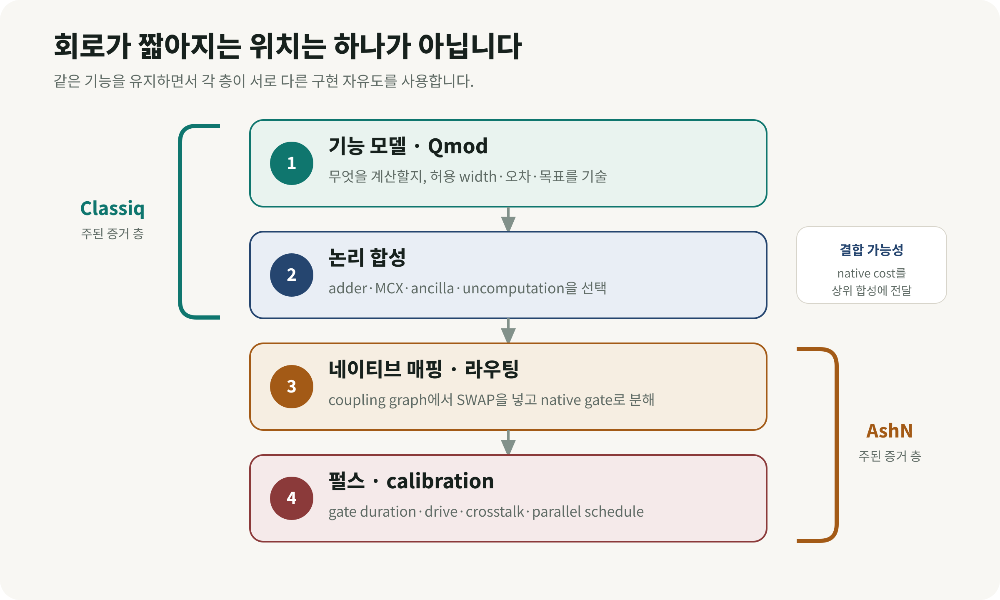
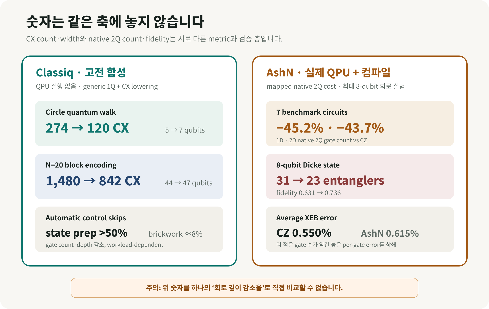

# 양자 회로는 어디에서 짧아지는가: Classiq 합성과 AshN 네이티브 게이트

같은 계산을 하는 양자 회로인데 한쪽은 274개의 CX가 필요하고 다른 쪽은 120개로 끝납니다. 같은 평면형 초전도 칩인데도 CZ만 쓸 때보다 2-큐비트 게이트가 약 44–45% 줄어듭니다. 사라진 게이트는 계산을 생략해서 없어진 것이 아닙니다. **같은 기능을 구현하는 여러 방법 가운데 무엇을 언제 선택했는가**가 달랐습니다.

2026년 8월 25일 공개된 AshN 연구는 Classiq의 회로 최적화 연구와 닮아 있습니다. 다만 두 연구가 회로를 줄이는 위치는 다릅니다. Classiq은 알고리즘과 함수의 구현을 고르는 상위 합성 단계에서 자유도를 사용하고, AshN은 칩이 직접 실행하는 네이티브 2-큐비트 동작과 라우팅 단계에서 자유도를 사용합니다. 이 구분을 먼저 세우면 두 연구의 공통점, 정량 결과, 아직 입증되지 않은 범위가 자연스럽게 보입니다.

*그림 1. 생성 개념 일러스트. 왼쪽은 기능 모델과 회로 후보, 가운데는 합성·라우팅, 오른쪽은 초전도 프로세서의 네이티브 제어를 나타냅니다. 특정 Classiq 화면이나 AshN 실험 장치를 그대로 재현한 그림은 아닙니다.*

## 먼저 결론: 비슷한 철학, 서로 다른 증거

| 항목 | Classiq 계열 연구 | AshN 연구 |
| --- | --- | --- |
| 분류 | [프리프린트] 고전 컴파일·회로 합성 | [프리프린트] 실제 QPU 실험 + 고전 컴파일 확장 연구 |
| 줄이는 위치 | 기능 모델, 함수 구현, 제어 패턴, ancilla 배치 | 네이티브 2-큐비트 게이트, topology-aware routing |
| 대표 지표 | CX **개수**·qubit width, 일부 연구의 gate count·depth | mapped native 2Q gate count, 2Q depth overhead, 실제 state fidelity |
| 실제 QPU | 대표 합성·control-skip 결과에는 없음 | 최대 8-qubit 회로 실험, 12-qubit chain·3×3 array에서 gate calibration |
| 공통 원리 | 동일 기능의 구현을 너무 일찍 한 회로로 고정하지 않음 | 동일 기능의 구현을 너무 일찍 한 gate set과 routing으로 고정하지 않음 |
| 입증하지 않은 것 | QPU wall-clock 가속, 양자우위 | 대규모 calibration 확장, fault-tolerant 이득, 양자우위 |

여기서 가장 중요한 정정이 하나 있습니다. Classiq의 대표 합성 논문에서 274→120과 1,480→842는 회로 깊이를 보고한 값이 아닙니다. **CX 개수와 qubit width의 절충**입니다. Classiq의 별도 automatic control-skip 연구는 gate count와 depth 감소를 함께 보고합니다. AshN의 45.2%·43.7%도 depth를 뜻하지 않습니다. 1D·2D topology에서의 **mapped 2-큐비트 gate count 감소**입니다. 서로 다른 지표를 하나의 ‘깊이 감소율’ 막대그래프로 합치면 잘못된 비교가 됩니다.

## 1. 연구 배경: 알고리즘 그림과 칩이 실행하는 회로 사이

양자 알고리즘 책에서는 멀리 떨어진 두 논리 큐비트도 선 하나로 연결해 gate를 그릴 수 있습니다. 실제 초전도 칩은 대개 평면 위의 이웃한 물리 큐비트끼리만 직접 상호작용합니다. 논리 큐비트 A와 B가 서로 만나야 하는데 칩에서 떨어져 있다면, compiler는 SWAP을 넣어 상태의 위치를 옮깁니다. SWAP 자체도 여러 entangling gate로 분해되므로 gate count, mapped depth와 누적 오류가 늘어납니다.

이때 최종 자원량은 알고리즘 수식만으로 정해지지 않습니다.

1. 덧셈·MCX·state preparation을 어떤 회로로 구현했는가
2. ancilla qubit를 더 써서 gate를 줄일 것인가, qubit를 아끼고 gate를 늘릴 것인가
3. 칩의 coupling graph에서 논리 qubit를 어디에 배치하고 어떻게 옮길 것인가
4. CZ·iSWAP·AshN처럼 어떤 동작을 native gate로 직접 실행할 수 있는가
5. 각 gate의 pulse duration, calibration error와 병렬 실행 가능성이 어떠한가

*그림 2. Classiq과 AshN은 겹치는 부분이 있지만 주된 최적화 층이 다릅니다. Classiq은 위쪽의 기능·논리 합성, AshN은 아래쪽의 native routing·pulse control에 직접 근거를 둡니다.*

### ‘회로 깊이’도 세 종류로 나눠야 한다

**Logical depth**는 칩의 연결망을 적용하기 전 병렬 gate layer의 수입니다. **Mapped 또는 transpiled depth**는 native decomposition과 SWAP routing을 넣은 뒤의 layer 수입니다. **실제 실행시간**은 각 pulse의 길이, 동시에 실행할 수 없는 gate, 제어 지연, reset·measurement까지 포함합니다.

따라서 2-큐비트 gate가 줄었다고 실행시간이 같은 비율로 줄지는 않습니다. 서로 다른 native gate는 pulse duration이 다르고, gate 수가 더 많은 회로가 병렬성이 좋아 더 빨리 끝날 수도 있습니다. Tremba 등의 연구도 일반 circuit depth가 compiled circuit의 runtime 순서를 자주 잘못 예측하며, gate duration으로 가중한 gate-aware depth가 더 정확하다고 보고했습니다. AshN 논문 역시 gate count를 단순화된 비용으로 사용했고, 개별 native gate의 duration을 포함한 비교가 더 정교하다고 명시합니다.

## 2. Classiq은 위쪽에서 구현을 고른다

### Qmod와 EDA식 합성: 먼저 기능을 쓰고 나중에 회로를 정한다

전통적인 transpiler는 이미 gate circuit으로 구체화된 입력을 받아 gate를 취소하고, qubit를 배치하고, backend gate set으로 분해합니다. 이 단계에 오면 “QFT adder와 ripple-carry adder 중 어느 것을 쓸까”, “MCX에 ancilla를 몇 개 줄까” 같은 큰 설계 결정은 대부분 끝난 상태입니다.

Classiq의 Qmod는 사용자가 “이 숫자를 증가시켜라”, “이 함수를 제어하라”, “최대 width는 얼마다”, “CX를 줄여라”처럼 기능과 제약을 기술하도록 합니다. 합성 엔진은 함수마다 가능한 구현, ancilla allocation·reuse, uncomputation과 전역 자원 제약을 함께 탐색합니다. 고전 반도체 설계에서 RTL·logic·physical implementation을 차례로 정하는 EDA와 닮은 접근입니다.

Classiq이 2025년 1월 22일 수정한 *Design and synthesis of scalable quantum programs* v2의 두 예가 이 생각을 잘 보여줍니다.

- 25-node circle quantum walk에서는 width를 최소화한 결과가 **5 qubits·274 CX**, CX를 줄이도록 합성한 결과가 **7 qubits·120 CX**였습니다. qubit 두 개를 더 써 CX를 56.2% 줄인 절충입니다.
- N=20 block-encoding에서는 QFT-adder 계열이 **44 qubits·1,480 CX**, ripple-carry 계열이 **47 qubits·842 CX**였습니다. qubit 세 개를 더 써 CX를 43.1% 줄였습니다.

두 결과를 모든 자원의 동시 감소로 해석할 수는 없습니다. **width와 entangling-gate cost 사이의 Pareto 선택**입니다. 실험에는 Classiq 0.60.0, Qiskit 1.2.4, PyTKET 1.34.0, PennyLane 0.39.0과 Catalyst 0.9.0이 사용됐고, 모두 1-qubit gate와 CX로 낮춰 비교했습니다. 컴파일은 Apple M1 Pro 한 대에서 실행됐습니다. QPU noise, fidelity, pulse schedule과 wall-clock 실행은 측정하지 않았습니다.

논문 v2는 Qiskit과 PennyLane의 가파른 곡선 일부가 controlled-MCX를 더 큰 MCX로 인식하지 못한 baseline 구현에서 비롯됐을 수 있다고 스스로 설명합니다. 각 도구에 더 효율적인 ad hoc MCX 구현이 있다는 점도 적었습니다. 따라서 이 연구를 ‘Classiq이 모든 compiler보다 보편적으로 orders of magnitude 우수하다’고 읽기보다, **고수준에서 ancilla와 함수 구현을 공동 최적화할 때 생기는 설계 여지**의 증거로 읽는 편이 정확합니다.

### Automatic control skips: 제어하지 않아도 되는 부분을 찾는다

사용자가 기억한 ‘회로 깊이를 줄이는 Classiq 연구’와 가장 직접적으로 맞닿는 논문은 2025년 5월 23일 공개된 *Efficient Quantum Control via Automatic Control Skips*입니다. 양자 프로그램에서 `if`와 비슷한 coherent control은 비쌉니다. single-qubit gate에 control 하나가 붙으면 2-qubit gate가 되고, multi-control은 더 많은 native gate로 분해됩니다.

하지만 계산과 uncomputation이 한 쌍으로 감싸는 구조에서는 모든 gate에 control을 붙일 필요가 없습니다.

$$\mathrm{ctrl}(U^\dagger VU)=U^\dagger\,\mathrm{ctrl}(V)\,U$$

쉬운 비유로 말하면, 작업대를 준비하는 단계 $U$와 치우는 단계 $U^\dagger$는 control branch가 어느 쪽이든 실행해도 최종 효과가 상쇄됩니다. 실제로 조건을 걸어야 하는 중심 작업 $V$에만 control을 남길 수 있습니다. Classiq 연구진은 이런 conjugation pair 가운데 동시에 건너뛰어도 안전하고 비용 절감이 큰 조합을 찾는 문제를 Max Conjugation Pairs로 만들었습니다. 최적해 탐색은 일반적으로 NP-hard이지만, 특정 비가환 구조에서는 dynamic programming으로 다항시간 근사를 구성했습니다.

Qiskit 1.2.4 basis로 transpile한 고전 회로 실험에서 state-preparation 사례는 gate count와 depth가 **50% 넘게** 줄 수 있었고, random brickwork circuit은 약 **8%** 감소했습니다. 큰 숫자 하나가 모든 workload에 적용되는 결과는 아닙니다. 또한 저자들은 이 generic 방법이 알고리즘별로 손으로 만든 specialized implementation을 이길 가능성은 낮으며, 그 위에 추가로 적용하는 compiler pass라고 설명합니다. 실제 QPU 결과도 없습니다.

## 3. AshN은 아래쪽에서 ‘이동과 계산’을 합친다

2026년 8월 25일 공개된 Wang 등의 프리프린트는 문제를 물리 gate에 더 가까운 층에서 풉니다. 기존 CZ 중심 gate set에서는 멀리 떨어진 논리 qubit를 만나게 하려고 SWAP을 넣고, 그 SWAP을 여러 native entangler로 분해합니다. 연구진은 “물리 coupler를 더 만들지 않고, 기존 edge 하나가 할 수 있는 일을 늘리면 어떨까”라고 묻습니다.

임의의 2-qubit unitary는 KAK decomposition을 통해 앞뒤의 single-qubit rotation과 다음 비국소 핵심으로 나눌 수 있습니다.

$$U=(O_1\otimes O_2)\,e^{i(aXX+bYY+cZZ)}\,(O'_1\otimes O'_2)$$

AshN control은 tunable exchange interaction과 두 qubit의 동시 microwave drive를 조절해 Weyl chamber의 넓은 2-qubit operation을 직접 만듭니다. 중요한 algebra는 단순합니다. router가 같은 physical pair에서 논리 연산 $U$ 뒤에 SWAP을 넣으려 한다면, $U\cdot\mathrm{SWAP}$도 하나의 2-qubit unitary입니다. 이를 한 번의 AshN native operation으로 실행하고 logical-to-physical mapping만 갱신하면 explicit SWAP gate와 별도 layer를 흡수할 수 있습니다.

연구진은 SABRE를 gate-set-aware하게 확장한 MirrorSABRE로 앞으로 필요한 qubit 거리와 SWAP 흡수 가능성을 함께 평가했습니다. 실제 장치에서는 12-qubit chain과 3×3 array에 필요한 AshN gate를 병렬 calibration했고, 회로 실험은 현재 CZ 회로가 너무 깊어지는 한계 때문에 최대 7-qubit benchmark와 8-qubit Dicke-state preparation에 집중했습니다.

### 실제 QPU에서 확인된 숫자

- 일곱 benchmark circuit에서 CZ compilation 대비 mapped 2-qubit gate count의 geometric-mean 감소는 **1D 45.2%, 2D 43.7%**였습니다.
- defect-free 2×4 topology의 8-qubit two-excitation Dicke state는 AshN이 **23 entangling gates**, CZ가 **31 gates**를 사용했습니다.
- Dicke-state fidelity는 AshN **0.736±0.001**, CZ **0.631±0.001**였습니다.
- fully PPT entanglement witness는 AshN 상태에서 **−0.0344±0.0008**로 genuine multipartite entanglement를 인증했지만, CZ 상태의 **0.0593±0.0008**에서는 같은 인증에 실패했습니다.
- CZ의 평균 XEB error는 **0.550%**, iSWAP·√iSWAP·SWAP·B-like AshN gate의 평균은 **0.615%**였습니다. gate 하나씩 보면 AshN 쪽 오류가 약간 더 높았습니다. 전체 entangler 수가 줄면서 회로 결과가 좋아진 사례입니다.

*그림 3. 왼쪽의 CX count·width 결과와 오른쪽의 native 2Q count·QPU fidelity는 같은 축의 수치가 아닙니다. 각각의 baseline과 증거 층 안에서 읽어야 합니다.*

더 큰 수십-qubit·수천 2-qubit-gate 사례는 **고전 compilation-only** 연구입니다. 2D에서 all-to-all reference 대비 routing overhead의 geometric mean이 CZ의 gate count 1.65×·2Q depth 1.86×에서 AshN의 1.13×·1.24×로 낮아졌습니다. all-to-all 값은 fully connected QPU 측정값이 아니며, compiler가 만든 reference입니다.

### 어디에서 잘 안 듣는가

SWAP 흡수는 workload structure에 의존합니다. 인접한 $U$와 SWAP이 자주 만나는 구조화된 회로에는 기회가 많지만, interaction partner가 매 layer 빠르게 바뀌는 quantum-volume circuit에서는 흡수할 gate가 적었습니다. calibration 범위도 아직 12-qubit chain과 3×3 array입니다. 더 큰 칩에서 crosstalk, drift, calibration time이 어떻게 늘어나는지 검증되지 않았습니다. 논문은 encoded operation이나 logical error rate도 측정하지 않았습니다.

## 4. 두 연구는 왜 닮았고, 어디가 다른가

두 접근의 공통 철학은 **동일 기능의 구현 자유도를 너무 일찍 버리지 않는다**는 것입니다.

- Classiq은 “adder는 이 회로”, “MCX는 이 decomposition”이라고 미리 고정하지 않고 함수 구현과 ancilla를 전역 제약 아래 선택합니다.
- control-skip compiler는 모든 subcircuit에 control을 기계적으로 붙이지 않고, 같은 unitary를 만드는 더 싼 표현을 찾습니다.
- AshN은 “2-qubit operation은 CZ의 반복”, “routing은 별도 SWAP”이라고 고정하지 않고 $U\cdot\mathrm{SWAP}$을 native control 한 번으로 합칩니다.

차이는 최적화 레버입니다. Classiq의 대표 증거는 generic 1Q+CX로 낮춘 **고전 합성 결과**이고, AshN의 중심 증거는 특정 superconducting hardware의 gate family·topology·calibration까지 포함한 **제한된 QPU 실험**입니다. Classiq 논문은 connectivity가 구현 선택에 중요하다고 논의하지만 대표 수치에서 physical coupling graph의 routing 비용을 검증하지 않았습니다. AshN 논문은 그 routing 비용 자체를 중심 문제로 삼았습니다.

## 5. 경쟁보다 결합: 스택 전체를 함께 최적화할 수 있을까

이상적인 흐름은 다음과 같습니다.

1. Qmod 같은 functional model에서 필요한 계산과 허용 오차를 기술합니다.
2. high-level synthesis가 QFT/ripple-carry, MCX, ancilla·uncomputation 전략을 고릅니다.
3. backend cost model이 단순한 ‘CX 한 개=1’ 대신 실제 topology, AshN gate duration·error, calibration availability를 반영합니다.
4. native-gate-aware router가 남은 $U+$SWAP을 흡수합니다.
5. pulse scheduler가 crosstalk과 병렬 실행을 포함한 실제 시간을 계산합니다.

이 결합은 합리적인 연구 방향이지만, **두 논문이 Classiq와 AshN을 실제로 연결해 end-to-end 성능을 검증한 결과는 아닙니다.** 현재 근거에서 말할 수 있는 것은 위쪽과 아래쪽에서 각각 구현 자유도를 남겼을 때 자원 절감 기회가 생겼다는 점입니다.

## 6. QAOA·양자화학·재료 계산에서 어떻게 시험할까

사용자의 최적화와 DFT·OLED 연구에 연결하면, 다음 benchmark가 실용적입니다.

| 연구 회로 | Classiq 계열에서 볼 것 | AshN 계열에서 볼 것 | 반드시 함께 볼 고전·실험 지표 |
| --- | --- | --- | --- |
| QAOA MaxCut·QUBO | mixer·cost implementation, ancilla, logical CX count | problem graph와 chip graph 불일치, SWAP absorption | approximation ratio, shots, compile time, scheduled duration |
| UCC·ADAPT-VQE | excitation·control·uncomputation 합성 | fermionic routing과 반복 interaction 구조 | energy error, 2Q count/depth, measurement cost, wall-clock |
| QPE·block encoding | arithmetic·MCX·state preparation의 width–CX 절충 | controlled unitary의 physical routing | logical error budget, T/Clifford cost, success probability |
| Dicke·correlated state | state-preparation 회로 후보 | entangler 수와 topology defect 내성 | tomography fidelity, witness, calibration drift |

가장 공정한 실험은 동일한 logical workload를 고정하고 세 경로를 비교하는 것입니다. (A) CZ baseline compiler, (B) Classiq식 high-level synthesis 후 같은 CZ backend, (C) 같은 functional model을 AshN-aware backend까지 내린 경로입니다. 각 경로에서 logical 2Q count/depth, mapped native count/depth, SWAP 수, scheduled pulse duration, per-gate error, output fidelity·energy error, compile·calibration time과 전체 shot wall-clock을 모두 기록해야 합니다.

QAOA에서는 문제 graph가 무작위로 조밀할수록 AshN 흡수 기회가 줄 수 있습니다. 양자화학에서는 Jordan–Wigner parity chain이나 fermionic-swap network 같은 구조가 반복되므로 유망한 가설이 있지만, 이번 AshN 논문이 분자 Hamiltonian을 직접 실행한 것은 아닙니다. OLED active-space 회로에 바로 성능 향상을 일반화해서는 안 됩니다.

## 7. 무엇이 입증됐고 무엇이 남았나

**입증된 것**

- Classiq synthesis는 함수 구현과 ancilla 선택을 늦추면 특정 benchmark에서 CX count–width 절충을 자동으로 찾을 수 있음을 보였습니다.
- automatic control skips는 일부 controlled circuit에서 기능을 보존하면서 gate count와 depth를 줄이는 generic compiler pass를 보였습니다.
- AshN은 더 풍부한 native 2-qubit control과 routing을 결합하면 제한된 superconducting QPU에서 entangler 수 감소가 실제 fidelity·entanglement certification 개선으로 이어질 수 있음을 보였습니다.

**아직 입증되지 않은 것**

- 어느 연구도 고전 기준선을 넘는 양자우위나 application-level wall-clock 가속을 보이지 않았습니다.
- Classiq 결과는 QPU noise와 pulse timing을 포함하지 않았고, baseline library·implementation에 민감합니다.
- AshN의 대규모 수치는 compilation-only이며, larger-device calibration·crosstalk·drift 비용은 남아 있습니다.
- gate count 또는 depth 감소만으로 total runtime·에너지·정확도 개선을 보장할 수 없습니다.

## 결론

Classiq과 AshN 연구를 함께 읽으면 ‘좋은 compiler가 회로를 정리한다’보다 더 넓은 그림이 보입니다. 효율은 회로가 완성된 뒤 불필요한 gate를 지우는 데서만 나오지 않습니다. 기능 모델에서 함수 구현을 고르는 순간, ancilla를 배치하는 순간, qubit를 라우팅하는 순간, 칩의 native interaction을 정하는 순간마다 같은 계산의 비용이 바뀝니다.

Classiq은 상위 설계 공간을 오래 열어 두는 방법을, AshN은 하위 hardware-control 공간을 넓히는 방법을 보여줬습니다. 다음 단계는 둘을 직접 연결해 같은 QAOA·양자화학 workload에서 native gate duration, error와 calibration cost까지 포함한 end-to-end 비교를 하는 것입니다. 그 검증이 나오기 전까지 가장 정확한 표현은 ‘양자 가속’이 아니라 **hardware–software co-design으로 routing과 entangling overhead를 줄인 진전**입니다.

## References

1. [Wang et al., *Lifting connectivity bottlenecks in superconducting quantum processors via enriched native two-qubit gates*, arXiv:2608.24084 v1 (2026-08-25)](https://arxiv.org/abs/2608.24084)
2. [Wang et al., full paper PDF and Supplementary Material](https://arxiv.org/pdf/2608.24084)
3. [Goldfriend et al., *Design and synthesis of scalable quantum programs*, arXiv:2412.07372 v2 (2025-01-22)](https://arxiv.org/html/2412.07372v2)
4. [Emanuel et al., *Efficient Quantum Control via Automatic Control Skips*, arXiv:2505.18256 (2025-05-23)](https://arxiv.org/abs/2505.18256)
5. [Vax et al., *Qmod: Expressive High-Level Quantum Modeling*, arXiv:2502.19368 (2025-02-26)](https://arxiv.org/abs/2502.19368)
6. [Qmod, IEEE QSW 2025 proceedings paper](https://doi.org/10.1109/QSW67625.2025.00026)
7. [Tremba et al., *Is Circuit Depth Accurate for Comparing Quantum Circuit Runtimes?*, arXiv:2505.16908 v3](https://arxiv.org/abs/2505.16908)
8. [Classiq Research — primary research index](https://www.classiq.io/classiq-research)

<small>작성자: 김현중. 작성 보조 및 퇴고: Codex 기반 GPT-5 계열 에이전트 하네스. 검증 기준일: 2026-08-27. Classiq의 두 대표 최적화 논문과 AshN 논문은 모두 동료평가 전 프리프린트이며, Qmod 언어 논문은 IEEE QSW 2025 proceedings에 수록됐습니다.</small>
