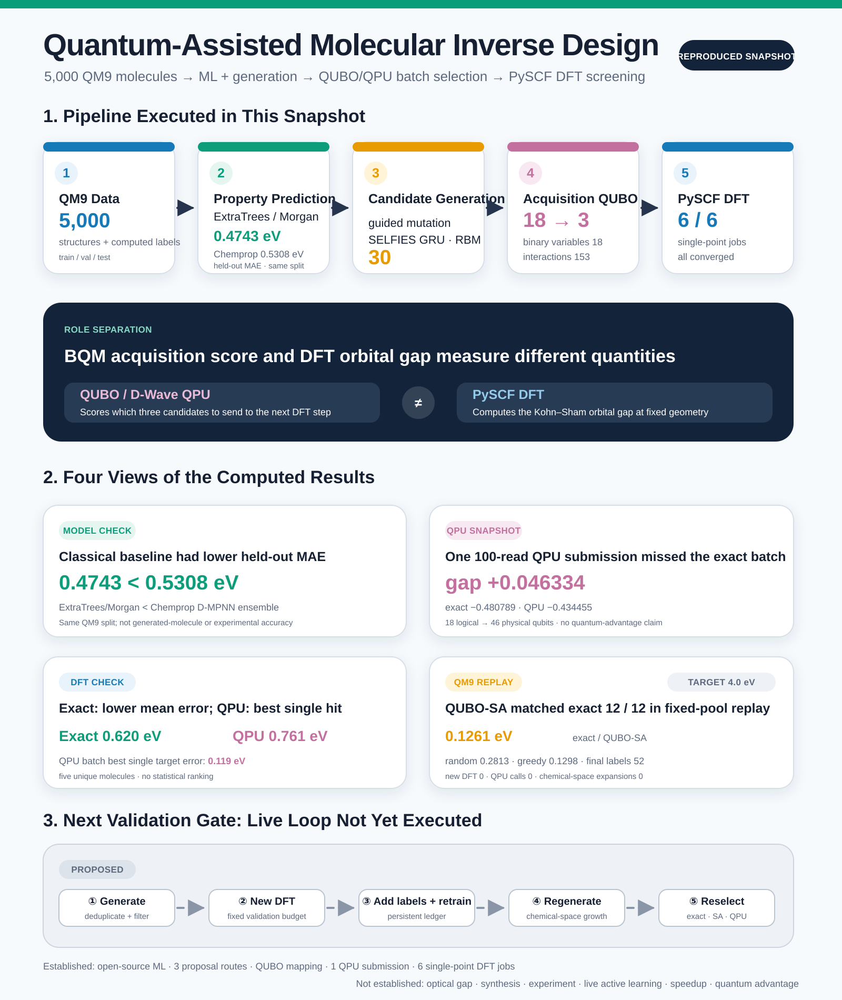
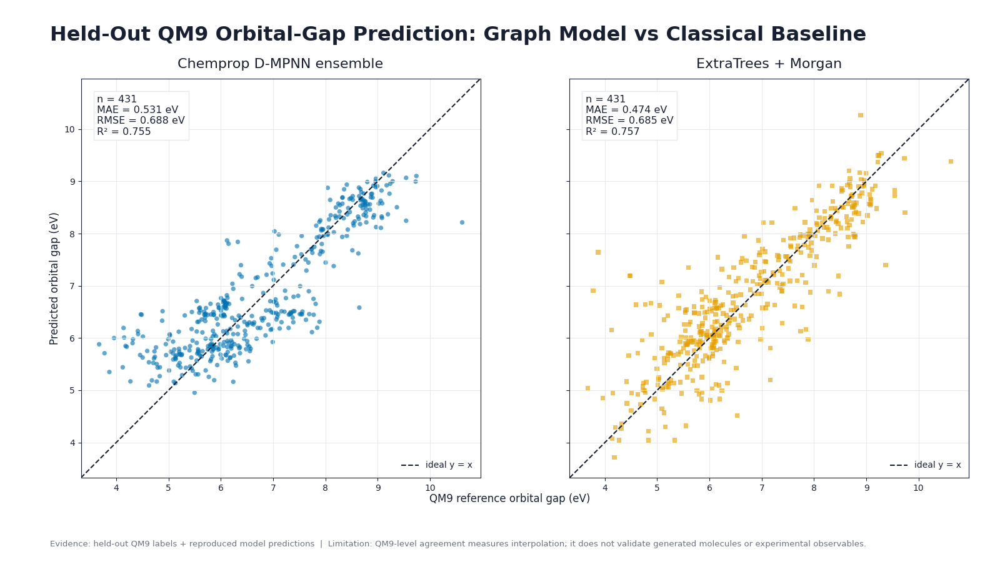
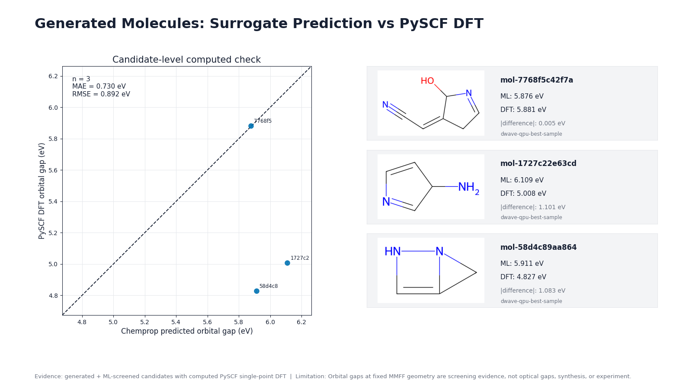

# A D-Wave Molecular Inverse-Design Experiment: Checking QPU-Selected Candidates with Single-Point DFT

Suppose we have 18 candidate molecules and must choose three for the next round of calculations. Candidates with predictions close to the target should receive priority, but the batch should not be crowded with nearly identical molecules. In this experiment, we formulated that selection task as a QUBO and sent the same problem to an independent exact search, classical simulated annealing, and a D-Wave QPU. We then recalculated the selected molecules with PySCF.

The experiment was small, but the computational stages were connected end to end. We trained prediction models on a deterministic 5,000-molecule subset derived from QM9, ran three proposal mechanisms, and produced 30 candidates that passed a shared chemistry filter. We froze a shortlist of 18, selected batches of three, and completed six single-point DFT calculations across the QPU-selected and exact-selected batches.


*Figure 1. A generated conceptual illustration that separates the roles of candidate generation and prediction, QUBO/QPU batch selection, and quantum-chemistry validation. The central device is an editorial representation, not a photograph of the D-Wave hardware used in this experiment.*

::: highlight D-Wave's role in this experiment
The D-Wave QPU performed **batch acquisition optimization to select three candidates** for the next PySCF calculations. Molecular electronic structure was calculated with PySCF. BQM energy is the acquisition-objective value; the DFT orbital gap is the result of a molecular calculation.
:::



*Figure 2. The top and middle sections show computations that were executed. The dashed path at the bottom shows the live active-learning loop proposed for the next validation stage. The values match the [public computation results table](benchmark_results.csv).*

[View the detailed infographic as a full-size PNG](molecular_inverse_design_infographic_en.png)

## What the pipeline actually computed

The pipeline consists of six layers with distinct meanings.

| Computational layer | Work executed | Scope supported by this result |
| --- | --- | --- |
| Data | 5,000 QM9-based molecules with train/validation/test splits | A reference dataset for comparing models within the same molecular family |
| Prediction | Chemprop D-MPNN ensemble, ExtraTrees/Morgan | Held-out QM9 orbital-gap prediction performance |
| Generation | Chemprop-guided SELFIES mutation, SELFIES GRU, classical SELFIES RBM | Three proposal mechanisms returned candidates that passed the filters |
| Acquisition optimization | Independent exact search, Ocean ExactSolver, classical SA, D-Wave QPU | Selection of a three-candidate batch from the same 18-variable BQM |
| Computational validation | PySCF B3LYP/6-31G(2df,p) single point | Kohn-Sham HOMO-LUMO gap at a fixed force-field geometry |
| Iteration policy | Hidden-label replay on a fixed QM9 pool | A classical proxy comparing acquisition policies as precomputed labels are revealed |

This table does not cover the stability, synthetic accessibility, optical excitation, or experimental properties of the generated molecules. A live loop that returns DFT labels for generated candidates to the training data has not yet been run.

## ExtraTrees achieved the lower prediction MAE

We divided a 5,000-molecule QM9-derived dataset into 4,058 training, 511 validation, and 431 test molecules. The target was the precomputed HOMO-LUMO orbital gap in QM9, converted to eV. The [original QM9 collection](https://doi.org/10.6084/m9.figshare.c.978904.v5) provides quantum-chemical structures and properties for roughly 130,000 molecules. This experiment used a deterministic subset that passed the chemistry rules.

On the same split, we compared a [Chemprop](https://chemprop.readthedocs.io/en/main/index.html) D-MPNN ensemble with ExtraTrees built on Morgan fingerprints.

| Model | MAE (eV) | RMSE (eV) | $R^2$ |
| --- | ---: | ---: | ---: |
| Chemprop D-MPNN ensemble | 0.5308 | 0.6882 | 0.7547 |
| ExtraTrees / Morgan | **0.4743** | 0.6854 | 0.7567 |



*Figure 3. The two models were evaluated on the same 431 test molecules. ExtraTrees achieved the lower MAE. Neither result guarantees out-of-domain accuracy on generated molecules or agreement with experiment.*

This smoke benchmark does not support a claim that the GNN outperformed the classical model. Chemprop served as an external, structure-aware scorer for generated candidates, but its held-out MAE was higher than that of the classical baseline. Across the 18-candidate shortlist used in the QUBO, the prediction spread between the two Chemprop models was also very small, approximately $9\times10^{-6}$ to 0.00275 eV, and was not calibrated. The QUBO uncertainty term below was therefore treated only as an exploratory proxy.

## The same chemistry rules were applied to all three proposal mechanisms

Candidate generation used three routes:

1. A guided path that selects SELFIES mutations by Chemprop score
2. An autoregressive SELFIES GRU decoder
3. A classical SELFIES RBM using contrastive divergence and Gibbs sampling

[SELFIES](https://github.com/the-matter-lab/selfies) is a molecular string representation designed for convenient use in generative models. It makes syntactically interpretable strings easier to obtain, but it does not by itself establish stability or synthetic accessibility.

Each route returned 30 candidates. We applied RDKit parsing and canonicalization, a CHONF element restriction, a maximum of nine heavy atoms, a neutral closed-shell requirement, and deduplication across all routes. The final union received 11 candidates from the guided path, 8 from the GRU, and 11 from the RBM, for 30 unique candidates in total. The raw proposal stream excluded 41 radicals, 15 candidates over the size limit, 3 candidates with unsupported elements, and 1 non-neutral candidate.


*Figure 4. Raw-proposal diagnostics and the number of candidates passing the shared filter for each route. The times on the right were not measured under equal training costs. The guided path includes Chemprop scoring; the GRU and RBM times cover proposal generation from saved models.*

The label `GNN-guided` refers to a route that scores SELFIES mutations with Chemprop. It is not a GNN decoder. The RBM was also executed as a classical model.

## The QUBO scores target fit and batch diversity together

For candidate $i$, let $x_i=1$ when it is selected and $x_i=0$ otherwise. Candidates close to the 6.0 eV target received priority. Novelty and model spread earned rewards, while high pairwise similarity within the batch incurred a penalty. A cardinality penalty enforced the selection of exactly three candidates.

The implementation-oriented expression is:

```text
target_loss = sum_i target_weight
                    * ((predicted_gap_i - target_gap) / gap_scale)^2
                    * x_i

uncertainty_reward = sum_i uncertainty_weight
                           * (predicted_std_i / gap_scale)
                           * x_i

novelty_reward = sum_i novelty_weight * novelty_i * x_i

similarity_penalty = sum_(i < j) similarity_weight
                                  * tanimoto_i_j
                                  * x_i * x_j

cardinality_penalty = cardinality_weight
                      * (sum_i x_i - batch_size)^2

acquisition_score = target_loss
                  - uncertainty_reward
                  - novelty_reward
                  + similarity_penalty
                  + cardinality_penalty
```

The same objective in compact notation is:

$$
\begin{aligned}
A(x) ={}& \sum_i w_t
\left(\frac{\hat g_i-g^*}{s_g}\right)^2 x_i
- \sum_i w_u\frac{\hat\sigma_i}{s_g}x_i
- \sum_i w_n n_i x_i \\
&+ \sum_{i<j}w_s T_{ij}x_ix_j
+ w_c\left(\sum_i x_i-k\right)^2.
\end{aligned}
$$

As explained in [D-Wave's introduction to QUBOs](https://docs.dwavequantum.com/en/latest/quantum_research/qubo_ising.html), a binary quadratic model expresses a minimization problem through linear terms and quadratic interactions over 0/1 variables. The frozen problem in this experiment had 18 variables and 153 pairwise interactions. The batch size was 3.

The independent combination search, Ocean ExactSolver, and classical simulated annealing with 2,000 reads all found the same three candidates at an acquisition energy of `-0.480789`. The readable objective also matched `bqm.energy(sample)`. We submitted the same BQM to the QPU after completing these checks.

## One 100-read QPU submission missed the exact optimum

We submitted the frozen BQM to the D-Wave QPU once with 100 reads. The 18 logical variables were embedded into 46 physical qubits on the Pegasus topology. [EmbeddingComposite](https://docs.dwavequantum.com/en/latest/ocean/api_ref_system/generated/dwave.system.composites.EmbeddingComposite.sample.html) maps logical variables to chains on the QPU topology and can return chain-break information.

| Optimizer | Best acquisition energy | Exact gap | Selected batch |
| --- | ---: | ---: | --- |
| independent exact | -0.480789 | 0 | `58d4, b58e, b917` |
| classical simulated annealing | -0.480789 | zero to the reported precision | same as exact |
| D-Wave QPU | -0.434455 | **+0.046334** | `1727, 58d4, 7768` |


*Figure 5. The QPU path executed successfully but returned a different batch from the exact solution. The wall times on the right include different execution paths and cannot support a speedup claim.*

The recorded occurrence-weighted mean chain-break fraction was 0.01333, and client wall time was 2.087 seconds. This single result confirms that the QPU path ran. It does not establish reproduction of the exact optimum or quantum advantage.

The archive also has unresolved quality gaps. The record lacks a separate configuration file containing the execution timestamp, Python and Ocean versions at submission, the project source hash, and explicit units for the solver timing fields. We did not backfill historical execution metadata with values from the current environment. The next QPU campaign should freeze this metadata before submission.

## The exact batch had the lower mean DFT error; the QPU batch contained the closest individual candidate

We evaluated the three QPU-selected molecules and the three independently exact-selected molecules with [PySCF DFT](https://pyscf.org/user/dft.html). One molecule appeared in both batches and was run separately in each, yielding six jobs over five unique molecules. All jobs converged.

The calculation settings were:

```text
geometry = RDKit ETKDGv3 embedding + MMFF94s optimization
calculation = single point
functional = B3LYP
basis = 6-31G(2df,p)
grid level = 3
SCF convergence tolerance = 1e-8
maximum SCF cycles = 100
```

| Selection batch | Converged | Mean target error | ML–DFT MAE | Container wall time |
| --- | ---: | ---: | ---: | ---: |
| independent exact | 3 / 3 | **0.620 eV** | 0.580 eV | 92.592 s |
| D-Wave QPU | 3 / 3 | 0.761 eV | 0.730 eV | 177.258 s |


*Figure 6. The exact batch had the lower mean target error. The QPU batch contained the single candidate closest to the target in this snapshot. Three molecules per batch are insufficient to generalize the relative performance of the optimizers.*

The QPU-selected `N#CC=C1CC=NC1O` had an ML prediction of 5.8763 eV and a PySCF value of 5.8808 eV. Its error relative to the 6.0 eV target was 0.1192 eV, the smallest in this set of calculations. The best target error in the exact batch was 0.2994 eV.



*Figure 7. ML predictions and PySCF results for the three QPU-selected candidates. The first candidate differed by about 0.005 eV, while the other two differed by approximately 1.1 eV.*

These values are Kohn-Sham HOMO-LUMO orbital gaps calculated at force-field geometries. An excited-state method such as [TDDFT](https://pyscf.org/user/tddft.html) is needed to calculate optical excitations. This experiment did not include DFT geometry optimization, stability analysis, synthesis, toxicity assessment, or experimental measurement.

## A fixed-label QM9 replay tested the iteration policy

A [review of active learning in materials science](https://doi.org/10.1038/s41524-019-0153-8) describes an iterative structure linking a surrogate, uncertainty, utility, and an expensive oracle. As a first step, this project created a replay that hid and then revealed precomputed labels from a fixed QM9 pool.

This replay was separate from the 6.0 eV molecular batch-selection task above. It compared acquisition policies at a **4.0 eV target**.

Across three paired seeds, each run began with 40 labels and performed four updates with a batch size of 3. At a budget of 52 labels, the mean best target errors were:

| Policy | Mean best target error at 52 labels |
| --- | ---: |
| random | 0.2813 eV |
| greedy ExtraTrees | 0.1298 eV |
| uncertainty-aware exact | **0.1261 eV** |
| uncertainty-aware QUBO / classical SA | **0.1261 eV** |


*Figure 8. In the fixed QM9 replay at a 4.0 eV target, QUBO simulated annealing matched the exact batch in all 12 recorded acquisitions. Shading shows the minimum-to-maximum range across three seeds.*

The replay is a proxy for checking the acquisition implementation. It performed 0 new DFT calculations, made 0 QPU calls, and performed 0 generated chemical-space expansions. The six DFT labels from the preceding section have not yet been added to the training set.

## What the evidence establishes, and what remains open

| Status | What this work established |
| --- | --- |
| `reproduced` | Two surrogate models, three proposal mechanisms, a shared chemistry filter, objective-to-BQM mapping, exact search and classical SA, one 100-read QPU submission, and six PySCF single-point DFT calculations |
| `proxy` | Three-seed replay using a fixed QM9 pool and precomputed labels |
| `not established` | Optical gap, stability and synthetic accessibility, experimental properties, a persistent live loop, scalable speedup, quantum advantage, or molecular discovery |

We retained the result in which the QPU missed the exact optimum. In downstream DFT, the exact batch performed better on average, while the QPU batch contained the best individual candidate. These observations answer different questions. The lowest acquisition score and the best hit found in a handful of downstream calculations should not be combined into one performance metric.

Before generating more molecules, the next experiment should freeze the following conditions:

1. A persistent ledger preserving candidates and calculation history
2. The same candidate pool, batch size, and DFT label budget
3. A matched comparison among greedy ML, independent exact search, classical SA, and the QPU
4. Separate time and cost records for surrogate fitting, QUBO construction, queueing, sampling, and DFT
5. Predefined go / scale / stop criteria

Assessing the practical efficiency of active learning will require several rounds in which new DFT labels are added to the data, the surrogate is retrained, and generation and selection run again. The campaign also needs a stop rule if the QPU fails to beat a strong classical champion under the same budget.

::: evidence Verdict from this snapshot
Open-source ML, three molecular proposal mechanisms, a validated acquisition QUBO, one 100-read D-Wave QPU submission, and six PySCF screening calculations were connected into a traceable computational pipeline. The stages executed and exchanged artifacts successfully. Any claim of superiority must await a live-loop bake-off.
:::

## Publication information

- Generated: 2026-08-27 KST
- Original computation checkpoint: 2026-08-27
- Writing assistance: Codex-based GPT-5 family agent harness
- Method: Local CSV and JSON computational evidence was checked first. Official documentation and primary papers were then used to verify terminology and methodological boundaries, followed by audits of prose, figures, and HTML rendering.

## References

1. [QM9 original collection, Figshare](https://doi.org/10.6084/m9.figshare.c.978904.v5)
2. [PyTorch Geometric QM9 documentation](https://pytorch-geometric.readthedocs.io/en/latest/generated/torch_geometric.datasets.QM9.html)
3. [Chemprop documentation](https://chemprop.readthedocs.io/en/main/index.html)
4. [SELFIES reference implementation](https://github.com/the-matter-lab/selfies)
5. [D-Wave, QUBOs and Ising Models](https://docs.dwavequantum.com/en/latest/quantum_research/qubo_ising.html)
6. [D-Wave, EmbeddingComposite.sample](https://docs.dwavequantum.com/en/latest/ocean/api_ref_system/generated/dwave.system.composites.EmbeddingComposite.sample.html)
7. [D-Wave, General QPU Solver Properties](https://docs.dwavequantum.com/en/latest/quantum_research/solver_properties_all.html)
8. [PySCF, Density Functional Theory](https://pyscf.org/user/dft.html)
9. [PySCF, Time-dependent Hartree-Fock and DFT](https://pyscf.org/user/tddft.html)
10. [Lookman et al., Active learning in materials science, npj Computational Materials 5, 21 (2019)](https://doi.org/10.1038/s41524-019-0153-8)

<small>The computational values come from the CSV and JSON evidence and figure manifest generated by the project. The raw QM9 mirror is not included in this public package. Production and review records for the generated hero image and computation-based figures are archived in `artifacts/final_review/figure_manifest.md`.</small>
