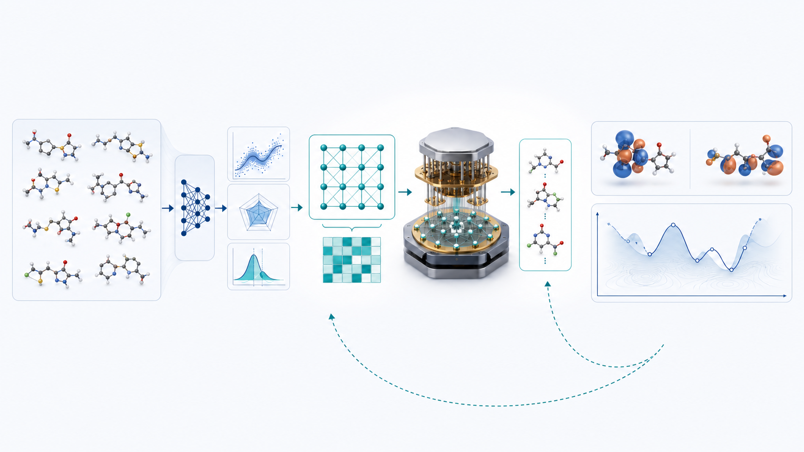
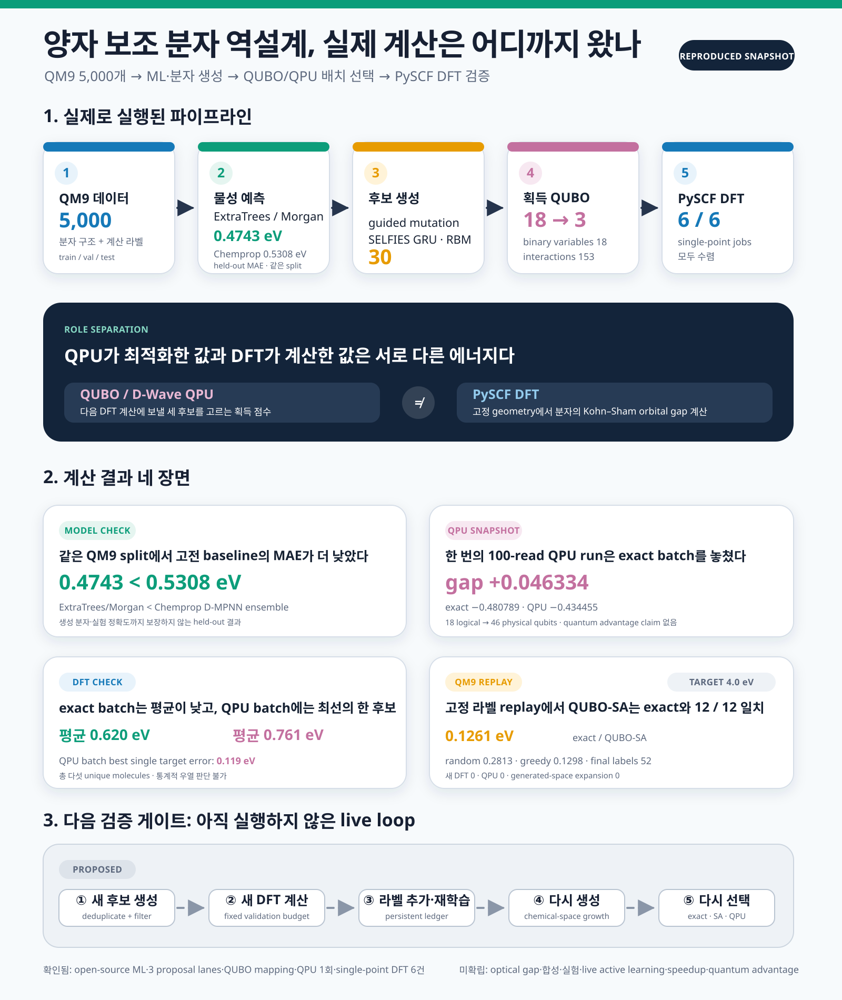
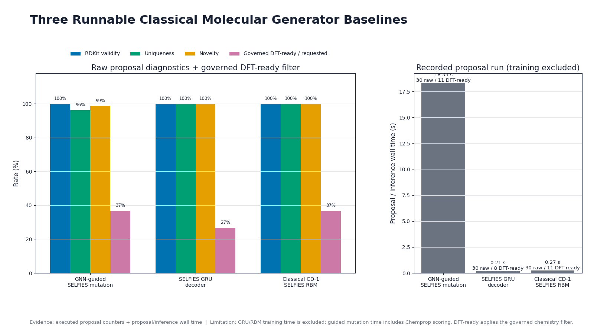
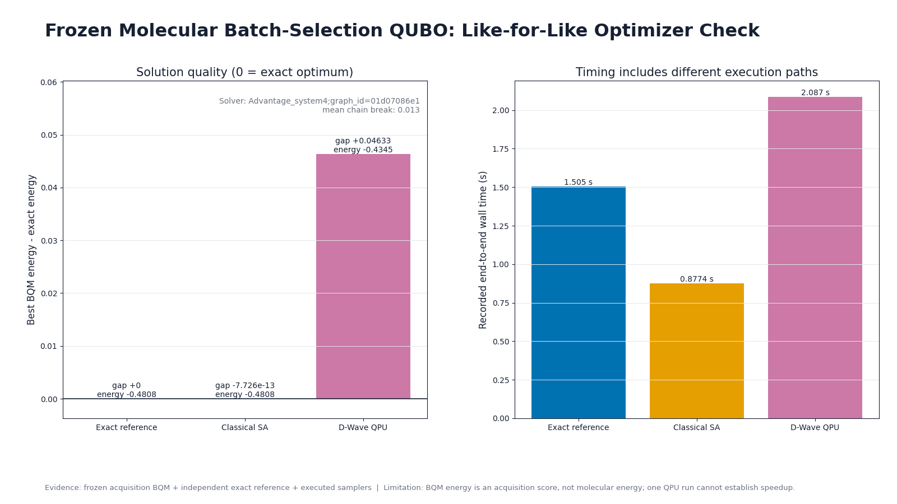
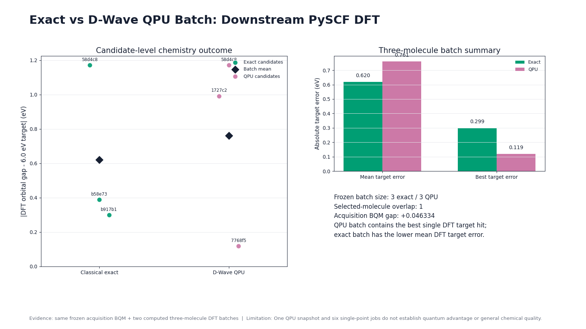
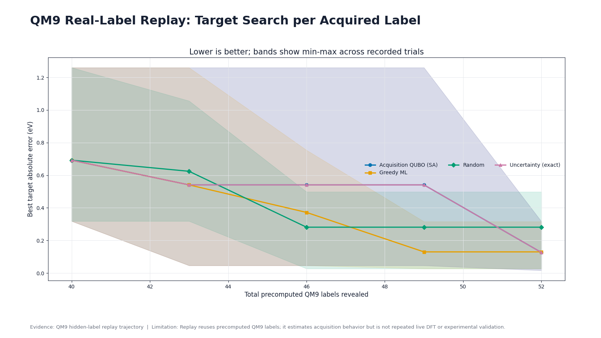

# D-Wave 분자 역설계 실험: QPU가 고른 후보를 DFT까지 확인해 보니

후보 분자 18개 가운데 다음 계산에 보낼 세 개를 골라야 한다고 해보겠습니다. 예측값이 목표에 가까운 후보를 우선하되, 서로 지나치게 닮은 분자만 한꺼번에 뽑히지 않도록 배치 전체를 판단해야 합니다. 이번 실험에서는 이 선택 문제를 QUBO로 만들고, 독립적인 exact search와 classical simulated annealing, D-Wave QPU에 같은 문제를 넣었습니다. 선택된 분자는 PySCF로 다시 계산했습니다.

실험 범위는 작지만 계산 단계는 실제로 이어졌습니다. QM9에서 추린 5,000개 분자로 예측 모델을 학습했고, 세 가지 생성 경로를 실행했으며, 공통 화학 필터를 통과한 30개 후보를 만들었습니다. 여기서 18개를 고정한 뒤 세 분자 배치를 선택했고, QPU 배치와 exact 배치에 대해 모두 여섯 건의 single-point DFT 계산을 완료했습니다.



*그림 1. 후보 생성·예측, QUBO/QPU 배치 선택, 양자화학 검증의 역할을 분리해 보여주는 생성 개념 일러스트입니다. 중앙 장치는 편집용 표현이며 실제 사용한 D-Wave 장비의 사진이 아닙니다.*

::: highlight 이 실험에서 D-Wave가 맡은 일
D-Wave QPU는 분자의 전자구조를 계산하지 않았습니다. 다음 PySCF 계산에 보낼 **세 후보의 배치를 고르는 획득 최적화**를 수행했습니다. QUBO energy는 선택 점수이고, DFT orbital gap은 분자 계산 결과입니다.
:::



*그림 2. 위쪽과 가운데는 실행된 계산을, 아래 점선은 다음 검증 단계로 제안한 live active-learning loop를 나타냅니다. 수치는 [공개 계산 결과표](../artifacts/final_review/data/benchmark_results.csv)와 동일합니다.*

[상세 인포그래픽을 전체 크기 PNG로 보기](../artifacts/final_review/figures/molecular_inverse_design_infographic.png)

## 계산한 범위부터 확인해 보자

이번 파이프라인은 서로 다른 의미를 가진 여섯 층으로 구성됩니다.

| 계산 층 | 실행한 작업 | 이번 결과가 말해주는 범위 |
| --- | --- | --- |
| 데이터 | QM9 기반 5,000개 분자, train/validation/test 분리 | 같은 분자군 안에서 모델을 비교할 수 있는 기준 데이터 |
| 예측 | Chemprop D-MPNN ensemble, ExtraTrees/Morgan | held-out QM9 orbital-gap 예측 성능 |
| 생성 | Chemprop-guided SELFIES mutation, SELFIES GRU, classical SELFIES RBM | 세 proposal mechanism이 실제로 후보를 반환하고 필터를 통과함 |
| 획득 최적화 | 독립 exact, Ocean ExactSolver, classical SA, D-Wave QPU | 같은 18-variable BQM에서 세 후보 배치를 선택함 |
| 계산 검증 | PySCF B3LYP/6-31G(2df,p) single point | 고정 force-field geometry의 Kohn–Sham HOMO–LUMO gap |
| 반복 정책 | 고정 QM9 pool의 hidden-label replay | precomputed label을 공개하며 획득 정책을 비교한 고전 proxy |

생성 분자의 안정성, 합성 가능성, optical excitation, 실험 물성은 이 표에 들어 있지 않습니다. 생성 후보 DFT 라벨을 다시 학습 데이터에 넣는 live loop도 아직 실행하지 않았습니다.

## 예측 모델에서는 ExtraTrees의 MAE가 더 낮았다

QM9 derived dataset 5,000개를 train 4,058개, validation 511개, test 431개로 나눴습니다. 목표값은 QM9에 들어 있는 precomputed HOMO–LUMO orbital gap을 eV로 변환한 값입니다. [QM9 원본 collection](https://doi.org/10.6084/m9.figshare.c.978904.v5)은 약 13만 개 분자의 양자화학 구조와 물성을 제공하며, 이번 실험은 그중 화학 규칙을 통과한 결정론적 subset을 사용했습니다.

같은 split에서 [Chemprop](https://chemprop.readthedocs.io/en/main/index.html) D-MPNN ensemble과 Morgan fingerprint 기반 ExtraTrees를 비교했습니다.

| Model | MAE (eV) | RMSE (eV) | $R^2$ |
| --- | ---: | ---: | ---: |
| Chemprop D-MPNN ensemble | 0.5308 | 0.6882 | 0.7547 |
| ExtraTrees / Morgan | **0.4743** | 0.6854 | 0.7567 |


*그림 3. 동일한 431개 test molecule에서 두 모델을 비교했습니다. ExtraTrees의 MAE가 낮았으며, 두 결과 모두 생성 분자에 대한 out-of-domain 정확도나 실험 정확도를 보장하지 않습니다.*

이번 smoke benchmark는 GNN 우위 주장을 지지하지 않습니다. Chemprop은 구조를 반영하는 외부 scorer로 생성 후보를 평가하는 데 사용했지만, held-out MAE에서는 고전 baseline보다 높았습니다. QUBO에 들어간 18개 shortlist에서 두 Chemprop model의 prediction spread도 약 $9\times10^{-6}$–0.00275 eV로 매우 작고 calibration을 하지 않았습니다. 따라서 아래 QUBO의 uncertainty term은 탐색용 proxy로만 다뤘습니다.

## 세 생성 경로에 같은 화학 규칙을 적용했다

후보 생성은 세 경로로 나눴습니다.

1. Chemprop 점수로 SELFIES mutation을 고르는 guided path
2. autoregressive SELFIES GRU decoder
3. contrastive divergence와 Gibbs sampling을 사용하는 classical SELFIES RBM

[SELFIES](https://github.com/the-matter-lab/selfies)는 분자 문자열을 생성 모델에 넣기 편하도록 설계된 표현입니다. 문법적으로 해석 가능한 문자열을 얻기 쉽다는 장점이 있지만, 그 자체로 안정성과 합성 가능성을 판정하지는 않습니다.

각 경로는 30개씩 반환했습니다. RDKit parsing과 canonicalization, CHONF 원소 제한, 최대 9개 heavy atom, neutral closed shell, 중복 제거를 공통으로 적용한 뒤 최종 union에 기여한 수는 11개, 8개, 11개였습니다. 전체 unique candidate는 30개였습니다. raw proposal stream에서는 radical 41개, 크기 제한 초과 15개, 지원하지 않는 원소 3개, non-neutral 1개가 제외됐습니다.



*그림 4. 세 경로의 raw proposal 진단과 공통 필터 통과량입니다. 오른쪽 시간은 동일한 학습비용 비교가 아닙니다. guided path는 Chemprop scoring을 포함하고, GRU와 RBM은 저장된 모델 이후 proposal 시간을 기록했습니다.*

여기서 `GNN-guided`라는 이름은 GNN decoder를 뜻하지 않습니다. Chemprop으로 SELFIES mutation을 점수화한 경로입니다. RBM도 classical model로 실행했습니다.

## QUBO는 목표 적합성과 배치 다양성을 함께 계산한다

후보 $i$를 선택하면 $x_i=1$, 선택하지 않으면 $x_i=0$으로 둡니다. 목표 6.0 eV에 가까운 후보를 우선하고, novelty와 model spread에 보상을 주며, 서로 닮은 후보가 한 배치에 몰리면 penalty를 더했습니다. 정확히 세 개를 고르도록 cardinality penalty도 넣었습니다.

읽기 쉬운 구현형 식은 다음과 같습니다.

```text
target_loss = sum_i target_weight
                    * ((predicted_gap_i - target_gap) / gap_scale)^2
                    * x_i

uncertainty_reward = sum_i uncertainty_weight
                           * (predicted_std_i / gap_scale)
                           * x_i

novelty_reward = sum_i novelty_weight * novelty_i * x_i

similarity_penalty = sum_(i < j) similarity_weight
                                  * tanimoto_i_j
                                  * x_i * x_j

cardinality_penalty = cardinality_weight
                      * (sum_i x_i - batch_size)^2

acquisition_score = target_loss
                  - uncertainty_reward
                  - novelty_reward
                  + similarity_penalty
                  + cardinality_penalty
```

Preview용 수식은 다음과 같습니다.

$$
\begin{aligned}
A(x) ={}& \sum_i w_t
\left(\frac{\hat g_i-g^*}{s_g}\right)^2 x_i
- \sum_i w_u\frac{\hat\sigma_i}{s_g}x_i
- \sum_i w_n n_i x_i \\
&+ \sum_{i<j}w_s T_{ij}x_ix_j
+ w_c\left(\sum_i x_i-k\right)^2.
\end{aligned}
$$

[D-Wave의 QUBO 설명](https://docs.dwavequantum.com/en/latest/quantum_research/qubo_ising.html)에 따르면 binary quadratic model은 0/1 변수의 linear term과 quadratic interaction을 최소화하는 형태로 표현됩니다. 이번 frozen problem에는 variable 18개와 pair interaction 153개가 있었습니다. batch size는 3입니다.

독립 combination search, Ocean ExactSolver, 2,000-read classical simulated annealing은 모두 같은 세 후보와 acquisition energy `-0.480789`를 찾았습니다. readable objective와 `bqm.energy(sample)`도 일치했습니다. 이 검증이 끝난 뒤 같은 BQM을 QPU에 제출했습니다.

## 한 번의 QPU 실행은 exact optimum을 재현하지 못했다

D-Wave QPU에는 frozen BQM을 100 reads로 한 번 제출했습니다. 18개 logical variable은 Pegasus topology의 46개 physical qubit으로 embedding됐습니다. [EmbeddingComposite](https://docs.dwavequantum.com/en/latest/ocean/api_ref_system/generated/dwave.system.composites.EmbeddingComposite.sample.html)는 logical variable을 QPU topology에 맞게 chain으로 embedding하고 chain-break 정보를 반환할 수 있습니다.

| Optimizer | Best acquisition energy | Exact gap | Selected batch |
| --- | ---: | ---: | --- |
| independent exact | -0.480789 | 0 | `58d4, b58e, b917` |
| classical simulated annealing | -0.480789 | 약 0 | exact와 동일 |
| D-Wave QPU | -0.434455 | **+0.046334** | `1727, 58d4, 7768` |



*그림 5. QPU path는 실행됐지만 exact batch와 일치하지 않았습니다. 오른쪽 wall time은 서로 다른 실행 경로를 포함하므로 speedup 자료로 사용할 수 없습니다.*

기록된 occurrence-weighted mean chain-break fraction은 0.01333, client wall time은 2.087초였습니다. 이 한 번의 결과는 QPU path가 작동했다는 점을 확인합니다. exact optimum 재현과 quantum advantage는 확인되지 않았습니다.

아카이브 품질에도 남은 일이 있습니다. 당시 기록에는 실행 timestamp, 제출 시점의 Python/Ocean version, project source hash, solver timing field의 단위가 명시된 별도 configuration record가 없습니다. 현재 환경의 값을 과거 실행에 덧씌우지 않았습니다. 다음 QPU campaign에서는 제출 전에 이 metadata를 고정할 필요가 있습니다.

## PySCF 계산에서 exact batch는 평균이 낮았고, QPU batch에는 가장 가까운 한 후보가 있었다

QPU가 고른 세 분자와 independent exact가 고른 세 분자를 [PySCF DFT](https://pyscf.org/user/dft.html)로 계산했습니다. 두 배치에 공통으로 들어간 한 분자는 각각 실행했으므로 총 여섯 job, 다섯 unique molecule입니다. 모든 job이 수렴했습니다.

계산 조건은 다음과 같습니다.

```text
geometry = RDKit ETKDGv3 embedding + MMFF94s optimization
calculation = single point
functional = B3LYP
basis = 6-31G(2df,p)
grid level = 3
SCF convergence tolerance = 1e-8
maximum SCF cycles = 100
```

| Selection batch | Converged | Mean target error | ML–DFT MAE | Container wall time |
| --- | ---: | ---: | ---: | ---: |
| independent exact | 3 / 3 | **0.620 eV** | 0.580 eV | 92.592 s |
| D-Wave QPU | 3 / 3 | 0.761 eV | 0.730 eV | 177.258 s |



*그림 6. exact batch의 평균 target error가 낮았습니다. QPU batch에는 이번 스냅샷에서 가장 목표에 가까운 단일 후보가 포함됐습니다. 배치당 세 분자의 결과로 optimizer 우열을 일반화할 수는 없습니다.*

QPU batch의 `N#CC=C1CC=NC1O`는 ML 5.8763 eV, PySCF 5.8808 eV를 기록했습니다. 6.0 eV target과의 차이는 0.1192 eV로, 이번 계산에서 가장 가까운 값입니다. exact batch의 best target error는 0.2994 eV였습니다.


*그림 7. QPU가 선택한 세 후보의 ML 예측과 PySCF 결과입니다. 첫 후보는 0.005 eV 차이로 일치했지만 나머지 두 후보에서는 약 1.1 eV 차이가 나타났습니다.*

이 값은 force-field geometry에서 계산한 Kohn–Sham HOMO–LUMO orbital gap입니다. optical excitation을 계산하려면 [TDDFT와 같은 excited-state method](https://pyscf.org/user/tddft.html)가 필요합니다. 이번 결과에는 DFT geometry optimization, stability 분석, 합성, 독성, 실험 측정이 포함되지 않았습니다.

## 반복 정책은 고정 QM9 라벨 replay로 점검했다

[재료 active learning review](https://doi.org/10.1038/s41524-019-0153-8)는 surrogate와 uncertainty, utility, 고비용 oracle을 반복적으로 연결하는 구조를 설명합니다. 이번 프로젝트에서는 먼저 고정된 QM9 pool에서 precomputed label을 숨겼다가 공개하는 replay를 만들었습니다.

이 replay는 앞 절의 6.0 eV 분자 배치 선택과 별개로, **4.0 eV target**에서 획득 정책을 비교한 benchmark입니다.

세 paired seed에서 40개 label로 시작해 batch size 3으로 네 번 갱신했습니다. 52개 label budget에서 best target error 평균은 다음과 같습니다.

| Policy | Mean best target error at 52 labels |
| --- | ---: |
| random | 0.2813 eV |
| greedy ExtraTrees | 0.1298 eV |
| uncertainty-aware exact | **0.1261 eV** |
| uncertainty-aware QUBO / classical SA | **0.1261 eV** |



*그림 8. 4.0 eV target의 고정 QM9 replay에서 QUBO simulated annealing은 기록된 12번의 acquisition 모두 exact batch와 일치했습니다. 음영은 세 seed의 min–max 범위입니다.*

Replay는 획득 구현을 점검하는 proxy입니다. 이 과정에서 실행한 새 DFT는 0건, QPU call은 0회, generated chemical-space expansion은 0회였습니다. 앞 절의 여섯 DFT label도 아직 training set에 추가하지 않았습니다.

## 확인된 증거와 남은 판단

| 상태 | 이번 작업에서 확인한 내용 |
| --- | --- |
| `reproduced` | 두 surrogate, 세 proposal mechanism, 공통 화학 filter, objective–BQM mapping, exact와 classical SA, QPU 1회, PySCF single-point DFT 6건 |
| `proxy` | 고정 QM9 pool과 precomputed labels를 사용한 3-seed replay |
| `not established` | optical gap, 안정성·합성 가능성, 실험 물성, persistent live loop, scalable speedup, quantum advantage, molecular discovery |

QPU가 exact optimum을 놓친 결과도 그대로 남겼습니다. downstream DFT에서는 exact batch가 평균적으로 나았고, QPU batch가 가장 좋은 한 후보를 포함했습니다. 두 관찰은 서로 다른 질문을 답합니다. acquisition score의 최저점과 소수 downstream calculation에서 우연히 얻은 best hit를 같은 성능 지표로 묶으면 안 됩니다.

다음 실험은 새 분자를 계속 생성하는 것부터 시작하지 않습니다. 먼저 아래 조건을 고정해야 합니다.

1. 후보와 계산 이력을 보존하는 persistent ledger
2. 동일한 candidate pool, batch size, DFT label budget
3. greedy ML, independent exact, classical SA, QPU의 matched comparison
4. surrogate fit, QUBO build, queue, sampling, DFT를 분리한 시간·비용 기록
5. 사전에 정한 go / scale / stop 기준

새 DFT 라벨을 데이터에 추가하고 surrogate를 재학습한 뒤 다시 생성·선택하는 과정을 여러 round 반복해야 active learning의 실제 효율을 논의할 수 있습니다. 같은 예산에서 강한 classical champion을 넘지 못하면 QPU campaign을 멈추는 기준도 필요합니다.

::: evidence 이번 스냅샷이 남긴 판정
오픈소스 ML, 세 분자 생성 경로, 검증된 acquisition QUBO, 한 번의 D-Wave QPU 제출, 여섯 건의 PySCF screening을 추적 가능한 계산 파이프라인으로 연결했습니다. 파이프라인은 작동했습니다. 우위 주장은 live-loop bake-off 이후의 판단으로 남습니다.
:::

## 작성 정보

- 생성 시각: 2026-08-27 KST
- 원본 계산 checkpoint: 2026-08-27
- 작성 보조: Codex 기반 GPT-5 계열 에이전트 하네스
- 작성 방식: 로컬 CSV·JSON 계산 증거를 먼저 대조하고, 공식 문서와 원 논문으로 용어·방법 경계를 확인한 뒤 한국어 문체·그림·HTML 렌더링 감사를 수행했습니다.

## References

1. [QM9 original collection, Figshare](https://doi.org/10.6084/m9.figshare.c.978904.v5)
2. [PyTorch Geometric QM9 documentation](https://pytorch-geometric.readthedocs.io/en/latest/generated/torch_geometric.datasets.QM9.html)
3. [Chemprop documentation](https://chemprop.readthedocs.io/en/main/index.html)
4. [SELFIES reference implementation](https://github.com/the-matter-lab/selfies)
5. [D-Wave, QUBOs and Ising Models](https://docs.dwavequantum.com/en/latest/quantum_research/qubo_ising.html)
6. [D-Wave, EmbeddingComposite.sample](https://docs.dwavequantum.com/en/latest/ocean/api_ref_system/generated/dwave.system.composites.EmbeddingComposite.sample.html)
7. [D-Wave, General QPU Solver Properties](https://docs.dwavequantum.com/en/latest/quantum_research/solver_properties_all.html)
8. [PySCF, Density Functional Theory](https://pyscf.org/user/dft.html)
9. [PySCF, Time-dependent Hartree-Fock and DFT](https://pyscf.org/user/tddft.html)
10. [Lookman et al., Active learning in materials science, npj Computational Materials 5, 21 (2019)](https://doi.org/10.1038/s41524-019-0153-8)

<small>계산 수치의 출처는 프로젝트가 생성한 CSV·JSON evidence와 figure manifest입니다. raw QM9 mirror는 이 공개 패키지에 포함하지 않았습니다. 생성형 hero와 계산 기반 figure의 제작·검토 기록은 `artifacts/final_review/figure_manifest.md`에 남겼습니다.</small>
