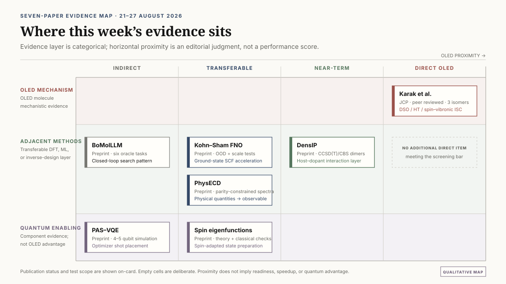

# ΔEST만으로는 부족하다: OLED 분자 역설계를 위한 기작 중심 라벨과 확장형 계산 워크플로

OLED 분자 역설계에서는 흔히 S1과 T1의 에너지 차이인 ΔEST를 핵심 선별 지표로 사용한다. 작은 ΔEST는 열활성화 지연형광(TADF)의 역항간전이(reverse intersystem crossing, RISC)에 유리한 조건이 될 수 있지만, 전이 속도를 단독으로 결정하지 않는다. singlet와 triplet의 상태 성격, spin-orbit coupling(SOC), 고차 triplet 상태, 분자 진동이 전자상태를 섞는 방식까지 달라지면 비슷한 ΔEST를 가진 분자도 서로 다른 광물리 경로를 밟을 수 있다.

2026년 8월 21일부터 27일까지 공개된 연구 가운데 이 문제를 가장 직접적으로 드러낸 논문은 carbazole-benzoate 위치 이성질체의 intersystem crossing(ISC)을 분석한 Karak 등의 연구다. 세 이성질체는 비슷한 크기의 ISC 속도를 가질 수 있지만, ortho와 para에서는 direct SOC와 Herzberg-Teller 기여가, meta에서는 Herzberg-Teller와 spin-vibronic 경로가 중심이 됐다. 총속도 하나만 학습하면 이 차이가 사라진다. 역설계 모델이 구조 변화의 이유를 배우려면 ΔEST, 정적 SOC, CT/LE 상태 성격, higher-triplet mediation과 promoting mode를 분리된 라벨로 다뤄야 한다.

이번 주에는 새로운 OLED 생성 모델보다 계산 파이프라인의 중간층을 강화할 방법이 더 많이 제시됐다. DensIP는 ML 전자밀도와 물리적 상호작용 항을 결합해 host-host와 host-dopant 비공유 상호작용을 다룰 가능성을 보여줬다. Kohn-Sham neural operator는 SCF 반복 안의 potential-to-density map을 학습해 큰 시스템으로의 확장성을 시험했다. BoMolLLM과 PhysECD는 각각 closed-loop 분자 생성과 물리량 기반 스펙트럼 조립이라는 설계 패턴을 제시했다. 반면 이번 주의 두 양자 연구는 작은 Hamiltonian에서의 VQE 최적화와 spin eigenfunction 상태 준비를 다룬 구성요소 연구다. OLED 분자에 대한 양자 우위나 실용적 VQE 성능을 보여준 결과는 아니다.

*그림 1. 검증 근거에 따라 구성한 OLED 역설계 흐름. 실선은 이번 문헌에서 실제로 다룬 방법층이고, OLED workflow로 이어지는 적용안은 후속 검증이 필요한 리뷰 제안이다.*

::: highlight 이번 리뷰의 판정
가까운 시기에 가장 먼저 할 일은 새로운 생성기를 추가하는 것보다 기작 중심 라벨 감사를 수행하는 것이다. 그다음 host-dopant 상호작용과 SCF 가속을 고정된 고전 기준선 위에서 검증할 수 있다. 이번 주의 양자 연구는 optimizer shot 배치와 spin-state preparation 구성요소를 다뤘으며 OLED 규모 VQE, 양자 가속 또는 양자 우위를 입증하지 않았다.
:::

레이아웃 검증을 마친 8페이지 원문 브리프는 [PDF로 내려받을 수 있다](oled_inverse_design_weekly_brief_2026-08-28.pdf).

## 이번 주 연구를 읽는 기준

이번 리뷰는 2026년 8월 21일부터 27일까지의 공개 자료를 대상으로 하며, 직전 주간 브리프에 포함된 논문은 제외했다. 총 7편을 선정했다. 이 가운데 OLED 광물리를 직접 다룬 논문은 동료평가를 거쳐 *Journal of Chemical Physics*에 게재된 Karak 등의 연구 한 편이다. 나머지 6편은 arXiv v1 프리프린트이며, OLED 데이터셋이나 소자 검증을 수행한 연구가 아니다.

*그림 2. 가로축은 편집적 판단에 따른 OLED 근접성이지 성능 점수가 아니다. Karak 등의 논문만 직접 OLED 광물리와 동료평가 근거를 함께 갖는다.*

각 절에서는 다음 세 범주를 구분한다.

- **[원 논문 결과]** 저자들이 계산하거나 보고한 방법, 수치와 결론
- **[한계]** 논문의 검증 범위, 빠진 비교군과 적용 조건
- **[리뷰 제안]** 원 논문을 OLED DFT·ML 역설계에 연결한 본 리뷰의 해석과 후속 실험안

프리프린트의 수치와 주장은 후속 동료평가 과정에서 달라질 수 있다. 다른 화학계나 OLED workflow로의 전이는 별도 검증이 필요하다.

## 1. 위치 이성질체는 비슷한 ISC 속도를 서로 다른 방법으로 만든다

### [동료평가] Karak et al., Journal of Chemical Physics 165, 084303

Karak, Basu, Ghosh, Chakrabarti는 [*Role of spin-orbit and nuclear motion assisted spin-orbit coupling on the structural isomerism dependent intersystem crossing mechanism*](https://doi.org/10.1063/5.0343043)에서 methyl 2-, 3-, 4-(9H-carbazol-9-yl)benzoate, 즉 o-, m-, p-MCBA를 비교했다. 논문은 2026년 8월 24일 *Journal of Chemical Physics* 165, 084303으로 출판됐다.

### [원 논문 결과] DSO, HT, SV를 분해해서 본 ISC

저자들은 여기상태를 charge-transfer(CT), locally excited(LE), CT+LE 혼합 상태로 분류하고, 시간 의존 상관함수 방법으로 ISC 속도를 계산했다. 계산된 속도는 direct spin-orbit(DSO), Herzberg-Teller(HT), spin-vibronic(SV) 기여로 나뉜다.

가장 낮은 singlet에서 시작하는 경로에 대해 논문이 보고한 DSO/HT 속도는 다음과 같다.

| 이성질체 | DSO rate (s⁻¹) | HT rate (s⁻¹) | 추가 SV 경로 |
|---|---:|---:|---:|
| ortho-MCBA | 0.87×10⁶ | 4.16×10⁶ | 지배적 경로로 보고되지 않음 |
| para-MCBA | 1.18×10⁶ | 2.24×10⁶ | 지배적 경로로 보고되지 않음 |
| meta-MCBA | 5.67×10³ | 4.02×10⁶ | kISC = 5.45×10⁶ s⁻¹ |

ortho와 para에서는 DSO+HT가 주된 경로였지만, meta에서는 직접 SOC 기여가 작고 HT+SV가 중심이 됐다. 논문의 해석에 따르면 ortho와 para에서 S1-higher-T 및 higher-T-T1 에너지 간격이 더 커지면서 higher-triplet을 경유하는 SV 경로가 억제된다.

이 결과는 “SOC를 포함해야 한다”는 일반론보다 구체적이다. 같은 분자 골격에서 치환 위치만 달라져도 직접 SOC, 핵운동에 의한 SOC 변화, higher-triplet mediation의 상대적 역할이 바뀐다. 비슷한 크기의 총 ISC 속도가 같은 전자구조 기작을 뜻하지 않는다.

### DSO, HT와 SV는 어떤 정보를 담는가

DSO는 특정 핵배치에서 계산한 전자상태 사이의 정적 SOC에 해당한다. HT 항은 핵좌표가 변할 때 SOC가 어떻게 변하는지를 포함한다. 정적 평형구조에서 작았던 결합도 특정 진동 모드를 따라 커질 수 있다. SV 경로에서는 vibronic coupling과 SOC가 higher triplet 또는 다른 전자상태를 매개로 결합된다. 따라서 S1-T1 에너지 차이만으로는 이 경로의 유무를 알 수 없다.

TADF 역설계에서 ΔEST는 여전히 유용하다. 다만 이는 에너지 조건을 나타내는 한 좌표이지, 전이 행렬원소와 진동 매개의 정보를 모두 대체하는 충분통계량은 아니다. 위치 또는 비틀림 이성질체처럼 에너지는 비슷하지만 state character가 달라지는 화학계에서는 이 한계가 더 크게 나타날 수 있다.

### [한계] ISC 연구를 RISC와 소자 성능으로 바로 옮길 수는 없다

이 논문은 세 개 MCBA 이성질체의 ISC를 분석한다. 완전한 TADF RISC cycle, 발광 양자수율, 비복사 소멸, 고체 host 환경과 소자 수명을 함께 계산한 연구가 아니다. 보고된 kISC 값을 kRISC로 바꾸어 읽거나, 세 분자의 경향을 rigid MR-TADF 또는 heavy-atom PhOLED 계열에 그대로 일반화해서는 안 된다.

속도의 정량 정확도도 전자구조 방법, vibronic treatment와 line-broadening 근사에 의존한다. 이 연구가 강하게 뒷받침하는 범위는 세 위치 이성질체 안에서 DSO, HT와 SV 기여가 서로 다르다는 점이다. 다른 OLED 화학계로의 전이는 검증할 연구가설이다.

## 2. ΔEST 중심 데이터셋을 기작 중심 라벨로 확장하는 방법

### [리뷰 제안] 총속도보다 원인 변수를 먼저 기록한다

많은 역설계 workflow는 S1, T1, ΔEST, oscillator strength와 계산된 kRISC를 하나의 property table에 넣는다. 이 구조는 대규모 screening에 실용적이지만, kRISC가 동일한 계산식에서 만들어진 파생값이라면 모델은 그 식을 재현할 뿐 실제 화학적 기작을 구분하지 못할 수 있다.

기작 중심 데이터셋은 라벨을 네 층으로 나눌 수 있다.

| 라벨 층 | 기록할 항목 | 설계 질문 |
|---|---|---|
| 에너지 | S1, T1, T2 및 필요 시 T3, ΔEST, S1-Tn gap | 전이가 열역학적으로 접근 가능한가 |
| 상태 성격 | NTO 기반 CT/LE descriptor, CT+LE mixing, orbital localization, oscillator strength | 어느 상태가 어떤 전자구조 성격을 갖는가 |
| 결합 | S1-Tn SOC, 선택된 normal-mode SOC derivative 또는 spin-vibronic proxy | 전자상태가 실제로 어떻게 연결되는가 |
| 복합 결과 | 계산·측정 kISC, kRISC, 방사·비방사 속도 | 개별 원인이 합쳐져 어떤 관측량을 만드는가 |

마지막 층의 총속도는 최종 평가에 필요하지만, 유일한 학습 라벨로 두지 않는 편이 좋다. 에너지, 상태 성격과 결합 정보를 multi-task target으로 학습하면 모델이 잘못 예측한 이유도 추적할 수 있다. 예를 들어 ΔEST는 정확하지만 T2의 LE 성격이나 S1-T2 SOC를 놓친 후보를 별도 failure class로 분류할 수 있다.

## 3. 이번 주 실행안: 12-24개 분자의 기작 라벨 감사

대규모 데이터셋 전체에 vibronic 계산을 추가하기 전에 작은 감사(audit) 세트로 정보 이득을 확인할 수 있다. 목적은 복잡한 descriptor를 많이 만드는 것이 아니라, ΔEST만 사용했을 때 발생하는 이성질체 오순위가 state character와 coupling label을 넣었을 때 실제로 줄어드는지 검증하는 것이다.

### 3.1 분자 선정

전체 규모는 12-24개로 제한한다. positional 또는 torsional isomer를 포함하는 3-4개 scaffold family를 고르고, 각 family에는 알려진 fast-RISC 후보와 weak 또는 negative control을 최소 한 개씩 넣는다. 한 family 안에서 구조 변화가 충분히 작아야 에너지 차이와 기작 차이를 분리해 볼 수 있지만, 모든 family를 donor-acceptor형 하나로만 채우면 scaffold-held-out 검증의 의미가 약해진다.

선정 시 다음 provenance를 함께 기록한다.

- 분자 구조와 이성질체 관계
- 실험 kRISC의 측정 조건 또는 고수준 계산 rate의 방법
- 용매, host, 온도와 상태 배정
- geometry optimization method와 conformer 선택
- fast, weak, negative control을 정한 근거

실험값과 계산값을 같은 종류의 정답처럼 섞지 않는다. 측정 조건이 다른 문헌값도 그대로 한 순위표에 놓지 말고 조건별로 구분한다.

### 3.2 공통 계산

기존 최적화 구조에서 S1, T1, T2 에너지, NTO 기반 CT/LE descriptor, oscillator strength와 S1-Tn SOC를 추출한다. T3가 경로 해석에 필요하고 상태 추적이 안정적인 계열에서는 함께 보존한다. 서로 다른 geometry, functional 또는 basis의 결과를 한 라벨 열에 혼합하지 않는다.

전체 12-24개 중 4-6개 대표 분자에는 선택된 normal mode를 따라 SOC derivative를 계산하거나 검증된 spin-vibronic proxy를 추가한다. 이 부분은 비용이 큰 calibration tier다. 모든 normal mode를 무차별 계산하기보다 fast-RISC, weak control과 이성질체 오순위가 예상되는 사례를 우선한다.

### 3.3 세 개의 맞춤 모델

동일한 분할과 동일한 학습 조건에서 다음 세 모델을 비교한다.

- **Model A:** ΔEST만 사용
- **Model B:** ΔEST + 정적 SOC + CT/LE 상태 성격
- **Model C:** Model B + promoting-mode 또는 spin-vibronic descriptor

표본이 12-24개뿐이므로 큰 신경망의 평균 성능 경쟁으로 만들지 않는다. 규제된 선형모델, Gaussian process, 작은 tree ensemble처럼 데이터 크기에 맞는 모델을 사용하고, descriptor 증가가 단순 과적합으로 이어지는지 확인하는 편이 적절하다.

### 3.4 검증과 판정

평가는 leave-one-scaffold-out 방식으로 수행한다. 목표는 measured kRISC 또는 독립적인 고수준 계산 rate의 순위다. 평균 오차만 보지 않고 다음 항목을 함께 기록한다.

- scaffold-held-out ranking
- 예측 불확실성의 calibration
- positional/torsional isomer pair의 순위 역전
- fast-RISC와 weak control의 분리
- 상태 assignment가 바뀌는 후보의 failure rate
- Model B/C가 catastrophic isomer misranking을 줄이는지 여부

진행 조건도 사전에 고정해야 한다. Model B 또는 C가 held-out scaffold의 순위를 개선하고, 그 개선이 검증 target을 만든 동일한 rate formula의 입력값을 되풀이해서 얻은 것이 아닐 때 다음 규모로 확장한다. 같은 SOC·energy 식으로 계산한 kRISC를 target으로 두고 그 식의 입력을 feature로 넣으면 성능이 높아도 독립적인 기작 검증이 아니다.

이 감사는 12-24개 분자로 일반적인 TADF 성능을 확립하려는 실험이 아니다. 어떤 추가 라벨이 비싼 계산비용을 정당화하는지 결정하는 데이터 설계 실험이다.

## 4. 고립 분자에서 host-dopant 상호작용으로: DensIP

### [프리프린트] Wing et al., arXiv:2608.20753v1

[*Accurate and Transferable Intermolecular Potential Based on Machine-Learned Molecular Electron Density*](https://arxiv.org/abs/2608.20753)은 ML 전자밀도와 물리 기반 상호작용 모형을 결합한 DensIP를 제시한다. OLED를 직접 다룬 논문은 아니지만, isolated-molecule property와 amorphous-film morphology 사이에 놓인 dimer interaction 층과 관련이 있다.

### [원 논문 결과]

DensIP는 DenSNet이 예측한 전자밀도에 electrostatics, exchange repulsion, induction, many-body dispersion을 포함한 four-parameter physics model을 결합한다. DenSNet 학습에는 20,000건의 DFT 계산이 사용됐다. 네 개의 보편 매개변수는 DES15K 최적화 부분집합의 1,016개 training calculation에 맞춰졌고, 이 부분집합 전체는 1,016개 고유 dimer의 4,063개 configuration으로 구성된다. 작은 dimer fit에는 molecule-disjoint split과 5×5 cross-validation이 적용됐다.

CCSD(T)/CBS 기준 test RMSE는 평형 부근 0.7 kcal/mol, 중거리 0.2 kcal/mol, MD conformation 0.7 kcal/mol, 중성 PLF547 protein-ligand fragment 0.7 kcal/mol이었다. S66x8 total-energy RMSE는 0.6 kcal/mol이다. 논문이 사용한 하드웨어에서 benzene dimer는 약 30 CPU-s, PBE는 약 2,000 CPU-s가 보고됐다. 이 값은 해당 구현과 하드웨어의 비교이며, 모든 분자나 DFT 설정에 적용되는 보편적 가속비가 아니다.

### [한계]

화학공간은 중성 closed-shell H/C/N/O 계열로 제한된다. repulsive-wall와 short-range test RMSE는 각각 3.8, 2.2 kcal/mol로 증가한다. nitrile과 carboxylic acid가 어려운 사례였고, induction과 exchange 항 사이의 error compensation도 보고됐다. 선도적인 ML force field보다 평형 부근 정확도가 낮은 경우가 있지만, 장거리 오차가 물리적으로 감쇠한다는 장점이 있다.

OLED blend, amorphous morphology, excited state 또는 force-field MD 검증은 수행되지 않았다. 따라서 DensIP의 수치를 host-dopant energetics 성능으로 직접 인용할 수 없다.

### [리뷰 제안] 100-300개 OLED dimer benchmark

후속 검증은 host-host와 host-emitter pose 100-300개로 시작할 수 있다. stacked, T-shaped, charge-transfer contact와 분리된 geometry를 포함하고, DensIP형 density feature를 ωB97X-D/def2-TZVP 및 더 작은 DLPNO-CCSD(T) anchor set과 비교한다.

목표는 DensIP를 곧바로 production force field로 채택하는 것이 아니다. isolated-molecule excited-state screening을 통과한 후보를 packing-aware interaction energy로 다시 정렬할 수 있는지 확인하는 것이다. ground-state dimer energy가 유망한 후보에 대해서만 excited-state cluster 또는 exciplex 계산을 수행하면 계산 예산의 배분 근거를 만들 수 있다.

## 5. SCF 병목을 줄일 수 있을까: Kohn-Sham neural operator

### [프리프린트] Khan et al., arXiv:2608.23895v1

[*Learning the Kohn-Sham map with neural operators for quasi-linear scaling density functional theory*](https://arxiv.org/abs/2608.23895)은 real-space grid의 Kohn-Sham potential을 output density로 직접 보내는 domain-invariant SE(3)-equivariant Fourier neural operator를 제안한다. 반복적인 orbital diagonalization을 SCF 내부에서 대체하며, 제시된 연산 복잡도는 O(Ng log Ng)다.

### [원 논문 결과]

학습 데이터는 2,004개 분자와 6,500개 고체에서 얻은 59,500개의 일반 SCF potential-density label이다. 시험 대상은 QM9, 더 큰 QMugs 분자, 금속, 절연체와 Mg dislocation을 포함한다.

held-out QM9 density error는 0.625%였고 direct ground-state predictor의 0.662%와 비교됐다. out-of-distribution QMugs에서는 self-consistent FNO error가 2.23%, direct predictor가 9.97%였다. dipole error는 각각 0.026과 0.237 D/electron이다. 학습에 사용한 cell은 최대 364 atoms였지만, 한 GPU에서 최대 8,250 atoms와 82,500 valence electrons의 Mg dislocation을 수렴시킨 결과가 제시됐다.

### [한계]

학습된 대상은 density component다. total energy와 spectrum을 얻으려면 fixed-density post-SCF diagonalization이 여전히 필요하다. excited state, hybrid 또는 range-separated functional, force, charged state와 organic-film conformer에 대한 성능은 확립되지 않았다. 큰 Mg dislocation 결과가 donor-acceptor OLED 분자에서도 같은 정확도와 가속을 보장하지 않는다.

### [리뷰 제안] TDDFT 대체가 아니라 ground-state preconditioner로 시험한다

OLED 적용성은 50-200개의 큰 donor-acceptor 분자와 dimer에서 SCF wall time, 실패율과 density error를 먼저 측정해야 한다. 이후 fixed-density orbital recovery를 수행하고 기존 TDA/TDDFT 계산을 변경하지 않은 채 연결한다.

채택 기준은 SCF 반복만 빨라졌는지가 아니다. post-SCF diagonalization까지 포함한 end-to-end 시간이 감소하는지, energy와 force drift가 허용되는지, conformer와 charge-transfer contact에서 안정적으로 수렴하는지를 함께 확인해야 한다. 검증을 통과하기 전에는 TDDFT solver나 excited-state surrogate로 부르기보다 ground-state preconditioner 후보로 두는 편이 정확하다.

## 6. Closed-loop 생성에서 LLM이 맡아야 할 역할

### [프리프린트] Xu et al., arXiv:2608.22967v1

[*Closed-Loop Bayesian Molecular Inverse Design with Semantic LLM Surrogates*](https://arxiv.org/abs/2608.22967)은 BoMolLLM이라는 반복형 분자 설계 구조를 제안한다. graph-based generator인 Llamole과 LLM surrogate를 고정하고, LLM이 설계 지시, SMILES history와 oracle score를 읽어 다음 round의 top-k reference molecule을 선택한다. 선택적으로 한 문장의 search guide도 생성한다.

### [원 논문 결과]

비교용 Gaussian process는 768차원 generator conditioning embedding을 truncated SVD로 압축하고, ARD가 적용된 Matérn-5/2 kernel과 LogEI acquisition을 사용했다. Llama-3.1-8B, Mistral-7B, Qwen2-7B 세 LLM backbone을 HIV, BBBP, BACE classifier와 CO₂, O₂, N₂ permeability를 포함한 여섯 MolQA task에 평가했다. oracle은 ECFP4 fingerprint를 입력으로 받는 random forest였다.

향상 폭은 task와 backbone에 따라 달랐다. 예를 들어 Mistral에서 BACE AUC는 one-shot 0.6209에서 0.6443으로 증가했고 O₂ log-MAE는 0.7621에서 0.7535로 감소했다. random search와 GP-BO가 근접한 경우가 많았으며, Qwen 기반 material task의 개선은 작았다.

### [한계]

생성 loop가 학습된 oracle을 최적화하고 유사한 task machinery로 평가하므로 oracle exploitation 위험이 있다. LLM surrogate는 calibrated probabilistic model이 아니다. 프롬프트가 유도한 “exploration”을 posterior uncertainty와 동일하게 해석할 수 없다. material task에서 invalid SMILES를 MAE 계산에서 제외한 것도 결과를 편향시킬 수 있다.

합성 계획, DFT blind validation, excited-state property와 OLED 데이터셋은 포함되지 않았다.

### [리뷰 제안] LLM은 불확실성을 대신하지 않는다

OLED closed-loop에서는 GNN ensemble 또는 GP가 S1, T1, ΔEST, oscillator strength와 수치적 불확실성을 담당하고, LLM은 실패 cluster를 요약하거나 해석 가능한 reference molecule을 선택하는 역할로 제한할 수 있다.

각 round에는 학습에 노출되지 않은 blinded DFT batch를 남기고 enrichment, uncertainty calibration error, scaffold diversity, synthetic accessibility 또는 retrosynthesis feasibility, oracle-disagreement rate를 기록해야 한다. LLM이 유창한 설명을 생성했다는 사실은 chemical-space exploration이 정량적으로 개선됐다는 증거가 아니다.

## 7. 스펙트럼 자체보다 물리적 생성량을 예측한다

### [프리프린트] Jiang et al., arXiv:2608.21892v1

[*PhysECD: A Physics-Constrained E(3)-Equivariant Framework for Electronic Circular Dichroism Spectrum Prediction*](https://arxiv.org/abs/2608.21892)은 ECD를 대상으로 하지만 OLED surrogate 설계에도 참고할 구조를 제공한다.

### [원 논문 결과]

parity-aware E(3)-equivariant network가 상태별 excitation energy와 electric·magnetic transition dipole을 예측한다. rotatory strength와 spectrum은 differentiable Gaussian broadening layer에서 조립된다. pseudoscalar parity constraint를 적용했기 때문에 mirror reflection은 예측 ECD spectrum의 부호를 정확히 반전시킨다. 대칭성을 data augmentation으로 암기하는 대신 representation에 포함한 것이다.

CMCDS에서 molecule별 spectral Pearson correlation은 평균 0.642, 중앙값 0.822였다. 저자들은 기존 learned predictor보다 높다고 보고했으며, 여러 backbone 시험을 통해 구조의 이식 가능성을 확인했다.

### [한계]

목표 물성은 fluorescence나 TADF가 아니라 ECD다. 결과는 conformer-specific이며 ensemble weighting과 solvent effect는 별도 문제다. Pearson correlation이 높아도 excitation energy 또는 intensity가 OLED 색좌표와 ΔEST에 필요한 정밀도로 맞는다는 뜻은 아니다. 공개된 abstract record에는 uncertainty calibration이 보고되지 않았다.

### [리뷰 제안] 관측량을 구성하는 물리량을 먼저 학습한다

OLED 모델도 전체 spectrum이나 kRISC를 직접 회귀하기 전에 state energy, transition dipole, transition-density descriptor와 SOC vector 같은 생성량을 예측하고, differentiable photophysics layer에서 broadened absorption·emission과 rate proxy를 조립할 수 있다.

이 구조는 최종 오차를 energy, transition property, broadening 또는 state assignment의 문제로 분해할 수 있다는 장점이 있다. 다만 PhysECD의 정확도를 OLED에 이전할 수 있다는 뜻은 아니다. 이전 가능한 것은 “물리적 생성량을 먼저 예측하고 관측량을 조립한다”는 모델 설계 원리다.

## 8. 이번 주의 양자 연구는 OLED 계산이 아니라 구성요소 연구다

이번 주 선정된 두 양자 논문은 모두 arXiv 프리프린트다. 하나는 VQE의 parameter update에 쓰는 측정 위치를 조정하고, 다른 하나는 임의의 total-spin eigenfunction을 준비하는 회로를 제안한다. OLED 분자 Hamiltonian, 실제 QPU와 end-to-end 화학 물성 계산을 검증한 연구는 아니다.

### 8.1 [프리프린트] PAS-VQE: shot 배치를 바꾸는 최적화 기법

Stalschus 등의 [*Prior-Informed Adaptive Shifts for Sequential Minimal Optimization in Variational Quantum Eigensolvers*](https://arxiv.org/abs/2608.21616)은 one-parameter-at-a-time Rotosolve/NFT형 VQE를 다룬다.

#### [원 논문 결과]

하나의 parameter에 대해 세 번의 circuit-energy evaluation을 수행하면 sinusoid를 복원할 수 있다. PAS는 minimizer에 von Mises prior를 두고, prior가 약할 때 measurement shift를 2π/3 부근에 두었다가 prior가 집중되면 π/2 방향으로 조정한다.

benchmark는 모두 시뮬레이션이다. 5-qubit transverse-field Ising model에는 3-layer efficient-SU(2) circuit과 40 parameters를, 4-qubit MaxCut에는 5-layer hardware-efficient circuit과 20 parameters를 사용했다. 각 문제에서 100 random starts를 평가했다. shot budget은 TFIM에서 evaluation당 1,000 또는 100 shots, MaxCut에서 200 또는 20 shots였다.

PAS는 각 noise regime에서 두 fixed shift 중 더 잘 작동하는 쪽을 회복했다. 논문은 보편적인 multiplicative speedup을 주장하지 않는다.

#### [한계]

Hamiltonian은 generic Pauli form이며 second-quantized molecular Hamiltonian이 아니다. active space, fermion-to-qubit mapping과 excited-state objective도 시험하지 않았다. noise model은 ideal hardware에 constant-variance Gaussian shot noise를 더한 형태다. gate noise, drift, measurement grouping별 variance와 재사용 측정의 상관은 제외됐다.

각 parameter update에는 여전히 세 개의 새로운 energy estimate가 필요하다. 분자 Hamiltonian에서는 Pauli measurement group 수가 비용에 추가되고 shot noise는 O(1/√Nshots)로 남는다. 비교 대상도 fixed-shift Rotosolve이며 SPSA, gradient method, Bayesian optimizer 또는 chemistry-specific optimizer와의 비교는 없다.

#### [리뷰 제안]

4-8 orbital OLED fragment의 VQE를 시험한다면 PAS를 여러 optimizer arm 중 하나로 포함할 수 있다. 총실행 비용은 다음처럼 분해해 보고해야 한다.

<code>총 circuit executions = parameters × updates × 3 shifts × commuting groups × shots</code>

동일 active-space Hamiltonian에서 exact diagonalization 또는 CASCI, 표준 VQE optimizer와 energy error 및 wall time을 비교해야 한다. 4-5 qubit 시뮬레이션에서 OLED 화학의 이점이나 양자 우위를 추론해서는 안 된다.

### 8.2 [프리프린트] 임의 spin eigenfunction의 결정론적 준비

Tao, Wang, Zuo의 [*Deterministic Preparation of Arbitrary Spin Eigenfunctions*](https://arxiv.org/abs/2608.22892)은 sequential branching path 또는 binary spin-coupling tree로 표현된 total-spin eigenfunction을 결정론적으로 준비하는 회로를 제시한다.

#### [원 논문 결과]

branching-path SCS-CG 회로는 O(n) depth로 병렬화할 수 있다. 더 일반적인 spin-tree WDB-CG 구성은 한 개의 auxiliary qubit를 사용하며 최소 O(n²) depth를 갖는다. Clebsch-Gordan 구조를 이용해 Dicke-state circuit을 일반화한다.

저자들은 classical amplitude reconstruction으로 여러 small-qubit instance를 검증했다. 실제 하드웨어 실행, molecular Hamiltonian energy, noise study와 chemistry-adapted state-preparation 방식과의 비교는 없다.

#### [한계]

spin-pure configuration state function은 open-shell, diradical 또는 strongly correlated active space의 초기 overlap을 개선할 가능성이 있다. TADF의 singlet-triplet manifold와 연결해 연구할 수 있는 지점이다. 그러나 n-spin eigenfunction 자체가 분자 전자파동함수는 아니다. orbital occupation, fermionic antisymmetry mapping, active-space Hamiltonian과 이후 correlation ansatz가 추가로 필요하다.

O(n²) logical depth도 NISQ 장치에는 부담이 크다. controlled rotation을 native noisy two-qubit gate로 분해하면 실제 depth와 error cost는 더 증가할 수 있다.

#### [리뷰 제안]

먼저 classical reconstruction으로 spin-adapted CSF를 만들고 donor-acceptor radical pair에서 Hartree-Fock 및 small-CAS reference와 overlap·energy를 비교한다. overlap 이점이 남을 때만 양자회로를 compile한다. 보고 항목은 logical qubit, ancilla, native two-qubit count와 depth, state fidelity다. 이 단계의 결과는 state-preparation study이며 OLED 물성 계산으로 부르지 않는다.

## 9. 이번 주에 새 근거가 없었던 영역

다음 결과는 “해당 분야에 연구가 없다”는 뜻이 아니다. 2026년 8월 21-27일의 검색 범위와 선정 기준 안에서, 기술적으로 검토할 만한 새로운 primary record를 찾지 못했다는 의미다.

| 요청 주제 | 이번 주 판정 |
|---|---|
| PhOLED host 또는 host-dopant device | host design과 device 또는 lifetime validation을 함께 제시한 신뢰할 만한 새 primary paper가 없었다. |
| 안정성·열화 | bond dissociation, polaron/exciton chemistry와 operational lifetime을 연결한 새 기작 논문이 없었다. |
| SELFIES·reaction-aware synthesis | 지난주의 PGFS++를 넘어서는 SELFIES-specific 또는 retrosynthesis-constrained 연구를 선정하지 못했다. |
| CRBM·Boltzmann machine | 새로운 molecular inverse-design 실증이 없었으며 기존 Boltzmann 연구를 반복 수록하지 않았다. |
| D-Wave·quantum annealing·QUBO | 경쟁력 있는 classical baseline과 hardware sampling을 함께 갖춘 chemistry-relevant encoding 연구가 없었다. |
| QAOA | 새 molecular-design 결과가 없었다. oracle cost 분석 없이 database optimization용 toy QUBO를 화학 문제로 옮기지 않았다. |
| OLED 규모 VQE | TADF 또는 PhOLED 분자에 대한 active-space/resource estimate가 없었다. PAS와 spin-state preparation은 구성요소 연구다. |
| GW-BSE | 분자 여기상태 또는 OLED에 직접 연결할 수 있는 새 연구를 선정하지 못했다. |

한 편은 watchlist에 남겼다. *Organic Letters*에 2026년 8월 27일 온라인 공개된 *Integration of Multiresonance Heterocyclic Aromatic Hydrocarbons for Fully Resonant B/N-Doped Hetero[8]helicenes with Long-Wavelength Ultra-Narrow-Band Emission*이다. DOI는 [10.1021/acs.orglett.6c03273](https://doi.org/10.1021/acs.orglett.6c03273)이다. 제목상 OLED emitter 설계와 직접 관련되지만, screening 시점에 신뢰할 수 있는 정량 record를 충분히 확보하지 못해 이번 7편에는 포함하지 않았다. 수치나 성능을 추측해 요약하는 대신 다음 검토 대상으로 보류했다.

## 10. 확장형 OLED 역설계 workflow

### [리뷰 제안] 하나의 거대 모델보다 검증 가능한 계산층을 연결한다

이번 주 연구를 하나의 pipeline으로 연결하면 다음 구조가 된다.

1. **분자 생성과 초기 선별**  
   SELFIES, graph generator 또는 reaction-aware generator로 후보를 만들고 validity, novelty, scaffold diversity와 합성 가능성을 검사한다. LLM은 reference 선택과 failure summary를 보조할 수 있지만 수치적 uncertainty를 대체하지 않는다.

2. **에너지와 상태 성격 계산**  
   DFT·TDA/TDDFT로 S1, T1, higher triplet, oscillator strength와 NTO 기반 CT/LE character를 계산한다. ΔEST는 첫 번째 filter이지만 단독 판정 기준으로 쓰지 않는다.

3. **기작 라벨 감사**  
   소수 calibration set에서 S1-Tn SOC, promoting-mode derivative와 spin-vibronic proxy를 계산한다. Model A/B/C 비교로 추가 라벨이 이성질체 오순위를 실제로 줄이는지 판단한다.

4. **packing-aware 재정렬**  
   host-host와 host-emitter dimer interaction을 계산해 isolated-molecule property가 좋아도 packing에서 불리한 후보를 걸러낸다. DensIP형 모델은 이 단계의 연구 후보이며 OLED benchmark를 먼저 통과해야 한다.

5. **SCF 가속 검증**  
   Kohn-Sham neural operator를 ground-state preconditioner로 시험한다. SCF 반복뿐 아니라 fixed-density diagonalization과 후속 TDA/TDDFT를 포함한 총시간, 실패율과 property drift를 평가한다.

6. **고정밀 재판정**  
   다중참조 성격, state ordering 또는 spin contamination이 의심되는 소수 후보는 CASSCF/NEVPT2, selected CI, DMRG 또는 검증된 고정밀 solver로 재계산한다. 전체 chemical space에 동일한 고비용 방법을 적용하지 않는다.

7. **선택적 양자 benchmark**  
   4-8 orbital fragment처럼 고전 exact reference가 가능한 문제에서 optimizer와 state preparation을 구성요소별로 시험한다. 실제 QPU를 사용할 때는 shots, commuting groups, native gate depth, queue와 classical preprocessing을 포함한 end-to-end 비용을 기록한다.

이 구조에서 양자 알고리즘은 현재의 DFT/ML screening을 대체하는 중심 엔진이 아니다. 검증 가능한 작은 active-space 문제에서 특정 solver 또는 state-preparation 구성요소를 비교하는 연구 경로다. DensIP와 neural operator도 마찬가지로 논문의 benchmark 수치만으로 OLED production layer가 되지 않는다. 각 모듈은 자신이 들어갈 위치에 맞는 blind test와 decision gate를 통과해야 한다.

## 결론

이번 주의 직접 OLED 연구가 수정한 것은 특정 계산법보다 데이터셋의 관점이다. o-, m-, p-MCBA는 비슷한 크기의 ISC 속도를 서로 다른 DSO, HT와 SV 조합으로 만들었다. ΔEST와 정적 SOC만 학습한 모델은 총속도를 맞히면서도 구조 변화의 기작을 잘못 배울 수 있다.

가장 현실적인 다음 단계는 12-24개 분자의 기작 라벨 감사다. positional·torsional isomer와 fast·weak control을 포함하고, ΔEST only 모델을 state character, S1-Tn SOC와 spin-vibronic descriptor가 포함된 모델과 비교한다. leave-one-scaffold-out 순위와 불확실성을 기준으로 추가 계산의 가치를 판단해야 한다.

그 바깥의 workflow도 층별로 확장할 수 있다. DensIP는 host-dopant 상호작용, Kohn-Sham neural operator는 SCF 병목, BoMolLLM은 반복 설계의 orchestration, PhysECD는 물리적 생성량을 먼저 예측하는 구조를 제공한다. 이번 주의 양자 논문은 VQE optimizer와 spin-state preparation의 연구 재료를 추가했지만 OLED 분자에 대한 advantage를 보여주지는 않았다.

분자 역설계의 성능은 더 많은 후보를 생성하는 능력만으로 결정되지 않는다. 구조 변화가 어떤 상태를 만들고, 그 상태가 어떤 coupling channel을 통해 전이하며, host 환경에서 그 관계가 유지되는지를 학습 가능한 라벨로 보존해야 한다. 이번 주의 읽을거리는 그 출발점을 ΔEST 하나에서 기작을 분해한 데이터 구조로 옮긴다.

## References

1. **[동료평가]** P. Karak, K. Basu, A. Ghosh, S. Chakrabarti, [“Role of spin-orbit and nuclear motion assisted spin-orbit coupling on the structural isomerism dependent intersystem crossing mechanism,” *Journal of Chemical Physics* **165**, 084303 (2026)](https://doi.org/10.1063/5.0343043).
2. **[프리프린트 v1]** D. Wing, M. Bogojeski, S. Goger, K.-R. Müller, A. Tkatchenko, [“Accurate and Transferable Intermolecular Potential Based on Machine-Learned Molecular Electron Density,” arXiv:2608.20753 (2026)](https://arxiv.org/abs/2608.20753).
3. **[프리프린트 v1]** D. Khan, M. D. Hanisch, N. Argatoff, E. Xie, S. Sharma, A. Anandkumar, [“Learning the Kohn-Sham map with neural operators for quasi-linear scaling density functional theory,” arXiv:2608.23895 (2026)](https://arxiv.org/abs/2608.23895).
4. **[프리프린트 v1]** Y. Xu, X. Zhao, X. Song, L. Bai, T. Yu, [“Closed-Loop Bayesian Molecular Inverse Design with Semantic LLM Surrogates,” arXiv:2608.22967 (2026)](https://arxiv.org/abs/2608.22967).
5. **[프리프린트 v1]** Y. Jiang, L. Chen, R. Shi, L. Han, T. Zhu, Y. Yang, [“PhysECD: A Physics-Constrained E(3)-Equivariant Framework for Electronic Circular Dichroism Spectrum Prediction,” arXiv:2608.21892 (2026)](https://arxiv.org/abs/2608.21892).
6. **[프리프린트 v1]** F. Stalschus, S. Pedrielli, S. Kühn, K. Jansen, K. A. Nicoli, S. Nakajima, [“Prior-Informed Adaptive Shifts for Sequential Minimal Optimization in Variational Quantum Eigensolvers,” arXiv:2608.21616 (2026)](https://arxiv.org/abs/2608.21616).
7. **[프리프린트 v1]** W. Tao, J. Wang, F. Zuo, [“Deterministic Preparation of Arbitrary Spin Eigenfunctions,” arXiv:2608.22892 (2026)](https://arxiv.org/abs/2608.22892).
8. **[동료평가·watchlist]** [“Integration of Multiresonance Heterocyclic Aromatic Hydrocarbons for Fully Resonant B/N-Doped Hetero[8]helicenes with Long-Wavelength Ultra-Narrow-Band Emission,” *Organic Letters*, published online 27 August 2026](https://doi.org/10.1021/acs.orglett.6c03273).

---

작성정보. 작성자: 김현중. 작성 보조 및 퇴고: Codex 기반 GPT-5 계열 에이전트 하네스. 검증 기준일은 2026년 8월 28일이며, 검색 마감은 약 08:58 KST였다. 수치는 각 원 논문 또는 프리프린트가 보고한 값이다. OLED workflow translation과 12-24개 분자 기작 라벨 감사는 본 리뷰의 제안이며 원 논문의 실증 결과가 아니다.
