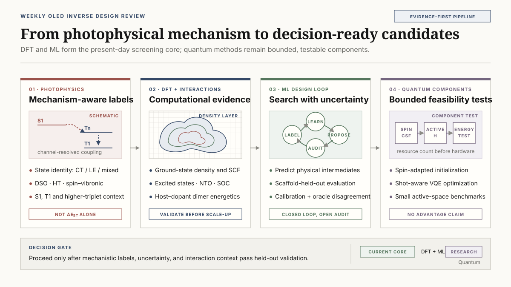

# Beyond ΔEST: Mechanism-Aware Labels, Scalable DFT, and the Real Quantum Readiness of OLED Inverse Design

The literature screened from 21 to 27 August 2026 contains one directly OLED-relevant, peer-reviewed study and six enabling-method preprints. Together they point to a practical correction in how OLED molecular inverse design should be organized.

The immediate bottleneck is not the absence of another molecular generator. A more consequential weakness lies in the property labels used to train and rank candidates. A small singlet–triplet gap, $\Delta E_{\mathrm{ST}}$, is useful, but it does not identify which triplet state participates, whether the states have charge-transfer (CT) or locally excited (LE) character, how strongly spin–orbit coupling (SOC) connects them, or whether nuclear motion opens a spin-vibronic pathway. Two isomers can therefore show similar intersystem-crossing rates while reaching them through different mechanisms.

Two adjacent computational studies address other missing layers. DensIP uses machine-learned electron densities in a physics-based intermolecular potential, offering a possible route from isolated molecules to host–dopant and host–host energetics. A Kohn–Sham neural operator replaces repeated orbital diagonalization inside self-consistent-field iterations and demonstrates unusually large out-of-distribution calculations. Neither method has yet been validated as an OLED production workflow, but both are more immediately actionable than this week’s quantum papers.

*Figure 1. Evidence-guided workflow map. Solid paths represent methods demonstrated in the reviewed literature; dashed OLED translations are proposed tests, not completed results.*

::: highlight Review verdict
For near-term OLED inverse design, the strongest research move is a mechanism-aware label audit, followed by packing-aware intermolecular validation and controlled tests of SCF acceleration. The two quantum studies reviewed this week address optimizer shot placement and spin-state preparation on small simulated or reconstructed systems. They do not demonstrate OLED-scale VQE, quantum speedup, or quantum advantage.
:::

The layout-verified eight-page source brief is available as a [downloadable PDF](oled_inverse_design_weekly_brief_2026-08-28.pdf).

## Evidence map: one direct OLED paper, six enabling preprints

| Study | Publication status | Direct result | Relevance to OLED inverse design |
| --- | --- | --- | --- |
| Karak et al., structural-isomer-dependent ISC | **Peer-reviewed**, *Journal of Chemical Physics* 165, 084303 | DSO, Herzberg–Teller, and spin-vibronic rate decomposition for three carbazole–benzoate isomers | Direct evidence that scalar $\Delta E_{\mathrm{ST}}$ screening can miss the operative mechanism |
| Wing et al., DensIP | **arXiv v1 preprint** | Density-based intermolecular potential fitted to CCSD(T)/CBS dimer energies | Candidate method for host–host, host–dopant, and exciplex-contact energetics |
| Khan et al., Kohn–Sham neural operator | **arXiv v1 preprint** | Potential-to-density map used in quasi-linear-scaling SCF | Possible ground-state SCF accelerator, not a TDDFT replacement |
| Xu et al., BoMolLLM | **arXiv v1 preprint** | Closed-loop generation using frozen LLM surrogates and learned oracles | Useful orchestration pattern, with unresolved oracle circularity and uncertainty |
| Jiang et al., PhysECD | **arXiv v1 preprint** | Physics-constrained prediction of transition quantities and ECD spectra | A design pattern for predicting physical generators before assembled observables |
| Stalschus et al., PAS-VQE | **arXiv v1 preprint** | Adaptive measurement shifts for coordinate-wise VQE optimization | Small simulator-only optimizer component |
| Tao et al., spin-eigenfunction preparation | **arXiv v1 preprint** | Deterministic circuits for arbitrary total-spin eigenfunctions | Potential state-preparation primitive, not a molecular property calculation |

*Figure 2. Karak et al. provides the only direct, peer-reviewed OLED-photophysics evidence in this window. The other studies are preprints at adjacent classical-method or future quantum-component layers.*

The workflow recommendations below are review inferences. They were not executed or validated by the source papers unless stated otherwise.

## 1. Similar rates do not imply the same photophysical mechanism

Karak and co-workers studied methyl 2-, 3-, and 4-(9H-carbazol-9-yl)benzoate, denoted o-, m-, and p-MCBA. They classified excited states as CT, LE, or mixed CT+LE and calculated intersystem-crossing contributions using a time-dependent correlation-function framework.

For the lowest-singlet pathway, the reported direct spin–orbit/Herzberg–Teller rates were:

| Isomer | Direct SOC rate | Herzberg–Teller rate |
| --- | ---: | ---: |
| ortho | $0.87\times10^6\ \mathrm{s^{-1}}$ | $4.16\times10^6\ \mathrm{s^{-1}}$ |
| para | $1.18\times10^6\ \mathrm{s^{-1}}$ | $2.24\times10^6\ \mathrm{s^{-1}}$ |
| meta | $5.67\times10^3\ \mathrm{s^{-1}}$ | $4.02\times10^6\ \mathrm{s^{-1}}$ |

The meta isomer additionally exhibited a spin-vibronic-assisted $k_{\mathrm{ISC}}$ of $5.45\times10^6\ \mathrm{s^{-1}}$. Direct SOC plus Herzberg–Teller coupling dominated the ortho and para pathways, whereas Herzberg–Teller plus spin-vibronic coupling dominated the meta pathway. Larger $S_1$–higher-triplet and higher-triplet–$T_1$ energy separations suppressed the spin-vibronic route in the ortho and para structures.

**Source result.** The three positional isomers can reach ISC rates of a similar order through different combinations of electronic SOC, nuclear-motion-assisted SOC, and higher-triplet mediation.

**Workflow inference.** A model trained only on $\Delta E_{\mathrm{ST}}$ and one static $S_1$–$T_1$ SOC value can rank the observed rate without learning the correct pathway. A more auditable label vector would retain at least $S_1$, $T_1$, $T_2$, and $T_3$ energies; CT/LE state character; oscillator strength; relevant $S_1$–$T_n$ SOC matrix elements; and a descriptor for promoting-mode or spin-vibronic activity.

The boundary matters. This is a three-isomer ISC study, not a complete TADF reverse-intersystem-crossing or device-efficiency study. Transfer to rigid multiresonance TADF emitters, heavy-atom phosphorescent emitters, or amorphous host environments remains an inference. The calculated rates also remain conditional on the electronic-structure, vibronic, and line-broadening approximations.

## 2. Intermolecular energetics is the missing bridge to the OLED film

An isolated-molecule model does not determine how a candidate behaves in an amorphous film. Host–dopant and host–host contacts alter electrostatics, dispersion, induction, orbital overlap, CT-state formation, and conformational distributions.

The DensIP preprint combines electron densities predicted by DenSNet with a four-parameter physical model containing electrostatics, exchange repulsion, induction, and many-body dispersion. DenSNet uses 20,000 DFT calculations. The four universal parameters are fitted with 1,016 training calculations from the optimized DES15K subset, which contains 4,063 configurations from 1,016 unique dimers; molecule-disjoint splits and $5\times5$ cross-validation are used for the small-dimer fit.

Reported test RMSEs against CCSD(T)/CBS are 0.7 kcal/mol near equilibrium, 0.2 kcal/mol at medium range, 0.7 kcal/mol for molecular-dynamics conformations, and 0.7 kcal/mol for neutral PLF547 protein–ligand fragments. The S66x8 total-energy RMSE is 0.6 kcal/mol. On the authors’ hardware, a benzene dimer required approximately 30 CPU-s with DensIP versus approximately 2,000 CPU-s with PBE.

The limitations are substantial for OLED use. Training chemistry is restricted to neutral, closed-shell H/C/N/O systems. Repulsive-wall and short-range RMSEs rise to 3.8 and 2.2 kcal/mol, respectively. Nitriles and carboxylic acids are difficult, and compensation between induction and exchange errors is reported. No OLED blend, amorphous morphology, excited state, or force-field molecular-dynamics validation is included.

**Workflow inference.** A useful next benchmark would contain 100–300 host–host and host–emitter geometries spanning stacked, T-shaped, CT-contact, and separated configurations. A DensIP-like model could be compared with $\omega$B97X-D/def2-TZVP and a smaller DLPNO-CCSD(T) anchor set. Its role would be to re-rank packing-aware candidates before expensive excited-state cluster calculations, not to replace those calculations.

## 3. A neural Kohn–Sham map could accelerate SCF, but not the whole OLED calculation

Khan and co-workers learn a map from a Kohn–Sham potential on a real-space grid to the corresponding electron density. Their domain-invariant, SE(3)-equivariant Fourier neural operator replaces repeated orbital diagonalizations during SCF and has reported cost scaling of $O(N_g\log N_g)$.

Training combines 2,004 molecules and 6,500 solids, using 59,500 ordinary SCF potential–density labels. The tests include QM9, larger QMugs molecules, metals, insulators, and magnesium dislocations. For held-out QM9 systems, the density error is 0.625%, compared with 0.662% for a direct ground-state predictor. On out-of-distribution QMugs molecules, the self-consistent neural-operator error is 2.23% versus 9.97%; the dipole error is 0.026 versus 0.237 D/electron. The method converges magnesium dislocations containing up to 8,250 atoms and 82,500 valence electrons on one GPU after training on cells no larger than 364 atoms.

**Source result.** The learned density map supports stable SCF iterations across unusually different chemical and solid-state domains, including a large out-of-distribution metallic defect calculation.

**Workflow inference.** For OLED calculations, this should initially be tested as a ground-state SCF preconditioner. A controlled benchmark would measure SCF wall time and failure rate for 50–200 large donor–acceptor molecules and dimers, recover orbitals through fixed-density post-SCF diagonalization, and then run the unchanged TDA/TDDFT layer.

Only the density component is learned in this preprint. Total energies and spectra still require post-SCF orbital recovery. Excited states, hybrid and range-separated functionals, forces, charged species, and organic-film conformers are not established. If the fixed-density diagonalization consumes most of the original cost, the end-to-end acceleration may be much smaller than the SCF scaling result suggests.

## 4. Closed-loop generation still needs a trustworthy oracle

BoMolLLM freezes both a graph-based Llamole generator and an LLM surrogate. The surrogate reads the design instruction, previous SMILES, and oracle scores, then selects top-$k$ reference molecules and may provide a one-sentence search guide. Its classical comparison is a Matérn-5/2 Gaussian process with automatic relevance determination on 768-dimensional generator embeddings compressed by truncated SVD, using LogEI acquisition.

The study tests Llama-3.1-8B, Mistral-7B, and Qwen2-7B on six MolQA tasks: HIV, BBBP, and BACE classification plus CO2, O2, and N2 permeability. The oracles are random forests trained on ECFP4 fingerprints. Improvements are heterogeneous. With Mistral, BACE AUC rises from 0.6209 in one-shot generation to 0.6443, while O2 log-MAE changes from 0.7621 to 0.7535. Random search and GP Bayesian optimization are often close, and the material-task improvements with Qwen are small.

The loop optimizes learned oracles and evaluates with closely related machinery, so oracle exploitation is unresolved. Prompted “exploration” is not calibrated posterior uncertainty. Invalid material SMILES are excluded from MAE calculations, which can bias the reported metric. The study contains no excited-state OLED data, DFT validation, synthesis planning, or retrosynthesis constraint.

For an OLED loop, the LLM is better assigned to summarizing failure clusters and choosing interpretable references. Numerical predictions and uncertainty should remain with a calibrated GNN ensemble or GP. Each iteration should reserve a blinded DFT batch and report enrichment, calibration error, scaffold diversity, synthetic feasibility, and oracle disagreement.

PhysECD supplies a complementary modeling pattern. Its parity-aware E(3)-equivariant network predicts per-state excitation energies and electric and magnetic transition dipoles, then reconstructs rotatory strengths and spectra with differentiable Gaussian broadening. Mirror reflection exactly reverses the predicted ECD spectrum by construction. On CMCDS, the reported per-molecule spectral Pearson correlation is 0.642 mean and 0.822 median.

ECD is not TADF, and spectral correlation alone does not establish excitation-energy or intensity accuracy at OLED design precision. Nevertheless, “predict physical generators, then assemble the observable” is a transferable design principle. An OLED model could predict state energies, transition dipoles, transition-density descriptors, and SOC-related quantities before a differentiable photophysics layer constructs spectra or rate proxies.

## 5. The quantum papers are components, not OLED calculations

The PAS-VQE preprint modifies one-parameter-at-a-time Rotosolve/NFT-style optimization. Three circuit-energy evaluations reconstruct a sinusoid. A von Mises prior is placed over the minimizer, and the measurement shift adapts from $2\pi/3$ for a weak prior toward $\pi/2$ for a concentrated prior.

All reported benchmarks are simulations: a 5-qubit transverse-field Ising model with a three-layer efficient-SU(2) circuit and 40 parameters, and 4-qubit MaxCut with a five-layer hardware-efficient circuit and 20 parameters. The study uses 100 random starts. Shot budgets are 1,000 or 100 shots per evaluation for the Ising model and 200 or 20 for MaxCut. PAS recovers whichever of two fixed shifts performs better in each regime; it does not claim a universal multiplicative speedup.

No molecular Hamiltonian, active space, fermion-to-qubit mapping, excited-state objective, hardware noise, or chemistry optimizer baseline is tested. A molecular experiment must report the full multiplication of parameters, updates, three shifts, Pauli measurement groups, and shots. The familiar $O(1/\sqrt{N_{\mathrm{shots}}})$ shot-noise scaling remains.

The spin-eigenfunction preprint deterministically prepares total-spin eigenfunctions using sequential branching paths or binary spin-coupling trees. Branching-path SCS-CG circuits can reach $O(n)$ depth. The more general WDB-CG construction uses an auxiliary qubit and has at least $O(n^2)$ depth. Small-qubit instances are checked with classical amplitude reconstruction; there is no QPU run, molecular energy calculation, or noise study.

Spin-pure configuration state functions could improve initial overlap for open-shell or strongly correlated active spaces. However, an $n$-spin eigenfunction is not yet a molecular electronic wavefunction. Orbital occupations, antisymmetry mapping, the active-space Hamiltonian, and a correlation ansatz remain necessary.

::: evidence Quantum boundary
Neither preprint demonstrates quantum advantage for OLED chemistry. PAS is a simulator-only shot-placement method, while the spin study provides theoretical state-preparation circuits verified by classical reconstruction. Both may enter a future active-space VQE workflow, but neither replaces DFT/TDDFT screening.
:::

## 6. Proposed experiment: a 12–24-molecule mechanistic label audit

The following experiment is a review proposal, not a completed result.

1. **Select the chemical set.** Choose three or four scaffold families containing positional or torsional isomers. Include at least one known fast-RISC example and one weak or negative control per family. A total of 12–24 molecules is large enough to expose isomer misranking while remaining compatible with careful excited-state inspection.

2. **Freeze geometries and base labels.** At existing optimized geometries, extract $S_1$, $T_1$, and at least $T_2$ energies; use $T_3$ where state ordering requires it. Record oscillator strength, natural-transition-orbital CT/LE descriptors, and relevant $S_1$–$T_n$ SOC matrix elements.

3. **Add a limited vibronic tier.** For four to six representatives, calculate selected normal-mode SOC derivatives or a clearly defined spin-vibronic proxy. This tier should be reserved for molecules chosen before model evaluation, not only for cases that the simpler model already misranks.

4. **Fit matched models.**

   - Model A: $\Delta E_{\mathrm{ST}}$ only
   - Model B: $\Delta E_{\mathrm{ST}}$ + static SOC + state character
   - Model C: Model B + promoting-mode or spin-vibronic descriptors

5. **Use scaffold-held-out validation.** Compare leave-one-scaffold-out ranking of measured $k_{\mathrm{RISC}}$, or a higher-level computed rate when measurement is unavailable. Report uncertainty calibration and the frequency of catastrophic isomer inversions, not only aggregate MAE.

6. **Apply a circularity gate.** Continue only if Models B or C improve scaffold-held-out ranking without using the same computed rate formula both to construct the descriptors and to define the validation target.

A positive result would justify expanding mechanistic labels in the production dataset. A negative result would still be useful: it would show whether the extra computational cost adds information beyond geometry, energy gaps, and conventional SOC descriptors.

## 7. What was not found this week

No credible new primary study in the screened window established a PhOLED host design with device or lifetime validation, a degradation mechanism connecting bond dissociation and exciton or polaron chemistry to operational lifetime, a SELFIES-specific synthesis-constrained workflow, a CRBM/Boltzmann molecular inverse-design result, a chemistry-relevant D-Wave or QAOA encoding with competitive classical baselines, an OLED-scale VQE resource estimate, or a new OLED-relevant GW–BSE result.

An *Organic Letters* paper on fully resonant B/N-doped hetero[8]helicenes appeared online on 27 August 2026. It was too new at the screening cutoff for a reliable quantitative summary and is retained as a watchlist item rather than incorporated speculatively.

## Conclusion

This week’s papers reorganize the OLED inverse-design problem into three coupled layers.

The molecular layer needs labels that distinguish state character, SOC pathways, and vibronic mediation instead of compressing photophysics into $\Delta E_{\mathrm{ST}}$. The environmental layer needs intermolecular energetics that can evaluate host–host and host–emitter contacts. The computational layer needs faster ground-state calculations whose end-to-end benefit survives orbital recovery and subsequent excited-state work.

Current quantum methods sit outside this main production path. Adaptive VQE shifts and deterministic spin-state preparation may become useful subroutines for carefully chosen active spaces, but the reviewed evidence contains no OLED molecular Hamiltonian benchmark, QPU chemistry calculation, or advantage claim. The defensible next step is therefore a mechanism-aware label audit, followed by packing and SCF benchmarks with frozen classical baselines. Quantum components should enter only where their resource cost and chemical contribution can be measured separately.

## Publication information

- Coverage window: 2026-08-21 to 2026-08-27
- Screening cutoff: 2026-08-28, approximately 08:58 KST
- Selected records: one peer-reviewed article and six arXiv v1 preprints
- Duplicate control: studies included in the 2026-08-21 brief were excluded
- Interpretation rule: numerical findings are source-reported; OLED workflow translations and the mechanistic-label audit are review inferences requiring independent validation

## References

1. P. Karak, K. Basu, A. Ghosh, and S. Chakrabarti, [“Role of spin-orbit and nuclear motion assisted spin-orbit coupling on the structural isomerism dependent intersystem crossing mechanism,” *Journal of Chemical Physics* 165, 084303 (2026)](https://doi.org/10.1063/5.0343043). **Peer-reviewed.**
2. D. Wing, M. Bogojeski, S. Goger, K.-R. Müller, and A. Tkatchenko, [“Accurate and Transferable Intermolecular Potential Based on Machine-Learned Molecular Electron Density,” arXiv:2608.20753v1 (2026)](https://arxiv.org/abs/2608.20753). **Preprint.**
3. D. Khan, M. D. Hanisch, N. Argatoff, E. Xie, S. Sharma, and A. Anandkumar, [“Learning the Kohn-Sham map with neural operators for quasi-linear scaling density functional theory,” arXiv:2608.23895v1 (2026)](https://arxiv.org/abs/2608.23895). **Preprint.**
4. Y. Xu, X. Zhao, X. Song, L. Bai, and T. Yu, [“Closed-Loop Bayesian Molecular Inverse Design with Semantic LLM Surrogates,” arXiv:2608.22967v1 (2026)](https://arxiv.org/abs/2608.22967). **Preprint.**
5. Y. Jiang, L. Chen, R. Shi, L. Han, T. Zhu, and Y. Yang, [“PhysECD: A Physics-Constrained E(3)-Equivariant Framework for Electronic Circular Dichroism Spectrum Prediction,” arXiv:2608.21892v1 (2026)](https://arxiv.org/abs/2608.21892). **Preprint.**
6. F. Stalschus, S. Pedrielli, S. Kühn, K. Jansen, K. A. Nicoli, and S. Nakajima, [“Prior-Informed Adaptive Shifts for Sequential Minimal Optimization in Variational Quantum Eigensolvers,” arXiv:2608.21616v1 (2026)](https://arxiv.org/abs/2608.21616). **Preprint.**
7. W. Tao, J. Wang, and F. Zuo, [“Deterministic Preparation of Arbitrary Spin Eigenfunctions,” arXiv:2608.22892v1 (2026)](https://arxiv.org/abs/2608.22892). **Preprint.**
8. [“Integration of Multiresonance Heterocyclic Aromatic Hydrocarbons for Fully Resonant B/N-Doped Hetero[8]helicenes with Long-Wavelength Ultra-Narrow-Band Emission,” *Organic Letters*, published online 27 August 2026](https://doi.org/10.1021/acs.orglett.6c03273). **Watchlist; not quantitatively reviewed here.**
