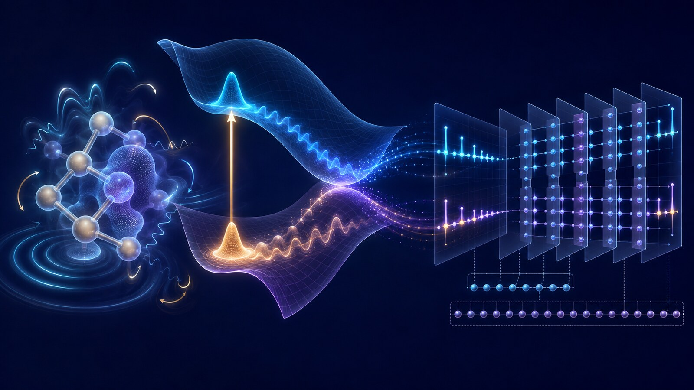
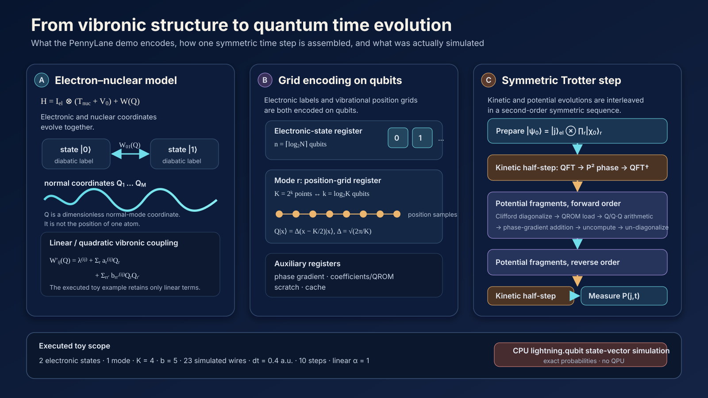

# From Static Energies to Photoexcited Dynamics: Vibronic Quantum Simulation in PennyLane

A molecule does not respond to light through electronic energy levels alone. Its nuclei move, bonds stretch and twist, and those motions change the energies and characters of the electronic states. This coupled electronic–vibrational motion—**vibronic dynamics**—is central to internal conversion, intersystem crossing, energy transfer, and charge transfer.

The PennyLane demo [*A quantum algorithm for vibronic dynamics*](https://pennylane.ai/demos/simulating_vibronic_dynamics), published on 19 August 2026, turns this problem into executable circuit components. It implements a small example of the peer-reviewed algorithm developed by Motlagh and co-workers in [*Quantum Algorithm for Vibronic Dynamics: Case Study on Singlet Fission Solar Cell Design*](https://doi.org/10.1088/2058-9565/ae0828), *Quantum Science and Technology* **10**, 045048 (2025).

The boundary is important. This is **not a real molecule run on a quantum processor**. The supplied program evolves an illustrative two-electronic-state, one-vibrational-mode model with the CPU-based `lightning.qubit` state-vector simulator. Its contribution is architectural and educational: it exposes how a fault-tolerant vibronic algorithm can be assembled from a real-space grid, a Quantum Fourier Transform (QFT), quantum read-only memory (QROM), reversible arithmetic, a phase-gradient state, and a second-order Trotter product formula.

*Figure 1. Concept illustration linking electronic-state change, nuclear-wavepacket motion, and real-space grid encoding. It is not the structure of a specific molecule, a literal quantum circuit, or a computed result.*

::: highlight Review verdict
The PennyLane page is an implementation tutorial for a future fault-tolerant algorithm, not evidence that present quantum hardware has solved nonadiabatic molecular dynamics. Its executed result is a 23-wire classical state-vector toy simulation. The formalism is relevant to mechanism-resolved TADF and OLED photophysics, but the code contains no spin–orbit coupling, ISC/RISC, real-molecule parameters, thermal environment, or QPU run.
:::

## Evidence at a glance

| Item | Verified scope |
|---|---|
| Public artifact | Emily Nobes, PennyLane educational demo, 19 August 2026 |
| Underlying research | Motlagh et al., *Quantum Science and Technology* **10**, 045048 (2025) |
| Algorithm class | Digital gate-based real-time Hamiltonian simulation; not VQE, QAOA, or annealing |
| Execution backend | CPU C++ `lightning.qubit` state-vector simulator |
| Demonstrated model | Two electronic states, one vibrational mode, four grid points, linear coupling |
| Full circuit width | 23 simulated wires: three system wires and 20 work/precision wires |
| Readout | Exact electronic-state probabilities from the state vector |
| Not demonstrated | Molecular accuracy, a QPU run, noise/error correction, quantum advantage, or OLED prediction |
| Research position | Algorithm and resource-feasibility work aimed at early fault-tolerant computing |

This review keeps four evidence layers separate:

- **Demo result:** settings and outputs in the public PennyLane code
- **Source paper:** the peer-reviewed algorithm and current arXiv v3 resource estimates
- **Computational boundary:** accuracy, chemistry, and hardware claims that were not tested
- **Review inference:** a bounded path toward TADF, PhOLED, and inverse-design research

## 1. An intuitive picture: a wavepacket moving across several landscapes

The Born–Oppenheimer approximation uses the fact that electrons usually respond much faster than nuclei. One first solves the electronic problem at a chosen nuclear geometry, then treats the nuclei as moving on the resulting potential-energy surface. This picture is extraordinarily productive for equilibrium structures and ground-state energies.

After photoexcitation, however, several electronic surfaces can approach or intersect. Imagine them as flexible landscape sheets stacked above the same molecular coordinates. A nuclear wavepacket moves across a sheet. When it reaches a region where two sheets interact strongly, part of the wavepacket may transfer to the other electronic state, split between pathways, or retain coherence. A table of vertical excitation energies records selected heights; it does not propagate the moving wavepacket.

The algorithm divides this motion into short movie frames. During every small interval $dt$, it alternates between two updates:

1. move the nuclear wavepacket according to its momentum;
2. update phases and state couplings according to nuclear position and electronic label.

A symmetric sequence of those updates is a second-order Suzuki–Trotter product formula.

The introductory PennyLane prose is too broad when it suggests that classical computers simply cannot handle dynamics. Surface hopping, Ehrenfest dynamics, multiconfiguration time-dependent Hartree (MCTDH), multilayer MCTDH, and tensor-network methods all address parts of this problem. The narrower challenge is that systematically accurate, full-dimensional quantum propagation can become expensive when many modes and electronic states develop strong correlations.

## 2. The physical model: the KDC vibronic Hamiltonian

The Köppel–Domcke–Cederbaum (KDC) Hamiltonian treats electronic labels and nuclear vibrations as one quantum system:

$$
H=\mathbb I_{\mathrm{el}}\otimes(T_{\mathrm{nuc}}+V_0)+\mathbf W(\mathbf Q).
$$

$T_{\mathrm{nuc}}$ is nuclear vibrational kinetic energy, $V_0$ is a reference harmonic potential, and $\mathbf W(\mathbf Q)$ is a diabatic matrix of electronic energies and couplings that changes with the normal-mode coordinates $\mathbf Q$.

A matrix element can be truncated at quadratic order:

$$
W'_{ij}(\mathbf Q)=\lambda^{(i,j)}
+\sum_r a_r^{(i,j)}Q_r
+\sum_{r,r'}b_{rr'}^{(i,j)}Q_rQ_{r'}.
$$

The coordinate-independent $\lambda$ terms set energy offsets and couplings, $a_rQ_r$ gives linear vibronic coupling, and $b_{rr'}Q_rQ_{r'}$ introduces quadratic and mode–mode dependence. Keeping only the linear terms gives an LVC model; retaining the quadratic terms gives a QVC model. Each $Q_r$ is a dimensionless molecular normal coordinate, not the position of one atom.

This Hamiltonian is an input model, not an automatic electronic-structure calculation. Electronic states, frequencies, normal modes, and coupling coefficients must be obtained upstream from DFT/TDDFT or multireference calculations and a diabatization procedure. The [current arXiv v3](https://arxiv.org/html/2411.13669v3) explicitly leaves Hamiltonian construction outside the quantum-propagation algorithm.

## 3. Encoding continuous nuclear motion on qubits

Each vibrational coordinate is discretized over $K=2^k$ real-space grid points and stored in a $k$-qubit register. The computational basis represents position:

$$
Q|x\rangle=\Delta(x-K/2)|x\rangle,
\qquad \Delta=\sqrt{2\pi/K}.
$$

With $M$ vibrational modes and $N$ electronic states, the main system register uses

$$
M\log_2K+\lceil\log_2N\rceil
$$

qubits before work and precision registers are added.

One common misconception should be removed: this demo does **not** place vibrations in photonic continuous-variable qumodes. It represents both the electronic-state label and every vibrational position grid with **qubit registers**, then evaluates the circuit with `lightning.qubit`. The code variable called `electrons` denotes the diabatic electronic-state register, not the number of electrons.

A primitive classical grid stores $N K^M$ complex amplitudes explicitly, so memory can grow exponentially with the number of modes. A quantum state can encode those amplitudes in a smaller register. That representational compression does not eliminate state preparation, coefficient loading, quantum arithmetic, circuit precision, error correction, or measurement costs.

*Figure 2. Source-derived mapping from the vibronic model to electronic-state and vibrational grid registers and then to one symmetric Trotter step. The scope bar records the settings executed in the PennyLane toy example. The vibrational coordinates are grid-encoded on qubits, not qumodes.*

## 4. How one time step is assembled

The target evolution is $|\psi(t)\rangle=e^{-iHt}|\psi(0)\rangle$. Kinetic and potential terms generally do not commute, so their exponentials cannot simply be separated without error. The demo uses a kinetic half-step, the potential fragments in forward and reverse order, and a final kinetic half-step.

### Kinetic energy: visit momentum space with a QFT

Position $Q$ is diagonal on the computational grid, whereas momentum $P$ is not. For each mode, the circuit applies a QFT to enter the momentum representation, uses `OutPoly` to compute $(x-K/2)^2$ in a work register, converts the kinetic contribution into phase, uncomputes the intermediate value, and applies the inverse QFT.

### Potential energy: load state-specific coefficients and turn them into phase

Potential coefficients depend on the electronic state. `LoadCoeffsKDC` uses QROM to load a precomputed bit string conditioned on the electronic-state register. QROM here is a reversible lookup circuit for a fixed coefficient table; it is not a hardware QRAM that provides coherent access to an external database.

Reversible arithmetic evaluates $Q_r$ for a linear term or $Q_rQ_{r'}$ for a quadratic term. The result controls addition into the reusable $b$-qubit phase-gradient state

$$
|R_b\rangle=2^{-b/2}\sum_{y=0}^{2^b-1}e^{i2\pi y/2^b}|y\rangle,
$$

thereby applying the energy–time phase. The QROM and arithmetic work are uncomputed afterward.

### Off-diagonal electronic coupling: XOR fragments and Clifford diagonalization

Electronic-state couplings make the potential matrix off-diagonal. The source algorithm groups matrix elements whose electronic labels have the same bitwise XOR difference. A single differing bit can be diagonalized with a Hadamard; multiple differing bits are reduced with controlled-NOT operations before the Hadamard. This block-diagonalization uses Clifford gates, after which each fragment can receive a coordinate-dependent phase efficiently.

## 5. What the public program actually computes

| Setting | Value | Meaning |
|---|---:|---|
| electronic states | 2 | $\lvert 0\rangle$ and $\lvert 1\rangle$ in a one-qubit state register |
| vibrational modes | 1 | one normal coordinate |
| $k$ | 2 | two qubits for the mode |
| $K=2^k$ | 4 | four position-grid points |
| $b$ | 5 | phase/coefficient precision from `delta=0.04` |
| $\omega$ | 1 | illustrative frequency |
| $dt$ | 0.4 a.u. | duration of one step |
| steps | 10 | trajectories evaluated through 4 a.u. |
| potential order | $\alpha=1$ | the executed example uses linear coordinate dependence |
| coefficient array | `[[1.0, 0.0], [-1.3, 1.3]]` | illustrative rather than molecular parameters |

The registers total 23 simulated wires:

| Register | Wires |
|---|---:|
| electronic state | 1 |
| vibrational grid | 2 |
| phase gradient | 5 |
| coefficients | 5 |
| scratch | 6 |
| cache | 4 |
| **total** | **23** |

Only three wires encode the physical toy model. The other 20 provide precision and reversible-arithmetic workspace. Calling this a “23-qubit molecular calculation” would therefore be misleading.

The initial nuclear state is a discrete Gaussian approximation to a harmonic-oscillator ground wavepacket. For each $t=0,\ldots,10$, the program recomputes the state vector from the beginning and returns `qp.probs` on the electronic register. No shots are specified, so the curves are exact state-vector probabilities rather than finite-sampling estimates. The page reports approximately 8 minutes 9.7 seconds for the whole script.

The two electronic populations oscillate and the transfer remains incomplete. Their sum staying at one is a necessary consequence of a normalized unitary evolution in a two-state register. The demo does not compare against exact classical grid propagation, MCTDH, a Trotter convergence study, or experiment, so this is a qualitative functionality check rather than a chemical-accuracy validation.

## 6. Computational boundary

| Layer | Demonstrated | Not demonstrated |
|---|---|---|
| device | CPU state-vector simulation | QPU or photonic-chip execution |
| measurement | exact electronic probabilities | finite-shot uncertainty and sampling cost |
| circuit | high-level PennyLane arithmetic | native compilation to a hardware topology |
| error | one coarse grid, fixed precision, and Trotterization | a separated, converged error budget |
| chemistry | illustrative two-state, one-mode LVC | real-molecule parameterization and a classical reference |
| OLED | formal possibility of spin-vibronic extension | SOC, singlet–triplet states, ISC/RISC, or a host environment |
| performance | implementation functionality | quantum speedup or quantum advantage |

A realistic study must separate at least eight errors: state/mode selection, LVC/QVC truncation, electronic-structure parameterization and diabatization, grid size $K$, Trotter order and step size, fixed-point precision $b$, state preparation and finite-shot readout, and finally hardware noise plus logical-to-physical error-correction overhead.

## 7. Source-paper resource estimates at chemically motivated scale

The current journal/arXiv v3 analysis uses $K=16$ grid points per mode and a second-order product formula. Selected **algorithmic/logical** estimates are:

| Model | States · modes | Propagation target | Qubits | Toffoli gates |
|---|---:|---:|---:|---:|
| $(\mathrm{NO})_4$-Anth | 5 · 19 | 100 fs, 10% | 146 | $5.47\times10^6$ |
| $(\mathrm{NO})_4$-Anth | 5 · 19 | 100 fs, 1% | 146 | $1.73\times10^7$ |
| anthracene dimer | 6 · 21 | 100 fs, 1% | 154 | $2.76\times10^6$ |
| anthracene dimer | 6 · 21 | 500 fs, 1% | 154 | $3.54\times10^7$ |
| anthracene/$\mathrm{C}_{60}$, reduced | 4 · 11 | 100 fs, 1% | 113 | $6.62\times10^5$ |
| anthracene/$\mathrm{C}_{60}$, full | 4 · 246 | 100 fs, 1% | 1,053 | $2.66\times10^7$ |

These circuits were not executed. The estimates do not include physical-qubit counts, code distance, magic-state factories, control hardware, or an end-to-end wall-clock time. A 154-logical-qubit estimate does not mean that the calculation fits on a present 154-physical-qubit processor.

Version control also matters. The v1 preprint reported 1,065 qubits and $2.7\times10^9$ Toffolis for the full 246-mode anthracene/$\mathrm{C}_{60}$ model. Version 3 reports 1,053 qubits and $2.66\times10^7$ Toffolis after changing the resource and empirical-error analysis. That reduction is an analytical revision, not a hardware result.

A separate PennyLane [resource-estimation demo](https://pennylane.ai/demos/tutorial_resource_estimation_vibronic_dynamics) gives a dense upper bound of 146 wires, $6.082\times10^7$ Toffolis, and $5.21\times10^8$ total gates for a $(\mathrm{NO})_4$-Anth model. Its larger count illustrates how Hamiltonian sparsity and circuit construction materially change feasibility.

No quantum advantage is established. The peer-reviewed work identifies strongly correlated, higher-order vibronic dynamics as a plausible difficult regime for classical tensor methods, but a matched end-to-end comparison in accuracy, runtime, Hamiltonian construction, and observable extraction remains undone.

## 8. How this differs from VQE

| Question | VQE | Vibronic dynamics algorithm |
|---|---|---|
| Primary task | Find a low-energy eigenstate and its energy | Propagate state populations after excitation |
| Computation | Minimize the energy of a parameterized state | Apply real-time $e^{-iHt}$ evolution |
| Typical output | Energies and static observables | $P_j(t)$, pathways, correlation functions, spectra candidates |
| Main circuit elements | ansatz, Pauli measurements, classical optimizer | QFT, QROM, arithmetic, phase gradient, Trotter steps |
| Hardware orientation | Often NISQ-motivated shallow circuits | Deep arithmetic aimed at fault-tolerant devices |

Static energies from VQE could help parameterize a dynamics model. They do not by themselves produce vibrationally mediated population transfer in time.

## 9. Review inference: relevance to TADF and PhOLED research

Reverse intersystem crossing (RISC) in thermally activated delayed fluorescence (TADF) is not determined by a single $\Delta E_{\mathrm{ST}}$. Singlet and triplet state character, higher triplets, spin–orbit coupling (SOC), promoting modes, dielectric surroundings, and structural disorder can all alter the pathway.

The KDC framework can in principle be extended with a spin–orbit Hamiltonian,

$$
\mathbf W'(\mathbf Q)=\mathbf W(\mathbf Q)+\mathbf H_{\mathrm{SO}}(\mathbf Q),
$$

and the source paper identifies TADF as a possible application.

| OLED physics | Vibronic-model element |
|---|---|
| $S_1$, $T_1$, and $T_n$ energies and characters | diabatic electronic-state manifold |
| SOC | $\mathbf H_{\mathrm{SO}}$ and inter-state couplings |
| promoting vibrations | $a_r^{(i,j)}$ and $b_{rr'}^{(i,j)}$ |
| ISC/RISC pathway | singlet–triplet population transfer |
| time-resolved occupation | $P_{S_1}(t)$, $P_{T_1}(t)$, $P_{T_n}(t)$ |
| spectra | Fourier transform of a time-correlation function |

This connection is a review inference, not a demo result. The code contains neither SOC nor triplet states. A real TADF or PhOLED film also requires thermal mode populations, dephasing, host polarization, disorder, intermolecular modes, and open-system relaxation. Coherent oscillations in a closed two-state toy model cannot be read directly as irreversible ISC or RISC rates.

The algorithm is therefore better positioned as a future high-fidelity dynamics kernel for a small number of valuable candidates than as a near-term high-throughput generator.

## 10. A bounded validation workflow for OLED inverse design

A defensible research sequence would be:

1. generate or retrieve molecular candidates;
2. screen synthesizability, stability, and inexpensive electronic descriptors classically;
3. obtain states, Hessians, normal modes, and SOC with DFT/TDDFT or multireference methods;
4. perform diabatization and construct a compact LVC/QVC spin-vibronic Hamiltonian;
5. validate it first with exact grids, MCTDH, or an appropriate tensor-network baseline;
6. separate grid, Trotter, and fixed-point errors under the same accuracy target;
7. consider quantum propagation only where the controlled classical baseline becomes limiting;
8. feed populations, pathway sensitivities, and uncertainty back into a mechanism-aware ML surrogate.

A useful first proof of concept would contain $S_1$, $T_1$, one or two higher triplets, and 5–10 selected promoting modes from a published model. Every trajectory should be compared with an exact or MCTDH reference while $K$, $dt$, and $b$ are varied independently. Larger state spaces or open-system models should come only after that validation ladder is passed.

## Assessment

The PennyLane demo succeeds as an implementation tutorial. It makes the circuit roles of QFT, QROM, reversible arithmetic, phase-gradient states, electronic-fragment diagonalization, and Trotterization inspectable rather than treating vibronic simulation as a black box.

Its scientific claim must remain bounded. The result is a 23-wire CPU state-vector toy simulation, not a real-molecule calculation, a QPU experiment, a quantitative dynamics benchmark, or evidence of quantum advantage. The source paper’s hundreds of logical qubits and millions of Toffoli gates are fault-tolerant algorithm estimates, not physical-hardware costs.

The research direction is nevertheless coherent. Moving OLED molecular design beyond static $\Delta E_{\mathrm{ST}}$ and oscillator strength toward state populations, higher-state mediation, SOC, and promoting-mode dynamics will require real-time vibronic propagation. Turning that direction into a useful tool will depend as much on credible Hamiltonian construction and strict classical validation as on a deeper quantum circuit.

## Primary and official sources

1. Emily Nobes, [*A quantum algorithm for vibronic dynamics*](https://pennylane.ai/demos/simulating_vibronic_dynamics), PennyLane Demos, 19 August 2026.
2. D. Motlagh et al., [*Quantum Algorithm for Vibronic Dynamics: Case Study on Singlet Fission Solar Cell Design*](https://doi.org/10.1088/2058-9565/ae0828), *Quantum Science and Technology* **10**, 045048 (2025).
3. D. Motlagh et al., [arXiv:2411.13669v3](https://arxiv.org/html/2411.13669v3), current technical version.
4. D. Dhawan, [*Quantifying resource requirements for vibronic dynamics simulation*](https://pennylane.ai/demos/tutorial_resource_estimation_vibronic_dynamics), PennyLane Demos, updated 27 May 2026.
5. PennyLaneAI, [official demo source at fixed commit](https://github.com/PennyLaneAI/demos/blob/4e1b6f0c2501ff79fb6addbaf9323a9399e3f824/demonstrations_v2/simulating_vibronic_dynamics/demo.py).
6. PennyLane, [`lightning.qubit` documentation](https://docs.pennylane.ai/projects/lightning/en/stable/index.html).

*Verification note: numerical settings and resource figures were checked against the public PennyLane code, official documentation, the peer-reviewed paper, and the current arXiv v3. Demo execution, source-paper estimates, and the OLED extension proposed by this review remain separate evidence layers.*
