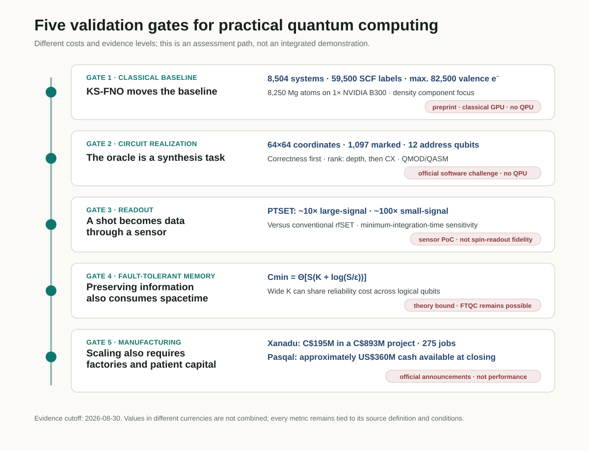
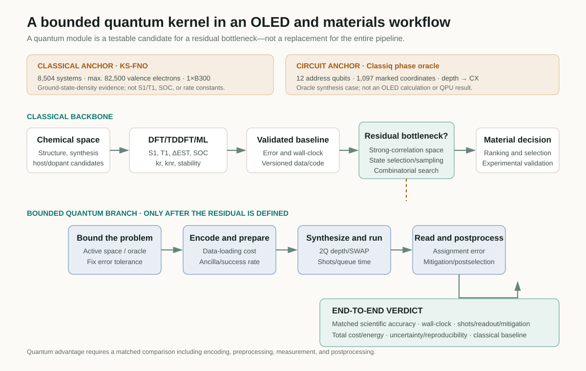

# What It Takes for a Quantum Computer to Become a Computing System

Judging the practical value of a quantum computer by qubit count or a single circuit-depth metric obscures where the bottlenecks actually arise. The strongest classical method for the same problem must first be fixed as the baseline. The remaining task must then be realized as an executable circuit, and repeated measurements must become trustworthy data at the sensor. Long computations also require error-correction resources that preserve logical information, while deployment depends on a manufacturing base capable of producing devices repeatedly.

Five developments reported in late August 2026 illuminate different points along this path. Classiq launched an open challenge to reduce the depth of a phase oracle. A Kohn–Sham Fourier neural operator (KS-FNO) from Caltech researchers replaced repeated orbital diagonalization with density prediction on a classical GPU. Researchers at Quantum Motion demonstrated PTSET, a more sensitive charge sensor for semiconductor spin qubits. A separate theoretical study established an unavoidable logarithmic term in the cumulative spacetime cost of quantum memory. Canadian investment in Xanadu’s manufacturing project and Pasqal’s public listing show that the industrial base for producing and deploying research hardware is a bottleneck in its own right.

These results were not integrated and demonstrated in one device. Nor are they competing records of the same quantity. This review places them along a validation path—**classical baseline → circuit realization → readout → fault-tolerant memory → manufacturing and deployment**—and asks where a bounded quantum kernel could reasonably enter an OLED or materials-computing workflow.

<figure class="article-hero-figure">
  
  <figcaption>Figure 1. From problem representation to manufacturing, practical quantum computing must pass the constraints of the entire path rather than post one best-in-class metric at a single stage. This conceptual illustration contains no quantitative data and does not reproduce any company’s device.</figcaption>
</figure>

::: evidence Review verdict
The strongest signal today is not that quantum hardware is about to replace classical computing. While classical baselines such as KS-FNO advance rapidly, a quantum computation must increasingly be judged by its full cost, including oracle realization, readout, error correction, and manufacturing. An OLED or materials PoC should first fix that classical baseline, then place a bounded quantum kernel only at a residual bottleneck such as a strongly correlated active space or state selection.
:::

## Evidence map at a glance

| Validation gate | Case | What was established | What was not directly established |
|---|---|---|---|
| Classical baseline | KS-FNO, arXiv preprint | Trained on 8,504 molecules and solids. Converged the density SCF for 8,250 Mg atoms and 82,500 valence electrons on one B300 | A QPU result, excited-state OLED properties, complete orbital-free DFT, or a hardware-matched speedup |
| Circuit realization | Official Classiq challenge | Implement a phase oracle for 1,097 marked pixels in a 64×64 image, using separate 6-qubit x and y registers. Depth is the primary ranking metric and CX count the tie-breaker | A winning result, QPU execution, quantum acceleration, or the cost under an unpublished gate basis and topology |
| Readout | PTSET, arXiv preprint | Approximately 10-fold large-signal and 100-fold small-signal sensitivity gains over a conventional rfSET | Actual spin-state readout fidelity, array multiplexing, crosstalk, or thermal load |
| Fault-tolerant memory | FTQC theory, arXiv preprint | A tight memory bound with an unavoidable logarithmic contribution to cumulative spacetime overhead | The impossibility of FTQC, physical resources for a particular surface-code device, or a QPU experiment |
| Manufacturing and deployment | Canada–Xanadu and Pasqal | A CAD 195M government investment in a CAD 893M project; approximately USD 360M in cash available to Pasqal at closing | Facility completion, logical-qubit performance, fault-tolerant operation, or quantum advantage |

<figure class="figure-panel figure-panel-fit">
  
  <figcaption>Figure 2. The five cases measure different objects at different levels of evidence. The arrows indicate an order for assessing practicality; they do not imply that these technologies have been demonstrated as one device or integrated workflow.</figcaption>
</figure>

## 1. An advancing classical baseline changes the starting point

A Kohn–Sham DFT self-consistent field (SCF) calculation constructs a Kohn–Sham potential from an input density, diagonalizes the Hamiltonian to obtain new orbitals and a new density, and repeats the cycle to convergence. As the system grows, orbital diagonalization at every iteration becomes a bottleneck with roughly cubic scaling. Orbital-free DFT has long sought to avoid this step, but a transferable kinetic-energy functional has proved difficult to construct.

[Danish Khan and colleagues](https://arxiv.org/abs/2608.23895) did not train an inverse map or attempt to predict the final ground-state density in one step. Instead, they learned the **forward Kohn–Sham map** inside the SCF cycle:

$$
v_{\mathrm{KS}}(\mathbf r)\longmapsto n^{\mathrm{out}}(\mathbf r).
$$

Their SE(3)-equivariant Fourier neural operator takes a potential on a real-space grid and predicts the next density. Construction of the Hartree and exchange-correlation potentials, together with density mixing, remains within the conventional SCF structure. The precise interpretation is therefore that a **learned operator replaces the repeated one-particle eigensolve**, not that a neural network has replaced all of DFT.

### The training domain and the maximum-scale calculation are different sets

The base model was trained from **59,500 ordinary SCF labels** obtained for **8,504 systems**: 2,004 QM9 molecules and 6,500 MC3D solids. The authors treated density self-consistency for molecules, insulators, and metals within one model family, then evaluated spectra and structural observables using a fixed-density post-SCF diagonalization.

The 82,500-electron Mg dislocation result was not a direct extrapolation of the base model. That model diverged for every tested dislocation cell. The researchers therefore fine-tuned it on **1,203 Mg structures containing 20–364 atoms**, spanning bulk, strain, surface, stacking-fault, and dislocation-core environments. They then converged the density of a system with as many as **8,250 Mg atoms and 82,500 valence electrons** on **one NVIDIA B300** to a relative-\(L^1\) fixed-point threshold of \(10^{-3}\).

The fitted exponent for a complete SCF update was \(p=1.03\) for KS-FNO and \(p=3.37\) for Quantum ESPRESSO. Absolute wall-clock time is not a hardware-matched benchmark, however, because the comparison places FNO timings from one B300 against Quantum ESPRESSO timings linearly rescaled from a 192-core AMD EPYC 9655 node. No PBE reference density exists for the largest system. Density errors of **0.33–0.35%** were checked on core crops containing at most 528 atoms; convergence of the 8,250-atom calculation is not by itself independent proof of PBE ground-state accuracy.

### What remains to be calculated

The present model learns only the density component of the joint Kohn–Sham operator. Total energies and orbital-resolved spectra still require one fixed-density post-SCF orbital calculation. Removing that step would require a forward kinetic-energy model and additional validation. The paper’s references to “quantum calculations” mean electronic-structure calculations, not computation on a quantum computer.

For OLED research, this result is not a substitute for excited-state calculations. It does not directly predict \(S_1\), \(T_1\), \(\Delta E_{\mathrm{ST}}\), oscillator strength, spin–orbit coupling (SOC), \(k_r\), or \(k_{nr}\). Its significance is that the classical baseline for ground-state density and large-structure calculations has become stronger. A quantum PoC should confront that advancing baseline directly and compare residual bottlenecks—strong correlation, excited states, or sampling—under matched conditions.

## 2. An oracle must be implemented, not merely assumed

Descriptions of quantum algorithms often draw an oracle as a one-line box that “marks every state satisfying the condition.” Hardware does not execute that box; it executes the decomposed gate sequence. The structure of the Boolean expression, the use of ancillas, uncomputation, decomposition of multi-controlled gates, and routing for the target topology all affect circuit depth and the number of two-qubit gates.

The [Classiq Quantum Circuit Challenge](https://get.classiq.io/quantum-circuit-challenge/) turns this gap into a concrete problem. The target consists of **1,097 marked pixels** in a 64×64 binary image. The x and y coordinates are represented by separate 6-qubit registers, and the task is to implement the phase oracle

$$
U_f\lvert x,y\rangle=(-1)^{f(x,y)}\lvert x,y\rangle,\qquad
f(x,y)=
\begin{cases}
1,&(x,y)\text{ is a marked pixel},\\
0,&\text{otherwise.}
\end{cases}
$$

The two address registers contain 12 qubits in total, but this should not be described as a “12-qubit circuit” or as solving the problem with “12 logical qubits.” An implementation may add ancillas. A submitted circuit must first pass the oracle-correctness test; valid entries are then ranked by **circuit depth**, with **CX count** used to break ties. Participants submit both a Classiq <code>.qmod</code> source file and an OpenQASM <code>.qasm</code> file implementing the same circuit.

The challenge opened on 28 August 2026 and closes on 30 September. What is currently public is the problem and its evaluation procedure, not an optimization result. The public page does not specify a baseline depth or CX count, the permitted ancilla count, the evaluation gate basis, connectivity, or the detailed depth-counting rules. QPU execution is not listed as an evaluation criterion.

The case nevertheless has clear educational value. Quantum-circuit optimization cannot be reduced to a single Classiq method. Problem representation, high-level synthesis, Boolean factorization, logical rewriting, qubit mapping and routing, native gates, pulses, and fault-tolerant resource optimization operate at different layers. The Classiq challenge is one example that turns **high-level modeling and synthesis search** into a measurable task. The broader landscape is reviewed in [*Why Quantum Circuit Optimization Matters*](https://infant83.github.io/AI_Tech_Review/reviews/2026-08-27_classiq-ashn-circuit-compression/).

## 3. A shot becomes data only after readout

A semiconductor spin qubit is not read directly with a voltmeter. Spin-dependent tunnelling or Pauli blockade generally converts spin information into a charge configuration, after which the radio-frequency response of a nearby charge sensor is measured. Insufficient sensor sensitivity or bandwidth lengthens the required integration time, allowing relaxation and noise to limit readout fidelity.

The [PTSET study](https://arxiv.org/abs/2608.27045) placed a TiN element with low critical current and high kinetic inductance in series with the matching network of a radio-frequency single-electron transistor (rfSET). When the SET current exceeds a threshold, the TiN switches from the superconducting to the normal state, abruptly changing the circuit impedance and reflected RF signal. The architecture uses a phase transition to amplify a small, continuous change in resistance.

The experimental device was fabricated in GlobalFoundries **22-nm FD-SOI CMOS**. At an out-of-plane field of 0.6 T, the switching current was approximately **33 nA** and the resonance frequency was 334 MHz. Rather than using an adjacent spin qubit, the researchers emulated a charge event through a gate-bias shift. Relative to the conventional rfSET mode, sensitivity defined through the minimum integration time improved by nearly **one order of magnitude** in the large-signal regime and by **two orders of magnitude** in the small-signal regime, which more closely resembles spin readout.

It would therefore be incorrect to state that “spin-qubit readout fidelity improved by a factor of 100.” The experiment did not read an actual spin state or report a fidelity. The IQ traces used an integration time of **637 μs**. The apparatus could not directly resolve the switching and recovery dynamics, and the reported **10–100 ns recovery time** is an estimate based on TiN properties. The value of **more than 350-fold SNR** over a conventional rfSET under well-overcoupled conditions is likewise a circuit-model prediction, not an experimental result. Array yield, multiplexing crosstalk, cryogenic wiring, and thermal load remain to be tested.

## 4. Error correction also incurs a cost for memory

The fault-tolerance threshold theorem states that, below a threshold physical error rate, arbitrarily reliable computation can be achieved by adding physical qubits and circuit depth. The remaining question is whether the cumulative space×time cost can stay at a constant ratio to the useful computation.

The theoretical analysis by [Bharti, Haug, and Tanggara](https://arxiv.org/abs/2608.26272) begins with the simplest case, quantum memory. Under optimistic assumptions—independent erasure noise with known erased locations, \(0<p<\delta_{\mathrm{GV}}\simeq0.1100\), arbitrary adaptive protocols, and ideal recovery—the minimum worst-case physical storage-location cost for retaining \(K\) logical qubits over \(S\) time steps with total error no greater than \(\varepsilon\) is

$$
C_{\min}(K,S,\varepsilon)
=\Theta\!\left[S\left(K+\log\frac{S}{\varepsilon}\right)\right].
$$

The relative overhead is

$$
\Theta\!\left(1+\frac{\log(S/\varepsilon)}{K}\right).
$$

The logarithmic term cannot be avoided when a small number of logical qubits must be preserved for a very long time. Conversely, a sufficiently wide computation with \(K=\Omega(\log(S/\varepsilon))\) can share the reliability cost across many logical qubits and maintain bounded relative overhead.

The title’s statement that fault-tolerant quantum computation “cannot be achieved with constant spacetime overhead” is not an impossibility theorem for FTQC. The authors also construct positive-rate CSS codes that attain the memory bound. Their extension to general fault-tolerant circuits is discussed under sufficient conditions on codes and gadgets; it is not a matching lower bound for every algorithm and every noise model. Nor is this a QPU experiment or a physical-qubit estimate for a specific surface-code machine. The result establishes an information-theoretic cost that remains even when erasure locations are known and ideal recovery is allowed.

## 5. Scale is also a manufacturing and capital problem

Even improved algorithms and device fidelity cannot produce a computing system if complex optical, cryogenic, and electronic-control hardware cannot be manufactured and installed repeatedly. On 28 August, the Canadian government announced [a CAD 195M Strategic Response Fund investment in Xanadu’s CAD 893M project](https://www.canada.ca/en/innovation-science-economic-development/news/2026/08/government-of-canada-invests-in-xanadu-to-build-up-advanced-quantum-manufacturing-in-canada.html). The scope includes expanding R&D facilities and building capabilities for integrating, packaging, testing, and assembling photonic and semiconductor components. The project is expected to create **275 highly skilled jobs**.

This announcement is a commitment to manufacturing facilities and process qualification. It is not evidence that the facilities have been completed or that a fault-tolerant photonic processor is operating. The government release calls the CAD 195M an investment but does not break down its grant, repayment, or equity terms on the public page.

On 27 August, Pasqal announced [completion of its business combination with Bleichroeder Acquisition Corp. II](https://www.pasqal.com/newsroom/pasqal-and-bleichroeder-acquisition-corp-ii-complete-business-combination/). The surviving company, Pasqal Holding SA, was listed on Nasdaq under ticker <code>PSQL</code>, with warrants under <code>PSQLW</code>, and said that **approximately USD 360M in cash was available at closing**. This amount is not pure new financing, enterprise value, or revenue. The company stated that it plans to use the capital for QPU manufacturing and deployment, its fault-tolerant roadmap, cloud and software, HPC integration, and commercial operations.

The Xanadu and Pasqal developments involve different currencies and transaction structures. Their amounts should neither be added nor compared as though they were quantum-performance metrics. They show that manufacturing capacity and long-term capital have become independent competitive dimensions of the quantum industry; they do not demonstrate fault-tolerant performance.

## 6. Where should a quantum kernel enter an OLED or materials PoC?

The purpose of inverse molecular design for OLEDs is not to execute a quantum circuit. It is to change the ranking of host and dopant candidates that can be synthesized and to improve decisions about emission efficiency, stability, and lifetime. The first question should therefore be **“What bottleneck remains after applying the best available classical method?”**, rather than “Which quantum algorithm should we use?”

A defensible bounded workflow proceeds as follows.

1. Reduce chemical space with classical generative models and chemical rules.
2. Fix baselines for \(S_1\), \(T_1\), \(\Delta E_{\mathrm{ST}}\), SOC, rates, and stability using DFT/TDDFT, multireference calculations, and validated ML surrogates.
3. Record errors, data splits, hardware, wall-clock time, and uncertainty together.
4. Select one residual bottleneck, such as a strongly correlated active space, an excited-state manifold, state selection, sampling, or combinatorial optimization.
5. Define a small quantum kernel that includes encoding, state preparation, oracle or Hamiltonian construction, and success probability.
6. Record the logical circuit together with mapped two-qubit depth, CX/SWAP count, ancillas, shots, and queue time on the target backend.
7. Compare the end-to-end result—including assignment error, mitigation, postselection, and classical post-processing—with a classical baseline at the same scientific accuracy.

<figure class="figure-panel figure-panel-fit">
  
  <figcaption>Figure 3. A validated classical workflow narrows the full chemical space, and only the residual bottleneck becomes a candidate for a quantum kernel. The KS-FNO and Classiq values are separate evidence anchors for costs at different stages, not results from one integrated demonstration.</figcaption>
</figure>

KS-FNO represents progress in the classical backbone of this structure. The Classiq challenge exposes the cost of translating an already defined Boolean oracle into an executable gate sequence. PTSET reminds us that shots become data only after passing through a readout chain, the FTQC bound captures the memory cost of long circuits, and the Xanadu and Pasqal developments highlight the cost of supplying hardware. None is an OLED quantum-computing result, but together they provide a checklist for assessing an OLED PoC.

## 7. What an evidence ledger for a PoC should record

| Area | Minimum record | Decision question |
|---|---|---|
| Scientific objective | Target property, acceptable error, experimental decision | Would the result change the ranking of any candidate? |
| Classical baseline | Method and version, data, hardware, wall-clock time, uncertainty | Is this the strongest current baseline at matched accuracy? |
| Problem reduction | Active space, state manifold, QUBO or oracle definition | Does the accounting include the cost of constructing the quantum-kernel input? |
| Circuit | Logical and compiled two-qubit depth, CX/SWAP, ancillas, native gates, topology | Has the circuit been compared under the conditions of an actual backend? |
| Measurement | Shots, assignment error, sensitivity, mitigation, postselection | Are sensor sensitivity and final readout fidelity kept distinct? |
| Error correction | Logical and physical qubits, T count and depth, code distance, memory spacetime | Are algorithmic resources separated from device resources? |
| Total cost | Queue and runtime, preprocessing and post-processing, total cost and energy | Is there an end-to-end gain at the same problem and accuracy? |
| Reproducibility | Code, seed, calibration date, failed cases, provenance | Can a reader still distinguish QPU, simulator, and classical emulation? |

“Quantum advantage” cannot be inferred from a shallow circuit or a large qubit count alone. Encoding, data loading, state preparation, shots, readout, mitigation, post-processing, and wall-clock time must be compared with the classical baseline at the same problem size and solution quality. Each of today’s five cases fills a different column in that comparison.

## Final assessment

Practical quantum computing is not a single-algorithm problem. The oracle in the Classiq challenge must realize the correct unitary in a shallow circuit, while PTSET illustrates the need to convert a circuit output into a trustworthy electrical signal. The FTQC memory bound fixes a cost for preserving information during a long computation. The Xanadu and Pasqal developments show that an industrial base is needed to manufacture and deploy such devices repeatedly.

KS-FNO sets the starting point for this path. As classical DFT handles larger systems at lower scaling, the role of quantum computing does not simply disappear; it becomes more narrowly defined. Advanced classical AI and HPC can handle ground-state density, routine screening, and large-scale chemical-space reduction, while a quantum kernel must be tested against the strongly correlated, state-selection, or measurement bottlenecks that classical methods leave behind.

A persuasive OLED or materials PoC does not end with the statement that a quantum computer was used. It becomes a reusable computational asset only when the strongest classical baseline is fixed, the quantum kernel is tightly bounded, and circuit, readout, error-correction, and manufacturing costs are recorded in the same evidence ledger.

## Sources

1. Classiq Technologies, [Classiq Quantum Circuit Challenge](https://get.classiq.io/quantum-circuit-challenge/), 28 August–30 September 2026.
2. D. Khan et al., [*Learning the Kohn-Sham map with neural operators for quasi-linear scaling density functional theory*](https://arxiv.org/abs/2608.23895), arXiv:2608.23895v1, 24 August 2026.
3. G. Aizpurua-Iraola et al., [*A Superconducting Phase Transition Single-Electron Transistor*](https://arxiv.org/abs/2608.27045), arXiv:2608.27045v1, 27 August 2026.
4. K. Bharti, T. Haug, A. Tanggara, [*Fault-tolerant quantum computation cannot be achieved with constant spacetime overhead*](https://arxiv.org/abs/2608.26272), arXiv:2608.26272v1, 26 August 2026.
5. Innovation, Science and Economic Development Canada, [*Government of Canada invests in Xanadu to build up advanced quantum manufacturing in Canada*](https://www.canada.ca/en/innovation-science-economic-development/news/2026/08/government-of-canada-invests-in-xanadu-to-build-up-advanced-quantum-manufacturing-in-canada.html), 28 August 2026.
6. Pasqal, [*Pasqal and Bleichroeder Acquisition Corp. II Complete Business Combination*](https://www.pasqal.com/newsroom/pasqal-and-bleichroeder-acquisition-corp-ii-complete-business-combination/), 27 August 2026; [SEC Form 6-K](https://www.sec.gov/Archives/edgar/data/2119292/000121390026094393/ea0303667-6k_pasqal.htm).

[Download the verified five-page Daily Quantum Brief PDF](daily_quantum_brief_2026-08-30.pdf)

*Verification note: Quantitative claims, publication status, and execution location were checked against the official challenge documentation, the full arXiv papers, the government announcement, the company announcement, and the SEC filing. QPU, classical GPU, device PoC, theory, and industry announcement remain separate evidence layers. Evidence cutoff: 30 August 2026.*
