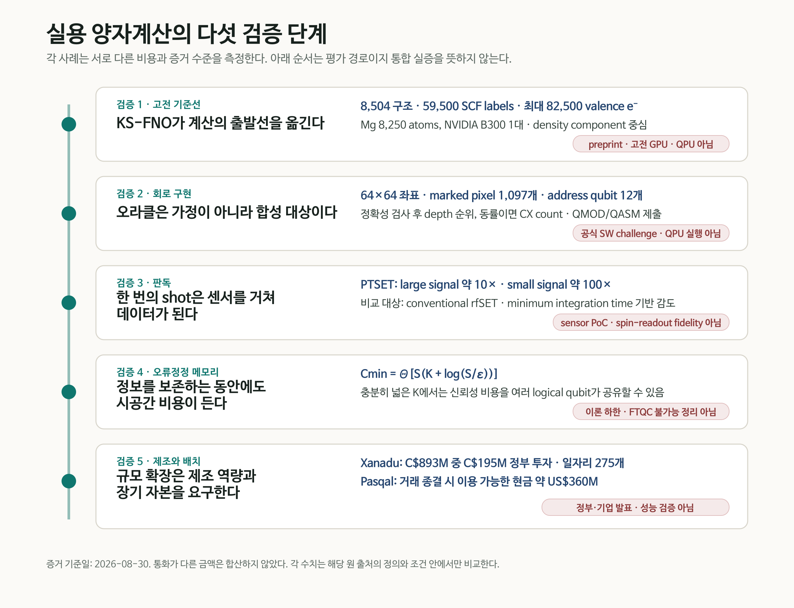
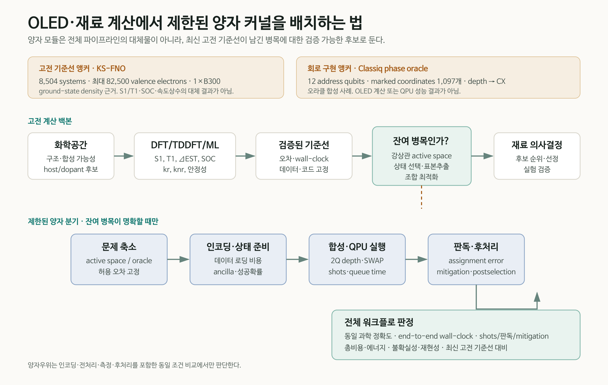

# 양자컴퓨터가 계산 시스템이 되기까지

양자컴퓨터의 실용성을 큐비트 수나 회로 깊이 하나로 판단하면 병목의 위치를 놓친다. 먼저 같은 문제를 푸는 최신 고전 계산을 기준선으로 고정해야 한다. 남은 문제는 실행 가능한 회로로 구현되어야 하고, 반복 측정은 센서에서 신뢰할 수 있는 데이터로 바뀌어야 한다. 긴 계산 동안 논리 정보를 보존하는 오류정정 자원과 장치를 반복 생산할 제조 기반도 필요하다.

2026년 8월 말에 공개된 다섯 소식은 이 경로의 서로 다른 지점을 비춘다. Classiq는 phase oracle의 회로 깊이를 줄이는 공개 challenge를 시작했다. Caltech 연구진의 Kohn–Sham Fourier neural operator(KS-FNO)는 고전 GPU에서 반복적인 orbital diagonalization을 density prediction으로 바꾸었다. Quantum Motion 연구진은 반도체 스핀 큐비트용 전하 센서의 감도를 높이는 PTSET을 시연했다. 별도의 이론 연구는 quantum memory의 누적 시공간 비용에 피할 수 없는 logarithmic 항이 있음을 보였다. 캐나다의 Xanadu 제조 투자와 Pasqal의 상장은 연구장비를 생산·배치하는 산업 기반이 별도의 병목이라는 점을 보여준다.

다섯 항목은 서로 다른 플랫폼과 증거 수준을 다룬다. 통합 장치의 연속 시연이나 동일 지표의 성능 경쟁으로 볼 수 없다. 이 리뷰는 각각을 **고전 기준선 → 회로 구현 → 판독 → 오류정정 메모리 → 제조·배치**의 검증 경로에 놓고, OLED·재료 계산에서 양자 커널을 어디에 제한적으로 삽입할 수 있는지 살펴본다.

<figure class="article-hero-figure">
  
  <figcaption>그림 1. 문제 표현에서 제조까지, 실용 양자계산의 성패는 전체 경로의 제약을 통과하는 데 달려 있다. 정량 정보나 특정 기업의 장치를 재현하지 않은 개념 일러스트다.</figcaption>
</figure>

::: evidence 리뷰 판정
오늘의 강한 신호는 KS-FNO처럼 고전 기준선이 빠르게 전진할수록 양자 계산이 오라클 구현·판독·오류정정·제조를 포함한 전체 비용으로 평가받게 된다는 점이다. OLED·재료 PoC에서는 이 기준선을 먼저 고정하고, 강상관 active space나 상태 선택처럼 고전적으로 남은 병목에만 bounded quantum kernel을 두는 편이 타당하다.
:::

## 한눈에 보는 증거 지도

| 검증 단계 | 이번 사례 | 확인된 결과 | 직접 입증하지 않은 것 |
|---|---|---|---|
| 고전 기준선 | KS-FNO, arXiv preprint | 8,504개 분자·고체로 학습. Mg 8,250 atoms·82,500 valence electrons의 density SCF를 B300 한 대에서 수렴 | QPU, excited-state OLED 물성, 전체 orbital-free DFT, hardware-matched speedup |
| 회로 구현 | Classiq 공식 challenge | 64×64 이미지의 marked pixel 1,097개를 x·y 각 6-qubit register의 phase oracle로 구현. depth 우선, CX 동점 기준 | challenge 우승 결과, QPU 실행, 양자 가속, 공개되지 않은 gate basis·topology 비용 |
| 판독 | PTSET, arXiv preprint | conventional rfSET 대비 large-signal 약 10배, small-signal 약 100배 감도 개선 | 실제 spin-state readout fidelity, array multiplexing, crosstalk·열부하 |
| 오류정정 메모리 | FTQC 이론, arXiv preprint | 누적 spacetime overhead에 logarithmic 기여가 불가피한 tight memory bound | FTQC 불가능성, 특정 surface-code 장치의 물리 자원량, QPU 실험 |
| 제조·배치 | 캐나다·Xanadu, Pasqal | CAD 893M 프로젝트에 CAD 195M 정부 투자; Pasqal 거래 종결 시 약 USD 360M 현금 이용 가능 | 시설 완공, logical qubit 성능, fault-tolerant 동작, 양자우위 |

<figure class="figure-panel figure-panel-fit">
  
  <figcaption>그림 2. 다섯 사례가 측정한 대상과 증거 수준은 서로 다르다. 화살표는 실용성을 검토하는 순서를 나타내며, 각 사례는 독립적인 근거로 읽어야 한다. <a href="../artifacts/practical_quantum_validation_gates_ko.svg">확대 가능한 SVG</a></figcaption>
</figure>

## 1. 최신 고전 기준선이 출발점을 바꾼다

Kohn–Sham DFT의 self-consistent field(SCF) 계산은 입력 density로 Kohn–Sham potential을 만들고, Hamiltonian을 diagonalize해 새로운 orbital과 density를 얻은 뒤 이를 수렴할 때까지 반복한다. 계가 커질수록 각 반복에서 수행하는 orbital diagonalization이 대략 cubic scaling의 병목이 된다. Orbital-free DFT는 이 문제를 피하려 했지만, transferable kinetic-energy functional을 찾기가 어려웠다.

[Danish Khan 등](https://arxiv.org/abs/2608.23895)은 inverse map이나 최종 ground-state density를 한 번에 맞히는 대신, SCF 내부의 **forward Kohn–Sham map**

$$
v_{\mathrm{KS}}(\mathbf r)\longmapsto n^{\mathrm{out}}(\mathbf r)
$$

을 학습 대상으로 삼았다. SE(3)-equivariant Fourier neural operator가 real-space grid의 potential을 받아 다음 density를 예측하고, Hartree·exchange-correlation potential 구성과 density mixing은 기존 SCF 구조에 남긴다. 정확한 해석은 **반복되는 one-particle eigensolve를 learned operator로 치환했다**는 것이며, DFT의 나머지 연산은 그대로 수행된다.

### 학습 집합과 최대 계산 집합을 구분해야 한다

기본 모델은 QM9 molecule 2,004개와 MC3D solid 6,500개, 합계 **8,504 systems**에서 얻은 **59,500 ordinary SCF labels**로 학습됐다. 저자들은 molecule, insulator, metal의 density self-consistency를 한 모델 계열에서 다루고, 고정 density의 post-SCF diagonalization으로 spectrum과 구조 관측량을 평가했다.

82,500-electron Mg dislocation 결과는 이 기본 모델을 그대로 extrapolate한 것이 아니다. 기본 모델은 모든 tested dislocation cell에서 발산했다. 연구진은 bulk, strain, surface, stacking fault와 dislocation-core environment를 포함한 **Mg 구조 1,203개, 20–364 atoms**로 추가 미세조정했다. 그 뒤 최대 **8,250 Mg atoms, 82,500 valence electrons**의 density를 **NVIDIA B300 한 대**에서 relative-\(L^1\) fixed-point threshold \(10^{-3}\)까지 수렴시켰다.

완전한 SCF update의 fitted exponent는 KS-FNO \(p=1.03\), Quantum ESPRESSO \(p=3.37\)이었다. 그러나 B300 한 대의 FNO 시간과 192-core AMD EPYC 9655 node로 선형 환산한 Quantum ESPRESSO 시간을 비교했으므로 절대 wall-clock은 hardware-matched benchmark가 아니다. 최대 시스템에는 PBE reference density도 없다. density error **0.33–0.35%**는 최대 528-atom core crop에서 확인됐고, 8,250-atom 결과의 수렴 자체는 PBE ground-state 정확도의 독립적 증명이 아니다.

### 아직 남은 계산

현재 모델은 joint Kohn–Sham operator 가운데 density component만 학습한다. Total energy와 orbital-resolved spectrum에는 한 번의 fixed-density post-SCF orbital calculation이 남는다. 이를 없애려면 forward kinetic-energy model과 추가 검증이 필요하다. 논문에서 사용하는 “quantum calculation”은 electronic-structure calculation을 뜻한다.

OLED 관점에서 이 결과는 excited-state 계산의 대체물이 아니다. \(S_1\), \(T_1\), \(\Delta E_{\mathrm{ST}}\), oscillator strength, SOC, \(k_r\), \(k_{nr}\)를 직접 예측하지 않는다. 의미는 바닥상태 density와 대규모 구조 계산의 고전 기준선이 더 강해졌다는 데 있다. 양자 PoC가 유용성을 주장하려면 이미 전진한 이 기준선을 피하지 말고, 강상관·여기상태·표본추출처럼 남은 병목을 동일 조건에서 비교해야 한다.

## 2. 오라클 구현도 계산 비용이다

양자 알고리즘 설명에서 oracle은 종종 “조건을 만족하는 상태에 표시를 한다”는 한 줄 상자로 그려진다. 하드웨어는 그 상자를 분해한 gate sequence를 실행한다. Boolean 식의 구조, ancilla 사용, uncomputation, 다중제어 gate의 분해와 target topology에 따른 routing이 depth와 2-qubit gate 수를 결정한다.

[Classiq Quantum Circuit Challenge](https://get.classiq.io/quantum-circuit-challenge/)는 이 간극을 하나의 구체적인 문제로 만들었다. target은 64×64 binary image에 표시된 **1,097 pixels**다. x와 y 좌표를 각각 6-qubit register로 나타내고, 다음 phase oracle을 구현한다.

$$
U_f\lvert x,y\rangle=(-1)^{f(x,y)}\lvert x,y\rangle,\qquad
f(x,y)=
\begin{cases}
1,&(x,y)\text{가 marked pixel}\\
0,&\text{그 밖의 좌표.}
\end{cases}
$$

두 address register는 합계 12 qubits지만, 이를 “전체 12-qubit 회로” 또는 “12 logical qubits로 문제를 해결했다”고 부르면 안 된다. 구현 방식에 따라 ancilla가 추가될 수 있다. 제출 회로는 먼저 oracle correctness를 통과해야 하고, 이후 **circuit depth**로 순위를 매기며 동률일 때 **CX count**를 사용한다. 참가자는 Classiq <code>.qmod</code> source와 동일 구현의 OpenQASM <code>.qasm</code>을 함께 제출한다.

이 challenge는 2026년 8월 28일 시작돼 9월 30일 마감된다. 현재 확인된 것은 문제와 평가 절차이지 최적화 성과가 아니다. 공개 페이지에는 baseline depth/CX, 허용 ancilla, 평가 gate basis, connectivity와 depth 산정 규칙의 세부사항이 나오지 않는다. QPU 실행도 평가 항목으로 제시되지 않는다.

그럼에도 사례의 교육적 가치는 분명하다. 회로 최적화는 Classiq 하나의 방법으로 환원되지 않는다. 문제 표현, 고수준 합성, Boolean factorization, 논리 회로 재작성, qubit mapping·routing, native gate, pulse와 fault-tolerant resource optimization이 서로 다른 층에서 작동한다. Classiq challenge는 그중 **고수준 모델과 합성 탐색**을 측정 가능한 문제로 만든 사례다. 전체 지형은 앞선 리뷰 [「양자 회로 최적화는 왜 필요한가」](https://infant83.github.io/AI_Tech_Review/reviews/2026-08-27_classiq-ashn-circuit-compression/)에서 다뤘다.

## 3. 한 번의 shot은 판독을 거쳐야 데이터가 된다

반도체 spin qubit는 spin state를 곧바로 전압계로 읽지 않는다. 일반적으로 spin-dependent tunnelling 또는 Pauli blockade를 이용해 spin information을 charge configuration으로 바꾸고, 근처 charge sensor의 radio-frequency response를 측정한다. 센서 감도와 bandwidth가 부족하면 더 긴 integration time이 필요하고, 그 사이 relaxation과 noise가 readout fidelity를 제한한다.

[PTSET 연구](https://arxiv.org/abs/2608.27045)는 radio-frequency single-electron transistor(rfSET)의 matching network에 낮은 critical current와 높은 kinetic inductance를 갖는 TiN element를 직렬로 넣었다. SET current가 임계값을 넘으면 TiN이 superconducting state에서 normal state로 전이하면서 circuit impedance와 reflected RF signal이 급격히 변한다. 연속적인 작은 저항 변화를 phase transition으로 증폭하는 구조다.

실험 소자는 GlobalFoundries **22-nm FD-SOI CMOS**에서 제작됐다. 0.6 T out-of-plane field에서 switching current는 약 **33 nA**, resonance는 334 MHz였다. 연구진은 charge event를 실제 인접 spin qubit가 아니라 gate-bias shift로 모사했다. conventional rfSET mode와 비교해 minimum integration time으로 정의한 감도는 large-signal regime에서 거의 **한 order**, 실제 spin readout에 더 가까운 small-signal regime에서 **두 orders** 개선됐다.

따라서 “spin-qubit readout fidelity가 100배 좋아졌다”는 표현은 틀리다. 실제 spin state를 읽지 않았고 fidelity도 보고하지 않았다. IQ trace에는 **637 μs integration**을 사용했다. switching과 recovery dynamics는 장비로 직접 분해하지 못했으며, **10–100 ns recovery time**은 TiN 특성에 근거한 추정이다. 잘 overcoupled된 조건에서 conventional rfSET 대비 **350배 초과 SNR**이라는 값도 실험 결과가 아니라 circuit model의 예측이다. Array yield, multiplexing crosstalk, cryogenic wiring과 열부하는 후속 검증 대상이다.

## 4. 오류정정은 기억에도 비용을 요구한다

Fault-tolerance threshold theorem은 physical error rate가 임계값 아래라면 추가 물리 큐비트와 circuit depth를 사용해 계산을 임의로 신뢰성 있게 만들 수 있다고 말한다. 여기서 남는 질문은 누적된 공간×시간 비용을 유용 계산 대비 일정한 비율로 유지할 수 있는가다.

[Bharti, Haug, Tanggara의 이론 연구](https://arxiv.org/abs/2608.26272)는 가장 단순한 quantum memory부터 하한을 구했다. 위치가 알려지는 independent erasure noise, \(0<p<\delta_{\mathrm{GV}}\simeq0.1100\), adaptive protocol과 ideal recovery까지 허용하는 낙관적 조건에서, K logical qubits를 S time steps 동안 total error \(\varepsilon\) 이하로 저장하는 최소 physical storage-location cost는

$$
C_{\min}(K,S,\varepsilon)
=\Theta\!\left[S\left(K+\log\frac{S}{\varepsilon}\right)\right]
$$

로 주어진다. Relative overhead는

$$
\Theta\!\left(1+\frac{\log(S/\varepsilon)}{K}\right)
$$

이다. 소수 logical qubit를 아주 오래 보존하면 logarithmic 항을 피할 수 없다. 반대로 \(K=\Omega(\log(S/\varepsilon))\)인 충분히 넓은 계산은 신뢰성 비용을 여러 logical qubit가 공유해 bounded relative overhead를 가질 수 있다.

논문 제목의 “cannot be achieved with constant spacetime overhead”를 FTQC 불가능 정리로 읽으면 안 된다. 저자들은 memory bound를 달성하는 positive-rate CSS construction도 제시했다. 일반 fault-tolerant circuit으로의 확장은 code와 gadget에 관한 충분조건 아래에서 논의하며, 모든 알고리즘·모든 noise model의 matching lower bound를 제시한 것은 아니다. 이 연구는 QPU 실험이나 surface-code 장치의 구체적 physical-qubit 견적도 아니다. 알려진 erasure location과 ideal recovery를 허용해도 사라지지 않는 정보이론적 비용을 고정한 결과다.

## 5. 규모는 제조와 자본의 문제이기도 하다

알고리즘과 device fidelity가 개선돼도 복잡한 광학·극저온·전자제어 장치를 반복 제작하고 설치하지 못하면 계산 시스템으로 확장되지 않는다. 8월 28일 캐나다 정부는 [Xanadu의 CAD 893M 프로젝트에 Strategic Response Fund를 통해 CAD 195M을 투자](https://www.canada.ca/en/innovation-science-economic-development/news/2026/08/government-of-canada-invests-in-xanadu-to-build-up-advanced-quantum-manufacturing-in-canada.html)한다고 발표했다. R&D 시설 확장, photonic·semiconductor component의 integration, packaging, testing과 assembly 역량 구축이 범위에 포함되며, **275개 고급 일자리** 창출을 예상한다.

이 발표는 제조 시설과 공정 qualification에 대한 약정이다. 시설 완공이나 fault-tolerant photonic processor의 동작을 보여준 결과가 아니다. 정부 자료도 CAD 195M을 investment라고 적지만 보조금·상환·지분 조건을 공개 페이지에서 세분하지 않는다.

Pasqal은 8월 27일 [Bleichroeder Acquisition Corp. II와의 기업결합 완료](https://www.pasqal.com/newsroom/pasqal-and-bleichroeder-acquisition-corp-ii-complete-business-combination/)를 발표했다. 존속회사 Pasqal Holding SA는 Nasdaq ticker <code>PSQL</code>, warrant <code>PSQLW</code>로 상장했고, 거래 종결 시점에 **약 USD 360M의 현금을 이용할 수 있다**고 밝혔다. 이 금액은 순수 신규 조달액, 기업가치 또는 매출이 아니다. 회사는 QPU 제조·배치, fault-tolerant roadmap, cloud·software, HPC integration과 상업 운영에 사용할 계획이라고 설명했다.

Xanadu와 Pasqal 소식은 서로 다른 통화와 거래 구조를 가진다. 두 금액을 합산하거나 quantum-performance 지표처럼 비교해서는 안 된다. 두 발표가 확인한 범위는 제조 능력과 장기 자본이 양자 산업의 독립적인 경쟁축이 되었다는 점이다.

## 6. OLED·재료 PoC에는 어디에 양자 커널을 둘 것인가

OLED 분자 역설계의 목적은 합성할 host·dopant 후보의 순위를 바꾸고, 발광 효율·안정성·수명을 예측하는 의사결정을 개선하는 데 있다. 따라서 첫 질문은 “어떤 양자 알고리즘을 쓸까”보다 **“최신 고전 방법을 적용하고도 어떤 병목이 남는가”**여야 한다.

현실적인 bounded workflow는 다음 순서를 따른다.

1. 고전 생성모델과 chemical rule로 화학공간을 줄인다.
2. DFT/TDDFT, 다중참조 계산과 검증된 ML surrogate로 \(S_1\), \(T_1\), \(\Delta E_{\mathrm{ST}}\), SOC, rate와 stability의 기준선을 고정한다.
3. 오차, 데이터 split, 하드웨어, wall-clock과 불확실성을 함께 기록한다.
4. 강상관 active space, excited-state manifold, state selection, 표본추출 또는 조합 최적화처럼 남은 병목을 하나 선택한다.
5. encoding, state preparation, oracle·Hamiltonian construction과 성공확률을 포함해 작은 양자 커널을 정의한다.
6. logical circuit뿐 아니라 target backend에 mapping한 2Q depth, CX/SWAP, ancilla, shots와 queue time을 기록한다.
7. assignment error, mitigation, postselection과 고전 후처리를 포함한 end-to-end 결과를 같은 과학 정확도의 고전 기준선과 비교한다.

<figure class="figure-panel figure-panel-fit">
  
  <figcaption>그림 3. 검증된 고전 계산으로 전체 화학공간을 줄이고, 고전적으로 남은 병목만 양자 커널 후보로 제한한다. KS-FNO와 Classiq 수치는 각 단계의 비용을 보여주는 별도 근거 앵커다. <a href="../artifacts/bounded_quantum_materials_workflow_ko.svg">확대 가능한 SVG</a></figcaption>
</figure>

KS-FNO는 이 구조에서 고전 backbone의 발전을 보여준다. Classiq challenge는 이미 정의된 Boolean oracle을 실제 gate sequence로 만드는 비용을 보여준다. PTSET은 shots가 readout chain을 지나야 데이터가 된다는 점을, FTQC bound는 긴 회로의 memory cost를, Xanadu와 Pasqal은 장치 공급의 비용을 상기시킨다. 어느 하나도 OLED 양자 계산의 성과는 아니지만, OLED PoC를 평가할 체크리스트는 함께 제공한다.

## 7. PoC 증거 원장에 남겨야 할 항목

| 영역 | 최소 기록 항목 | 판단 질문 |
|---|---|---|
| 과학적 목표 | 대상 물성, 허용 오차, 실험 의사결정 | 결과가 어떤 후보의 순위를 실제로 바꾸는가 |
| 고전 기준선 | method·version, 데이터, 하드웨어, wall-clock, uncertainty | 같은 정확도에서 현재 가장 강한 기준선인가 |
| 문제 축소 | active space, state manifold, QUBO/oracle 정의 | 양자 커널의 입력을 만드는 비용을 포함했는가 |
| 회로 | logical/compiled 2Q depth, CX/SWAP, ancilla, native gate, topology | 회로를 실제 backend 조건으로 비교했는가 |
| 측정 | shots, assignment error, sensitivity, mitigation, postselection | 감도와 최종 readout fidelity를 구분했는가 |
| 오류정정 | logical/physical qubits, T count/depth, code distance, memory spacetime | algorithmic resource와 device resource를 분리했는가 |
| 전체 비용 | queue·runtime, 전처리·후처리, 총비용·에너지 | 동일 문제·정확도에서 end-to-end 이득이 있는가 |
| 재현성 | code, seed, calibration date, 실패 사례, provenance | QPU·simulator·고전 emulation을 다시 구분할 수 있는가 |

“Quantum advantage”는 회로 깊이가 작거나 큐비트 수가 많다는 이유만으로 붙일 수 없다. 동일한 문제 크기와 해 품질에서 encoding, data loading, state preparation, shots, readout, mitigation, postprocessing과 wall-clock을 고전 기준선에 맞춰 비교해야 한다. 오늘의 다섯 사례는 그 비교표의 열을 각각 하나씩 채운다.

## 최종 평가

실용 양자계산은 알고리즘, 회로, 판독, 오류정정과 제조가 연결된 시스템 문제다. Classiq challenge의 oracle은 올바른 unitary를 얕은 회로로 구현해야 하고, PTSET은 회로 출력이 신뢰할 수 있는 전기 신호가 되어야 함을 보여준다. FTQC memory bound는 긴 계산 동안 정보를 보존하는 비용을 고정한다. Xanadu와 Pasqal 소식은 이러한 장치를 반복 제조하고 배치할 산업 기반이 필요함을 보여준다.

이 경로의 출발점에 KS-FNO가 있다. 고전 DFT가 더 큰 계를 더 낮은 scaling으로 다루게 되면 양자 계산의 역할은 더 구체적으로 제한된다. Ground-state density, routine screening과 대규모 chemical-space 축소는 발전된 고전 AI·HPC가 맡고, 양자 커널은 고전 방법이 남긴 강상관·상태 선택·측정 병목에서 검증받아야 한다.

OLED·재료 연구에서 설득력 있는 PoC는 “양자컴퓨터를 사용했다”는 데서 끝나지 않는다. 최신 고전 기준선을 고정하고, 양자 커널의 경계를 좁히며, 회로·판독·오류정정·제조 비용을 같은 evidence ledger에 남길 때 비로소 재사용 가능한 계산 자산이 된다.

## 근거 자료

1. Classiq Technologies, [Classiq Quantum Circuit Challenge](https://get.classiq.io/quantum-circuit-challenge/), 28 August–30 September 2026.
2. D. Khan et al., [*Learning the Kohn-Sham map with neural operators for quasi-linear scaling density functional theory*](https://arxiv.org/abs/2608.23895), arXiv:2608.23895v1, 24 August 2026.
3. G. Aizpurua-Iraola et al., [*A Superconducting Phase Transition Single-Electron Transistor*](https://arxiv.org/abs/2608.27045), arXiv:2608.27045v1, 27 August 2026.
4. K. Bharti, T. Haug, A. Tanggara, [*Fault-tolerant quantum computation cannot be achieved with constant spacetime overhead*](https://arxiv.org/abs/2608.26272), arXiv:2608.26272v1, 26 August 2026.
5. Innovation, Science and Economic Development Canada, [*Government of Canada invests in Xanadu to build up advanced quantum manufacturing in Canada*](https://www.canada.ca/en/innovation-science-economic-development/news/2026/08/government-of-canada-invests-in-xanadu-to-build-up-advanced-quantum-manufacturing-in-canada.html), 28 August 2026.
6. Pasqal, [*Pasqal and Bleichroeder Acquisition Corp. II Complete Business Combination*](https://www.pasqal.com/newsroom/pasqal-and-bleichroeder-acquisition-corp-ii-complete-business-combination/), 27 August 2026; [SEC Form 6-K](https://www.sec.gov/Archives/edgar/data/2119292/000121390026094393/ea0303667-6k_pasqal.htm).

[검증된 5쪽 Daily Quantum Brief PDF 내려받기](../artifacts/daily_quantum_brief_2026-08-30.pdf)

*검증 메모: 수치·연구 상태·실행 위치는 공식 challenge 문서, arXiv 원문, 정부 발표, 회사 발표와 SEC filing을 대조했다. QPU·고전 GPU·소자 PoC·이론·산업 발표를 서로 다른 증거 층으로 유지했으며, 기준일은 2026년 8월 30일이다.*
