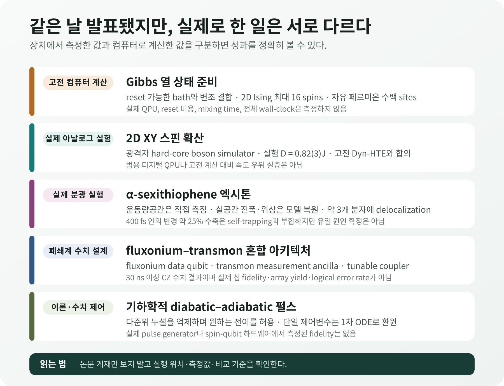
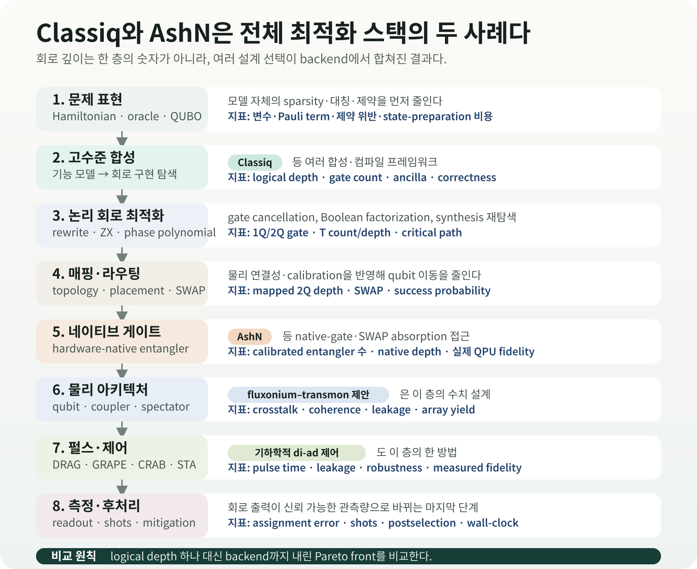

# 뜨거운 양자상태를 만들고, 엑시톤을 따라간다

양자계산 설명은 흔히 가장 낮은 에너지의 바닥상태에서 시작한다. 개념적으로 자연스럽고 전자구조와 물성의 기준이 되기 때문이다. 실제 물질과 소자는 온도가 0 K가 아니며, 빛을 흡수한 유기 반도체는 평형 바닥상태에 머물지도 않는다. 열에 의해 여러 에너지 상태가 섞이고, 전자와 정공이 만든 엑시톤은 분자 사이로 퍼졌다가 격자 진동과 상호작용하며 모양을 바꾼다.

따라서 실용적인 양자 시뮬레이션에는 두 질문이 따라온다. **원하는 유한온도 상태를 계산 장치에 어떻게 준비할 것인가?** 그리고 **준비하거나 모사한 상태가 실제 물질을 올바르게 나타낸다는 것을 어떤 관측량으로 확인할 것인가?** 2026년 8월 28일 발표된 연구들은 이 두 질문의 서로 다른 부분을 다룬다.

한 연구는 reset 가능한 보조 bath를 이용해 Gibbs 열 상태를 만드는 알고리즘을 제안했고, 다른 연구는 2차원 XY 모델의 스핀 확산을 광격자 아날로그 양자 시뮬레이터와 고전 계산에서 대조했다. 유기 반도체 연구는 α-sexithiophene 박막의 엑시톤을 femtosecond 분광으로 추적해 실공간 파동함수를 복원했다. 같은 날 발표된 fluxonium–transmon 아키텍처와 기하학적 펄스 제어는 계산의 더 아래쪽, 즉 소자 배치와 물리 제어 층을 다룬다.

각 연구가 다룬 대상과 방법은 서로 다르다. 실제 장치에서 측정한 값, 고전 컴퓨터에서 계산한 값, 아직 설계 단계인 제안을 먼저 구분해야 한다. OLED 계산은 엑시톤 반경처럼 새로 측정된 물리량과 비교할 수 있고, 양자 회로는 depth뿐 아니라 shots와 wall-clock까지 포함해 평가해야 한다.

<figure class="article-hero-figure">
  
  <figcaption>그림 1. 왼쪽은 열 reservoir와 양자 격자의 에너지 교환, 오른쪽은 분자 여러 개에 퍼진 엑시톤의 수축을 나타낸 개념 일러스트다. 특정 실험 장치나 정량 데이터를 재현한 그림은 아니다.</figcaption>
</figure>

::: evidence 이번 연구들이 실제로 보여준 것
8월 28일 발표된 다섯 APS 논문은 유한온도 상태를 준비하는 방법, 2D XY 시뮬레이터의 확산계수를 고전 계산과 맞춰보는 실험, 엑시톤의 크기·위상·시간 변화를 복원하는 분광법을 제시했다. 이 다섯 논문에서 실제 QPU 성능을 측정한 연구는 없고, 2D XY 연구만 물리적인 아날로그 양자 시뮬레이터를 사용했다. 따라서 성과를 평가할 때는 상태 준비 오차, 확산계수, 엑시톤 반경처럼 각 논문이 실제로 계산하거나 측정한 값을 따라가야 한다.
:::

## 다섯 연구에서 실제로 한 일

| 구분 | 실제로 한 일 | 확인된 수치 | 아직 입증하지 않은 것 |
|---|---|---|---|
| Gibbs 상태 준비 · PRX | 고전 컴퓨터에서 2D 양자 Ising과 자유 페르미온 수치 검증 | Ising 최대 16 spins, 자유 페르미온 수백 sites; 약결합 오차 \(O(\theta^2)\) | 실제 QPU, reset 비용, mixing time, 전체 wall-clock |
| 2D XY 확산 · PRB | 광격자 hard-core boson 아날로그 양자 시뮬레이터와 Dyn-HTE 비교 | 실험 \(D=0.82(3)J\); \(J/T=0.47^{+0.07}_{-0.09}\)에서 이론과 합의 | 범용 디지털 QPU, 고전 계산 대비 속도·비용 우위 |
| α-sexithiophene 엑시톤 · PRX | 운동량공간을 직접 측정하고 실공간 진폭·위상을 모델로 복원 | 약 3개 분자에 coherent delocalization; 400 fs 안에 반경 약 25% 수축 | 실공간 직접 촬영, self-trapping의 유일 원인 확정, OLED 소자 성능 |
| fluxonium–transmon · PR Research | 혼합 큐비트 격자와 CZ pulse를 폐쇄계 수치 시뮬레이션 | 30 ns에서 single-tone 대비 infidelity 최대 4 orders 감소; 50 ns spectator 예 \(3.8\times10^{-5}\) | 칩 제작, 측정 fidelity, array yield, 반복 QEC |
| 기하학적 di-ad 제어 · PR Research | 다준위 pulse 설계를 기하학적 metric과 1차 ODE로 구성 | double-dot 초기화 \(>99\%\), state shuttling 약 99% 수치 fidelity | 실제 pulse generator·spin-qubit 하드웨어 실험 |

<figure class="figure-panel figure-panel-fit">
  
  <figcaption>그림 2. 모두 동료평가 저널 논문이지만 증거의 종류는 다르다. 논문 게재 여부와 실제 장치 실행 여부를 같은 축으로 취급하면 안 된다. <a href="../artifacts/evidence_layers_ko.svg">확대 가능한 SVG</a></figcaption>
</figure>

## 1. 왜 바닥상태만으로는 부족한가

Hamiltonian \(H\)가 주어지면 바닥상태는 가장 낮은 고유에너지를 갖는 순수상태다. 온도가 올라가면 계는 하나의 고유상태에만 머물지 않는다. 에너지 \(E_i\)의 상태가 나타날 확률은 Boltzmann factor \(e^{-\beta E_i}\)로 가중되고, 평형 상태는 Gibbs density matrix

$$
\rho_\beta=\frac{e^{-\beta H}}{Z},\qquad Z=\mathrm{Tr}\left(e^{-\beta H}\right)
$$

로 표현된다. 여기서 \(\beta=1/(k_{\mathrm B}T)\)다. 온도가 높을수록 여러 상태가 섞이며, 상전이 부근과 강상관계에서는 고전적으로 \(e^{-\beta H}\)를 계산하고 표본화하는 비용이 빠르게 커질 수 있다.

Finite-temperature correlation, transport, magnetic response 또는 열적 최적화 분포를 계산하는 직접적인 경로 중 하나는 양자 프로세서에 이 mixed state를 준비하는 것이다. 문제는 “큐비트를 데우면 되지 않는가”가 아니다. 환경에 무작정 노출하면 원하는 Hamiltonian의 Gibbs 상태가 아니라 장치 고유의 잡음과 손실이 만든 상태에 도달한다. 에너지 교환 비율이 목표 온도의 detailed balance를 따르도록 상호작용을 설계해야 한다.

### reset 가능한 bath가 하는 일

[Lloyd와 Abanin의 PRX 연구](https://doi.org/10.1103/cbrd-ssnm)는 계산 대상 system을 작은 보조 bath와 잠시 결합하고, bath를 다시 초기화하는 과정을 반복한다. 변조된 system–bath coupling은 에너지를 흡수하거나 방출하는 전이의 비율이 목표 온도에 맞도록 조절한다. 매 cycle의 결과는 density matrix에 작용하는 quantum channel이며, 반복했을 때 그 고정점이 Gibbs 상태에 가까워지도록 설계된다.

약결합 세기 \(\theta\)가 작아질수록 준비 상태와 목표 Gibbs 상태의 차이는 \(O(\theta^2)\)로 줄어든다. 저자들은 2D 양자 Ising 모델에서 최대 16 spins까지 온도와 상전이 부근을 수치 검증했고, 자유 페르미온 계에서는 수백 sites 규모까지 약결합 정확도를 분석했다.

이것은 **고전 컴퓨터에서 알고리즘을 수치 검증한 결과**다. 실제 QPU에서 bath reset, coupling modulation과 반복 channel을 실행하지 않았다. 원하는 오차에 도달하는 mixing time, 필요한 reset 횟수, 장치 잡음과 총 wall-clock도 비교하지 않았다. “near-term processor에 적합하다”는 표현은 구현 경로가 비교적 단순하다는 저자들의 판단이며, 실기기 효율의 측정값은 아니다.

### OLED와 곧바로 연결되지는 않는다

Gibbs 상태는 평형 유한온도 문제에 적합하다. 광여기 직후의 OLED 재료처럼 펌프된 전자계, 진동과의 비평형 relaxation, singlet–triplet 전환을 기술하려면 real-time 또는 open-system dynamics가 추가로 필요하다. 열 상태를 준비할 수 있다는 사실만으로 400 fs 엑시톤 수축을 계산할 수 있는 것은 아니다. 전자–정공 Hamiltonian, exciton–phonon coupling과 시간 의존 관측량까지 포함해야 연결이 성립한다.

## 2. 양자 시뮬레이터를 어떻게 믿을 것인가

아날로그 양자 시뮬레이터는 범용 gate circuit을 실행하는 대신, 원자·이온·광자의 물리적 상호작용을 목표 Hamiltonian과 닮도록 조정한다. 큰 계에서 고전 계산이 어려운 영역을 탐색할 수 있지만, 바로 그 이유 때문에 정답을 대조하기 어렵다. 검증에는 **실험과 고전 계산이 둘 다 가능한 겹치는 영역**이 필요하다.

[2D XY spin diffusion 연구](https://doi.org/10.1103/whhg-tfv4)는 square-lattice spin-1/2 XY 모델을 광격자의 hard-core boson으로 구현했다. 실험에서는 domain wall이 시간에 따라 퍼지는 모습을 측정했고, 이론에서는 dynamical high-temperature expansion(Dyn-HTE)으로 긴 시간·긴 거리의 hydrodynamic regime을 계산했다.

실험의 spin diffusion constant는 \(D=0.82(3)J\)였다. 독립적으로 추정한 온도 \(J/T=0.47^{+0.07}_{-0.09}\)를 Dyn-HTE에 넣었을 때 이론과 정량적으로 합의했으며, 무한온도 이론값은 약 \(0.72J\)다. 의미는 “양자 장치가 고전 계산보다 빨랐다”가 아니라, 두 방법이 겹치는 조건에서 같은 transport coefficient를 냈다는 데 있다.

이 결과는 범용 디지털 QPU의 알고리즘 실행이 아니다. 고전 계산 대비 총시간·에너지 우위를 측정하지도 않았다. 대신 아날로그 시뮬레이터가 2차원 양자 수송의 정량 관측량을 재현하는지 검증하는 기준점을 제공한다. 앞으로 고전 계산이 어려워지는 더 낮은 온도나 더 긴 시간으로 이동할 때, 이 겹치는 영역의 합의가 extrapolation의 신뢰 기반이 된다.

## 3. 엑시톤을 ‘본다’는 말의 정확한 뜻

엑시톤은 빛에 의해 생성된 전자와 정공이 Coulomb interaction으로 결합한 준입자다. 유기 반도체에서는 분자 안에 국소화될 수도 있고 여러 분자에 coherent하게 퍼질 수도 있다. 공간 크기와 위상, 격자 진동에 의한 self-trapping은 에너지 이동, 발광과 비방사 손실에 영향을 준다.

기존 optical spectrum은 exciton energy와 lifetime을 알려주지만, 파동함수의 공간 분포와 내부 위상을 동시에 직접 제공하지는 않는다. [α-sexithiophene 연구](https://doi.org/10.1103/3zmg-276c)는 femtosecond time-resolved photoemission orbital tomography(trPOT)를 사용했다. Pump pulse가 엑시톤을 만들고 high-harmonic probe가 시간별 photoelectron의 에너지와 운동량 분포를 기록한다.

여기서 **직접 측정한 것은 운동량공간의 photoelectron distribution**이다. 연구진은 이 분포를 exciton model과 결합해 실공간의 진폭과 내부 phase structure를 복원했다. 현미경으로 실공간 파동함수를 그대로 촬영한 것은 아니다.

복원된 exciton은 약 3개 분자 단위에 coherent하게 퍼져 있었고, ab initio many-body perturbation theory의 phase pattern과 부합했다. 시간분해 측정에서는 400 fs 안에 exciton radius가 약 25% 줄었다. 이 수축은 exciton–phonon coupling에 의한 self-trapping과 일치하지만, 단일 관측만으로 가능한 모든 원인 중 하나를 유일하게 확정한 것은 아니다.

### OLED 계산이 이제 실험과 맞춰볼 수 있는 것

OLED·유기반도체 계산은 흔히 \(S_1\), \(T_1\), \(\Delta E_{\mathrm{ST}}\), oscillator strength와 SOC를 중심으로 비교한다. 이번 연구 덕분에 계산과 맞춰볼 물리량이 다음과 같이 늘어난다.

1. **공간 크기:** exciton radius와 몇 개 분자에 걸쳐 delocalize되는지
2. **내부 위상:** electron–hole amplitude의 부호와 phase modulation
3. **시간 변화:** 수백 femtosecond 동안의 contraction과 localization
4. **진동 결합:** 어떤 phonon mode가 self-trapping과 비방사 경로를 촉진하는지

GW/BSE, TDDFT, 다중참조 전자구조와 nonadiabatic dynamics가 이 관측량을 같은 박막 구조·온도 조건에서 예측할 수 있는지 비교할 수 있다. 모델 학습에서도 exciton energy 하나를 label로 두는 것보다 크기·phase proxy·contraction time을 함께 사용해야 물리적으로 다른 후보를 구분하기 쉽다.

## 4. 아키텍처와 펄스도 별도의 최적화 층이다

같은 날의 두 Physical Review Research 논문은 양자계산을 실제 장치로 내리는 과정의 서로 다른 층을 다룬다.

[fluxonium–transmon 아키텍처](https://doi.org/10.1103/ts1j-nfg1)는 긴 coherence와 큰 anharmonicity를 갖는 fluxonium을 data qubit로, 성숙한 readout 기술이 있는 fixed-frequency transmon을 measurement ancilla로 번갈아 배치한다. 두 종류의 qubit는 tunable transmon coupler로 연결된다. 서로 다른 스펙트럼을 교대로 배치해 level crowding을 줄이고 idle ZZ crosstalk을 0에 가깝게 설계하려는 접근이다.

Hamiltonian 기반 폐쇄계 수치실험에서 two-tone flux pulse는 30 ns CZ gate의 infidelity를 single-tone 방식보다 최대 4 orders 줄였다. 여러 spectator를 포함한 50 ns 최적화 예에서는 계산 오차 \(3.8\times10^{-5}\)를 보고했다. 이 수치들은 실제 칩에서 측정한 gate fidelity가 아니다. Fabrication variation, control electronics, decoherence, leakage calibration, array yield와 반복 QEC는 실험으로 남아 있다.

[기하학적 diabatic–adiabatic 제어](https://doi.org/10.1103/hfv7-3pxt)는 다준위 스펙트럼에서 원하는 전이는 통과시키고 원하지 않는 누설은 억제하는 metric을 만든다. 천천히 움직여 모든 diabatic excitation을 피하는 대신, 유익한 전이와 해로운 전이를 구분해 pulse path를 설계한다. 특히 제어변수가 하나일 때 최적화가 1차 ordinary differential equation으로 줄어든다.

Double quantum dot의 초기화 수치실험은 99% 초과 fidelity, state shuttling은 약 99%를 보고했다. 실제 pulse generator와 spin-qubit 하드웨어에서 실행한 결과는 아니다. GRAPE처럼 전체 time evolution의 gradient를 반복 계산하는 접근보다 매개변수가 적을 수 있지만, noise model·calibration drift·control bandwidth를 포함한 공정한 wall-clock 비교가 필요하다.

## 5. Classiq와 AshN만 있는 것이 아니다

양자회로 최적화는 “Classiq 대 AshN”처럼 두 방법의 경쟁으로 설명할 수 없다. Classiq는 고수준 기능 모델에서 가능한 회로 구현을 탐색하는 **합성 프레임워크의 한 사례**다. AshN은 초전도 장치의 네이티브 2-qubit interaction을 활용해 논리 gate와 routing SWAP 일부를 흡수하는 **네이티브 게이트 층의 최근 사례**다.

그 사이와 아래에는 Boolean factorization, peephole rewrite, ZX-calculus, phase-polynomial synthesis, qubit placement, routing, calibration-aware compilation, pulse shaping, optimal control, error-aware scheduling 등 서로 다른 최적화 계열이 있다. 오늘의 기하학적 di-ad 제어는 이 지형의 **펄스·물리 제어 층**에 놓인다. Fluxonium–transmon 연구는 한 단계 위의 **소자 아키텍처 층**이다.

### 얽힘 연산을 줄이는 대신 측정을 더 한다

양자 최적화가 현재 하드웨어에서 막히는 이유는 큐비트 수만이 아니다. “\(n\)개 후보 중 정확히 \(k\)개를 고른다”는 조건을 QAOA 회로에 이차 penalty로 그대로 옮기면 \(O(n^2)\)개의 pairwise \(R_{ZZ}\) gate와 사실상 all-to-all 연결이 필요하다. 연결이 제한된 초전도 칩에서는 멀리 떨어진 큐비트를 만나게 하는 SWAP까지 더해져, 풀고 싶은 문제보다 그 조건을 표현하는 회로가 먼저 감당하기 어려워진다.

Jay Gambetta가 소개한 [IBM Research의 Fourier-LCU 프리프린트](https://arxiv.org/abs/2605.18985)는 알고리즘 전체가 아니라, 정확히 \(k\)개를 고르게 만드는 cardinality penalty의 구현을 바꾼다. Fourier 전개 자체는 이 penalty unitary를 \(n+1\)개 unitary의 가중합으로 정확히 나타낸다. 각 항에서 penalty 부분은 single-qubit \(R_Z\) gate를 병렬로 한 번 적용하면 된다. 여기서 Fourier transform은 분해계수를 계산하는 이산 푸리에 변환이며, quantum Fourier transform 회로를 뜻하지 않는다.

논문이 제시한 정확한 channel-QPD 구현은 ancilla와 controlled operation을 사용한다. Ancilla-free 방식은 이들을 없애고 branch 회로를 따로 실행한 뒤 결과를 고전적으로 합치지만, coherent circuit의 전체 출력분포를 재현하지는 않는다. 대신 모든 bitstring \(x\)에 대해 \(\widetilde p_x\ge p_x/\Gamma\)를 보장하므로, 특정 bitstring을 얻는 데 최악의 경우 약 \(\Gamma\)배의 측정이 필요할 수 있다. QAOA layer 여러 개를 이 방식으로 분해하면 \(\Gamma\) 인자가 곱해질 수 있다.

연구진은 12-qubit exact statevector 계산에 이어 \(n=106\), \(k=35\), \(p=1\)인 densest-\(k\)-subgraph 회로를 `ibm_boston`의 물리 큐비트 106개에서 실행했다. 모든 branch에 공통인 objective \(H_1\)와 SWAP 부분은 886 CZ gates, 2Q depth 25를 사용했다. 실험 1의 한 반복에서는 \(\Gamma=104.1328\)인 107개 penalty-LCU branch를 모두 실행하고 회로마다 32,768 shots를 사용했다. 세 실험 전체를 10회 반복했으므로, 실험 1만 계산해도 반복당 3,506,176 shots, 10회 합계 35,061,760 shots다. 이 합계는 논문의 설정에서 계산한 값이며, single-branch 회로를 최적화한 실험 2와 3의 추가 실행은 포함하지 않는다.

CPLEX가 구한 최적값은 98 edges였다. 10회 하드웨어 반복에서 각 방법이 기록한 best solution의 최댓값은 ancilla-free Fourier-LCU 결합 60, single penalty basis circuit 80, single XY-mixer basis circuit 81이었고, 반복 평균은 각각 57.4, 72.3, 76.8이었다. 뒤의 두 값은 LCU basis circuit 하나를 별도의 variational ansatz로 삼아 비선형 \(\mathrm{CVaR}_{1/\Gamma}\)를 최적화해 얻었다. Sec. V의 single-branch 보장은 선형 표본 목적함수와 전역 최적화·무한 shots 가정에 한정되므로, 이 두 CVaR 결과에는 적용되지 않는다. 저자들도 이 경우를 heuristic으로 구분한다. 실제 장치 실험은 cardinality penalty의 all-to-all 상호작용을 단순한 branch와 더 많은 측정으로 바꿀 수 있음을 보였지만, 모든 branch의 objective와 SWAP 부분에는 여전히 886 CZ gates가 들어갔다. 고전 solver보다 나은 해나 더 짧은 time-to-solution을 입증하지 않았으며, 이 연구는 아직 동료평가를 거치지 않은 프리프린트다.

<figure class="figure-panel figure-panel-fit">
  
  <figcaption>그림 3. Classiq, AshN, fluxonium–transmon 설계와 기하학적 제어는 서로 다른 층의 사례다. 같은 기능을 직접 대체하지 않으며 함께 사용될 수도 있다. <a href="../artifacts/quantum_optimization_stack_ko.svg">확대 가능한 SVG</a></figcaption>
</figure>

각 층이 줄이는 비용도 다르다. 문제 표현과 알고리즘 분해는 entangling gate를 branch·shots·고전 집계 비용과 맞바꿀 수 있다. 고수준 합성은 logical depth와 ancilla를, routing은 SWAP과 mapped depth를, native gate는 실제 calibrated entangler 수를, pulse 제어는 gate time·leakage·robustness를 바꾼다. 한 단계에서 좋아진 숫자가 end-to-end fidelity나 wall-clock 개선으로 이어지는지는 target backend에서 다시 측정해야 한다.

회로 최적화를 비교할 때는 최소한 다음 Pareto front를 남겨야 한다.

- logical depth와 logical 2Q gate count
- mapping 이후 2Q depth, SWAP과 ancilla
- native gate와 calibration date, 예상·측정 fidelity
- pulse length, leakage, crosstalk과 spectator 영향
- LCU branch 수, sampling overhead \(\Gamma\), shots와 고전 집계 비용
- readout error, mitigation·postselection 성공률
- compile time, queue time, QPU runtime과 고전 전후처리

이 전체 지형의 배경과 Classiq·AshN의 정량 경계는 앞선 리뷰 [「양자 회로 최적화는 왜 필요한가」](https://infant83.github.io/AI_Tech_Review/reviews/2026-08-27_classiq-ashn-circuit-compression/)에서 자세히 다뤘다.

## 6. OLED·재료 연구에서 바로 바꿀 기록 항목

이번 연구들을 하나의 OLED 계산 workflow로 억지로 묶을 필요는 없다. 각 연구가 실제로 측정하거나 계산한 값을 기존 DFT·ML·양자 계산 기록에 다음처럼 추가할 수 있다.

| 연구 단계 | 추가할 기록 | 판단 질문 |
|---|---|---|
| 전자구조 | \(S_1/T_1\) 에너지뿐 아니라 exciton radius·phase proxy·delocalization length | 실험 trPOT가 복원한 공간 구조를 같은 박막 조건에서 재현하는가 |
| 동역학 | 400 fs 전후 wavefunction contraction, phonon mode, nonadiabatic population | Self-trapping의 시간척도와 원인을 분리해 예측하는가 |
| 유한온도 양자 시뮬레이션 | target \(T\), Gibbs error, bath size, reset 횟수, mixing time | State-preparation 비용을 관측량 계산과 분리해 기록했는가 |
| 아날로그 시뮬레이터 | 고전적으로 풀리는 overlap regime와 동일 observable | 검증 영역 밖 extrapolation에 앞서 정량 합의를 보였는가 |
| 회로·하드웨어 | compiled 2Q depth, native gate, LCU branch·\(\Gamma\), pulse, spectators, shots, wall-clock | Classiq·AshN·Fourier-LCU·pulse 개선을 같은 end-to-end 지표로 내렸는가 |

DFT·GW/BSE·TDDFT는 ground state와 excited-state electronic structure의 강한 고전 기준선이다. 양자 계산은 이를 통째로 대체한다고 가정하기보다, 강상관 active space, 유한온도 correlated state, 실시간 다체동역학 또는 표본추출처럼 남은 병목에 제한적으로 배치해야 한다. 그 뒤 에너지 오차만 보지 말고 엑시톤 크기·위상·시간과 같은 실험 관측량을 비교해야 한다.

## 최종 평가

Gibbs 상태 준비 연구는 유한온도 양자 시뮬레이션의 상태 준비를 더 단순한 reset-and-couple protocol로 바꿨다. 현재 증거는 고전 수치이며, 실제 장치에서 필요한 reset·mixing·noise 비용은 남아 있다. 2D XY 연구는 실제 아날로그 양자 시뮬레이터의 확산계수가 고전 Dyn-HTE와 겹치는 영역에서 맞는다는 정량 검증을 제공했다. 이는 양자 가속이 아니라 시뮬레이터의 신뢰도를 높인 결과다.

α-sexithiophene 연구는 OLED 계산이 맞춰야 할 관측량을 에너지와 수명에서 파동함수의 공간 크기·내부 위상·400 fs 수축으로 넓혔다. 운동량공간은 직접 측정했고 실공간 파동함수는 모델로 복원했다는 경계를 유지해야 한다.

Fluxonium–transmon과 기하학적 제어 연구는 회로 최적화가 고수준 합성이나 네이티브 게이트에서 끝나지 않음을 보여준다. Classiq와 AshN은 각각 전체 스택의 대표 사례일 뿐이며, 아키텍처·펄스·측정까지 이어지는 최적화가 target backend의 실제 fidelity와 wall-clock에서 합쳐져야 한다.

Fourier-LCU는 이 스택의 위쪽, 문제 표현과 알고리즘 분해에서 비용을 옮긴다. 이 연구는 `ibm_boston`의 물리 큐비트 106개에서 all-to-all penalty를 단순한 branch로 나누는 방법을 실행했다. 다만 보고된 실험 설정은 수백만 회의 측정과 고전 집계를 사용했다. 회로 깊이만 줄었다고 평가하지 말고 branch 수, \(\Gamma\), 총 shots와 time-to-solution을 함께 비교해야 한다.

## 근거 자료

1. J. Lloyd and D. A. Abanin, [*Quantum Thermal State Preparation for Near-Term Quantum Processors*](https://doi.org/10.1103/cbrd-ssnm), Physical Review X 16, 031053, 28 August 2026; [author preprint](https://arxiv.org/abs/2506.21318).
2. M. Theilen et al., [*Observing the Spatial and Temporal Evolution of Exciton Wave Functions in Organic Semiconductors*](https://doi.org/10.1103/3zmg-276c), Physical Review X 16, 031054, 28 August 2026.
3. E. Fitzner et al., [*Finite-temperature spin diffusion in the two-dimensional XY model*](https://doi.org/10.1103/whhg-tfv4), Physical Review B 114, 094303, 28 August 2026; [author preprint](https://arxiv.org/abs/2605.20124).
4. L. Heunisch et al., [*Scalable fluxonium-transmon architecture for error-corrected quantum processors*](https://doi.org/10.1103/ts1j-nfg1), Physical Review Research 8, 033245, 28 August 2026; [author preprint](https://arxiv.org/abs/2508.09267).
5. C. Ventura-Meinersen et al., [*Multilevel spectral navigation with geometric diabatic-adiabatic control*](https://doi.org/10.1103/hfv7-3pxt), Physical Review Research 8, L032034, 28 August 2026; [author preprint](https://arxiv.org/abs/2602.14756).
6. A. Carrera Vazquez, D. J. Egger, and S. Woerner, [*Efficient Fourier-Based Linear Combination of Unitaries and Applications in Quantum Optimization*](https://arxiv.org/abs/2605.18985), arXiv:2605.18985v1, submitted 18 May 2026; 12-qubit statevector simulations and an experiment using 106 qubits of `ibm_boston`. Discovery context: [Jay Gambetta의 LinkedIn 게시물](https://www.linkedin.com/posts/jay-gambetta-a274753a_quantum-optimization-is-ultimately-about-activity-7490780037571411969-F5za), 5 August 2026.

[핵심 다섯 APS 논문을 정리한 4쪽 Daily Quantum Brief PDF 내려받기](../artifacts/daily_quantum_brief_2026-08-31.pdf)

*확인 메모: 핵심 다섯 항목의 게재일·실행 위치·정량 수치·미입증 범위를 APS 원문과 저자 프리프린트에서 대조했다. 추가한 Fourier-LCU 결과는 동료평가 전 프리프린트로 구분하고, 물리 QPU의 큐비트 106개를 사용한 실행과 양자 우위 주장을 분리했다. 근거 기준일은 2026년 8월 31일이다.*
