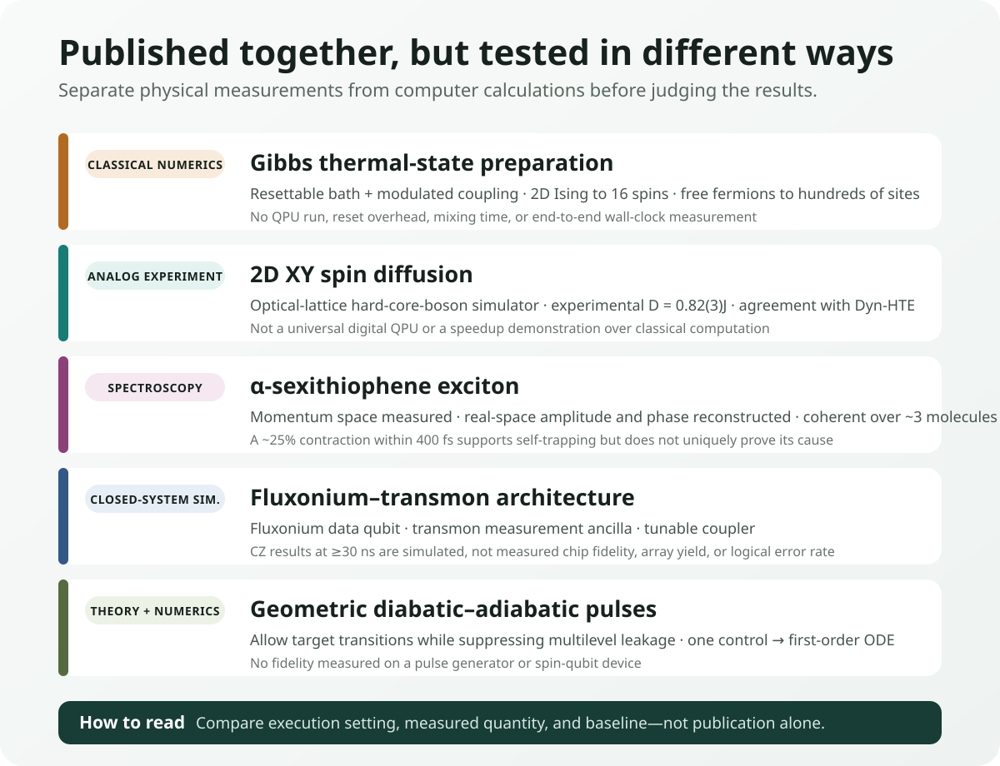
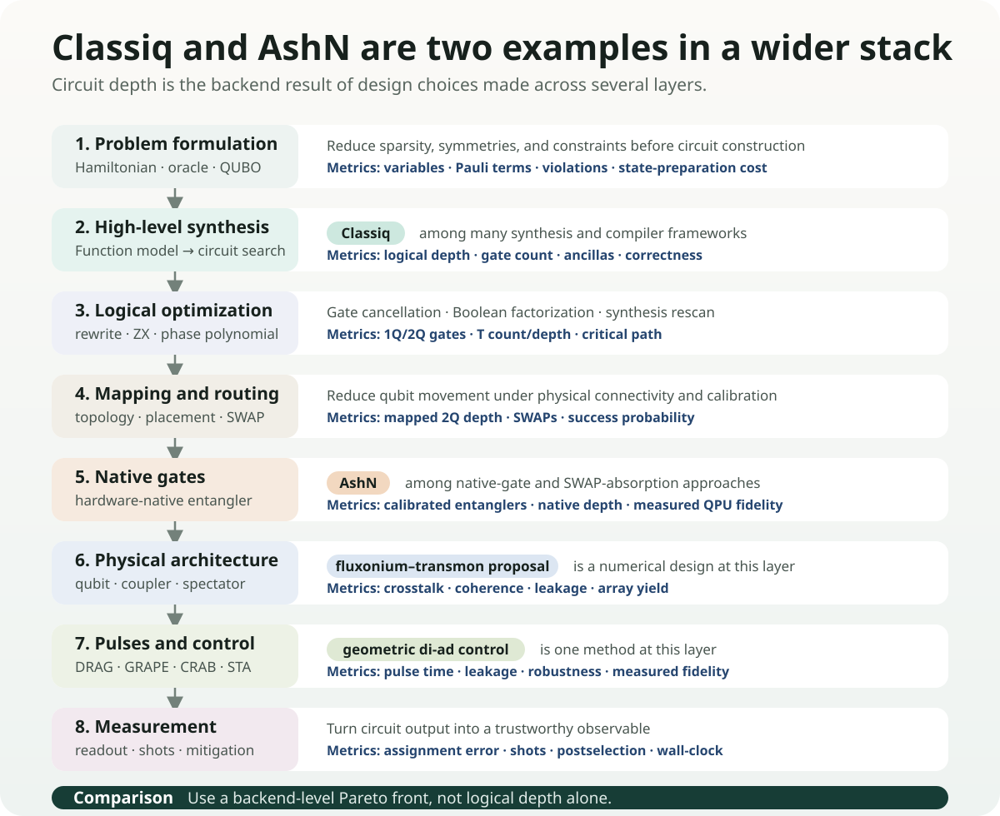

# Preparing Hot Quantum States and Tracking an Exciton

Explanations of quantum computing often begin with the lowest-energy ground state. It is a conceptually natural reference point for electronic structure and material properties. Real materials and devices, however, are not at 0 K, and an organic semiconductor that has absorbed light does not remain in its equilibrium ground state. Heat mixes multiple energy states, while an exciton formed by an electron and a hole spreads across molecules and then changes shape as it interacts with lattice vibrations.

Practical quantum simulation therefore raises two questions. **How can a desired finite-temperature state be prepared on a computing device?** And **which observables can verify that the prepared or simulated state correctly represents the real material?** Studies published on August 28, 2026, address different parts of these questions.

One study proposed an algorithm that produces Gibbs thermal states using a resettable auxiliary bath, while another compared spin diffusion in the two-dimensional XY model between an optical-lattice analog quantum simulator and classical calculations. An organic-semiconductor study tracked excitons in an α-sexithiophene thin film with femtosecond spectroscopy and reconstructed their real-space wave functions. Fluxonium–transmon architecture and geometric pulse control, reported on the same day, address lower layers of computation: device layout and physical control.

The studies address different systems with different methods. This article first separates values measured on physical devices, values calculated on classical computers, and proposals that remain at the design stage. That distinction lets us state concretely which experimental quantities OLED calculations can now match and which costs remain when a quantum circuit is placed on hardware.

<figure class="article-hero-figure">
  
  <figcaption>Figure 1. The left side depicts energy exchange between a thermal reservoir and a quantum lattice; the right side depicts the contraction of an exciton spread across several molecules. This is a conceptual illustration, not a reproduction of a specific experimental device or quantitative data.</figcaption>
</figure>

::: evidence What these studies actually show
The five APS papers published on August 28 present a method for preparing finite-temperature states, an experiment that compares the diffusion coefficient of a 2D XY simulator with a classical calculation, and a spectroscopic method that reconstructs how the size, phase, and shape of an exciton change with time. None of these five papers measures performance on a gate-model QPU; only the 2D XY study uses a physical analog quantum simulator. Their achievements therefore need to be judged through the quantities they actually calculate or measure, such as state-preparation error, diffusion coefficient, and exciton radius.
:::

## What the five studies actually did

| Category | What was actually done | Confirmed figures | What remains unproven |
|---|---|---|---|
| Gibbs-state preparation · PRX | Numerical validation of the 2D quantum Ising model and free fermions on a classical computer | Ising model up to 16 spins; free fermions up to hundreds of sites; weak-coupling error \(O(\theta^2)\) | Actual QPU, reset cost, mixing time, total wall-clock time |
| 2D XY diffusion · PRB | Comparison of an optical-lattice hard-core-boson analog quantum simulator with Dyn-HTE | Experiment: \(D=0.82(3)J\); agreement with theory at \(J/T=0.47^{+0.07}_{-0.09}\) | General-purpose digital QPU; speed or cost advantage over classical computation |
| α-sexithiophene exciton · PRX | Direct measurement in momentum space and model-based reconstruction of real-space amplitude and phase | Coherent delocalization across approximately 3 molecules; radius contraction of approximately 25% within 400 fs | Direct real-space imaging; self-trapping established as the unique cause; OLED device performance |
| Fluxonium–transmon · PR Research | Closed-system numerical simulation of a hybrid-qubit lattice and CZ pulses | At 30 ns, a reduction in infidelity by up to 4 orders of magnitude relative to a single-tone pulse; 50 ns spectator example \(3.8\times10^{-5}\) | Chip fabrication, measured fidelity, array yield, repeated QEC |
| Geometric di-ad control · PR Research | Construction of multilevel pulse design from a geometric metric and a first-order ODE | Double-dot initialization \(>99\%\); numerical fidelity of approximately 99% for state shuttling | Experiments on an actual pulse generator and spin-qubit hardware |

<figure class="figure-panel figure-panel-fit">
  
  <figcaption>Figure 2. All five are peer-reviewed journal articles, but they provide different kinds of evidence. Publication in a journal and execution on an actual device should not be treated as points on the same axis.</figcaption>
</figure>

## 1. Why the ground state is not enough

Given a Hamiltonian \(H\), the ground state is the pure state with the lowest eigenenergy. As temperature rises, the system no longer remains in a single eigenstate. The probability of observing a state with energy \(E_i\) is weighted by the Boltzmann factor \(e^{-\beta E_i}\), and the equilibrium state is expressed by the Gibbs density matrix

$$
\rho_\beta=\frac{e^{-\beta H}}{Z},\qquad Z=\mathrm{Tr}\left(e^{-\beta H}\right)
$$

where \(\beta=1/(k_{\mathrm B}T)\). At higher temperatures, more states are mixed, and near phase transitions and in strongly correlated systems, the cost of classically computing and sampling \(e^{-\beta H}\) can grow rapidly.

One direct route to calculating finite-temperature correlations, transport, magnetic response, or thermal optimization distributions is to prepare this mixed state on a quantum processor. The question is not simply, “Why not heat the qubits?” Uncontrolled exposure to the environment produces a state shaped by device-specific noise and loss, not the Gibbs state of the desired Hamiltonian. The interaction must be designed so that the rates of energy exchange obey detailed balance at the target temperature.

### What a resettable bath does

[The PRX study by Lloyd and Abanin](https://doi.org/10.1103/cbrd-ssnm) repeatedly couples the system under study to a small auxiliary bath for a short time and then resets the bath. A modulated system–bath coupling adjusts the ratio of transitions that absorb or release energy to the target temperature. The result of each cycle is a quantum channel acting on the density matrix, designed so that its fixed point after repeated application approaches the Gibbs state.

As the weak-coupling strength \(\theta\) decreases, the difference between the prepared state and the target Gibbs state falls as \(O(\theta^2)\). The authors numerically validated temperature behavior and the vicinity of the phase transition for up to 16 spins in the 2D quantum Ising model, and analyzed weak-coupling accuracy for free-fermion systems with up to hundreds of sites.

This is **numerical validation of the algorithm on a classical computer**. The authors did not execute bath reset, coupling modulation, or the repeated channel on an actual QPU. Nor did they compare the mixing time needed to reach a target error, the required number of resets, device noise, or total wall-clock time. The description “suitable for near-term processors” expresses the judgment of the authors that the implementation path is relatively simple, not a measured result for efficiency on physical hardware.

### The connection to OLEDs is not immediate

Gibbs states are appropriate for equilibrium finite-temperature problems. Describing pumped electronic systems, nonequilibrium relaxation involving vibrations, and singlet–triplet conversion—such as those in an OLED material immediately after photoexcitation—also requires real-time or open-system dynamics. The ability to prepare a thermal state alone is not enough to calculate exciton contraction over 400 fs. The connection requires an electron–hole Hamiltonian, exciton–phonon coupling, and time-dependent observables as well.

## 2. How can a quantum simulator be trusted?

Instead of executing universal gate circuits, analog quantum simulators tune the physical interactions of atoms, ions, or photons to resemble a target Hamiltonian. They can explore regimes that are classically difficult to calculate in large systems, but precisely for that reason, comparison with a known correct answer is difficult. Validation requires an **overlap regime in which both experiment and classical computation are feasible**.

[The study of 2D XY spin diffusion](https://doi.org/10.1103/whhg-tfv4) implemented the square-lattice spin-1/2 XY model using hard-core bosons in an optical lattice. The experiment measured how a domain wall spread over time, while the theory used a dynamical high-temperature expansion (Dyn-HTE) to calculate the long-time, long-distance hydrodynamic regime.

The experimental spin diffusion constant was \(D=0.82(3)J\). When the independently estimated temperature \(J/T=0.47^{+0.07}_{-0.09}\) was supplied to Dyn-HTE, theory and experiment agreed quantitatively; the infinite-temperature theoretical value is approximately \(0.72J\). The significance is not that “the quantum device was faster than the classical calculation,” but that the two methods yielded the same transport coefficient under overlapping conditions.

This result is not the execution of an algorithm on a universal digital QPU. Nor did the study measure an advantage in total time or energy over classical computation. It instead provides a benchmark for testing whether an analog simulator reproduces quantitative observables of two-dimensional quantum transport. As future work moves to lower temperatures or longer times where classical computation becomes harder, agreement in this overlap regime provides a basis for trusting the extrapolation.

## 3. What exactly does it mean to “see” an exciton?

An exciton is a quasiparticle formed when a photoexcited electron and hole bind through the Coulomb interaction. In an organic semiconductor, it may be localized within a molecule or coherently spread across several molecules. Its spatial extent and phase, as well as self-trapping induced by lattice vibrations, affect energy transfer, light emission, and nonradiative loss.

Conventional optical spectra reveal exciton energy and lifetime, but do not simultaneously and directly provide the spatial distribution and internal phase of the wave function. [The α-sexithiophene study](https://doi.org/10.1103/3zmg-276c) used femtosecond time-resolved photoemission orbital tomography (trPOT). A pump pulse creates the exciton, and a high-harmonic probe records the energy and momentum distribution of photoelectrons over time.

What was **measured directly was the photoelectron distribution in momentum space**. The researchers combined that distribution with an exciton model to reconstruct the real-space amplitude and internal phase structure. They did not image the real-space wave function itself with a microscope.

The reconstructed exciton was coherently delocalized across approximately 3 molecular units, and its phase pattern agreed with ab initio many-body perturbation theory. In the time-resolved measurements, the exciton radius decreased by approximately 25% within 400 fs. This contraction is consistent with self-trapping through exciton–phonon coupling, but a single observation does not uniquely establish it among all possible causes.

### What OLED calculations can now compare with experiment

OLED and organic-semiconductor calculations are commonly compared in terms of \(S_1\), \(T_1\), \(\Delta E_{\mathrm{ST}}\), oscillator strength, and SOC. This study adds the following physical quantities to that comparison.

1. **Spatial extent:** exciton radius and the number of molecules over which it is delocalized
2. **Internal phase:** the sign and phase modulation of the electron–hole amplitude
3. **Temporal evolution:** contraction and localization over hundreds of femtoseconds
4. **Vibrational coupling:** which phonon modes promote self-trapping and nonradiative pathways

GW/BSE, TDDFT, multireference electronic-structure methods, and nonadiabatic dynamics can now be tested on whether they predict these observables under the same thin-film structure and temperature conditions. In model training, using size, a phase proxy, and contraction time together—rather than using exciton energy alone as the label—should make it easier to distinguish candidates with different underlying physics.

## 4. Architecture and pulses are separate optimization layers

Two Physical Review Research papers published on the same day address different layers in the process of translating quantum computation to a physical device.

[The fluxonium–transmon architecture](https://doi.org/10.1103/ts1j-nfg1) alternates fluxonium qubits, which have long coherence and large anharmonicity, as data qubits with fixed-frequency transmons, which have mature readout technology, as measurement ancillas. The two qubit types are connected by tunable transmon couplers. Alternating distinct spectra is intended to reduce level crowding and engineer idle ZZ crosstalk to be near zero.

In Hamiltonian-based closed-system numerical simulations, a two-tone flux pulse reduced the infidelity of a 30 ns CZ gate by up to 4 orders of magnitude relative to a single-tone approach. An optimized 50 ns example with multiple spectators reported a calculated error of \(3.8\times10^{-5}\). These figures are not gate fidelities measured on a physical chip. Fabrication variation, control electronics, decoherence, leakage calibration, array yield, and repeated QEC remain to be tested experimentally.

[Geometric diabatic–adiabatic control](https://doi.org/10.1103/hfv7-3pxt) constructs a metric in a multilevel spectrum that permits desired transitions while suppressing unwanted leakage. Instead of moving slowly enough to avoid every diabatic excitation, it designs a pulse path that distinguishes beneficial from harmful transitions. In particular, when there is one control variable, the optimization reduces to a first-order ordinary differential equation.

Numerical simulations of double-quantum-dot initialization reported fidelity above 99%, while state shuttling reached approximately 99%. These results were not obtained on an actual pulse generator or spin-qubit hardware. The method may require fewer parameters than approaches such as GRAPE, which repeatedly calculate gradients of the full time evolution, but a fair wall-clock comparison must include a noise model, calibration drift, and control bandwidth.

## 5. The landscape extends beyond Classiq and AshN

Quantum-circuit optimization cannot be described as a two-way contest between “Classiq and AshN.” Classiq is **one example of a synthesis framework** that searches for feasible circuit implementations from a high-level functional model. AshN is **a recent example at the native-gate layer** that uses the native two-qubit interaction of superconducting devices to absorb some logical gates and routing SWAPs.

Between and beneath them are distinct optimization families, including Boolean factorization, peephole rewrites, ZX-calculus, phase-polynomial synthesis, qubit placement, routing, calibration-aware compilation, pulse shaping, optimal control, and error-aware scheduling. The geometric di-ad control reported here sits at the **pulse and physical-control layer** of this landscape. The fluxonium–transmon study sits one level above, at the **device-architecture layer**.

### Fewer entangling operations, more measurements

Qubit count is not the only reason quantum optimization runs into current hardware limits. Encoding the requirement “select exactly \(k\) out of \(n\) candidates” as a quadratic QAOA penalty produces \(O(n^2)\) pairwise \(R_{ZZ}\) gates and effectively requires all-to-all connectivity. On a superconducting chip with limited connections, additional SWAP operations are needed to bring distant qubits together. The circuit used to express the constraint can become harder to execute than the optimization task itself.

The [IBM Research Fourier-LCU preprint](https://arxiv.org/abs/2605.18985), highlighted by Jay Gambetta, changes the implementation of the cardinality penalty rather than replacing the whole algorithm. The Fourier expansion itself is an exact identity that expresses this penalty unitary as a weighted sum of \(n+1\) unitaries. In each term, the penalty part is one parallel layer of single-qubit \(R_Z\) gates. The Fourier transform supplies the decomposition coefficients; it is not a quantum Fourier transform circuit.

The exact channel-QPD construction in the paper uses an ancilla and controlled branch operations. The ancilla-free version removes them and runs the branch circuits separately before combining their outputs classically, but it does not reproduce the full output distribution of the coherent circuit. Instead, it guarantees \(\widetilde p_x\ge p_x/\Gamma\) for every bitstring \(x\), so obtaining a particular bitstring may require roughly \(\Gamma\) times as many samples in the worst case. Decomposing several QAOA layers can multiply the \(\Gamma\) factors.

After exact 12-qubit statevector studies, the authors ran an \(n=106\), \(k=35\), depth-\(p=1\) densest-\(k\)-subgraph circuit on 106 physical qubits of the `ibm_boston` system. The objective \(H_1\) and SWAP portion common to every branch used 886 CZ gates and had a two-qubit depth of 25. In each repetition of Experiment 1, the authors evaluated all 107 penalty-LCU branches, for which \(\Gamma=104.1328\), with 32,768 shots per circuit. Because the complete three-experiment series was repeated ten times, Experiment 1 alone used 3,506,176 shots per repetition and 35,061,760 across ten repetitions. These totals are derived from the reported settings and exclude the additional executions used to optimize the single-branch circuits in Experiments 2 and 3.

CPLEX found an optimum of 98 edges. Across ten hardware repetitions, the maximum best-solution values were 60 for the ancilla-free Fourier-LCU aggregation, 80 for a single penalty-basis circuit, and 81 for a single XY-mixer-basis circuit; the corresponding averages were 57.4, 72.3, and 76.8. The latter two came from optimizing one LCU basis circuit as a separate variational ansatz with the nonlinear \(\mathrm{CVaR}_{1/\Gamma}\) objective. The single-branch guarantee in Sec. V assumes a linear sample-based objective, global optimization, and infinitely many shots, so it does not apply to these two CVaR results; the paper treats this use as heuristic. The hardware experiment showed that the all-to-all interactions of the cardinality penalty can be exchanged for simpler branches and more measurements, but the objective-and-SWAP portion of every branch still used 886 CZ gates. It did not demonstrate a better solution than the classical solver or a shorter time to solution, and it remains a non-peer-reviewed preprint.

<figure class="figure-panel figure-panel-fit">
  
  <figcaption>Figure 3. Classiq, AshN, fluxonium–transmon design, and geometric control are examples from different layers. They do not directly replace the same function and may be used together.</figcaption>
</figure>

Each layer also changes a different cost. Problem representation and algorithmic decomposition can exchange entangling gates for branches, shots, and classical aggregation. High-level synthesis changes logical depth and ancilla requirements; routing changes SWAP count and mapped depth; native gates change the number of calibrated entanglers actually used; and pulse control changes gate time, leakage, and robustness. Whether an improved figure at one stage leads to better end-to-end fidelity or wall-clock time must be measured again on the target backend.

At minimum, comparisons of circuit optimization should retain the following Pareto front:

- logical depth and logical 2Q gate count
- 2Q depth after mapping, SWAP count, and ancilla count
- native gates and calibration date, with expected and measured fidelity
- pulse length, leakage, crosstalk, and spectator effects
- LCU branch count, sampling overhead \(\Gamma\), shots, and classical aggregation cost
- readout error and mitigation and postselection success rates
- compile time, queue time, QPU runtime, and classical pre- and postprocessing

The background to this full landscape and the quantitative boundaries of Classiq and AshN are discussed in detail in the [earlier Korean-language review, “Why Quantum Circuit Optimization Is Necessary”](https://infant83.github.io/AI_Tech_Review/reviews/2026-08-27_classiq-ashn-circuit-compression/).

## 6. Record-keeping changes that OLED and materials research can make now

There is no need to force these studies into a single OLED-computation workflow. The quantities that each study actually measured or calculated can instead be added to existing DFT, ML, and quantum-computation records.

| Research stage | Additional records | Decision question |
|---|---|---|
| Electronic structure | Exciton radius, phase proxy, and delocalization length in addition to \(S_1/T_1\) energies | Does the calculation reproduce the spatial structure reconstructed by experimental trPOT under the same thin-film conditions? |
| Dynamics | Wave-function contraction before and after 400 fs, phonon mode, and nonadiabatic population | Does it separately predict the timescale and cause of self-trapping? |
| Finite-temperature quantum simulation | Target \(T\), Gibbs error, bath size, number of resets, and mixing time | Is the cost of state preparation recorded separately from the calculation of observables? |
| Analog simulator | The same observable in an overlap regime that is classically solvable | Was quantitative agreement shown before extrapolating beyond the validation regime? |
| Circuit and hardware | Compiled 2Q depth, native gates, LCU branches and \(\Gamma\), pulses, spectators, shots, and wall-clock time | Were the improvements from Classiq, AshN, Fourier-LCU, and pulse control reduced to the same end-to-end metric? |

DFT, GW/BSE, and TDDFT remain strong classical baselines for ground-state and excited-state electronic structure. Rather than assuming that quantum computation will replace them wholesale, it should be deployed selectively at remaining bottlenecks such as strongly correlated active spaces, finite-temperature correlated states, real-time many-body dynamics, or sampling. The resulting calculations should then be compared not only through energy errors, but also against experimental observables such as exciton size, phase, and temporal evolution.

## Final assessment

The Gibbs-state-preparation study recast state preparation for finite-temperature quantum simulation as a simpler reset-and-couple protocol. The current evidence is classical and numerical; the reset, mixing, and noise costs required on actual devices remain unresolved. The 2D XY study provided quantitative validation that the diffusion coefficient measured on an actual analog quantum simulator agrees with classical Dyn-HTE in an overlapping regime. This is not quantum acceleration; it is a result that increases confidence in the simulator.

The α-sexithiophene study expanded the observables that OLED calculations must match from energy and lifetime to the spatial extent, internal phase, and contraction of the wave function over 400 fs. The boundary between the direct momentum-space measurement and the model-based reconstruction of the real-space wave function must be maintained.

The fluxonium–transmon and geometric-control studies show that circuit optimization does not end at high-level synthesis or native gates. Classiq and AshN are representative examples within the full stack, and optimization across architecture, pulses, and measurement must ultimately be combined and evaluated through actual fidelity and wall-clock time on the target backend.

Fourier-LCU moves cost near the top of this stack, at problem representation and algorithmic decomposition. This study split an all-to-all penalty into simpler branches and ran them on 106 physical qubits of `ibm_boston`. The reported experimental setup used millions of shots and classical aggregation. Any comparison must therefore include branch count, \(\Gamma\), total shots, and time to solution rather than stopping at circuit depth.

## Sources

1. J. Lloyd and D. A. Abanin, [*Quantum Thermal State Preparation for Near-Term Quantum Processors*](https://doi.org/10.1103/cbrd-ssnm), Physical Review X 16, 031053, 28 August 2026; [author preprint](https://arxiv.org/abs/2506.21318).
2. M. Theilen et al., [*Observing the Spatial and Temporal Evolution of Exciton Wave Functions in Organic Semiconductors*](https://doi.org/10.1103/3zmg-276c), Physical Review X 16, 031054, 28 August 2026.
3. E. Fitzner et al., [*Finite-temperature spin diffusion in the two-dimensional XY model*](https://doi.org/10.1103/whhg-tfv4), Physical Review B 114, 094303, 28 August 2026; [author preprint](https://arxiv.org/abs/2605.20124).
4. L. Heunisch et al., [*Scalable fluxonium-transmon architecture for error-corrected quantum processors*](https://doi.org/10.1103/ts1j-nfg1), Physical Review Research 8, 033245, 28 August 2026; [author preprint](https://arxiv.org/abs/2508.09267).
5. C. Ventura-Meinersen et al., [*Multilevel spectral navigation with geometric diabatic-adiabatic control*](https://doi.org/10.1103/hfv7-3pxt), Physical Review Research 8, L032034, 28 August 2026; [author preprint](https://arxiv.org/abs/2602.14756).
6. A. Carrera Vazquez, D. J. Egger, and S. Woerner, [*Efficient Fourier-Based Linear Combination of Unitaries and Applications in Quantum Optimization*](https://arxiv.org/abs/2605.18985), arXiv:2605.18985v1, submitted 18 May 2026; 12-qubit statevector simulations and an experiment using 106 qubits of `ibm_boston`. Discovery context: [LinkedIn post by Jay Gambetta](https://www.linkedin.com/posts/jay-gambetta-a274753a_quantum-optimization-is-ultimately-about-activity-7490780037571411969-F5za), 5 August 2026.

[Download the four-page Korean-language Daily Quantum Brief covering the five core APS papers](../artifacts/daily_quantum_brief_2026-08-31.pdf)

*Source-check note: The publication dates, execution settings, quantitative figures, and unproven boundaries of the five core items were checked against the APS articles and author preprints. The added Fourier-LCU result is identified as a non-peer-reviewed preprint, and its physical-QPU execution using 106 qubits is kept separate from any claim of quantum advantage. The evidence cutoff is August 31, 2026.*
