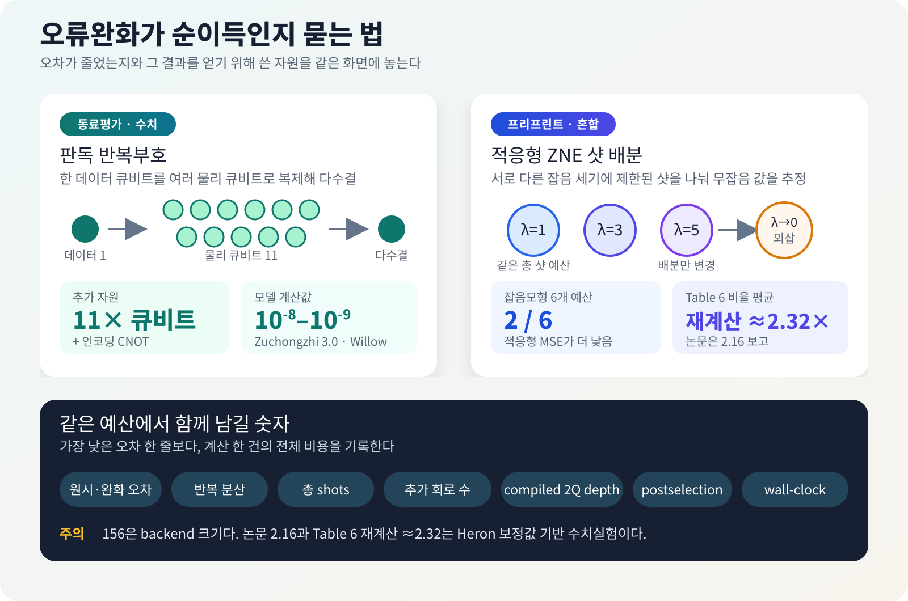

# 오류완화는 언제 순이득을 내는가

양자컴퓨터에서 오차가 줄었다는 말은 얼핏 충분해 보인다. 그러나 그 수치를 얻기 위해 큐비트를 열한 배 쓰고, 회로를 세 가지 잡음 세기에서 반복하고, 측정 샷을 몇 배 더 소모했다면 계산 전체가 좋아졌는지는 아직 알 수 없다. 같은 장비와 같은 시간으로 더 유용한 답을 얻었는지까지 봐야 한다.

이 문제가 가까운 시일 안에 사라지지는 않는다. 완전한 오류정정이 없는 현재 장치에서는 게이트 오류, 판독 오류, decoherence가 계산 결과를 바꾼다. 오류완화는 물리 오류를 계속 검출하고 고치는 논리 큐비트를 만들기보다, 회로를 여러 번 실행하거나 측정값을 후처리해 기대값과 표본의 오차를 줄인다. 구현 문턱은 낮지만 그만큼 샷, 회로 수, 분산 또는 보조 큐비트로 비용을 치른다.

2026년 8월 말 공개된 두 연구는 이 비용을 서로 다른 곳에서 드러냈다. 한 동료평가 논문은 데이터 큐비트마다 최대 10개의 보조 큐비트를 더 붙이고 다수결로 판독해 측정 오류를 크게 낮출 수 있는지 계산했다. 다른 프리프린트는 IBM Heron 장치에서 작은 회로를 실행하고, 장치 보정값으로 만든 잡음모형에서 제한된 샷을 ZNE에 어떻게 나눌지 비교했다.

두 논문은 같은 오류를 다루지도, 서로 경쟁하지도 않는다. 함께 읽을 이유는 분명하다. 정확도 숫자 옆에 추가 큐비트, CNOT, 회로 반복, 샷과 전체 실행시간을 적지 않으면 개선의 대가가 사라진다.

<figure class="article-hero-figure">
  
  <figcaption>그림 1. 오류완화의 판단 대상은 오차 하나가 아니라 오차와 자원비용의 묶음이다. 이 그림은 특정 장치나 정량 결과를 재현하지 않은 편집용 개념 이미지다.</figcaption>
</figure>

::: evidence 원문에서 먼저 바로잡은 부분
IBM 연구는 156큐비트 <em>backend</em>를 사용했지만 보고된 회로가 156큐비트였던 것은 아니다. 실제 장치에서는 선택한 8큐비트 chain과 2·4·6큐비트 GHZ 등 작은 회로를 실행했다. “6개 샷 예산 중 2개에서만 개선됐다”는 결과는 실제 QPU의 여섯 예산 실험이 아니라, Heron 보정값을 반영한 잡음모형 수치실험에서 나왔다. 논문은 평균 적응형/균등 MSE 비율을 2.16으로 적었지만 Table 6의 여섯 비율을 평균하면 약 2.32다. 이 글은 초록의 뭉뚱그린 표현보다 논문 §5.5와 Table 6의 방법 표기를 따르되, 이 산술 불일치도 함께 밝힌다.
:::

## 먼저, 두 연구가 실제로 한 일을 나눠 보자

| 항목 | 판독 반복부호 | IBM Heron·적응형 ZNE |
|---|---|---|
| 연구 상태 | npj Unconventional Computing 동료평가 논문 | arXiv v1 프리프린트 |
| 줄이려는 문제 | 마지막 측정에서 0과 1을 잘못 읽는 판독 오류 | 여러 잡음 세기에서 얻은 기대값을 외삽할 때의 편향·분산 |
| 실제로 사용한 방법 | 독립 오류 해석모형과 공개 장치 오류율을 넣은 고전 수치계산 | 이상·잡음 수치계산과 ibm_marrakesh의 작은 회로 실행 |
| 추가 비용 | 데이터 큐비트당 최대 10개 보조 큐비트와 인코딩 CNOT | 여러 noise factor의 회로, pilot shots, 분산이 커질 수 있는 외삽 |
| 대표 결과 | 저오류 장치 profile 두 개에서 \(k=9,11\)일 때 \(10^{-8}\)–\(10^{-9}\) 판독 오류 예측 | 잡음모형의 6개 예산 중 2개에서만 적응형 MSE가 낮음; Table 6 비율 평균은 약 2.32(논문은 2.16 보고) |
| 아직 입증하지 않은 것 | 실제 QPU, 상관 판독 오류, routing, 총 shots와 wall-clock | 156큐비트 회로, 여섯 예산의 실제 QPU 비교, ZNE 일반의 우열 |

## 1. 판독 오류가 샘플 전체를 망치는 이유

기대값 하나를 추정할 때는 많은 샷을 평균내므로 일부 비트가 잘못 읽혀도 통계적으로 보정할 여지가 있다. 반면 random-circuit sampling이나 measurement-based quantum computing처럼 **비트열 자체가 답**인 작업은 모든 비트가 맞아야 온전한 표본 하나를 얻는다. 큐비트마다 판독 오류율이 \(e_m\)이고 오류가 독립이라면 \(n\)비트 표본이 모두 맞을 확률은 대략 \((1-e_m)^n\)으로 줄어든다.

[He-Liang Huang의 논문](https://www.nature.com/articles/s44335-026-00094-0)은 고전 통신에서 익숙한 반복부호를 판독 직전에 붙인다. 각 데이터 큐비트의 값을 홀수 \(k\)개의 물리 큐비트에 CNOT으로 복제하고, 전부 측정한 뒤 과반수 값을 답으로 고른다. 한두 개의 판독이 뒤집혀도 다수결이 원래 값을 되살리는 방식이다.

인코딩 게이트가 이상적이고 판독 오류가 독립이면 남는 오류의 주된 항은 \(e_m^{\lceil k/2\rceil}\)로 내려간다. 실제 CNOT도 오류를 만들기 때문에 논문은 2큐비트 depolarizing error \(e_g\)를 포함한 유효 오류율을 계산했다. 이때 필요한 자원은 명확하다. \(k=11\)이면 데이터 큐비트 하나를 읽기 위해 물리 큐비트 11개, 즉 보조 큐비트 10개와 추가 CNOT을 쓴다.

### \(10^{-9}\)는 측정값이 아니다

논문이 사용한 Zuchongzhi 3.0 profile에서는 \(k=9\)일 때 \(4.11\times10^{-8}\), \(k=11\)일 때 \(1.91\times10^{-9}\)의 유효 판독 오류를 계산했다. Willow profile에서는 각각 \(3.65\times10^{-8}\), \(1.66\times10^{-9}\)였다. 이 수치는 장치에서 반복부호 회로를 실행해 측정한 값이 아니다. 기존에 보고된 readout·2Q gate 오류율을 독립 잡음모형에 넣은 예측이다.

같은 식을 다른 profile에 넣으면 결과도 달라진다. Zuchongzhi 2.0과 Sycamore는 \(k=11\)에서도 각각 \(8.61\times10^{-6}\), \(3.64\times10^{-6}\)로 계산됐다. “약 열 배의 큐비트로 항상 \(10^{-9}\)”라고 일반화할 수 없는 이유다.

이 방법이 고치는 범위도 마지막 판독 단계다. 앞선 회로에서 생긴 gate error와 decoherence를 되돌리는 범용 오류정정 실증이 아니다. 실제 배선에서 추가 CNOT이 얼마나 길어지는지, 상관 판독 오류와 crosstalk이 다수결을 어떻게 무너뜨리는지, 필요한 shots와 wall-clock이 얼마인지는 실제 칩에서 남은 질문이다.

## 2. ZNE는 편향을 줄이면서 분산을 키울 수 있다

Zero-noise extrapolation(ZNE)은 같은 회로를 원래 잡음 세기 \(\lambda=1\)뿐 아니라 인위적으로 키운 \(\lambda=3,5\)에서도 실행한 뒤, 측정값의 추세를 \(\lambda\to0\)으로 외삽한다. 잡음이 커질수록 관측량이 어떻게 변하는지 알면 잡음이 없을 때의 값을 역으로 추정할 수 있다는 생각이다.

문제는 외삽이 여러 noisy estimate를 큰 계수로 더하고 뺀다는 데 있다. 체계적 편향은 줄어들 수 있지만 표본 분산은 커질 수 있다. 총 샷 예산 \(B\)가 정해져 있으면 한 지점에 샷을 더 주는 만큼 다른 지점의 샷이 줄어든다. 따라서 이 논문은 절대오차 하나 대신

$$
\mathrm{MSE}=\mathrm{Bias}^2+\mathrm{Variance}
$$

를 비교한다.

[Sumit Chongder의 프리프린트](https://arxiv.org/abs/2608.28535)는 \(\lambda=1,3,5\)에 샷을 똑같이 나누는 방식과, 각 지점에서 100-shot pilot으로 분산을 추정한 뒤 Neyman allocation으로 남은 샷을 배분하는 ASB-ZNE를 비교했다. 분산이 큰 지점에 더 많은 샷을 주면 같은 총량으로 외삽 분산을 낮출 수 있다는 발상이다.

그러나 variance를 잘 배분해도 extrapolation bias가 지배하면 MSE는 좋아지지 않는다. Heron 보정값 기반 잡음모형에서 적응형/균등 MSE 비율은 다음과 같았다.

| 총 샷 예산 \(B\) | 900 | 1,500 | 3,000 | 6,000 | 12,000 | 21,000 |
|---|---:|---:|---:|---:|---:|---:|
| 적응형 / 균등 MSE | 5.96 | 0.998 | 1.47 | 0.988 | 2.08 | 2.43 |

1보다 작은 두 경우도 개선 폭은 약 0.2%와 1.2%였다. 논문은 여섯 예산의 평균 MSE 비율을 2.16으로 적었지만, Table 6에 실린 비율을 단순 평균하면 약 2.32다. 2.16은 표의 적응형 MSE 평균인 \(2.16\times10^{-3}\)과 일치해, 본문 수치에는 계산 또는 표기 오류가 있는 것으로 보인다. 어느 계산을 따르더라도 적응형 배분이 여섯 조건 중 네 조건에서 더 나빴다는 결론은 바뀌지 않는다. 이는 **적응형 ZNE와 균등 ZNE의 비교**이며, 오류완화 전체와 raw measurement의 비교가 아니다.

### 실제 Heron 실행에서 확인한 것은 따로 있다

ibm_marrakesh는 156큐비트 Heron-family processor지만 연구진은 calibration snapshot으로 저오류 8큐비트 chain을 골랐다. 하드웨어 회로에는 2·4·6큐비트 GHZ, 최대 \(L=8\)인 repeated-layer circuit과 4-node \(p=1\) QAOA가 포함됐다. 전체 QPU allowance는 약 10분이었다.

실제 장치에서 가장 분명한 수치는 배치의 영향이다. 저오류 coupler \(\{33,39\}\)에서 측정한 \(ZZ\)는 0.909였고, 일부러 고른 고오류 coupler \(\{119,133\}\)에서는 0.751이었다. 같은 calibration snapshot에서도 어느 연결을 쓰느냐가 관측량을 약 0.16 바꿨다. 사후 완화법을 고르기 전에 qubit·coupler 배치를 바꾸는 일이 더 값쌀 수 있음을 보여주는 장치 측정이다.

논문의 초록과 결론은 2-of-6 결과를 “on our device”라는 표현 안에 묶는다. 그러나 본문 §5.5는 이 비교를 “simulation with a hardware-anchored noise model”이라고 명시한다. 재현과 후속 비교에는 후자의 방법 표기가 기준이 되어야 한다. 아직 동료평가 전 단일 저자 프리프린트라는 점도 함께 남겨야 한다.

<figure class="figure-panel figure-panel-fit">
  
  <figcaption>그림 2. 첫 연구는 큐비트와 CNOT을, 둘째 연구는 여러 회로와 샷을 더 쓴다. \(10^{-8}\)–\(10^{-9}\), 2-of-6와 Table 6 재계산값 약 2.32×는 모두 수치계산에서 나왔다. 논문 본문은 마지막 평균을 2.16으로 보고한다.</figcaption>
</figure>

## 3. 오류완화의 성적표에는 무엇을 적어야 하나

“완화 후 오차가 30% 감소했다”만으로는 방법을 선택할 수 없다. 세 배 많은 회로와 열 배 많은 샷을 쓴 결과라면, 같은 계산 시간을 raw 방식에 배분했을 때와 비교해야 한다. VQE, SQD와 최적화 회로의 실험 기록에는 다음 항목이 한 묶음으로 남아야 한다.

| 기록 항목 | 왜 필요한가 |
|---|---|
| raw·mitigated 오차 | 완화가 바꾼 절대오차와 방향을 직접 비교한다 |
| 반복 실행 분산·신뢰구간 | 한 번 잘 나온 결과와 안정적인 개선을 구분한다 |
| 총 shots | 통계오차 감소에 쓴 가장 직접적인 비용이다 |
| 추가 회로 수·noise factors | ZNE·PEC·twirling이 만든 실행 수를 드러낸다 |
| compiled 2Q depth·SWAP | 논리회로가 실제 backend에서 부담한 오류원을 기록한다 |
| postselection·폐기율 | 남은 표본의 정확도와 버린 표본의 비용을 함께 본다 |
| compile·queue·QPU·후처리 wall-clock | 연구자가 기다린 전체 시간을 비교한다 |

가장 공정한 질문은 “완화했을 때 더 정확했는가”보다 구체적이다. **같은 총예산으로 목표 오차에 더 빨리 도달했는가, 아니면 같은 시간에 더 작은 MSE를 얻었는가?** 문제, 관측량, backend와 calibration이 바뀌면 답도 다시 측정해야 한다.

## 4. 같은 날 나온 네 연구는 각각 다른 문제를 풀었다

오늘 브리핑의 나머지 네 논문을 오류완화 이야기 속에 억지로 넣을 필요는 없다. 광자회로는 실제 광학소자의 수와 성공확률을, 에너지망 논문은 QUBO 표현과 고전 기준선을, M-Diffushadow는 누락된 양자 측정 기록을, cavity 연구는 층상 재료의 구조 변화를 다룬다.

### 광자회로는 게이트를 이어 붙일수록 성공확률이 줄어든다

선형광학 양자회로의 2큐비트 게이트는 postselection에 의존하는 경우가 많다. 완성된 논리회로를 CNOT 같은 부품으로 하나씩 치환하면 광학소자와 ancilla가 늘고, 각 단계의 성공확률이 곱해져 전체 성공률이 빠르게 낮아진다.

[Javier Osca와 Jiri Vala의 APS Open Science 논문](https://doi.org/10.1103/xjrz-csmx)은 7개 층, 층마다 3개의 beam splitter가 있는 넓은 optical ansatz에서 시작했다. 파라미터를 최적화한 뒤 없어도 되는 beam splitter와 phase shifter를 반복해 잘라냈다. SOQCS 수치설계에서 근사 CNOT은 beam splitter 6개, 최대 출력오차 0.6%, 성공확률 5.7%였다. 저자들이 “numerically exact”라고 부른 CNOT은 beam splitter 7개와 7.4% 성공확률을 보였다.

Grover 2큐비트 회로를 한 번에 설계한 결과는 beam splitter 8개와 성공확률 7.4%였다. 게이트별 단순 치환은 소자 18개이며 성공확률이 \((2/27)^2\)로 줄어든다. 물리 회로 전체를 함께 최적화하는 이유가 이 숫자에 있다.

다만 실제 광자칩을 제작하거나 photon loss, detector efficiency와 공정 편차를 측정한 연구는 아니다. Classiq 같은 고수준 합성이나 AshN 같은 초전도 native gate의 직접 경쟁자도 아니다. 이 논문이 결정하는 것은 광자 플랫폼의 beam splitter, phase shifter와 ancilla 배치다.

### Energy Internet을 QUBO로 바꿔도 양자 실행이 되는 것은 아니다

[Energy Internet routing 프리프린트](https://arxiv.org/abs/2608.28401)는 에너지 router와 송전손실을 binary variable로 바꾸고 QUBO·Ising Hamiltonian을 구성했다. 9-node 사례에서 모든 방법은 1–3–7–8–9 경로와 74.687 W 손실을 찾았다.

해의 일치보다 runtime 차이가 더 분명하다. Dijkstra는 0.00002524 s, Qiskit Sampler+COBYLA는 539 s, D-Wave simulated annealing은 0.02229 s였다. 30-node 사례는 binary variable 112개가 필요했고 Dijkstra는 0.00005223 s, simulated annealing은 1.391 s였다. QAOA와 Ocean exact solver는 이 크기에서 실행하지 못했다.

모든 계산은 고전 하드웨어에서 수행됐다. Qiskit Sampler와 NumPyEigenSolver는 실제 gate-model QPU 실행이 아니며, D-Wave Tabu와 simulated annealing도 quantum annealer가 아닌 고전 sampler다. 확인된 성과는 QUBO 표현이 두 작은 사례에서 정답 경로를 만들었다는 것까지다. 양자 가속이나 실제 전력망 규모의 성능은 입증하지 않았다.

### M-Diffushadow는 양자데이터의 빈칸을 고전 AI로 메운다

한 양자상태를 X·Y·Z 같은 서로 다른 basis로 측정하면 각 기록은 상태의 다른 부분을 담는다. 실험에서 일부 basis가 빠지거나 측정 기록이 손실됐을 때, 서로 연결된 분포를 학습한 생성모델이 빈 부분을 복원할 수 있는지가 [M-Diffushadow 논문](https://doi.org/10.1103/4tft-d7gf)의 질문이다.

연구진은 10큐비트 주기 경계 transverse-field Ising model의 classical-shadow 기록과 nearest-neighbor spin-product 기록을 함께 학습했다. 8개 \(g\) 지점으로 학습하고 41개 지점에서 평가했다. 두 modality를 함께 생성했을 때 \(\langle Z_iZ_{i+1}\rangle\)의 평균 절대 차이는 \(2.92\times10^{-3}\) 미만이었다. 강자성 영역에서 기록의 80%를 가렸을 때 spin-product 복원 평균 정확도는 98.78%였고, 가장 낮은 두 지점은 90%였다.

이것은 고전 Transformer·discrete diffusion model이 수치로 만든 양자 다체 데이터를 다루는 AI-for-quantum 연구다. QPU가 학습하거나 추론한 QML이 아니며 실제 장치 잡음도 포함하지 않았다. 80% masking 결과는 모든 측정축을 Z로 둔 강자성 영역이라는 비교적 유리한 조건이다. 공식 저장소 역시 완전한 재현 package가 아직 아니라고 밝힌다.

### Cavity가 층간 결합을 바꿀 수 있다는 ab initio 예측

빛을 외부에서 주입하지 않아도 optical cavity에는 vacuum fluctuation이 남는다. 이 전자기장과 물질의 결합이 장거리 van der Waals interaction을 바꾸면 층상 재료의 거리와 진동도 달라질 수 있다. 분자에 쓰던 photon many-body dispersion을 주기적 고체로 확장한 것이 [pMBD–QEDFT 프리프린트](https://arxiv.org/abs/2608.28521)다.

연구진은 2 eV의 면밖 편광 단일 cavity mode를 두고 bilayer hBN과 graphene을 계산했다. 결합세기 \(\lambda=0.1\) a.u.에서 층간거리는 약 0.15 Å 늘고 layer-breathing frequency는 18% 낮아졌다. \(\lambda=0.2\) a.u.에서는 거리 증가가 최대 약 0.8 Å였다. hBN은 계산상 \(\lambda=0.14\) a.u. 부근에서 선호 stacking이 AB에서 AA′로 바뀌었고, graphene은 같은 범위에서 바뀌지 않았다.

절대 stacking 예측은 조심해서 읽어야 한다. Cavity가 없는 hBN 계산부터 AB를 가장 안정하다고 냈지만 실험에서 알려진 선호 구조는 AA′다. 두 구조의 계산 에너지 차이가 0.5 meV/atom 미만이라 DFT 정확도 한계 안에 있다는 것이 저자들의 설명이다. 따라서 이 연구의 정보는 “정확한 stacking을 뒤집었다”보다 **stacking마다 cavity에 대한 상대 반응이 다르다**는 데 있다.

이 결과는 양자컴퓨터가 아니라 고전 ab initio 계산이며, 실제 cavity 실험도 아니다. 단일 mode, long-wavelength와 \(\Gamma\)-point coupling 근사를 사용했다. 논문이 직접 다룬 재료는 hBN·graphene이다. OLED와의 연결은 cavity 환경을 유기광전자 재료 계산에도 넣어볼 수 있다는 이 리뷰의 확장 해석이지, 논문이 OLED 소자 성능을 입증했다는 뜻이 아니다.

## 5. 연구와 PoC에서 바로 바꿀 판단 방식

오류완화 PoC의 목표는 “mitigation을 적용했다”가 아니라, 정해진 장치 사용량 안에서 더 신뢰할 수 있는 답을 얻는 것이다. 실험 전에는 raw 기준선과 목표 MSE, 최대 shots와 wall-clock을 고정한다. 실험 후에는 성공한 configuration만 남기지 말고, 도움을 주지 못한 depth·observable·calibration도 함께 기록한다.

OLED·재료 VQE나 SQD에서는 energy error만 보지 않는다. 반복 간 분산, postselection 이후 유효 표본 수, compiled 2Q depth와 전체 시간을 같이 저장해야 고전 solver·다른 ansatz·다른 backend와 비교할 수 있다. 한 calibration에서 좋아진 방법은 다음 calibration에서 자동으로 유지되지 않는다.

에너지망 사례도 같은 실무 습관을 요구한다. QUBO로 표현할 수 있다는 사실과 그 solver가 더 빠르다는 판단을 분리하고, Dijkstra·MILP·CP-SAT·metaheuristic을 동일 문제와 종료조건에서 먼저 고정한다. M-Diffushadow와 cavity pMBD–QEDFT에는 각각 실제 장치 데이터와 실험 구조가 다음 기준선이 된다.

## 최종 평가

반복부호 논문은 판독 오류를 줄이는 대가를 큐비트와 CNOT으로 명시했다. 저오류 장치 profile 두 개에서 \(10^{-8}\)–\(10^{-9}\)를 예측했지만 아직 실제 칩 결과는 아니다. IBM Heron 프리프린트는 작은 실제 회로에서 coupler 선택의 영향을 측정했고, 별도의 장치 보정값 기반 수치실험에서는 단순한 적응형 ZNE 샷 배분이 균등 배분을 꾸준히 이기지 못했다.

오류완화가 쓸모없다는 결론은 아니다. 반대로 정확도만 좋아지면 성공이라는 결론도 아니다. 어떤 오류를 줄였고, 그 결과를 얻기 위해 큐비트·게이트·회로·샷·시간을 얼마나 더 썼는지를 같은 조건에서 비교해야 한다. 가장 작은 오차보다 **같은 총예산에서 더 좋은 계산**이 실용성에 가까운 기준이다.

## 근거 자료

1. H.-L. Huang, [*Exponential measurement error mitigation in quantum sampling*](https://www.nature.com/articles/s44335-026-00094-0), npj Unconventional Computing 3, Article 47, published 31 August 2026.
2. S. Chongder, [*Hardware-Efficient Error Mitigation and Shot-Efficient Sampling on IBM Quantum Hardware*](https://arxiv.org/abs/2608.28535), arXiv:2608.28535v1, submitted 28 August 2026. The PDF title differs from the arXiv metadata title.
3. J. Osca and J. Vala, [*Automated design of photonic two-qubit quantum gates and circuits via optimization and pruning*](https://doi.org/10.1103/xjrz-csmx), APS Open Sci. 1, 000115, published 31 August 2026.
4. A. A. Tehrani, M. Boroushaki, and A. Rajabi, [*Energy Internet Routing using Quantum Optimization Algorithms*](https://arxiv.org/abs/2608.28401), arXiv:2608.28401v1, submitted 28 August 2026.
5. Y. Li and H.-K. Tang, [*Multimodal discrete diffusion for quantum measurement generation in the one-dimensional transverse-field Ising model*](https://doi.org/10.1103/4tft-d7gf), APS Open Sci. 1, 000116, published 31 August 2026.
6. M. Hassan, C. Tasci, L. A. Cunha, and J. Flick, [*Modifying van der Waals Materials via Cavity Vacuum Fluctuations*](https://arxiv.org/abs/2608.28521), arXiv:2608.28521v1, submitted 28 August 2026.

[원문 경계를 바로잡은 5쪽 Daily Quantum Brief PDF 내려받기](daily_quantum_brief_2026-09-01.pdf)

*확인 메모: DOI·게재 상태·장치·회로 규모·수치와 계산 위치를 원문에서 대조했다. 새 D-Wave·Classiq 뉴스레터, 원문으로 역추적 가능한 신규 공개 LinkedIn 기술 신호와 주요 AI 학회의 신규 공식 QML 본논문은 근거 기준일까지 확인되지 않았다. 공개 검색은 비공개 피드와 모든 색인을 완전히 포괄하지 않는다.*
