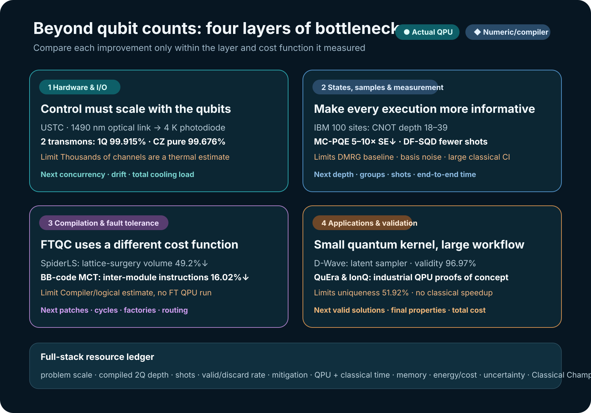

# Beyond Qubit Counts: Quantum Computing Is Becoming a Systems Race

Reading progress in quantum computing only through qubit counts or a single fidelity figure misses half of the competition now under way. More qubits do not make a system scalable if the wiring that carries control signals from room temperature to cryogenic stages cannot keep up. A high-quality state does not make a computation useful if measurement shots and classical post-processing explode. And mapping an application onto a quantum circuit does not constitute an industrial result if valid answers are vanishingly rare or a stronger classical method still wins.

The studies reviewed on 2 and 3 September 2026 therefore form a coherent picture. The field is shifting its focus from **more qubits** to **system designs that jointly reduce control lines, state-preparation cost, samples, measurements, compilation overhead, and classical post-processing**. Starting with a D-Wave molecular-generation study and an optical-control study of superconducting transmons found through LinkedIn, this article evaluates IBM’s 100-site quantum-state experiment and sampling-based quantum diagonalization, neutral-atom and trapped-ion optimization, and fault-tolerant compilation against the same evidentiary standard.

<figure class="article-hero-figure">

<figcaption>Figure 1. The bottleneck in quantum computing does not reside on a single chip. The entire path—from control hardware through circuits and measurement to classical post-processing and application validation—determines whether a computation has value. This editorial concept image does not reproduce a specific device or quantitative result.</figcaption>
</figure>

Two corrections to make first

The study that controlled transmons over optical fiber was not conducted by IBM. It is a preprint from Pan Jianwei’s team at the University of Science and Technology of China (USTC). IBM appears in two separate key studies: the 100-site spin-chain experiment and the DF-SQD experiment. Nor is D-Wave’s 96.97% a drug-efficacy or drug-development success rate. It is the fraction of generated SMILES strings that RDKit could interpret as molecular graphs. This article uses the LinkedIn posts only as discovery routes; institutions, numbers, and methods are taken from the original papers.

## Conclusions up front

1.  **Input and output are becoming the next bottleneck in hardware scaling.** The USTC study carried room-temperature control signals over 1490 nm fiber to the 4 K stage and used them to control two physical transmons. Wiring and readout below 4 K remained unchanged, however, and the thousands-of-channels figure was an estimate based on cooling capacity, not a demonstrated scale.
2.  **Obtaining better samples is becoming an algorithmic task in its own right.** D-Wave served as a discrete latent-variable sampler for a molecular generative model, while an IBM QPU proposed determinants for selected CI. In both cases, the quantum device was a constrained sampling kernel rather than the whole computer.
3.  **State-preparation and measurement costs matter as much as qubit counts.** The 100-site state ran on physical IBM hardware because its CNOT depth was only 18–39. Instead of adding more circuits, MC-PQE grouped Pauli terms and allocated shots to reduce standard error by a factor of 5–10 at the same number of measurements.
4.  **Compilation results must be interpreted within the layer they optimize.** SpiderLS’s 49.2% refers to a reduction in surface-code lattice-surgery spacetime volume; the 16.02% in the BB-code study refers to fewer inter-module instructions. Neither means that present-day NISQ circuit depth falls by the same percentage.
5.  **Applications still center on hybrid proofs of concept.** The QuEra and IonQ experiments reached physical QPUs, but neither demonstrated an end-to-end runtime advantage over strong classical solvers. Their principal achievement was building a path through problem decomposition, recovery of feasible solutions, and hardware execution.

## 1. What changes when optical fiber replaces transmon control lines?

Superconducting qubits operate at tens of millikelvin, while their control electronics typically remain at room temperature. Sending a coaxial line, attenuators, and filters down to each qubit increases heat inflow, consumes refrigerator space, and adds cable-assembly and calibration work. Even if the qubits themselves improve, this wiring can prevent the system from scaling.

[A preprint by Yu-Huai Li, Daojin Fan, and colleagues](https://arxiv.org/abs/2608.19602) directly modulated a 1490 nm distributed-feedback laser with GHz-band XY signals and square-wave Z signals from a room-temperature arbitrary waveform generator. The optical signal traveled along fiber to the 4 K stage, where a reverse-biased InGaAs PIN photodiode converted it back into an electrical signal. The researchers used this architecture to control two tunable transmons and a tunable coupler.

This was not a quantum transducer that converts between photonic and microwave qubits. It was an **analog radio-over-fiber link carrying classical control waveforms**. The photodiode also sat at 4 K, not at the millikelvin stage. Electrical wiring from 4 K to the chip and the existing readout lines remained in place.

### Results from the physical two-qubit device

| Item                |           Reported value | Interpretive boundary                            |
|---------------------|-------------------------:|--------------------------------------------------|
| $T_1$             | $58.58\pm3.39\ \mu s$ | Measured on the two-qubit device                 |
| $T_2^*$          |  $2.40\pm0.23\ \mu s$ | Operating point 409 MHz away from the sweet spot |
| 1Q $X/2$ gate     |                    50 ns | Optical-link control waveform                    |
| Q1 1Q fidelity      |     $99.915\pm0.005\%$ | Randomized benchmarking                          |
| Q2 1Q fidelity      |     $99.854\pm0.014\%$ | Randomized benchmarking                          |
| CZ gate             |                    38 ns | Two transmons and a tunable coupler              |
| CZ pure fidelity    |     $99.676\pm0.041\%$ | Value reported separately in the paper           |
| CZ dressed fidelity |     $99.445\pm0.041\%$ | Comparative value including decoherence          |

Assuming 1.5 W of cooling capacity at 4 K, the paper estimated active heat loads of 0.058 mW per XY-only channel and 0.752 mW per XY+Z channel. Simple division gives 25,816 channels and approximately 1,996 channels, respectively. These figures do not mean that thousands of qubits have already been controlled optically. They are **4 K thermal-budget extrapolations** that exclude photodiode duty cycle, bias, drift, fan-out, simultaneous operation, millikelvin wiring, readout, and the refrigerator’s other heat loads.

Optical links for controlling superconducting qubits are not new in themselves. [In 2021, NIST researchers reported control and readout of a single superconducting qubit using a photonic link in Nature](https://www.nist.gov/publications/control-and-readout-superconducting-qubit-using-photonic-link). The advance in the present study is to integrate XY, Z, and coupler control in a two-transmon gate system while reporting both the thermal cost of the 4 K photodiode and gate fidelities. The next tests are simultaneous operation across tens or hundreds of channels, long-term phase and amplitude stability, complete I/O including readout, and the total heat budget of a physical refrigerator.

## 2. D-Wave did not calculate molecules; it sampled latent space

The [Scientific Reports paper highlighted by D-Wave](https://www.nature.com/articles/s41598-026-49186-8) did not use quantum chemistry to calculate molecular electronic structure or bond energies. It used a generative model in which a Transformer encoder-decoder compressed SMILES strings into discrete latent variables and reconstructed them as strings. The D-Wave annealer was used specifically to **draw binary latent vectors from the Boltzmann prior**.

The researchers embedded 128 visible variables and 128 hidden variables in the Zephyr topology of D-Wave’s `Advantage2_prototype2.6`, using 1,215 physical qubits in total. The remaining encoder-decoder training and molecular-string processing were classical. The comparator was a classical Boltzmann machine sampled with simulated-annealing Metropolis-Hastings.

Another central component was not the quantum device but a new classical objective. The Neural Hash Function (NHF) converted continuous encoder outputs into binary codes while incorporating quantization and regularization into the training loss. The effect of the quantum sampler must therefore be distinguished from the effect of NHF as a classical learning method.

### Results for 10,000 generated strings

| Prior sampler | Binarization   |   Validity | Uniqueness | Unique valid molecules among all 10,000 |
|---------------|----------------|-----------:|-----------:|----------------------------------------:|
| Classical BM  | Gumbel-Softmax |     52.20% |     99.94% |                                   5,126 |
| Classical BM  | NHF            |     61.95% |     98.09% |                                   6,077 |
| Quantum BM    | Gumbel-Softmax |     71.88% |     95.10% |                                   6,835 |
| Quantum BM    | NHF            | **96.97%** | **51.92%** |                                   5,035 |

The highest validity came with the lowest uniqueness. QBM+NHF often produced interpretable strings, but it repeated the same molecules more frequently; its absolute count of unique valid molecules, 5,035, was lower than the 6,077 from classical BM+NHF. The D-Wave article and the paper’s main text describe the comparison as 97% versus 73%, but the matched classical NHF value in Table 1 is 61.95%. The 71.88% result is for **QBM+Gumbel-Softmax**, so 73% should not be read as the matched classical baseline.

The researchers also calculated the fraction of unique molecules with QED of at least 0.7. The results were 31.61% for the training data, 40.81% for classical/Gumbel, 43.15% for classical/NHF, 52.60% for QBM/Gumbel, and 66.79% for QBM/NHF. QED, however, is a heuristic drug-likeness score combining properties such as molecular weight and lipophilicity. It does not measure target binding, efficacy, selectivity, toxicity, ADME, synthesis, or clinical success.

Moreover, when the architecture was changed from a Transformer to an MLP, the quantum-classical validity gap shrank to 0.8 percentage points with Gumbel and 1.6 points with NHF. The study did not report repeated seeds, confidence intervals, strong modern classical generative models, annealing reads, wall-clock time, or energy. It is therefore an exploratory study showing that a physical quantum annealer **can serve as a discrete sampler within a candidate generator**, not a demonstration of quantum advantage or speed advantage in drug discovery. [D-Wave’s corporate account](https://www.dwavequantum.com/learn/blog/posts/how-quantum-computing-could-improve-generative-ai-what-a-new-drug-discovery-study-reveals/) should be read with this distinction in mind.

## 3. Prepare shallower states, measure less, and choose better samples

The algorithmic studies from 2–3 September consistently pursued **the required information through cheaper circuits and better samples**, rather than simply building larger circuits.

### Shallow preparation circuits enabled the 100-site state

A [peer-reviewed paper in npj Quantum Information](https://www.nature.com/articles/s41534-026-01334-8) prepared the symmetry-protected topological state of a 100-site bond-alternating Heisenberg chain on IBM’s `ibm_pittsburgh`. The authors compressed a matrix-product state obtained with DMRG using tensor-network approximate quantum compilation, producing four circuits with CNOT depths of 18, 21, 21, and 39. On the physical hardware, they measured string order up to length 20, features of the entanglement spectrum, and edge modes.

The 97.9–99.0% figure is not raw hardware fidelity. It is the **fidelity between the classically compiled circuit state and the DMRG target state**. The experiment used Pauli twirling, TREX, and zero-noise extrapolation. It remains unresolved whether the decrease in measured string order with length arose from accumulated readout error or from a loss of order in the physical state. Because one-dimensional gapped states have strong classical DMRG/MPS methods, this result cannot be described as a computational advantage. The achievement was to replace deep adiabatic evolution with a shallow preparation circuit and read several nonlocal diagnostics on a physical 100-site device.

### MC-PQE reduced error by grouping measurement terms

The [MC-PQE preprint](https://arxiv.org/abs/2608.30612) measured full-commuting Pauli terms together when estimating asymmetric expectation values and allocated shots to each group. In numerical experiments on molecules of up to 12 qubits, it reduced standard error by a factor of 5–10 at the same total number of measurements. These were not physical-QPU results, and neither noise from basis-change gates nor wall-clock time was validated. Even so, the study quantified why the measurement schedule can matter as much as changing the circuit ansatz when the number of Hamiltonian terms grows in quantum chemistry.

### DF-SQD changed the determinant proposal distribution

The [DF-SQD preprint](https://arxiv.org/abs/2609.01264) used a shallow number-preserving circuit to propose occupation-number configurations, while a classical selected configuration-interaction calculation evaluated the original active-space Hamiltonian. In a physical IBM-QPU execution for a 32-qubit N₂ case, DF-SQD used 98,304 shots and 29 seconds of QPU time, compared with 300,000 shots and 85 seconds for SQD-LUCJ. The authors also reported a lower energy error.

QPU time alone does not establish total speed. In the iron-sulfur case, the determinant subspace reached approximately 221 million, and even the matched comparison processed approximately 50 million determinants classically. CPU/GPU time and memory for configuration recovery, Hamiltonian construction, and selected-CI diagonalization must be included in the end-to-end cost. What the study directly demonstrates is that **a proposal distribution informed by physical and chemical structure can collect more useful determinants with fewer QPU shots**.

Taken together, these three studies show circuit depth, Pauli grouping, and determinant distribution playing the same role: each makes an individual QPU execution yield a more informative sample.

## 4. Compilation in the error-corrected era uses different cost functions

Reducing gate count or depth on current hardware is not the same problem as moving logical patches under a surface code.

[SpiderLS](https://arxiv.org/abs/2608.30228) first simplifies Clifford+T circuits with full ZX reduction, lowers them to multi-target operations and Pauli-product measurements, and places the patches and routes used in lattice surgery. Relative to TopoLS, a prior ZX-based compiler, it reduced average spacetime volume by 49.2% and compilation time by 99.8%. These results came from compiler workloads, not from a physical fault-tolerant QPU. Nor do they guarantee a 49.2% reduction in present-day NISQ depth when converted back to a gate-model circuit.

The [multi-controlled Toffoli placement study for BB codes](https://arxiv.org/abs/2609.00852) used a binary-tree structure to place interacting subtrees in the same module. It reduced inter-module instructions by up to 16.02% relative to naive sequential first-fit placement, while a grid-shaped magic-state-factory layout reduced them by up to 23.7% relative to a linear topology. This, too, was a design evaluation using a Qiskit community logical-error estimator rather than an execution on a physical logical processor.

The development direction indicated by both studies is clear. A fault-tolerant machine must jointly optimize logical-patch area, syndrome cycles, magic-state factories, inter-module movement, and execution time—not merely one gate-count figure. SpiderLS’s full-ZX reduction can therefore be tested as a preprocessing idea for a Classiq oracle, but its lattice-surgery metric must not be compared directly with the submitted-circuit depth in the Classiq challenge.

## 5. Industrial applications enter through small quantum kernels and large classical workflows

### Neutral-atom power operations: recovering feasible solutions was central

The [stochastic unit commitment study](https://arxiv.org/abs/2609.01248) converted discrete generator on/off moves into maximum-weight independent set (MWIS) problems and ran them on QuEra’s Aquila. Continuous dispatch and feasibility recovery remained classical. In the 50-node cases from a 15-day hardware campaign, classically refining the QPU samples produced results that matched or exceeded the dispatch margin based on exact MWIS. In larger cases, the mean inner-objective ratio was 0.940, but the fraction of shots in which the full atom array survived and yielded a valid sample fell to 0.095 at 100 nodes.

This does not mean that the quantum device solved the entire power-operations problem. The achievement was an end-to-end workflow connecting problem decomposition and post-processing; the finding was that atom survival becomes a scaling bottleneck. The study did not demonstrate that the system was faster or cheaper than classical HiGHS.

### IonQ gas-network QAOA: a small proof of the execution path

The [gas-transmission-network study](https://arxiv.org/abs/2609.00825) encoded pressure allocation and hydraulic constraints as a QUBO and synthesized QAOA circuits with Classiq. The simulator used $p=30$ for the original model, but the physical IonQ Forte-1 execution used a reduced 10-logical-qubit instance with $p=2$. The total probability of physically valid states in the QPU distribution was 3.6%.

Valid candidates did appear, but the experiment addressed a reduced problem that differed from the original scale, and most shots fell outside the feasible region. The baselines were a classical exhaustive solution and a hydraulic simulator; the results did not show that the QPU was faster or found a better solution. The present contribution is the physical connection of the formulate → synthesize → hardware → feasibility-check path.

### In QML, more qubits instead caused the kernel to collapse

A [quantum-kernel study run on IBM’s `ibm_fez`](https://arxiv.org/abs/2609.00475) observed that when the width of an angle-encoded feature map exceeded the intrinsic dimension of the data and the map, kernel values for different data points became similar—a collapse. In physical executions with 8 samples and 256 shots, a one-layer ZZ kernel at the fractal-dimension width matched the exact kernel with an MAE of 0.021; increasing the width caused collapse in both simulation and hardware.

A separate [comparison of quantum generative models](https://arxiv.org/abs/2608.31117) showed, using statevectors of up to 30 qubits, that a low MMD training loss did not guarantee coverage of unseen valid samples. Likelihood-trained baselines such as classical Transformers, RNNs, and tensor networks remained important. Together, the two studies reject the simple formula that widening a quantum model or lowering its training loss necessarily improves generalization. Data representation and evaluation metrics come before circuit size.

## 6. Reordering two days of research by evidence level

<figure class="figure-panel figure-panel-fit">

<figcaption>Figure 2. Across these two days, the common thread is full-stack co-design that reduces bottlenecks at each layer. Physical QPU results, numerical experiments, and compiler estimates must remain separate to avoid comparing improvement rates across incompatible layers.</figcaption>
</figure>

| Study                                 | Evidence status                              | Direct demonstration                                                          | Still needed                                                                                    |
|---------------------------------------|----------------------------------------------|-------------------------------------------------------------------------------|-------------------------------------------------------------------------------------------------|
| USTC fiber-delivered transmon control | Preprint · physical 2Q QPU                   | 1490 nm link and high-fidelity 1Q and CZ control                              | Multi-channel and long-duration operation; total I/O including readout                          |
| D-Wave molecular generation           | Peer-reviewed · physical annealer            | Binary latent-prior sampling and SMILES generation                            | Strong classical sampler, repeated statistics, target and wet-lab validation, total cost        |
| IBM 100-site SPT                      | Peer-reviewed · physical QPU                 | Shallow preparation circuits and several nonlocal observables                 | Noisy-state fidelity boundary, difficult dynamics, comparison of classical cost                 |
| MC-PQE measurement                    | Preprint · numerical                         | Standard error reduced by a factor of 5–10 at the same number of measurements | Basis-change noise and QPU wall-clock time                                                      |
| DF-SQD                                | Preprint · physical QPU + classical CI       | Better determinant proposals with fewer shots                                 | End-to-end time and memory including CI                                                         |
| SpiderLS and BB-code                  | Preprint · compiler/estimator                | Lower logical-routing and spacetime cost                                      | Physical logical hardware and error-correction cycles                                           |
| QuEra unit commitment                 | Preprint · physical QPU + classical recovery | Industrial problem → MWIS → QPU → feasible dispatch                           | Total time and cost versus a strong classical solver                                            |
| IonQ gas-network QAOA                 | Preprint · reduced QPU PoC                   | Path from Classiq synthesis to physical QPU                                   | Original scale, higher valid-shot rate, and an advantage comparison against classical baselines |
| QML kernel and generator              | Preprint · mixed QPU/statevector             | Failure conditions for excessive width and proxy losses                       | Downstream accuracy and classical champions at each scale                                       |

Secondary signals pointed in the same direction. The theory of VQAs with guiding states formalized convergence conditions when a good initial state is available, but it did not guarantee that such a state could be prepared cheaply. A simulated six-qubit drug-target-affinity pilot retained only limited signals after correction. A 1.55 μm quantum-dot study measured hole-spin $T_2^*=15.9\pm1.7$ ns in a physical optical system, but it did not yet demonstrate a repeater or cluster-state generation. These results should be read, respectively, as a theoretical condition, a small QML pilot, and progress in a photonic device.

## 7. Development directions: five forms of co-design

The following synthesis is this review’s assessment based on the reported results and bottlenecks.

### 1) Co-design qubits with control and readout electronics

Optical fiber, cryogenic CMOS, and multiplexed readout are not peripheral technologies. Passive heat and active heat per channel, phase noise, calibration drift, wiring that remains down to the millikelvin stage, and the refrigerator’s total load must appear in the same resource table. Simultaneous channel count and recalibration interval become scaling metrics alongside gate fidelity.

### 2) Identify where information is lost before designing the circuit

The 100-site state’s enabling feature was shallow compilation; MC-PQE relied on commuting groups; and DF-SQD relied on the proposal distribution. Algorithmic evaluations should therefore report compiled 2Q depth, measurement groups, shots, valid or postselected fraction, and classical recovery cost alongside logical qubits and gate count.

### 3) Match the compiler’s objective function to the hardware era

NISQ gate depth, annealer embedding, neutral-atom survival, and surface-code patch volume are different costs. An improvement percentage at one layer should not be copied to another. What is needed is a Pareto curve that runs from high-level Boolean and phase synthesis through native gates and routing to logical patches and factories.

### 4) Deploy the quantum device as a verifiable kernel, not as the whole solver

D-Wave’s latent sampler, DF-SQD’s determinant proposer, and QuEra’s discrete MWIS step are realistic patterns. The input and output of the quantum kernel and the classical stages must be explicit so that changes in cost and quality can be located. An end-to-end claim cannot hide classical preprocessing or post-processing.

### 5) Fix a usefulness protocol before claiming quantum advantage

Before the experiment, specify the current classical baseline, identical problem instances, a solution-quality target, and the full boundaries for time and energy. Record failure rate, discard rate, and calibration, rather than only successful shots. Separate averages from best cases and retain seeds and confidence intervals. Only under these conditions can one tell whether an improvement reproduces on a new device.

## 8. Applying this framework to OLED and materials research

Transferring the D-Wave study directly to OLED materials discovery cannot end with “generate many molecular strings.” A quantum annealer could serve as a discrete latent-proposal engine, but property validation and synthesizability filters must follow generation.

1.  **Establish the classical champion first.** Compare modern molecular generators, Bayesian optimization, and genetic algorithms on the same training set and compute budget.
2.  **Separate the targets.** First report SMILES validity, uniqueness, and novelty. Then evaluate $S_1$, $T_1$, $\Delta E_{ST}$, oscillator strength, SOC, radiative and non-radiative rates, charge mobility, stability, and synthetic accessibility.
3.  **Narrow the quantum kernel’s scope.** Use the annealer for latent sampling and a gate-model QPU for a verifiable step such as a restricted active-space energy or observable.
4.  **Put measurement and post-processing in the resource ledger.** Include compiled 2Q depth, commuting groups, shots, mitigation circuits, postselection, QPU time, queue time, CPU/GPU time, and memory.
5.  **Pass candidates through staged validation.** Reduce them in the order low-cost surrogate → DFT/TDDFT or multireference calculation → synthesizability → experiment.
6.  **Compare at equal total budgets.** The final metric is whether the same time, energy, and monetary budget yields more validated candidates than a classical pipeline.

Under this structure, a quantum sampler does not have to be useless or replace everything. It can have value as a small module that reduces total search cost or improves coverage of the candidate distribution. That value, however, must be established in final properties, experiments, and total cost—not in proxies such as validity or QED.

## Final assessment

The research from these two days shows quantum computing moving from competition over the performance of a single chip toward co-design of the computational system. There was progress on physical hardware. Two transmons were controlled with optically transmitted signals; the nonlocal order of a 100-site state was read on an IBM QPU; and a quantum annealer, gate-model QPUs, and a neutral-atom QPU were incorporated into workflows for molecular generation, quantum chemistry, and industrial optimization.

These results cannot be collapsed into one claim of quantum advantage. D-Wave’s 96.97% was string validity and traded off against uniqueness. The thousands of channels in the optical-control work were thermal-budget estimates. A large classical CI computation remains behind DF-SQD’s reduction in QPU shots; QuEra and IonQ proofs of concept still involve classical feasibility recovery and small valid fractions. The large improvements in SpiderLS and the BB-code study remain logical-compiler metrics.

The most important direction is also the most practical. **A quantum computer becomes more useful as reductions in each control line, circuit layer, measurement group, and invalid sample accumulate.** Future evaluations should begin with a full-stack resource ledger and strong classical baselines rather than with qubit count.

## Sources

1.  H. Kunugi et al., [*Molecular design beyond training data with novel extended objective functionals of generative AI models driven by quantum annealing computer*](https://doi.org/10.1038/s41598-026-49186-8), Scientific Reports, published 9 July 2026; [arXiv v3](https://arxiv.org/abs/2602.15451). Discovery route: [D-Wave’s LinkedIn post](https://www.linkedin.com/posts/d-wave-quantum_drug-discovery-study-shows-how-quantum-computing-activity-7500932164926984193-hRYm) and [corporate account](https://www.dwavequantum.com/learn/blog/posts/how-quantum-computing-could-improve-generative-ai-what-a-new-drug-discovery-study-reveals/).
2.  Y.-H. Li, D. Fan et al., [*High fidelity control of superconducting qubits with optical transmitted signal*](https://arxiv.org/abs/2608.19602), arXiv:2608.19602v1, submitted 20 August 2026. Discovery route: [Michaela Eichinger’s LinkedIn post](https://www.linkedin.com/posts/michaela-eichinger_ive-been-suspicious-of-putting-control-electronics-activity-7500517475097186305-AQKT).
3.  B. J. Chapman et al., [*Control and readout of a superconducting qubit using a photonic link*](https://www.nist.gov/publications/control-and-readout-superconducting-qubit-using-photonic-link), Nature 591, 2021.
4.  G. Pennington et al., [*Symmetry-protected topological order in a 100-site spin chain on a digital quantum computer*](https://www.nature.com/articles/s41534-026-01334-8), npj Quantum Information 12, Article 141, published 1 September 2026.
5.  D. Baid and M.-A. Filip, [*Efficient measurement schemes for the Monte Carlo projective quantum eigensolver*](https://arxiv.org/abs/2608.30612), arXiv:2608.30612v1, submitted 31 August 2026.
6.  K. Agarwal and A. Ray, [*DF-SQD: Deterministic Fields for Sampling-Based Quantum Diagonalization*](https://arxiv.org/abs/2609.01264), arXiv:2609.01264v1, submitted 1 September 2026.
7.  H. Kim et al., [*SpiderLS: Leveraging Full ZX Reduction for Lattice Surgery Compilation*](https://arxiv.org/abs/2608.30228), arXiv:2608.30228v1, submitted 31 August 2026.
8.  A. B. Bhaumik et al., [*Structure-Aware Placement and Routing of Multi-Controlled Toffoli on Bivariate Bicycle Code Architectures*](https://arxiv.org/abs/2609.00852), arXiv:2609.00852v1, submitted 1 September 2026.
9.  J. Chen et al., [*A Backend-Agnostic MWIS Kernel for Stochastic Unit Commitment with Neutral-Atom Hardware Validation*](https://arxiv.org/abs/2609.01248), arXiv:2609.01248v1, submitted 1 September 2026.
10. A. Ben Ishay et al., [*Quantum-Based Optimization of Gas Throughput in Natural Gas Transmission Networks Under Hydraulic Constraints Using QAOA*](https://arxiv.org/abs/2609.00825), arXiv:2609.00825v1, submitted 1 September 2026.
11. A. P. Appel, [*Fractal dimension predicts quantum kernel collapse in angle-encoded data*](https://arxiv.org/abs/2609.00475), arXiv:2609.00475v1, submitted 31 August 2026.
12. S. Raj, N. Mathur, and A. Perdomo-Ortiz, [*“Train classical, deploy quantum” requires rethinking generalization*](https://arxiv.org/abs/2608.31117), arXiv:2608.31117v1, submitted 31 August 2026.
13. R. Villanueva et al., [*Variational Quantum Algorithms with Guiding States: Trainability and Generalization*](https://www.nature.com/articles/s41534-026-01364-2), npj Quantum Information, published 2 September 2026.
14. [*A quantum-enhanced hybrid deep learning framework for drug-target affinity prediction*](https://www.nature.com/articles/s41598-026-69754-2), Scientific Reports, published 2026.
15. [*A telecom-wavelength quantum dot spin-photon interface*](https://www.nature.com/articles/s41467-026-77282-w), Nature Communications, published 2 September 2026.

[Download the 2 September Daily Quantum Brief PDF](daily_quantum_brief_2026-09-02.pdf) · [Download the 3 September Daily Quantum Brief PDF](daily_quantum_brief_2026-09-03.pdf)

*Verification note: The public LinkedIn posts were used only to discover the topics and compare promotional wording. Institutions, execution hardware, quantitative results, and publication status were checked against the original papers and official sources. Physical-QPU execution, statevector or classical numerical experiments, and compiler or logical estimates were kept separate; no quantum-advantage or speed-advantage claim was assigned where strong classical baselines or end-to-end costs were absent. Public search cannot fully cover private feeds or every index.*
