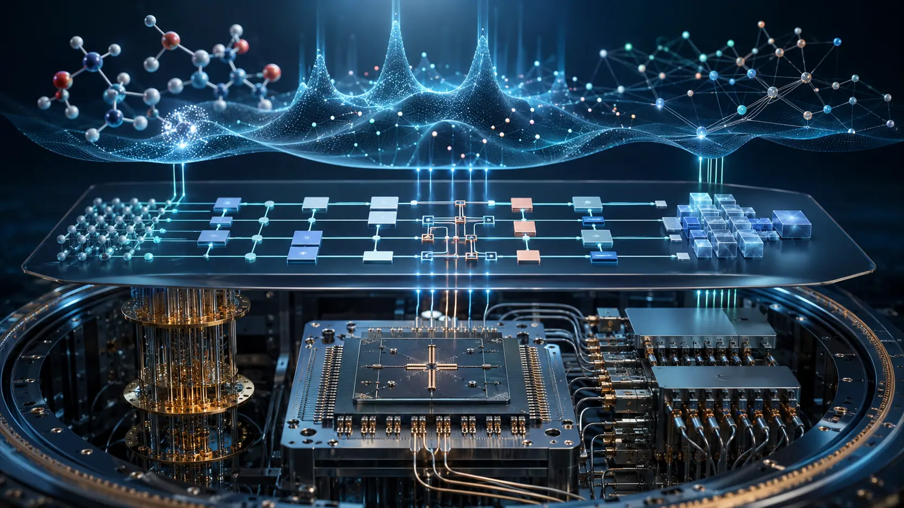
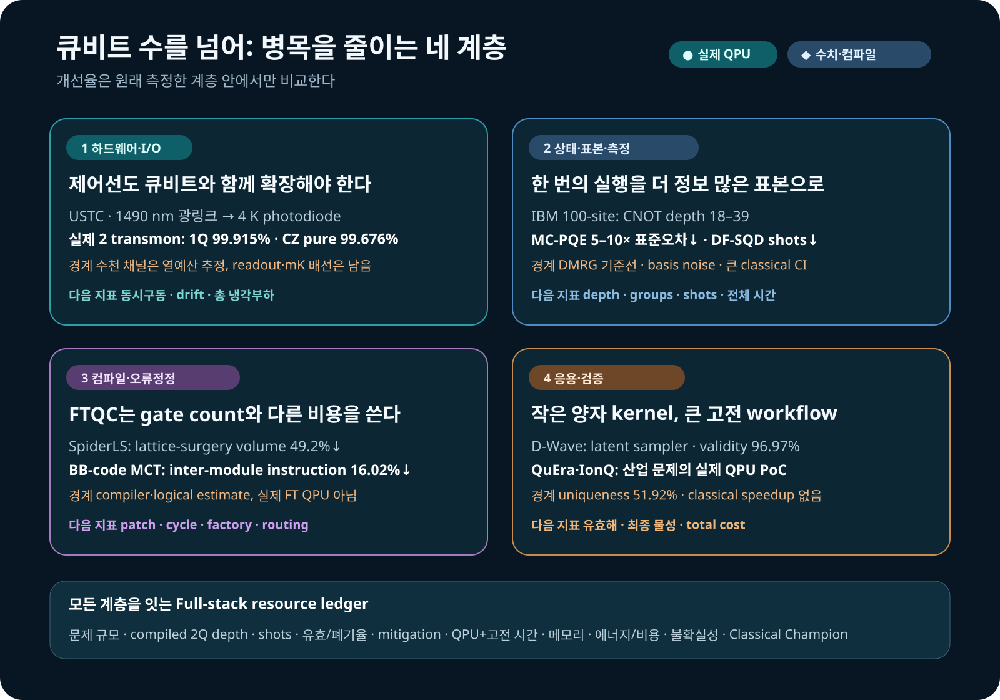

# 큐비트 수를 넘어: 양자컴퓨팅은 시스템 경쟁으로 간다

양자컴퓨터의 진전을 큐비트 수나 단일 fidelity 숫자로만 읽으면 지금 벌어지는 경쟁의 절반을 놓친다. 큐비트를 늘려도 상온에서 극저온까지 제어신호를 보내는 배선이 감당하지 못하면 시스템은 커지지 않는다. 좋은 상태를 만들어도 측정 샷과 고전 후처리가 폭증하면 계산은 유용해지지 않는다. 응용 문제를 양자회로에 올려도 유효한 답이 거의 나오지 않거나 더 강한 고전 해법을 이기지 못하면 산업적 성과라고 부를 수 없다.

2026년 9월 2일과 3일에 검토한 연구들은 그래서 하나의 흐름으로 묶인다. 연구의 초점이 **더 많은 큐비트**에서 **제어선·상태준비·표본·측정·컴파일·고전 후처리를 함께 줄이는 시스템 설계**로 이동하고 있다. 이 글은 LinkedIn에서 발견된 D-Wave 분자 생성 연구와 초전도 트랜스몬 광제어 연구를 출발점으로, IBM의 100-site 양자상태 실험과 sampling-based quantum diagonalization, 중성원자·이온트랩 최적화, 오류정정 컴파일 연구를 같은 증거 기준으로 비교한다.

<figure class="article-hero-figure">

<figcaption>그림 1. 양자컴퓨팅의 병목은 칩 하나에 있지 않다. 제어 하드웨어에서 회로·측정, 고전 후처리와 응용 검증까지 이어지는 전체 경로가 계산의 가치를 결정한다. 이 그림은 특정 장치나 정량 결과를 재현하지 않은 편집용 개념 이미지다.</figcaption>
</figure>

먼저 바로잡을 두 가지

광섬유로 트랜스몬을 제어한 연구는 IBM이 아니라 중국과학기술대학(USTC) 판젠웨이 연구진의 프리프린트다. IBM이 실제로 등장하는 핵심 연구는 별도의 100-site spin-chain 실험과 DF-SQD 실험이다. D-Wave 연구의 96.97%도 약효나 신약 성공률이 아니라 RDKit이 분자 그래프로 해석할 수 있었던 생성 SMILES의 비율이다. 이 글은 LinkedIn 게시물을 발견 경로로만 쓰고, 기관·수치·방법은 원 논문을 기준으로 정리한다.

## 먼저 읽을 결론

1.  **하드웨어 확장의 다음 병목은 입출력이다.** USTC 연구는 상온 제어신호를 1490 nm 광섬유로 4 K까지 운반해 두 개의 실제 트랜스몬을 제어했다. 그러나 4 K 아래 배선과 판독은 그대로 남았고, 수천 채널은 냉각 예산을 이용한 추정이지 실증 규모가 아니다.
2.  **좋은 표본을 얻는 방법 자체가 알고리즘이 되고 있다.** D-Wave는 분자 생성모델의 이산 잠재변수 sampler로, IBM QPU는 selected-CI에 넣을 determinant 제안기로 쓰였다. 양자장치는 전체 계산기가 아니라 제한된 sampling kernel이었다.
3.  **상태준비와 측정비용이 큐비트 수만큼 중요하다.** 100-site 상태는 18–39의 얕은 CNOT depth 덕분에 실제 IBM 하드웨어에 올라갔다. MC-PQE는 회로를 늘리기보다 Pauli 항을 묶고 샷을 배분해 같은 측정 수에서 표준오차를 5–10배 줄였다.
4.  **컴파일 성과는 최적화한 계층 안에서만 해석해야 한다.** SpiderLS의 49.2%는 surface-code lattice-surgery 시공간 부피 감소이고, BB-code 연구의 16.02%는 모듈 간 명령 감소다. 현재 NISQ 회로 depth가 같은 비율로 줄었다는 뜻이 아니다.
5.  **응용은 아직 하이브리드 PoC가 중심이다.** QuEra와 IonQ 실험은 실제 QPU까지 연결했지만 강한 고전 solver 대비 총시간 우위는 보이지 않았다. 지금의 핵심 성과는 문제 분해, 유효해 복구, 장치 연결 경로를 만든 데 있다.

## 1. 트랜스몬 제어선을 광섬유로 바꾸면 무엇이 달라지나

초전도 큐비트는 수십 mK에서 동작하지만 제어 전자장치는 보통 상온에 있다. 큐비트마다 동축선과 감쇠기, 필터를 내려보내면 열유입과 냉동기 공간, 케이블 조립과 교정이 함께 늘어난다. 큐비트 자체가 좋아져도 이 배선이 확장을 막을 수 있다.

[Yu-Huai Li, Daojin Fan 연구진의 프리프린트](https://arxiv.org/abs/2608.19602)는 상온 arbitrary waveform generator가 만든 GHz 대역 XY 신호와 square-wave Z 신호로 1490 nm distributed-feedback laser를 직접 변조했다. 광신호는 fiber를 따라 4 K stage로 내려가고, reverse-biased InGaAs PIN photodiode가 다시 전기신호로 바꾼다. 연구진은 이 구조로 두 개의 tunable transmon과 tunable coupler를 제어했다.

이것은 광자 큐비트와 마이크로파 큐비트를 변환하는 quantum transducer가 아니다. **고전 제어파형을 광으로 운반하는 analog radio-over-fiber link**다. photodiode도 mK가 아니라 4 K에 놓였다. 4 K 아래에서 칩까지 이어지는 전기 배선과 기존 판독선은 남는다.

### 실제 두 큐비트에서 얻은 수치

| 항목                |                   보고값 | 해석 경계                            |
|---------------------|-------------------------:|--------------------------------------|
| $T_1$             | $58.58\pm3.39\ \mu s$ | 두 큐비트 장치의 측정값              |
| $T_2^*$          |  $2.40\pm0.23\ \mu s$ | sweet spot에서 409 MHz 벗어난 운용점 |
| 1Q (X/2) gate       |                    50 ns | 광전송 제어파형 사용                 |
| Q1 1Q fidelity      |     $99.915\pm0.005\%$ | randomized benchmarking              |
| Q2 1Q fidelity      |     $99.854\pm0.014\%$ | randomized benchmarking              |
| CZ gate             |                    38 ns | 두 transmon과 tunable coupler        |
| CZ pure fidelity    |     $99.676\pm0.041\%$ | 논문이 분리해 보고한 값              |
| CZ dressed fidelity |     $99.445\pm0.041\%$ | decoherence를 포함한 비교값          |

논문은 4 K 냉각능력을 1.5 W로 놓고 XY-only 채널당 active heat를 0.058 mW, XY+Z 채널을 0.752 mW로 추산했다. 단순히 나누면 각각 25,816채널과 약 1,996채널이다. 이 수치는 “수천 큐비트가 이미 광제어됐다”는 뜻이 아니다. photodiode duty cycle, bias, drift, fan-out, 동시구동, mK 배선, 판독과 냉동기의 다른 열부하를 제외한 **4 K thermal-budget extrapolation**이다.

광링크를 이용한 초전도 큐비트 제어 자체도 처음은 아니다. [NIST 연구진은 2021년 Nature에 photonic link를 이용한 단일 초전도 큐비트의 제어와 판독을 보고했다](https://www.nist.gov/publications/control-and-readout-superconducting-qubit-using-photonic-link). 이번 연구의 진전은 XY와 Z, coupler 제어를 한 두-transmon gate system으로 묶고 4 K photodiode의 열비용과 gate fidelity를 함께 제시한 데 있다. 다음 검증 단계는 수십·수백 채널 동시구동, 장시간 phase·amplitude 안정성, readout까지 포함한 전체 I/O, 실제 냉동기의 총 열예산이다.

## 2. D-Wave는 분자를 계산한 것이 아니라 잠재공간을 샘플링했다

D-Wave가 소개한 [Scientific Reports 논문](https://www.nature.com/articles/s41598-026-49186-8)은 양자화학으로 분자의 전자구조나 결합에너지를 계산한 연구가 아니다. Transformer encoder-decoder가 SMILES 문자열을 이산 잠재변수로 압축하고 다시 문자열로 복원하는 생성모델이며, D-Wave annealer는 그 가운데 **Boltzmann prior에서 binary latent vector를 뽑는 단계**에 사용됐다.

연구진은 128개의 visible variable과 128개의 hidden variable을 D-Wave `Advantage2_prototype2.6`의 Zephyr topology에 배치했고, 총 1,215개의 물리 큐비트를 사용했다. 나머지 encoder·decoder 학습과 분자 문자열 처리는 고전 계산이다. 비교 대상은 simulated annealing Metropolis-Hastings를 쓰는 classical Boltzmann machine이었다.

또 하나의 핵심은 양자장치가 아니라 새로운 classical objective였다. Neural Hash Function(NHF)은 continuous encoder output을 binary code로 바꾸면서 quantization과 regularization을 학습손실에 넣었다. 따라서 “양자 sampler의 효과”와 “NHF라는 고전 학습법의 효과”를 분리해 봐야 한다.

### 10,000개 생성 문자열의 결과

| prior sampler | binarization   |   validity | uniqueness | 전체 10,000개 중 고유 유효분자 |
|---------------|----------------|-----------:|-----------:|-------------------------------:|
| Classical BM  | Gumbel-Softmax |     52.20% |     99.94% |                          5,126 |
| Classical BM  | NHF            |     61.95% |     98.09% |                          6,077 |
| Quantum BM    | Gumbel-Softmax |     71.88% |     95.10% |                          6,835 |
| Quantum BM    | NHF            | **96.97%** | **51.92%** |                          5,035 |

가장 높은 validity는 가장 낮은 uniqueness와 함께 나왔다. QBM+NHF는 해석 가능한 문자열을 자주 만들었지만 같은 분자를 더 많이 반복했고, 고유 유효분자의 절대 개수는 classical BM+NHF의 6,077개보다 적은 5,035개였다. D-Wave 소개글과 논문 본문은 97% 대 73%라고 서술하지만, 논문 Table 1의 matched NHF classical 값은 61.95%다. 71.88%는 **QBM+Gumbel-Softmax**이므로 73%를 classical matched baseline으로 읽어서는 안 된다.

연구진은 unique molecule 가운데 QED가 0.7 이상인 비율도 계산했다. training data 31.61%, classical/Gumbel 40.81%, classical/NHF 43.15%, QBM/Gumbel 52.60%, QBM/NHF 66.79%였다. 그러나 QED는 molecular weight, lipophilicity 같은 특성을 결합한 heuristic drug-likeness score다. target binding, efficacy, selectivity, toxicity, ADME, synthesis 또는 임상 성공을 측정하지 않는다.

더욱이 architecture를 Transformer에서 MLP로 바꾸면 quantum-classical validity 차이는 Gumbel에서 0.8 percentage point, NHF에서 1.6 point로 작아졌다. seed 반복, 신뢰구간, 강한 최신 고전 생성모델, annealing reads·wall-clock·energy도 보고되지 않았다. 따라서 이 연구는 실제 quantum annealer가 **후보 생성기의 이산 sampler로 작동할 수 있음**을 보인 탐색 연구이지, 신약 발견의 양자우위나 속도우위 실증은 아니다. [D-Wave의 기업 설명](https://www.dwavequantum.com/learn/blog/posts/how-quantum-computing-could-improve-generative-ai-what-a-new-drug-discovery-study-reveals/)은 이 구분을 읽은 뒤 참고하는 편이 안전하다.

## 3. 상태를 얕게 만들고, 적게 측정하고, 더 좋은 표본을 고른다

9월 2–3일의 알고리즘 연구에서 가장 일관된 방향은 “더 큰 회로”가 아니라 **필요한 정보를 더 싼 회로와 더 좋은 표본으로 얻는 방법**이었다.

### 100-site 상태를 가능하게 한 것은 얕은 준비회로였다

[npj Quantum Information의 동료평가 논문](https://www.nature.com/articles/s41534-026-01334-8)은 100-site bond-alternating Heisenberg chain의 symmetry-protected topological state를 IBM `ibm_pittsburgh`에 준비했다. DMRG로 만든 matrix-product state를 tensor-network approximate quantum compilation으로 압축해 CNOT depth 18, 21, 21, 39의 네 회로를 얻었다. 실제 하드웨어에서는 길이 20까지의 string order, entanglement spectrum의 특징과 edge mode를 측정했다.

여기서 97.9–99.0%는 raw hardware fidelity가 아니다. **고전적으로 컴파일한 회로상태와 DMRG target state의 fidelity**다. 실험 결과에는 Pauli twirling, TREX와 zero-noise extrapolation이 쓰였고, 길이가 늘수록 측정 string order가 감소하는 원인이 readout accumulation인지 물리상태의 order 손실인지는 열려 있다. 1차원 gapped state에 DMRG/MPS라는 강한 고전 해법이 있으므로 이 결과를 계산 우위라고 부를 수 없다. 성과는 깊은 adiabatic evolution 대신 얕은 준비회로로 실제 100-site 장치에서 여러 비국소 진단을 읽어낸 데 있다.

### MC-PQE는 측정 항을 묶어 오차를 줄였다

[MC-PQE 프리프린트](https://arxiv.org/abs/2608.30612)는 asymmetric expectation value를 측정할 때 full-commuting Pauli terms를 함께 재고, 각 group에 맞춰 shots를 배분했다. 최대 12큐비트 분자 수치실험에서 같은 총 측정 수로 표준오차가 5–10배 줄었다. 이는 실제 QPU 결과가 아니며 basis-change gate의 잡음과 wall-clock도 검증되지 않았다. 그래도 양자화학에서 Hamiltonian term 수가 늘 때 “회로 ansatz를 바꾸는 것” 못지않게 measurement schedule이 중요하다는 점을 수치로 보여준다.

### DF-SQD는 determinant 제안분포를 바꿨다

[DF-SQD 프리프린트](https://arxiv.org/abs/2609.01264)는 shallow number-preserving circuit으로 occupation-number configuration을 제안하고, 고전 selected configuration interaction이 원래 active-space Hamiltonian을 평가한다. N₂ 32-qubit 사례의 실제 IBM QPU 실행에서 DF-SQD는 98,304 shots와 QPU 29초를 사용했고, 비교한 SQD-LUCJ는 300,000 shots와 85초를 사용했다. 저자들은 더 낮은 energy error도 보고했다.

그러나 QPU 시간만으로 전체 속도를 판단할 수 없다. iron-sulfur 사례에서는 determinant subspace가 최대 약 2억 2,100만 개였고, matched comparison도 약 5,000만 determinant를 고전적으로 처리했다. configuration recovery, Hamiltonian construction, selected-CI diagonalization의 CPU/GPU 시간과 메모리가 합쳐져야 end-to-end 비용이 된다. 이 연구가 직접 입증한 것은 **제안분포를 물리·화학 구조에 맞추면 더 적은 QPU shots로 더 유용한 determinant를 모을 수 있다**는 것이다.

이 세 연구를 함께 보면 회로 깊이, Pauli grouping, determinant distribution이 같은 역할을 한다. 모두 QPU가 내놓는 한 번의 실행을 더 정보가 많은 표본으로 바꾼다.

## 4. 오류정정 시대의 컴파일은 다른 비용함수를 쓴다

현재 장치의 gate count나 depth를 줄이는 컴파일과, surface code에서 logical patch를 움직이는 컴파일은 같은 문제가 아니다.

[SpiderLS](https://arxiv.org/abs/2608.30228)는 Clifford+T 회로를 full ZX reduction으로 단순화한 뒤 multi-target operation과 Pauli-product measurement로 내리고, lattice surgery의 patch와 경로를 배치한다. prior ZX-based compiler인 TopoLS 대비 평균 spacetime volume을 49.2%, compilation time을 99.8% 줄였다. 이 결과는 실제 fault-tolerant QPU가 아니라 compiler workload에서 나온 값이다. gate-model 회로로 되돌렸을 때 현재 NISQ depth가 49.2% 줄어든다는 보장도 없다.

[BB-code용 multi-controlled Toffoli 배치 연구](https://arxiv.org/abs/2609.00852)는 binary-tree 형태를 이용해 interacting subtree를 같은 module에 놓았다. naive sequential first-fit보다 inter-module instruction을 최대 16.02% 줄였고, grid형 magic-state factory 배치는 linear topology보다 최대 23.7% 줄였다. 역시 Qiskit community의 logical error estimator를 이용한 설계평가이며 실제 logical processor 실행은 아니다.

두 연구가 가리키는 개발 방향은 분명하다. fault-tolerant machine에서는 “게이트 수” 하나가 아니라 logical patch 면적, syndrome cycle, magic-state factory, module 간 이동과 실행시간을 함께 최적화해야 한다. 그래서 SpiderLS의 full-ZX reduction은 Classiq oracle의 전처리 아이디어로 시험할 수 있지만, lattice-surgery metric을 Classiq challenge의 제출 회로 depth와 직접 비교해서는 안 된다.

## 5. 산업 응용은 작은 양자 kernel과 큰 고전 workflow로 진입한다

### 중성원자 전력운영: 유효해 복구가 핵심이었다

[stochastic unit commitment 연구](https://arxiv.org/abs/2609.01248)는 발전기 on/off의 discrete move를 maximum-weight independent set(MWIS)으로 바꾸고 QuEra Aquila에서 실행했다. continuous dispatch와 feasibility recovery는 고전 계산이 담당했다. 15일 hardware campaign의 50-node 사례에서 QPU sample을 고전적으로 다듬은 결과는 exact-MWIS 기반 dispatch margin과 맞거나 이를 넘었다. 더 큰 사례에서 inner-objective ratio 평균은 0.940이었지만, full atom array가 살아남아 유효 sample을 주는 비율은 100-node에서 0.095까지 내려갔다.

이는 양자장치가 전력운영 전체를 풀었다는 뜻이 아니다. 문제 분해와 후처리까지 연결한 end-to-end workflow가 성과이고, atom survival이 확장 병목이라는 진단이 결과다. classical HiGHS보다 빠르거나 싼지는 입증하지 않았다.

### IonQ 가스망 QAOA: 실행 경로를 보인 작은 PoC

[가스 수송망 연구](https://arxiv.org/abs/2609.00825)는 압력할당과 hydraulic constraint를 QUBO로 만들고 Classiq에서 QAOA 회로를 합성했다. simulator에서는 원래 모델에 $p=30$을 사용했지만, IonQ Forte-1 실제 실행은 축소한 10-logical-qubit instance와 $p=2$였다. QPU distribution에서 physically valid state의 확률 합은 3.6%였다.

유효 후보가 나온 것은 사실이지만, 원래 규모와 다른 축소 문제이고 대부분의 샷은 유효영역 밖에 있었다. classical exhaustive solution과 hydraulic simulator가 기준선이며, QPU가 이들보다 빠르거나 더 좋은 해를 찾았다는 결과는 아니다. 현재 의미는 formulate → synthesize → hardware → feasibility check의 경로를 실제로 연결한 데 있다.

### QML에서는 더 많은 큐비트가 오히려 kernel을 무너뜨렸다

[IBM `ibm_fez`에서 실행한 quantum-kernel 연구](https://arxiv.org/abs/2609.00475)는 angle-encoded feature map의 폭이 데이터와 map의 intrinsic dimension을 넘으면 서로 다른 데이터의 kernel 값이 비슷해지는 collapse를 관측했다. 8개 sample, 256 shots의 실제 실행에서 fractal-dimension width의 one-layer ZZ kernel은 exact kernel과 MAE 0.021로 맞았지만, 더 넓히면 simulator와 hardware가 함께 collapse했다.

별도의 [quantum generative model 비교](https://arxiv.org/abs/2608.31117)는 최대 30-qubit statevector에서 작은 MMD training loss가 unseen valid samples의 coverage를 보장하지 않는다는 것을 보였다. classical transformer, RNN과 tensor-network 같은 likelihood-trained 기준선이 중요했다. 두 결과는 “양자모델을 더 넓히거나 training loss를 더 낮추면 일반화가 좋아진다”는 단순 공식을 부정한다. 데이터 표현과 평가 metric이 회로 크기보다 먼저다.

## 6. 이틀치 연구를 증거 수준으로 다시 배열하면

<figure class="figure-panel figure-panel-fit">

<figcaption>그림 2. 이번 이틀의 핵심은 하나의 우위 주장이 아니라 각 계층의 병목을 줄이는 full-stack co-design이다. 실제 QPU, 수치실험과 compiler estimate를 분리해야 서로 다른 계층의 개선율을 잘못 비교하지 않는다.</figcaption>
</figure>

| 연구                      | 증거 상태                     | 직접 보여준 것                             | 아직 필요한 것                                           |
|---------------------------|-------------------------------|--------------------------------------------|----------------------------------------------------------|
| USTC 광전송 트랜스몬 제어 | 프리프린트·실제 2Q QPU        | 1490 nm link, 고충실도 1Q·CZ 제어          | 다채널·장시간·readout 포함 총 I/O                        |
| D-Wave 분자 생성          | 동료평가·실제 annealer        | binary latent prior sampling과 SMILES 생성 | 강한 고전 sampler, 반복통계, target·wet-lab 검증, 총비용 |
| IBM 100-site SPT          | 동료평가·실제 QPU             | 얕은 준비회로와 여러 비국소 관측량         | noisy-state fidelity 경계, 어려운 동역학, 고전비용 비교  |
| MC-PQE measurement        | 프리프린트·수치               | 같은 measurements에서 표준오차 5–10배 감소 | basis-change noise와 QPU wall-clock                      |
| DF-SQD                    | 프리프린트·실제 QPU+고전 CI   | 적은 shots로 더 좋은 determinant proposal  | CI까지 포함한 end-to-end 시간·메모리                     |
| SpiderLS·BB-code          | 프리프린트·compiler/estimator | logical routing·spacetime cost 감소        | 실제 logical hardware와 오류정정 cycle                   |
| QuEra unit commitment     | 프리프린트·실제 QPU+고전 복구 | 산업문제→MWIS→QPU→feasible dispatch 연결   | 강한 고전 solver 대비 총시간·비용                        |
| IonQ 가스망 QAOA          | 프리프린트·축소 QPU PoC       | Classiq 합성에서 실제 QPU까지의 경로       | 원래 규모, 높은 valid-shot rate, 고전 우위 비교          |
| QML kernel·generator      | 프리프린트·QPU/상태벡터 혼합  | 과도한 폭과 proxy loss의 실패 조건         | downstream accuracy와 규모별 classical champion          |

보조 신호도 같은 방향을 보였다. guiding state를 이용한 VQA 이론은 좋은 초기상태가 있을 때의 수렴조건을 정리했지만 그 상태를 싸게 준비한다는 보장은 없다. simulated six-qubit drug-target affinity pilot은 보정 후 제한적인 신호만 남았다. 1.55 μm quantum-dot 연구는 실제 광학계에서 hole-spin $T_2^*=15.9\pm1.7$ ns를 측정했지만 repeater나 cluster-state 생성은 아직 아니다. 각각 이론조건, 작은 QML pilot, photonic device 진전으로 읽어야 한다.

## 7. 앞으로의 개발 방향: 다섯 가지 공동설계

다음은 위 연구들에서 직접 나온 결과와 병목을 바탕으로 한 이 리뷰의 종합 판단이다.

### 1) 큐비트와 제어·판독 전자장치를 함께 설계한다

광섬유, cryogenic CMOS, multiplexed readout은 주변부 기술이 아니다. 채널당 passive heat, active heat, phase noise, calibration drift, mK까지 남은 wire와 냉동기 총부하를 같은 표에 넣어야 한다. gate fidelity 하나가 아니라 동시구동 채널 수와 재교정 주기가 scale metric이 된다.

### 2) 회로를 만들기 전에 정보가 어디에서 손실되는지 정한다

100-site 상태의 핵심은 shallow compilation이었고, MC-PQE의 핵심은 commuting group, DF-SQD의 핵심은 proposal distribution이었다. 앞으로의 알고리즘 평가는 logical qubits와 gate count뿐 아니라 compiled 2Q depth, measurement groups, shots, valid/postselected fraction과 classical recovery cost를 함께 보고해야 한다.

### 3) 컴파일러의 목적함수를 하드웨어 시대에 맞춘다

NISQ gate depth, annealer embedding, neutral-atom survival, surface-code patch volume은 서로 다른 비용이다. 한 계층의 개선률을 다른 계층에 복사하지 말고, high-level Boolean/phase synthesis에서 native gate, routing, logical patch와 factory까지 이어지는 Pareto curve를 만들어야 한다.

### 4) 양자장치를 전체 solver가 아니라 검증 가능한 kernel로 배치한다

D-Wave의 latent sampler, DF-SQD의 determinant proposer, QuEra의 discrete MWIS step이 현실적인 패턴이다. 양자 kernel의 입출력과 고전단계가 명시돼야 어디에서 비용과 품질이 바뀌었는지 측정할 수 있다. end-to-end 결과를 주장하려면 classical preprocessing과 postprocessing을 숨기면 안 된다.

### 5) ‘quantum advantage’보다 usefulness protocol을 먼저 고정한다

실험 전에 최신 고전 기준선, 동일한 문제 instance, solution-quality target, 전체 시간과 에너지 경계를 정한다. 성공한 샷만이 아니라 실패율, 폐기율과 calibration을 기록한다. 평균값과 best case를 분리하고 seed·confidence interval을 남긴다. 이 조건이 충족돼야 개선이 새로운 장치에서도 재현되는지 알 수 있다.

## 8. OLED·재료 연구에 적용한다면

D-Wave 연구를 OLED 재료발견에 곧바로 옮기는 것은 “분자 문자열을 많이 생성한다”로 끝나서는 안 된다. quantum annealer는 discrete latent proposal engine의 후보가 될 수 있지만, 생성 뒤에 물성검증과 합성가능성 필터가 있어야 한다.

1.  **Classical Champion을 먼저 고정한다.** 최신 molecular generator와 Bayesian optimization, genetic algorithm을 같은 training set과 compute budget에서 비교한다.
2.  **목표를 분리한다.** SMILES validity·uniqueness와 novelty를 먼저 보고, 그 다음 $S_1$, $T_1$, $\Delta E_{ST}$, oscillator strength, SOC, radiative/non-radiative rate, charge mobility, stability와 synthetic accessibility를 평가한다.
3.  **양자 kernel의 범위를 좁힌다.** annealer는 latent sampling, gate QPU는 제한된 active-space energy나 observable처럼 입력·출력을 검증할 수 있는 단계에 둔다.
4.  **측정과 후처리를 자원표에 넣는다.** compiled 2Q depth, commuting groups, shots, mitigation circuits, postselection, QPU time, queue, CPU/GPU time과 메모리를 합친다.
5.  **다단계 검증을 통과시킨다.** 저비용 surrogate → DFT/TDDFT 또는 multireference 계산 → 합성가능성 → 실험의 순서로 후보를 줄인다.
6.  **동일 총예산에서 비교한다.** 같은 시간·에너지·금액으로 고전 pipeline보다 더 많은 검증된 후보를 찾았는지가 최종 지표다.

이 구조에서는 quantum sampler가 쓸모없거나 전부를 대체해야 할 필요가 없다. 전체 탐색비용을 낮추거나 후보분포의 coverage를 개선하는 작은 모듈로도 가치가 있다. 단, 그 가치는 validity나 QED 같은 proxy가 아니라 최종 물성·실험과 total cost에서 확인돼야 한다.

## 최종 평가

이번 이틀의 연구 동향은 양자컴퓨팅이 단일 칩의 성능경쟁에서 계산 시스템의 공동설계로 넘어가고 있음을 보여준다. 실제 하드웨어 진전은 있다. 두 transmon을 광전송 신호로 제어했고, 100-site 상태의 비국소 질서를 IBM QPU에서 읽었으며, quantum annealer와 gate-model·neutral-atom QPU를 분자 생성, 양자화학, 산업 최적화 workflow 안에 넣었다.

그러나 이 결과들을 양자우위 하나로 묶을 수는 없다. D-Wave의 96.97%는 문자열 validity이고 uniqueness와 맞바뀌었다. 광제어의 수천 채널은 열예산 추정이다. DF-SQD의 QPU shots 절감 뒤에는 큰 고전 CI가 남고, QuEra와 IonQ PoC에는 고전 feasibility recovery와 작은 valid fraction이 있다. SpiderLS와 BB-code의 큰 개선율은 아직 logical compiler metric이다.

가장 중요한 방향은 오히려 현실적이다. **제어선 하나, 회로층 하나, 측정 group 하나, 유효표본 하나를 줄이는 일이 누적될 때 양자컴퓨터가 유용한 계산기로 가까워진다.** 앞으로의 평가는 큐비트 수 대신 full-stack resource ledger와 강한 고전 기준선에서 시작해야 한다.

## 근거 자료

1.  H. Kunugi et al., [*Molecular design beyond training data with novel extended objective functionals of generative AI models driven by quantum annealing computer*](https://doi.org/10.1038/s41598-026-49186-8), Scientific Reports, published 9 July 2026; [arXiv v3](https://arxiv.org/abs/2602.15451). 발견 경로: [D-Wave LinkedIn 게시물](https://www.linkedin.com/posts/d-wave-quantum_drug-discovery-study-shows-how-quantum-computing-activity-7500932164926984193-hRYm)과 [기업 설명](https://www.dwavequantum.com/learn/blog/posts/how-quantum-computing-could-improve-generative-ai-what-a-new-drug-discovery-study-reveals/).
2.  Y.-H. Li, D. Fan et al., [*High fidelity control of superconducting qubits with optical transmitted signal*](https://arxiv.org/abs/2608.19602), arXiv:2608.19602v1, submitted 20 August 2026. 발견 경로: [Michaela Eichinger의 LinkedIn 게시물](https://www.linkedin.com/posts/michaela-eichinger_ive-been-suspicious-of-putting-control-electronics-activity-7500517475097186305-AQKT).
3.  B. J. Chapman et al., [*Control and readout of a superconducting qubit using a photonic link*](https://www.nist.gov/publications/control-and-readout-superconducting-qubit-using-photonic-link), Nature 591, 2021.
4.  G. Pennington et al., [*Symmetry-protected topological order in a 100-site spin chain on a digital quantum computer*](https://www.nature.com/articles/s41534-026-01334-8), npj Quantum Information 12, Article 141, published 1 September 2026.
5.  D. Baid and M.-A. Filip, [*Efficient measurement schemes for the Monte Carlo projective quantum eigensolver*](https://arxiv.org/abs/2608.30612), arXiv:2608.30612v1, submitted 31 August 2026.
6.  K. Agarwal and A. Ray, [*DF-SQD: Deterministic Fields for Sampling-Based Quantum Diagonalization*](https://arxiv.org/abs/2609.01264), arXiv:2609.01264v1, submitted 1 September 2026.
7.  H. Kim et al., [*SpiderLS: Leveraging Full ZX Reduction for Lattice Surgery Compilation*](https://arxiv.org/abs/2608.30228), arXiv:2608.30228v1, submitted 31 August 2026.
8.  A. B. Bhaumik et al., [*Structure-Aware Placement and Routing of Multi-Controlled Toffoli on Bivariate Bicycle Code Architectures*](https://arxiv.org/abs/2609.00852), arXiv:2609.00852v1, submitted 1 September 2026.
9.  J. Chen et al., [*A Backend-Agnostic MWIS Kernel for Stochastic Unit Commitment with Neutral-Atom Hardware Validation*](https://arxiv.org/abs/2609.01248), arXiv:2609.01248v1, submitted 1 September 2026.
10. A. Ben Ishay et al., [*Quantum-Based Optimization of Gas Throughput in Natural Gas Transmission Networks Under Hydraulic Constraints Using QAOA*](https://arxiv.org/abs/2609.00825), arXiv:2609.00825v1, submitted 1 September 2026.
11. A. P. Appel, [*Fractal dimension predicts quantum kernel collapse in angle-encoded data*](https://arxiv.org/abs/2609.00475), arXiv:2609.00475v1, submitted 31 August 2026.
12. S. Raj, N. Mathur and A. Perdomo-Ortiz, [*“Train classical, deploy quantum” requires rethinking generalization*](https://arxiv.org/abs/2608.31117), arXiv:2608.31117v1, submitted 31 August 2026.
13. R. Villanueva et al., [*Variational Quantum Algorithms with Guiding States: Trainability and Generalization*](https://www.nature.com/articles/s41534-026-01364-2), npj Quantum Information, published 2 September 2026.
14. [*A quantum-enhanced hybrid deep learning framework for drug-target affinity prediction*](https://www.nature.com/articles/s41598-026-69754-2), Scientific Reports, published 2026.
15. [*A telecom-wavelength quantum dot spin-photon interface*](https://www.nature.com/articles/s41467-026-77282-w), Nature Communications, published 2 September 2026.

[9월 2일 Daily Quantum Brief PDF 내려받기](../artifacts/daily_quantum_brief_2026-09-02.pdf) · [9월 3일 Daily Quantum Brief PDF 내려받기](../artifacts/daily_quantum_brief_2026-09-03.pdf)

*확인 메모: 공개 LinkedIn 게시물은 주제 발견과 홍보문구 대조에만 사용했고, 기관·실행장치·수치·게재 상태는 원 논문과 공식 출처에서 확인했다. 실제 QPU, statevector·고전 수치실험, compiler·logical estimate를 분리했으며, 강한 고전 기준선과 end-to-end 비용이 없는 결과에는 양자우위나 속도우위를 부여하지 않았다. 공개 검색은 비공개 피드와 모든 색인을 완전히 포괄하지 않는다.*
