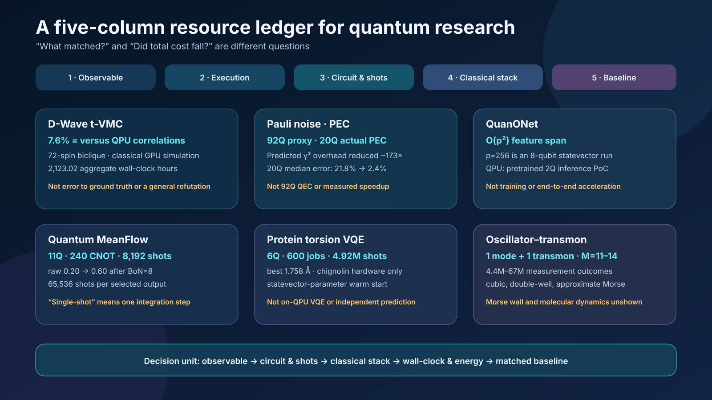

# The Boundary of Quantum Advantage Keeps Moving

The quantum research of September 4, 2026 cannot be summarized by asking “who was faster?” What matters more is **what counted as the answer, which costs entered the denominator, and which part of the computation actually ran on quantum hardware**.

The six studies reviewed together here appear far apart. One study simulated D-Wave spin-glass dynamics classically on GPUs, while another examined the gauge freedom of non-identifiable Pauli noise on IBM quantum hardware. QuanONet established an expressivity bound for quantum neural operators, and Quantum MeanFlow reduced sequential ODE integration in a generative model to one step. A protein study encoded continuous torsions with logarithmically scaling qubit counts, while a superconducting harmonic oscillator–transmon experiment programmed cubic, double-well, and approximate Morse potentials on the same device.

It would be wrong or incomplete to summarize these results as “classical computing has caught up with quantum,” “a quantum neural network outperformed classical models,” “a quantum computer folded a protein,” or “molecular simulation has been realized.” Each paper measures a different target, uses a different baseline, excludes different costs, and places a different part of the workflow on quantum hardware. When those distinctions are preserved, however, the six studies reveal a common direction: quantum computing is moving from a contest over the qubit count of a single chip toward a **systems competition that co-designs representation, control, measurement, error mitigation, and classical pre- and post-processing**.

*Figure 1. Conceptual illustration for this review. Quantum hardware and GPUs, observables and resource accounting, and generative, molecular, and continuous-variable applications are arranged within one validation framework. The image does not reproduce any specific chip wiring, experimental dataset, molecular structure, potential, or performance curve.*

::: highlight Verdict of this review
The central advance this week is not the confirmation of universal quantum advantage, but the refinement of the units of comparison. t-VMC reproduced selected two-point correlations at substantial classical cost. The Pauli-noise study showed that gauge ambiguity does not corrupt mitigated observables under a self-consistent model. QuanONet’s advantage is an expressivity bound, not a runtime advantage. Quantum MeanFlow’s “one step” is an ODE integration step, not one physical shot or one complete job. The protein VQE used QPU sampling with simulation-optimized parameters, while the oscillator–transmon experiment implemented components of molecular potentials without calculating an actual molecular spectrum or reaction rate.
:::

The 5-page technical brief, whose layout has been verified, is available as a [PDF download](daily_quantum_brief_2026-09-04.pdf).

## 1. Different “Quantum Results” Use Different Units of Evidence

The first thing to check in the headline of a quantum paper is not the qubit count. Four questions come first.

1. **Observable**: What was matched—energy, correlation, classification accuracy, RMSD, or state fidelity?
2. **Denominator**: Which costs were counted—shots, circuit count, repetitions, GPU/QPU time, classical training, or decoding?
3. **Execution boundary**: Which stage—training, optimization, inference, or sampling—actually ran on a QPU?
4. **Baseline**: Which classical method was compared on the same instance, at the same target accuracy, and under the same total budget?

Applying these four questions to this week’s six studies produces the following ledger.

| Study | Actual execution boundary | Minimum verified claim | Costs and denominators to track | Not demonstrated |
|---|---|---|---|---|
| D-Wave t-VMC | Fully classical GPU simulation; compared with a D-Wave QPU correlation matrix | The final two-point matrix of a 72-spin precision-256 biclique had about 7.6% relative $L_2$ error to the QPU reference | 2,123.02 aggregate wall-clock hours, GPU count and type, samples, sweeps, solver stability, and QPU access | 7.6% error to a ground-truth state, hardest $J=\pm1$ instances, or a refutation of all prior advantage claims |
| Self-consistent Pauli noise | Actual IBM QPUs; 92-qubit proxy mitigation and 20-qubit end-to-end PEC | Jointly learning the full gate set makes the gauge irrelevant to noisy predictions and mitigated observables; optimizing the gauge choice can lower predicted sampling overhead | Characterization circuits and shots, PEC norm, leakage postselection, mitigation variance, and calibration drift | 92-qubit end-to-end PEC, elimination of physical errors, fault-tolerant QEC, or reduction of all noise to a Pauli model |
| QuanONet | Theory, numerical benchmarks, and a pretrained 2-qubit `ibm_fez` inference PoC | The density matrix creates an implicit quadratic feature frame and provides an operator feature span of up to $O(p^2)$ versus $O(p)$ for a matched classical model | Data encoding, circuit compilation, shots, training time, and the classical optimizer | An $O(p^2)$ runtime speedup, a cost advantage for the full PDE solver, or general quantum advantage |
| Quantum MeanFlow | Statevector training and IBM QPU inference | Replaces multistep ODE integration with a one-step average velocity, reducing sequential submissions | 11Q, 240 CNOTs, 8,192 shots/output; 65,536 with BoN=8 plus a classical classifier | One physical shot, advantage over classical generators, or preservation of quality on a noisy QPU |
| Torsion-space VQE | Classical statevector optimization followed by IBM QPU sampling | Encoded 44 chignolin torsions in 6Q; best-of-repeats RMSD was 1.758 Å across 600 jobs | 4,915,200 shots, circuit depth, CDF decoding, coordinate reconstruction, and classical energy optimization | Error-corrected logical qubits, iterative on-QPU VQE, independent protein prediction, or end-to-end acceleration |
| Oscillator–transmon | One superconducting oscillator mode and one transmon | Programmable non-Gaussian phase gates with cubic, tunable double-well, and band-limited approximate Morse forms | $M=11$–14; 4.4M–67M outcomes by potential; tomography, reconstruction, and calibration | Coherent-probe recovery of the Morse wall, molecular spectra, dynamics, or reaction rates |

*Figure 2. Five-column resource ledger constructed for this review. It does not rank the six studies by performance; it compares their observables and denominators, execution locations, circuit and measurement costs, classical pre- and post-processing, and baselines and nonclaims in one view.*

### Read Together: From System Bottlenecks to an Evidence Ledger

The [September 3 review of full-stack co-design](https://infant83.github.io/AI_Tech_Review/reviews/2026-09-03_quantum-full-stack-codesign/en/) followed synthesis, state preparation, measurement, routing, and classical post-processing to ask where the bottleneck moves when an optimization reduces the cost of one layer. This article does not repeat that map. Instead, it uses six studies from the following day to specify **which observables and denominators should measure the shifted bottleneck**. If the September 3 article asked “which parts of the full stack must be co-designed,” the September 4 article asks “what ledger can establish that the resulting design actually reduced total cost?”

## 2. The Exact Scope of the Claim That D-Wave Was Classically Reproduced

Roeland Wiersema’s [*Numerical simulation of D-Wave's quantum advantage experiment with time-dependent variational Monte Carlo*](https://arxiv.org/abs/2609.01719) is a preprint released on September 1, 2026. It simulates frustrated transverse-field Ising annealing studied on D-Wave Advantage2 using correlator-state-based time-dependent variational Monte Carlo (t-VMC). The targets comprise four graph families—2D cylinder, 3D dimer, diamond, and biclique—with anneal times of 7 ns and 20 ns.

The paper makes an important choice: it asks not “how accurately was the entire wavefunction reconstructed?” but **how closely the full final two-point-correlation matrix matched the QPU result**. Systematically increasing the ansatz size brought this error toward the QPU level, with close agreement even on a 72-spin biclique with 360 couplings and maximum degree 14. The approximately 7.6% figure is the relative $L_2$ error of the correlation matrix over all $i>j$, using the QPU matrix as the reference. No converged MPS ground truth is available at this size. The number is therefore not an error against an exact solution, a full-state-fidelity error, or an error for every higher-order correlation. The couplings of this 72-spin problem are also precision-256 values, not the harder bimodal $J=\pm1$ instances.

The result exposes both the capability and cost of classical simulation. The paper’s table sums to 2,123.02 wall-clock hours across runs; this is not GPU-hours multiplied by the number of devices. Each run used either 4 A100 or 8 H200 GPUs, and the most expensive single run took 109.25 hours on 8 H200s. One cannot place the annealer’s physical anneal time directly beside this campaign time and declare a speed winner. The QPU side also includes programming, readout, repetition, queueing, and access overhead; the classical side includes hyperparameter search, failed runs, Markov-chain sampling, and numerical stabilization. A meaningful comparison must fix the target correlation error on the same instance and record time and energy for preparation, repetition, and post-processing on both sides.

The paper is also explicit about the sources of classical failure. Poor Markov-chain mixing, a high-variance local-energy estimator, and stochastic Runge–Kutta error estimates caused instability. Parallel tempering, blurred sampling, and an importance-weighted differential-equation solver mitigated these problems. The accurate conclusion is therefore not that “generic VMC easily simulated D-Wave,” but that **an ansatz and sampling and integration techniques tailored to the problem structure reproduced a specific observable**.

This result does not invalidate every prior quantum-advantage claim. Cost scaling may differ at larger sizes, on harder ±1 instances, for other observables, for the full distribution, or for higher-order correlations. Conversely, it is also difficult to maintain a blanket claim that classical simulation is impossible. The lesson for application researchers is benchmark discipline, not a win–loss verdict. If molecular selection or logistics optimization is mapped to a QUBO, exact solvers, MILP/CP-SAT, simulated annealing, tensor-network, and Monte Carlo methods should be fixed to the same instances and stopping conditions. Comparisons should report solution distributions and time-to-target alongside the best objective value.

## 3. When Does Non-Identifiable Noise Cease to Be a Problem?

Edward H. Chen, Senrui Chen, Laurin E. Fischer, and colleagues’ [*Disambiguating Pauli Noise in Quantum Computers*](https://journals.aps.org/prxquantum/abstract/10.1103/69wc-gzl6) was published in the peer-reviewed journal *PRX Quantum* on September 3, 2026. The experiments ran on actual IBM quantum processors with up to 92 qubits.

Noise characterization has a fundamental identifiability problem. Some errors in state preparation, gates, and measurement cannot be uniquely separated using experimental data alone. Different parameter sets may produce the same observed statistics; this freedom is called a gauge. At first glance, this creates a serious concern: if the noise model cannot be uniquely specified, perhaps its predictions and error-mitigation results cannot be trusted.

The paper’s answer is self-consistency. Rather than characterizing state preparation, measurement, single-qubit gates, and multi-qubit entangling Clifford gates separately while assuming arbitrary ideal components, the authors jointly characterize the learnable parameters of the complete gate set. They show theoretically and experimentally that, under this treatment, unlearnable gauge degrees of freedom do not change predictions of noisy dynamics or error-mitigated observables. Moreover, among gauges that produce the same physical observables, one can select a representation with lower sampling overhead.

The roles of experiments at different scales must be kept separate. The largest experiments on `ibm_strasbourg`—GHZ circuits with up to 21 qubits and a 92-qubit ring—used prediction ratios on classically tractable Clifford circuits for proxy mitigation. Across 92 local $Z_i$ observables, the median error fell from 4.9% to 3.1%. The full randomized PEC experiment instead used 20-qubit non-Clifford circuits on `ibm_fez`. Each model ran 100,000 randomized circuit instances with one shot per instance; only about 18% remained after leakage postselection. The median absolute error was 21.8% without mitigation, 5.6% with inconsistent PEC, and 2.4% with gauge-optimized consistent PEC.

In the same 20-qubit experiment, the PEC norm $\gamma$ was 6.74 for the inconsistent model, 48.68 for the default-gauge consistent model, and 3.7 for the optimized consistent model. Using $\gamma^2$ as a proxy for sampling cost, the optimized gauge was about 173 times lower than the default consistent gauge. This is neither a measured speedup nor a direct measurement that fewer shots were used. It is a reduction in the **predicted sampling overhead** needed to reach the same PEC estimation precision.

There is no contradiction between saying that “the gauge is irrelevant” and “the gauge can be optimized.” The final observable, when computed self-consistently, is gauge-invariant. Yet the magnitudes of decomposition coefficients used in implementations such as probabilistic error cancellation—and therefore their variance and sampling cost—can depend on the representation. The answer stays the same; the cost of estimating it changes.

This is not a demonstration of quantum error correction. The work neither creates logical qubits that detect and correct physical errors nor claims to solve arbitrary non-Pauli or strongly non-Markovian noise. The precise practical statement is: **even when every model parameter cannot be uniquely identified, useful noisy predictions and mitigation remain possible within a self-consistently learned model, and the gauge can serve as a cost-optimization variable.**

The nearest-term use is in reporting. Error-mitigation experiments should include absolute error before and after mitigation alongside noise-characterization shots, sampling amplification, calibration time, drift, and the final effective sample size. The same applies to VQE or SQD for OLED and materials problems: if a lower energy error requires a larger PEC/ZNE variance and a higher QPU allocation, the net benefit must be calculated separately. The paper’s value lies in translating the theoretical problem of identifiability into the operational problem of selecting a representation that estimates the same observable with fewer shots.

## 4. QuanONet’s $O(p^2)$ Is an Expressivity Bound, Not a Speedup

Ruocheng Wang, Xiaoqiu Zhong, Zhuo Xia, and Junchi Yan’s [*Quantum neural operators with implicit quadratic frame and expressivity advantages*](https://www.nature.com/articles/s42256-026-01289-7) was published in *Nature Machine Intelligence* on September 3, 2026. QuanONet, the model proposed in the study, is a quantum neural operator that approximates mappings from functions to functions—that is, the solution operator of a differential equation.

The central theory is more specific than a vague appeal to an exponentially large Hilbert space. The architecture’s density matrix creates an implicit quadratic frame over the input features, providing a feature span of up to $O(p^2)$ for operator approximation compared with the $O(p)$ linear capacity of a matched classical model. Here, $p$ is the dimension of the sampling locations or latent representation, not a qubit count. Quadratic scaling requires linearly independent pair-product features; in a Sidon-spectrum example in the supplement, coverage falls to $O(p^{3/2})$. The paper also extends a universal-approximation result for continuous nonlinear operators to the quantum setting.

The exact claim is an **expressive-capacity bound for a particular architecture class against a classically matched model**. The fact that $O(p^2)$ exceeds $O(p)$ does not by itself reduce training time, inference latency, data requirements, shots, or energy use. Extracting useful density-matrix terms requires measurement, and the costs of encoding classical data and optimizing the parameters remain. The ability to represent a larger function space is distinct from the ability to find a good solution within that space efficiently.

The run on actual `ibm_fez` hardware is best understood as a qualitative proof of hardware feasibility. A pretrained 2-qubit model inferred 100 output coordinates for an antiderivative problem; the public script sets the Estimator default to 10,000 shots. The QPU did not perform training. The paper presents a comparison with noise-free simulation and provides compilation information, but it does not offer an end-to-end benchmark showing that the quantum system solves the full PDE workflow faster or with less energy than a competitive classical neural operator. In the public implementation $p=2^n$, so the $p=256$ scaling experiment is an 8-qubit statevector simulation, not a 256-qubit experiment. It should not be conflated with the separate strict parameter-matched comparison as though both were one hardware result.

The research direction remains important. It moves the persuasive question in QML from “the Hilbert space is exponentially large” to “which feature interactions can be obtained cheaply with which circuits and measurements?” Future experiments should match parameter counts, data preprocessing, circuit depth, measurement settings, shots, and training wall-clock against classical polynomial-feature models, kernel methods, and DeepONet/FNO families. Hardware studies should retain the same data splits and seeds while reporting the simulator-to-QPU gap, variation across calibrations, and error-mitigation costs.

## 5. How Far Does Quantum MeanFlow’s “One Step” Extend?

Ashish Joshi, Eshaan Mistry, and Takahiko Koyama’s [*Quantum MeanFlow: single-shot generative sampling on NISQ hardware*](https://arxiv.org/abs/2609.02186) is a preprint released on September 2, 2026. Flow matching learns a velocity field that transports a simple distribution to a target distribution and then integrates an ODE during inference. Conventional Quantum Flow Matching (QFM) accumulates QPU submissions and input/output overhead because its multiple time steps are sequentially dependent. Quantum MeanFlow (QMF) replaces the instantaneous velocity with an interval-averaged velocity, reducing the integration to one step.

“Single-shot” must not be read as one physical shot. QMF’s one step has the algorithmic meaning of **one ODE integration step, or one model-evaluation stage**. The implementation reconstructs the output from X and Z measurement bases with 4,096 shots per basis. One QMF image therefore costs 8,192 shots, or 65,536 shots when BoN=8 is included. The 11-qubit QMF circuit has 24 layers with 10 CNOTs per layer, for 240 CNOTs and 792 trainable parameters in total. The favorable structural property of one-step integration therefore coexists with the measurement cost of a deep, noisy circuit.

A second boundary concerns where training occurs. A classical autoencoder with about $2.2\times10^5$ parameters compresses 16×16 MNIST images into a 32-dimensional latent space, and the QMF and QFM parameters were trained with a statevector simulator. The IBM Heron systems `ibm_pittsburgh` and `ibm_boston` performed inference with fixed parameters. The QPU therefore did not train the complete generative pipeline; it executed a quantum inference block after classical encoding and simulator training.

The results must also be decomposed. In statevector simulation, 60-step Heun QFM achieved an accuracy of 0.85, compared with 0.63 for one-step QMF. FID, calculated from 2,000 samples in the feature space of a classifier trained by the authors, was 10.62 for QFM and 28.26 for QMF, indicating lower QMF quality. On `ibm_boston`, raw accuracy was 0.30 for QFM and 0.20 for QMF. With best-of-$N$ (BoN) rejection sampling at $N=8$, the figures recovered to 0.80 and 0.60, respectively. That recovery came from generating eight times as many candidates and using a classical classifier with 98.2% test accuracy to choose the best. Because the same classifier participates in both selection and evaluation, this is difficult to treat as independent downstream validation. The method can mitigate noise-induced quality loss without modifying the circuit, but repeated generation, shots, and classifier cost must all enter the accounting.

The study therefore demonstrates an architectural trade-off that reduces sequential ODE submissions and the feasibility of inference on noisy hardware. It does not demonstrate a quality or total-time advantage over classical diffusion or flow models, QPU-accelerated training, or one-shot physical generation. The next comparison is straightforward: compute `number of bases × shots × BoN × circuit depth × queue/latency` as one cost term, then compare against classical MeanFlow using the same latent representation, classifier, and acceptance rule. Whether QMF’s shorter workflow provides an advantage must be decided from this total cost.

## 6. Logarithmic-Qubit Protein VQE Moves Costs Rather Than Removing Them

Fabio Cumbo and colleagues’ [*Logarithmic-scale variational quantum eigensolver for off-lattice protein structure prediction in continuous torsional angle space*](https://arxiv.org/abs/2609.02113) is a preprint released on September 2, 2026. Instead of forcing a protein onto a lattice, the method encodes continuous torsional degrees of freedom in phase, reducing the required qubit count to $O(\log_2 N)$, while a classical algorithm reconstructs heavy-atom coordinates from the torsions.

At the statevector stage, torsions are read from relative phases. On hardware, computational-basis probabilities are instead mapped to bounded torsion variables through an empirical cumulative distribution function (CDF). The workflow uses an EfficientSU2 ansatz and multistage relaxation, while structural evaluation depends on custom molecular-mechanics, Rosetta, or OpenMM scoring backends. Rosetta and OpenMM are internal QTF energy functions here, not independent folding-pipeline baselines. “Logarithmic qubit count” is therefore accurate, but it does not mean that the shots required to recover physical information, deep circuits, classical coordinate reconstruction, or energy-evaluation costs disappear.

In classical statevector optimization, chignolin achieved a retained-snapshot Cα RMSD of 0.623 Å and a final-model RMSD of 1.199 Å; for Trp-cage, the corresponding values were 2.501 Å and 3.512 Å. The 0.623 Å result was an extreme best selected after the fact against a known PDB structure from 7.33 million retained snapshots across the two proteins; it was not the average performance of candidates selected by the energy function. No Trp-cage snapshot fell below 2 Å.

The hardware experiment ran only the six-qubit chignolin circuit on the 156-qubit Heron R2 `ibm_cleveland` and the 120-qubit Nighthawk R1 `ibm_miami`. The six qubits describe the circuit width, not six error-corrected logical qubits. Each device executed 300 jobs with 8,192 shots per job, for a total of 600 jobs and 4,915,200 shots. The best-of-repeats RMSD was 1.758 Å on Cleveland and 1.782 Å on Miami; native-like samples below 2 Å appeared in 88/300 and 45/300 jobs, respectively. These RMSDs are calculated on the structural core with terminal residues excluded. Cleveland used a median of 204 transpiled CZ gates and about 5 seconds of QPU time per job. Miami used only 60 CZ gates but took about 35 seconds. This is a useful example of why fewer 2Q gates do not necessarily imply shorter processing time or a higher recovery rate.

The most important boundary is parameter optimization. For each of three energy functions, the hardware experiment selected 10 final chignolin models with low simulation RMSD—30 circuits in total—and repeated each 10 times as a parameter-transfer sampling experiment. It did not perform on-QPU VQE in which energy is measured and parameters are iteratively updated inside the hardware loop. The warm-start RMSD was already 1.199–2.270 Å, and most hardware repeats were worse than their starting points. Saying that “a quantum computer optimized a protein structure from scratch” would overstate the result. The Hamiltonian also scores torsional conformers through a hybrid objective; this is not electronic-structure VQE that finds the ground state of an electronic Hamiltonian.

The application case remains a benchmark hypothesis. Compact encoding could be used to search 6–12 important torsions in an OLED donor–acceptor molecule or low-dimensional conformers along a polymer backbone. The test would need to hold the conformer family, energy function, and budget fixed against RDKit/CREST, molecular dynamics, basin hopping, and learned potentials. The criterion is whether the method finds a better low-energy conformer faster after accounting for the greater circuit depth, shots, and decoder sensitivity associated with the narrower qubit width. The present study supplies a hardware protocol for asking that question; it does not settle the answer.

## 7. The Oscillator–Transmon Programmed Potentials, Not a Molecule

The 12-author team led by Clara Yun Fontaine released [*Programming anharmonic potentials in a superconducting harmonic oscillator*](https://arxiv.org/abs/2609.02405) as a preprint on September 2, 2026. The experiment dispersively couples a long-lived superconducting harmonic oscillator to a transmon qubit and uses a modular circuit derived from bosonic quantum signal processing to implement a non-Gaussian phase gate $e^{-iV(\hat X)}$. Changing only the qubit-rotation angles between fixed calibrated control unitaries programs several $V(X)$ functions on the same device.

Gaussian operations readily implemented with a harmonic oscillator are not sufficient for universal continuous-variable processing. Nonlinear potentials such as the cubic phase supply a non-Gaussian resource. The experiment implemented a cubic potential $V(X)=0.6X^3$, symmetric and asymmetric double wells, and an approximate Morse potential. Each elementary echoed conditional-displacement gate lasted about 520 ns, each qubit rotation 28 ns, and the Fourier orders were approximately 11–14. For the cubic gate, the authors reported a reconstructed coefficient of $c_3=0.68\pm0.10$, a lower bound on state fidelity of 0.84, and a lower bound on Wigner negativity of 0.11. Repeated applications also showed an accumulating trend in non-Gaussianity.

For the double wells, a linear bias tuned the symmetry and well-depth difference, and reconstruction with bootstrap tests checked whether the topology remained intact. Measurement cost was nevertheless substantial. Total measurement outcomes were approximately $4.4\times10^6$ each for the cubic, symmetric-double-well, and broken-double-well potentials; $5.3\times10^7$ for the asymmetric double well; and $6.7\times10^7$ for Morse.

The Morse gate was presented as an approximate implementation of the exponential form of a molecular vibrational potential. Actual coherent probes stably reconstructed only harmonics with $|n|\le2$, so the steep repulsive wall did not emerge adequately. Recovery of the wall through $|n|\le7$ with 10.9 dB squeezed probes was a simulation. Full $M=13$ reconstruction was estimated to require 16.3 dB of squeezing and 29 probe positions. The authors also identified after data collection a missing $\pi$ factor in constructing the complementary polynomial. Because the paper re-evaluates the results against the circuit that actually ran, the observations of topology and asymmetry remain. It would nevertheless be inaccurate to say that the intended potentials were implemented unchanged at high precision.

The decisive words are **approximate** and **potential gate**. The experiment neither inserted parameters for a real molecule to calculate its vibrational spectrum nor predicted a chemical reaction rate or tunnelling yield. It demonstrated a component that applies a potential as an impulsive phase, together with pointwise force reconstruction.

Two near-term development paths follow. First, longer coherence, shorter modular sequences, and robust calibration could reduce accumulated error at higher Fourier orders. Second, the field can move from testing a potential gate in isolation to an end-to-end analogue benchmark that combines it with kinetic evolution and reproduces a known spectrum or wavepacket dynamics. Any molecular claim should begin with blind comparisons on small problems with precise classical numerical solutions, such as the low-lying eigenlevels of a Morse oscillator, tunnelling splitting, or a time-correlation function.

## 8. Development Directions Shared by the Six Studies

### 8.1 Design the Execution Boundary Before Minimizing the Qubit Count

QMF and the protein VQE reduce the number of calls to the quantum block or the qubit count, but they move costs elsewhere. QMF removes sequential steps while retaining a deep circuit, two measurement bases, and BoN. Torsion encoding narrows the circuit while requiring phase information to be recovered from a probability distribution. Sound co-design does not minimize one resource in isolation. Encoding, ansatz, measurement, and classical decoding should be evaluated together on a Pareto frontier of total error and total time.

### 8.2 A Noise Model Determines Sampling Cost as Well as the Answer

The Pauli-noise study shows that a gauge can leave the final observable unchanged while still affecting sampling overhead. Device calibration can therefore serve not merely as a preliminary check, but as an objective for compilation and mitigation. Qubit and coupler selection, Pauli frames and decompositions, and shot allocation across observables can be treated as one optimization problem.

### 8.3 Separate Expressivity Theorems from Application Speedups

QuanONet’s quadratic frame is a substantive theoretical result. For an application, however, it must translate into the same error with fewer parameters, a more accurate operator within the same time, or lower measurement cost at the same accuracy. Reporting the theorem, simulator benchmark, device PoC, and end-to-end advantage as four distinct stages prevents success at one stage from being treated as an automatic guarantee of the next.

### 8.4 Begin Applications with Small, Verifiable Physical Quantities

Targeting an entire protein-folding process or chemical reaction at once makes it difficult to determine how much of the result was set by classical preprocessing and heuristic scoring. The torsion study first tested sample recovery under a fixed decoder and energy function; the oscillator–transmon study first tested reconstruction of known anharmonic potentials. For materials and OLED problems, the quantum block’s net contribution is easier to measure on quantities with strong classical baselines: energy in a small active space, a restricted torsion family, a known vibrational level, or a specific correlation function.

## 9. A Minimum Quantum–Classical Resource Ledger

At least the following fields are required to place these six papers in one ledger. Leaving even one or two blank creates an invisible-cost segment on the quantum or classical side.

| Ledger field | What must be recorded | Misinterpretation when omitted |
|---|---|---|
| Problem and instance | Graph, molecule, or data split; size; distribution of difficulty | Generalizing from a handpicked set of easy instances |
| Target observable | Energy, correlation order, accuracy, RMSD, fidelity, or spectrum | Comparing different answers as though they had the same accuracy |
| Success criterion | Target error, confidence interval, valid-sample condition | Treating one best run as average performance |
| Quantum execution boundary | Which of training, optimization, inference, and sampling ran on a QPU | Treating an entire hybrid pipeline as QPU computation |
| Circuit resources | Logical and physical qubits, 2Q gates, depth, bases, circuit count | Hiding greater depth behind a lower qubit count |
| Measurement resources | Shots per basis, repetitions, postselection, BoN, effective sample count | Erasing the cost of mitigation and selection |
| Classical resources | Encoding, optimizer, decoder, CI/DFT/MD, GPU/CPU time and memory | Reporting time only for the quantum subroutine |
| Operational resources | Compilation, queue, calibration, QPU access, wall-clock, energy | Directly comparing anneal time with total GPU time |
| Baseline | Best classical method under the same instance, budget, and stopping rule | Expanding an improvement over a weak baseline into an advantage claim |
| Repeatability | Seeds, calibration dates, failed runs, uncertainty | Treating selected successes as stable performance |

For OLED and materials calculations, the ledger should become more specific. Put target overlap, active space definition, state-preparation cost, compiled 2Q depth, number of commuting groups, shots, mitigation amplification, postselection yield, QPU time, and classical CI/DFT time and memory in the same row. For optimization problems, add encoding penalties, feasible-shot rate, time-to-best, optimality gap, and the classical solver’s termination condition. For generative models, record the candidate count, rejection rate, scoring model, and selection compute in addition to FID or classifier accuracy.

## 10. Three Validation Experiments That Can Be Run Now

First, **redesign a D-Wave or QAOA benchmark around matched observables**. On the same Ising/QUBO instances, measure the objective together with two-point and higher-order correlations and sample diversity. Separate a small regime accessible to exact methods, a middle regime where tensor-network or Monte Carlo methods remain competitive, and the claimed QPU-only regime. Report time-to-target and energy-to-target.

Second, **attach an end-to-end denominator to each QML PoC**. QuanONet and QMF should both publish a pipeline graph that includes classical encoding, training, and selection, with an ablation in which the quantum block is replaced by a classical quadratic-feature or MeanFlow block of the same size. Across at least three QPU calibrations, compare shots-to-accuracy and wall-clock-to-accuracy.

Third, **evaluate the decoder separately from the physical solver in molecular and materials applications**. For torsion encoding, measure decoder error with exact phase/statevector input, the additional error with a noisy distribution, and the ranking error introduced by the classical energy function. For the oscillator–transmon system, extend potential reconstruction to a benchmark of known eigenvalues and dynamical observables. This decomposition reveals whether the bottleneck lies in quantum-state preparation, measurement, or classical reconstruction.

## 11. Application Outlook

- **Nearest-term operational use**: self-consistent Pauli-noise learning and gauge optimization. These directly address the engineering problem of reducing sampling overhead in device characterization and error mitigation.
- **Near-term research use**: employ strong classical simulations, including t-VMC, as controls for quantum-advantage benchmarks. Their role is less to replace the quantum device than to define more precisely where a defensible claim begins.
- **Medium-term QML use**: evaluate QuanONet’s quadratic frame and QMF’s one-step inference with measurement cost included. Both remain at the architecture and PoC stage.
- **Medium-term molecular and biophysical use**: connect compact torsion representations and bosonic anharmonic gates to small conformer and vibrational benchmarks. It is too early to extend these results to end-to-end acceleration of protein folding or chemical reactions.
- **Long-term direction**: a heterogeneous stack that combines error-corrected gate models, bosonic modes, and high-performance classical simulation by problem. Rather than assigning every calculation to one platform, the stack selects the least expensive computational layer for each well-defined observable.

## Conclusion

This week’s research did not settle a contest between quantum and classical computation. It clarified what must be counted before such a contest can be judged. t-VMC raised the classical baseline by reproducing selected D-Wave correlations at substantial GPU cost. Self-consistent Pauli-noise learning showed that non-identifiability does not necessarily imply unpredictability, and that gauge choice can reduce the sample cost of reaching the same answer. QuanONet supplied a theoretical basis for greater expressivity, while QMF proposed a structure that reduces sequential inference. Torsion VQE and the oscillator–transmon experiment placed, respectively, compact encoding and programmable non-Gaussian potentials on real hardware.

None of these results demonstrates universal quantum advantage, acceleration of a full application workflow, or the calculation of a real chemical reaction. Stating those limits does not diminish the research. Separating what already works from what remains to be tested directs research and development effort toward the actual bottleneck.

Qubit count alone is no longer an adequate headline metric. **The relevance of the observable, the completeness of the comparison denominator, the transparency of the execution boundary, and a strong classical baseline under the same budget** must be reported together. The boundary of quantum advantage will keep moving. Good reviews and good experiments do not draw that boundary broadly; they record the coordinates and costs at which it was established.

## References

1. R. Wiersema, [“Numerical simulation of D-Wave's quantum advantage experiment with time-dependent variational Monte Carlo,” arXiv:2609.01719v1 (1 September 2026)](https://arxiv.org/abs/2609.01719). **Preprint; classical GPU simulation.** [Code](https://github.com/therooler/dwave_vmc)
2. E. H. Chen, S. Chen, L. E. Fischer et al., [“Disambiguating Pauli Noise in Quantum Computers,” *PRX Quantum* 7, 033045 (3 September 2026)](https://doi.org/10.1103/69wc-gzl6). **Peer-reviewed article; actual IBM QPUs, up to 92 qubits.**
3. R. Wang, X. Zhong, Z. Xia, J. Yan, [“Quantum neural operators with implicit quadratic frame and expressivity advantages,” *Nature Machine Intelligence* (3 September 2026)](https://doi.org/10.1038/s42256-026-01289-7). **Peer-reviewed article; qualitative `ibm_fez` PoC.** [Code](https://github.com/Wang-Ruocheng/QuanONet)
4. A. Joshi, E. Mistry, T. Koyama, [“Quantum MeanFlow: single-shot generative sampling on NISQ hardware,” arXiv:2609.02186v1 (2 September 2026)](https://arxiv.org/abs/2609.02186). **Preprint; simulator training and actual IBM QPU inference.**
5. F. Cumbo, B. Raubenolt, V. Puram, N. Katzenmeyer, J. Joshi, D. Blankenberg, [“Logarithmic-scale variational quantum eigensolver for off-lattice protein structure prediction in continuous torsional angle space,” arXiv:2609.02113v1 (2 September 2026)](https://arxiv.org/abs/2609.02113). **Preprint; actual QPU sampling, not on-QPU optimization.** [Code](https://github.com/cumbof/qtf) · [Data](https://doi.org/10.5281/zenodo.22088098)
6. C. Y. Fontaine, M. Somani, K. Yu et al., [“Programming anharmonic potentials in a superconducting harmonic oscillator,” arXiv:2609.02405v1 (2 September 2026)](https://arxiv.org/abs/2609.02405). **Preprint; actual superconducting oscillator–transmon device.**

---

Authoring information. Responsible editor: Hyun-Jung Kim. AI assistance: OpenAI Codex Work Mode multi-agent workflow. Evidence cutoff: September 4, 2026. `evidence_algorithms` checked t-VMC, Pauli-noise learning, and QuanONet against primary sources; `evidence_applications` checked Quantum MeanFlow, torsion-space VQE, and oscillator–transmon control; and `draft_sep4_review` assembled the Korean and English reviews. Numerical values and methods are source-reported; their proposed translation to OLED and materials applications, the shared resource ledger, and the three validation experiments are editorial recommendations. The review distinguishes 2 peer-reviewed articles from 4 preprints and separately identifies actual QPU execution, classical simulation, simulator training, and classical decoding.
