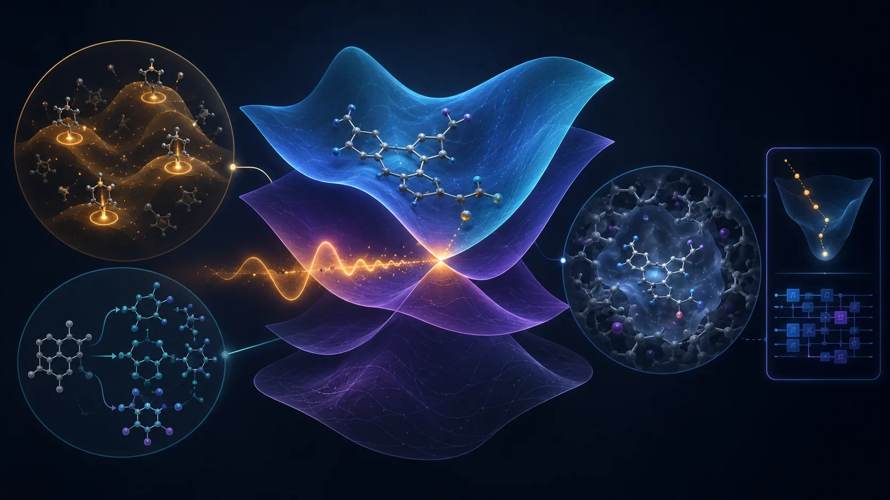
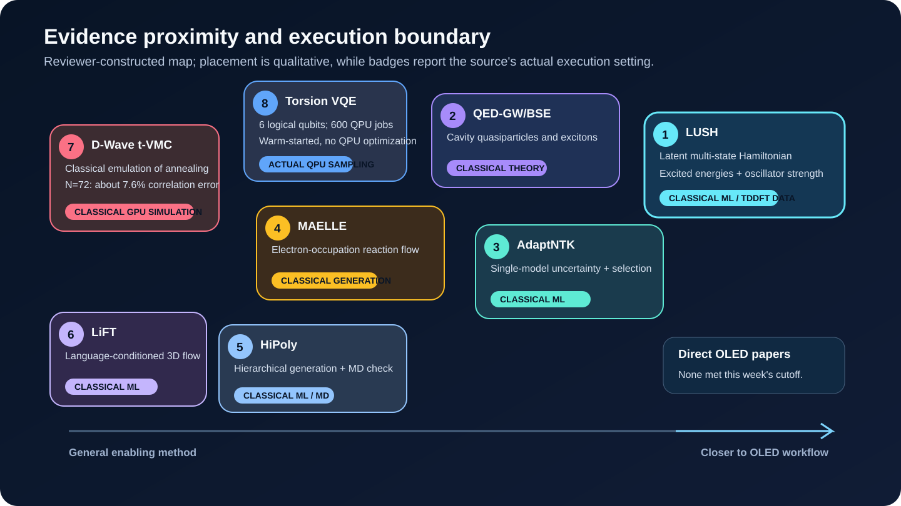
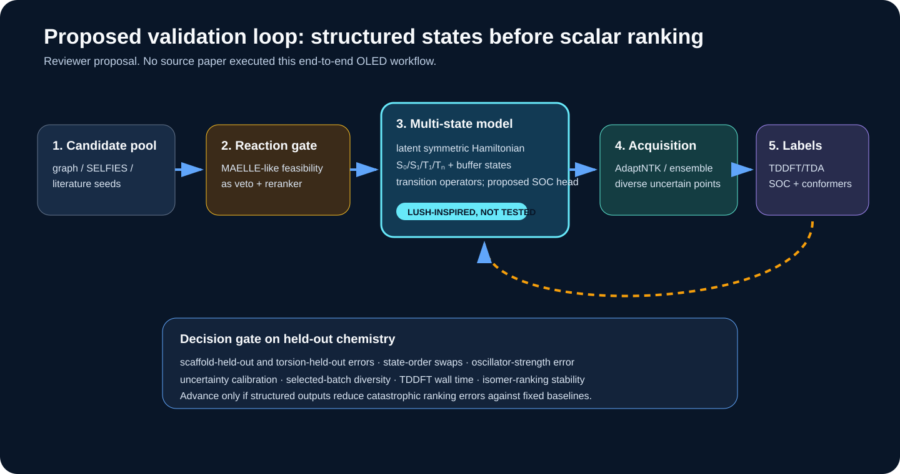

# Learning Coupled Excited-State Landscapes: Physical Representations and Validation Boundaries for OLED Inverse Design

No newly posted or substantially revised paper in the 28 August to 3 September 2026 window directly designed or validated a TADF emitter or PhOLED host. The week is still informative. The immediate methodological problem in OLED inverse design is less about producing more candidates than about representing several interacting excited states and knowing when their predictions remain trustworthy.

The read-first paper is Juergens and co-workers' LUSH model. Instead of regressing each state energy as an unrelated scalar, it learns a symmetric Hamiltonian in latent space and diagonalizes it. Energies, oscillator strengths, and inter-state relationships can therefore live inside a common operator structure. The week's uncertainty, reaction-generation, and cavity GW-BSE papers address adjacent layers of the same question: can the representation and its validation boundary withstand a design decision, rather than merely achieve a favorable average metric?

*Figure 1. Concept illustration for this review. The center represents coupled excited states and a crossing region; surrounding elements represent uncertainty-guided acquisition, reaction constraints, and a host environment. The small quantum motif at the right reflects its status as a bounded benchmarking component in this week's evidence. Molecular, wavefunction, and circuit motifs are conceptual rather than exact structures, computed surfaces, measured morphologies, or executable circuits.*

::: highlight Review verdict
LUSH offers a plausible design principle for learning S1, T1, higher triplets, oscillator strength, and eventually SOC-related operators as connected objects. Its present demonstrations, however, use singlet-centered datasets and random splits; they do not validate triplets, SOC, RISC, or host effects in TADF materials. The most useful next experiment is a controlled comparison between scalar multitask and latent-Hamiltonian models on a small held-out OLED isomer and conformer set.
:::

The layout-verified technical brief is available as a [downloadable PDF](oled_inverse_design_weekly_brief_2026-09-04.pdf).

## Ranked shortlist

1. **LUSH** - represents multiple excited states as eigenvalues and operators of a learned Hamiltonian rather than independent scalar labels.
2. **QED-GW/BSE** - separates cavity contributions to quasiparticles and excitons, while exposing how far the benchmark coupling lies from conventional OLED cavities.
3. **AdaptNTK** - derives uncertainty from a single neural potential and discourages redundant configurations during active-learning selection.
4. **MAELLE** - uses discrete flows over electron occupations to generate reaction products and mechanism-like trajectories.
5. **HiPoly** - shares a hierarchy of composition, motif, and atomic representations across property prediction and generation, followed by MD-level validation.
6. **LiFT** - uses a language-model prior to steer 3D flow matching, but evaluates synthesis and properties through proxies in a protein-ligand domain.
7. **D-Wave t-VMC study** - quantifies the accuracy and large classical sampling cost of emulating annealer dynamics, strengthening the baseline required for an advantage claim.
8. **Torsion-space VQE** - runs a compact six-logical-qubit circuit on two IBM QPUs, but performs warm-started sampling rather than on-QPU VQE optimization or electronic structure.

*Figure 2. Reviewer-constructed qualitative evidence map. Position indicates proximity to an OLED workflow, not a performance ranking. Badges state the execution setting actually used in each paper. All eight selected records are preprints, and none directly validates OLED materials.*

## 1. Direct OLED, TADF, and PhOLED evidence: no selected paper this week

The search found no reliable new primary record within the window that directly combined TADF-emitter, PhOLED-host, host-dopant/exciplex, degradation, or device-lifetime work with the requested inverse-design methods. Papers already covered in the 21 and 28 August briefs were excluded. The eight selections below are enabling methods. This distinction does not diminish their technical quality; it prevents adjacent evidence from being misreported as OLED performance.

## 2. LUSH learns a smooth multi-state Hamiltonian instead of disconnected state labels

David Juergens, Martin Stöhr, Andreas E. Hillers-Bendtsen, O. Jonathan Fajen, and Todd J. Martínez posted [*Latent unified smooth Hamiltonians for excited state chemistry*](https://arxiv.org/abs/2609.01871) on 1 September 2026.

### Source-reported method and results

LUSH takes atomic numbers and Cartesian coordinates through an SE(3)-invariant message-passing network, compresses the representation into fixed trainable latents by cross-attention, forms state-pair features with a Pairformer, and predicts a symmetric latent Hamiltonian. Diagonalization yields adiabatic energies. Unified latent operators produce transition dipoles and oscillator strengths, while nonadiabatic couplings can be obtained through a Hellmann-Feynman relation. The construction is intended to remain smooth around conical intersections, where independent energy regressors often struggle with state identity.

On 134,000 QM9 molecules labeled at B3LYP/6-31G(2df,p), a roughly 5.95-million-parameter model approached 1 kcal/mol after about 48 hours on one Tesla V100. The supplement reports an energy MAE of 0.059 eV, about 1.36 kcal/mol, for a roughly 7.05-million-parameter configuration. QeMFi experiments use 135,000 CAM-B3LYP/def2-TZVP geometries across nine molecules. The azobenzene experiment uses 780,745 FOMO-hh-TDA-BHLYP/def2-SVP single points. At least two states above the states of interest act as buffers so that intersections at a truncated spectral boundary do not contaminate the target manifold.

### Limitations and OLED translation

QeMFi uses a 90/10 random split, and azobenzene uses a 99/1 random split. Neither is a scaffold-extrapolation test. Twisted and cis azobenzene regions are underrepresented and correspondingly less accurate. The demonstrations do not include an OLED triplet manifold, SOC, RISC, or solid host perturbation. Code is promised after peer-reviewed acceptance, limiting immediate reproducibility.

An OLED test could place S0, S1, T1, and higher triplets in one structured model, retain transition dipoles and oscillator strengths, and add a proposed SOC operator head. That extension is not demonstrated in the paper: mixed spin symmetries, phase conventions, and SOC labels would require new design and validation. Success should be judged by state-order swaps and isomer-ranking errors under scaffold- and conformer-held-out splits, not by random-split MAE alone.

## 3. QED-GW/BSE decomposes cavity effects on quasiparticles and excitons

Soohaeng Yoo Willow and eight co-authors posted [*GW and Bethe-Salpeter Theory for Molecular Polaritons, Quasiparticles, and Excitons*](https://arxiv.org/abs/2609.00594) on 1 September 2026.

Starting from a dipole-gauge Pauli-Fierz Hamiltonian and coherent-state QED-HF reference, the work derives QED-GW ionization potentials and electron affinities, followed by a static Bethe-Salpeter equation. Cavity effects enter through a static dipole-self-energy shift, a DSE augmentation of the screened interaction, and a polaritonic pole. Benchmarks cover four hydrides and two aromatic systems. Where comparisons are available, QED-CCSD cavity-induced shifts agree with near-exact QED-DMRG within 1 meV.

GW tends to overestimate cavity-induced IP redshifts for closed-shell or unbound-anion cases. EA shifts are nearly quantitative, although this does not imply accurate absolute EAs. Among the tested molecules, only ammonia shows an appreciable effect on the lowest excitation. Exciton binding energies for unbound anions are strongly basis-dependent.

The principal coupling of λ=0.05 a.u. corresponds to a mode volume of about 0.74 nm³, roughly a 0.9-nm cube, and is therefore closer to a picocavity or plasmonic nanogap than to a conventional planar cavity. For a diffraction-limited 110-nm planar cavity, the authors estimate a single-molecule coupling around 10^-4 and roughly 2×10^5 molecules to reach a collective λ=0.05. An OLED workflow can borrow the paper's correction ledger for IP, EA, optical gap, and exciton binding, but cannot infer conventional-device effects from its strong single-molecule coupling. Ensemble disorder and loss remain outside the benchmark. OmegaQMC examples and MOLMPS are public.

## 4. AdaptNTK turns single-model geometry sensitivity into an acquisition rule

Prajwal Ananth and Shuwen Yue posted [*AdaptNTK: Adaptive Uncertainty Quantification and Active Learning for Neural Network Potentials*](https://arxiv.org/abs/2609.00488) on 31 August 2026.

AdaptNTK measures a regularized Mahalanobis distance in empirical neural-tangent-kernel feature space. A Sherman-Morrison update refreshes uncertainty after each selected configuration without retraining the potential during sequential batch construction. Similar candidates lose value as the batch grows, which directly addresses acquisition redundancy.

On held-out rMD17 configurations, the reported Spearman and Pearson correlations between uncertainty and error are 0.683±0.018 and 0.706±0.021. AdaptNTK obtains AURCn 0.312±0.014, versus 0.310±0.013 for a three-model ensemble, and ENCE 0.0125±0.0018. In rMD17 and Transition-1X active-learning tests it attains the lowest force errors and selects transition-state configurations. Per-cycle time on Transition-1X is 2.6 times lower than the ensemble under matched MACE architecture, loss, splits, and seeds.

These results concern ground-state force potentials, not uncertainty in excited-state energies, SOC, or rates. An OLED study should compute NTK and ensemble scores for both scalar and latent-Hamiltonian models, then test calibration target by target. The useful measurement is whether new TDDFT/TDA points are diverse in torsion, state-crossing, and scaffold space and whether uncertainty bins predict observed errors.

## 5. MAELLE follows discrete changes in electron occupation

Nguyen Xuan-Vu, Octavian Susanu, Daniel Armstrong, and Philippe Schwaller revised [*Mechanistic Reaction Prediction via Discrete Flow Matching on Graph-Structured Electron Occupation*](https://arxiv.org/abs/2608.27429) to v2 on 28 August 2026.

MAELLE represents integer electron occupation at bonds, nonbonding sites, and hydrogen sites, then evolves that graph state with continuous-time Markov-chain discrete flow matching. An edit-based mixture path and optimal transport induce mechanism-like electron moves without elementary-step labels.

On USPTO-480K, top-1, top-3, top-5, and top-10 accuracies are 87.2%, 93.0%, 93.9%, and 94.6%. Top-1 is below Graph2SMILES at 90.3% and NERF at 90.7%. Across 37,583 bond-forming steps in the FlowER test set, 64 trajectories together cover 63.0%; persistent and transient edit coverage are 99.6% and 29.6%. Directional agreement is 78.2% overall, 84.6% for correct predictions, and 89.0% for correct top-1 predictions. An LLM plausibility judge gives approximately 81.1±0.1% coverage.

Mechanism-like trajectories created without step labels are not proofs of chemical mechanism. The LLM judge is subjective, and product accuracy is not experimental route success. For OLED candidates, a MAELLE-like score is best treated as a veto or reranking signal rather than a hard synthesizability oracle. It should be validated on actual OLED reaction families, including Buchwald-Hartwig coupling, SNAr, borylation, and ligand formation, with availability, protecting-group, and purification costs tracked separately.

## 6. HiPoly and LiFT show why conditions and validation matter more than another generator

Ge Sun and co-workers posted [*HiPoly: a hierarchical polymer-native AI framework for property prediction and generative design*](https://arxiv.org/abs/2609.02746) on 2 September 2026. G2RINS combines monomer, motif, and atom graph levels with stochastic inter-monomer connectivity, mole fraction, and molecular weight. A shared latent space is trained on roughly 6,000 unlabeled polymers and about 600 MD-labeled polymers. Fivefold-CV R² is 0.803±0.147 for Tg and 0.945±0.024 for density; removing composition aggregation collapses Tg R² to 0.291. The authors generate 25,000 PFAS-free candidates and reassess top candidates with OPLS-based MD.

That validation remains at the force-field simulation layer rather than experiment. NVT at 600 K, a 50-ns NPT ramp from 600 to 300 K, and 20-ns NVT at 300 K do not validate a small-molecule OLED glass. The transferable lesson is representational: an OLED model may need molecule, conformer, dimer, mixture, and morphology levels rather than one isolated graph.

Tianyu Gao and seven co-authors posted [*Language-Informed Flow Matching for Trend-Guided Structure-Based 3D Molecular Generation*](https://arxiv.org/abs/2608.31009) on 31 August 2026, with acceptance to Findings of EMNLP 2026 stated in the paper. LiFT has an LLM agent produce target-aware SMILES conditions, embeds them with a frozen chemical foundation model, and injects the prior into a 3D ODE flow. On CrossDocked2020, no-reference configurations report QED up to 0.757, SA score 2.659, RDKit/REOS pass rates above 71%, and PoseBusters up to 73.56%.

Those are protein-pocket ligand metrics. SA scores and rule filters do not prove synthesis, and a language prior is not a quantitative property oracle. OLED translation would replace the pocket with host-dopant packing or aggregate context and compare language conditioning against simple property tokens and latent controls on a scaffold-held-out DFT blind set.

## 7. The actual quantum boundary: classical annealer emulation and warm-started QPU sampling

### 7.1 Classical t-VMC simulation of D-Wave annealing

Roeland Wiersema posted [*Numerical simulation of D-Wave's quantum advantage experiment with time-dependent variational Monte Carlo*](https://arxiv.org/abs/2609.01719) on 1 September 2026. A classical correlator-state t-VMC method simulates D-Wave Advantage2 frustrated transverse-field Ising anneals on 2D-cylinder, 3D-dimer, diamond, and biclique geometries at anneal times of 7 and 20 ns.

For an N=72 biclique, the final two-spin correlation is within about 7.6% of the QPU result. An N=128 diamond run has a stable TDVP residual of 4.27×10^-3 but lacks exact ground truth. One N=72 estimate uses 4,194,304 samples and requires hundreds of GPU-hours, whereas the QPU executes in seconds. The author explicitly avoids a strong scalability claim because larger systems demand more samples and sweeps. Parallel tempering, blurred sampling, and an importance-weighted ODE solver are implemented in public code.

This is not a molecular QUBO and does not select OLED candidates. Its value is methodological: claims about an annealer require instance-matched comparisons of correlations or objective values, total samples, GPU-hours, preprocessing, and QPU access time against exact solvers, simulated annealing, and appropriate tensor or Monte Carlo baselines.

### 7.2 Six logical qubits and 600 hardware jobs for torsion-space VQE

Fabio Cumbo and six co-authors posted [*Logarithmic-scale variational quantum eigensolver for off-lattice protein structure prediction in continuous torsional angle space*](https://arxiv.org/abs/2609.02113) on 2 September 2026. Torsional degrees of freedom are phase encoded with O(log2 N) qubits, followed by EfficientSU2 and multi-stage relaxation. Statevector calculations access phase; hardware reconstruction instead uses the empirical CDF of computational-basis probabilities.

Classical statevector optimization gives a retained-snapshot Cα RMSD of 0.623 Å and final RMSD of 1.199 Å for chignolin; Trp-cage gives 2.501 and 3.512 Å. Hardware sampling uses 300 jobs each on the 156-qubit Heron R2 `ibm_cleveland` and 120-qubit Nighthawk R1 `ibm_miami`, with 8192 shots per job. The same six-logical-qubit circuit runs on both devices. Miami uses exactly 60 CZ gates but yields a poorer distribution and about seven times longer job runtime. Best RMSDs are 1.758 Å and 1.782 Å; native-like samples below 2 Å occur in 88/300 Cleveland and 45/300 Miami jobs.

The QPU runs are warm-started from simulation-optimized parameters. They do not perform iterative on-QPU VQE. The empirical-probability decoder demands many shots as the state space grows; logarithmic qubit count moves cost into circuit depth, sampling, and classical reconstruction. The problem is protein conformation, not electronic-structure VQE. A cautious OLED benchmark could test compact torsion encoding for donor-acceptor conformers, but it must beat classical conformer search in end-to-end cost and must not be described as an electronic-correlation calculation.

## 8. Practical experiment: compare LUSH-lite and uncertainty acquisition on a small OLED set

*Figure 3. Reviewer-proposed validation workflow synthesized from this week's literature. No source paper executed this OLED pipeline end to end. The LUSH-inspired SOC head and OLED transfer are hypotheses for follow-up work.*

Start with 12-24 molecules or isomer families and several torsional geometries per molecule. Under one TDA/TDDFT protocol, calculate S1, T1, T2/T3, oscillator strength, and NTO-derived CT/LE descriptors. Add S1-Tn SOC only for a smaller calibration tier.

Model A is a scalar multitask GNN. Model B predicts a symmetric four- to six-state latent Hamiltonian and transition operators, with two buffer states above the states of interest. Treat an SOC head as a separate proposed ablation. Use both leave-one-scaffold-out and torsion-held-out evaluation.

At each active-learning round, compare 20-40 geometries selected by AdaptNTK with those selected by a three-model ensemble. Record energy and gap MAE, state-order swaps, oscillator-strength error, isomer ranking, uncertainty calibration, selected-batch diversity, and DFT wall time. Advance the structured model only if it reduces catastrophic ranking errors against fixed baselines and the gain survives a new scaffold.

## 9. Coverage gaps

No credible new item in the seven-day window covered:

- direct TADF-emitter, PhOLED-host, host-dopant/exciplex, or device validation;
- OLED stability, degradation, or operational lifetime;
- SELFIES-specific synthesis constraints, CRBM, or Boltzmann-machine molecular sampling;
- chemistry-relevant D-Wave/QUBO or QAOA with competitive classical baselines;
- electronic-structure VQE or resource estimates for an OLED active space; or
- demonstrated quantum advantage for an OLED workflow.

These are window-specific gaps, not claims that the broader fields are inactive.

## Conclusion

The strongest signal this week lies in the structure of the state representation. LUSH treats crossing and mixing excited states as a spectrum of one learned Hamiltonian, while AdaptNTK offers a way to decide which geometries deserve additional labels. MAELLE and the hierarchical generation papers add reaction, composition, and environment constraints around that predictor.

The evidence boundaries are equally important. The strong single-molecule coupling in the cavity benchmark is not a conventional OLED microcavity condition. The D-Wave paper is a classical GPU simulation, and the torsion-VQE hardware result is warm-started sampling. None establishes quantum advantage or a production TADF/PhOLED workflow.

The next low-cost experiment is therefore a controlled comparison of scalar labels and a structured operator representation on a small molecular set. If the latter reduces state-ordering failures and isomer misranking under held-out chemistry, OLED inverse design gains something more valuable than another large candidate pool: a model whose internal representation tracks the photophysics on which the ranking depends.

## References

1. D. Juergens, M. Stöhr, A. E. Hillers-Bendtsen, O. J. Fajen, T. J. Martínez, [“Latent unified smooth Hamiltonians for excited state chemistry,” arXiv:2609.01871v1 (1 September 2026)](https://arxiv.org/abs/2609.01871). **Preprint.**
2. S. Y. Willow, G. B. Sim, T. H. Park, T. I. Kim, D. C. Yang, M. Matoušek, J. Brabec, L. Veis, C. W. Myung, [“GW and Bethe-Salpeter Theory for Molecular Polaritons, Quasiparticles, and Excitons,” arXiv:2609.00594v1 (1 September 2026)](https://arxiv.org/abs/2609.00594). **Preprint.**
3. P. Ananth, S. Yue, [“AdaptNTK: Adaptive Uncertainty Quantification and Active Learning for Neural Network Potentials,” arXiv:2609.00488v1 (31 August 2026)](https://arxiv.org/abs/2609.00488). **Preprint.**
4. N. Xuan-Vu, O. Susanu, D. Armstrong, P. Schwaller, [“Mechanistic Reaction Prediction via Discrete Flow Matching on Graph-Structured Electron Occupation,” arXiv:2608.27429v2 (28 August 2026)](https://arxiv.org/abs/2608.27429). **Preprint v2.**
5. G. Sun, G. Zaldivar, Y. Tian, G. Perez Lemus, J. Park, D. Safarian, M. Han, J. J. de Pablo, [“HiPoly: a hierarchical polymer-native AI framework for property prediction and generative design,” arXiv:2609.02746v1 (2 September 2026)](https://arxiv.org/abs/2609.02746). **Preprint.**
6. T. Gao, Z. Su, J. Li, W. Gao, Z. Ying, Z. Zhao, F. Zhang, Y. Wei, [“Language-Informed Flow Matching for Trend-Guided Structure-Based 3D Molecular Generation,” arXiv:2608.31009v1 (31 August 2026)](https://arxiv.org/abs/2608.31009). **Preprint; accepted to Findings of EMNLP 2026 as stated by the authors.**
7. R. Wiersema, [“Numerical simulation of D-Wave's quantum advantage experiment with time-dependent variational Monte Carlo,” arXiv:2609.01719v1 (1 September 2026)](https://arxiv.org/abs/2609.01719). **Preprint; classical GPU simulation.**
8. F. Cumbo, B. Raubenolt, V. Puram, N. Katzenmeyer, J. Joshi, D. Blankenberg, [“Logarithmic-scale variational quantum eigensolver for off-lattice protein structure prediction in continuous torsional angle space,” arXiv:2609.02113v1 (2 September 2026)](https://arxiv.org/abs/2609.02113). **Preprint; actual QPU sampling, not on-QPU optimization.**

---

Publication note. Author: Hyun-Jung Kim. AI assistance: OpenAI Codex Work Mode. Evidence cutoff: 4 September 2026. Quantitative findings and methods are source-reported. OLED workflow translations, the proposed LUSH-inspired SOC head, and the practical experiment are reviewer inferences. All eight selected records are preprints; the absence of a direct OLED paper and the execution setting of each quantum result are stated explicitly.
