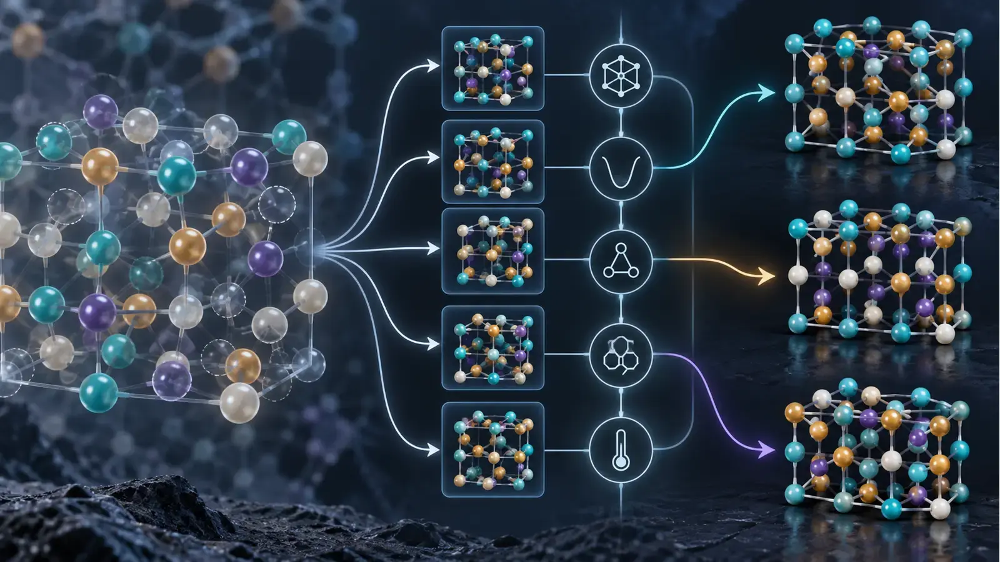
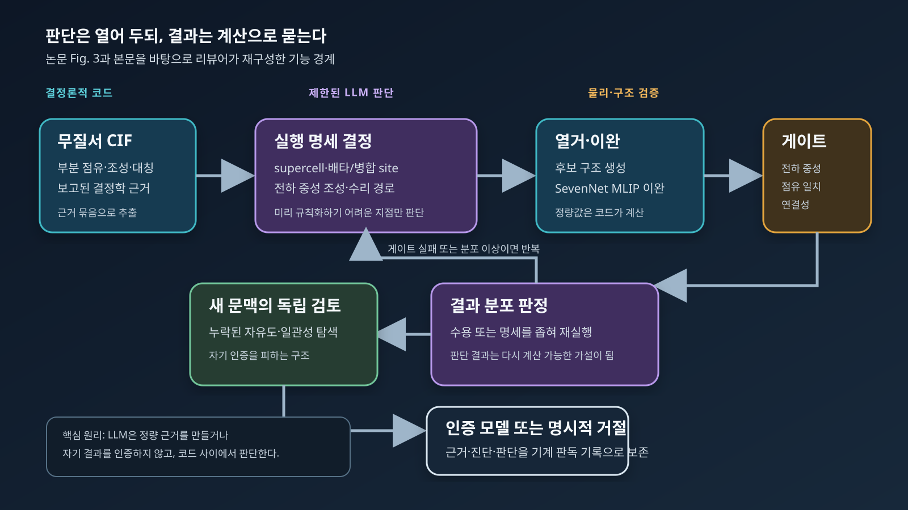

# 계산을 맡기는 다음 단계: 재료과학 ‘에이전트 프로그램’은 무엇을 증명했나

## 3문장 요약

서울대학교 연구진은 2026년 9월 1일 공개한 프리프린트에서, 대규모언어모델(Large Language Model, LLM)을 범용 ‘AI 과학자’로 쓰기보다 **검증 가능한 좁은 과학 업무를 끝까지 맡는 소프트웨어**로 만드는 ‘에이전트 프로그램(agentic program)’ 개념을 제안했다. 사례인 DeMARS는 부분 점유가 포함된 무질서 결정의 결정학정보파일(Crystallographic Information File, CIF)을 읽어 계산 가능한 원자 모델을 만들며, 약 800개 CIF에서 규칙을 축적한 뒤 별도의 100개 CIF를 사람의 실행 개입 없이 처리했다고 보고한다. 그러나 코드는 아직 공개되지 않았고, 100개 중 인증·거절 수와 반복 실행 안정성, 외부 독립 평가가 제시되지 않아 현재 근거는 **유망한 설계 원리와 내부 사례 검증**이지 재현이 끝난 생산 소프트웨어는 아니다.

*그림 1. 이미지 생성으로 만든 개념 일러스트. 왼쪽의 부분 점유 결정, 가운데의 후보 분기와 물리 제약, 오른쪽의 명시적 원자 모델을 표현한다. 특정 물질의 실제 구조, 논문 수치 또는 DeMARS 화면을 재현한 그림은 아니다.*

::: highlight 이번 리뷰의 판정
DeMARS의 가장 중요한 주장은 LLM이 재료 계산을 ‘잘한다’는 것이 아니다. **수치와 물리 검사는 결정론적 코드가 맡고, LLM은 미리 완전히 규칙화하기 어려운 중간 선택만 하며, 그 선택의 결과를 다시 계산으로 반박 가능하게 만든다**는 설계다. 이 주장은 현재 논문의 구조와 사례로 뒷받침되지만, 코드·실행 로그·성공률 분모가 공개될 때까지 일반화 가능성과 재현성은 보류해야 한다.
:::

## 왜 중요한가: 자동화가 멈추는 곳은 계산이 아니라 판단이다

재료 계산은 이미 상당히 자동화되어 있다. VASP·Quantum ESPRESSO 같은 전자구조 코드는 주어진 입력을 계산하고, AiiDA·atomate2·AFLOW·AMP² 같은 workflow 도구는 의존관계와 재시작, 데이터 provenance를 관리한다. 그러나 실제 연구에서 시간이 많이 드는 지점은 종종 계산 명령 자체가 아니다. 어떤 supercell이 분수 점유와 정합적인지, 서로 가까운 두 site가 동시에 점유될 수 있는지, 결함의 전하상태를 어떻게 정할지, self-consistent field 계산이 실패했을 때 수치 설정을 바꿀지 물리 모델을 의심할지 같은 선택은 아직 연구자의 판단에 남아 있다.

기존 자동화는 명확한 규칙을 코드로 써야 한다. 반대로 범용 LLM 에이전트에 전체 업무를 맡기면 유연성은 생기지만, 같은 입력에서 다른 결론을 내리거나 그럴듯한 설명으로 잘못된 구조를 통과시킬 수 있다. 이번 논문은 그 사이에 좁은 길을 제안한다. LLM을 계산기의 대체재로 쓰는 것이 아니라 **정해진 입출력과 물리 제약 사이에 남아 있는 불완전한 결정 규칙**을 담당시키는 것이다.

이 글은 5월의 [「AI 과학자, 시작의 끝에서」](https://infant83.github.io/AI_Tech_Review/reviews/2026-05-23_ai-scientist-execution-harness/)를 반복하지 않는다. 당시 리뷰가 가설 생성부터 논문 작성까지 넓은 연구 하네스의 검증 문제를 다뤘다면, 이번 연구는 그 반대 방향을 택한다. 자율성의 범위를 넓히기보다, **하나의 책임을 충분히 좁혀 routine production에서 사람을 빼낼 수 있는가**를 묻는다.

## 먼저 정의할 용어

- **결정학정보파일(Crystallographic Information File, CIF)**: 단위격자, 대칭, 원자 위치, 원소와 점유율을 담는 표준 구조 파일이다.
- **부분 점유(partial occupancy)**: 결정학적으로 하나의 평균 site에 특정 원소가 0과 1 사이의 확률로 존재한다고 기술된 상태다. 전자구조 계산에는 보통 정수 개의 원자를 가진 명시적 supercell 모델이 필요하다.
- **무질서 결정(disordered crystal)**: 치환, vacancy, interstitial 또는 서로 결합된 점유 규칙 때문에 하나의 주기적 원자배열로 바로 환원되지 않는 결정이다.
- **머신러닝 원자간 퍼텐셜(Machine-Learning Interatomic Potential, MLIP)**: 제일원리 계산으로 학습한 에너지와 힘을 빠르게 근사해 많은 후보 구조를 이완하는 모델이다. DeMARS는 SevenNet 계열 universal MLIP을 사용했다고 보고한다.
- **에이전트 하네스(agent harness)**: LLM에 파일, 코드 실행, 지속 메모리, 기술 규칙, 별도 검토 역할을 연결하는 실행 환경이다.
- **에이전트 프로그램(agentic program)**: 저자들의 정의로는 입력·목표·허용 도구·과학 제약·검증 기준이 정해진 하나의 bounded task를, 결정론적 알고리즘과 제한된 LLM 판단을 결합해 끝까지 수행하는 프로그램이다.

## 무질서 CIF가 왜 ‘판단이 필요한 계산’인가

부분 점유 CIF를 density functional theory(DFT) 입력으로 바꾸는 일을 단순히 vacancy를 임의 배치하는 문제로 보면 중요한 화학을 놓친다. 논문이 든 $\mathrm{Ca}_{1-x}\mathrm{Th}_{x}\mathrm{F}_{2+2x}$의 $x=0.18$ 사례에서는 $\mathrm{Ca}^{2+}$를 $\mathrm{Th}^{4+}$로 하나 바꿀 때 양전하가 2만큼 늘어난다. 따라서 전하 중성을 유지하려면 Th 하나당 $\mathrm{F}^{-}$ 두 개가 추가되어야 하며, $2+2x=2.36$은 보고 조성과 일치한다. 이 산술은 간단하지만, 추가 F를 어느 interstitial에 놓고 어떤 점유가 서로 배타적인지 결정하려면 결정 구조와 국소 화학을 함께 읽어야 한다.

논문은 ICSD(Inorganic Crystal Structure Database) 항목의 약 절반이 무질서 구조로 보고되며, 그중 약 60%는 비교적 단순한 치환형 고용체라고 선행 연구를 인용한다. 나머지 복잡한 경우는 각 부분 점유 site를 독립적으로 열거하면 조성·전하·국소 연결성이 깨지거나 조합 수가 폭증한다. 이때 필요한 것은 더 많은 brute-force sampling이 아니라 **무엇을 열거해야 하는지 정의하는 모델 선택**이다.

DeMARS라는 이름은 De-averaged Minimal Atomistic Representation System의 약자다. 목표는 실험의 평균 구조를 유일한 ‘실제 구조’로 복원하는 것이 아니다. 원 CIF의 근거와 화학 규칙을 만족하면서 후속 원자 시뮬레이션에 사용할 수 있는 최소 원자 모델 또는 구조 ensemble을 만드는 것이다. 이 구분이 중요하다. 회절 refinement의 부분 점유는 실제 재료의 공간·시간적 무질서를 평균낸 표현이므로, 하나의 작은 periodic cell이 모든 disorder correlation을 재현한다고 보장할 수 없다.

## 핵심 방법: LLM을 코드 사이에 가둔다

논문이 설명한 DeMARS 흐름은 다음과 같다.

1. 결정론적 Python 코드가 CIF에서 조성, 부분 점유, 대칭과 site 정보를 추출해 구조화된 evidence bundle을 만든다.
2. LLM analyst는 그 근거를 읽고 supercell 크기, 합치거나 배타적으로 취급할 site, 전하 중성 조성, 누락 수소의 수리 또는 custom construction 필요 여부를 실행 명세로 만든다.
3. 열거 엔진이 후보 배치를 만들고 SevenNet MLIP으로 구조를 이완해 에너지 분포를 계산한다.
4. 코드가 전하 중성, 원 CIF 점유와의 일치, polyanion 연결성 등 미리 정의한 검사를 수행한다. energy above hull은 해석 정보로 계산하지만 pass/fail 기준으로 쓰지 않는다고 명시한다.
5. analyst가 구조와 에너지 분포를 보고 수용하거나 더 좁은 명세로 재실행한다.
6. 별도 reviewer agent가 새 문맥에서 최종 기록을 반대 관점으로 점검한다.
7. 프로그램은 인증된 모델을 내거나, 근거가 충분하지 않다면 이유와 함께 인증을 거절한다.

*그림 2. 논문의 Fig. 3과 본문을 바탕으로 리뷰어가 다시 그린 기능 구조도. 파란색은 결정론적 계산, 보라색은 LLM 판단, 주황색은 물리·구조 검사다. 원 논문의 실행 로그나 정량 성능을 재현한 도표가 아니다.*

이 구조의 핵심은 “LLM에게 물리를 가르쳤다”가 아니다. LLM은 정량 근거를 생성하지 않고, 자신의 결과를 최종 인증하지도 않는다. 코드가 제공한 근거를 해석해 계산 가능한 명세를 만들고, 그 명세의 결과는 다시 독립적인 코드에 의해 검사된다. 저자들의 표현을 바꾸어 말하면 판단은 신뢰의 대상이 아니라 **검사 가능한 가설 생성기**다.

## 기존 workflow·AI assistant와 무엇이 다른가

| 시스템 형태 | 사람이 맡는 일 | 소프트웨어가 맡는 일 | 실패를 잡는 방식 | 생산 단계의 사람 |
|---|---|---|---|---|
| 전통적 workflow | 모든 판단 규칙 정의 | 정해진 알고리즘 반복 | 예외 처리·단위 테스트 | 새 예외에서 필요 |
| 대화형 AI assistant | 질문·선택·최종 승인 | 설명·코드 제안 | 사용자의 검토 | 항상 loop 안 |
| 범용 AI scientist | 연구 목표와 감독 | 가설부터 글쓰기까지 넓은 탐색 | 일반 evaluator·peer review | 범위에 따라 다름 |
| 논문이 제안한 agentic program | 목표·책임·원칙 정의, 새 실패를 제도화 | bounded task의 routine execution | task-specific deterministic gate와 별도 reviewer | 성숙 후 routine loop 밖 |

새로운 것은 개별 부품이 아니다. tool-using agent, MLIP, verification checklist, reviewer agent, version control은 이미 존재한다. 논문이 제안하는 차이는 이들을 **완전 위임 가능한 좁은 과학 책임**이라는 소프트웨어 단위로 묶는 데 있다. 범용 에이전트의 capability를 계속 넓히는 대신, 성공과 실패를 판정할 수 있을 만큼 업무를 작게 만든다.

이 관점은 MLOps와 DevOps의 오래된 원리와도 닮았다. production system은 모든 입력에서 답을 억지로 내기보다 입력 계약을 검사하고, 지원하지 않는 경우 fail closed하며, 회귀 테스트와 version pinning으로 변경을 통제한다. 다만 과학 프로그램에서는 correctness가 단순한 API schema를 넘어 물리 모델의 타당성까지 포함하므로, deterministic gate가 모든 오류를 잡을 수 있다는 전제는 위험하다.

## 정량 결과: 무엇이 보고되었고 무엇이 빠졌나

논문이 제시한 가장 큰 규모의 근거는 두 숫자다.

- 개발 과정에서 **약 800개의 무질서 CIF**를 다루며 반복되는 판단을 규칙, 진단, 검증 게이트와 결정론적 코드로 옮겼다.
- 성숙 과정에 쓰지 않은 **무작위 100개 CIF**를 별도로 선택해 end-to-end로 처리했고, 실행 도중 case-by-case human intervention은 없었다고 보고한다. 표본은 원소 3–5개, nontrivial site disorder, CIF에 기재된 site 40개 이하라는 조건을 가진다.

저자들은 100개 출력 모두를 사후 수동 검사했으며, 인증된 모델은 화학적으로 합리적이고 보고 disorder와 일관됐고, 인증을 거절한 경우에는 기록의 근거로 이유를 확인할 수 있었다고 적었다. 여기서 주의할 점은 “100개를 처리했다”와 “100개 모두 구조를 인증했다”가 같지 않다는 것이다. 논문은 인증 수, 거절 수, custom construction 수, model repair 수를 나누어 제시하지 않는다.

또 하나의 유용한 실패 사례는 $\mathrm{Sr}_2\mathrm{LiMoO}_{5.5}$이다. 기존 deterministic gate를 모두 통과했지만 reviewer agent가 모든 후보에 같은 cation arrangement만 존재한다는 사실을 발견했다. coupled-enumeration routine의 ordering이 Li/Mo anti-site disorder 자유도를 실제로 sampling하지 못한 것이 원인이었고, 이를 수정해 영구적인 회귀 개선으로 만들었다고 보고한다. 이 사례는 reviewer가 단순한 문장 교정기가 아니라 **탐색 공간이 의도대로 열렸는지 검사하는 역할**임을 잘 보여준다.

| 항목 | 원문이 보고한 사실 | 이번 리뷰의 독립 점검 | 아직 알 수 없는 것 |
|---|---|---|---|
| 공개 시점 | arXiv v1, 2026-09-01 | arXiv metadata와 HTML 확인 | 동료평가 후 변경될 내용 |
| 성숙 자료 | 약 800개 disordered CIF | 본문 수치와 사례 일관성 확인 | case별 입력·출력·intervention log |
| 외부 테스트 | 미사용 100개 CIF, 실행 중 사람 개입 없음 | 표본 조건과 사후 수동검사 문장 확인 | 인증/거절 분모, task success rate, 소요시간·LLM 비용 |
| 물리 예시 | $2+2(0.18)=2.36$ | 전하 보상 산술 재계산 | 실제 disorder correlation의 유일성 |
| 소프트웨어 | DeMARS architecture 설명 | 공개 소스 없음 확인 | 재실행 안정성, model/version 민감도, 환경 재현성 |

## 가장 큰 한계: 좋은 설계와 검증된 제품은 다르다

첫째, 논문은 프리프린트다. 동료평가를 거치지 않았고 DeMARS 코드는 “peer-reviewed version 출판 시 공개”될 예정이라고만 명시한다. 따라서 제3자가 동일 CIF를 넣어 같은 구조, 같은 거절 판단, 같은 계산 비용을 얻는지 확인할 수 없다.

둘째, 100개 test set의 핵심 분모가 없다. 인증률, 거절률, 오류 유형, 재시도 횟수, 사람 사후검사 기준과 평가자 일치도, baseline 대비 개선을 알 수 없다. ‘화학적으로 합리적’이라는 판정은 중요하지만, blind external reviewer나 독립 계산과의 비교가 아니며 정량 metric도 아니다.

셋째, 결과의 비결정성이 측정되지 않았다. 동일한 CIF를 같은 모델과 다른 random seed로 여러 번 실행했을 때 실행 명세와 최종 구조 ensemble이 얼마나 달라지는지, LLM을 교체하거나 version이 올라갈 때 regression이 생기는지 보고하지 않는다. 저자들도 model·skills·episode record를 함께 versioning하고 지속적으로 audit해야 한다고 인정한다.

넷째, MLIP 검증 경계가 남는다. universal MLIP은 많은 episode를 싸게 만드는 핵심이지만, training distribution 밖의 coordination, charge state, heavy element 또는 unusual bonding에서 에너지 ordering이 틀릴 수 있다. 구조·조성 게이트를 모두 통과해도 DFT 수준의 상대 안정성이나 실제 disorder thermodynamics가 맞는 것은 아니다.

다섯째, 최소 periodic model이 실험의 disorder를 대표한다는 보장은 없다. short-range order, configurational entropy, finite-temperature occupancy, diffuse scattering을 연구하려면 단일 구조보다 ensemble과 크기 수렴성이 필요할 수 있다. DeMARS는 좋은 starting model을 만들 수 있지만, 실험 평균 구조의 유일한 microscopic inverse를 복원했다고 읽어서는 안 된다.

## 재료 계산과 산업 연구에서의 시사점

김현중 연구자의 DFT·OLED·agentic workflow 관점에서 가장 직접적인 교훈은 ‘모든 연구를 하는 agent’를 먼저 만들지 말라는 것이다. 다음과 같이 **입력과 deliverable이 분명하지만 중간 판단이 반복되는 일**이 더 적합하다.

1. **DFT protocol steward**: 구조·원소·목표 물성에서 PAW/pseudopotential, cutoff, $k$-mesh, smearing, spin·SOC 설정을 제안하되, convergence test와 symmetry·magnetic-state 검사로 결과를 인증한다.
2. **계산 실패 진단 프로그램**: SCF oscillation, charge sloshing, geometry blow-up을 로그에서 분류하고 제한된 수정만 허용하며, 에너지·force·occupation 회귀 검사를 통과하지 못하면 중단한다.
3. **defect/interface builder**: 가능한 termination, charge compensation, passivation을 제안하고 stoichiometry·neutrality·minimum-distance·symmetry·finite-size 기준을 코드로 검사한다.
4. **OLED excited-state triage**: state character, oscillator strength, spin–orbit coupling, root flipping과 conformer dependence를 묶어 TDDFT/TDA 결과의 재계산 필요 여부를 판정한다. 최종 rate나 기작은 계산 로그와 state tracking이 뒷받침할 때만 인증한다.
5. **on-premises research operations**: LLM은 사내 gateway에서 판단하고 VASP/Gaussian/Fortran job은 기존 scheduler와 GitLab runner가 실행한다. 입력·output hash, container/compiler, code commit, model version, skill version과 gate 결과를 하나의 evidence record로 남긴다.

산업 조직에서는 ‘사람을 loop에서 제거’라는 문장을 인력 대체로 읽기보다 책임 경계로 읽어야 한다. routine run은 자동화하되, 새로운 failure class가 발견되면 사람이 원칙을 승인하고 code·test·doctrine을 업데이트한다. 이때 중요한 운영 metric은 대화 횟수가 아니라 다음과 같다.

- certification coverage: 전체 입력 중 프로그램이 인증한 비율
- false certification rate: 사후 고급 계산·실험에서 잘못된 인증으로 판정된 비율
- justified refusal rate: 거절이 실제로 근거 부족 또는 지원 범위 밖이었던 비율
- intervention rate: routine batch에서 사람 개입이 필요했던 case 비율
- repeatability: 동일 입력 반복 실행의 구조·판정 일치도
- cost-to-certify: case당 LLM token, MLIP/DFT GPU·CPU 시간, wall-clock과 재시도 횟수

## 후속 연구에서 꼭 보고 싶은 검증

가장 설득력 있는 다음 논문은 더 큰 언어모델을 쓰는 연구가 아니라 다음 실험을 공개하는 연구다.

1. 고정된 100개 test CIF의 ID와 인증·거절 outcome을 공개한다.
2. 규칙 기반 baseline, 일반 tool-using agent, DeMARS를 같은 입력·계산 budget에서 비교한다.
3. 각 CIF를 5–10회 반복해 실행 명세, 최종 구조 cluster, 인증 결과의 분산을 제시한다.
4. SevenNet screening 뒤 일부를 DFT로 재이완해 구조·에너지 ordering의 보존률을 측정한다.
5. 외부 결정학자와 계산재료 연구자가 blind rubric으로 결과를 평가하고 합의도를 보고한다.
6. code·skill·model version을 고정한 재현 package와, version 변경 전후 regression suite를 공개한다.
7. 성공한 구조만이 아니라 refusal과 failure artifact도 남겨 어떤 범위에서 프로그램을 믿지 말아야 하는지 보여준다.

## 관련 연구자와 초청 세미나 질문

- **Seungwu Han — 서울대학교 재료공학부·첨단재료연구소, KIAS AI and Natural Sciences Center.** DeMARS의 교신저자이며 SevenNet·자동 원자 시뮬레이션 연구를 이끌어 왔다. 질문: “100개 test set에서 인증·거절·custom construction의 분모와 반복 실행 분산을 어떤 공개 benchmark로 만들 계획인가?”
- **Yunsung Lim — 서울대학교 첨단재료연구소.** 논문의 공동 제1저자로 agentic program 개념과 DeMARS 사례를 제시했다. 질문: “에피소드에서 얻은 판단을 skill, doctrine, deterministic code 중 어디로 옮길지 결정하는 기준과 rollback 절차는 무엇인가?”
- **Haekwan Jeon — 서울대학교 재료공학부.** 공동 제1저자로 DeMARS 개발에 참여했다. 질문: “부분 점유의 최소 원자 모델이 충분하지 않고 ensemble·short-range order가 필요한 경우를 어떤 gate가 탐지하는가?”

## 관찰할 질문

- 코드는 동료평가 논문과 함께 실제로 공개되는가?
- held-out 100개 CIF의 상세 outcome과 실행 비용이 공개되는가?
- 다른 LLM·하네스에서도 같은 bounded responsibility와 gate를 유지할 수 있는가?
- ICSD 외 공개 데이터셋과 독립 연구팀 평가에서 false certification이 얼마나 되는가?
- DFT, phonon, defect thermodynamics까지 이어질 때 어느 지점에서 MLIP gate가 부족해지는가?
- 연구 조직이 episode를 개인의 대화 기록이 아니라 versioned scientific software asset으로 관리할 수 있는가?

## 결론

이번 논문은 ‘AI가 과학자를 대체하는가’보다 훨씬 실용적인 질문을 던진다. **과학자가 반복해서 내리는 좁은 판단 하나를, 어디까지 소프트웨어의 책임으로 바꿀 수 있는가?** DeMARS의 답은 알고리즘과 판단을 섞되, LLM을 근거 생성자나 자기 인증자로 두지 말고 결정론적 코드 사이의 bounded decision maker로 두라는 것이다.

이 설계는 계산재료과학과 잘 맞는다. 입력과 산출물이 비교적 명확하고, 조성·대칭·전하·힘·에너지처럼 계산 가능한 제약이 많으며, MLIP이 반복 episode의 비용을 낮추기 때문이다. 동시에 바로 그 이유로 검증 기준도 높아야 한다. 코드를 공개하고, 인증·거절의 분모를 밝히며, 반복성과 외부 평가를 통과할 때 ‘agentic program’은 흥미로운 개념에서 신뢰할 수 있는 새로운 과학 소프트웨어 범주로 넘어갈 수 있다.

## 참고자료

1. Y. Lim, H. Jeon, J. Kim, J. Kim, S. Han, [“Agentic programs: an emerging form of scientific software in computational materials science,” arXiv:2609.00795v1 (1 September 2026)](https://arxiv.org/abs/2609.00795). **이번 리뷰의 주 출처; 프리프린트; DeMARS 코드는 아직 미공개.**
2. D. Antypov et al., [“Classification and statistical analysis of structural disorder in crystalline materials,” *Journal of Applied Crystallography* 58, 659–677 (2025)](https://doi.org/10.1107/S1600576725003000). **ICSD disorder 분류의 근거.**
3. A. M. Ganose et al., [“atomate2: modular workflows for materials science,” *Digital Discovery* 4, 1944–1973 (2025)](https://doi.org/10.1039/D5DD00019J). **결정론적 workflow automation 비교 맥락.**
4. Y. Park et al., [“A robust agentic framework for expert-level automation of atomistic simulations,” arXiv:2606.09422 (2026)](https://arxiv.org/abs/2606.09422). **같은 연구 생태계의 원자 시뮬레이션 에이전트 선행 연구.**
5. J. Kim et al., [“Optimizing cross-domain transfer for universal machine learning interatomic potentials,” *Nature Communications* 17, 3432 (2026)](https://doi.org/10.1038/s41467-026-70195-8). **DeMARS가 활용한 SevenNet 계열 MLIP의 배경.**
6. J. Gottweis et al., [“Accelerating scientific discovery with Co-Scientist,” *Nature* 655, 487–496 (2026)](https://doi.org/10.1038/s41586-026-10644-y). **넓은 AI co-scientist 접근과의 비교.**
7. Google Research, [“Science One Framework: A verifiable autonomous research framework via Chain-of-Evidence” (30 July 2026)](https://research.google/blog/science-one-framework-a-verifiable-autonomous-research-framework-via-chain-of-evidence/). **주장–코드–로그 연결과 독립 재실행의 비교 기준.**
8. Z. Chen et al., [“An agentic artificially intelligent X-ray scientist,” *Nature Machine Intelligence* 8, 1075–1086 (2026)](https://doi.org/10.1038/s42256-026-01261-5). **virtual instrument에서 real beamline으로 옮긴 human-relay 안전 경계의 비교 사례.**

---

*근거 기준일: 2026년 9월 6일. 논문의 800·100개 수치와 architecture는 저자 보고이며 이 리뷰가 DeMARS를 재실행한 결과가 아니다. 독립 점검은 arXiv 게시 정보, 본문 내부 수치·화학식의 일관성, 코드 공개 상태, 인용된 공식·동료평가 자료와 공개 페이지 렌더링에 한정된다. 적용 제안과 운영 metric은 편집자 해석이다.*
