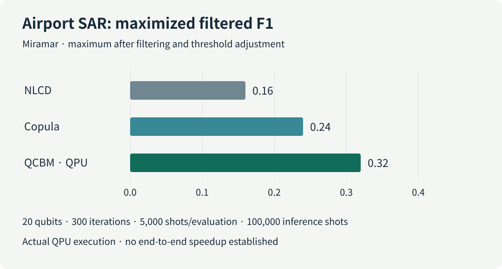
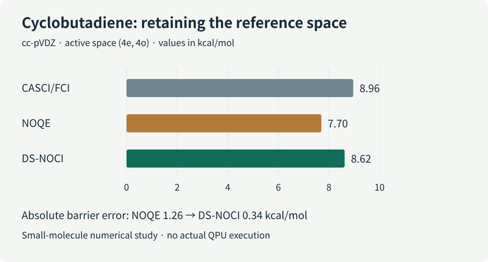

# Designing the full cost of quantum computation

A researcher choosing a quantum algorithm for molecular energies or industrial classification must meet an accuracy target within a limited computing budget. A shorter circuit can require expensive input preparation. A promising prediction can demand thousands of repeated measurements. An error-corrected device also spends space and time keeping logical qubits available while they wait. **Which resource improved, and does that improvement survive the complete workflow?**

This review connects six updates from the September 9 briefing: error-corrected compilation, satellite and power-grid machine learning, molecular reference states, hardware fabrication, and forthcoming industrial presentations. All four research papers are preprints. Their results establish different things, so their resource estimates, hardware experiments, simulations, and roadmap claims remain separate below.

*Figure 1. Space, input data, repeated samples and reference models belong in the same planning discussion. This conceptual illustration depicts no particular device or experimental dataset.*

::: highlight The central question
Evaluate quantum computation through architecture space and time, useful input information, measurement budgets and classical reference states together.
:::

[Download the five-page Korean briefing](daily_quantum_brief_2026-09-09.pdf) · [한국어 리뷰](https://infant83.github.io/AI_Tech_Review/reviews/2026-09-09_quantum-resource-aware-workflows/)

## 1. What is being counted?

**Circuit depth** counts sequential layers after compatible gates are placed in parallel. It differs from gate count and from physical duration. **Shots** are repeated circuit executions and measurements used to obtain samples. A **quantum processing unit (QPU)** must supply enough of them for a statistically useful result.

| Update | Execution or validation setting | Result unit | Other costs to record |
|---|---|---|---|
| Fermi–Hubbard compilation | Classical compilation and fault-tolerant resource estimation | Active volume; Toffoli count | Logical blocks, idle space, code cycles, preparation |
| SAR change detection | Selected training and inference on an IonQ QPU | Maximized filtered F1 | Evaluations, shots, classical image processing |
| Power-grid QML | Noiseless analytic circuit simulation | Balanced accuracy | Encoding, finite shots, postselection success |
| DS-NOCI chemistry | Classical numerical tests and synthetic noise | Barrier error | Reference construction, matrices, subspace size |
| Superion 256 | Fabrication and prototype announcement | Development milestone | Concurrent operation, system error, applications |
| Qubits Asia | Forthcoming industrial presentations | Event and application agenda | Problem size, classical baseline, elapsed time |

Circuit optimization spans problem formulation, high-level synthesis, rewriting, routing, native gates, pulses and error-correction scheduling. Active-volume compilation is one architecture-aware example. It can be placed alongside Classiq synthesis and AshN native-gate design without implying that these exhaust the field or that this paper compared them directly.

## 2. Compiling the space used by operations

**[Preprint · resource estimation] Harriet Apel et al. First posted September 4, 2026.**

The Fermi–Hubbard model represents interacting electrons moving on a lattice. **Quantum phase estimation (QPE)** reads energy from a time-evolution phase; decomposing that evolution creates a large circuit. In an error-corrected architecture, reducing expensive Toffoli operations helps, but other operations and waiting resources still matter.

The paper measures **active volume** through logical blocks used for computation, distinct from idle volume and total device spacetime. Architecture-aware compilation reduces this volume by up to **3.9×** over prior non-Clifford-focused circuits across square lattices with (L=4) to (20). At (L=20), Toffoli count falls by about **2×**. These are different metrics; their factors must not be multiplied into a runtime claim. [Primary paper](https://arxiv.org/html/2609.05316v1)

There is no fault-tolerant QPU execution. Runtime projections depend on code cycles, feedforward latency and failure assumptions. For materials work, fix the Hamiltonian and target energy error, then compare architecture costs while recording initial-state preparation separately.

## 3. Satellite imagery: learning a distribution on a QPU

**[Preprint · includes actual QPU execution] Samwel K. Sekwao et al. First posted September 4, 2026.**

**Synthetic aperture radar (SAR)** change detection estimates the later image expected if nothing had changed. Sparse observations make that background estimate unreliable. A **quantum circuit Born machine (QCBM)** generates samples from its measurement distribution. Here it learns dependence between two image intensities in copula space, separating dependence from individual intensity distributions.

A selected airport configuration used **20 IonQ qubits for both training and inference**: 300 optimization iterations, 5,000 shots per evaluation and 100,000 inference shots. Maximized filtered F1 was **0.32**, versus **0.16** for classical NLCD and **0.24** for a classical copula estimator. F1 combines precision and recall; this is the maximum after filtering and threshold adjustment. [Primary paper](https://arxiv.org/html/2609.05313v1)

*Figure 2. A common zero-based axis compares the reported airport results. It does not represent training speed or performance across all scenes.*

On volcanic **interferometric SAR (InSAR)** data, all three methods reached approximately 0.66. The study establishes hardware feasibility with scene-dependent improvements, without an elapsed-time advantage. Industrial defect detection would need matched preprocessing and stronger classical generative baselines.

## 4. Power-grid learning: useful information in added qubits

**[Preprint · noiseless simulation] Sang Hyub Kim et al. First posted September 4, 2026.**

A foundation model converts long sensor sequences into high-dimensional features. Compressing those features into a small quantum register can discard useful information. This study uses Chronos representations for power-grid event classification and adds small **wing modules** that carry new input to a fixed core.

Balanced accuracy, the average recall across classes, rose from **83.6%** with a 12-qubit core plus one postselection qubit to **85.2%** with two wings and 19 qubits in total. Enlarging a circuit without supplying new information did not help. A separate matched-input comparison against a larger classical multilayer perceptron reported **1.7–2.0 percentage points** of improvement. [Primary paper](https://arxiv.org/html/2609.05408v1)

Every circuit used **noiseless analytic simulation without finite shots**. A small held-out test set showed a 4–5-point generalization gap. Physical encoding, sampling and postselection costs remain untested. For molecular or OLED learning, track which features survive compression and give the same inputs to classical models before attributing gains to additional qubits.

## 5. Chemistry: retain a useful classical reference

**[Preprint · numerical tests and synthetic noise] Vibin Abraham et al. First posted September 3, 2026.**

Molecular wavefunctions may require several electronic configurations. **Nonorthogonal configuration interaction (NOCI)** combines reference states that need not be orthogonal. If approximate correlated states are poor, relying on them alone can damage the result.

**Dual-space NOCI (DS-NOCI)** retains classical references alongside correlated companions in one variational space. With exact Hamiltonian and overlap matrices, that space includes the original solutions. Noisy matrix estimates do not automatically preserve this variational guarantee.

For the cyclobutadiene barrier in a four-electron, four-orbital active space, the reference barrier was **8.96 kcal/mol**. Error decreased from **1.26 kcal/mol** for NOQE to **0.34 kcal/mol** for DS-NOCI. [Primary paper](https://arxiv.org/html/2609.04387v1)

*Figure 3. The comparison shares one small active-space reference. It is not a large-molecule or actual-QPU result.*

Validation uses small molecular calculations and modeled perturbations. For OLED chemistry, retaining a useful reference while adding correlation is a research direction; active-space choice, overlap conditioning, preparation and matrix-measurement costs still need assessment.

## 6. Hardware and industrial deployment milestones

**[Industry/product · roadmap] IonQ Superion 256. Announced September 8, 2026.** IonQ reported first integrated-chip fabrication and initial ion trapping in prototypes, targeting deliveries in **2027**. The announcement does not establish concurrent 256-qubit operation, complete-system fidelity, repeated error correction or an application benchmark. Earlier control fidelity cannot be assigned to the full Superion system. [Official announcement](https://www.ionq.com/news/ionq-launches-superion-product-line-industry-leading-upgradeable-platform-designed-to-scale-manufacturable-fault-tolerant-quantum-computing)

**[PoC/event preview] D-Wave Qubits Asia. October 28, 2026, Seoul.** The event provides a place to examine telecommunications, port scheduling, imaging and semiconductor optimization applications. An application agenda starts the evaluation: problem size, incumbent solvers, QPU time and classical postprocessing determine what the eventual demonstrations establish. The page was checked on September 9; the event date is not a research publication date. [Official event page](https://qubitsasia26.dwavequantum.com/)

## 7. A practical research record

The following is this review's proposed evaluation record, not a shared conclusion asserted by the source authors.

| Workflow | Keep matched | Record alongside the headline |
|---|---|---|
| Electronic structure / OLED | Geometry, basis, active space, target error | References, barrier error, preparation, matrix measurements |
| Quantum / classical ML | Features, data splits, preprocessing, selection rules | Seeds, shots, acceptance, training and inference time |
| Circuit / oracle optimization | Function, accuracy, qubit budget, target device | Depth, two-qubit gates, ancillas, movement, idle and active volume |
| Industrial optimization | Instances, constraints, time allowance | Feasibility, repaired solution cost, QPU/CPU time, stability |

For a materials workflow, a useful next experiment starts with a familiar small molecule and a fixed classical reference. It then measures whether the candidate circuit changes the target observable and complete execution cost. Keeping circuit savings, predictive improvement and operational benefit in the same record makes technology choices easier to justify.

## 8. Sources and verification

| Source | First public date | Status |
|---|---|---|
| [Apel et al., arXiv:2609.05316](https://arxiv.org/abs/2609.05316) | September 4, 2026, v1 | Preprint |
| [Sekwao et al., arXiv:2609.05313](https://arxiv.org/abs/2609.05313) | September 4, 2026, v1 | Preprint |
| [Kim et al., arXiv:2609.05408](https://arxiv.org/abs/2609.05408) | September 4, 2026, v1 | Preprint |
| [Abraham et al., arXiv:2609.04387](https://arxiv.org/abs/2609.04387) | September 3, 2026, v1 | Preprint |
| [IonQ Superion announcement](https://www.ionq.com/news/ionq-launches-superion-product-line-industry-leading-upgradeable-platform-designed-to-scale-manufacturable-fault-tolerant-quantum-computing) | September 8, 2026 | Company announcement |
| [D-Wave Qubits Asia](https://qubitsasia26.dwavequantum.com/) | Event: October 28, 2026 | Checked September 9; event preview |

Metrics, platforms and comparison conditions were checked against primary sources. The computations were not independently reproduced. No item is presented as a newly accepted AI-conference main paper. No newly validated LinkedIn technical signal was added; public search does not provide complete feed monitoring.

The public Korean PDF corrects the opening description of optimization targets, the SAR paper's first-author attribution, and the qualification of maximized filtered F1. Its cost chart now compares like-for-like active volume rather than combining factors from different comparisons. Principal numerical results and platform distinctions are preserved.
