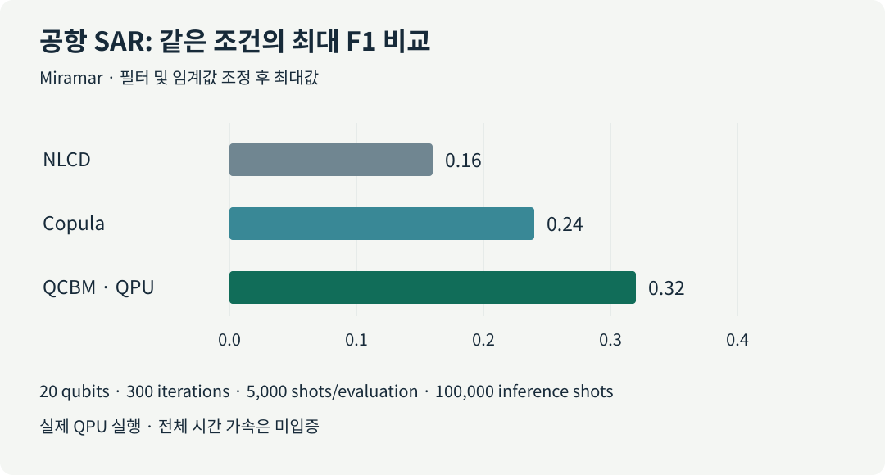
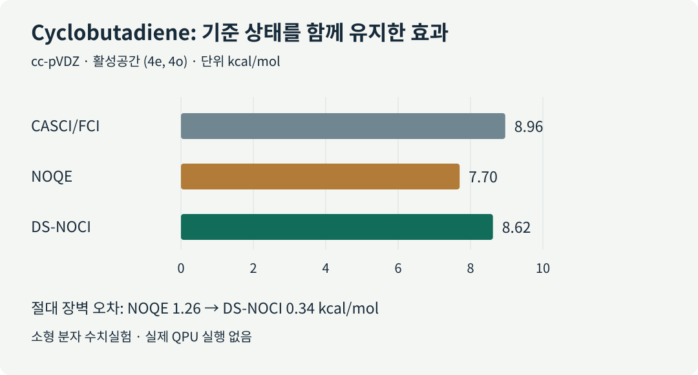

# 양자 계산의 전체 비용을 설계하다

분자의 에너지를 계산하거나 산업 데이터를 분류하는 양자 알고리즘을 고를 때, 연구자는 제한된 장비 시간과 정확도 목표를 함께 맞춰야 합니다. 회로가 짧아져도 입력을 준비하는 비용이 커질 수 있고, 좋은 예측값을 얻으려면 같은 회로를 수천 번 반복해야 할 수도 있습니다. 오류정정 장치에서는 연산을 기다리는 논리 큐비트까지 공간과 시간을 차지합니다. **어느 자원을 줄였으며, 그 절감이 전체 작업의 개선으로 이어지는가**를 확인해야 하는 이유입니다.

9월 9일 브리핑의 여섯 업데이트를 이 질문으로 다시 읽어봅니다. 오류정정 회로 컴파일, 위성영상과 전력망의 양자 머신러닝, 분자 계산의 기준 상태, 장치 제작과 산업 실증 예고를 다룹니다. 각 분야의 배경부터 살펴보고 실제로 확인된 결과와 다음 검증 과제를 연결합니다. 학술 항목 네 건은 모두 동료평가 전 프리프린트입니다.

*그림 1. 양자 계산에 필요한 공간, 입력 데이터, 반복 표본, 기준 모델을 함께 생각하기 위한 개념도입니다. 특정 장치나 실험 데이터를 재현한 그림은 아닙니다.*

::: highlight 오늘의 한 문장
실용적인 양자 계산을 평가하려면 회로의 공간·시간 비용, 유용한 입력 정보, 샷 예산과 고전 기준 상태를 함께 최적화해야 합니다.
:::

[5쪽 한국어 PDF 브리핑 내려받기](../artifacts/daily_quantum_brief_2026-09-09.pdf) · [English review](https://infant83.github.io/AI_Tech_Review/reviews/2026-09-09_quantum-resource-aware-workflows/en/)

## 1. 어떤 비용을 세고 있는가

**회로 깊이**는 병렬로 실행할 수 있는 게이트를 묶었을 때 남는 순차 단계 수입니다. 게이트 수가 같아도 동시에 수행하는 정도에 따라 깊이가 달라집니다. 실제 장치에서는 게이트 종류별 시간, 큐비트 사이의 이동·연결, 측정과 리셋도 영향을 줍니다. **샷(shot)**은 회로를 실행하고 측정해 표본 하나를 얻는 반복 단위입니다. 양자 처리장치인 **QPU(quantum processing unit)**에서 한 번 좋은 값을 얻는 것과 충분히 신뢰할 통계량을 만드는 것은 서로 다른 비용을 요구합니다.

| 이번 업데이트 | 계산·검증 위치 | 핵심 결과의 단위 | 함께 확인할 비용 |
|---|---|---|---|
| Fermi–Hubbard QPE 컴파일 | 고전 컴파일·오류정정 자원 추정 | active volume, Toffoli 수 | 논리 블록, 대기 공간, 코드 주기, 상태 준비 |
| SAR 변화 탐지 | 일부 학습·추론을 실제 IonQ QPU에서 수행 | 필터·임계값 조정 후 최대 F1 | 회로 평가 수, shots, 고전 영상 처리 |
| 전력망 QML | 무잡음·해석적 회로 시뮬레이션 | 균형 정확도 | 입력 인코딩, 유한 shots, 선택 측정의 성공률 |
| DS-NOCI 분자 계산 | 고전 수치실험·모의 잡음 | 반응장벽 오차 | 기준 상태, 행렬 측정, 부분공간 크기 |
| Superion 256 | 칩 제작·프로토타입 발표 | 제작 및 초기 이온 포획 단계 | 동시 운영 규모, 시스템 오류, 응용 성능 |
| Qubits Asia | 산업 발표를 예고한 행사 | 공개 일정과 발표 주제 | 문제 규모, 고전 기준선, 총 실행시간 |

회로 최적화에는 문제 표현, 고수준 합성, 게이트 재작성, 라우팅, 네이티브 게이트, 펄스, 오류정정 스케줄링 등 여러 연구 축이 있습니다. 이 리뷰의 **active-volume 컴파일은 오류정정 아키텍처를 고려하는 사례**입니다. Classiq의 고수준 합성이나 AshN의 네이티브 게이트 설계와 연결해 생각할 수 있지만, 이들 사이의 직접 성능 비교를 수행한 연구는 아닙니다.

## 2. 게이트 수를 넘어 실제 연산 공간을 줄이는 컴파일

**[프리프린트 · 자원 추정]** Harriet Apel 외, v1 공개 **2026-09-04**.

Fermi–Hubbard 모델은 격자에서 전자가 이동하고 같은 위치의 전자끼리 상호작용하는 다체계의 기본 모델입니다. 바닥상태 에너지를 구하는 **QPE(quantum phase estimation, 양자 위상 추정)**는 시간 진화에 담긴 위상으로 에너지를 읽습니다. 이때 긴 시간 진화를 기본 연산으로 나누는 과정에서 큰 회로가 생깁니다.

오류정정 환경에서는 비싼 Toffoli 게이트의 개수를 줄이는 일이 중요합니다. 그러나 다른 연산이나 대기를 위해 사용하는 공간도 남습니다. 이 논문의 **active volume**은 실제 연산에 투입되는 논리 블록의 누적 비용을 세는 아키텍처 지표입니다. 유휴 블록의 비용과 전체 장치의 시공간 부피는 따로 구분해야 합니다.

연구진은 시간 진화의 순서와 병합, 회전 연산 공유, 페르미온 이동과 ZX 표현의 단순화를 함께 조정했습니다. (L=4)부터 (20)까지의 정사각 격자에서 기존 비-Clifford 비용 중심 회로보다 **active volume을 최대 3.9배 줄였고**, (L=20)에서는 **Toffoli 수도 약 2배 줄였습니다**. 이 값들은 서로 다른 비용 지표입니다. 두 배수를 곱해 실행속도 개선으로 읽을 수 없습니다. [원 논문](https://arxiv.org/html/2609.05316v1)

실제 오류정정 QPU 실행은 없습니다. 실행시간 추정은 코드 주기, 측정 결과에 따른 다음 동작 결정 시간, 허용 실패율 등에 의존합니다. **재료 계산에 주는 의미:** 같은 Hamiltonian과 목표 에너지 오차를 유지한 채, 회로 수치뿐 아니라 실행할 아키텍처까지 맞춰 비교해야 합니다. 초기 상태 준비와 충분한 바닥상태 겹침을 확보하는 비용도 별도로 남겨야 합니다.

## 3. 위성영상: 실제 QPU로 분포를 학습하면 무엇이 좋아지는가

**[프리프린트 · 실제 QPU 포함]** Samwel K. Sekwao 외, v1 공개 **2026-09-04**.

**SAR(synthetic aperture radar, 합성개구레이더)**의 전후 영상을 비교하려면 “변화가 없었다면 두 번째 영상이 어떻게 보였을까”를 추정해야 합니다. 관측 표본이 드문 밝기 구간에서는 단순 통계 추정이 불안정해집니다. 연구진은 두 시점의 밝기 사이 관계를 생성모델로 학습했습니다. **QCBM(quantum circuit Born machine)**은 회로 측정에서 나오는 확률분포로 표본을 생성하는 모델입니다. 여기서는 개별 밝기 분포를 정규화하고 두 변수의 의존 관계를 다루는 copula 공간에서 학습합니다.

공항 자료의 한 설정에서는 **20큐비트 IonQ 회로를 학습과 추론에 모두 사용**했습니다. 최적화 300회, 회로 평가당 5,000 shots, 추론 100,000 shots를 사용했습니다. 필터·임계값 조정 후 최대 F1은 **QCBM 0.32, 고전 NLCD 0.16, 고전 copula 0.24**였습니다. F1은 정밀도와 재현율을 함께 반영하는 지표이며, 일반적인 분류 정확도와 다릅니다. [원 논문](https://arxiv.org/html/2609.05313v1)

*그림 2. Miramar 공항 자료의 해당 비교에서 QCBM이 두 기준선보다 높은 값을 보였습니다. 수치는 필터와 임계값을 조정한 뒤의 최대 F1입니다. 전체 학습시간이나 다른 데이터에 대한 성능을 나타내지는 않습니다.*

간섭 정보를 활용하는 **InSAR(interferometric SAR)** 화산 자료에서는 세 방법이 모두 약 0.66이었습니다. 장면과 분포에 따라 이득이 달랐으며, 총 실행시간·에너지 측면의 양자 가속은 제시되지 않았습니다. **제조·재료 분석에 주는 의미:** 결함 영상이나 공정 이상 탐지에서도 드문 사건의 분포를 얼마나 잘 배우는지 살펴볼 수 있습니다. 적용하려면 고전 생성모델, 동일한 전처리와 임계값 선택 규칙, 추론 비용까지 비교해야 합니다.

## 4. 전력망 QML: 늘어난 큐비트에 유용한 입력이 들어가는가

**[프리프린트 · 무잡음 시뮬레이션]** Sang Hyub Kim 외, v1 공개 **2026-09-04**.

시계열 기반 모델은 센서의 긴 변화를 고차원 특징으로 바꿉니다. 이 특징을 작은 양자회로에 넣으려면 압축해야 하는데, 그 과정에서 분류에 필요한 정보가 사라질 수 있습니다. 연구진은 Chronos의 표현을 이용해 전력망 사건을 분류하고, 기존 회로에 새로운 입력을 전달하는 작은 **wing 모듈**을 붙였습니다.

12큐비트 core와 선택 측정용 1큐비트를 쓰는 구성은 균형 정확도 **83.6%**, 두 wing을 붙인 19큐비트 구성은 **85.2%**였습니다. 균형 정확도는 클래스별 재현율을 평균해 데이터 수가 많은 클래스의 영향을 줄입니다. 새로운 정보 없이 회로만 확대한 비교에서는 이득이 없었습니다. **동일 입력의 더 큰 고전 MLP와 비교한 개선 폭은 1.7–2.0%p**로 별도의 비교입니다. [원 논문](https://arxiv.org/html/2609.05408v1)

모든 회로는 **잡음과 유한 shots가 없는 해석적 시뮬레이션**에서 평가됐습니다. 독립 시험집합에서는 4–5%p의 일반화 격차가 있었고, 실제 QPU의 인코딩·측정·선택 성공률 비용은 남았습니다. **OLED·재료 ML에 주는 의미:** 분자 특징을 양자회로 폭에 맞출 때 어떤 정보가 보존되는지 먼저 확인해야 합니다. 같은 특징을 받은 고전 모델과의 비교가 큐비트 수를 늘리는 실험보다 앞서야 합니다.

## 5. 분자 계산: 좋은 고전 기준 상태를 함께 유지하기

**[프리프린트 · 고전 수치실험·모의 잡음]** Vibin Abraham 외, v1 공개 **2026-09-03**.

분자 전자구조를 근사할 때 하나의 전자 배치만으로 부족한 경우 여러 상태를 섞어 사용합니다. **NOCI(nonorthogonal configuration interaction, 비직교 배치 상호작용)**는 서로 직교하지 않아도 되는 기준 상태들을 결합합니다. 양자회로가 추가로 만든 상관 상태가 불완전하면, 그 상태들만 사용했을 때 결과가 나빠질 수 있습니다.

**DS-NOCI(dual-space NOCI)**는 고전 기준 상태와 상관 상태를 같은 변분공간에 함께 유지합니다. 정확한 Hamiltonian 행렬과 겹침 행렬을 사용하면 확대된 공간은 기존 공간의 해를 포함합니다. 다만 잡음이 있는 행렬에도 에너지 상한 보장이 자동으로 유지되는 것은 아닙니다.

cyclobutadiene의 작은 활성공간 ((4e,4o)), 즉 전자 4개·궤도 4개를 다룬 반응장벽 계산에서 기준값은 **8.96 kcal/mol**이었습니다. NOQE의 장벽 오차 **1.26 kcal/mol**이 DS-NOCI에서 **0.34 kcal/mol**로 줄었습니다. [원 논문](https://arxiv.org/html/2609.04387v1)

*그림 3. 같은 작은 활성공간 기준값에 대한 비교입니다. 기준 상태를 함께 유지했을 때 장벽 오차가 감소했습니다. 전체 분자의 완전한 에너지, 대형 OLED 분자의 정확도 또는 실제 QPU 결과를 뜻하지 않습니다.*

실험은 소형 분자의 수치 계산과 모의 잡음 검증입니다. **DFT·OLED 연구에 주는 의미:** 기존 계산에서 얻은 유용한 기준을 보존하면서 상관 효과를 보완하는 설계가 관심 대상입니다. 실제 적용에서는 활성공간 선택, 겹침 행렬의 안정성, 상태 준비와 행렬 측정비용을 함께 평가해야 합니다.

## 6. 장치 제작과 산업 실증은 어느 단계인가

**[산업/제품 · 로드맵] IonQ Superion 256 — 발표 2026-09-08.**

IonQ는 첫 집적 칩 제작과 프로토타입의 초기 이온 포획을 발표했으며, 납품 목표는 **2027년**입니다. 전자식 큐비트 제어와 제조 확장을 지향하지만, 이번 발표에서 256큐비트 동시 운영, 완성된 시스템의 fidelity, 오류정정 반복 성능이나 응용 benchmark는 확인되지 않았습니다. 기존 제어 실험의 fidelity를 Superion 256 전체의 성능으로 옮겨 적을 수 없습니다. [IonQ 공식 발표](https://www.ionq.com/news/ionq-launches-superion-product-line-industry-leading-upgradeable-platform-designed-to-scale-manufacturable-fault-tolerant-quantum-computing)

**[PoC/행사 예고] D-Wave Qubits Asia — 행사 2026-10-28, 서울.**

행사 안내는 통신 운영, 항만 배정, 영상 재구성, 반도체 최적화 같은 산업 응용을 검토할 기회를 제공합니다. **행사 일정과 응용 소개는 성능 검증의 출발점**입니다. 발표 이후 문제 규모, 기존 운영 솔버, QPU 사용시간과 고전 후처리 비중을 확인해야 합니다. 행사 페이지 확인일은 2026-09-09이며, 행사일을 연구 결과의 최초 공개일로 사용하지 않았습니다. [공식 행사 페이지](https://qubitsasia26.dwavequantum.com/)

## 7. 연구에서 다음으로 기록할 항목

여섯 업데이트를 연결하면 연구 설계의 질문이 구체적이 됩니다. 회로를 줄였을 때 아키텍처 비용도 줄었는지, 큐비트를 늘렸을 때 유용한 정보가 추가됐는지, 양자 상태가 기존 고전 기준에 어떤 정보를 보탰는지를 따로 확인할 수 있습니다. 다음 표는 **이 리뷰가 제안하는 기록 양식**이며 논문들이 공통으로 제시한 결론은 아닙니다.

| 업무 | 비교에서 고정할 것 | 추가로 기록할 것 |
|---|---|---|
| 전자구조·OLED | 분자 구조, 기저, 활성공간, 목표 오차 | 기준 상태, 에너지·장벽 오차, 상태 준비, 행렬 측정 수 |
| 양자·고전 ML | 입력 특징, 데이터 분할, 전처리, 선택 규칙 | seed, 유한 shots, 성공률, 학습·추론 시간, 강한 고전 모델 |
| 회로·오라클 최적화 | 같은 함수, 정확도, 큐비트 예산, 목표 장치 | 깊이, 2큐비트 게이트, ancilla, 이동·대기, active volume |
| 산업 최적화 | 같은 instance, 제약조건, 허용시간 | feasible 해 비율, 후처리 후 비용, QPU·CPU 시간, 반복 안정성 |

어떤 방법이 유리한지는 사용하려는 문제와 장치에서 판정해야 합니다. 재료 연구라면 익숙한 작은 분자에서 고전 기준을 먼저 고정하고, 후보 회로의 개선이 목표 관측량과 전체 작업시간에 어떻게 반영되는지 확인하는 실험이 다음 단계입니다. 회로 수준의 절감, 예측값의 개선, 실제 운영의 이득을 같은 기록 안에 남기면 기술 선택의 근거가 분명해집니다.

## 8. 출처와 검증 범위

| 원 자료 | 최초 공개·발표 | 상태와 직접 링크 |
|---|---|---|
| Apel 외, *Compiling the 2D Fermi-Hubbard ground-state energy estimation algorithm for active volume quantum architectures* | 2026-09-04 v1 | [프리프린트 · arXiv:2609.05316](https://arxiv.org/abs/2609.05316) |
| Sekwao 외, *SAR and InSAR Change Detection with Quantum Generative Models* | 2026-09-04 v1 | [프리프린트 · arXiv:2609.05313](https://arxiv.org/abs/2609.05313) |
| Kim 외, *Towards Scaling Quantum Fine-Tuning of Foundational Time Series Models for Classification* | 2026-09-04 v1 | [프리프린트 · arXiv:2609.05408](https://arxiv.org/abs/2609.05408) |
| Abraham 외, *Toward Resilient Many-Body Formulations under Incomplete Correlation Models: A Dual-Space Variational Formulation* | 2026-09-03 v1 | [프리프린트 · arXiv:2609.04387](https://arxiv.org/abs/2609.04387) |
| IonQ, Superion 제품군 공식 발표 | 2026-09-08 | [기업 발표](https://www.ionq.com/news/ionq-launches-superion-product-line-industry-leading-upgradeable-platform-designed-to-scale-manufacturable-fault-tolerant-quantum-computing) |
| D-Wave, Qubits Asia 2026 | 행사 2026-10-28 | [공식 행사 · 확인 2026-09-09](https://qubitsasia26.dwavequantum.com/) |

논문 수치와 플랫폼, 비교 조건을 원문과 대조했습니다. 원 논문의 계산을 독립 재실행하지는 않았습니다. AI 학회의 accepted 본논문으로 확인된 항목은 없으며, 새롭게 원 출처까지 검증된 LinkedIn 기술 신호도 이번 글에 추가하지 않았습니다. 공개 소셜 검색은 전체 피드의 완전한 모니터링을 뜻하지 않습니다.

PDF 공개본에서는 첫 문장의 최적화 대상 표현, SAR 논문의 첫 저자 표기, 최대 F1의 평가 조건을 바로잡았습니다. 서로 다른 비용 배수를 이어 붙였던 PDF 도표도 같은 active-volume 기준의 비교로 교체했습니다. 핵심 수치와 계산 플랫폼 구분은 유지했습니다.
