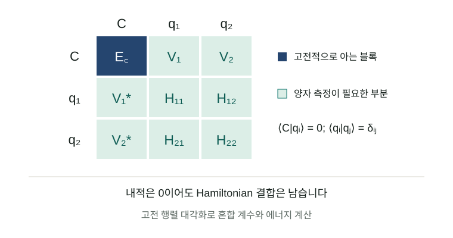

# 분자 계산의 일을 나누는 법: CASH-QSE로 이해하는 고전·양자 협업

분자의 성질을 계산하려면 전자들이 서로 영향을 주며 움직이는 방식을 알아야 합니다. 결합 길이를 조금 바꾸는 동안 에너지가 얼마나 달라지는지, 어떤 전자 배치가 안정해지는지 알아야 반응과 물성을 예측할 수 있습니다. 고전 전자구조 계산은 이 일을 오랫동안 발전시켜 왔습니다. 여러 전자 배치가 비슷한 중요도로 경쟁하는 상황에서는 더 많은 계산이 필요하고, 양자컴퓨터를 이용한 접근도 이런 문제를 겨냥합니다.

그렇다면 고전 계산으로 이미 잘 설명한 부분과, 양자 계산에 맡길 부분을 어떻게 나누면 좋을까요? 이 글은 전자상관과 활성공간의 배경에서 출발해, 두 계산을 작은 행렬 안에서 결합하는 원리를 설명합니다. 최근의 **CASH-QSE**를 사례로 삼아 그 설계가 측정비용에 어떤 영향을 주는지 검토하고, 분자·OLED 연구에 적용하려면 무엇이 더 필요한지 살펴봅니다.

*여러 성분을 결합해 하나의 파동함수를 표현한다는 생각을 담은 개념 일러스트입니다. 계산된 분자 궤도나 전자밀도 그림은 아닙니다.*

**연구 상태.** Artur F. Izmaylov의 CASH-QSE는 2026년 9월 8일 처음 제출된 프리프린트입니다. 이 리뷰의 근거 기준일은 9월 10일입니다. 보고된 결과는 고전 상태벡터 계산과 회로·샷 자원 분석이며, 실제 양자 처리장치(QPU)에서 실행한 결과는 없습니다. [논문 v1](https://arxiv.org/abs/2609.08170v1)

## 1. 결합이 늘어날 때 한 가지 전자 배치로 부족해지는 이유

전자들은 서로 반발합니다. 한 전자가 어디에 있는가에 따라 다른 전자가 나타날 확률도 바뀝니다. 이런 상호 의존성을 전자상관이라고 부릅니다. Hartree–Fock(HF)은 다른 전자들의 평균적인 영향을 받는 궤도를 구하고, 하나의 Slater determinant로 파동함수를 표현합니다. determinant는 전자들이 어떤 스핀 궤도를 차지하는지 정하면서 전자 교환에 필요한 반대칭성까지 담은 기본 단위입니다.

결합이 끊어지는 상황을 생각하면 여러 determinant가 필요한 이유를 이해하기 쉽습니다. 가까이 있는 두 원자의 전자를 하나의 결합성 궤도에 넣는 설명은, 멀리 떨어진 중성 원자로 분리되는 상태를 충분히 표현하지 못할 수 있습니다. 결합성·반결합성 궤도의 점유를 달리한 성분을 섞어야 올바른 분리 상태를 만들 수 있습니다. 이런 경쟁을 다루는 다중배치 방법에서는 파동함수를 여러 determinant의 선형결합으로 씁니다. [PySCF MCSCF 설명](https://pyscf.org/user/mcscf.html)

완전배치상호작용(**FCI**, full configuration interaction)은 정해진 궤도 집합에서 허용되는 모든 배치를 고려합니다. 그 공간 안에서는 정확한 기준이지만, 공간 자체가 빠르게 커집니다. 예를 들어 스핀 위 성분 전자와 아래 성분 전자가 각각 6개이고 공간 궤도가 12개라면, 대칭성을 더 줄이기 전 determinant 수는 \(\binom{12}{6}^{2}=853,776\)개입니다. 같은 방식으로 20개 궤도에 각각 10개 전자를 놓으면 \(\binom{20}{10}^{2}=34,134,779,536\)개가 됩니다. 이는 조합식으로 계산한 설명용 숫자이며, CASH-QSE의 실험 규모가 아닙니다.

**활성공간(active space)**은 그중 중요한 궤도와 전자를 골라 자세히 계산하는 범위입니다. CAS(6,6)은 전자 6개를 공간 궤도 6개에 분배하는 모든 배치를 포함한다는 뜻입니다. CASSCF는 이 배치들의 계수와 궤도를 함께 최적화합니다. 활성공간 밖의 점유는 기준상태에서 고정되므로, 외부 궤도가 관여하는 상관은 별도로 보충해야 합니다. 고전 계산에서는 CASPT2·NEVPT2 같은 다중참조 섭동이론, 더 큰 활성공간을 다루는 selected CI·DMRG 등 여러 선택지가 이미 있습니다. [PySCF MCSCF](https://pyscf.org/user/mcscf.html) · [다중참조 섭동이론](https://pyscf.org/user/mrpt.html) · [ASCI-SCF 원문](https://arxiv.org/abs/1912.08379)

## 2. 양자 회로가 짧아도 에너지는 여러 번 측정해야 합니다

양자컴퓨터는 전자 배치들의 중첩을 양자상태로 표현합니다. 변분 양자 고유값 알고리즘(**VQE**)은 조절 가능한 회로로 후보 상태를 만들고, 에너지를 측정한 뒤, 고전 최적화기가 회로 매개변수를 바꾸는 과정을 반복합니다. ADAPT-VQE는 처음부터 회로 모양을 고정하기보다 에너지를 낮추는 데 유용한 연산을 차례로 선택해 회로를 늘립니다. [ADAPT-VQE, Nature Communications 2019 / 공개 원문](https://arxiv.org/abs/1812.11173)

여기서 회로 실행 한 번은 에너지의 정확한 값을 주지 않습니다. 분자 Hamiltonian을 큐비트 연산으로 바꾸면 여러 Pauli 연산의 합이 되고, 서로 양립하는 항끼리 묶어 반복 측정합니다. 회로를 준비하고 측정해 표본 하나를 얻는 단위가 **샷(shot)**입니다. 독립 표본 평균의 표준오차가 \(\sigma/\sqrt{M}\)일 때, 오차를 절반으로 줄이려면 표본 수 \(M\)은 네 배가 됩니다. 이 통계 비용은 회로 깊이와 별도로 커질 수 있습니다.

측정량이 실용적인 양자화학의 제약이 된다는 지적도 새롭지 않습니다. Gonthier 등의 자원 분석은 개선된 Hamiltonian 분해를 적용해도, 조사한 분자들의 연소에너지를 계산할 때 VQE의 측정 요구량이 큰 장애물로 남는다고 평가했습니다. 모든 분자와 모든 양자 알고리즘의 불가능성을 보인 것은 아닙니다. 연구 범위를 좁혀 보면, 회로를 줄이는 일과 측정을 줄이는 일을 동시에 검토해야 하는 이유를 제시합니다. [Physical Review Research 2022 / 공개 원문](https://arxiv.org/abs/2012.04001)

## 3. 고전 기준상태와 양자 보정 상태를 작은 행렬에서 결합하기

파동함수 전체를 한 회로에 담는 대신, 준비하기 쉬운 여러 상태를 만들고 그 선형결합을 찾는 방법이 있습니다. QSE(quantum subspace expansion)는 이런 부분공간 접근의 중요한 계보입니다. 2017년의 QSE 연구는 측정한 정보를 고전 행렬 계산에 넣어 들뜬상태와 잡음의 영향을 다뤘습니다. 2021년의 **classically boosted VQE**는 고전적으로 다룰 수 있는 상태를 양자상태와 같은 변분공간에 넣어, 알려진 고전 에너지를 재측정하는 부담을 줄이는 구성을 제안했습니다. [QSE 원문](https://arxiv.org/abs/1603.05681) · [CB-VQE 원문](https://arxiv.org/abs/2106.04755)

이 방식은 에너지 숫자 두 개를 더하는 것과 다릅니다. 정규화한 고전 기준상태 \(|C\rangle\)와 보정 상태 \(|q\rangle\)를 놓으면, 전체 후보는 \(c_C|C\rangle+c_q|q\rangle\)입니다. 필요한 정보는 각 상태의 에너지뿐 아니라 두 상태를 잇는 **Hamiltonian 행렬원소** \(V=\langle C|H|q\rangle\)입니다. 이것이 두 성분을 어떤 비율과 상대 위상으로 섞을지를 결정합니다.

두 상태가 서로 직교하면 \(\langle C|q\rangle=0\)입니다. 그러나 \(\langle C|H|q\rangle\)는 0일 필요가 없습니다. 직교성은 두 상태가 중복되지 않는다는 뜻이고, Hamiltonian은 서로 다른 상태를 연결할 수 있기 때문입니다. 아래 예제에서 결합 \(V\)를 바꾸면, 에너지 행렬을 대각화할 때 얻는 더 낮은 고유값과 보정 성분의 비중이 바뀝니다.

조작 예제는 HTML 페이지에서 사용할 수 있습니다.

이 예제는 \(E_C=0\), \(E_q=\Delta>0\)인 두 직교 상태의 행렬을 정확히 풉니다. 실제 분자를 계산하지 않으며, CASH-QSE의 샷 절감률을 예측하지도 않습니다. 초기값 \(\Delta=1\) eV, \(V=0.2\) eV에서는 낮은 고유값이 약 −0.03852 eV, 보정 성분의 비중은 약 3.58%입니다. JavaScript를 사용할 수 없어도 이 초기값과 아래 식으로 원리를 확인할 수 있습니다.

\[E_- = \frac{\Delta-\sqrt{\Delta^2+4V^2}}{2},\qquad |c_q|^2 = \frac{1-\Delta/\sqrt{\Delta^2+4V^2}}{2}.\]

고전 기준상태가 정확한 에너지로 행렬에 들어가면 그 대각원소에는 샷 오차가 없습니다. 측정이 필요한 다른 원소의 오차가 최종 에너지에 미치는 영향은 혼합 계수에도 의존합니다. 예를 들어 보정 상태의 대각 에너지 오차에 대한 1차 민감도는 \(|c_q|^2\)입니다. 작은 보정만 필요할 때 이 민감도가 작아지는 이유를 두 상태 모델에서 직접 볼 수 있습니다. 실제 표본 수에는 연산자 분산과 상태 간 전이 측정까지 들어가므로, 작은 보정 비중만으로 큰 절감률을 보장할 수는 없습니다.

## 4. CASH-QSE가 점유 조건으로 중복을 없애는 방법

일반적인 부분공간에서는 서로 다른 회로가 거의 같은 상태를 만들 수 있습니다. 이때는 겹침 행렬 \(S_{ij}=\langle\phi_i|\phi_j\rangle\)까지 측정하고 \(Hc=ESc\)를 풉니다. 두 정규화 상태의 겹침이 실수 \(s\)라면, \(S\)의 고유값은 \(1+s\)와 \(1-s\)입니다. \(s\)가 1에 가까워질수록 작은 고유값이 생겨 오차 처리에 주의해야 합니다. 단순한 2상태 예제에서 \(s=0.99\)이면 조건수는 199입니다. 겹침 행렬의 불안정성과 고전·양자 결합을 함께 생각하는 이유입니다. [CB-VQE](https://arxiv.org/abs/2106.04755)

CASH-QSE는 CASSCF 기준상태와 보정 상태들을 점유 조건으로 구분해 직교성을 확보합니다. 서로 다른 상태의 겹침을 측정할 필요가 없어지고, 보통의 Hermitian 고유값 문제 \(Hc=Ec\)를 풉니다. 고전 블록은 고전적으로 계산하되, 고전–양자 결합을 측정할 때 기준상태나 그 성분을 준비하는 비용은 여전히 발생할 수 있습니다. [CASH-QSE §§II–V](https://arxiv.org/html/2609.08170v1#S2)

점유 조건을 이용한 구분은 다음과 같은 작은 예로 이해할 수 있습니다. 기준공간에서 궤도 A는 두 전자로 차 있고, 외부 궤도 B는 비어 있다고 합시다. 기준공간 밖의 배치를 ‘가장 먼저 어긴 조건’으로 분류합니다. 이 표의 A·B는 설명용 이름이며 논문의 특정 분자 궤도 표기가 아닙니다.

| 분류 | A의 점유 | B의 점유 | 배치를 넣는 규칙 |
|---|---|---|---|
| 고전 기준공간 | 2 | 0 | 두 조건을 모두 만족 |
| 보정 공간 1 | 0 또는 1 | 나머지 제약 안에서 허용 | 첫 조건 A부터 위반 |
| 보정 공간 2 | 2 | 1 또는 2 | A를 통과하고 B에서 처음 위반 |

각 배치는 한 칸에만 들어갑니다. 전체 전자 수와 대칭성도 만족해야 하므로 실제로 불가능한 칸의 조합은 제외합니다. 서로 겹치지 않는 determinant 집합 안에서 상태를 만들면 다른 집합의 상태와 내적이 0이 됩니다. 같은 공간에서 여러 보정 상태를 쓸 때도 추가적인 직교 구성이 필요합니다. 단지 회로를 여러 개로 나누었다는 이유만으로 직교성이 생기지는 않습니다.

이 분할은 좋은 보정 상태를 자동으로 찾아주는 해답과는 구분해야 합니다. 큰 공간을 더 세분하면 각 회로를 단순하게 만들 수 있지만 상태의 개수와 행렬원소 수가 늘어납니다. 또한 구조를 유지하는 이상적 회로의 직교성과, 잡음으로 점유 조건을 벗어날 수 있는 실제 장치의 상태는 같지 않습니다. 하드웨어 적용에서는 이 차이가 에너지 추정에 주는 영향을 따로 확인해야 합니다.

## 5. 숫자로 읽기: 좋은 기준상태는 어느 비용을 줄였나

논문이 보고한 질소 분자 결과 중 두 결합 길이를 골라 비교합니다. 아래 샷은 **최적화가 끝난 마지막 에너지 추정**의 이상적 필요량입니다. 전 과정의 회로 실행 횟수나 실제 장치 시간이 아닙니다. 정확한 상태벡터 분산과 FCI 기반 상태 선택을 사용했습니다. 목표 샘플링 불확실성은 1.6 mEₕ입니다. [원문 표 6·7](https://arxiv.org/html/2609.08170v1#S8)

| N₂ / STO–3G | 고전 기준 | CASH-QSE 샷 | ADAPT-VQE 샷 | ADAPT/CASH 비율 | CASH 최대 완성 측정회로 CNOT |
|---|---|---:|---:|---:|---:|
| 1.8 Å | HF | 1.1×10⁶ | 2.4×10⁶ | 2.1 | 342 |
| 1.8 Å | CAS(4,4) | 1.6×10⁵ | 2.4×10⁶ | 15 | 333 |
| 1.8 Å | CAS(6,6) | 8.5×10² | 2.4×10⁶ | 2,800 | 328 |
| 3.0 Å | HF | 2.3×10⁶ | 7.7×10⁵ | 0.33 | 338 |
| 3.0 Å | CAS(4,4) | 8.1×10⁵ | 7.7×10⁵ | 0.94 | 328 |
| 3.0 Å | CAS(6,6) | 고전 계산에서 종료 | — | — | — |

*비율은 원문 표의 반올림 값을 보존했습니다. 1보다 크면 CASH의 샷이 적고, 작으면 더 많습니다. CNOT 수는 전결합 논리 연결성을 가정한 회로 구성값입니다. 준비·전이·측정 기저 변환을 포함하며, 깊이나 실제 하드웨어의 실행 게이트 수를 뜻하지 않습니다.*

이 표는 회로가 비슷하게 짧아도 통계 비용은 크게 달라질 수 있음을 보여주는 자료입니다. 1.8 Å에서 HF와 CAS(6,6)의 최대 회로는 342와 328 CNOT으로 큰 차이가 없는데, 필요한 샷은 매우 다릅니다. 반면 3.0 Å의 HF 기준에서는 짧은 회로를 얻고도 샷 비교가 불리합니다. 마지막 줄은 특히 실용적인 판단 기준을 줍니다. 고전 계산이 원하는 정확도에 도달했다면 그 단계에서 멈추는 선택도 있어야 합니다.

‘화학적 정확도’라는 말도 범위를 확인해야 합니다. 여기서 상태 선택 목표인 FCI 대비 에너지 오차 1.6 mEₕ와 측정의 표준불확실성 1.6 mEₕ는 별도 조건입니다. 대략 1 kcal/mol 규모라는 익숙한 기준을 사용하지만, 두 오차 예산을 합친 최종 보증도 아니고, 제한된 기저에서 얻은 FCI 일치가 실험 에너지와의 일치를 보장하지도 않습니다.

물 분자의 더 큰 궤도 창에서는 표본 배분의 현실성도 볼 수 있습니다. 아래는 전체 cc-pVDZ 공간이 아닌 **14개 공간 궤도로 제한한 창**, CAS(4,4)를 사용한 결과입니다. 최소 한 샷씩 모든 측정 그룹을 평가하도록 바꾸면 비용이 늘어납니다. [원문 표 5·8](https://arxiv.org/html/2609.08170v1#A3)

| H₂O의 O–H 길이 | 이상적 연속 배분 CASH 샷 | 그룹당 최소 1샷 CASH 샷 | 같은 최소조건에서 ADAPT/CASH |
|---|---:|---:|---:|
| 0.96 Å | 2.1×10⁴ | 5.18×10⁴ | 560 |
| 1.75 Å | 1.2×10⁴ | 3.28×10⁴ | 630 |
| 3.0 Å | 5.1×10² | 9.41×10² | 4,400 |

*양쪽 방법에 동일한 최소조건을 적용한 원문 수치입니다. 분산을 알아내는 예비 측정은 제외됩니다. 3.0 Å에서 ADAPT의 샷 추정은 정확한 창 내부 FCI를 대리 상태로 사용하며, 회로 비용을 계산한 유한 ADAPT 상태와 동일하지 않습니다.*

[표 데이터 CSV 내려받기](benchmarks.csv)

## 6. 측정을 줄이는 설계와 아직 청구되지 않은 비용

행렬의 고전 블록을 재사용하는 것 외에도, 점유·대칭 조건으로 반드시 0인 행렬원소나 연결되지 않는 항을 제외할 수 있습니다. ‘어차피 결과에 기여하지 않는 항을 왜 측정하는가’라는 관점입니다. 또 평균값을 바꾸지 않는 연산자 변형을 선택하면, 함께 측정하는 항들의 변동이 상쇄되도록 도울 수 있습니다. 이 가능성은 상태의 구조와 측정 그룹에 의존하므로 항상 같은 이득이 생기는 규칙으로 읽으면 안 됩니다.

표의 큰 절감률을 응용 성능으로 판단하려면 적어도 세 가지 비용을 더 물어야 합니다. **보정 상태를 찾는 비용**, **측정 배분을 학습하는 비용**, **장치에서 회로를 실행하는 비용**입니다. 이번 벤치마크는 FCI 정보를 상태 선택에 사용했고, 정확한 분산을 바탕으로 샷을 배분했습니다. 예비 샷, 상태·궤도 최적화의 반복 측정, 잡음과 장치 라우팅은 보고된 샷 비율에 포함되지 않습니다. [CASH-QSE 계산 조건](https://arxiv.org/html/2609.08170v1#S7)

FCI를 안다는 조건은 특히 중요합니다. 답의 구조를 알고 있을 때 짧고 측정하기 쉬운 표현이 존재하는지를 조사하는 연구와, 답을 모르는 큰 분자를 처음부터 효율적으로 푸는 연구는 서로 다른 검증을 요구합니다. 이 논문을 읽고 바로 산업 분자 계산을 더 빠르게 수행할 수 있다고 결론내리기는 어렵습니다. 대신 어떤 상태 분할이 유리한지를 찾는 후속 연구에 비교할 만한 목표와 실패 사례를 제공합니다.

또한 비교 대상인 ADAPT-VQE는 논문이 정한 연산자 풀·궤도·합성 규칙의 구현입니다. 이 비율은 모든 VQE 구현에 대한 최적성 증명도, DMRG·selected CI·NEVPT2 같은 고전 방법에 대한 우위도 아닙니다. 고전 기준 계산에 드는 시간을 포함한 총비용을 같은 Hamiltonian, 기저, 정확도에서 비교해야 적용 여부를 판단할 수 있습니다.

## 7. DFT·OLED 연구에 연결할 때 필요한 구분

DFT를 주로 쓰는 연구자에게 CASH-QSE의 고전 블록은 익숙한 DFT 에너지와 역할이 다릅니다. Kohn–Sham DFT의 총에너지는 밀도와 교환·상관 범함수로 평가됩니다. 이를 그대로 분자 전자 Hamiltonian의 \(\langle C|H|C\rangle\) 자리에 넣으면 같은 변분 문제를 푼다는 보장이 사라집니다. DFT 궤도를 초기 추정에 활용하는 것과, DFT 총에너지를 파동함수 행렬원소로 대입하는 것은 구분해야 합니다. [DFT 공식 설명](https://pyscf.org/user/dft.html) · [CASSCF 초기 궤도](https://pyscf.org/user/mcscf.html)

OLED로의 연결은 아직 **연구 제안**입니다. 관심 있는 발광 분자에서 어떤 궤도가 여기 상태와 전하이동에 관여하는지 먼저 조사하고, 고전 다중참조 방법으로 작은 기준 문제를 만들어 볼 수 있습니다. 그다음 고전 부분과 보정 부분의 분할이 바닥상태와 들뜬상태를 균형 있게 설명하는지 확인해야 합니다. 한 상태의 에너지만 잘 맞추어도 두 상태의 차이는 잘못될 수 있기 때문입니다.

특히 발광 응용에서는 S₁·T₁ 에너지 차이만으로 평가가 끝나지 않습니다. 전이 성질, 스핀–궤도 결합, 분자 진동과 구조 변화, 주변 환경까지 관심 물성에 맞춰 검토해야 합니다. CASH-QSE의 물·질소 바닥상태 결과가 이런 OLED 물성을 검증한 것은 아닙니다. 부분공간 접근이 들뜬상태까지 다룰 수 있다는 선행 연구는 확장의 출발점이지만, 재료별 정확도와 비용은 별도로 확인해야 합니다. [QSE의 들뜬상태 연구](https://arxiv.org/abs/1603.05681)

## 8. 다음 연구는 좋은 분할을 저렴하게 찾는 일입니다

후속 연구의 첫 과제는 FCI 없이 유용한 보정 공간을 고르는 것입니다. 자연 궤도 점유수, 국소화된 결합, selected CI나 텐서 네트워크에서 얻는 근사 정보는 후보가 될 수 있습니다. 다만 보정 상태 선택에 쓰는 고전 방법 자체가 같은 목표를 충분히 잘 푸는지 먼저 비교해야 합니다. 분할 규칙의 성능은 절감한 샷뿐 아니라 그 규칙을 찾는 데 쓴 계산까지 포함해 평가해야 합니다.

둘째로, 일부 예비 측정에서 분산을 배우고 남은 샷을 배분하는 과정이 필요합니다. 충분히 작은 표본에서 잘못 추정한 분산은 중요한 행렬원소에 너무 적은 샷을 배정할 수 있습니다. 적응적 배분을 쓴다면 초기 예산, 중단 조건, 불확실성 추정의 안정성을 함께 보고해야 합니다. 회로 수가 많아질 때 장치 호출·재설정 시간이 어느 정도인지도 실제 하드웨어 실험으로 확인할 수 있습니다.

셋째로, 잡음이 직교성의 근거인 점유 조건을 얼마나 훼손하는지 살펴야 합니다. 필요한 대칭성 검증이나 오류완화를 추가했을 때, 이론상 제거했던 비용이 다른 형태로 돌아올 수 있습니다. 최종 에너지뿐 아니라 준비 상태의 제약 위반률과 전이 측정의 편향을 기록하면 원인을 구분하는 데 도움이 됩니다.

CASH-QSE를 통해 배울 수 있는 설계 원칙은 분명합니다. 고전 계산으로 확보한 파동함수 정보를 보존하고, 추가할 성분의 표현과 측정 방식을 함께 설계하는 것입니다. 좋은 기준상태를 고르는 화학적 판단, 안정적인 부분공간을 만드는 선형대수, 샷을 아끼는 통계 설계가 한 계산 안에서 만납니다. 실제 연구 도구로 발전했는지는 답을 모르는 분자에서 이러한 준비 비용까지 포함해 유리한 결과를 내는지로 평가할 수 있을 것입니다.

## 참고문헌과 읽을 자료

1. Artur F. Izmaylov. *Classical Active-Space Hybrid Quantum Subspace Expansion (CASH-QSE): Quantum Corrections without Remeasuring the Classically Calculable Energy*. arXiv:2609.08170v1, 2026-09-08. 동료평가 전. [초록·버전](https://arxiv.org/abs/2609.08170v1) · [본문·표·부록](https://arxiv.org/html/2609.08170v1)
2. PySCF Developers. *Multi-configuration self-consistent field (MCSCF)*. 활성공간·CASCI/CASSCF·상태평균·초기 궤도에 대한 공식 문서. 2026-09-10 확인. [문서](https://pyscf.org/user/mcscf.html)
3. Harper R. Grimsley et al. *An adaptive variational algorithm for exact molecular simulations on a quantum computer*. Nature Communications 10, 3007 (2019). 최초 프리프린트 2018-12-28. [공개 원문](https://arxiv.org/abs/1812.11173) · [DOI](https://doi.org/10.1038/s41467-019-10988-2)
4. Jérôme F. Gonthier et al. *Measurements as a roadblock to near-term practical quantum advantage in chemistry: Resource analysis*. Physical Review Research 4, 033154 (2022). 최초 프리프린트 2020-12-07. [공개 원문](https://arxiv.org/abs/2012.04001) · [DOI](https://doi.org/10.1103/PhysRevResearch.4.033154)
5. Jarrod R. McClean et al. *Hybrid quantum-classical hierarchy for mitigation of decoherence and determination of excited states*. Physical Review A 95, 042308 (2017). 최초 프리프린트 2016-03-17. [공개 원문](https://arxiv.org/abs/1603.05681) · [DOI](https://doi.org/10.1103/PhysRevA.95.042308)
6. Maxwell D. Radin and Peter Johnson. *Classically-Boosted Variational Quantum Eigensolver*. arXiv:2106.04755, 최초 공개 2021-06-09. 이 리뷰에서는 프리프린트 기록을 사용했습니다. [원문](https://arxiv.org/abs/2106.04755)
7. Daniel S. Levine et al. *CASSCF with Extremely Large Active Spaces using the Adaptive Sampling Configuration Interaction Method*. arXiv:1912.08379, 최초 공개 2019-12-18. 고전 selected-CI 활성공간 계산의 비교 맥락. [원문](https://arxiv.org/abs/1912.08379)
8. PySCF Developers. *Multi-reference perturbation theory*; *Density functional theory*. 2026-09-10 확인. [MRPT](https://pyscf.org/user/mrpt.html) · [DFT](https://pyscf.org/user/dft.html)

*표의 수치는 원 논문에서 선별해 재구성했습니다. 두 상태 조작 예제와 조합 수 계산은 이해를 돕기 위한 독립적인 설명용 계산입니다. 분자 벤치마크를 독립 재현한 결과는 포함하지 않습니다.*
