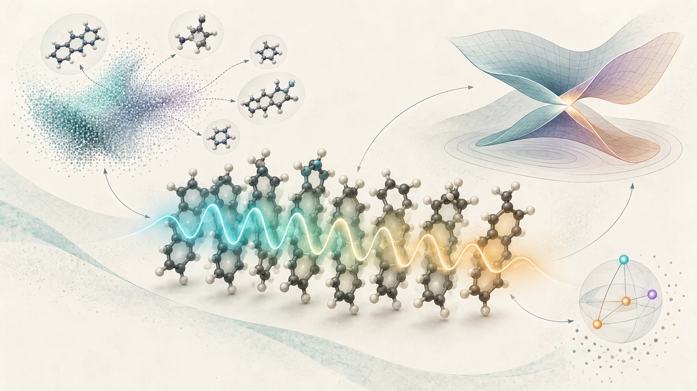
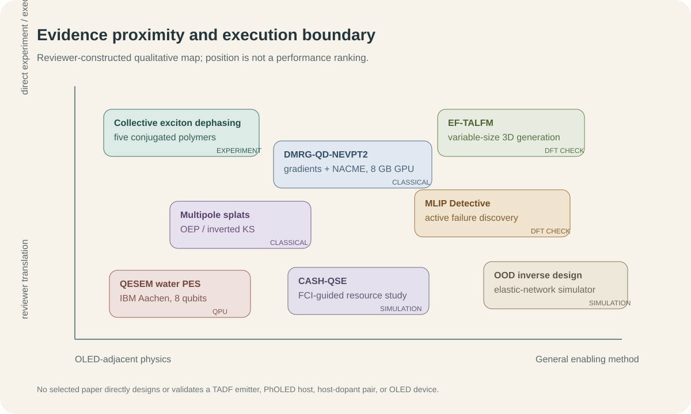
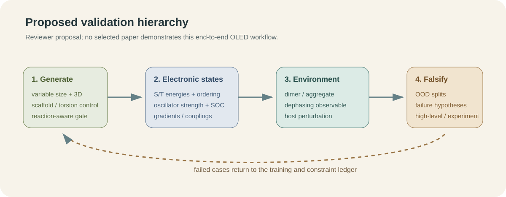

# 집단 엑시톤과 오차 예산이 규정하는 광여기 분자 역설계의 신뢰도

2026년 9월 4일부터 10일까지의 새 문헌은 TADF 발광체나 PhOLED host를 직접 설계한 성과를 내놓지 않았다. 대신 OLED 역설계가 어디서 틀릴 수 있는지를 더 정밀하게 보여준다. 분자 하나의 에너지와 진동자 세기를 맞히는 것만으로는 응집상에서의 엑시톤 코히런스, 상태 교차 부근의 비단열 결합, 생성 분자의 크기와 3차원 구조, 모델의 분포 밖 실패를 동시에 설명할 수 없다.

이번 주의 중심 근거는 공액고분자 5종에 대한 2차원 전자분광 실험이다. 절대 균질 선폭은 약 20-90 meV로 크게 달랐지만 온도에 따른 증가는 모든 재료에서 약했다. 검출 방식에 따라 선폭의 절대값도 바뀌었다. 이 결과는 OLED 후보의 광물성을 단일 분자 scalar로만 학습할 때 빠지는 집단상태와 관측량 의존성을 보여준다. 나머지 7편은 이 문제를 계산과 검증의 층으로 확장한다.

*그림 1. 이번 리뷰의 개념 일러스트. 중앙의 발광 집합체는 집단 엑시톤과 탈위상을, 주변 요소는 가변 크기 생성·전자상태 교차·양자 측정비용을 나타낸다. 생성된 분자와 퍼텐셜, 양자 요소는 특정 화학구조, 측정 morphology, 정량 곡면 또는 실행 가능한 회로가 아니다.*

::: highlight 이번 주의 판정
광여기 분자 역설계의 신뢰도는 생성 후보 수보다 검증 계층에 의해 좌우된다. 분자 단위 DFT/ML 예측 위에 응집상 광물리, 분포 밖 실패 탐색, 고수준 전자구조 확인을 올려야 한다. 실제 QPU 결과는 8-qubit 물 분자 PES에서 오차 완화의 가능성을 보였지만, chemical accuracy에 접근할수록 평균 약 1,676만 shots가 필요해 OLED 규모의 전자구조 계산과는 거리가 멀다.
:::

레이아웃을 검증한 영문 기술 브리프는 [PDF로 내려받을 수 있다](../artifacts/oled_inverse_design_weekly_brief_2026-09-11.pdf).

## 먼저 읽을 순서

1. **Collective excitonic structure governs weak thermal optical dephasing** - 공액고분자 5종의 실험이 분자구조와 집단 광학 관측량을 직접 연결한다.
2. **EF-TALFM** - 고정 차원 latent에서 분자 크기까지 생성하고, HOMO-LUMO gap hit를 DFT로 확인한다.
3. **MLIP Detective** - 평균 benchmark 점수 밖의 물리적 실패를 가설-검증 과정으로 찾는다.
4. **DMRG-QD-NEVPT2 analytic derivatives** - 8 GB 소비자 GPU에서 교차점까지 매끄러운 gradient와 NACME를 계산한다.
5. **Multipole splats** - OEP와 inverted Kohn-Sham 문제를 안정적인 Hamiltonian learning으로 재구성한다.
6. **OOD differentiable inverse design** - 학습 범위 밖 물성을 dynamics-based surrogate와 물리 제약으로 설계한다.
7. **QESEM water PES** - 실제 IBM QPU에서 오차를 줄이지만 샷 비용이 급증한다.
8. **CASH-QSE** - 고전 CASSCF 기준상태를 다시 측정하지 않는 QSE를 제안하되 결과는 이상적 자원 분석이다.

*그림 2. 리뷰어가 구성한 정성적 근거 지도. 위치는 OLED workflow와의 근접성과 원 논문이 실제로 수행한 검증 수준을 나타내며 성능 순위가 아니다. 선정 논문은 모두 프리프린트다.*

## 1. 직접 OLED·TADF·PhOLED 연구는 없었다

이번 범위에서 TADF 발광체, PhOLED host, host-dopant/exciplex 또는 OLED 소자를 직접 설계·검증한 새 primary record는 찾지 못했다. 아래 8편은 유기 반도체 광물리 또는 인접 계산방법이다. 8월 21일·28일과 9월 4일 브리핑에 실린 항목은 반복하지 않았다.

## 2. 공액고분자 5종에서 확인된 약한 열적 광학 탈위상

Henry J. Kantrow, Elizabeth Gutiérrez-Meza, Eric R. Bittner, Hao Li, Carlos Silva-Acuña의 [*Collective Excitonic Structure Governs Anomalously Weak Thermal Optical Dephasing in Conjugated Polymers*](https://arxiv.org/abs/2609.06742)은 2026년 9월 6일 공개된 프리프린트다.

### [원 논문 결과]

P3HT, P3HHT, PBTTT, PCE11, N2200을 coherence-detected COLBERT와 population-detected 2D photoluminescence spectroscopy로 비교했다. 재료는 backbone, donor-acceptor 성격, side chain, 고체 조직이 서로 다르다. 균질 선폭은 약 20-90 meV였고 N2200의 COLBERT 값이 약 20 meV로 가장 좁았지만, 각 재료의 온도 의존성은 측정 범위에서 모두 약했다. PBTTT에서는 2DPL 선폭이 COLBERT보다 일관되게 컸으나 약한 열적 scaling은 두 방식에서 유지됐다.

### [한계와 OLED 번역]

저자들은 선폭 차이의 미시적 원인을 확정하지 않았다. exciton-vibration coupling과 relaxation pathway의 정량 모델이 필요하고, 공개 데이터 저장소 URL도 프리프린트에는 placeholder로 남아 있다. 또한 발광 저분자나 OLED 소자를 측정한 연구가 아니다.

OLED 파이프라인에서는 단분자 S1/T1·oscillator strength 예측 뒤에 dimer/aggregate exciton model과 observable-specific dephasing 검증을 별도 단계로 두어야 한다. 선폭 하나를 분자 고유 상수처럼 학습하지 말고, 검출 방식·온도·형태학 조건을 provenance로 보존하는 것이 직접적인 번역이다.

## 3. 고정 차원 latent가 분자 크기까지 결정하는 3D 생성

Weichi Yao, Cameron Gruich, Bryan R. Goldsmith, Yixin Wang의 [*Fixed-Dimensional Latent Flow for Generating Variable-Size 3D Molecules*](https://arxiv.org/abs/2609.08333)은 9월 8일 공개됐다.

### [원 논문 결과]

EF-TALFM은 고정 크기 분자 latent를 flow matching으로 샘플링한 뒤 autoregressive Transformer가 원자 종류, 좌표, 화학 상태와 분자 크기를 함께 결정한다. canonical atom ordering과 rigid-pose alignment를 사용해 equivariant layer 없이 3D 구조를 복원한다. PCQM4Mv2에서 unique·training-set novel·sanitization·PoseBusters를 모두 통과한 비율은 89.4%로, UAE-3D 75.6%, FlowMol 69.8%보다 높았다.

HOMO-LUMO gap은 4.1-7.8 eV 사이 10개 target을 두고 target당 10,000개를 생성했다. 내부 ranking을 적용하면 DFT 값이 target의 0.1 eV 안에 들어오는 hit 밀도가 약 2배가 되었고, unique verified hit의 novelty는 97%였다. 보고된 latent dimension은 32이며 총 학습시간은 882분으로 UAE-3D의 1,644분보다 짧았다.

### [한계와 OLED 번역]

PCQM4Mv2의 HOMO-LUMO gap은 OLED의 S1, T1, ΔEST, SOC 또는 고체상 성능을 대체하지 않는다. canonical ordering과 alignment가 더 큰 비평면 donor-acceptor 분자에서 얼마나 안정적인지, route feasibility와 scaffold OOD가 유지되는지도 확인되지 않았다.

OLED용 재현 실험에서는 분자 크기를 사전 고정하지 않는 장점을 유지하되, 생성 후 상위 후보를 동일한 TDDFT/TDA·conformer protocol로 재평가해야 한다. novelty보다 target hit의 scaffold-held-out calibration과 합성 route 존재 여부를 우선 기록하는 편이 안전하다.

## 4. 평균 점수 밖의 실패를 능동적으로 찾는 MLIP Detective

Ryuhei Okuno, Nontawat Charoenphakdee, Kaoru Hisama, Yuta Tsuboi의 [*MLIP Detective: Active Failure Mode Discovery Beyond Benchmark Scores for Machine-Learning Interatomic Potentials*](https://arxiv.org/abs/2609.08399)은 9월 8일 공개됐다.

### [원 논문 결과]

LLM 기반 Detective Agent가 검증 가능한 물리 가설을 만들고, 여러 Probe Agent가 값싼 simulation과 model committee disagreement로 이를 시험한 뒤 의심 사례만 사람과 DFT에 넘긴다. MACE-MPA-0에서 O·F adsorbate가 포함된 PBE/PBE+U 혼합 영역의 40개 조합 가운데 27개가 분리 fragment보다 높은 비정상 에너지를 보였고, 영역 밖 72개 조합에서는 0개였다.

CO/Cu(111)은 benchmark adsorption energy가 실험과 0.04 eV 안에서 맞았지만, desorption path에서는 모델이 vacuum asymptote보다 0.208 eV 높은 장벽을 만들었다. 동일한 25개 image에 대한 plane-wave PBE single point는 0.022 eV만 상승했다. 즉 equilibrium benchmark가 맞아도 경로가 물리적으로 틀릴 수 있음을 DFT로 확인했다.

### [한계와 OLED 번역]

현재 실증은 표면 흡착과 소수 failure family에 한정된다. LLM의 사전학습 노출을 배제할 수 없고, inspection specification이 탐색 경계를 정하며, 최종 확인은 여전히 전문가와 DFT 비용을 요구한다.

OLED 모델에도 같은 구조를 적용할 수 있다. ΔEST가 맞지만 state ordering이 틀리는 경우, relaxed conformer에서는 맞지만 torsion scan에서 불연속이 생기는 경우, host-dopant separation limit에서 비물리적 CT가 나타나는 경우를 미리 가설로 등록하고 상위 실패만 high-level 계산에 올린다.

## 5. 교차점을 통과하는 비단열 미분을 8 GB GPU에 올리다

Rubén Darío Guerrero의 [*Analytic Gradients and Nonadiabatic Couplings for Device-Resident DMRG-QD-NEVPT2 Through Conical Intersections on a Consumer GPU*](https://arxiv.org/abs/2609.09990)은 9월 9일 공개됐다.

### [원 논문 결과]

DMRG가 active-space static correlation을, quasi-degenerate strongly contracted NEVPT2가 dynamic correlation을 담당한다. gradient와 interstate nonadiabatic coupling matrix element는 contraction graph의 reverse-mode transpose로 계산된다. NVIDIA RTX 4060 8 GB에서 전 과정을 실행했고, twisted ethene 교차점에서 smooth adiabat와 1/ΔE 형태로 발산하는 nonzero NACME를 얻었다. 비교한 adiabatic linear-response TDDFT는 그 지점에서 zero coupling을 반환했다.

FCI-in-active-space 일치는 10^-15, single-precision leg의 에너지 영향은 10^-6 eV 미만이었다. CAS(10,10)의 dense 4-RDM 경로는 12.6 GB가 필요하지만 contraction을 융합하면 7.1 GB에 들어갔고 dense result와 8.9×10^-16 수준으로 맞았다. ethene aug-cc-pVTZ Cholesky build는 40분 안에 끝나지 않던 기존 구현에서 약 3분으로 줄었다.

### [한계와 OLED 번역]

단일 저자의 프리프린트이며 ethene 중심 검증이다. 실제 TADF 다중상태, triplet manifold, SOC, 용매·host, 큰 donor-acceptor에서의 안정성과 wall time은 보고되지 않았다. 저자도 σ-polarization과 diffuse function 확장을 후속 과제로 둔다.

OLED에서는 TDDFT/TDA screening 뒤 state crossing이나 CT/LE mixing이 심한 5-10개 후보만 active-space multireference 확인에 보내는 escalation layer로 적합하다. 모든 후보를 이 방법으로 처리하는 생산 pipeline으로 읽어서는 안 된다.

## 6. OEP와 inverted Kohn-Sham을 안정적인 Hamiltonian learning으로 재구성

Matija Medvidović, Angel Rubio, Juan Carrasquilla의 [*Multipole splats for optimized and inverted effective potentials*](https://arxiv.org/abs/2609.09280)은 9월 8일 공개됐다.

multipole splat은 올바른 장거리 감쇠를 구조적으로 넣은 local trial potential이다. 저자들은 optimized effective potential과 inverted Kohn-Sham을 각각 variational·supervised Hamiltonian learning으로 표현했다. near-exact inverted correlation potential과 비교해 self-interaction, delocalization, static-correlation error의 공간적 흔적을 분리했고, 경험적 tail 보정 없이 Rydberg series를 회복했다. benzene·naphthalene까지 약 70 electrons 규모의 π-conjugated system에서 exact-exchange source density를 계산했다.

이 결과는 ground-state effective potential과 spectral access에 관한 것이며 OLED excited-state benchmark는 아니다. 그래도 long-range CT와 diffuse excitation이 중요한 후보에서 scalar orbital energy만 저장하기보다 potential representation과 density-derived diagnostic을 학습 데이터로 남기는 방향을 제시한다. basis sensitivity와 hybrid-functional dependence는 별도 검증해야 한다.

## 7. dynamics-based surrogate가 보여준 분포 밖 역설계

Sergey A. Shteingolts, Salman N. Salman, Ron Levie, Dan Mendels의 [*Out-of-Distribution Inverse Design of Elastic Networks with Differentiable Graph Neural Network Molecular Dynamics*](https://arxiv.org/abs/2609.06655)은 9월 6일 공개됐다.

graph neural network molecular dynamics simulator를 짧은 동역학 초기화와 물리 제약 refinement에 연결했다. Poisson ratio 0.1-0.4의 non-auxetic network만 학습했지만 -0.3까지의 auxetic 구조를 설계했다. 학습 크기는 150-200 nodes였고, 최종 시험은 최대 5,000 nodes까지 확장됐다. static structure-to-property predictor는 같은 OOD 역설계에 실패했다. bond length는 원래의 30% 이상, 인접 bond angle은 20도 이상으로 제한했다.

이는 분자가 아니라 disordered elastic network simulation이다. OLED 번역은 결과가 아니라 설계 원리다. surrogate의 직접 역전보다 differentiable trajectory와 물리 제약을 통해 torsion 또는 morphology를 최적화하고, 최종 후보를 원래 oracle로 재검증해야 한다. 화학 그래프로 성능 수치를 옮길 근거는 없다.

## 8. 실제 QPU가 드러낸 오차 완화의 샷 비용

Renato Olarte Hernandez 등 8명의 [*Implementing QESEM's High-Accuracy Error Mitigation on a Quantum Computer: a Water Potential Energy Surface Study*](https://arxiv.org/abs/2609.07284)은 9월 7일 공개됐다.

### [실제 QPU 실행]

IBM Aachen Heron r3에서 156 physical qubit 가운데 8 qubit register를 사용했다. 대상은 H2O symmetric stretch 11개 geometry, (4,4) active space, STO-3G, 1-layer perfect-pairing tiled unitary product state다. ansatz와 orbital parameter는 QPU가 아니라 statevector oo-VQE에서 먼저 최적화했고, 실제 하드웨어에서는 energy expectation을 측정했다.

raw QPU energy는 reference보다 대체로 약 500 mHa 높았다. QESEM으로 loose precision 0.1 Ha에서는 약 100 mHa 안에, tight precision 0.01 Ha에서는 대부분 30 mHa 안에 들어왔다. tight case의 maximum error는 34 mHa였고 merged result는 20 mHa 안이었다. 11개 가운데 한 점이 chemical accuracy에 직접 들어왔으며 ±5 mHa uncertainty까지 고려하면 5개가 해당 범위와 겹쳤다.

비용은 크다. merged result당 평균 shots는 loose 3,135,921, tight 16,762,896이었다. tight run의 QPU 시간은 geometry당 약 0.5-2.5시간이었다. 따라서 이는 OLED-size VQE나 quantum advantage가 아니다. 8-qubit small-basis water PES에서 characterization-based mitigation이 bias를 줄인 실제 하드웨어 증거다.

## 9. 고전 기준상태를 다시 측정하지 않는 CASH-QSE

Artur F. Izmaylov의 [*Classical Active-Space Hybrid Quantum Subspace Expansion (CASH-QSE): Quantum Corrections without Remeasuring the Classically Calculable Energy*](https://arxiv.org/abs/2609.08170)은 9월 8일 공개됐다.

CASSCF reference는 고전적으로 계산하고, occupation structure로 reference 및 서로에 대해 정확히 직교하는 quantum component를 만든다. overlap measurement 없이 Hermitian eigenproblem을 풀며, H2O와 N2 bond stretching을 STO-3G와 제한된 cc-pVDZ 공간에서 시험했다. H2O/STO-3G equilibrium에서 idealized shots는 5.6×10^3으로 ADAPT-VQE 2.9×10^6보다 520배 적었다. 3.0 Å에서는 3.2×10^2 대 1.2×10^5로 약 370배였다. 가장 큰 complete measurement circuit은 all-to-all logical CNOT 수백 개였다.

그러나 component 선택은 FCI 정보로 안내됐고, 수치는 noisy QPU 실행이 아닌 idealized final-energy sampling estimate다. chemical accuracy와 shot reduction은 작은 분자·기저에서의 결과이며 물리 qubit, routing, error mitigation 비용을 포함하지 않는다. OLED 적용은 active-space fragment를 고전 reference로 얼마나 잘 포착하는지부터 검증해야 한다.

## 10. 이번 주 실행안

*그림 3. 이번 문헌을 바탕으로 리뷰어가 제안한 workflow. 어느 원 논문도 이 OLED pipeline을 end-to-end로 실행하지 않았다.*

12-24개 donor-acceptor 또는 host 후보 family를 정하고 conformer와 dimer geometry를 함께 만든다. EF-TALFM형 생성기는 분자 크기를 자유롭게 두되 reaction template와 commercial building block gate를 통과한 후보만 남긴다. 같은 TDDFT/TDA 설정에서 S1, T1, 상위 triplet, oscillator strength, NTO CT/LE 지표를 계산하고, dimer에는 excitonic coupling과 host perturbation descriptor를 추가한다.

검증은 평균 MAE보다 failure hypothesis로 설계한다. scaffold-held-out, torsion-held-out, dimer-separation scan에서 state-order swap, 비연속 energy, 비물리적 CT, 과도한 oscillator strength를 찾는다. 가장 의심스러운 5-10개만 multireference 또는 더 높은 기저 계산으로 올린다. QPU는 생산 계산에 넣지 않고, 작은 active-space test에서 logical circuit·shots·QPU time·classical baseline을 기록하는 자원 실험으로 분리한다.

## 11. 근거 공백

이번 7일 범위에는 다음 항목을 직접 다룬 신뢰할 만한 새 자료가 없었다.

- TADF emitter·PhOLED host·host-dopant/exciplex의 직접 분자 설계와 소자 검증
- OLED 안정성, 열화와 operational lifetime
- SELFIES-specific 제약, CRBM 또는 Boltzmann-machine molecular sampling
- chemistry-relevant D-Wave/QUBO 또는 QAOA와 동등 예산의 고전 기준선
- OLED active space에서의 VQE 자원 추정 또는 quantum advantage

## 결론

이번 주 문헌은 광여기 분자 설계를 세 개의 길이척도로 나눈다. 분자 내부에서는 전자상태와 교차를 안정적으로 계산해야 하고, 분자 사이에서는 집단 엑시톤과 관측량 의존 탈위상을 다뤄야 하며, 설계 탐색에서는 분포 밖 실패를 의도적으로 찾아야 한다. EF-TALFM은 후보 생성의 자유도를 넓혔지만, 그 후보를 OLED 재료로 만드는 증거는 별도의 전자구조·응집상·합성 검증에 있다.

양자 계산의 경계도 수치로 드러났다. QESEM은 실제 QPU에서 error를 줄였지만 tight target에는 평균 약 1,676만 shots가 필요했고, CASH-QSE의 큰 절감은 FCI-guided idealized estimate다. 이번 주 근거가 지지하는 결론은 quantum advantage가 아니라, 측정비용을 숨기지 않는 자원 장부와 고전 기준선이 먼저라는 것이다.

## References

1. H. J. Kantrow et al., [“Collective Excitonic Structure Governs Anomalously Weak Thermal Optical Dephasing in Conjugated Polymers,” arXiv:2609.06742v1 (6 Sep 2026)](https://arxiv.org/abs/2609.06742). **Preprint; experiment.**
2. W. Yao et al., [“Fixed-Dimensional Latent Flow for Generating Variable-Size 3D Molecules,” arXiv:2609.08333v1 (8 Sep 2026)](https://arxiv.org/abs/2609.08333). **Preprint; DFT-verified property hits.**
3. R. Okuno et al., [“MLIP Detective: Active Failure Mode Discovery Beyond Benchmark Scores for Machine-Learning Interatomic Potentials,” arXiv:2609.08399v1 (8 Sep 2026)](https://arxiv.org/abs/2609.08399). **Preprint; agentic search with DFT verification.**
4. R. D. Guerrero, [“Analytic Gradients and Nonadiabatic Couplings for Device-Resident DMRG-QD-NEVPT2 Through Conical Intersections on a Consumer GPU,” arXiv:2609.09990v1 (9 Sep 2026)](https://arxiv.org/abs/2609.09990). **Preprint; classical GPU.**
5. M. Medvidović, A. Rubio, J. Carrasquilla, [“Multipole splats for optimized and inverted effective potentials,” arXiv:2609.09280v1 (8 Sep 2026)](https://arxiv.org/abs/2609.09280). **Preprint; classical calculation.**
6. S. A. Shteingolts et al., [“Out-of-Distribution Inverse Design of Elastic Networks with Differentiable Graph Neural Network Molecular Dynamics,” arXiv:2609.06655v1 (6 Sep 2026)](https://arxiv.org/abs/2609.06655). **Preprint; simulation outside molecular chemistry.**
7. R. O. Hernandez et al., [“Implementing QESEM's High-Accuracy Error Mitigation on a Quantum Computer: a Water Potential Energy Surface Study,” arXiv:2609.07284v1 (7 Sep 2026)](https://arxiv.org/abs/2609.07284). **Preprint; actual IBM QPU measurement after statevector optimization.**
8. A. F. Izmaylov, [“Classical Active-Space Hybrid Quantum Subspace Expansion (CASH-QSE): Quantum Corrections without Remeasuring the Classically Calculable Energy,” arXiv:2609.08170v1 (8 Sep 2026)](https://arxiv.org/abs/2609.08170). **Preprint; idealized resource analysis, no QPU run.**

---

작성정보. 작성자: 김현중. AI 보조: OpenAI Codex Work Mode. 검증 기준일: 2026년 9월 10일. 수치와 실행 위치는 원문 보고를 따랐으며, OLED workflow 번역과 이번 주 실행안은 리뷰 제안이다. 선정된 8편은 모두 프리프린트다.

