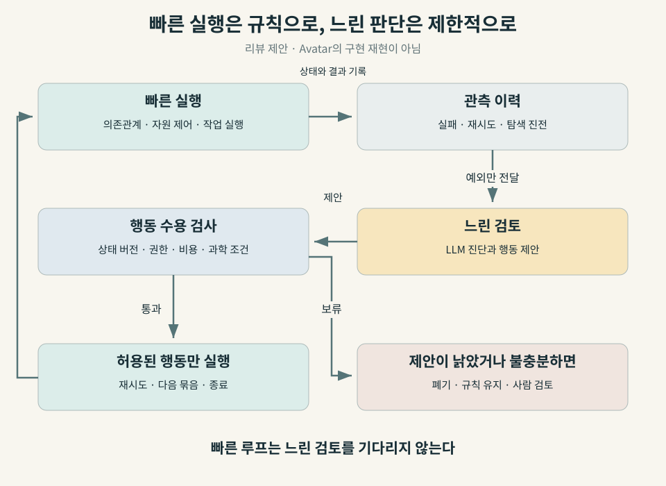

# 연구 에이전트는 언제 개입해야 하는가: Avatar가 드러낸 판단의 비용

## 3문장 요약

9월 9일 공개된 Avatar 프리프린트는 과학 계산의 실행 구조를 유지하면서 규칙 기반 제어와 대규모 언어모델(large language model, LLM)의 판단을 비교했다. 연구진은 분자 탐색에서 GPU 사용시간을 약 40% 줄였지만, 빠르게 변하는 자원 수요에 대응할 때는 평균 대기열이 규칙 기반의 약 21개에서 LLM 제어의 약 99개로 커졌다고 보고했다. 이 대비는 에이전트에게 맡길 일을 판단 주기와 잘못된 결정의 비용으로 나누어야 한다는 근거이며, 분자 실험은 새 전자구조 계산이 아닌 QM9 데이터 조회였다는 범위 안에서 읽어야 한다. [1]

*그림 1 · AI-generated conceptual. 빠른 반복 실행과 느린 판단의 분리를 표현한 전용 일러스트다. 원자 모형·계산 장치·검토 렌즈는 개념 표현이며 실제 재료, Avatar 장치 또는 측정 데이터가 아니다.*

관찰 기간은 2026년 9월 6–12일이다. 이 글은 [지난주 DeMARS 리뷰](https://infant83.github.io/AI_Tech_Review/reviews/2026-09-06_agentic-programs-materials-science/)에서 다룬 구조 모델 생성의 후속 논의이지만, 대상과 근거가 다르다. DeMARS는 무질서 결정의 원자 모델을 만드는 판단을 다뤘다. Avatar는 계산이 시작된 뒤 **실패를 어떻게 처리하고, 자원을 언제 늘리며, 탐색을 언제 끝낼지**를 비교 실험으로 묻는다. 5월의 [하네스 엔지니어링 리뷰](https://infant83.github.io/AI_Tech_Review/reviews/2026-05-09_ai-updates-weekly/)에 더해진 새 근거도 이 긍정·부정 결과의 동시 제시다.

## 계산을 잘하는 모델과 계산을 잘 운영하는 시스템

계산 재료과학에서 한 번의 입력 작성보다 더 오래 남는 일은 계산 묶음을 관리하는 일이다. 같은 계산이 다시 실패했을 때 재시도할지, 일시적인 자원 부족인지 물리적 설정 문제인지, 다음 후보를 평가할 가치가 남아 있는지 판단해야 한다. 이 판단을 자동화하면 연구자가 로그를 지켜보는 시간을 줄일 가능성이 있다. 반대로 판단을 기다리느라 계산 자원이 놀거나, 유망한 탐색을 일찍 끝내면 자동화가 손해를 만든다.

과학 워크플로 관리 시스템(workflow management system, WMS)은 작업의 의존관계와 실행 상태를 관리한다. 고성능 컴퓨팅(high-performance computing, HPC) 환경에서는 여기에 작업 스케줄러와 데이터 이동, 실패 복구가 연결된다. 에이전트의 **하네스**는 모델이 관측할 상태, 사용할 도구, 허용된 행동, 검증과 기록을 포함한 실행 환경이다. 모델이 문맥을 읽고 판단할 수 있어도 이 주변 기능은 여전히 필요하다.

Avatar의 연구 질문은 기존 시스템 전체를 LLM으로 교체할 수 있느냐가 아니다. **실행 구조와 허용 행동을 고정하고 판단 정책만 바꿨을 때, 어떤 결정에서 이득이 생기는가**다. 같은 하네스 안에서 비교한다는 점이 모델 이름이나 데모의 유창함보다 유용하다. 다만 아래 결과를 저자와 별개로 재실행한 것은 아니다. [1]

## 세 역할을 나누고, 판단 정책을 교체한다

Avatar는 작업의 논리적 진행을 결정하는 조정자(orchestrator), 실제 작업을 실행하는 실행자(executor), 실행 이력과 실패를 기록하는 관측·이력 담당(provenance)을 분리한다. 여기서 provenance는 결과가 어떤 입력, 시도, 실행 조건을 거쳐 나왔는지 추적할 수 있는 기록이다. [1, §III–IV]

이 역할을 구현하는 **actor**는 상태를 보관하고 메시지로 통신하는 소프트웨어 구성요소다. actor가 있다고 모든 역할이 LLM으로 움직이는 것은 아니다. 구현 기반인 Academy 역시 LLM 없이 동작할 수 있는 상태 기반 에이전트 미들웨어다. Avatar는 이 구분을 이용해 다음 세 조건을 비교한다. [1, 2]

| 비교 조건 | 관측·실패 진단 | 복구·진행 결정 | 작업 실행 |
|---|---|---|---|
| M0 | 규칙 | 규칙 | 규칙 |
| M1 | LLM 진단 추가 | 규칙 | 규칙 |
| M2 | LLM | LLM | 규칙 |

*표 1 · Source-derived. Avatar §IV의 정책 배치다. M2도 실행자까지 LLM으로 바꾼 완전 자율 실행은 아니다.*

정책이 제안한 행동은 adapter를 거친다. 이는 시스템 간 표현을 맞추면서 허용된 행동과 형식인지 확인하는 코드다. 재시도, 자원 확장·축소, 처리량 제한, 후보 묶음 제안, 대리모델 재학습, 탐색 종료 등이 공통 행동 목록에 들어간다. 자유로운 자연어가 곧바로 실행 명령이 되는 구조와는 다르다. [1]

그렇다고 행동 목록 검사가 과학적 타당성까지 보장하지는 않는다. `stop-campaign`이 올바른 형식이고 권한 범위 안에 있어도, 탐색을 끝낼 근거는 부족할 수 있다. **형식 검증, 권한 검증, 과학적 판단의 검증은 각각 필요하다**는 것이 이 리뷰의 해석이다.

연구진이 명시한 소프트웨어는 Python 3.12, Academy 0.5.0, Parsl 2026.3.9, TaskVine과 Colmena다. LLM은 Argonne의 Sophia 추론 서비스에서 제공한 `open-ai/gpt-oss-20b`다. E1/E2의 계산 노드는 Xeon Gold 6248R 3 GHz, CPU 48코어, 메모리 192 GB이며 actor 간 통신은 단일 프로세스의 로컬 메시지 교환을 사용했다. 따라서 이 실험을 여러 연구소에 분산된 에이전트 운영의 검증으로 확대하면 안 된다. Academy의 분산 실행 기능과 Avatar 논문의 실제 시험 범위도 구분해야 한다. [1, 2]

## 세 실험은 서로 다른 질문에 답한다

### 1. 복구: 다시 해도 실패하는 일을 얼마나 반복하는가

E1은 행렬 계산 뒤에 일시적 또는 영구적 실패를 주입한 합성 작업이다. 기본 실패 확률은 0.35, 실패 종류를 정하는 영구 실패 비율 파라미터는 1/3이다. 연구진은 재시도 상한과 실패 조건을 바꾸었다. M2는 반복 실패 이력을 보고 영구 실패로 판단하면 한 번 재시도한 뒤 포기했다. 논문의 최대 약 55% 낭비 계산 감소는 이 복구 실험의 조건부 성과다. [1, §V]

이 수치는 전체 연구 시간이 55% 줄었다는 뜻이 아니다. 또한 익숙한 오류 코드를 분류하는 규칙보다 LLM이 우월하다는 비교도 아니다. 기본 비교 대상은 정해진 횟수까지 다시 시도하는 정책이다. 실제 전자구조 계산에서는 메모리 부족, 입력 오류, 전자 수렴 실패처럼 대응이 다른 장애가 섞인다. 오류 종류를 아는 규칙과 비교해야 언어모델이 더한 가치를 분리할 수 있다.

### 2. 자원 확장: 판단이 늦으면 대기열이 쌓인다

E2는 입력 도착률이 달라지는 스트리밍 작업이다. 입력마다 전처리, 병렬 분석, 집계가 연결된다. 고정 worker 수의 Parsl과 Avatar의 동적 제어를 비교했다. worker는 작업을 실행할 수 있는 실행 슬롯이며, backlog는 아직 처리하지 못하고 쌓인 작업 수다. [1]

논문은 N=128 조건에서 규칙 기반 자동 확장(M0/M1)의 평균 backlog를 약 21, M2를 약 99로 보고한다. 저자들은 이를 LLM이 제어 루프에 필요한 속도로 반응하지 못한 결과로 해석한다. 두 값은 같은 실험의 작업 개수이며, 모델 정확도 점수가 아니다. 대기열을 0.2초마다 표본추출했다는 설명도 있지만, 이를 곧바로 모든 정책의 결정 주기가 0.2초라는 뜻으로 바꾸면 안 된다. [1, §V-A–B]

이 부정 결과는 운영 설계에 직접적이다. 짧은 주기로 반복해야 하는 자원 제어를 굳이 텍스트 해석에 맡길 이유가 있는지 먼저 물어야 한다. 규칙이 잘 정의된 곳에서는 빠른 규칙을 유지하고, 규칙이 다루지 못한 상황만 느린 진단으로 보내는 구성이 합리적인 후속 실험이다.

### 3. 탐색 종료: 덜 계산하고도 같은 최선값을 얻었는가

E3는 Colmena를 이용한 분자 능동학습(active learning)이다. 능동학습은 현재 모델로 다음에 평가할 후보를 고르고, 새 값을 반영해 모델을 다시 학습하는 과정이다. 이 실험은 최고 점유 분자궤도(highest occupied molecular orbital, HOMO)와 최저 비점유 분자궤도(lowest unoccupied molecular orbital, LUMO)의 에너지 차이를 최대화한다. QM9 후보 5,000개, 초기 라벨 100개, 회차당 선택 32개를 사용했다. Morgan 분자 지문을 입력으로 하는 다층 퍼셉트론(multilayer perceptron, MLP)을 GPU에서 학습했다. [1]

분자 값을 얻는 단계는 **QM9에 저장된 gap 조회**다. 밀도범함수이론(density functional theory, DFT) 계산을 새로 실행하거나 실험실에서 분자를 합성한 것이 아니다. 기존 데이터 조회를 값비싼 계산의 대역으로 쓰고, 그 주변의 탐색 운영을 시험했다. [1, §V-A]

기본 정책과 M0/M1은 12회차를 모두 실행했다. M2는 학습 진전을 보고 7회차에 종료해 같은 최선의 gap에 도달하면서 GPU-busy time을 약 40% 줄였다고 보고한다. 실행 환경은 NVIDIA Quadro RTX 6000 한 장, CUDA 12.2이며 해당 작업에 CPU 16개를 요청했다. [1, §V]

| 실험 | 논문이 보고한 비교 | 무엇을 측정했나 | 확대해서 말하면 안 되는 것 |
|---|---|---|---|
| E1, 실패 복구 | 낭비 계산 최대 약 55% 감소 | 합성 실패 작업의 낭비 worker 시간 | 전체 연구 시간·DFT 실패 복구 55% 개선 |
| E2, 자원 확장 | 평균 backlog 약 21 → 약 99, N=128 | 규칙 자동 확장 대비 M2의 대기 작업 수 | 정확도 차이 또는 모든 환경의 지연 배율 |
| E3, 탐색 종료 | 12 → 7회차, GPU-busy time 약 40% 감소 | QM9 조회 기반 탐색의 GPU 활동 시간 | 실제 DFT·총비용·전력 사용량 40% 감소 |

*표 2 · Source-derived. Avatar §V 및 그림 5–6의 본문 설명을 재구성했다. 세 행은 서로 다른 작업과 지표이며 하나의 성능 순위로 합치지 않았다. 공개된 수치를 독립 재현하지 않았다.*

12회차 중 5회차를 생략한 비율은 5/12, 약 41.7%다. 이것은 리뷰에서 확인한 단순 산술일 뿐 GPU 시간 측정의 재현이 아니다. 회차마다 학습 데이터가 늘고 고정 비용도 있어 회차 비율과 GPU 시간 비율은 같을 필요가 없다. 원문의 최선 gap 수치에는 본문 단위 설명이 충분하지 않아 이 리뷰에서는 eV나 Hartree로 추정 변환하지 않았다.

## 비용을 줄였다는 주장에 아직 필요한 분모

E3에서 GPU가 덜 일했다는 사실과 전체 시스템이 저렴해졌다는 판단 사이에는 측정 항목이 더 필요하다. 추론 서비스의 자원 사용, 네트워크 대기, CPU 작업, 실패한 판단의 복구, 사람의 개입을 포함해야 한다. GPU-busy time은 측정된 활동 시간이며, 에너지 적분이나 청구 비용과 동일하지 않다.

후속 비교를 설계하기 위한 **리뷰의 제안식**은 다음처럼 쓸 수 있다.

$$G = p_{\mathrm{useful}}C_{\mathrm{saved}}-C_{\mathrm{inference}}-\mathbb{E}[C_{\mathrm{wrong}}].$$

여기서 G는 기대 순이득, p는 유용한 판단의 확률, C_saved는 그 판단으로 줄이는 비용, C_inference는 추론·통신 비용, 마지막 항은 잘못된 결정으로 생기는 기대 손실이다. 모든 C는 같은 비용 단위로 평가해야 한다. CPU 초와 GPU 초를 그냥 더하지 않는다. 이 식은 Avatar가 제시하거나 적합한 모델이 아니며, 빠진 비용을 드러내기 위한 장부다.

시간 제약은 별도로 둬야 한다. 결정 지연 τ가 환경이 달라지는 시간 Δ와 비슷하면, 좋은 판단도 적용 시점에는 낡을 수 있다. 그렇다고 τ/Δ가 어떤 값 아래이면 안전하다는 보편적 임계값이 이 논문에서 증명된 것은 아니다. E2와 E3는 판단을 기다리는 동안 발생하는 비용이 다르다는 사례다.

<figure class="figure-panel figure-panel-fit">

<figcaption>그림 2 · Proposed / reviewer-constructed. Avatar의 정책 분리에서 출발해 재료 계산에 제안하는 두 시간척도 구조다. 상태가 바뀌었으면 제안을 폐기하고, 과학적 종료 조건은 따로 검사한다. Avatar 구현을 복제한 도식이나 성능 보증이 아니다.</figcaption>
</figure>

## “언제 멈출지 안다”를 검증하려면

가장 강한 후속 비교는 더 좋은 종료 규칙이다. 최근 몇 회차 동안 개선이 없으면 멈추는 patience 정책, 불확실성과 기대 개선량을 이용하는 정책, 일정 비용까지 탐색하는 정책을 같은 후보군과 예산에서 비교해야 한다. M2가 고정 12회차보다 적게 계산했다는 사실만으로 이들보다 낫다고 결론내릴 수 없다.

또한 이번 실행에서 같은 최선값을 얻었다고 해서 새로운 seed와 후보군에서도 손실 없이 멈춘다는 보장은 없다. 종료 시점에 남아 있던 후보의 최선값, 여러 초기 표본에 대한 결과 분포, 종료 후 추가 탐색에서 발견되는 개선량을 보고 싶다. 이미 정답이 있는 QM9라면 선택되지 않은 후보까지 이용해 사후 손실을 평가하기 좋다. 실제 신규 계산에서는 그 사후 정답 자체가 비싸므로 일부 후속 계산 예산을 검증용으로 남겨야 한다.

재현성에도 선을 긋는다. 원문은 공통 코드 약 1,200줄을 세 작업에서 그대로 썼다고 설명하지만, 이 조사에서 **Avatar 실험 전용 공개 저장소와 고정 commit을 확인하지 못했다**. Academy·Colmena의 공개 코드가 있다는 사실로 Avatar의 정책, prompt, 무효 행동 처리, seed별 로그가 공개됐다고 대신 말할 수 없다. 본문 대조와 산술 점검은 수행했지만, 저자 코드의 독립 재실행은 하지 않았다. [1–3]

## 재료 계산과 기업 운영에 적용할 작은 실험

다음은 기존 성과가 아닌 후속 제안이다. 첫 적용 대상으로는 새 분자 생성 전체를 맡기기보다, 이미 실행된 계산의 실패 로그를 읽고 다음 행동을 제안하는 작업이 적절하다. 제안의 이득과 위험을 과거 이력에서 비교할 수 있기 때문이다.

1. **과거 계산을 재생한다.** 알려진 실패 로그를 입력으로 주되 최종 해결법은 숨긴다. 기존 재시도, 오류 분류 규칙, LLM 진단+규칙 실행, LLM 행동 제안을 같은 사례에서 비교한다. 동일 구조의 계산이 학습과 평가에 섞이지 않도록 작업 계열별로 나눈다.
2. **바꾸지 않을 물리를 고정한다.** 전하·스핀·교환상관 범함수·기저·k점·수렴 기준 등은 작업 계약에 기록한다. 이 중 변경이 필요한 제안은 기존 계산의 재시도가 아니라 별도 과학 조건의 새 작업으로 남긴다. 빨리 끝났다는 이유로 다른 물리를 계산한 결과를 성공으로 세지 않는다.
3. **읽기 전용 검토부터 시작한다.** LLM은 결과를 제안만 하고 실제 실행은 하지 않는다. 사람이 개입한 횟수와 시간, 잘못 포기한 계산, 유효한 결과를 얻은 비율을 모두 기록한다. 전체 작업 수와 자동 수용한 작업 수를 따로 분모로 둔다.
4. **유효한 제안만 제한 실행한다.** 승인한 행동 목록, 비용 한도, 상태 버전 검사, 중복 실행 방지 키, 규칙 기반 대체 동작을 둔다. 전역 큐 제어와 빠른 상태 감시는 기존 실행 시스템에 남긴다.

유기발광다이오드(organic light-emitting diode, OLED) 연구에서는 궤도 gap 하나가 여기상태·발광속도·열화 안정성을 대신하지 않는다. Avatar를 OLED 재료 발견 성과로 읽지 않고, 계산 캠페인 운영을 시험할 구조로 가져오는 편이 정확하다. 기존 양자·OLED 브리핑과 달리 이 글이 평가하는 대상은 물성 예측기가 아니라 **연구를 실행하는 제어 정책**이다.

온프레미스 환경에서는 모델을 내부에 두었다는 사실과 작업 권한을 제한했다는 사실을 구분해야 한다. 모델 서비스, 계산 실행 계정, 게시·병합 계정을 분리하고, 로그를 비신뢰 입력으로 취급하는 구성을 제안한다. GitLab의 지속적 통합·배포(continuous integration/continuous delivery, CI/CD)는 테스트와 변경 승인을 담당하고, HPC 스케줄러는 자원 실행을 담당하도록 역할을 유지할 수 있다. 이는 이 리뷰의 운영 설계 제안이며 Avatar에서 검증한 GitLab 통합은 아니다.

## 연구자와 세미나에서 물을 질문

| 후보 | 확인한 공개 소속·대표 근거 | 초청 세미나 질문 |
|---|---|---|
| Suman Raj | Avatar 제1저자, 논문상 University of Chicago·Argonne National Laboratory 공동 소속 [1] | 규칙 기반 영구 실패 분류와 patience 종료 정책을 추가하면 M2의 이득은 얼마나 남는가? |
| Kyle Chard | University of Chicago Research Associate Professor·Argonne 연구자; Avatar 공동저자, Academy 관련 연구 [1, 2, 4] | 다중 노드 환경에서 상태가 바뀐 제안과 중복 명령을 어떻게 막고, 어떤 로그를 공개할 수 있는가? |

소속은 근거 확인일의 공개 기록을 사용했다. 논문에 없는 프로젝트별 책임 범위는 추정하지 않았다.

## 다음 논문에서 확인할 것

Avatar는 에이전트의 장점을 주장하면서 동시에 규칙이 더 나았던 조건을 보여준다는 점에서 읽을 가치가 있다. 다만 실제 DFT 실행, 다중 노드 배치, 강한 적응형 기준선, 총 추론 비용, 사람 개입을 포함한 반복 평가가 더 필요하다. 다음 판단은 “더 큰 모델을 붙였는가”보다 **같은 과학적 결과와 허용 위험 아래 유효 결과당 총비용이 줄었는가**로 내려야 한다.

## 참고자료와 짧은 읽기 순서

1. **[Raj et al., Avatar, arXiv:2609.10509v1](https://arxiv.org/abs/2609.10509v1)** — 2026-09-09 제출, 프리프린트. [본문 §III–V](https://arxiv.org/html/2609.10509v1)에서 M0/M1/M2와 E1/E2/E3를 먼저 읽는다. 제출일은 확인했으며 실험 수행일은 별도 공개되지 않았다.
2. **[Academy 공식 소개](https://academy-agents.org/)** · [공식 코드](https://github.com/academy-agents/academy) — 상태·행동·비동기 메시지가 LLM과 독립적인 구성요소임을 확인할 자료. 현재 문서와 논문에 사용된 0.5.0의 기능 범위를 혼동하지 않는다.
3. **[Colmena 공식 문서](https://colmena.readthedocs.io/en/latest/)** — 과학 계산을 학습 결과로 조정하는 실행 기반. Avatar 실험 자체의 재현 패키지는 아니다.
4. **[Kyle Chard 공개 연구자 소개](https://kylechard.com/)** — 소속 확인. 검색·문서 확인일 2026-09-13.

## 작성 및 검토 정보

책임 편집자: 김현중. 정기 공개 요청에 따라 OpenAI Codex 에이전트 1개가 조사·한영 집필·출처 대조·과학 감수·코딩·게시 검사를 수행했다. 정확한 실행 모델 식별자는 보존되지 않았으며, 별도 검증 에이전트나 문장 단위 사람 검토는 없었다. 근거 기준일은 2026-09-12이고 원문·문서 확인은 9월 13일 수행했다.

[AI Tech Review Editorial Harness v2026.08](https://infant83.github.io/AI_Tech_Review/methods/)에 따라 웹 검색·GitHub 연결·로컬 Python 렌더/검사·브라우저 확인을 사용했다. 표지는 imagegen 내장 생성 도구로 만들었고 도식은 결정론적 SVG다. 과학 감수에서는 수치와 비교 조건을 고정한 뒤 추상적 중요성 선언과 과도한 대비를 줄였다. 본문 대조, 회차 비율 산술, 페이지·링크·metadata 검사를 수행했지만 Avatar 계산과 GPU 측정은 재현하지 않았다. 전체 추론 비용과 일반화는 미확인이다.

출처·재구성 고지: Raj, Nguyen, Pan, R. Chard, K. Chard, Foster의 Avatar v1은 CC BY-NC-SA 4.0으로 공개되어 있다. 이 글의 원문 기반 해설과 표는 해당 논문을 번역·요약·비평해 재구성했으며 원 그림을 복제하지 않았다. 이 한영 리뷰 본문과 재구성 도식은 [CC BY-NC-SA 4.0](https://creativecommons.org/licenses/by-nc-sa/4.0/)으로 제공한다. 생성 표지는 별도 AI 개념 이미지이며 원 논문의 그림이 아니다.
