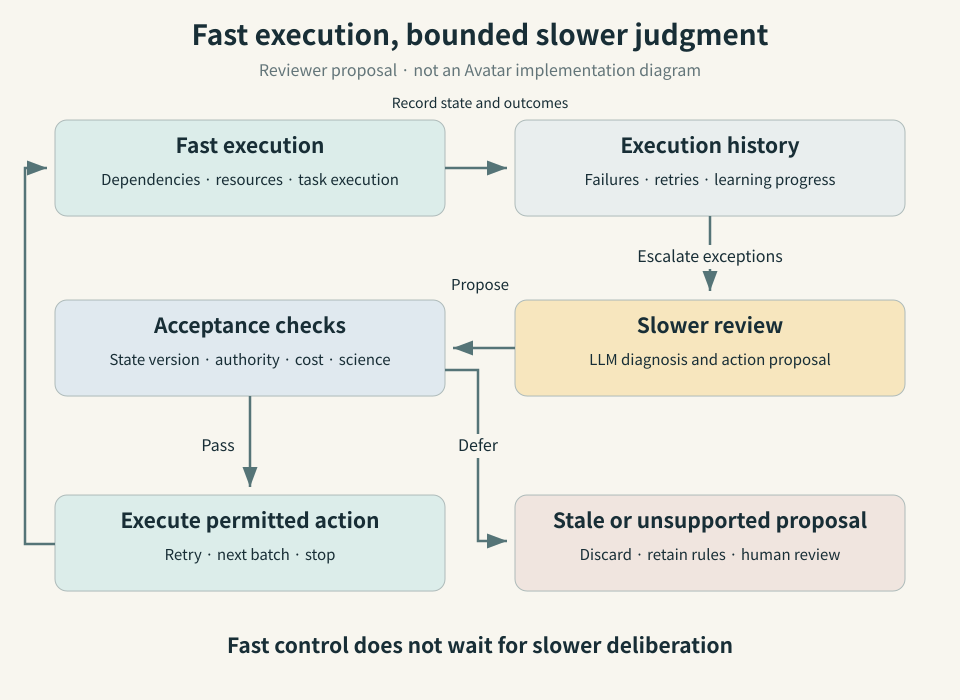

# When Should a Research Agent Intervene? Avatar and the Cost of Judgment

## Three-sentence summary

The Avatar preprint, submitted on September 9, compares rule-based control with large language model (LLM) decisions while retaining the surrounding scientific-workflow architecture. Its authors report approximately 40% less GPU-busy time in a molecular search, but a larger mean backlog—about 99 tasks rather than 21—when LLM control replaces a rule-based autoscaler. The contrast supports separating decisions by their timescale and the cost of being wrong, within an important boundary: the molecular experiment retrieved existing QM9 values rather than running new electronic-structure calculations. [1]

*Figure 1 · AI-generated conceptual. A dedicated illustration of fast execution and slower judgment. The atomistic model, compute hardware and inspection lenses represent concepts, not a measured material, an Avatar apparatus or experimental data.*

This review covers September 6–12, 2026. It follows the [DeMARS article](https://infant83.github.io/AI_Tech_Review/reviews/2026-09-06_agentic-programs-materials-science/en/), but addresses a different problem with new evidence. DeMARS concerns constructing atomistic models from disordered structures. Avatar examines decisions made **during execution: recovery, resource scaling and campaign termination**. Relative to the earlier [harness-engineering review](https://infant83.github.io/AI_Tech_Review/reviews/2026-05-09_ai-updates-weekly/), the new contribution is a controlled comparison containing both favorable and unfavorable outcomes.

## Running the calculation is only part of running the research

A computational materials campaign leaves a trail of decisions after its inputs have been prepared. Should a failed job be retried? Is the failure temporary, or will another attempt repeat it? Does another batch of candidates justify its cost? Automating these decisions could reduce the time researchers spend watching logs. It could also leave resources idle while a model deliberates, or terminate a promising campaign too soon.

A workflow management system (WMS) tracks task dependencies and execution state. In high-performance computing (HPC), it interacts with schedulers, data movement and recovery mechanisms. An agent's **harness** specifies the state it can observe, the tools it can use, its permitted actions, and the validation and records surrounding those actions. A model's ability to interpret context does not remove these responsibilities.

Avatar asks a tractable question: if the execution architecture and action interface remain fixed, which decisions benefit from replacing a rule with an LLM policy? This is more informative than a fluent demonstration that changes the model, tools and workflow simultaneously. The results discussed here are author-reported; this review did not independently rerun the experiments. [1]

## Separate the responsibilities, then vary the policy

Avatar separates an **orchestrator**, which governs logical workflow progress; an **executor**, which realizes actions on computational resources; and a **provenance component**, which preserves execution history and produces diagnostic triggers. Provenance makes it possible to trace a result to its inputs, attempts and execution conditions. [1, §III–IV]

An actor is a stateful software component that communicates through messages. An actor need not contain an LLM. Academy, the middleware underlying Avatar, likewise supports stateful agents without requiring a language model. This distinction makes the following comparison possible. [1, 2]

| Condition | Observation and failure diagnosis | Recovery and progression decisions | Task execution |
|---|---|---|---|
| M0 | Rules | Rules | Rules |
| M1 | LLM diagnosis added | Rules | Rules |
| M2 | LLM | LLM | Rules |

*Table 1 · Source-derived from Avatar §IV. Even M2 retains rule-based execution; it is not an experiment with an LLM controlling every component.*

Proposed actions pass through an adapter: code that translates representations and checks actions against the supported interface. The common catalog includes retrying, scaling resources, throttling work, proposing candidate batches, retraining a surrogate and stopping a campaign. Policies therefore act through defined operations rather than unrestricted natural-language commands. [1]

This interface is necessary but does not certify scientific judgment. A `stop-campaign` action can be well formed and authorized while scientifically premature. This review therefore distinguishes three checks: valid syntax, authorized action and justified scientific decision. Passing one does not imply the others.

The reported stack includes Python 3.12, Academy 0.5.0, Parsl 2026.3.9, TaskVine and Colmena. Reasoning uses `open-ai/gpt-oss-20b`, served through Argonne's Sophia inference endpoint. The E1/E2 compute node has a Xeon Gold 6248R at 3 GHz, 48 CPU cores and 192 GB of memory; the actors communicate through a local, in-process exchange. Academy's support for distributed agents must not be confused with Avatar's actual test scope: these experiments do not establish operation across multiple institutions or heterogeneous compute sites. [1, 2]

## Three experiments, three distinct questions

### Recovery: how much work is spent repeating permanent failures?

E1 uses synthetic matrix-computation tasks with injected transient or permanent failures. The default failure probability is 0.35; the parameter determining the fraction of permanent failures is 1/3. The study varies the retry ceiling and failure conditions. M2 uses repeated-failure history and abandons tasks diagnosed as permanently failing after one retry. The reported reduction of up to approximately 55% concerns wasted computation under these recovery conditions. [1, §V]

That is not a 55% reduction in total research time. Nor does the comparison establish superiority over a failure-aware deterministic classifier. The principal baseline retries blindly up to a limit. Electronic-structure workloads contain failures with very different remedies, including memory exhaustion, invalid inputs and electronic convergence problems. Rules that recognize these conditions are an important stronger baseline for isolating the benefit of language-model reasoning.

### Scaling: a decision can arrive too late

E2 is a streaming workload with changing arrival rates. Each input creates preprocessing, parallel analysis and aggregation stages. The study compares fixed Parsl worker pools and dynamic Avatar control. A worker is an execution slot; backlog counts tasks waiting for processing. [1]

At N=128, the reported mean backlog is approximately 21 for rule-based autoscaling, M0/M1, and 99 for M2. The authors attribute the degradation to reasoning that cannot respond quickly enough for the control loop. These are task counts within one experiment, not model-accuracy scores. The paper also says backlog was sampled every 0.2 seconds; that sampling interval should not be silently reinterpreted as every policy's decision period. [1, §V-A–B]

This negative result matters for implementation. A fast, repetitive control operation should justify the latency of text-based reasoning before adopting it. A useful follow-up would preserve lightweight control rules and escalate only situations those rules cannot resolve.

### Stopping: can a campaign do less work without losing its best result?

E3 uses Colmena for molecular active learning: a model chooses which candidates to evaluate next, then learns from the newly acquired values. The objective is to maximize the energy difference between the highest occupied molecular orbital (HOMO) and lowest unoccupied molecular orbital (LUMO). The setup uses 5,000 QM9 candidates, 100 initial labels and batches of 32 selections. A multilayer perceptron (MLP) trained on Morgan molecular fingerprints serves as the GPU-based surrogate. [1]

The evaluation step retrieves a **stored QM9 gap**. It does not run a new density functional theory (DFT) calculation or synthesize a molecule. Existing values stand in for an expensive property calculation, allowing the experiment to test the surrounding campaign control. [1, §V-A]

The native baseline and M0/M1 run all 12 rounds. M2 interprets the learning history and stops at round 7, reaching the same best observed gap while reducing GPU-busy time by approximately 40%, according to the authors. The campaign uses one NVIDIA Quadro RTX 6000 with CUDA 12.2 and requests 16 CPU cores. [1, §V]

| Experiment | Reported comparison | Quantity measured | Claim not established |
|---|---|---|---|
| E1: recovery | Up to approximately 55% less wasted computation | Wasted worker time in a synthetic failure workload | 55% less total research time or better DFT recovery |
| E2: scaling | Mean backlog approximately 21 → 99, N=128 | Pending tasks, rule autoscaler versus M2 | An accuracy difference or universal latency ratio |
| E3: stopping | 12 → 7 rounds; approximately 40% less GPU-busy time | GPU activity in a QM9-lookup campaign | 40% less DFT time, total cost or energy |

*Table 2 · Source-derived from Avatar §V and the textual discussion of Figures 5–6. The rows describe different tasks and metrics, not a combined ranking. The reported measurements were not independently reproduced.*

Skipping five of twelve rounds is 5/12, approximately 41.7%. This review checked that arithmetic, not the GPU measurement. Training-set growth and fixed overhead mean round counts need not scale directly with GPU activity. The paper's best-gap number lacks a sufficiently explicit unit description in the main text; this review does not assign it an assumed eV or Hartree unit.

## What is missing from the cost denominator?

Less GPU activity does not by itself establish a cheaper whole system. The accounting should include inference-service resources, network waits, CPU work, recovery from bad decisions and human intervention. GPU-busy time is activity duration, not an energy integral or an invoice.

An **editorial accounting proposal** for a follow-up experiment is:

$$G = p_{\mathrm{useful}}C_{\mathrm{saved}}-C_{\mathrm{inference}}-\mathbb{E}[C_{\mathrm{wrong}}].$$

G denotes expected net benefit; p is the probability of a useful intervention; C_saved is the cost it avoids; C_inference covers inference and communication; the final term is expected loss from a wrong decision. All costs must use a common unit. CPU-seconds and GPU-seconds cannot simply be added. This is not an equation fitted or proposed by Avatar's authors; it is a way to expose omitted costs.

A timing constraint remains separate. If decision latency τ is comparable to the environment's change timescale Δ, even a well-reasoned action may be stale when applied. The paper does not prove a universal safety threshold for τ/Δ. E2 and E3 instead illustrate different costs of waiting for a decision.

<figure class="figure-panel figure-panel-fit">

<figcaption>Figure 2 · Proposed / reviewer-constructed. A materials-workflow design motivated by Avatar's separation of policies. Stale proposals are discarded and scientific stopping criteria are checked separately. This is neither a reconstruction of the Avatar implementation nor a performance guarantee.</figcaption>
</figure>

## Testing whether the system knows when to stop

A stronger follow-up should compare M2 with adaptive stopping rules. These include patience policies that terminate after several rounds without improvement, policies based on uncertainty and expected improvement, and fixed-cost budgets. They should share the candidate pool and resource constraints. Doing less work than an unconditional twelve-round baseline does not establish superiority over those alternatives.

Reaching the same best value in the reported run also does not establish lossless stopping across new seeds and pools. Useful measurements include the best remaining candidate at termination, outcome distributions over initial samples, and improvements discovered by continuing after the proposed stopping point. Because QM9 labels already exist, the study setting is well suited to measuring retrospective loss on unselected candidates. In genuinely new calculations that ground truth is costly; some continuation budget must be reserved for validation.

Reproducibility is another boundary. The authors describe approximately 1,200 lines of common core code retained across the three workloads, but this investigation did **not identify a public, experiment-specific Avatar repository and pinned commit**. Public Academy and Colmena code does not establish that Avatar's prompts, policies, invalid-action handling and per-seed logs are available. The review checked the paper and simple arithmetic, not the authors' implementation by execution. [1–3]

## A bounded experiment for materials research and enterprise operations

The following is a proposal, not a reported deployment. A practical first target is to read historical calculation failures and recommend next actions. That task can be evaluated against prior outcomes before granting authority over an entire molecular-discovery campaign.

1. **Replay completed cases.** Present failure logs but hide their eventual resolution. Compare ordinary retry, failure-aware rules, LLM diagnosis with rule execution, and LLM action proposals. Split related calculation families across evaluation boundaries to reduce leakage.
2. **Fix the scientific contract.** Record charge, spin, exchange–correlation functional, basis, k-point sampling and convergence criteria. A proposal that changes these conditions becomes a new scientific task, not an invisible retry. Finishing faster by calculating a different physical problem should not count as success.
3. **Begin in read-only shadow mode.** Let the model propose without actuating. Record human interventions and their duration, recoverable calculations wrongly abandoned, and the fraction yielding scientifically valid outputs. Report both all-task and automatically accepted-task denominators.
4. **Grant only bounded execution.** Use an approved action catalog, cost limits, state-version checks, duplicate-execution protection and a rule-based fallback. Leave global queue control and fast monitoring with the established execution system.

For organic light-emitting diode (OLED) research, an orbital gap does not substitute for excited-state properties, emission rates or degradation stability. Avatar should be transferred as a testable control architecture, not presented as an OLED-discovery result. The object being evaluated here is the **policy running the research**, not its property predictor; this distinguishes the article from the recurring quantum and OLED briefs.

On-premises model hosting and restricted execution authority are separate design decisions. This review proposes separating the model service, compute execution account and publication or merge account, and treating logs as untrusted input. GitLab continuous integration/continuous delivery (CI/CD) can retain tests and change approval, while an HPC scheduler retains resource execution. This is an operational proposal, not a GitLab integration validated in Avatar.

## Researchers and seminar questions

| Candidate | Public affiliation and relevant evidence | Question for a seminar |
|---|---|---|
| Suman Raj | Avatar first author; University of Chicago and Argonne National Laboratory affiliations in the paper [1] | How much benefit remains after adding a deterministic permanent-failure classifier and a patience-based stopping policy? |
| Kyle Chard | Research Associate Professor at the University of Chicago and Argonne researcher; Avatar coauthor and Academy-related work [1, 2, 4] | How should multi-node systems reject stale or duplicated actions, and which execution records can be released for independent evaluation? |

Affiliations reflect the checked public records. Project-specific leadership responsibilities were not inferred.

## What to watch next

Avatar is worth reading because it reports a condition in which rules outperform LLM control alongside favorable results. Stronger evidence would add real DFT execution, multi-node placement, adaptive baselines, total inference costs and repeated evaluation including human intervention. The next decision should turn on **total cost per valid result at matched scientific quality and acceptable risk**, not merely the size of the model attached to the workflow.

## References and a short reading order

1. **[Raj et al., Avatar, arXiv:2609.10509v1](https://arxiv.org/abs/2609.10509v1)** — submitted September 9, 2026; preprint. Start with [§III–V](https://arxiv.org/html/2609.10509v1) and the M0/M1/M2 and E1/E2/E3 definitions. Submission date was checked; experiment dates were not separately reported.
2. **[Academy official overview](https://academy-agents.org/)** and [source repository](https://github.com/academy-agents/academy) — state, actions and asynchronous messages as components independent of an LLM. Distinguish current documentation from the 0.5.0 version used in the paper.
3. **[Colmena documentation](https://colmena.readthedocs.io/en/latest/)** — background on machine-learning-based steering of scientific work. This is not the Avatar experiment's reproduction package.
4. **[Kyle Chard's public profile](https://kylechard.com/)** — affiliation verification. Sources checked September 13, 2026.

## Preparation and review information

Responsible editor: Hyun-Jung Kim. One OpenAI Codex agent performed research, bilingual writing, source checks, scientific copyediting, coding and publication checks under the recurring publication request. The exact runtime model identifier was not retained. There was no separate verification agent or line-by-line human review. The evidence cutoff is September 12, 2026; source inspection took place on September 13.

The workflow followed [AI Tech Review Editorial Harness v2026.08](https://infant83.github.io/AI_Tech_Review/methods/), using web research, the GitHub connection, local Python rendering and checks, and browser inspection. The hero used the built-in imagegen tool; the diagram is deterministic SVG. Scientific copyediting preserved measurements and comparison conditions while removing abstract importance claims and excessive contrasts. Checks covered the paper, round-count arithmetic, pages, links and metadata; Avatar computations and GPU measurements were not reproduced. Total inference cost and generalization remain unverified.

Attribution and adaptation: Avatar v1 by Raj, Nguyen, Pan, R. Chard, K. Chard and Foster is distributed under CC BY-NC-SA 4.0. Paper-derived explanations and tables here translate, summarize and critically adapt that work; no original figure was copied. This bilingual review text and its reconstructed diagrams are provided under [CC BY-NC-SA 4.0](https://creativecommons.org/licenses/by-nc-sa/4.0/). The generated hero is a separate AI conceptual illustration, not a figure from the paper.
