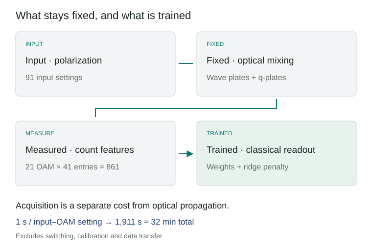
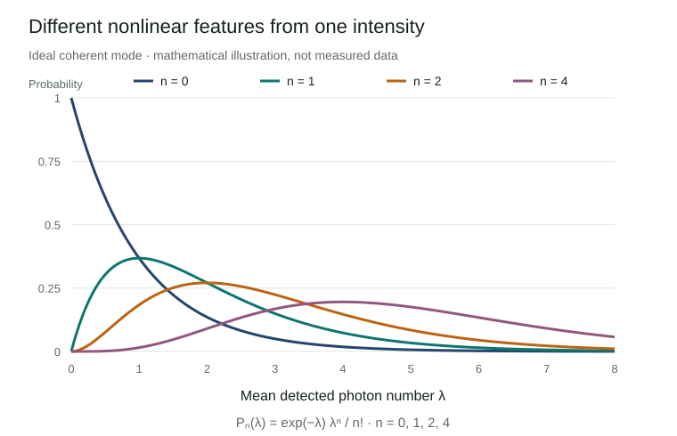

# From light intensity to photon-count distributions: reading multiphoton reservoir computing

Optical computing is attractive because light can transform an input across many paths during propagation. Fast propagation, however, is only one part of a learning system. Encoding the input, choosing an observable and collecting enough measurements also determine its performance. Hong and colleagues’ **multiphoton quantum reservoir** explores the measurement step: replacing mean intensity with photon-number distributions produces a richer set of learning features from the same optical field.

The persuasive result is a demonstration of nonlinear function reconstruction using accessible light sources and a fixed optical network. The paper’s references to quantum speedup require a more specific reading. Better regression, faster spatial spreading and classical computational hardness are different claims. This review explains the apparatus, examines the evidence for each claim and considers what would be needed for applications.

*An AI-generated illustration of optical mode conversion and photon counting. It does not reproduce the experimental layout or measured data.*

**Research status.** Mingyuan Hong et al., *Multiphoton Quantum Reservoirs For Robust Multidimensional Computing*, **Advanced Science**, e77225, first published **19 August 2026**. Evidence cutoff: **13 September 2026**. This is a peer-reviewed room-temperature optical experiment. The main article and its 15-page Supporting Information (SI) were reviewed. Raw data are offered on reasonable request; the experimental results were not independently reproduced. [Article](https://advanced.onlinelibrary.wiley.com/doi/10.1002/advs.77225) · [Supporting Information](https://advanced.onlinelibrary.wiley.com/action/downloadSupplement?doi=10.1002%2Fadvs.77225&file=advs77225-sup-0001-SuppMat.pdf)

## 1. Classical light can still be counted in photons

In quantum optics, **classical light** does not mean light without photons. It means that the state admits a nonnegative probability mixture of coherent states. An ideal laser’s coherent state and thermal light are examples. A coherent state has Poisson photon-number statistics; single-mode thermal light has larger fluctuations. Fixed-number Fock states and squeezed light can provide nonclassical resources under this definition.

A **Fock state** \(|n\rangle\) has a definite photon number in a specified mode. The paper describes number-resolved measurements as projections in this basis. Operationally, its detector records event times and groups counts into acquisition windows. Selecting records in which seven photons were detected produces conditional statistics. With absorbing photodetection, this does not mean that a seven-photon state survives the measurement and becomes available to a subsequent circuit. [Main §2; SI Notes 4–5](https://advanced.onlinelibrary.wiley.com/doi/10.1002/advs.77225)

This distinction matters when interpreting headlines about turning classical light into a quantum machine. Conditional photon-count patterns can reveal structure hidden by mean intensity. Observing that structure, preparing a reusable nonclassical state and establishing classical computational hardness are separate achievements.

## 2. Encoding polarization and mixing spatial modes

The apparatus combines **polarization**, the orientation of the optical electric field, with **orbital angular momentum (OAM)**. An OAM mode is labelled by an integer \(\ell\) describing phase winding around the beam. Coupling these modes creates a synthetic lattice; it does not require a physical array of interacting particles.

A half-wave plate (HWP) rotates polarization, a quarter-wave plate (QWP) changes relative polarization phases, and a q-plate couples polarization to OAM shifts. For the learning experiment, internal wave-plate angles are chosen randomly once and then held fixed. Only the input polarization changes. A spatial light modulator (SLM) selects output OAM projections for detection. Every input therefore encounters the same physical feature map. [SI Note 4](https://advanced.onlinelibrary.wiley.com/action/downloadSupplement?doi=10.1002%2Fadvs.77225&file=advs77225-sup-0001-SuppMat.pdf)

The source configuration changes between experiments. The setup uses a 633 nm laser and thermal light generated with rotating ground glass. Thermal sources support the walk and thermal-statistics experiments. The function-reconstruction section specifically describes encoding inputs into the polarization of **spatially coherent light**. Treating every result as a single thermal-light learning experiment would obscure this distinction. [Main §4](https://advanced.onlinelibrary.wiley.com/doi/10.1002/advs.77225)

*A reviewer-constructed flow diagram. The optical network remains fixed; only the final classical regression weights are trained. Repeated acquisition is needed to estimate distributions.*

## 3. Nonlinear features after linear optics

**Reservoir computing** passes inputs through a fixed complex system and combines its responses with a simple trained readout. Avoiding training throughout the physical system can simplify implementation. Here the demonstrated task is reconstruction of functions of the present input. Forecasting a sequence using memory of earlier inputs requires a separate evaluation.

Let \(\lambda\) be the mean detected photon number of an ideal coherent mode. Its count probabilities are

\[P_n(\lambda)=e^{-\lambda}\frac{\lambda^n}{n!}.\]

Using the mean alone and using \(P_0,P_1,P_2,\ldots\) create different feature maps. The vacuum probability decreases with intensity; the one- and two-photon probabilities peak at different intensities. **Measurement probabilities are nonlinear functions of intensity**, even without a material optical nonlinearity. This ideal Poisson example explains the mechanism; it is not a calibrated model of the experimental detector.

*Curves computed from the displayed equation for explanation. They are not experimental data.*

The experiment combines **21 OAM projections**, \(\ell=-10\ldots10\), with **41 number entries**, \(n=0\ldots40\), giving **861 components**. A linear readout forms \(\hat y=b+\sum_{\ell,n}w_{\ell,n}P_{\ell,n}(x)\). The SI specifies ridge regularization, which penalizes excessively large weights. [Main Fig. 4; SI Note 7](https://advanced.onlinelibrary.wiley.com/doi/10.1002/advs.77225)

These are neither 861 qubits nor 861 independent degrees of freedom. In the SI’s principal-component analysis (PCA), the first component explains **75%** of variance, 16 components explain **99%**, and the participation-ratio effective dimension is **1.7**. The authors also report rank 91 for the feature matrix of 91 inputs. Algebraic rank and concentration of variance measure different properties: a thin curve can still bend through many directions. A low-dimensional input can yield useful nonlinear features, but full rank alone does not guarantee generalization. [SI Note 7C](https://advanced.onlinelibrary.wiley.com/action/downloadSupplement?doi=10.1002%2Fadvs.77225&file=advs77225-sup-0001-SuppMat.pdf)

## 4. What baseline improved?

The dataset consists of **91 polarization-encoded inputs**, randomly split **80% for training and 20% for testing**. Table S2 reports test-set coefficients of determination, \(R^2\), averaged over random partitions. Values closer to one indicate better reconstruction. The baseline retains **21 mean photon numbers from the same optical field** and uses a linear regression readout. [SI Table S2](https://advanced.onlinelibrary.wiley.com/action/downloadSupplement?doi=10.1002%2Fadvs.77225&file=advs77225-sup-0001-SuppMat.pdf)

| Target | Mean-intensity features · 21 | Count-distribution features · 861 |
|---|---:|---:|
| Quadratic | 0.92 | 0.94 |
| Cubic | 0.89 | 0.93 |
| Quartic | 0.90 | 0.94 |
| Exponential | 0.96 | 0.97 |
| Logarithmic | 0.97 | 0.97 |
| Damped sinusoid | 0.69 | 0.94 |
| Reported mean | 0.89 | 0.95 |

The largest improvement is for the damped sinusoid. The logarithmic result is unchanged at the reported precision. Although the SI prose groups quartic and damped-sinusoid targets under an improvement from 0.69 to 0.94, **Table S2 gives 0.90 to 0.94 for the quartic target**. This review follows the individual table entries.

The comparison supports retaining count distributions rather than just intensity. A broader claim against classical learning would require stronger controls: Poisson features computed from measured means, polynomial or Fourier features, and kernel ridge regression, evaluated with identical splits and tuning budgets. Feature count and regularization should also be controlled. These are proposed follow-up baselines, not experiments already reported in the paper.

## 5. A fast readout and a slower measurement pipeline

The **30 μs training time** in SI Table S1 is an author-reported readout-training figure. It is not the duration of source preparation and feature acquisition. Detection events are grouped into **1 μs windows**, with **one million windows collected in one second per polarization–OAM setting**. The complete dataset therefore takes \(91\times21\times1\,\mathrm{s}=1,911\,\mathrm{s}\), or **31.85 minutes**, of raw acquisition. The SI explicitly reports approximately 32 minutes. Switching, alignment, calibration and data transfer add overhead. The same features are reusable across all six targets, so this acquisition cost should not be charged six times. [SI Notes 4, 7A, 7D](https://advanced.onlinelibrary.wiley.com/action/downloadSupplement?doi=10.1002%2Fadvs.77225&file=advs77225-sup-0001-SuppMat.pdf)

Number resolution is implemented with avalanche photodiodes (APDs) and time tagging. The SI models a **50 ns detector dead time** as **20 effective bins per 1 μs window**. At a thermal mean photon number of 4.1, the model reports approximately 97% similarity to ideal number statistics. This is the distribution overlap \(\sum_n\sqrt{p_nq_n}\), not quantum-state fidelity or computational accuracy. Agreement worsens at larger mean counts. [SI Note 5 and Fig. S2](https://advanced.onlinelibrary.wiley.com/action/downloadSupplement?doi=10.1002%2Fadvs.77225&file=advs77225-sup-0001-SuppMat.pdf)

**The high-count regime needs clarification.** The reviewed materials do not fully reconcile the 20-bin detector model, the 0–40 feature labels and some two-arm selections of 21 photons per arm through window definitions, channel combination or count correction. Agreement at a low mean does not by itself validate ideal resolution of every high-count entry. Raw time tags and detector calibration are needed to resolve this reproducibility question.

Rare outcomes also cost measurement time. Estimating an event probability \(p\) with relative standard error \(\epsilon\) from independent samples requires \(M=(1-p)/(\epsilon^2p)\). Higher-number tails of thermal light have smaller probabilities and demand more acquisition. This relation assumes ideal detection and independent samples; it does not correct dead time or temporal correlations in the source. [SI Note 6, Eq. S72](https://advanced.onlinelibrary.wiley.com/action/downloadSupplement?doi=10.1002%2Fadvs.77225&file=advs77225-sup-0001-SuppMat.pdf)

## 6. Three different meanings of quantum speedup

First, the walk experiment compares distribution width against the number of propagation steps. In the ordered network, ballistic spreading gives width proportional to step count, whereas diffusive spreading scales with its square root. This is an **observable-versus-step relation**, not a timing comparison between the full apparatus and a CPU or GPU. The seven-photon plot is a conditional distribution \(P(\ell\mid n=7)\), rather than a sevenfold coincidence of independently prepared single photons. [Main Fig. 2; SI Note 4](https://advanced.onlinelibrary.wiley.com/doi/10.1002/advs.77225)

Second, selecting photon-number pairs yields spatial correlations described as bosonic-like or fermionic-like. Photons have not become fermions. Separately from the abstract’s “up to 40” framing, the \((21,21)\) selection in Fig. 2 sums to 42; counts should be attached to their specific conditions. Thermalization and antithermalization are observed through number statistics and the second-order correlation \(g^{(2)}(0)\) in selected modes. They do not establish a simulation of thermalization in an actual molecule or an interacting electronic material. [Main Figs. 2–3](https://advanced.onlinelibrary.wiley.com/doi/10.1002/advs.77225)

Third, the authors discuss permanent expressions for photon-detection probabilities and boson-sampling complexity. **Exactly calculating a probability and drawing samples from a distribution are distinct computational tasks.** Hardness also depends on the actual family of inputs and measurements. Sufficient conditions for efficient classical optical simulation using nonnegative phase-space distributions are established in prior work. [Rahimi-Keshari, Ralph and Caves, Physical Review X 6, 021039 (2016)](https://arxiv.org/abs/1511.06526)

A useful check follows directly from the SI’s coherent-state-mixture representation. For a finite-mode model with an efficiently sampled nonnegative Gaussian input distribution, draw amplitudes \(\alpha\), propagate them by \(\beta=U\alpha\), then sample Poisson counts with means \(\eta_j|\beta_j|^2\), where \(\eta_j\) is detection efficiency. If a detector combines modes, sum their intensities. Coherent input is the fixed-amplitude special case. **Our inference is that unconditional sampling of this specified ideal source-and-measurement model does not require evaluating a permanent for every sample.** SI Note 2, Eqs. S19, S29 and S35 supply the relevant representation. Rare postselection and reproduction of real detector responses remain separate costs. [SI Note 2](https://advanced.onlinelibrary.wiley.com/action/downloadSupplement?doi=10.1002%2Fadvs.77225&file=advs77225-sup-0001-SuppMat.pdf)

The permanent argument alone therefore does not show that every experimental input implements a classically hard task. Optical feature transformation may still have practical value. That value needs accuracy, throughput and energy comparisons against a calibrated classical simulator and competitive learning methods.

## 7. Development priorities and plausible applications

A plausible near-term application is sensing or metrology where the input is already optical. Avoiding electrical-to-optical conversion may help, and distribution features could preserve information discarded by intensity readout. In materials or OLED research, one could test classification of optical emission measurements or regression of quality indicators. **These are editorial proposals: this paper does not report OLED data or molecular calculations.** Its inputs and objectives differ from quantum chemistry algorithms for molecular Hamiltonians.

Before enlarging the feature vector, the next step should establish what information the detector adds. Compare measured distributions with distributions predicted from intensity using the same calibrated response. Then reduce the photon-number cutoff, mode count and acquisition time to identify which features actually support performance. If low-count entries suffice, the readout might become smaller and faster. If high counts are essential, detector multiplexing and calibration become priorities.

| Development question | Needed comparison | Application relevance |
|---|---|---|
| What information exceeds mean intensity? | Measured distributions versus calibrated Poisson or thermal features | Additional information versus feature expansion |
| Does performance generalize with little data? | Held-out contiguous intervals, repeated splits and uncertainties | Extension from interpolation to extrapolation or distribution shift |
| How fast can features be acquired? | Accuracy versus acquisition time, modes and count entries | Precision–throughput tradeoff |
| Does the complete system save resources? | Source, SLM, detection, transfer and learning at matched target error | Practical comparison with CPU/GPU methods |
| Does the map remain stable? | Separate-day calibration, temperature, loss and drift tests | Whether training on a stable response transfers to operation |

The useful development direction is **designing measured distributions as computational features**. Accessible sources, a fixed network and statistics omitted by mean-value readout provide a starting point. Progress will depend on showing which features add information, how long they take to acquire and under which conditions they improve on strong classical alternatives.

## Sources and scope

- Hong et al., [main article](https://advanced.onlinelibrary.wiley.com/doi/10.1002/advs.77225) and [PDF](https://advanced.onlinelibrary.wiley.com/doi/pdf/10.1002/advs.77225): apparatus, three experiment families and data availability checked. The article is published under Creative Commons Attribution.
- [Supporting Information](https://advanced.onlinelibrary.wiley.com/action/downloadSupplement?doi=10.1002%2Fadvs.77225&file=advs77225-sup-0001-SuppMat.pdf): focused review of the probability model in Note 2 and experimental methods, detection, costs and baselines in Notes 4–7, including Table S2.
- Rahimi-Keshari et al., [classical-simulation conditions](https://arxiv.org/html/1511.06526v2): phase-space positivity and sampling conditions cross-checked. The simple sampling construction here is an analysis, not a reproduction or timing benchmark.
- [Transcribed Table S2 data](benchmarks.csv): reported values preserved in CSV. The two diagrams are explanatory constructions, not substitutes for raw measurements.
