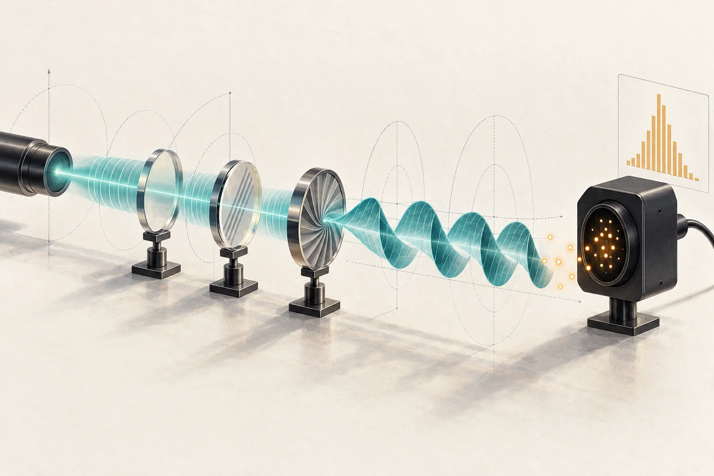
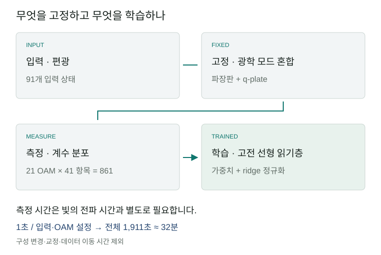
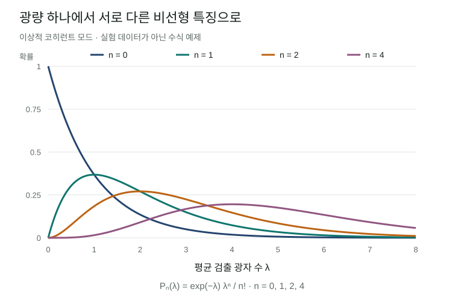

# 빛의 세기에서 광자 수 분포로: 다광자 저장소 계산을 읽다

광학 계산의 매력은 빛이 여러 경로를 동시에 지나며 입력을 빠르게 변환한다는 데 있습니다. 그러나 빛이 빨리 전파된다는 사실만으로 학습기가 빨라지지는 않습니다. 어떤 정보를 빛에 담고, 출력에서 무엇을 측정하며, 그 값을 얼마나 오래 모아야 하는지가 함께 중요합니다. Hong 등의 **다광자 양자 저장소(multiphoton quantum reservoir)** 연구는 이 가운데 측정 방식을 바꿨을 때 생기는 가능성을 보여줍니다. 평균 광량 대신 광자 수의 확률분포를 읽어, 같은 광학장을 더 풍부한 학습 특징으로 사용했습니다.

이번 결과의 설득력 있는 부분은 접근하기 쉬운 광원과 고정된 광학 회로로 비선형 함수의 특징을 만들었다는 점입니다. 동시에 논문이 사용하는 ‘양자 가속’이라는 표현은 실험별로 나눠 읽어야 합니다. 함수 복원 성능의 향상, 공간 분포의 빠른 확산, 고전 시뮬레이션의 계산복잡도는 서로 다른 검증 대상입니다. 이 리뷰는 장치의 원리에서 출발해 세 주장을 구분하고, 실제 응용으로 이어질 조건을 살펴봅니다.

*빛의 모드 변환과 광자 계수를 표현한 생성 일러스트입니다. 실제 실험 장치의 배치나 측정 데이터를 재현한 그림은 아닙니다.*

**연구 상태.** Mingyuan Hong 등, *Multiphoton Quantum Reservoirs For Robust Multidimensional Computing*, **Advanced Science**, e77225. 최초 게재일은 **2026년 8월 19일**, 리뷰 기준일은 **9월 13일**입니다. 동료평가를 거친 실제 상온 광학 실험이며, 본문과 15쪽 보충자료를 검토했습니다. 원시 데이터는 요청 시 제공하는 방식으로 안내되어 있어 실험 수치를 독립 재현하지는 않았습니다. [논문](https://advanced.onlinelibrary.wiley.com/doi/10.1002/advs.77225) · [보충자료](https://advanced.onlinelibrary.wiley.com/action/downloadSupplement?doi=10.1002%2Fadvs.77225&file=advs77225-sup-0001-SuppMat.pdf)

## 1. 고전광에서도 광자는 셀 수 있습니다

양자광학에서 **고전광(classical light)**은 광자가 없다는 뜻이 아닙니다. 광학장의 상태를 코히런트 상태(coherent state)의 비음수 확률 혼합으로 표현할 수 있다는 뜻입니다. 이상적인 레이저를 설명하는 코히런트 상태와 열광(thermal light)이 대표적입니다. 코히런트 상태의 광자 수는 Poisson 분포를 따르고, 단일 모드 열광은 그보다 큰 수 변동을 보입니다. 반면 고정된 광자 수를 가진 Fock 상태나 압축광은 이 정의에서 비고전적인 자원이 될 수 있습니다.

**Fock 상태** \(|n\rangle\)는 특정 모드의 광자 수가 \(n\)으로 정해진 상태입니다. 논문은 광자 수를 구별하는 측정을 Fock 기저의 투영으로 설명합니다. 실제 장치에서는 검출 사건의 시각을 기록하고 정해진 시간창 안의 계수를 모아 분포를 구성합니다. ‘광자 7개가 검출된 경우만 골라 공간 분포를 본다’는 것은 측정 기록을 조건부로 선택하는 일입니다. 광자를 흡수하는 검출 뒤에 7광자 상태가 남아 다음 연산에 투입된다는 뜻은 아닙니다. [본문 §2; 보충자료 Note 4–5](https://advanced.onlinelibrary.wiley.com/doi/10.1002/advs.77225)

이 구분은 보도의 ‘고전광을 양자로 바꿨다’는 표현을 이해하는 데 필요합니다. 광자 수에 따라 선택한 통계에는 평균 세기만으로 보이지 않던 구조가 나타날 수 있습니다. 그러나 그런 구조를 관측했다는 사실, 재사용 가능한 비고전적 상태를 준비했다는 사실, 고전 알고리즘보다 계산이 어렵다는 사실은 각각 입증해야 합니다.

## 2. 편광을 입력하고, 빛의 공간 모드를 섞습니다

장치는 빛의 **편광(polarization)**과 **궤도각운동량(OAM, orbital angular momentum)**을 함께 이용합니다. 편광은 전기장의 진동 방향을 나타냅니다. OAM 모드는 빔 둘레를 돌 때 위상이 얼마나 감기는지를 정수 \(\ell\)로 구분하는 공간 모드입니다. 실공간에 격자를 새긴 것이 아니라, 이 모드들을 서로 연결해 합성 격자처럼 다룹니다.

반파장판(HWP)은 편광을 회전시키고, 사분파장판(QWP)은 편광 성분의 상대 위상을 바꿉니다. q-plate는 편광과 OAM을 결합해 빛을 다른 모드로 옮깁니다. 학습 실험에서는 내부 파장판 각도를 무작위로 한 번 정한 뒤 고정했습니다. 입력만 수평에서 수직 편광으로 바꾸므로 모든 데이터가 같은 물리적 변환을 거칩니다. 출력은 공간광변조기(SLM)로 OAM 모드를 선택해 측정합니다. [보충자료 Note 4](https://advanced.onlinelibrary.wiley.com/action/downloadSupplement?doi=10.1002%2Fadvs.77225&file=advs77225-sup-0001-SuppMat.pdf)

논문 안에서도 광원은 실험마다 다릅니다. 광원 준비에는 633 nm 레이저와 회전하는 간유리로 만든 열광이 쓰입니다. 랜덤워크와 열화 통계 실험에는 열광을 사용하지만, 함수 복원 부분은 **공간적으로 코히런트한 빛의 편광에 입력을 인코딩**한다고 설명합니다. 따라서 모든 결과를 하나의 열광 학습 실험으로 묶으면 실제 구성이 흐려집니다. [본문 §4](https://advanced.onlinelibrary.wiley.com/doi/10.1002/advs.77225)

*리뷰어가 재구성한 계산 흐름입니다. 광학 회로는 고정하고, 마지막 고전 회귀의 가중치만 학습합니다. 분포를 얻기 위한 반복 취득이 광학 전파와 별도로 필요합니다.*

## 3. 선형 광학 뒤에서 비선형 특징을 얻는 원리

**저장소 계산(reservoir computing)**은 입력을 고정된 복잡한 시스템에 통과시킨 뒤, 그 응답을 간단한 읽기층으로 결합하는 방법입니다. 물리계 내부를 모두 학습할 필요가 없다는 장점이 있습니다. 이 논문이 검증한 것은 현재 입력값을 비선형 특징으로 바꾸는 함수 복원입니다. 과거 입력을 기억해야 하는 시계열 예측 성능은 별도의 과제입니다.

평균 검출 광자 수를 \(\lambda\)라고 합시다. 이상적인 단일 코히런트 모드를 광자 계수하면 다음 확률을 얻습니다.

\[P_n(\lambda)=e^{-\lambda}\frac{\lambda^n}{n!}.\]

평균 \(\lambda\) 하나만 쓰는 것과 \(P_0,P_1,P_2,\ldots\)를 쓰는 것은 서로 다른 특징 설계입니다. \(P_0\)는 광량이 증가할수록 감소하고, \(P_1\)이나 \(P_2\)는 각각 다른 위치에서 봉우리를 만듭니다. 광학 소자가 물질의 비선형 반응을 일으키지 않아도 **측정 확률은 입력 광량의 비선형 함수**가 됩니다. 이는 이상적 Poisson 모델로 설명한 원리이며, 실제 검출기의 응답을 그대로 재현한 식은 아닙니다.

*설명용 정확한 수식 그래프입니다. 실험 데이터가 아닙니다. 평균 광량을 그대로 읽는 것과 광자 수별 확률을 읽는 것이 다른 특징을 만든다는 점을 보여줍니다.*

실험에서는 \(\ell=-10\ldots10\)의 **21개 OAM 투영**과 \(n=0\ldots40\)의 **41개 광자 수 항목**을 결합해 **861개 성분**을 만들었습니다. 마지막에는 \(\hat y=b+\sum_{\ell,n}w_{\ell,n}P_{\ell,n}(x)\) 형태의 선형 읽기층을 학습합니다. 보충자료는 가중치가 지나치게 커지는 것을 억제하는 ridge 정규화를 명시합니다. [본문 Fig. 4; 보충자료 Note 7](https://advanced.onlinelibrary.wiley.com/doi/10.1002/advs.77225)

861은 큐비트 수나 독립적인 계산 자유도의 수가 아닙니다. 보충자료의 주성분분석(PCA)에서 첫 성분이 분산의 **75%**, 16개 성분이 **99%**를 설명하며, 참여비(participation ratio)로 계산한 유효차원은 **1.7**입니다. 저자들은 91개 입력에 대한 특징 행렬의 rank가 91이라고 보고합니다. 행렬의 rank와 분산이 집중되는 정도는 다른 수치입니다. 가느다란 곡선도 여러 방향으로 휘어질 수 있듯, 낮은 유효차원의 입력이 풍부한 비선형 특징을 만들 수 있습니다. 다만 rank가 높다는 사실만으로 새로운 데이터에 대한 일반화가 보장되지는 않습니다. [보충자료 Note 7C](https://advanced.onlinelibrary.wiley.com/action/downloadSupplement?doi=10.1002%2Fadvs.77225&file=advs77225-sup-0001-SuppMat.pdf)

## 4. 성능은 어느 기준선보다 좋아졌나

입력은 편광을 바꿔 만든 **91개 상태**이며, 무작위로 **80%를 학습, 20%를 평가**에 사용했습니다. 아래 값은 여러 무작위 분할에서 평균한 평가 결정계수 \(R^2\)입니다. 1에 가까울수록 평가값을 잘 복원합니다. 기준선은 같은 광학장에서 **각 OAM의 평균 광자 수만 유지한 21차원 특징**에 선형 회귀를 붙인 모델입니다. [보충자료 Table S2](https://advanced.onlinelibrary.wiley.com/action/downloadSupplement?doi=10.1002%2Fadvs.77225&file=advs77225-sup-0001-SuppMat.pdf)

| 목표 함수 | 평균 광량 특징 · 21개 | 광자 수 분포 특징 · 861개 |
|---|---:|---:|
| 2차 함수 | 0.92 | 0.94 |
| 3차 함수 | 0.89 | 0.93 |
| 4차 함수 | 0.90 | 0.94 |
| 지수 함수 | 0.96 | 0.97 |
| 로그 함수 | 0.97 | 0.97 |
| 감쇠 사인 함수 | 0.69 | 0.94 |
| 논문 보고 평균 | 0.89 | 0.95 |

감쇠 사인 함수에서 가장 큰 개선이 나타납니다. 로그 함수는 표시된 정밀도에서 차이가 없습니다. 보충자료의 설명 문장은 4차 함수와 감쇠 사인 함수를 함께 묶어 0.69→0.94라고 표현하지만, **표 S2에서 4차 함수는 0.90→0.94**입니다. 이 리뷰는 개별 행의 값을 따랐습니다.

이 비교는 광자 수 분포를 보존하는 측정이 평균 세기만 읽는 것보다 유용하다는 근거입니다. 고전 학습 방법 전체보다 우월하다는 근거로 확장하려면 비교를 보강해야 합니다. 특히 평균 광량으로 계산한 Poisson 특징, 다항식·Fourier 특징, kernel ridge 회귀를 같은 데이터 분할과 조정 예산으로 비교할 필요가 있습니다. 특징 수와 정규화 선택의 효과도 분리해야 합니다. 이들은 본 리뷰가 제안하는 후속 기준선이며, 논문에서 이미 수행한 실험은 아닙니다.

## 5. 빠른 읽기층과 전체 측정시간을 함께 보기

보충자료 표 S1의 **30 μs 학습시간**은 읽기층 학습에 관한 저자 보고값입니다. 광원을 설정하고 분포를 얻는 전체 시간과 동일하지 않습니다. 검출 기록은 **1 μs 시간창**으로 묶고, 편광–OAM 설정마다 **1초 동안 100만 개 창**을 취득합니다. 따라서 전체 데이터의 순수 취득시간은 \(91\times21\times1\,\mathrm{s}=1,911\,\mathrm{s}\), 약 **31.85분**입니다. 보충자료도 약 32분을 명시합니다. 광학 설정 변경, 정렬, 교정, 데이터 이동은 여기에 추가됩니다. 같은 특징 데이터는 여섯 함수에 재사용할 수 있으므로 취득시간을 함수마다 여섯 번 더할 필요도 없습니다. [보충자료 Notes 4, 7A, 7D](https://advanced.onlinelibrary.wiley.com/action/downloadSupplement?doi=10.1002%2Fadvs.77225&file=advs77225-sup-0001-SuppMat.pdf)

검출기 해석도 중요합니다. 장치는 애벌랜치 광다이오드(APD)와 시각 기록 장치를 이용한 시간 구간 계수 방식입니다. 보충자료는 **50 ns 불감시간(dead time)**과 1 μs 안의 **20개 유효 구간**을 모델링합니다. 평균 광자 수 4.1의 열광에서 이상적 분포와의 유사도는 약 97%라고 보고합니다. 여기서 유사도는 \(\sum_n\sqrt{p_nq_n}\)로 정의한 분포 간 값이며, 양자상태나 계산 결과의 충실도가 아닙니다. 평균 계수가 커질수록 모델과 이상 분포의 차이도 커집니다. [보충자료 Note 5, Fig. S2](https://advanced.onlinelibrary.wiley.com/action/downloadSupplement?doi=10.1002%2Fadvs.77225&file=advs77225-sup-0001-SuppMat.pdf)

**높은 광자 수 영역에는 추가 확인이 필요합니다.** 20구간 검출 모델, 특징 벡터의 0–40 표기, 일부 두 팔 측정의 팔당 21광자 선택이 실제 시간창·채널 결합·계수 보정에서 어떻게 연결되는지, 확인한 자료만으로는 충분히 해명되지 않습니다. 낮은 평균에서의 분포 일치만으로 모든 높은 계수 항목이 이상적으로 분해되었다고 볼 수는 없습니다. 원시 시각 기록과 검출 응답으로 확인해야 할 구체적인 재현성 질문입니다.

희귀한 계수 결과를 충분히 모으는 데에도 비용이 듭니다. 확률 \(p\)의 사건을 독립 표본 \(M\)개로 추정할 때 상대 표준오차 \(\epsilon\)을 얻으려면 \(M=(1-p)/(\epsilon^2p)\)가 필요합니다. 열광의 높은 광자 수 꼬리에서는 \(p\)가 작아지므로 필요한 시간이 증가합니다. 이 식은 이상적 검출과 독립 표본을 가정하며, 불감시간이나 광원의 시간 상관을 보상하지 않습니다. [보충자료 Note 6, Eq. S72](https://advanced.onlinelibrary.wiley.com/action/downloadSupplement?doi=10.1002%2Fadvs.77225&file=advs77225-sup-0001-SuppMat.pdf)

## 6. ‘양자 가속’ 주장을 세 부분으로 나눠 읽기

첫째, 랜덤워크 실험은 단계 수에 따른 분포 폭을 비교합니다. 정렬된 광학망에서는 OAM 분포가 탄도적(ballistic)으로 벌어져 폭이 단계 수에 비례하고, 비교하는 확산적 분포의 폭은 단계 수의 제곱근에 비례합니다. 이는 **전파 단계와 관측량의 관계**입니다. CPU나 GPU에서 같은 답을 얻는 데 걸리는 시간과 장치의 전체 실행시간을 비교한 결과는 아닙니다. 7광자 그림은 검출 결과를 선택한 \(P(\ell\mid n=7)\)이며, 독립적으로 준비한 단일광자 일곱 개의 동시 검출과 구분됩니다. [본문 Fig. 2; 보충자료 Note 4](https://advanced.onlinelibrary.wiley.com/doi/10.1002/advs.77225)

둘째, 광자 수 쌍을 선택하면 보손형 또는 페르미온형으로 불리는 공간 상관 패턴이 나타납니다. 광자가 페르미온으로 바뀌었다는 뜻은 아닙니다. 초록의 ‘최대 40광자’와 별도로 Fig. 2의 \((21,21)\) 조건은 합계 42를 뜻하므로, 숫자는 해당 조건과 함께 읽어야 합니다. 열화·반열화 실험도 선택한 모드에서 광자 수 통계와 2차 상관함수 \(g^{(2)}(0)\)가 변하는 것을 다룹니다. 실제 분자나 상호작용 전자계의 열화 계산을 검증한 것은 아닙니다. [본문 Figs. 2–3](https://advanced.onlinelibrary.wiley.com/doi/10.1002/advs.77225)

셋째, 저자들은 광자 검출 확률의 permanent 표현과 보손 샘플링을 연결해 계산복잡도를 논합니다. **어떤 확률을 정확히 계산하는 문제와, 그 분포에서 표본을 생성하는 문제는 다릅니다.** 실제 입력 계열과 측정 과제에 난해성 주장이 적용되는지도 확인해야 합니다. 비음수 위상공간 분포를 이용하는 고전 광학 시뮬레이션의 충분조건은 이미 정리되어 있습니다. [Rahimi-Keshari·Ralph·Caves, Physical Review X 6, 021039 (2016)](https://arxiv.org/abs/1511.06526)

이 장치에 대한 유용한 점검법은 보충자료 자체의 코히런트 상태 혼합 표현에서 나옵니다. 유한한 모드 수에서 효율적으로 표본화할 수 있는 비음수 Gaussian 분포로 입력 진폭 \(\alpha\)를 뽑고, 선형 광학 변환 \(\beta=U\alpha\)를 적용한 다음, 각 모드에서 평균 \(\eta_j|\beta_j|^2\)의 Poisson 계수를 뽑을 수 있습니다. \(\eta_j\)는 검출 효율입니다. 모드를 합쳐 읽으면 해당 강도를 더합니다. 코히런트 입력은 진폭이 고정된 특수한 경우입니다. **이상적인 해당 입력·측정 모델의 비조건부 샘플링에는 permanent를 매번 계산할 필요가 없다는 리뷰어의 해석**입니다. 보충자료 Note 2의 식 S19, S29, S35가 이 구성의 직접적인 근거입니다. 희귀 조건부 표본을 얻는 비용과 실제 검출 응답의 재현은 별도로 남습니다. [보충자료 Note 2](https://advanced.onlinelibrary.wiley.com/action/downloadSupplement?doi=10.1002%2Fadvs.77225&file=advs77225-sup-0001-SuppMat.pdf)

따라서 이 논문의 permanent 논의만으로 실험에 사용한 모든 입력이 고전적으로 어려운 계산을 수행했다고 결론내릴 수는 없습니다. 광학 특징 변환의 실용적인 가치는 여전히 검토할 만합니다. 다만 그 가치는 보정된 고전 시뮬레이터와 비교한 정확도·처리량·에너지로 평가해야 합니다.

## 7. 개발과 응용은 무엇부터 확인하면 좋을까

가까운 응용 후보는 이미 광학 신호로 입력이 들어오는 센싱과 계측입니다. 전기적 데이터를 빛으로 바꾸는 비용을 줄일 수 있고, 평균 광량 이외의 분포 정보를 직접 활용할 여지가 있습니다. 재료·OLED 연구에서는 여러 조건에서 얻은 발광 신호를 분류하거나 품질 지표를 회귀하는 실험을 생각할 수 있습니다. **이는 본 리뷰의 제안이며, 해당 논문이 OLED 데이터나 분자 계산을 수행했다는 뜻은 아닙니다.** 분자 Hamiltonian을 푸는 양자화학 알고리즘과는 입력과 목표가 다릅니다.

개발 순서는 특징을 더 늘리기 전에 측정에서 얻는 정보를 검증하는 쪽이 합리적입니다. 먼저 평균 광량으로 예측한 계수 분포와 실제 계수 분포를 같은 검출 모델로 비교해야 합니다. 그다음 특징 수, 광자 수 절단값, 취득시간을 줄여도 성능이 유지되는지 확인할 수 있습니다. 성능이 일부 낮은 계수 항목에 집중된다면 더 작은 읽기 장치로 구현할 수 있습니다. 높은 계수 항목이 꼭 필요하다면 채널 다중화와 검출 응답 교정의 우선순위가 높아집니다.

| 개발 질문 | 다음에 필요한 비교 | 응용 판단에 주는 정보 |
|---|---|---|
| 분포가 평균 광량보다 무엇을 더 주나 | 측정 분포 대 교정된 Poisson·열광 특징 | 실제 추가 정보와 단순 특징 확장의 구분 |
| 적은 데이터에서도 일반화하나 | 연속 구간을 통째로 제외한 평가, 반복 분할·불확실성 | 보간에서 외삽·분포 변화로의 확장 |
| 측정이 얼마나 빨라질 수 있나 | 취득시간·모드 수·계수 항목 수에 따른 정확도 | 처리량과 정밀도의 교환관계 |
| 광학 장치가 전체 비용을 줄이나 | 광원·SLM·검출·데이터 이동·학습까지 같은 목표 오차에서 측정 | CPU/GPU 기준선 대비 실용성 |
| 시간이 지나도 동작하나 | 날짜를 달리한 교정·온도·손실·드리프트 평가 | 고정된 검출 응답에 대한 학습이 현장에서 유지되는지 |

이 연구가 제시한 유용한 개발 방향은 **측정 분포를 계산 자원으로 설계하는 것**입니다. 고전광을 쓰는 접근성, 고정 회로의 단순한 학습, 평균값에서 버려지던 통계 정보는 후속 연구의 출발점이 됩니다. 다음 진전은 명목상의 광자 수나 특징 수를 더하는 데서만 나오지 않습니다. 어떤 특징이 실제 정보를 더하고, 그것을 얻는 데 얼마의 시간이 들며, 강한 고전 기준선과 비교해 어느 조건에서 이익이 생기는지를 실험으로 보여주는 데 달려 있습니다.

## 자료와 검토 범위

- Hong 등, [논문 본문](https://advanced.onlinelibrary.wiley.com/doi/10.1002/advs.77225) 및 [본문 PDF](https://advanced.onlinelibrary.wiley.com/doi/pdf/10.1002/advs.77225): 실제 광학 구성, 세 실험군, 데이터 공개 조건 확인. 저자 저작물은 Creative Commons Attribution으로 공개되어 있습니다.
- [보충자료](https://advanced.onlinelibrary.wiley.com/action/downloadSupplement?doi=10.1002%2Fadvs.77225&file=advs77225-sup-0001-SuppMat.pdf): Note 2의 확률 모델, Note 4–7의 측정·검출·비용·기준선과 Table S2를 중점 확인했습니다.
- Rahimi-Keshari 등, [고전 시뮬레이션 충분조건 원문](https://arxiv.org/html/1511.06526v2): 비음수 위상공간 표현과 표본화 조건을 대조했습니다. 이 리뷰의 간단한 표본화 구성은 실험 재현이나 장치 시간 벤치마크가 아닙니다.
- [표 S2 전사 데이터](benchmarks.csv): 원문 수치를 보존한 CSV입니다. 그림 두 점은 리뷰어가 만든 설명 자료이며, 원시 측정 데이터를 대체하지 않습니다.
