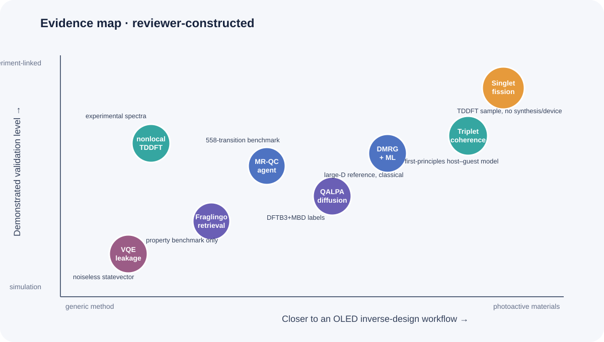
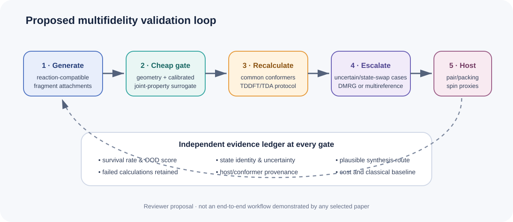

# Validation Criteria for Molecular Inverse Design under Sparse Excited-State Constraints

The literature posted from 11 through 17 September 2026 contains no new study that directly designs a TADF emitter or PhOLED host. It instead sharpens three problems that an OLED inverse-design program must solve. Molecules satisfying several excited-state constraints are intrinsically sparse; a high generative hit rate inherits the validity limits of its computational labels; and intramolecular electronic-state accuracy alone cannot explain triplet behavior in a host environment.

The week's lead paper closes a generator–predictor loop around singlet-fission criteria. The authors evaluate about 100 million generated structures, validate a random 1% by TDDFT, report a 90.8% success rate under their singlet-fission energetic filters, and construct a 283,559-candidate database after including synthetic accessibility. This is a notable demonstration of inverse design under sparse multi-state constraints. It is not a measurement of TADF efficiency, OLED device lifetime, or experimental synthesis success.

*Figure 1. Conceptual illustration generated for this review. It represents sparse excited-state constraints, the generator–validation bottleneck, and a host nuclear-spin environment. The depicted molecules, wavefunctions, and materials are not exact structures, measured morphology, quantitative surfaces, or executable quantum circuits.*

::: highlight Assessment
Increasing the generation hit rate is not equivalent to discovering an OLED material. Excited-state recalculation, host–guest environment, reaction-aware synthesis, and out-of-distribution calibration should remain independent gates. For quantum calculations, a chemically accurate projected energy can coexist with roughly 40% probability outside the target particle-number sector; energy and leakage must be reported together.
:::

The layout-verified English technical brief is available as a [PDF download](../artifacts/oled_inverse_design_weekly_brief_2026-09-18.pdf).

## Ranked shortlist

1. **Navigating Sparse Singlet Fission Chemical Space** — evaluates about 100 million structures and uses a 1% TDDFT sample to test a rare multi-state target.
2. **Understanding the spin coherence of molecular photoexcited triplet states** — resolves how guest and host nuclear spins exchange importance with magnetic field in pentacene/para-terphenyl.
3. **DMRG excitation energies improved by machine learning** — corrects small-bond-dimension excitation energies in π systems up to 34 active electrons.
4. **QALPA** — combines E(3)-equivariant diffusion, active learning, and DFTB3+MBD to navigate sparse property regions.
5. **Autonomous LLM agents for multireference chemistry** — measures active-space automation and failure recovery on 558 vertical transitions.
6. **Fraglingo** — treats fragment identity and attachment as one latent-retrieval problem and conditions on seven properties.
7. **Nonempirical TDDFT for nonlocal XC potentials** — restores f-sum consistency for nonlocal response without added asymptotic computational cost.
8. **Leakage-aware VQE ansatz criterion** — shows on noiseless statevectors that projected energy and particle-number validity can separate.

*Figure 2. Reviewer-constructed qualitative evidence map. Placement indicates OLED-workflow proximity and the validation boundary demonstrated by each paper; it is not a performance ranking. All eight items are preprints.*

## 1. No direct OLED, TADF, or PhOLED paper met the threshold

No primary record in the seven-day window directly designed, synthesized, or measured a TADF emitter, PhOLED host, host–dopant/exciplex system, or OLED device. The papers below concern singlet fission, molecular triplets, excited-state computation, molecular generation, and VQE diagnostics. Items covered in the 21 and 28 August or 4 and 11 September briefs are not repeated.

## 2. Finding sparse singlet-fission conditions among about 100 million generated structures

Longfei Lv, Li Fu, Si Zhou, Lingzhi Zhao, and Jijun Zhao posted [*Navigating Sparse Singlet Fission Chemical Space: An Intelligent Generative-Predictive Paradigm*](https://arxiv.org/abs/2609.15136) on 14 September.

### What the paper demonstrates

The workflow repeatedly couples a structure generator, a property predictor, and multi-criteria validation to enrich molecules satisfying energetic relations among low-lying excited states. It screens about 100 million generated structures and validates a random 1% by TDDFT. The source reports a 90.8% success rate for its singlet-fission criteria and a final database of 283,559 candidates judged favorable in excited-state energetics and synthetic accessibility. The authors associate the fragment `CN([O])N(C)[O]` with satisfying the filters.

### Limitation and workflow translation

The 90.8% figure is a TDDFT hit rate for author-defined energetic filters. It is not experimental synthesis, packing control, a fission-rate measurement, exciton transport, or device efficiency. Sampling 1% checks internal large-scale prediction consistency but does not remove TDDFT systematic error or scaffold bias.

An OLED implementation could replace a single ΔE_ST objective with joint constraints on S1/T1/Tn ordering, NTO-based CT/LE character, oscillator strength, and SOC or spin-vibronic proxies. Higher-level electronic structure, reaction-path synthesis, and host-environment calculations should remain separate final gates.

## 3. Triplet coherence is co-determined by the molecule and its host

Ecaterina Păunică and Sam L. Bayliss posted [*Understanding the spin coherence of molecular photoexcited triplet states from first principles*](https://arxiv.org/abs/2609.16851) on 15 September.

Generalized cluster-correlation expansion calculations analyze Hahn-echo decoherence for a pentacene guest in a para-terphenyl host. At zero field, about six guest nuclei dominate decoherence. At high field, convergence requires about 600 hydrogens across roughly 45 host molecules. The high-field host-only T2 of about 8.9 μs closely follows the full system, while guest-only T2 is about 65 μs. Increasing the longitudinal zero-field-splitting parameter D also lengthens T2 in the reported calculations.

This is a benchmark crystal for optically detected spin coherence, not an OLED triplet lifetime or RISC calculation. Its useful constraint is environmental: candidate–host pairs should carry nuclear composition, packing ensemble, and hyperfine/SOC provenance rather than relying only on molecular descriptors.

## 4. Machine learning extrapolates small-D DMRG excitation energies

Pavlo Golub and Libor Veis posted [*Fast and Accurate Excitation Energies from Density Matrix Renormalization Group Calculations Improved by Machine Learning*](https://arxiv.org/abs/2609.12616) on 11 September.

DMRG acts as a complete-active-space solver. Truncation error and entanglement-graph descriptors train a model that refines S1–S0 gaps toward large-bond-dimension references. Tests include polycyclic aromatics with up to 34 π electrons. Octacene reaches refinement within 1 mHa except at D<200. For ovalene, aza-[4]triangulene, and diazadibenz chrysene, errors as large as 6 mHa at small D fall to about 1.6 mHa at D≈200–500. Bis(phenalenyl) is hardest because its entanglement pattern differs from the training set. Comparable uncorrected DMRG accuracy requires D≈3,000–8,000 depending on the molecule.

The preprint does not report oscillator strengths, triplets, SOC, or relaxed geometries. Low-D DMRG+ML is therefore better treated as an escalation check for TDDFT-unstable CT/LE or biradical candidates, with entanglement-distribution shift explicitly flagged.

## 5. Property-guided diffusion navigates sparse quantum-property regions

Michael Hanna, Julian Cremer, Zekiye Erarslan, and Leonardo Medrano Sandonas posted [*QALPA: Property-guided diffusion modeling for efficient exploration of chemical spaces of flexible molecules*](https://arxiv.org/abs/2609.16527) on 15 September.

QALPA combines E(3)-equivariant diffusion, active learning, and fast QM/ML evaluation. Training combines QM7-X with larger Aquamarine molecules. The new alloQM dataset contains 6,253 conformers of 241 allosteric molecules labeled at DFTB3+MBD level. A combined 47,790-conformer set supports a six-step trajectory through many-body dispersion energy and HOMO–LUMO gap; the paper reports 169 additional molecules spanning varied sizes and compositions.

DFTB3+MBD and EquiDTB26 are efficient labelers but do not certify S1, T1, or SOC. Elements are restricted to H, C, N, O, P, S, and Cl, with up to 78 total atoms. For OLED work, preserve conformer coverage while replacing navigation coordinates with S1/T1, CT/LE character, and conformational variance, then relabel every active-learning round under one TDDFT/TDA protocol.

## 6. Autonomous multireference chemistry depends strongly on supplied context

Victor Chang Lee and James M. Rondinelli posted [*Can Autonomous LLM Agents Execute Multireference Quantum Chemistry Calculations?*](https://arxiv.org/abs/2609.13357) on 11 September.

The agent selects active spaces and state averaging, submits and diagnoses ORCA calculations, and records decisions in an audit log. On 558 QUESTDB vertical transitions, an unguided baseline achieves 24.9% coverage and 0.373 eV MAE. A structured decision ladder raises coverage to 44.1% and lowers MAE to 0.339 eV. With full published workflow information, the replication setting scores 378/558 transitions, reaches 67.7% coverage and 23 meV MAE, and resolves 42% of target calculations on the first attempt and 75% within seven attempts.

The 23 meV result is closer to a context-rich replication ceiling than autonomous discovery of a new protocol. For OLED throughput, version active-space heuristics, convergence recovery, and state-identity matching; report workflow success separately from the accuracy of completed calculations.

## 7. Attachment-aware fragment retrieval improves joint property control

Thao Nguyen, Jeonghwan Kim, Zhenhailong Wang, and Heng Ji posted [*Fraglingo: Molecular Design via Attachment-Aware Autoregressive Fragment Generation*](https://arxiv.org/abs/2609.13519) on 11 September.

Fraglingo jointly predicts fragment identity and attachment in a continuous latent space and retrieves the next fragment by nearest-neighbor search. A wildcard-anchored readout represents the growing molecule from its active attachment site. On seven-property conditioning, the BFE variant reports 100.0% validity, 69.65% strict Joint@1×, 97.75% Joint@2×, and 6.56/7 mean property satisfaction. It searches fragment libraries up to four times larger than those used for training without retraining.

The properties are logP, MW, QED, TPSA, HBD, HBA, and rotatable bonds—not excited states or reaction routes. Scaling from 100k to 1M molecules does not uniformly improve joint control. Replacing the contrastive retrieval objective with MSE drops Joint@1× from 69.65% to 26.85%. An OLED implementation should use reaction-compatible building blocks and track torsional strain plus excited-state surrogate uncertainty at each attachment.

## 8. Response consistency when TDDFT uses nonlocal XC potentials

Zhandos A. Moldabekov, Michele Pavanello, Thomas D. Gawne, Jan Vorberger, and Tobias Dornheim posted [*Nonempirical Time-Dependent Density Functional Theory Framework for Nonlocal Exchange–Correlation Potentials*](https://arxiv.org/abs/2609.18584) on 16 September.

Standard linear-response TDDFT can treat the density response inconsistently when the meta-GGA or hybrid XC potential is nonlocal. For the ambient-aluminum plasmon, r2SCAN and HSE06 overestimate the experimental shift by more than 1.5 eV. The authors add a nonempirical kernel correction that restores the exact f-sum rule of the nonlocal KS Hamiltonian, and compare Al, Si, C, and warm dense Al against XRTS/EELS measurements. They report a freely available GPAW implementation with no added asymptotic computational cost.

These are periodic collective spectra, not molecular excitons. The defensible translation is procedural: using an advanced functional does not automatically improve response spectra. A TDDFT labeling pipeline should preserve functional, kernel, pseudopotential, response-consistency, and sum-rule provenance.

## 9. VQE needs projected energy and leakage in the same ledger

Yuan-Chieh Chen posted [*Energy Is Not Enough: Leakage-Aware Ansatz Criterion for Variational Quantum Eigensolvers*](https://arxiv.org/abs/2609.13521) on 11 September.

### Noiseless statevector evidence

The tests use STO-3G, Jordan–Wigner, and eight qubits for H4, H6, BeH2, and LiH. Leakage is the probability outside the target particle-number sector. Projected-energy optimization yields chemically accurate projected energies in all 200 runs for BeH2 and LiH, while mean leakage is 0.398 and 0.426. In a 30-parameter hardware-efficient H4 ansatz, mean leakage reaches 0.9574 even as projected energy falls. UCC families eliminate ansatz-induced leakage structurally, but that does not guarantee ground-state accuracy.

Adaptive hybrid selection beats one-shot SelectedUCC at selected budgets; for the H4 chain at m=16, mean projected error falls from 9.49×10^-4 to 1.45×10^-4 Ha. Every result is a finite-shot-free, noise-free statevector simulation. The paper reports no QPU execution, routing burden, sampling cost, error mitigation, or matched classical wall time.

An OLED active-space VQE benchmark should report raw and projected energy, particle-number and spin leakage, parameter count, two-qubit depth, shots, and the classical baseline together. This paper proposes a reporting criterion; it does not demonstrate quantum advantage.

## 10. Practical experiment for the coming week

*Figure 3. Reviewer-proposed workflow synthesized from this week's literature. No selected paper executes the complete OLED pipeline end to end.*

Generate 1,000–5,000 candidates from 12–24 donor–acceptor scaffolds using reaction-compatible fragment attachments. Use xTB/DFTB geometry and a calibrated excited-state surrogate for the inexpensive layer, but define the target as a joint window over S1, T1, ΔE_ST, oscillator strength, and CT/LE score. Recompute the top 1% using one conformer ensemble and TDDFT/TDA protocol. Escalate only 10–20 uncertain or state-order-changing cases to low-D DMRG+ML or a multireference calculation.

Split validation by scaffold and attachment motif rather than random molecules. For two or three host pairs, add dimer-separation and torsion scans plus hyperfine/SOC proxies. Record survival rate, OOD score, computational failures, and existence of a plausible synthesis route at every gate. This prevents a 90%-level generative hit rate from being mistaken for an OLED validation rate.

## 11. Coverage gaps

No credible new item in the window directly addressed:

- synthesis or device performance of a TADF emitter, PhOLED host, or host–dopant/exciplex system;
- OLED degradation, stability, or operational lifetime;
- SELFIES-specific constraints, CRBM, or Boltzmann-machine molecular sampling;
- D-Wave/quantum annealing or chemistry QUBO with matched-budget classical baselines;
- molecular-design QAOA or actual-QPU VQE at an OLED-relevant active-space scale.

## Conclusion

The week's literature shows generative models scaling up under sparse excited-state conditions while the required unit of validation expands. The singlet-fission study offers a 100-million-structure search and a 90.8% TDDFT hit rate, whereas the triplet-coherence study shows that hundreds of host nuclei can dominate the dynamics. DMRG+ML and multireference agents offer routes to higher fidelity but retain entanglement-OOD and workflow-context dependencies.

The relevant OLED metric is therefore not a single hit rate. Generative constraints, electronic-structure fidelity, host environment, synthesizability, and OOD validation need independent records. Quantum calculations likewise require a resource ledger that includes leakage and actual execution cost rather than projected energy alone.

## References

1. L. Lv et al., [“Navigating Sparse Singlet Fission Chemical Space: An Intelligent Generative-Predictive Paradigm,” arXiv:2609.15136v1 (14 Sep 2026)](https://arxiv.org/abs/2609.15136). **Preprint; TDDFT validation.**
2. E. Păunică and S. L. Bayliss, [“Understanding the spin coherence of molecular photoexcited triplet states from first principles,” arXiv:2609.16851v1 (15 Sep 2026)](https://arxiv.org/abs/2609.16851). **Preprint; classical first-principles/CCE calculations.**
3. P. Golub and L. Veis, [“Fast and Accurate Excitation Energies from Density Matrix Renormalization Group Calculations Improved by Machine Learning,” arXiv:2609.12616v1 (11 Sep 2026)](https://arxiv.org/abs/2609.12616). **Preprint; classical DMRG+ML.**
4. M. Hanna et al., [“QALPA: Property-guided diffusion modeling for efficient exploration of chemical spaces of flexible molecules,” arXiv:2609.16527v1 (15 Sep 2026)](https://arxiv.org/abs/2609.16527). **Preprint; generative model plus DFTB3/MBD.**
5. V. C. Lee and J. M. Rondinelli, [“Can Autonomous LLM Agents Execute Multireference Quantum Chemistry Calculations?” arXiv:2609.13357v1 (11 Sep 2026)](https://arxiv.org/abs/2609.13357). **Preprint; ORCA workflow benchmark.**
6. T. Nguyen et al., [“Fraglingo: Molecular Design via Attachment-Aware Autoregressive Fragment Generation,” arXiv:2609.13519v1 (11 Sep 2026)](https://arxiv.org/abs/2609.13519). **Preprint; generative benchmark.**
7. Z. A. Moldabekov et al., [“Nonempirical Time-Dependent Density Functional Theory Framework for Nonlocal Exchange–Correlation Potentials,” arXiv:2609.18584v1 (16 Sep 2026)](https://arxiv.org/abs/2609.18584). **Preprint; classical TDDFT and experimental-spectrum comparison.**
8. Y.-C. Chen, [“Energy Is Not Enough: Leakage-Aware Ansatz Criterion for Variational Quantum Eigensolvers,” arXiv:2609.13521v1 (11 Sep 2026)](https://arxiv.org/abs/2609.13521). **Preprint; noiseless statevectors, no QPU execution.**

---

Publication record. Responsible editor: Hyun-Jung Kim. AI assistance: OpenAI Codex Work Mode. Evidence cutoff: 17 September 2026. Numerical values and execution boundaries follow the cited sources; OLED workflow translations and the proposed experiment are reviewer inferences. All eight selected papers are preprints.

