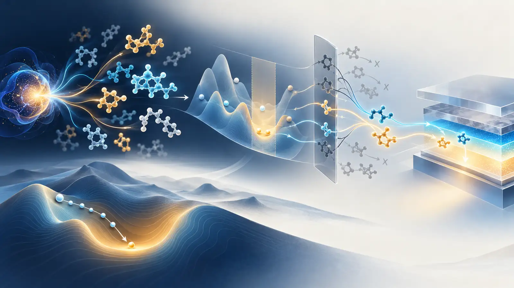

# Generative Validation and Chemical Initialization in Reliable Optoelectronic Molecular Inverse Design

No credible primary study newly published or meaningfully revised between 18 and 24 September 2026 directly synthesized and device-tested a TADF emitter, PhOLED host, host–dopant pair, or exciplex. The useful signal this week concerns a different question: **how much of an inverse-design result is actually trustworthy?** One paper revised the DFT-validation numbers for a variable-size 3D molecular generator; two measured how molecular-design agents and substituent-level models fail under multiple constraints and scaffold extrapolation; and a quantum-computing study supplied numerical evidence that Hartree–Fock (HF) or MP2 initialization preserves local UCCSD-VQE gradients better than random initialization.

The main implication for OLED inverse design is that validity and novelty, surrogate-ranked DFT hit rate, natural-language constraint satisfaction, and local VQE trainability answer different questions. None guarantees the ordering of S_1 and T_1, ΔE_ST, oscillator strength, spin–orbit coupling, reorganization energy, host triplet energy, synthetic accessibility, or device lifetime. Candidate generation and computational, chemical, and device validation should therefore remain separate gates with separate failure records.

*Figure 1. Conceptual illustration generated for this review. It depicts variable-size molecules emerging from a fixed-dimensional latent and narrowing through computational and chemical constraints toward optoelectronic candidates. The molecular motifs, energy landscapes, and quantum elements are not exact structures, measured surfaces, quantitative data, or executable circuits.*

::: highlight This week’s judgment
The week’s literature shows that the definition of validation matters more than a headline generation hit rate. An OLED pipeline should record internal ranking, independent DFT/TDDFT, scaffold–substituent extrapolation, synthesis routes, and device environment as distinct evidence layers. Chemically informed initialization adds evidence for locally trainable VQE, but there is still no demonstration here of QPU execution, shot-noise cost, measurement overhead, or feasibility at OLED-sized active spaces.
:::

The layout-verified weekly technical brief is available as a [PDF download](oled_inverse_design_weekly_brief_2026-09-25.pdf).

## Ranked shortlist

1. **Fixed-Dimensional Latent Flow for Generating Variable-Size 3D Molecules v3** — combines atom-count-free 3D generation with HOMO–LUMO-gap DFT verification; v3 revises the reported generation and speed comparisons.
2. **MolDesignBench** — evaluates 2,000 scenarios with 17 tools and finds that the best success rates remain 0.38 for generation and 0.43 for optimization.
3. **MolSC** — turns the direction of a substituent-induced property change into a separate, scaffold-disjoint generalization problem.
4. **Chemically Inspired Parameter Initialization for VQE** — reports polynomial rather than exponential local gradient-variance decay around HF and MP2 starts for 4–24-qubit hydrogen chains and small-molecule UCCSD landscapes.

*Figure 2. Source-reported values combined with reviewer-constructed boundary notes. This is not a performance ranking across the four studies, and none performed direct OLED device validation.*

## 1. There was no direct OLED, TADF, or PhOLED study

The seven-day window produced no credible new primary record directly reporting a TADF emitter, PhOLED host, host–dopant or exciplex design, or OLED device performance. The four papers below are therefore classified as **enabling methods**. Items covered in the five briefs sent since 21 August—including singlet-fission generation, QALPA, Fraglingo, DMRG excitation energies, a TDDFT kernel, and VQE leakage—were excluded to avoid duplication.

## 2. DFT-ranked generation improved, but v3 makes the revision itself part of the evidence

### Fixed-Dimensional Latent Flow for Generating Variable-Size 3D Molecules

**Weichi Yao, Cameron Gruich, Bryan R. Goldsmith, and Yixin Wang.** arXiv:2609.08333, v3, 22 September 2026. [Versioned primary record](https://arxiv.org/abs/2609.08333)

EF-TALFM samples a single fixed-dimensional molecular latent with flow matching. An autoregressive Transformer then emits atom types, coordinates, and chemical attributes until it produces an end-of-molecule token, so atom count is an output rather than an input. Canonical-SMILES ordering and rigid-pose alignment shift permutation and roto-translational handling into preprocessing, allowing non-equivariant Transformer layers. This does not confer formal equivariance; it defines a deterministic representative before learning.

**Source-reported result.** On PCQM4Mv2, 87.9% of generated samples were sanitized, unique, absent from the training set, and passed PoseBusters checks in v3. The conditional experiment generated 10,000 samples at each of ten HOMO–LUMO-gap targets from 4.1 to 7.8 eV. Retaining the top 30% by the model’s internal property readout increased the fraction within 0.1 eV of the target under B3LYP/6-31G(d) single-point DFT from 25.0% to 52.4%, while retaining 62.9% of all available DFT hits. Of the selected unique hits, 97.4% were absent from the property-matched training subsets.

**Why the revision belongs in this week.** v1 reported an 89.4% verified yield and larger sampling-speed comparisons. The v3 posted on 22 September changed the yield to 87.9%, gave sampling-time speedups of 1.06× and 2.83× against UAE-3D and FlowMol, and reported verified-novel throughput at 1.24× and 3.56×. The qualitative conclusion remains, but the comparison values changed materially. Version identifiers and denominators should therefore travel with every generative-model claim.

**Limits and evidence strength.** Verification used a B3LYP/6-31G(d) single point on generated geometry without further geometry optimization. The target was a frontier-orbital gap, not S_1, T_1, ΔE_ST, or k_RISC. A closed-shell-dominated PCQM4Mv2 distribution and PoseBusters success do not establish OLED synthesizability, excited-state accuracy, amorphous-film stability, or device lifetime. This is a preprint, and this review did not reproduce the calculations.

**Workflow translation — reviewer proposal.** A fixed-dimensional latent flow could explore variable-size donor–acceptor emitters and host molecules. Its ranking head should nevertheless separate ΔE_ST, S_1/T_1, oscillator strength, vertical and adiabatic ionization energies, triplet localization, reorganization energy, and synthesis-related scores. A fixed top-30% policy should be replaced by target-specific calibration and hit-retention curves tied to the actual TDDFT budget.

## 3. Tool access does not solve implicit multi-constraint chemistry

### MolDesignBench: Evaluating LLM-based Agent for Scenario-grounded Molecular Design

**Yongjun Jeong, Hanbum Ko, Ye Rin Kim, Chanhui Lee, Rodrigo Hormazabal, Jaewan Lee, Sehui Han, Sungbin Lim, and Sungwoong Kim.** Accepted to COLM 2026; arXiv:2609.27349, v1, 23 September 2026. [Primary record](https://arxiv.org/abs/2609.27349)

MolDesignBench contains 1,000 generation and 1,000 optimization instances. Each combines five to ten property requirements with functional-group constraints; 900 are feasible and 100 deliberately infeasible in each task. Agents must use a suite of 17 chemistry tools spanning generation, optimization, property calculation, and structural checks. Evaluation combines constraint satisfaction, molecular constraint distance, and infeasibility accuracy instead of assuming a single correct molecule.

**Source-reported result.** With the full toolset, GPT-5.4 achieved the highest success rates: 0.38 for generation and 0.43 for optimization, versus 0.11 and 0.17 without tools. Rewriting implicit narrative constraints as explicit property names and numerical ranges raised Qwen3-235B success from 0.19 to 0.35 on generation and from 0.25 to 0.38 on optimization. Infeasibility accuracy rose from 0.41 to 0.90 and from 0.10 to 0.63. The bottleneck is not only the molecule generator; it is also the control layer that must parse requirements and refuse inconsistent specifications.

**Limits and evidence strength.** Properties are judged by computational predictors such as RDKit descriptors and ADMET models rather than experiment. The benchmark covers small molecules, not polymers or crystals, and does not establish synthesis, experimental properties, or discovery novelty. The paper is accepted, but the public evidence reviewed here is the arXiv version. Conclusions about tool-use quality remain conditional on the tested agent configuration.

**Workflow translation — reviewer proposal.** OLED requests such as “high T_1, small ΔE_ST, large oscillator strength, suitable frontier levels, nonplanarity, and synthetic accessibility” can conflict. An agent should first compile them into a machine-readable schema that includes unit, method, geometry, and environment. A threshold such as T_1 > 2.8 eV is scientifically ambiguous unless one knows whether it is a gas-phase vertical TDDFT value or a host-polarized adiabatic value. An infeasibility detector should return the conflicting constraints instead of forcing a candidate.

## 4. A substituent effect is a different generalization problem from whole-molecule prediction

### MolSC: Leveraging Substituent Contributions to Enhance Fine-grained Molecular Understanding in LLMs

**Hyuntae Park, Sooyeon Kim, Jiwon Park, and SangKeun Lee.** Accepted to the EMNLP 2026 Main Conference; arXiv:2609.23073, v1, 19 September 2026. [Primary record](https://arxiv.org/abs/2609.23073)

MolSC supervises the property change caused by attaching a substituent to a scaffold rather than only the absolute property of the completed molecule. The authors decompose ChEMBL structures into scaffolds and substituents and construct differences across structural-alert liability, target bioactivity, and physicochemical descriptors. The training set contains 181,098 contributions, 100,076 unique scaffolds, 20,541 unique substituents, and 164,650 unique molecules. All 1,541 MolSC-Bench cases are disjoint from training at the scaffold, substituent, and original-molecule levels.

**Source-reported result.** The authors’ 3B model reached 0.923 direction accuracy for substituent-induced change on MolSC-Bench. Existing molecular LLMs were near chance and proprietary models were around 0.7. On a context-dependent subset where the same substituent changes sign across scaffolds, the authors’ 1B model achieved 0.582 accuracy on conflict pairs versus 0.145 for GPT-5.2. On FGBench, the 1B model reported 0.785, 0.780, and 0.776 accuracy for single-group, interaction, and comparison questions.

**Limits and evidence strength.** A contribution can be computed only when both molecule and scaffold have the same property annotation. Coverage is restricted to three ChEMBL-derived axes and uses one-dimensional molecular representations. Excited-state relaxation, conformers, solid-state polarization, aggregation, and host effects are absent. The numerical results cannot be transferred to OLED performance; the transferable idea is the split design and directional evaluation.

**Workflow translation — reviewer proposal.** TADF and host datasets could form matched molecular pairs and learn whether a substituent raises or lowers ΔE_ST, S_1, T_1, oscillator strength, ionization energy, or reorganization energy. Scaffold, substituent, and molecule should all be held out, and only pairs sharing conformer protocol and electronic-structure method should define a contribution label. This tests scaffold-dependent effects before asserting a universal “good substituent” rule.

## 5. VQE barren plateaus look different locally and globally

### Can Chemically Inspired Parameter Initialization Mitigate Barren Plateaus in Variational Quantum Eigensolvers?

**Zhangyu Yang, Jinzhao Sun, Jianpeng Chen, Weitang Li, and Zhigang Shuai.** arXiv:2609.22729, v1, 19 September 2026. [Primary record](https://arxiv.org/abs/2609.22729)

The paper studies local patches around the HF and MP2 amplitudes actually used to initialize molecular UCCSD-VQE, rather than averaging gradients over the global parameter space. Linear hydrogen chains scale through 4, 8, 12, 16, 20, and 24 qubits, with UCCSD parameter counts from 3 to 1,818. The authors estimate component-averaged gradient variance across multiple patch radii and samples, and compare polynomial and exponential scaling fits against random initialization. LiH, HF, N_2, H_2O, CH_2O, and C_2H_4 add small-basis or four-electron/four-spatial-orbital active-space cases.

**Source-reported result.** Maximum local gradient variance around HF and MP2 centers decayed polynomially over the tested 4–24-qubit range, whereas random centers showed exponential barren-plateau-like suppression. Stretching the hydrogen chains increased the polynomial exponent and degraded trainability, so chemically informed initialization did not remove the strongly correlated difficulty. Along the tested optimization trajectories, chemically initialized runs tended to remain in non-exponentially suppressed local regions.

**Execution boundary.** This was not a QPU experiment. Hamiltonians, UCCSD circuits, gradients, Hessian–vector products, and optimization trajectories were evaluated classically with exact numerical access. There was no shot noise, gate noise, measurement grouping, error mitigation, or QPU wall-clock sampling cost. The paper therefore does not demonstrate practical VQE for OLED molecules or quantum advantage. It shows that an informed warm start can preserve a more trainable local landscape than a random start.

**Workflow translation — reviewer proposal.** An OLED-oriented VQE feasibility study should begin with a small chromophore active space for which DFT or DMRG flags multireference character, rather than mapping an entire emitter. HF, MP2, and CASSCF-inspired starts should be compared in the same ansatz and orbital space, reporting energy error together with gradient variance, shot count, two-qubit depth, leakage, and state overlap. This paper supports the initialization choice; active-space truncation and measurement cost remain the practical bottlenecks.

## Reading the four papers as one OLED pipeline

The four studies answer different questions. EF-TALFM asks **what to generate and how to down-select it cheaply**. MolDesignBench asks **whether multiple chemical requirements are parsed correctly and impossible requests are rejected**. MolSC asks **whether the direction of a local structural change generalizes to unseen scaffolds**. The VQE paper asks **whether the gradient survives near the starting point of a high-level electronic-structure optimization**.

For OLED inverse design, those roles are safer when separated:

1. The generator proposes variable-size scaffolds and substituent combinations while reporting training-set replay and chemistry sanity checks.
2. A constraint parser records each objective with units, computational method, geometry, and environment, and returns inconsistent combinations explicitly.
3. The surrogate is evaluated not only by absolute error but also by substituent-direction accuracy and scaffold-disjoint calibration.
4. DFT, TDDFT, TDA, or multireference calculations remain an independent reference layer rather than the generator’s own ranking head.
5. Synthesis routes, host–guest compatibility, morphology, and device stress form a final validation layer separate from a computational hit.
6. VQE remains an exploratory high-level reference for small active spaces, not a replacement for the generation pipeline.

## A practical experiment for the coming week

**Build a 200-pair audit for substituent direction and constraint interpretation.** Select 200 matched pairs from existing TADF-emitter or host calculations that share a scaffold and computational protocol. Label the direction of changes in ΔE_ST, S_1, T_1, oscillator strength, HOMO, and LUMO. Create a test split disjoint in scaffold, substituent, and molecule. Give the same design goal to an agent as both a narrative and an explicit schema, then compare direction accuracy, infeasibility accuracy, and TDDFT top-k hit retention. Recalculate the top and bottom 20 under a single geometry and electronic-structure protocol to separate surrogate error from agent error.

This small audit does not require training a large new model. It imports the most useful lessons from the week: record versions and denominators, make constraints explicit, use scaffold-disjoint evaluation, and reserve chemically informed initialization for the calculation that actually needs it.

## Read first

Start with [EF-TALFM v3](https://arxiv.org/abs/2609.08333). It is not an OLED paper, but it puts variable-size generation, internal ranking, independent DFT verification, hit rate, hit retention, and a substantive version correction in one record. It is the most practical example this week of how to interrogate a generative-model claim by its denominator and reference level.

## Coverage gap

The window contained no direct new TADF-emitter, PhOLED-host, host–dopant/exciplex, or OLED-degradation paper. No credible new item demonstrated SELFIES, reaction-aware synthesis, a CRBM or Boltzmann machine, D-Wave or quantum annealing, QUBO, QAOA, or GW–BSE at OLED-relevant scale. The VQE item is exact classical simulation and landscape analysis; it contains no QPU execution, noise model, sampling-resource estimate, or quantum-advantage claim.

## Evidence and disclosure

Selection was limited to primary records newly posted or meaningfully revised from 18 through 24 September 2026. EF-TALFM v1 and v3 were compared directly; the other three papers were checked against their arXiv HTML full text and author tables. All numerical values are source-reported and were not independently reproduced. OLED workflow translations and the proposed weekly experiment are reviewer proposals.

This article was prepared with OpenAI Codex using web research, Gmail duplicate checking, a connected GitHub publication workflow, built-in image generation, and local HTML, PDF, and link checks. The hero is conceptual; exact evidence is summarized in a deterministic SVG. scientific-stop-slop-ko publication copyediting was applied.

## References

1. W. Yao, C. Gruich, B. R. Goldsmith, and Y. Wang, “Fixed-Dimensional Latent Flow for Generating Variable-Size 3D Molecules,” arXiv:2609.08333v3 (22 September 2026). https://arxiv.org/abs/2609.08333
2. Y. Jeong et al., “MolDesignBench: Evaluating LLM-based Agent for Scenario-grounded Molecular Design,” accepted to COLM 2026; arXiv:2609.27349v1 (23 September 2026). https://arxiv.org/abs/2609.27349
3. H. Park, S. Kim, J. Park, and S. Lee, “MolSC: Leveraging Substituent Contributions to Enhance Fine-grained Molecular Understanding in LLMs,” accepted to the EMNLP 2026 Main Conference; arXiv:2609.23073v1 (19 September 2026). https://arxiv.org/abs/2609.23073
4. Z. Yang, J. Sun, J. Chen, W. Li, and Z. Shuai, “Can Chemically Inspired Parameter Initialization Mitigate Barren Plateaus in Variational Quantum Eigensolvers?” arXiv:2609.22729v1 (19 September 2026). https://arxiv.org/abs/2609.22729
