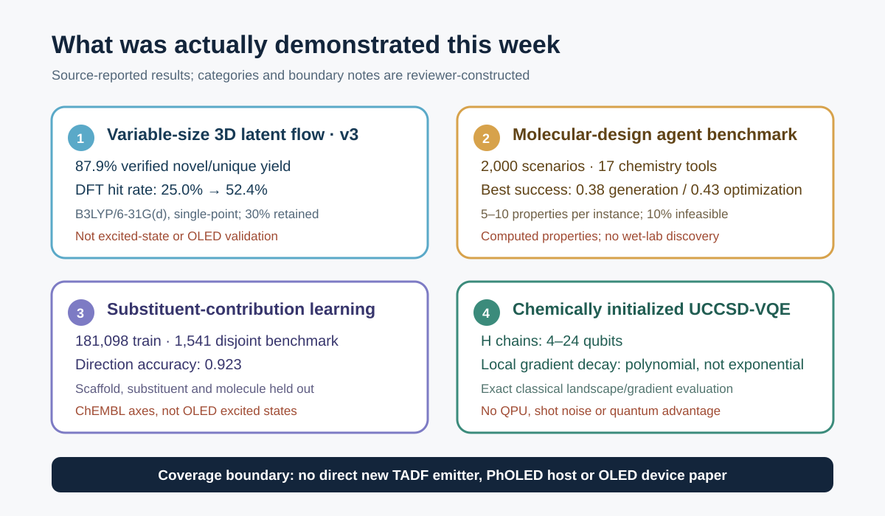

# 광전자 분자 역설계의 신뢰도를 규정하는 생성 검증과 화학적 초기화

2026년 9월 18일부터 24일까지 공개되거나 의미 있게 개정된 문헌 가운데, TADF 발광체·PhOLED host·host–dopant 또는 exciplex를 직접 합성하고 소자로 검증한 새 연구는 찾지 못했다. 이번 주의 신호는 직접적인 OLED 성능 기록보다 **역설계 결과를 어디까지 믿을 수 있는가**에 모였다. 한 연구는 원자 수를 미리 정하지 않는 3D 생성모델의 DFT 검증 수치를 v3에서 수정했고, 두 연구는 분자 설계 에이전트와 치환기 수준 예측이 다중 제약과 scaffold 외삽에서 얼마나 쉽게 무너지는지 측정했다. 양자 계산 연구는 Hartree–Fock(HF) 또는 MP2에서 시작한 UCCSD-VQE의 국소 구배가 무작위 초기화보다 잘 유지된다는 수치 근거를 제시했다.

OLED 역설계에 대한 핵심 해석은 간단하다. 생성기의 유효성·신규성, surrogate가 고른 후보의 DFT hit rate, 자연어 에이전트의 제약 충족률, VQE의 국소 trainability는 서로 다른 질문이다. 어느 하나가 좋아도 ΔE_ST, S_1/T_1 ordering, oscillator strength, spin–orbit coupling, 재배열 에너지, host triplet, 합성 가능성, 소자 수명까지 자동으로 보장되지는 않는다. 따라서 후보 생성과 계산·화학·소자 검증을 하나의 점수로 합치기보다, 실패 원인이 다른 독립 gate로 운영해야 한다.

*그림 1. 이번 리뷰를 위해 생성한 개념 일러스트. 고정 차원 latent에서 variable-size 분자가 생성되고, 계산·화학 제약을 거쳐 광전자 재료 후보로 좁혀지는 관계를 표현했다. 분자 모티프, 에너지 지형과 양자 요소는 특정 화학구조, 측정 곡면, 정량 데이터 또는 실행 가능한 회로가 아니다.*

::: highlight 이번 주의 판정
이번 주 문헌은 높은 생성 hit rate보다 검증 정의가 중요하다는 점을 보여준다. OLED 파이프라인에서는 생성모델의 내부 ranking, 독립 DFT/TDDFT, scaffold·substituent 외삽, 합성경로와 소자 환경을 분리해 기록해야 한다. VQE는 화학적 초기화가 국소 최적화를 돕는다는 증거가 추가됐지만, 실제 QPU·shot noise·측정비용·OLED 크기 active space의 실행 가능성을 입증한 것은 아니다.
:::

레이아웃을 검증한 주간 기술 브리프는 [PDF로 내려받을 수 있다](../artifacts/oled_inverse_design_weekly_brief_2026-09-25.pdf).

## 먼저 읽을 순서

1. **Fixed-Dimensional Latent Flow for Generating Variable-Size 3D Molecules v3** — 원자 수를 사전에 고정하지 않는 3D 생성과 HOMO–LUMO gap DFT 검증을 함께 제시하며, v3가 기존 생성 수치와 속도 주장을 수정했다.
2. **MolDesignBench** — 2,000개 시나리오와 17개 도구로 다중 제약·불가능 조건·도구 추론을 시험했고, 최고 성공률도 생성 0.38·최적화 0.43에 그쳤다.
3. **MolSC** — scaffold·substituent·molecule을 모두 분리한 평가에서 치환기 효과의 방향 예측을 별도 문제로 만들었다.
4. **Chemically Inspired Parameter Initialization for VQE** — 4–24 qubit 수소 사슬과 소분자 UCCSD landscape에서 HF·MP2 초기화 주변의 국소 구배 분산이 지수적이 아니라 다항적으로 감소함을 보고했다.

*그림 2. 원문에서 보고된 수치와 리뷰어가 정리한 검증 경계를 함께 표시한 근거 요약. 네 연구 간 성능 순위가 아니며, 어느 연구도 직접적인 OLED 소자 검증은 수행하지 않았다.*

## 1. 직접 OLED·TADF·PhOLED 연구는 없었다

이번 7일 범위에서 새 TADF emitter, PhOLED host, host–dopant/exciplex 설계 또는 OLED 소자 성능을 직접 보고한 신뢰할 만한 primary record는 확인하지 못했다. 따라서 아래 네 편은 **인접 방법론**으로 분류한다. 8월 21일 이후 발송한 다섯 차례의 브리프에 포함된 singlet-fission 생성, QALPA, Fraglingo, DMRG 여기 에너지, TDDFT kernel, VQE leakage 등의 항목은 반복하지 않았다.

## 2. 생성기의 DFT hit rate는 좋아졌지만, v3가 보여준 것은 수치 정정의 중요성이다

### Fixed-Dimensional Latent Flow for Generating Variable-Size 3D Molecules

**Weichi Yao, Cameron Gruich, Bryan R. Goldsmith, Yixin Wang.** arXiv:2609.08333, v3, 2026-09-22. [원문과 버전 기록](https://arxiv.org/abs/2609.08333)

이 연구의 EF-TALFM은 하나의 고정 차원 분자 latent를 flow matching으로 표본화하고, autoregressive Transformer가 end-of-molecule token을 낼 때까지 원자 종류·좌표·화학 속성을 생성한다. 원자 수를 생성 전에 정하지 않는다는 점이 핵심이다. canonical SMILES 순서와 rigid-pose alignment를 전처리에서 고정해 equivariant layer 없이 3D 구조를 다룬다. 다만 이 선택은 명시적 equivariance를 제공하지 않으며, 대칭 처리를 데이터 표현으로 옮긴 것이다.

**저자 보고 결과.** PCQM4Mv2에서 생성된 구조 가운데 sanitized, unique, training-set novel이며 PoseBusters 검사를 통과한 비율은 v3 기준 87.9%다. property-conditioned 실험은 4.1–7.8 eV 사이의 HOMO–LUMO gap 목표 10개마다 10,000개씩 생성했다. 내부 property readout으로 target별 상위 30%를 남기자, B3LYP/6-31G(d) single-point DFT가 목표의 0.1 eV 이내라고 판정한 hit rate가 25.0%에서 52.4%로 상승했고, 원래 DFT hit의 62.9%를 유지했다. 선택된 unique hit의 97.4%는 같은 property 구간의 training subset에 없었다.

**왜 v3를 이번 주 항목으로 보았나.** v1은 unconditional verified yield를 89.4%로 보고하고 UAE-3D와 FlowMol 대비 더 큰 sampling speedup을 제시했다. 9월 22일 공개된 v3는 yield를 87.9%로 수정하고 sampling-time speedup을 1.06×와 2.83×, verified-novel throughput을 1.24×와 3.56×로 다시 제시했다. 핵심 방향은 유지됐지만 비교 수치가 달라졌으므로 의미 있는 수정으로 간주했다. 이는 생성 연구에서 버전 번호와 분모를 함께 기록해야 하는 이유다.

**한계와 증거 강도.** DFT 검증은 생성 geometry를 추가 최적화하지 않은 B3LYP/6-31G(d) single point다. 목표는 frontier-orbital gap이지 S_1, T_1, ΔE_ST 또는 RISC rate가 아니다. PCQM4Mv2의 closed-shell 중심 분포와 PoseBusters 통과는 OLED 합성 가능성, excited-state 정확도, amorphous-film 안정성 또는 device lifetime을 뜻하지 않는다. 논문은 프리프린트이며 독립 재현은 이 리뷰에서 수행하지 않았다.

**OLED workflow translation — 리뷰어 제안.** latent flow는 원자 수가 고정되지 않은 donor–acceptor 및 host 후보 탐색에 쓸 수 있다. 그러나 ranking head는 HOMO/LUMO 한 축이 아니라 ΔE_ST·S_1/T_1·oscillator strength·vertical/adiabatic ionization energy·triplet localization·SA score를 별도 출력해야 한다. 상위 30%를 남기는 정책도 고정하지 말고, target별 calibration curve와 hit-retention curve를 보고 TDDFT 예산에 맞춰 정해야 한다.

## 3. 자연어로 쓰인 다중 제약은 도구가 있어도 잘 지켜지지 않는다

### MolDesignBench: Evaluating LLM-based Agent for Scenario-grounded Molecular Design

**Yongjun Jeong, Hanbum Ko, Ye Rin Kim, Chanhui Lee, Rodrigo Hormazabal, Jaewan Lee, Sehui Han, Sungbin Lim, Sungwoong Kim.** COLM 2026 accepted paper; arXiv:2609.27349, v1, 2026-09-23. [원문](https://arxiv.org/abs/2609.27349)

MolDesignBench는 생성 1,000개와 최적화 1,000개를 포함한다. 각 instance에는 5–10개 property 조건과 functional-group 조건이 들어가며, feasible 900개와 infeasible 100개로 구성된다. 17개 chemistry tool 가운데 generation·optimization·property·functional-group 검사 도구를 여러 단계로 호출해야 한다. 단일 정답 분자 대신 constraint satisfaction, molecular constraint distance, infeasibility accuracy 등을 함께 측정한다.

**저자 보고 결과.** GPT-5.4에 전체 도구를 제공했을 때 성공률은 생성 0.38, 최적화 0.43으로 가장 높았다. 도구 없이 측정한 값은 각각 0.11과 0.17이었다. 그러나 implicit constraint를 명시적인 property 이름과 수치 범위로 바꾸면 Qwen3-235B의 성공률은 생성 0.19→0.35, 최적화 0.25→0.38로 올라갔고 infeasibility accuracy는 0.41→0.90, 0.10→0.63으로 크게 개선됐다. 문제는 분자 생성기만이 아니라 요구조건을 정확히 해석하고 불가능한 조합을 거부하는 제어층에 있다.

**한계와 증거 강도.** property 판정은 RDKit descriptor와 ADMET model 같은 계산 예측에 의존한다. 작은 분자를 대상으로 하며 polymer·crystal은 제외한다. 생성 분자가 새로운 발견으로 이어지는지, 합성되는지, 실험 물성이 맞는지는 검증하지 않았다. accepted paper이지만 현재 공개 근거는 arXiv 버전이며, 도구 호출의 횟수보다 질이 중요하다는 관찰은 특정 agent setup에 종속된다.

**OLED workflow translation — 리뷰어 제안.** OLED 설계 지시는 “높은 T_1, 낮은 ΔE_ST, 높은 oscillator strength, 적절한 HOMO/LUMO, 비평면성, 합성 가능성”처럼 서로 충돌할 수 있다. agent가 이를 자연어로만 처리하게 두지 말고 각 조건을 단위·method·geometry·환경까지 포함한 machine-readable schema로 변환해야 한다. 예를 들어 T_1>2.8 eV가 gas-phase TDDFT인지 host-polarized adiabatic 값인지 구분하지 못하면, 높은 success score도 과학적으로 무의미하다. infeasible detector는 후보를 억지로 내놓는 대신 어떤 제약이 충돌하는지 반환해야 한다.

## 4. 치환기 효과는 분자 전체 property 예측과 다른 일반화 문제다

### MolSC: Leveraging Substituent Contributions to Enhance Fine-grained Molecular Understanding in LLMs

**Hyuntae Park, Sooyeon Kim, Jiwon Park, SangKeun Lee.** EMNLP 2026 Main Conference accepted paper; arXiv:2609.23073, v1, 2026-09-19. [원문](https://arxiv.org/abs/2609.23073)

MolSC는 분자 property 자체가 아니라, scaffold에 특정 substituent를 붙였을 때 property가 얼마나 변하는지를 학습 신호로 만든다. ChEMBL에서 구조를 scaffold와 substituent로 분해해 structural-alert liability, target bioactivity, physicochemical descriptor의 차이를 구성했다. training set에는 181,098개의 contribution, 100,076개 unique scaffold, 20,541개 unique substituent와 164,650개 unique molecule이 포함된다. MolSC-Bench 1,541개는 scaffold·substituent·original molecule이 모두 training set과 겹치지 않는다.

**저자 보고 결과.** 3B model은 MolSC-Bench의 substituent-induced change 방향 정확도 0.923을 기록했다. 기존 molecular LLM은 chance 수준에 가깝고 proprietary model도 약 0.7에 머물렀다. context-dependent subset에서 같은 substituent 효과의 부호가 scaffold에 따라 바뀌는 conflict pair를 평가했을 때, 저자 1B model의 정확도는 0.582, GPT-5.2는 0.145였다. FGBench에서는 저자 1B model이 single group 0.785, interaction 0.780, comparison 0.776을 보고했다.

**한계와 증거 강도.** contribution은 molecule과 scaffold 모두 같은 property annotation을 가질 때만 계산할 수 있다. 데이터는 ChEMBL의 세 property 축에 한정되며, 1D molecular representation을 사용한다. OLED에서 중요한 excited-state relaxation, conformer, solid-state polarization, aggregation, host effect는 포함되지 않는다. 따라서 수치를 OLED 성능으로 옮길 수 없고, 여기서는 **분할 방식과 방향성 평가**를 가져오는 것이 핵심이다.

**OLED workflow translation — 리뷰어 제안.** TADF/host 데이터셋도 absolute property 회귀만 하지 말고 matched molecular pair를 만들어 substituent가 ΔE_ST, S_1/T_1, oscillator strength, ionization energy, reorganization energy를 올리는지 내리는지를 별도로 학습할 수 있다. scaffold·substituent·molecule을 동시에 hold out하고, conformer와 계산 method가 같은 쌍만 contribution label로 사용해야 한다. 이것은 “어떤 치환기가 좋다”는 보편 규칙보다 scaffold-dependent effect를 먼저 검증하는 설계다.

## 5. VQE의 barren plateau는 초기점 주변과 전체 공간에서 다르게 보인다

### Can Chemically Inspired Parameter Initialization Mitigate Barren Plateaus in Variational Quantum Eigensolvers?

**Zhangyu Yang, Jinzhao Sun, Jianpeng Chen, Weitang Li, Zhigang Shuai.** arXiv:2609.22729, v1, 2026-09-19. [원문](https://arxiv.org/abs/2609.22729)

이 연구는 molecular UCCSD-VQE에서 global parameter space의 평균 구배가 아니라, 실제 최적화가 시작되는 HF·MP2 amplitude 주변의 **국소 patch**를 조사한다. 선형 수소 사슬은 4, 8, 12, 16, 20, 24 qubit로 확장했고 UCCSD parameter 수는 3에서 1,818까지 늘었다. 각 patch에서 여러 radius와 sample을 사용해 component-averaged gradient variance를 추정하고, random initialization과 polynomial/exponential scaling fit을 비교했다. LiH, HF, N_2, H_2O, CH_2O, C_2H_4도 작은 basis 또는 4-electron/4-spatial-orbital active space로 추가했다.

**저자 보고 결과.** HF와 MP2 중심의 maximum local gradient variance는 조사한 4–24 qubit 범위에서 system size에 따라 다항적으로 감소했다. random center는 지수적 barren-plateau형 suppression을 보였다. 수소 사슬을 늘이면 polynomial exponent가 커져 trainability가 악화됐고, strongly correlated stretched geometry에서는 화학적 초기화도 충분하지 않았다. optimizer trajectory에서도 chemical start는 tested window 안에서 non-exponential local gradient region에 머무는 경향을 보였다.

**실행 경계.** 이것은 QPU 실험이 아니다. Hamiltonian, UCCSD circuit, gradient, Hessian-vector product와 optimization trajectory를 고전적으로 정확히 계산한 수치 연구다. shot noise, gate noise, measurement grouping, error mitigation, wall-clock QPU sampling cost는 포함하지 않는다. 따라서 “VQE가 OLED 분자에 실용적이다” 또는 “양자 우위가 있다”는 증거가 아니다. 보여준 것은 chemically informed warm start가 무작위 시작보다 국소 landscape를 더 잘 보존할 수 있다는 사실이다.

**OLED workflow translation — 리뷰어 제안.** OLED용 VQE feasibility study는 전체 분자를 곧바로 올리기보다, DFT/DMRG가 다중참조 성격을 경고한 작은 chromophore active space에서 시작해야 한다. HF, MP2, CASSCF-inspired start를 같은 ansatz와 orbital space에서 비교하고, energy error와 함께 gradient variance, shot count, two-qubit gate depth, leakage와 state overlap을 보고해야 한다. 이번 연구는 초기화 선택의 근거를 제공하지만, active-space truncation과 측정비용이 실제 병목으로 남는다.

## 네 연구를 하나의 OLED 파이프라인으로 읽는 법

네 연구가 답한 질문은 서로 다르다. EF-TALFM은 **무엇을 생성하고 어떻게 값싼 내부 점수로 줄일 것인가**, MolDesignBench는 **여러 화학 조건을 정확히 해석하고 불가능한 요구를 거절할 수 있는가**, MolSC는 **국소 구조 변경의 방향을 새로운 scaffold에서도 맞힐 수 있는가**, VQE 연구는 **정확한 전자구조 최적화를 시작할 때 구배가 사라지지 않는가**를 묻는다.

OLED 역설계에서는 이들을 한 모델로 합치기보다 다음처럼 분리하는 편이 안전하다.

1. 생성기는 variable-size scaffold와 substituent 조합을 제안하되, training-set replay와 chemistry sanity check를 보고한다.
2. constraint parser는 각 목표를 단위·계산법·환경과 함께 명시하고, 불가능한 조합을 별도 결과로 낸다.
3. surrogate는 absolute error뿐 아니라 substituent-induced direction accuracy와 scaffold-disjoint calibration을 평가한다.
4. DFT/TDDFT/TDA 또는 multireference 계산은 내부 ranking과 독립된 reference layer로 사용한다.
5. 합성경로, host–guest compatibility, morphology와 device stress는 계산 hit와 분리된 마지막 검증층으로 둔다.
6. VQE는 이 단계들을 대체하는 생성 엔진이 아니라, 작은 active space의 high-level reference 가능성을 시험하는 연구 트랙으로 둔다.

## 이번 주에 해볼 실험

**200개 matched molecular pair로 ‘치환기 방향성 + 제약 해석’ 감사(audit)를 만들자.** 기존 TADF emitter 또는 host 계산 데이터에서 같은 scaffold와 계산 protocol을 공유하는 200쌍을 고른다. ΔE_ST, S_1, T_1, oscillator strength, HOMO, LUMO의 변화 방향을 label로 만들고 scaffold·substituent·molecule이 모두 겹치지 않는 test split을 구성한다. 같은 목표를 자연어 narrative와 explicit schema 두 방식으로 agent에 주고, direction accuracy·infeasibility accuracy·TDDFT top-k hit retention을 비교한다. 상위·하위 각 20개는 동일 geometry/protocol로 재계산해 surrogate와 agent의 오류를 분리한다.

이 실험은 새 모델을 크게 학습시키지 않아도 된다. 이번 주 네 논문의 핵심인 **버전·분모 기록, 명시적 제약, scaffold-disjoint 평가, 화학적으로 informed initialization**을 하나의 작은 OLED audit에 옮길 수 있다.

## Read first

[EF-TALFM v3](https://arxiv.org/abs/2609.08333)을 먼저 읽을 것을 권한다. OLED에 직접 적용된 연구는 아니지만, variable-size 생성, 내부 ranking, 독립 DFT 검증, hit rate와 hit retention, 그리고 버전 수정까지 한 논문에서 함께 볼 수 있다. 생성모델 논문을 어떤 분모와 어떤 reference level로 읽어야 하는지 보여주는 가장 실용적인 사례다.

## Coverage gap

이번 범위에는 직접적인 신규 TADF emitter·PhOLED host·host–dopant/exciplex·OLED degradation 논문이 없었다. SELFIES, reaction-aware synthesis, CRBM/Boltzmann machine, D-Wave/quantum annealing, QUBO, QAOA, GW–BSE를 OLED 규모에서 새로 입증한 신뢰할 만한 항목도 찾지 못했다. VQE 항목은 고전적 exact simulation과 landscape 분석이며 실제 QPU 실행, noise model, sampling resource estimate 또는 quantum advantage를 포함하지 않는다.

## 근거 및 공개 범위

선정 항목은 2026년 9월 18–24일에 새로 공개되거나 의미 있게 개정된 1차 자료를 기준으로 했다. EF-TALFM은 v1과 v3 원문을 비교했고, 나머지 세 편은 arXiv HTML 전문과 저자 표를 확인했다. 수치는 모두 원문 보고값이며 독립 계산 재현은 수행하지 않았다. OLED 적용 파이프라인과 이번 주 실험은 리뷰어 제안이다.

이 글은 OpenAI Codex의 웹 조사, Gmail 중복 확인, GitHub 게시 연결, 내장 imagegen, 로컬 HTML·PDF·링크 검사로 작성했다. 대표 그림은 개념 이미지이며 정량 근거는 SVG로 별도 구성했다. scientific-stop-slop-ko 출판 감수를 적용했다.

## 참고문헌

1. W. Yao, C. Gruich, B. R. Goldsmith, Y. Wang, “Fixed-Dimensional Latent Flow for Generating Variable-Size 3D Molecules,” arXiv:2609.08333v3 (2026-09-22). https://arxiv.org/abs/2609.08333
2. Y. Jeong et al., “MolDesignBench: Evaluating LLM-based Agent for Scenario-grounded Molecular Design,” COLM 2026 accepted; arXiv:2609.27349v1 (2026-09-23). https://arxiv.org/abs/2609.27349
3. H. Park, S. Kim, J. Park, S. Lee, “MolSC: Leveraging Substituent Contributions to Enhance Fine-grained Molecular Understanding in LLMs,” EMNLP 2026 Main Conference accepted; arXiv:2609.23073v1 (2026-09-19). https://arxiv.org/abs/2609.23073
4. Z. Yang, J. Sun, J. Chen, W. Li, Z. Shuai, “Can Chemically Inspired Parameter Initialization Mitigate Barren Plateaus in Variational Quantum Eigensolvers?” arXiv:2609.22729v1 (2026-09-19). https://arxiv.org/abs/2609.22729
