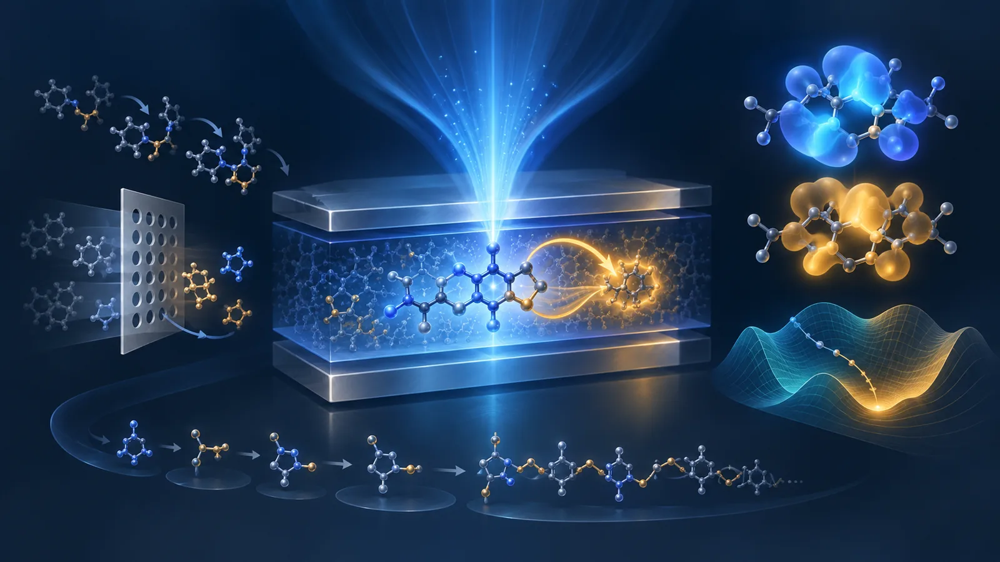
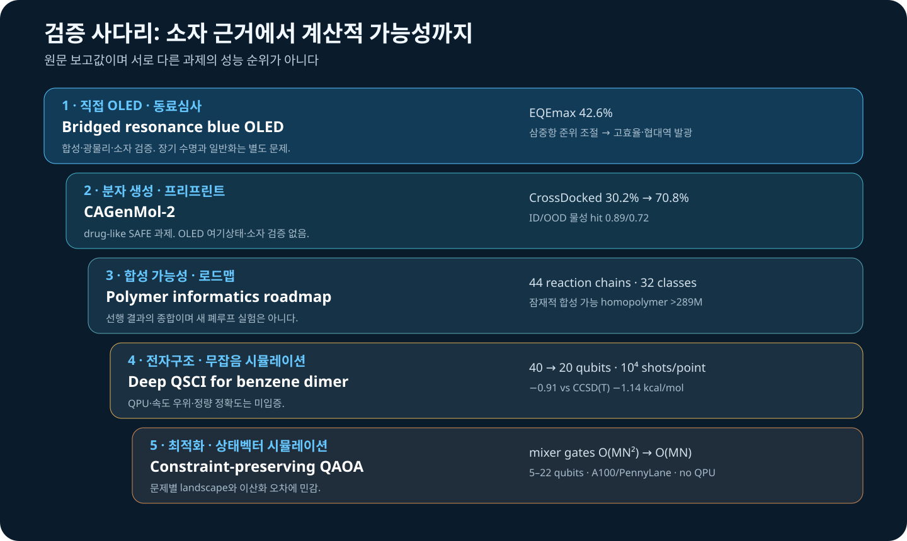

# 청색 OLED의 삼중항 준위 제어와 분자 역설계 검증의 연결

이번 주에는 직접 OLED 논문이 한 편 등장했다. He, Zhang, Li는 청색 유기발광다이오드에서 **bridged resonance configuration**으로 삼중항 여기상태를 조절하고, 최대 외부양자효율(EQE) 42.6%를 보고했다. 생성모델이나 surrogate가 아니라 합성·광물리·소자로 이어진 동료심사 근거라는 점에서 우선순위가 가장 높다.

나머지 네 자료는 이 결과를 “역설계가 해결됐다”는 결론으로 확대하지 못하게 하는 검증층을 보여준다. CAGenMol-2는 하나의 마스킹 모델로 물성 예측·조건부 생성·국소 편집을 수행하지만 drug-like 데이터에서 검증됐다. 고분자 정보학 로드맵은 합성경로를 후보 생성의 사후 필터가 아니라 생성공간 자체로 넣어야 한다고 주장한다. Deep QSCI와 QAOA 연구는 각각 약한 π–π 상호작용과 조합 최적화를 다루지만 실제 QPU 실행이 아니라 무잡음 고전 시뮬레이션이다. 다섯 자료를 함께 읽으면 청색 OLED 역설계의 핵심 단위는 “분자 생성”이 아니라 **여기상태–합성–응집–소자–계산자원으로 이어지는 검증 사슬**이다.

*그림 1. 이번 리뷰를 위해 생성한 개념 일러스트. 분자 모티프, 궤도와 에너지 지형은 정확한 화학구조, 측정 형태, 정량 그래프 또는 실행 가능한 양자회로가 아니다.*

::: highlight 이번 주의 판정
강한 근거는 청색 OLED에서 삼중항 상태를 설계변수로 다루어 EQE 42.6%를 보고한 직접 소자 연구다. 인접 연구들은 후보 생성 범위를 넓히고 계산비를 줄이는 방법을 제시하지만 OLED 여기상태·합성·고체환경·수명을 하나로 검증하지 않는다. bridged resonance를 데이터 목적변수와 검증 protocol로 번역하되, 생성 성공률이나 qubit 감소를 소자 성능 또는 양자 우위로 읽지 않아야 한다.
:::

레이아웃을 검증한 [주간 기술 브리프 PDF](oled_inverse_design_weekly_brief_2026-10-02.pdf)도 제공한다.

## 먼저 읽을 순서

1. **Bridged resonance configuration enables high-efficiency and narrow-emission in blue organic light-emitting diodes** — 삼중항 준위 제어를 합성·광물리·소자로 연결하고 EQE 42.6%를 보고했다.
2. **One Sequence, Many Decodings: CAGenMol-2 Recasts Drug Design as Masked Molecular Inference** — SAFE 기반 단일 마스킹 모델을 예측·생성·국소 최적화에 재사용한다.
3. **A roadmap for polymer informatics super-intelligence** — 생성–예측–합성계획을 연결하며 44개 reaction chain, 32개 polymer class의 선행 결과를 정리한다.
4. **A Divide-and-Conquer Quantum-Selected Configuration Interaction for Evaluating π–π Stacking Interaction Energies in the Benzene Dimer** — monomer QSCI 재사용으로 40→20 qubit를 제안하지만 simulator 결과다.
5. **Quantum Approximate Optimisation Algorithm for Protein Sidechain Packing** — W-state와 XY ring mixer로 one-hot 제약을 보존하지만 A100 상태벡터 시뮬레이션이다.

*그림 2. 원문 보고값과 리뷰어가 정리한 증거 경계. 서로 다른 문제의 성능 순위가 아니며 양자 두 항목은 실제 QPU 실행이 아니다.*

## 1. 삼중항 상태를 설계변수로 다룬 청색 OLED

### Bridged resonance configuration enables high-efficiency and narrow-emission in blue organic light-emitting diodes

**Yi-Hui He, Zhen Zhang, Yan-Qing Li.** *Nature Communications*, 2026-09-29. DOI: [10.1038/s41467-026-78234-0](https://doi.org/10.1038/s41467-026-78234-0)

청색 OLED에서는 단일항 발광만 최적화해서는 충분하지 않다. 전기 여기로 생긴 삼중항이 어느 준위에 머무르고 어떤 경로로 단일항으로 돌아오는지가 triplet accumulation, roll-off와 열화 가능성을 좌우한다. 이 논문은 bridged resonance configuration으로 triplet excited state를 조절하고 높은 photoluminescence quantum yield와 협대역 청색 발광을 유지하면서 최대 EQE 42.6%를 보고했다.

**증거 강도와 한계.** 이번 호에서 유일한 동료심사·직접 OLED 연구다. Nature Communications의 공개 색인과 DOI metadata에서 게재일, 세 저자, EQE 42.6%를 확인했다. 다만 출판사 원문 전문은 인증 경로로 리디렉션되어 세부 수치표를 독립 추출하지 못했다. 확인하지 않은 ΔE_ST, k_RISC, FWHM, 수명 수치는 보충하지 않았다.

**역설계 번역 — 리뷰어 제안.** bridge 전후의 S_1/T_n ordering, spin–orbit/vibronic coupling proxy, transition-density localization, conformer 민감도를 함께 label로 만든다. TDDFT/TDA로 후보를 줄이고 선정군에 state-specific benchmark를 적용한 뒤 host-polarized film과 device에서 triplet accumulation을 검증한다. 42.6%는 해당 재료·소자 구조의 결과이지 구조 모티프의 일반 hit rate가 아니다.

## 2. 하나의 마스킹 모델이 여러 일을 해도 OLED 검증은 별도다

### One Sequence, Many Decodings: CAGenMol-2 Recasts Drug Design as Masked Molecular Inference

**Yanting Li, Enyan Dai, Lei Wang, Wen-Cai Ye, Li Liu.** arXiv:2609.34301v1, 2026-09-28. [원문](https://arxiv.org/abs/2609.34301)

CAGenMol-2는 분자 SAFE sequence, logP·molecular weight·QED·synthetic accessibility·molar refractivity의 연속값 slot, 선택적 3D pocket token을 하나의 wrapped sequence로 묶는다. 관측/마스킹 구간을 바꿔 같은 checkpoint가 property prediction, 조건부 생성, 부분구조 편집을 수행한다. AdaFO는 gradient 없이 fragment를 mask-and-refill한다.

**저자 보고 결과.** 단일 물성 hit rate는 ID 0.89, OOD 0.72였다. 세 물성 Lipinski-like joint hit는 0.76, 두 물성 lead-like 조건은 0.84였다. 5,000개 hold-out에서 macro R² 0.910, Pearson 0.974를 보고했다. confidence 상위 25%는 물성별 MAE를 29.1–59.9% 줄였다. CrossDocked2020 100개 hold-out pocket에서 AdaFO는 success rate를 30.2%→70.8%로 높였고 mean Vina −8.76 kcal/mol, high-affinity fraction 85.1%를 보고했다.

**한계와 번역.** drug-like 분자와 protein pocket 결과이며 confidence는 calibrated posterior가 아니다. SAFE validity, SA score, docking success는 합성 성공이나 OLED excited-state 정확도가 아니다. OLED용 sequence에는 계산법과 환경을 물성별로 기록하고, mask-and-refill 후보는 독립 TDDFT와 reaction-aware filter를 통과시켜야 한다.

## 3. 합성 가능성은 사후 점수가 아니라 생성공간의 구성 원리다

### A roadmap for polymer informatics super-intelligence

**Akhlak Mahmood, Janhavi Nistane, Huan Tran, Chiho Kim, Rampi Ramprasad.** arXiv:2609.34051v1, 2026-09-28. [원문](https://arxiv.org/abs/2609.34051)

이 글은 새 benchmark가 아니라 representation, data extraction, property model, generative design, retrosynthesis와 agent orchestration을 잇는 로드맵이다. RxnChainer는 44개 reaction chain과 32개 polymer class를 적용해 2억 8,900만 개 이상의 잠재적 합성 가능 homopolymer를 열거한 선행 결과를 정리한다. polyT5는 1억 개 이상 polymer 학습 사례를, polyBART는 예측 Tg 595 K 후보가 실험에서 513 K로 확인된 사례를 소개한다.

**증거 경계와 번역.** 이 수치는 인용된 선행 연구의 결과이며 새 자율실험이 아니다. “super-intelligence”는 현재 성능표가 아니라 closed-loop experimentation까지 확장한 목표다. OLED에서는 SA score 하나보다 검증된 coupling·borylation·SNAr template와 building-block inventory로 후보를 조립하고 route length·희귀 시약·수율 불확실성을 기록하는 편이 낫다. polymer 통계를 small-molecule OLED 수율로 직접 이전해서는 안 된다.

## 4. π–π 상호작용의 register를 절반으로 줄였지만 우위는 남았다

### A Divide-and-Conquer Quantum-Selected Configuration Interaction for Evaluating π–π Stacking Interaction Energies in the Benzene Dimer

**Ryotaro Tajima, Rei Sato, Yosuke Iyama, Ryo Kiguchi, Yoshitake Kitanishi.** arXiv:2609.36708v1, 2026-09-29. [원문](https://arxiv.org/abs/2609.36708)

Deep QSCI는 sandwich benzene dimer를 monomer subsystem으로 나눈다. 한 monomer의 QSCI와 particle-number-conserving excitation으로 local basis를 만들고, 두 local space의 effective Hamiltonian을 고전 대각화한다. 동일 monomer QSCI를 두 fragment와 모든 separation에 재사용한다.

**저자 보고 결과와 실행 경계.** direct CAS(28e,20o)는 40 qubit, monomer CAS(14e,10o)는 20 qubit다. UCCSD input을 Classiq SDK 1.25.0의 **noiseless simulation**으로 평가했고 parameter 값마다 10⁴ shots, 다섯 점 scan에 5×10⁴ shots를 썼다. 6-31G**에서 4.0 Å interaction energy는 −0.908 kcal/mol, counterpoise-corrected CCSD(T)는 −1.139 kcal/mol이었다. effective dimension은 8,649다.

**한계와 번역.** Hamiltonian, orbital, counterpoise 처리가 달라 가까운 수치가 정량 검증은 아니다. cc-pVDZ에서는 큰 cancellation과 charge-transfer omission이 드러났다. 실제 QPU, runtime benchmark, quantum advantage가 없다. OLED에서는 host–guest의 작은 active space에서 fragment reuse를 시험하되 SAPT, DLPNO-CCSD(T), dispersion-corrected DFT를 baseline으로 두어야 한다.

## 5. 제약을 회로에 넣는 QAOA는 유용하지만 simulator 결과다

### Quantum Approximate Optimisation Algorithm for Protein Sidechain Packing

**Sebastian O. M. Stewart, Nick Chancellor, Jonte R Hance, Ittoop Vergheese Puthoor.** arXiv:2609.31077v1, 2026-09-25. [원문](https://arxiv.org/abs/2609.31077)

fixed backbone에서 residue마다 하나의 rotamer를 고르는 문제를 one-/two-body energy QUBO로 만들고, W-state와 cyclic XY mixer로 Hamming-weight-1 feasible subspace를 보존한다. two-qubit gate scaling을 O(MN²)→O(MN), mixer depth를 O(N)→2로 줄였다고 보고한다.

**실행과 결과.** PennyLane 0.44.1, Lightning 0.44.0, JAX 0.7.2와 A100 GPU 상태벡터 시뮬레이션이다. 5–22 qubit, p≤12, 30 seed를 평가했다. 99.99% recovery fitted budget은 22 qubit까지 500 미만이었지만 실제 22-qubit subsection은 약 52.5–732.9 shots였다. moderate-confidence 5–14 qubit 1,500회 중 54%가 AlphaFold PyRosetta baseline보다 낮았고 winning run 평균은 −8.114 kcal/mol이었다.

**한계와 번역.** `StatePrep`은 hardware-native W-state 비용을 숨긴다. 개선은 약한 baseline에서 나온 것이며 quantum speedup이 아니다. OLED one-hot 선택에도 mixer는 참고할 만하지만 simulated annealing, tabu search, CP-SAT와 같은 QUBO를 비교해야 한다.

## 이번 주에 해볼 실험

**bridged-resonance 주변의 reaction-aware audit set을 만들자.** 공개 MR-TADF scaffold 20개에서 실제 반응으로 만들 수 있는 bridge·인접 치환기 후보를 각 10개 열거한다. 동일 geometry protocol로 S_1, T_1, 가까운 T_n, oscillator strength와 transition-density localization을 계산하고 상위 20개에 SOC/spin-vibronic proxy를 추가한다. scaffold-disjoint split에서 생성 confidence와 독립 TDDFT hit rate를 함께 기록한다.

## Read first

[He 등의 bridged resonance 청색 OLED 논문](https://doi.org/10.1038/s41467-026-78234-0)을 먼저 권한다. 이번 주 유일하게 합성·광물리·소자로 이어지는 직접 근거이며 triplet state를 분자 역설계의 중심 목적변수로 만든다.

## Coverage gap

신규 PhOLED host, host–dopant/exciplex, OLED degradation, GW–BSE, SELFIES, CRBM/Boltzmann machine, D-Wave/quantum annealing은 없었다. CAGenMol-2는 SAFE를 사용한다. Deep QSCI와 QAOA는 고전 simulator 결과이며 actual QPU, noise-aware resource estimate, quantum advantage를 입증하지 않았다. OLED 규모 VQE도 없었다.

## 근거 및 공개 범위

2026년 9월 25일부터 10월 1일까지 최초 공개된 동료심사 논문과 프리프린트를 선별했다. 이전 여덟 주와 중복되는 항목은 제외했다. 수치는 저자 보고값이며 독립 계산·합성·소자 재현은 수행하지 않았다. OLED 적용안과 실험은 리뷰어 제안이다. 대표 그림은 개념 이미지이고 정량 근거는 SVG로 분리했다. scientific-stop-slop-ko 출판 감수를 적용했다.

## 참고문헌

1. Y.-H. He, Z. Zhang, Y.-Q. Li, *Nature Communications* (2026-09-29). https://doi.org/10.1038/s41467-026-78234-0
2. Y. Li et al., arXiv:2609.34301v1 (2026-09-28). https://arxiv.org/abs/2609.34301
3. A. Mahmood et al., arXiv:2609.34051v1 (2026-09-28). https://arxiv.org/abs/2609.34051
4. R. Tajima et al., arXiv:2609.36708v1 (2026-09-29). https://arxiv.org/abs/2609.36708
5. S. O. M. Stewart et al., arXiv:2609.31077v1 (2026-09-25). https://arxiv.org/abs/2609.31077
