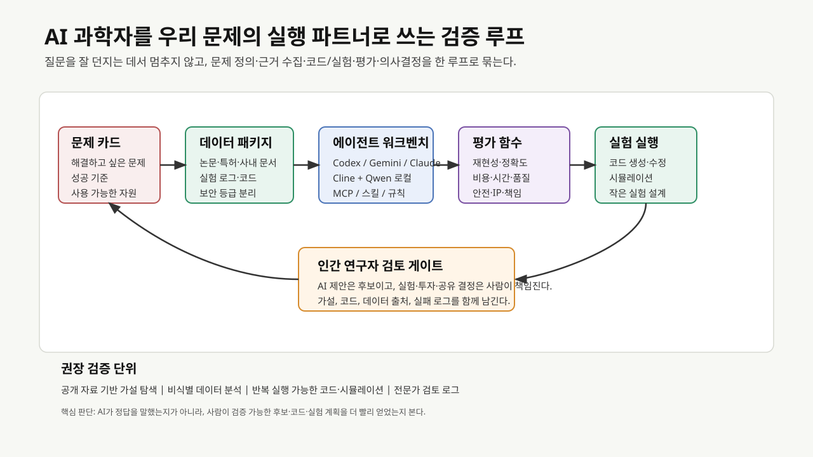
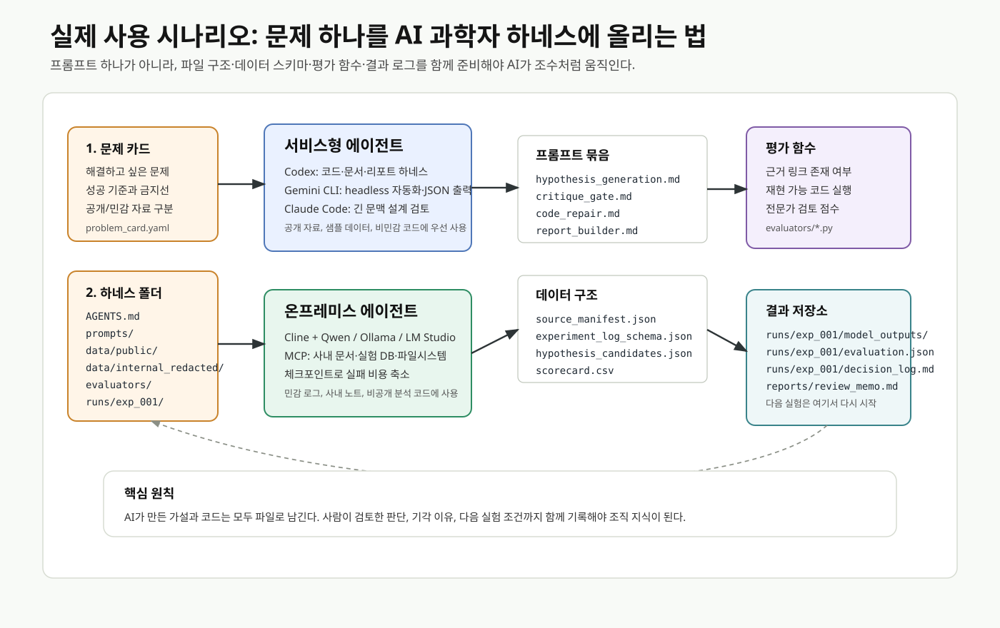

# AI 과학자를 우리 문제의 실행 파트너로 쓰는 리뷰 계획

최종 리뷰의 도입부는 수학과 의학 정보라는 두 장면에서 시작하는 편이 좋겠습니다. 2026년 4월 [Quanta Magazine](https://www.quantamagazine.org/the-ai-revolution-in-math-has-arrived-20260413/)은 2025년 여름 국제수학올림피아드 이후 수학자들이 AI를 연구 도구로 다시 보기 시작했고, 일부 연구에서는 AI가 추측 생성, 증명 전략 탐색, 검증 보조까지 들어오고 있다고 전했습니다. 국내 [뉴스스페이스 기사](https://www.newsspace.kr/news/article.html?no=13494)는 GPT-5.4 Pro가 에르되시 문제 #1196을 풀었다는 주장을 둘러싼 흥분과 검증 논쟁을 함께 다룹니다. 이 기사는 최종 결론의 근거라기보다, 독자가 바로 관심을 가질 수 있는 `AI가 정말 연구의 문턱을 넘고 있는가`라는 장면을 여는 데 쓰면 좋습니다.

그다음 바로 반대쪽 장면을 붙입니다. [한겨레 기사](https://www.hani.co.kr/arti/science/science_general/1253718.html)와 원문인 [Nature News Feature](https://www.nature.com/articles/d41586-026-01100-y)는 스웨덴 연구진이 만든 가짜 질병 `Bixonimania`가 AI 챗봇 답변과 학술 인용망을 타고 실제 질병처럼 퍼진 사례를 다룹니다. 이 사례를 보면 AI 과학자가 빠르게 가설을 만들 수 있다는 사실만으로는 충분하지 않습니다. 연구 현장에서는 속도와 그럴듯함을 출처 확인, 검증 가능한 평가 함수, 인간 전문가의 검토 게이트와 함께 다루어야 합니다.

이 두 장면에서 리뷰의 초점이 자연스럽게 살아납니다. 사람들은 이미 AI를 적극적으로 활용하고 싶어합니다. 실제로 막히는 지점은 의지보다 실행의 번거로움입니다. 어떤 문제를 맡겨야 하는지, 어떤 자료를 넣어야 하는지, 사내 데이터를 어디까지 써도 되는지, 결과를 어떻게 검증해야 하는지, 그리고 어떤 도구를 지금 당장 써야 하는지가 불분명하면 AI 활용은 금세 챗봇 문답으로 돌아갑니다.

이번 리뷰는 `AI 과학자가 어디까지 동료가 될 수 있을까`라는 질문에서 한 걸음 더 들어갑니다. 핵심 질문은 다음과 같습니다.

> 우리가 가진 문제를 더 빠르고 정확하게 풀기 위해, AI 과학자를 어떤 실행 환경과 검증 루프 안에 배치해야 하는가?





## 도입부 초안

요즘 AI 소식을 보다 보면, 가장 먼 곳에서 먼저 미래가 보이는 느낌을 받을 때가 있습니다. 수학이 그렇습니다. [Quanta Magazine](https://www.quantamagazine.org/the-ai-revolution-in-math-has-arrived-20260413/)은 2025년 여름 이후 수학자들이 AI를 계산 보조를 넘어 새로운 증명 전략을 함께 탐색하는 도구로 보기 시작했다고 전했습니다. 국내에서도 [GPT-5.4 Pro의 에르되시 문제 풀이 주장](https://www.newsspace.kr/news/article.html?no=13494)을 둘러싼 보도가 나오면서, AI가 인간 연구자의 영역에 어디까지 들어왔는지에 대한 관심이 다시 커졌습니다.

하지만 같은 시기, 전혀 다른 경고도 나왔습니다. 스웨덴 연구진이 일부러 만든 가짜 질병 `Bixonimania`가 AI 챗봇 답변에 등장하고, 이후 학술지 인용까지 이어진 사례입니다. [Nature](https://www.nature.com/articles/d41586-026-01100-y)와 [한겨레](https://www.hani.co.kr/arti/science/science_general/1253718.html)가 다룬 이 사건에서는 AI가 지식처럼 보이는 것을 얼마나 빠르게 받아들이고 되돌려줄 수 있는지가 드러납니다.

그래서 이번 리뷰의 질문은 단순히 `AI 과학자가 인간 연구자의 동료가 될 수 있는가`에 머물지 않습니다. 더 실질적인 질문은 이것입니다. 우리가 회사 안에서 풀고 싶은 문제를 AI에게 맡길 때, 어떤 자료를 주고, 어떤 도구를 쓰고, 어떤 평가 기준으로 검증해야 AI가 충실한 조수와 조언자로 일할 수 있을까요?

## 리뷰의 중심 메시지

Nature에 실린 2026년 5월 논문들은 AI Scientist 논의를 세 갈래로 구체화합니다. [Co-Scientist 논문](https://www.nature.com/articles/s41586-026-10644-y)은 연구 목표와 선행 근거를 바탕으로 가설을 만들고 비판하고 개선하는 멀티 에이전트 구조를 제시합니다. [Robin 논문](https://www.nature.com/articles/s41586-026-10652-y)은 문헌 검색, 데이터 분석, 실험 제안, 결과 해석을 연결해 건성 노인성 황반변성 후보 치료제를 찾는 lab-in-the-loop 흐름을 다룹니다. [ERA 논문](https://www.nature.com/articles/s41586-026-10658-6)은 과학 실험을 위한 소프트웨어 작성이 병목이라는 문제에서 출발해, 품질 지표를 최대화하는 연구 코드를 AI가 탐색하도록 설계했습니다.

이 세 사례를 회사 관점으로 옮기면 메시지가 선명해집니다. AI 과학자는 만능 연구자로 두기보다, **문제 정의, 근거 수집, 코드와 실험 설계, 평가 함수, 인간 검토가 갖춰질 때 힘을 내는 실행 파트너**로 다루어야 합니다. 그래서 리뷰의 결론은 특정 모델 하나를 추천하는 데 머물면 안 됩니다. 우리가 가진 문제를 AI가 다룰 수 있는 작업 단위로 바꾸고, 보안 수준에 맞는 실행 환경을 고르며, 작은 검증 실험으로 확인하는 전략까지 제안해야 합니다.

## 정부 방향은 필요성의 배경으로 둔다

[Google Korea의 2026년 4월 27일 발표](https://blog.google/intl/ko-kr/company-news/inside-google/announcing-our-partnership-with-the-republic-of-korea/)는 Google DeepMind와 과학기술정보통신부의 국가 AI 파트너십을 K-문샷, AI Campus, AlphaEvolve, AlphaGenome, AlphaFold, AI Co-Scientist, WeatherNext와 함께 설명합니다. 이 발표에서는 정부가 AI for Science를 생산성 도구를 넘어 국가 연구 생산성과 난제 해결 인프라로 다루고 있음이 확인됩니다.

리뷰에서는 이 부분을 `왜 지금 해야 하는가`의 배경으로 배치하는 편이 좋습니다. 정부가 AI Campus와 K-문샷을 추진한다면, 회사는 관찰에 머물지 않고 자기 문제를 정의하고 실험할 준비가 된 수요자가 되어야 합니다. 특히 사내 데이터, 공정 지식, 실험 장비, 도메인 전문가를 가진 기업은 AI 모델 제공자보다 문제의 맥락을 더 많이 갖고 있습니다. 우리가 해야 할 일은 이 맥락을 AI가 다룰 수 있는 형태로 바꾸는 것입니다.

## Nature 사례를 회사 문제로 번역하는 방식

| Nature 사례 | 논문이 보여준 것 | 회사 안에서의 번역 | 테스트 시나리오 |
|---|---|---|---|
| Co-Scientist | 가설 생성, 비판, 순위화, 진화 | 연구자가 가진 문제를 가설 후보와 검증 계획으로 바꾸기 | 논문·특허·사내 노트 기반 원인 가설 20개 생성 후 전문가 평가 |
| Robin | 문헌 검색, 데이터 분석, 실험 제안, 결과 해석의 반복 | 데이터와 실험이 오가는 작은 lab-in-the-loop 구축 | 공개 데이터 또는 비식별 사내 로그로 후보 조건 탐색 |
| ERA | 품질 지표를 최대화하는 연구 코드 생성 | 분석 코드, 시뮬레이션, 자동 리포트의 병목 제거 | 기존 분석 스크립트 개선, 벤치마크 자동화, 재현성 로그 생성 |
| AlphaEvolve | 자동 평가자와 진화형 코드 탐색 | 평가 함수가 명확한 최적화 문제에 AI 투입 | 공정 조건 탐색, 실험 설계 후보, 알고리즘 파라미터 최적화 |

[AlphaEvolve 발표](https://deepmind.google/blog/alphaevolve-a-gemini-powered-coding-agent-for-designing-advanced-algorithms/)에서 중요한 대목은 LLM이 아이디어를 내고 자동 평가자가 실행·점수화한다는 점입니다. 회사의 작은 검증 실험에서도 같은 원칙이 필요합니다. AI 답변의 인상보다, 우리가 정의한 평가 함수에서 실제 개선을 냈는지를 봐야 합니다.

## 지금 쓸 수 있는 실행 환경

### 보안이 중요한 문제: 온프레미스와 로컬 우선

사내 데이터, 실험 로그, 공정 조건, 미공개 연구 아이디어가 들어가면 로컬 또는 온프레미스 환경을 먼저 검토해야 합니다.

- **Cline + Qwen 계열 로컬 모델**: [Cline 로컬 모델 문서](https://docs.cline.bot/running-models-locally/overview)는 Ollama 또는 LM Studio로 로컬 모델을 붙이는 흐름을 안내합니다. [Qwen3-Coder 발표](https://qwenlm.github.io/blog/qwen3-coder/)는 Qwen Code라는 에이전틱 코딩 CLI와 장기 상호작용 기반 도구 사용 학습을 함께 제시합니다. 사내망에서 VS Code 중심으로 코드, 문서, 실험 스크립트를 다룰 때 1차 후보입니다.
- **Cline MCP와 사내 도구 연결**: [Cline MCP 문서](https://docs.cline.bot/mcp/configuring-mcp-servers)는 외부 API와 자료 저장소를 MCP 서버로 붙이는 방식을 설명합니다. 사내 문서 검색, 파일 시스템, 실험 DB, 이슈 트래커를 제한된 권한으로 연결하면 `AI 연구 조수`가 단순 채팅에서 벗어납니다.
- **체크포인트와 작은 작업 단위**: [Cline checkpoints](https://docs.cline.bot/core-workflows/checkpoints)는 각 도구 사용 후 파일 상태를 되돌릴 수 있는 구조를 설명합니다. 로컬 검증 실험에서는 실패 비용을 낮추는 장치가 중요합니다.

온프레미스 전략에서는 성능 최고 모델 선택보다 **데이터를 밖으로 내보내지 않고도 문제 카드, 자료 묶음, 코드 실행, 평가 로그를 한 작업 단위로 만들 수 있는가**를 먼저 봐야 합니다.

### 빠른 실험과 고난도 추론: 서비스 환경 활용

공개 자료, 비민감 코드, 이미 공유 가능한 분석 문제는 서비스형 에이전트를 적극적으로 쓰는 편이 빠릅니다.

- **Codex**: [OpenAI Codex](https://openai.com/codex/)는 코드 이해, 프로토타이핑, 문서화, 복잡한 리팩터링을 수행하는 에이전트 흐름과 Skills 기반 팀 표준 반영을 강조합니다. [Codex agent loop 설명](https://openai.com/index/unrolling-the-codex-agent-loop/)은 Codex CLI, Codex Cloud, VS Code extension을 같은 에이전트 루프 계열로 설명하고, AGENTS.md와 Skills가 초기 맥락에 들어가는 방식을 다룹니다. 회사 검증 실험에서는 `문제별 AGENTS.md + 평가 스크립트 + 결과 리포트` 조합이 좋습니다.
- **Gemini CLI / Gemini Code Assist**: [Google Gemini CLI 문서](https://developers.google.com/gemini-code-assist/docs/gemini-cli)는 Gemini CLI가 ReAct loop, 내장 도구, 로컬 또는 원격 MCP 서버를 사용해 버그 수정, 기능 생성, 테스트 커버리지 개선 같은 작업을 수행한다고 설명합니다. [Headless mode](https://google-gemini.github.io/gemini-cli/docs/cli/headless.html)는 스크립트와 CI/CD 자동화에 적합합니다. 반복 평가가 필요한 작업에는 headless 실행이 잘 맞습니다.
- **Claude Code**: [Claude Code CLI 문서](https://code.claude.com/docs/en/cli-reference)는 background session, 로그 확인, MCP 설정 명령을 제공합니다. 긴 문맥의 코드베이스 이해, 설계 검토, MCP 기반 사내 도구 연결을 테스트할 때 후보로 둘 수 있습니다.

서비스 환경은 `빠르게 깊게 파고드는 실험실`처럼 쓰면 됩니다. 공개 논문 분석, 공개 코드 개선, 샘플 데이터 기반 테스트, 보고서 생성, 벤치마크 설계는 서비스형 도구로 먼저 속도를 내고, 민감 데이터가 필요한 단계에서 온프레미스 루프로 옮기는 방식이 현실적입니다.

## 회사 문제를 AI 과학자형 과제로 바꾸는 절차

리뷰에서는 회사 안의 문제를 다음 다섯 단계로 바꾸는 방법을 제안합니다.

1. **문제 카드 작성**  
   해결하고 싶은 문제, 현재 병목, 성공 기준, 사용 가능한 데이터, 공개 가능한 자료, 보안 제한을 한 장으로 정리합니다.

2. **근거와 데이터 패키지 구성**  
   논문, 특허, 사내 기술 노트, 실험 로그, 분석 코드, 실패 사례를 분리합니다. 공개 자료와 민감 자료를 처음부터 나눠야 도구 선택이 쉬워집니다.

3. **AI 역할 배정**  
   Co-Scientist형 역할은 가설과 실험 후보를 만들고, ERA/AlphaEvolve형 역할은 코드와 평가 함수를 다룹니다. Cline/Codex/Gemini/Claude는 이 역할을 실제 작업 환경에서 수행하는 워크벤치로 둡니다.

4. **평가 함수와 검토 게이트 정의**  
   정확도, 재현성, 시간 절감, 비용 절감, 설명 가능성, 안전성, IP 위험을 평가 항목으로 둡니다. AI 제안은 후보이고, 실험·투자·배포 결정은 사람이 책임집니다.

5. **작은 검증 단위로 반복**  
   공개 자료, 비식별 데이터, 샘플 코드처럼 실패 비용이 낮은 단위에서 먼저 검증합니다. 결과가 쌓이면 같은 하네스 구조 안에서 사내 데이터와 실제 실험 조건으로 옮깁니다.

## 실제 사용 시나리오와 하네스 예시

최종 리뷰에서는 시간표식 실행안보다, 실제로 사람들이 지금 사용할 수 있는 솔루션을 어떤 문제에 어떻게 붙이는지 설명하는 편이 좋겠습니다. 독자는 `무엇을 써야 하는가`보다 `내 문제를 어떤 형태로 준비해야 AI가 일을 시작할 수 있는가`에서 자주 막힙니다. 그래서 예시는 도구 이름, 프롬프트, 폴더 구조, 데이터 스키마, 결과물 저장 방식까지 함께 제시합니다.

### 시나리오 1: 공개 자료 기반 원인 가설 탐색

- 문제: 특정 불량, 수율 저하, 성능 열화의 가능한 원인을 공개 논문·특허·기술 블로그에서 먼저 좁히고 싶다.
- 권장 도구: Codex, Gemini CLI, Claude Code
- 이유: 공개 자료와 비민감 샘플 데이터는 서비스형 에이전트로 빠르게 탐색하고, 결과를 사람이 검토하기 쉽습니다.
- 결과물: 가설 후보 목록, 근거 링크, 실험 가능성, 반박 근거, 전문가 검토용 scorecard

프롬프트는 질문형보다 작업 지시형으로 둡니다.

```markdown
# prompts/hypothesis_generation.md

## 역할
너는 소재/공정 문제를 다루는 연구 보조 에이전트다.

## 입력
- problem_card.yaml
- data/public/source_manifest.json
- data/public/papers/*.md
- data/public/patents/*.md

## 작업
1. 문제 카드의 성공 기준과 금지선을 먼저 읽는다.
2. 공개 자료에서 가능한 원인 가설을 15~20개 만든다.
3. 각 가설마다 근거 문서, 반박 가능성, 필요한 추가 실험을 붙인다.
4. 근거가 약한 항목은 `low_confidence`로 표시한다.

## 출력
`runs/exp_001/model_outputs/hypothesis_candidates.json` 형식으로만 작성한다.
```

### 시나리오 2: 사내망에서 민감 로그를 다루는 로컬 분석

- 문제: 사내 실험 로그, 공정 조건, 비공개 분석 코드가 들어가 외부 서비스로 보낼 수 없다.
- 권장 도구: Cline + Qwen 계열 모델, Ollama 또는 LM Studio, 로컬 MCP 서버
- 이유: [Cline 로컬 모델 문서](https://docs.cline.bot/running-models-locally/overview)는 Ollama/LM Studio 기반 로컬 모델 사용을 안내하고, [Cline MCP 문서](https://docs.cline.bot/mcp/configuring-mcp-servers)는 로컬 또는 원격 MCP 서버를 붙이는 구조를 설명합니다.
- 결과물: 비식별 로그 요약, 후보 조건, 분석 코드 수정안, 전문가 검토 로그

하네스 폴더는 다음처럼 구성합니다.

```text
ai-scientist-harness/
  AGENTS.md
  .clinerules/
    ai_science_rules.md
  .cline/
    mcp.json
  prompts/
    hypothesis_generation.md
    critique_gate.md
    code_repair.md
    report_builder.md
  data/
    public/
      source_manifest.json
      papers/
      patents/
    internal_redacted/
      experiment_logs_sample.csv
      process_conditions_sample.csv
    schemas/
      problem_card.schema.json
      hypothesis_candidates.schema.json
  evaluators/
    score_hypotheses.py
    validate_outputs.py
  runs/
    exp_001/
      input_manifest.json
      model_outputs/
      evaluation.json
      expert_review.md
      decision_log.md
  reports/
    review_memo.md
```

로컬 MCP 설정은 최소 권한으로 시작합니다.

```json
{
  "mcpServers": {
    "local-research-files": {
      "command": "node",
      "args": ["./mcp_servers/local-research-files/server.js"],
      "env": {
        "AI_SCIENCE_ROOT": "C:/work/ai-scientist-harness"
      },
      "disabled": false,
      "autoApprove": []
    }
  }
}
```

### 시나리오 3: 반복 평가가 필요한 코드·리포트 자동화

- 문제: 분석 스크립트, 시뮬레이션 설정, 결과 리포트를 매번 사람이 손으로 고치고 있다.
- 권장 도구: Gemini CLI headless mode, Codex, Qwen Code
- 이유: [Gemini CLI headless mode](https://google-gemini.github.io/gemini-cli/docs/cli/headless.html)는 프롬프트, 파일 입력, JSON 출력, 스크립트 자동화에 적합합니다. Qwen3-Coder는 Qwen Code CLI를 함께 제시해 에이전틱 코딩 작업에 연결할 수 있습니다.
- 결과물: 수정된 코드, 테스트 결과, 자동 생성된 요약 리포트, 사용량·도구 호출 로그

자동 실행은 다음처럼 결과를 파일로 남기는 방식을 우선합니다.

```powershell
$prompt = Get-Content .\prompts\code_repair.md -Raw
gemini --prompt $prompt --include-directories data,evaluators --output-format json `
  > .\runs\exp_001\model_outputs\gemini_code_repair.json

python .\evaluators\validate_outputs.py `
  --input .\runs\exp_001\model_outputs\gemini_code_repair.json `
  --schema .\data\schemas\hypothesis_candidates.schema.json `
  --out .\runs\exp_001\evaluation.json
```

### 데이터 구조 예시

문제 카드는 한 장짜리 YAML이면 충분합니다.

```yaml
# problem_card.yaml
problem_id: oled_lifetime_hypothesis_001
question: "특정 공정 조건에서 수명 저하가 반복되는 원인 후보를 찾는다."
success_criteria:
  - "근거 문헌 또는 실험 로그가 연결된 가설 10개 이상"
  - "각 가설마다 검증 가능한 추가 실험 제안"
  - "전문가가 기각한 이유까지 decision_log에 기록"
data_boundary:
  public_ok:
    - "공개 논문"
    - "공개 특허"
    - "비식별 샘플 데이터"
  restricted:
    - "원본 공정 로그"
    - "고객/제품 식별 정보"
    - "미공개 조성 또는 레시피"
human_review:
  required_before:
    - "실제 실험 조건 제안"
    - "사내 데이터 외부 반출"
    - "보고서 외부 공유"
```

가설 결과는 사람이 검토하기 쉬운 JSON으로 고정합니다.

```json
{
  "hypotheses": [
    {
      "id": "H-001",
      "claim": "수분 노출 조건이 특정 계면 열화를 가속했을 가능성",
      "evidence": [
        {
          "source_id": "paper_014",
          "quote_or_summary": "관련 열화 메커니즘 요약",
          "confidence": "medium"
        }
      ],
      "counter_evidence": [],
      "next_experiment": "비식별 샘플 조건 A/B에서 수분 민감도 비교",
      "risk_flags": ["needs_domain_review"],
      "expert_score": null
    }
  ]
}
```

### 결과 구축 방식

결과를 `한 번의 답변`으로 끝내면 조직 학습이 남지 않습니다. 하네스는 매 실행마다 다음 네 가지를 남기도록 설계합니다.

- `input_manifest.json`: 어떤 파일과 프롬프트를 사용했는지
- `model_outputs/*.json`: AI가 만든 원본 후보
- `evaluation.json`: 스키마 검증, 실행 테스트, 근거 링크 검사 결과
- `decision_log.md`: 사람이 채택·보류·기각한 이유

이 구조가 있어야 AI 과학자가 충실한 조수로 남습니다. 모델이 틀린 답을 했을 때도 실패가 사라지지 않고, 다음 실험의 조건과 금지선으로 되돌아옵니다.

## 리뷰 본문 구성안

1. **AI 활용 의지는 충분하고, 문제는 실행 루프다**  
   수학에서의 AI 연구 도구화와 Bixonimania 사례를 나란히 놓고 시작합니다. 독자가 이미 AI를 쓰고 싶어한다는 현실에서, 번거로운 도입 절차, 데이터 보안, 검증 부담, 도구 선택 문제가 왜 병목인지 설명합니다.

2. **Nature가 보여준 AI 과학자의 세 가지 능력**  
   Co-Scientist, Robin, ERA를 중심으로 가설, 실험, 코드라는 세 축을 설명합니다. AlphaEvolve는 자동 평가 가능한 문제에서 AI가 특히 강해지는 사례로 배치합니다.

3. **정부의 방향은 회사가 움직여야 할 신호다**  
   Google DeepMind-과기정통부 협력, K-문샷, AI Campus, AI 과학자 프로젝트를 배경으로 설명합니다. 국가 인프라가 열릴수록 회사는 자기 문제와 데이터 패키지를 준비해야 한다는 메시지를 둡니다.

4. **우리 문제를 AI가 풀 수 있는 형태로 바꾸는 법**  
   문제 카드, 자료 패키지, 평가 함수, 검토 게이트, 검증 범위를 제시합니다.

5. **온프레미스와 서비스 환경을 나눠 쓰는 전략**  
   Cline+Qwen/Ollama/LM Studio, MCP, 체크포인트를 온프레미스 축으로 설명합니다. Codex, Gemini CLI, Claude Code는 공개 자료·비민감 코드·빠른 프로토타이핑·자동화 축으로 설명합니다.

6. **AI 과학자를 충실한 조수로 만드는 운영 원칙**  
   AI가 먼저 움직이되, 사람이 문제를 정의하고 검증합니다. AI에게 역할, 자료, 금지선, 평가 기준, 산출물 형식을 명확히 주는 방식이 핵심입니다.

7. **우려 사항과 가드레일**  
   [Nature 사설](https://www.nature.com/articles/d41586-026-01551-3), [Messeri/Crockett의 Nature Comment](https://www.nature.com/articles/d41586-026-01557-x), [Bixonimania 사례](https://www.nature.com/articles/d41586-026-01100-y)를 중심으로 연구 훈련 약화, 문헌 품질 저하, 좁아지는 연구 질문, 가짜 지식의 인용망 확산, 이중용도 위험, 데이터/IP/보안, 벤더 종속을 다룹니다.

8. **실제 사용 시나리오와 하네스 예시**  
   회사 안에서 바로 따라 할 수 있는 예시를 둡니다. 문헌 기반 원인 가설 생성, 민감 로그를 다루는 로컬 분석, 반복 평가 자동화처럼 현재 도구로 가능한 시나리오를 프롬프트, 파일 구조, 데이터 스키마, 결과 저장 방식과 함께 설명합니다.

## 실전 시나리오 예시

### 예시 1: 문헌 기반 원인 가설 생성

- 입력: 공개 논문 20편, 특허 10건, 사내 공개 가능 기술 메모
- 도구: Codex 또는 Gemini CLI로 자료 요약, Cline 로컬 환경으로 민감 노트 검토
- 산출물: 가설 후보 20개, 근거 링크, 실험 가능성, 리스크 등급
- 평가: 전문가 2명이 novelty, feasibility, risk를 1~5점으로 평가

### 예시 2: 분석 코드 개선

- 입력: 기존 Python 분석 스크립트, 샘플 데이터, 기대 출력
- 도구: Codex/Claude Code로 리팩터링과 테스트 작성, Cline+Qwen으로 사내망 재현
- 산출물: 테스트가 붙은 분석 코드, 실행 로그, 성능 비교표
- 평가: 기존 대비 실행 시간, 에러율, 유지보수성, 설명 가능성

### 예시 3: 공정·실험 조건 탐색

- 입력: 비식별 실험 로그, 허용 가능한 변수 범위, 금지 조건
- 도구: 온프레미스 Cline+Qwen 또는 내부 분석 서버 MCP
- 산출물: 실험 후보 조건, 예상 효과, 불확실성, 실패 시나리오
- 평가: 후보 조건의 안전성, 비용, 실험 가능성, 기존 지식과의 충돌 여부

## 심층 리서치에 추가할 항목

- AI Scientist 논문들이 공통적으로 요구하는 `인간 검토`는 어떤 단계에 위치하는가?
- Co-Scientist, Robin, ERA, AlphaEvolve를 회사 문제 유형별로 나누면 어떤 매칭표가 나오는가?
- 공개 자료 기반 테스트와 사내 데이터 기반 검증 실험을 어떤 기준으로 분리해야 하는가?
- Cline+Qwen, Codex, Gemini CLI, Claude Code를 보안 등급·작업 유형·검증 수준별로 어떻게 나눠 써야 하는가?
- AI가 제안한 가설이나 코드를 실제 실험·공정·제품 판단으로 넘기기 전에 필요한 최소 검토 항목은 무엇인가?
- 실제 사용 가능한 하네스 폴더, 프롬프트, 데이터 스키마, 결과 저장소는 어떤 최소 구조로 시작할 수 있는가?

## 최종 리뷰의 추천 제목

> **AI 과학자를 우리 문제의 실행 파트너로 쓰는 법: Nature의 AI Scientist 논의와 실전 하네스 전략**

부제는 다음이 좋겠습니다.

> Co-Scientist, Robin, ERA, AlphaEvolve가 보여준 가능성을 Cline, Qwen, Codex, Gemini, Claude 기반 하네스 환경으로 옮기는 실무 전략

## 참고자료

- Google Korea, `구글 딥마인드와 과학기술정보통신부, 국가 AI 파트너십 발표`, 2026-04-27: <https://blog.google/intl/ko-kr/company-news/inside-google/announcing-our-partnership-with-the-republic-of-korea/>
- Google DeepMind, `AlphaEvolve: A Gemini-powered coding agent for designing advanced algorithms`, 2025-05-14: <https://deepmind.google/blog/alphaevolve-a-gemini-powered-coding-agent-for-designing-advanced-algorithms/>
- Google Research, `Accelerating scientific breakthroughs with an AI co-scientist`, 2025-02-19: <https://research.google/blog/accelerating-scientific-breakthroughs-with-an-ai-co-scientist/>
- Nature, `Accelerating scientific discovery with Co-Scientist`, 2026-05-19: <https://www.nature.com/articles/s41586-026-10644-y>
- Nature, `A multi-agent system for automating scientific discovery`, 2026-05-19: <https://www.nature.com/articles/s41586-026-10652-y>
- Nature, `An AI system to help scientists write expert-level empirical software`, 2026-05-19: <https://www.nature.com/articles/s41586-026-10658-6>
- Nature Editorial, `Why AI cannot do good science without humans`, 2026-05-19: <https://www.nature.com/articles/d41586-026-01551-3>
- Nature Comment, `The uncritical adoption of AI in science is alarming - we urgently need guard rails`, 2026-05-19: <https://www.nature.com/articles/d41586-026-01557-x>
- Nature News Feature, `Scientists invented a fake disease. AI told people it was real`, 2026-04-07: <https://www.nature.com/articles/d41586-026-01100-y>
- Quanta Magazine, `The AI Revolution in Math Has Arrived`, 2026-04-13: <https://www.quantamagazine.org/the-ai-revolution-in-math-has-arrived-20260413/>
- 뉴스스페이스, `[빅테크칼럼] AI, 인간 수학자의 성역 넘봤나... GPT-5.4의 에르되시 난제 해결 주장의 실체`, 2026-04-16: <https://www.newsspace.kr/news/article.html?no=13494>
- 한겨레, `가짜 질병 던졌더니 덥석 문 AI, 퍼나르고 학술지 인용까지`, 2026-04-11: <https://www.hani.co.kr/arti/science/science_general/1253718.html>
- Cline, `Local models`: <https://docs.cline.bot/running-models-locally/overview>
- Cline, `MCP`: <https://docs.cline.bot/mcp/configuring-mcp-servers>
- Qwen, `Qwen3-Coder: Agentic Coding in the World`: <https://qwenlm.github.io/blog/qwen3-coder/>
- OpenAI, `Codex`: <https://openai.com/codex/>
- OpenAI, `Unrolling the Codex agent loop`: <https://openai.com/index/unrolling-the-codex-agent-loop/>
- Google for Developers, `Gemini CLI`: <https://developers.google.com/gemini-code-assist/docs/gemini-cli>
- Gemini CLI, `Headless Mode`: <https://google-gemini.github.io/gemini-cli/docs/cli/headless.html>
- Anthropic, `Claude Code CLI reference`: <https://code.claude.com/docs/en/cli-reference>
