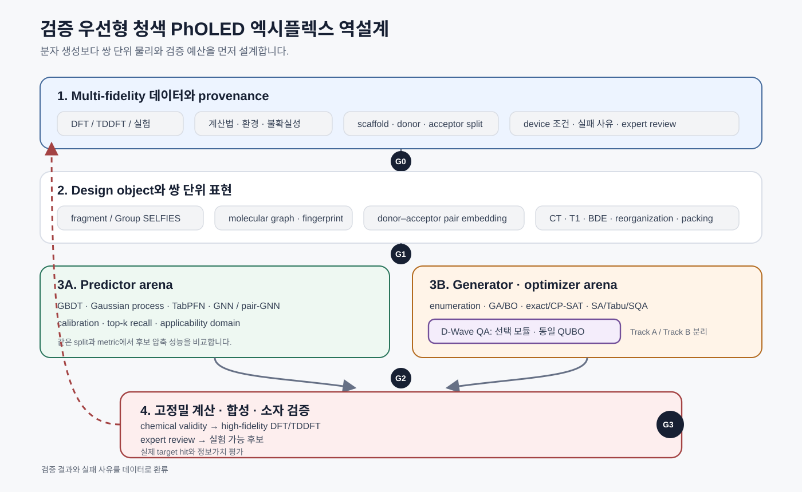
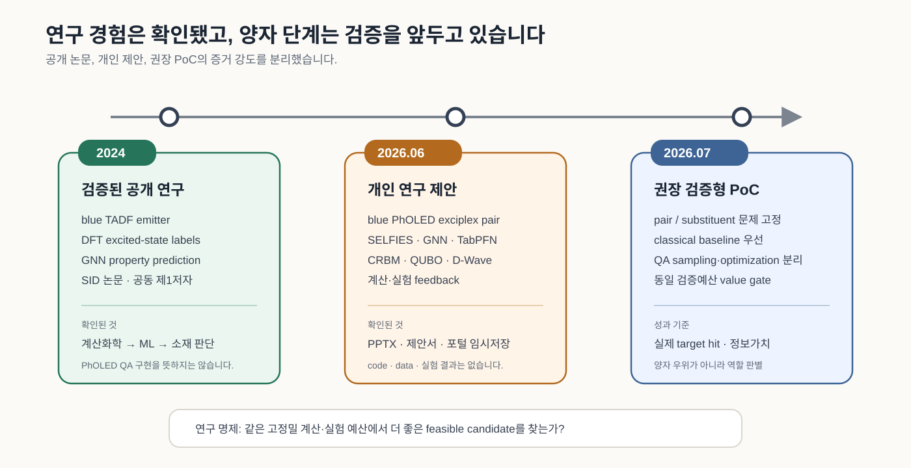
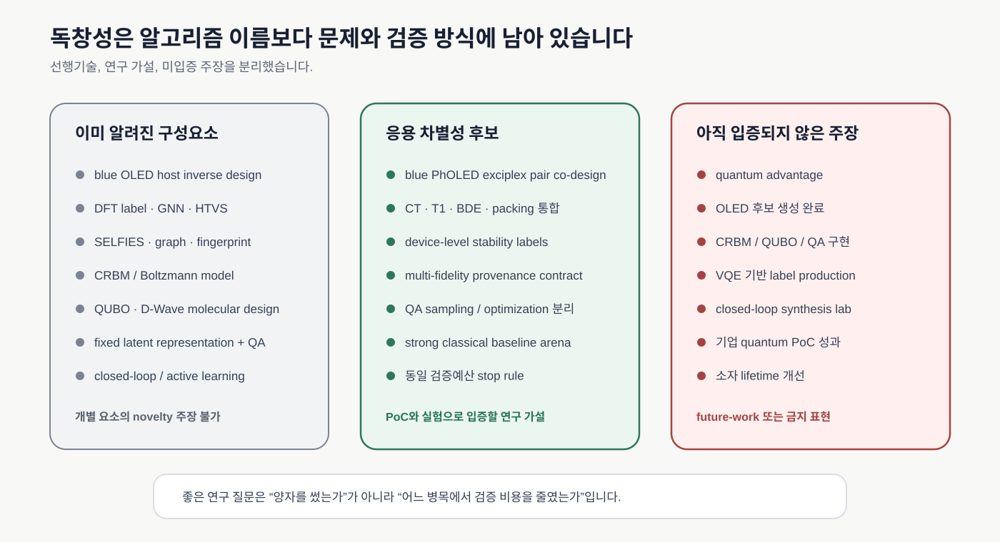
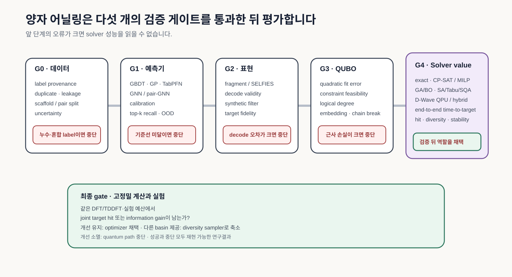

# 청색 OLED 분자 역설계: 양자 어닐링을 어디에 둘 것인가

<figure class="article-hero-figure">
  
  <figcaption><strong>그림 1.</strong> 청색 PhOLED 분자 역설계는 생성 모델 하나로 끝나지 않습니다. 공여체–수용체 쌍과 소자 조건을 함께 표현하고, 고전 기준모델과 양자 최적화를 같은 문제에서 비교한 뒤, 고정밀 계산과 실험 결과를 다시 학습 자료로 돌려보내야 합니다.</figcaption>
</figure>

청색 OLED 소재를 설계할 때 개별 분자의 계산값을 높이는 일만으로는 부족합니다. 높은 삼중항 에너지와 적절한 HOMO/LUMO 정렬을 갖춘 후보라도 다른 host·dopant와 만났을 때 전하가 한쪽에 쌓이거나, exciplex의 charge-transfer state가 흔들리거나, 박막에서 불안정해지면 소자 수명으로 이어지지 않습니다. 후보 분자, 분자 쌍, 소자 조건이 서로 영향을 주는 조합 문제입니다.

이 문제를 DFT와 머신러닝으로 다뤄온 연구 경험에 QUBO와 D-Wave 양자 어닐링을 더하면 무엇이 달라질까요? 검토 결과, 개인 아이디어의 계보는 분명했습니다. 2024년에는 DFT로 만든 blue TADF excited-state 자료를 GNN이 학습하는 연구가 공개됐고, 2026년 제안에는 청색 PhOLED 엑시플렉스 host/dopant를 대상으로 계산화학, 분자 표현, 작은 데이터 예측, 에너지 기반 모델, 양자 최적화, 검증 환류를 잇는 구조가 등장했습니다.

동시에 선행연구의 경계도 선명합니다. blue OLED host inverse design은 2018년에 이미 합성·측정까지 진행됐고, CRBM·QUBO·D-Wave를 묶은 molecular design은 2023년에 발표됐습니다. 2026년에는 고정된 분자 표현과 경량 predictor를 QUBO·QA에 연결한 연구도 나왔습니다. 새로운 연구는 알고리즘 이름을 많이 붙이는 방식보다, **청색 PhOLED의 pair-level 물리와 device-level 검증을 얼마나 정확하게 모델에 담는가**에서 출발해야 합니다.

::: highlight
이 아이디어의 가장 강한 형태는 **검증 우선형 청색 PhOLED 엑시플렉스 분자·조합 역설계 플랫폼**입니다. 양자 어닐링은 필수 구성요소로 가정하지 않습니다. 공여체–수용체 쌍 또는 치환기 선택처럼 이진화가 명확한 구간에서 고전 solver와 경쟁하고, 같은 검증 예산으로 더 좋은 후보를 찾을 때만 역할을 얻습니다.
:::

## 아이디어는 실제 연구 경로에서 발전했습니다

[김현중 외 SID 2024 논문](https://doi.org/10.1002/sdtp.17753)은 blue TADF emitter의 excited-state energy와 transition property를 GNN으로 예측했습니다. 학습 자료는 DFT 계산으로 만들었고, 실험 관찰과 ML prediction의 consistency, 계산과 모델 정확도를 높이는 조건을 함께 논의했습니다. 분자 역설계에 필요한 `계산화학 라벨 → ML 예측 → 소재 판단`의 출발점이 공개 연구로 남아 있습니다.

2026년 6월에 작성된 개인 PPTX와 기술수요 제안은 대상을 blue TADF emitter에서 **청색 PhOLED 엑시플렉스 host/dopant**로 넓혔습니다. 초기안은 분자 설계 문제를 QUBO로 바꾸고 D-Wave 양자 어닐링으로 탐색하는 데 무게를 두었습니다. 후속안은 DFT/TDDFT·문헌·실험 자료, SELFIES·graph·fingerprint, TabPFN/GNN, CRBM/Boltzmann model, QUBO/QA, 계산·실험 검증을 단계로 분리했습니다.

별도 작업공간의 `MolQ-Forge` 구상은 이 방향을 작은 PoC로 좁혔습니다. unrestricted molecule generation보다 attachment point가 명확한 fragment grammar를 쓰고, exact·simulated annealing·simulated quantum annealing을 먼저 비교하며, QAOA는 작은 compressed instance에서만 시험하는 구조입니다. 다만 PPTX, 제안서, `MolQ-Forge` 모두 **연구 제안**입니다. local code, dataset, D-Wave run, generated candidate, 실험 결과는 아직 확인되지 않았습니다.

<figure class="figure-panel">
  
  <figcaption><strong>그림 2.</strong> 검증된 과거 연구와 미래 제안을 분리하면 아이디어의 발전이 보입니다. DFT/GNN 연구는 공개 실적이고, PhOLED pair design과 quantum annealing은 benchmark와 검증을 앞둔 연구계획입니다.</figcaption>
</figure>

## 선행연구는 양자 중심 서사를 좁혀야 한다고 말합니다

[2018년 npj Computational Materials 연구](https://www.nature.com/articles/s41524-018-0128-1)는 DFT-labeled library와 deep encoder–decoder로 blue PhOLED host를 역설계했습니다. 약 6,000개 training molecule에서 배운 model은 40,000번의 trial로 36,581개의 valid SMILES를 만들었고, 중복과 training molecule을 제거한 뒤 3,205개의 unique candidate를 얻었습니다. DFT 재계산에서 `T1 ≥ 3.00 eV`를 만족한 비율은 training library 36.2%보다 높은 58.7%였습니다. 연구팀은 세 후보를 합성·측정했고, 일부 property가 과대예측된 사례도 기록했습니다.

blue OLED inverse design 문제는 이미 2018년에 DFT와 합성·측정까지 연결됐습니다. 연구팀은 생성 model의 prediction을 최종 답으로 쓰지 않고 DFT와 실험으로 다시 확인했습니다. 생성률보다 **고비용 검증을 통과하는 비율**이 소재설계의 실제 성능입니다.

[Ajagekar와 You의 2023년 연구](https://www.nature.com/articles/s41524-023-01099-0)는 개인 제안의 알고리즘 구조와 직접 맞닿아 있습니다. GraphConv network로 neural fingerprint를 만들고, property range를 조건으로 받는 CRBM을 D-Wave sample로 학습했습니다. 이어서 free-energy surrogate와 structural constraint를 QUBO로 만들고 quantum annealing으로 molecule을 탐색했습니다. CRBM, QUBO, QA를 연결하는 구조는 이 논문에서 이미 확인됩니다.

논문의 적용 범위도 함께 봐야 합니다. ZINC 12,000개 분자와 QED, logP, synthetic accessibility를 사용했고, molecule의 atomic composition과 target range를 제한했습니다. 일부 QUBO에서 quantum annealing time이 simulated annealing보다 크게 짧았지만, direct generation보다 추가 optimization step이 필요했고 target candidate는 iteration 후반에 발견됐습니다. blue OLED excited-state와 lifetime label을 검증한 연구는 아니었습니다.

[2026년 Digital Discovery 연구](https://doi.org/10.1039/D6DD00012F)는 한 단계 더 모듈화했습니다. CDDD pretrained representation은 고정하고, target property마다 작은 linear head만 학습한 뒤 inverse problem을 QUBO로 만들었습니다. high-QED/low-SAS 조건의 joint hit은 QA 24.4%, SA 15.4%였고, high-QED/low-logP에서는 QA 18.5%, SA 5.0%였습니다. end-to-end generation은 QA 9.55초, SA 54.65초로 보고됐습니다.

이 결과는 multi-objective feasible region이 좁을 때 QA가 선택성을 높일 가능성을 시사합니다. 그러나 property는 RDKit 기반 QED·SAS·logP이고, 비교 solver는 SA 중심입니다. decode 뒤 validity는 약 52–54%였으며, solver가 latent target을 정확히 맞춰도 실제 molecule property에는 오차가 남았습니다. blue PhOLED에 적용하려면 더 강한 고전 기준선과 고정밀 계산·실험 검증이 필요합니다.

## 고전 OLED 설계는 이미 강한 기준선을 제공합니다

양자 PoC가 넘어야 할 기준은 과거의 단순 random search가 아닙니다. [2025년 Science Advances 연구](https://doi.org/10.1126/sciadv.adr1326)는 약 400개의 MR-TADF 실험 자료로 emission peak와 FWHM을 예측하고 deep-blue 후보를 설계했습니다. `ν-DABNA-O-xy` 기반 hyperfluorescent device는 CIE y 0.07, FWHM 19 nm, 최대 EQE 41.3%를 보였습니다.

[2025년 Chemical Engineering Journal 연구](https://doi.org/10.1016/j.cej.2025.159697)는 약 1.8×10^7개의 blue OLED host candidate를 구성해 deep learning과 high-throughput virtual screening으로 걸렀습니다. 합성한 host가 들어간 blue TADF OLED는 최대 EQE 30.8%를 기록했습니다.

더 직접적인 참고자료는 [2026년 JACS exciplex 연구](https://doi.org/10.1021/jacs.5c16369)입니다. 연구팀은 isolated molecule의 energy level만 보지 않고, exciplex를 고려한 높은 triplet energy, deep LUMO alignment, 높은 bond dissociation energy, 적절한 reorganization energy를 design criteria로 사용했습니다. 찾아낸 두 n-type host는 p-type host와 exciplex를 형성했고, green OLED에서 최대 EQE 39.4%, 낮은 roll-off, 장시간 안정성을 보였습니다.

색은 green이지만 방법론은 blue PhOLED 제안에 중요한 질문을 던집니다. 후보를 `개별 물성이 높은 분자`로 정의할 것인가, 아니면 `특정 partner와 device condition에서 성능을 내는 쌍`으로 정의할 것인가? 후자가 소자 개발 조건을 더 잘 반영합니다.

<figure class="figure-panel">
  
  <figcaption><strong>그림 3.</strong> SELFIES, GNN, CRBM, QUBO, D-Wave는 이미 공개된 구성요소입니다. 연구 기회는 청색 PhOLED의 쌍 단위 물리와 데이터 계보, 공정한 optimizer 검증에 남아 있습니다. quantum advantage와 생성 후보 성능은 아직 입증되지 않았습니다.</figcaption>
</figure>

## 설계 대상은 분자에서 ‘쌍과 조건’으로 바뀌어야 합니다

첫 PoC의 design object가 흔들리면 데이터와 QUBO가 함께 흔들립니다. 기존 문서에는 individual molecule, donor–acceptor pair, substituent, complete host/dopant system이 섞여 있습니다. 한 번에 모두 생성하려 하기보다 다음 두 문제 중 하나를 고르는 편이 좋습니다.

### 공여체–수용체 쌍 선택

검증된 p-type host library와 n-type host library를 두고 pair를 고릅니다. individual molecule feature에 더해 pair-specific feature를 만듭니다.

- HOMO/LUMO offset과 CT energy
- 각 molecule과 exciplex의 T1 margin
- reorganization energy와 charge-transport balance
- dipole, intermolecular coupling, pair geometry
- BDE와 reactive-site stability
- steric protection, packing·aggregation risk
- sensitizer/dopant energy transfer와 back-transfer risk

이 문제는 개인 아이디어의 산업적 특징을 잘 살립니다. 대신 pair label이 적고 계산 비용이 큽니다.

### scaffold 위 치환기 선택

알려진 scaffold와 attachment point를 고정하고 substituent를 선택합니다. fragment grammar로 chemical space를 제한할 수 있어 QUBO가 더 명확해집니다. method를 검증하기 좋은 첫 단계이며, 이후 pair design으로 확장할 수 있습니다.

## 각 모델은 역할이 다릅니다

### SELFIES와 fragment grammar

[SELFIES 원 논문](https://doi.org/10.1088/2632-2153/aba947)은 무작위 token sequence도 정상 valence를 가진 molecule로 decode되도록 설계했습니다. 이 성질은 문법 오류를 줄이지만 synthetic route, photochemical stability, excited-state accuracy, exciplex formation을 보장하지 않습니다. OLED PoC에는 unrestricted SELFIES보다 known scaffold·attachment point를 가진 fragment grammar 또는 Group SELFIES가 더 안전할 수 있습니다.

### GNN과 TabPFN

GNN은 molecular graph에서 property-specific representation을 배웁니다. pair problem에서는 두 molecule graph를 함께 읽는 dual encoder, cross-attention 또는 pair graph가 필요합니다. [TabPFN Nature 논문](https://www.nature.com/articles/s41586-024-08328-6)이 보여준 강점은 작은 표에서 빠르게 강한 prediction baseline을 만드는 데 있습니다. 이 파이프라인에서는 selected descriptor와 metadata로 다음 계산·실험 후보를 줄이거나 uncertainty 기반 순위를 보조하는 역할이 적합합니다.

### CRBM과 QUBO

기존 제안은 CRBM을 property predictor, generative prior, free-energy surrogate로 모두 사용합니다. 한 실험에서 세 역할을 동시에 맡기면 결과를 분리하기 어렵습니다. 첫 PoC에서는 다음 두 track을 나눌 수 있습니다.

- `Track A`: physics-informed quadratic surrogate로 pair/substituent selection QUBO를 만들고 classical/QA solver를 비교합니다.
- `Track B`: discrete latent cRBM의 negative-phase sampling에서 CD/PCD/parallel tempering/QA를 비교합니다.

Track A는 OLED domain value를 직접 검증하고, Track B는 sampler method 자체를 검증합니다.

### D-Wave 양자 어닐링

Advantage2의 Zephyr topology는 연결성이 개선됐지만 fully connected logical QUBO가 물리 qubit에 그대로 들어가지는 않습니다. [D-Wave minor-embedding 문서](https://docs.dwavequantum.com/en/latest/quantum_research/embedding_intro.html)는 logical variable이 physical-qubit chain으로 바뀌는 과정을 설명합니다. variable 수 외에 graph degree, chain length, chain break, coefficient precision, programming과 readout을 관리해야 합니다.

Boltzmann sampling에서는 별도의 주의가 필요합니다. [PRX Quantum 연구](https://doi.org/10.1103/PRXQuantum.3.020317)는 실제 quantum annealer가 effective temperature와 hardware noise의 영향을 받는 noisy Gibbs sampler처럼 동작한다고 분석했습니다. CRBM 학습에 사용하려면 temperature calibration, gauge, classical refinement와 distribution fidelity를 확인해야 합니다.

## 양자 가치는 같은 문제에서 판별해야 합니다

양자 어닐링을 평가할 때 `anneal time`만 재면 네트워크, embedding, programming, readout, unembedding, post-processing이 사라집니다. 반대로 모든 orchestration overhead를 quantum hardware의 고유한 한계로 묶어도 공정하지 않습니다. 두 시간을 분리해 기록하고, 최종 결정은 end-to-end time-to-target으로 내리는 편이 좋습니다.

비교 대상도 넓혀야 합니다.

- exact enumeration 또는 CP-SAT/MILP가 가능한 작은 문제
- genetic algorithm과 Bayesian optimization
- simulated annealing, Tabu, simulated quantum annealing
- D-Wave QPU와 hybrid solver

동일 objective·constraint, 동일 evaluation budget, 동일 random seed set, 동일 tuning budget을 사용합니다. predictor와 decoder도 고정해야 solver 효과를 비교할 수 있습니다.

<figure class="figure-panel">
  
  <figcaption><strong>그림 4.</strong> 양자 어닐링은 마지막 다섯 번째 gate에서 평가됩니다. 데이터 누수, predictor calibration, QUBO 근사, decoder 오류를 먼저 통제해야 solver 효과를 분리할 수 있습니다.</figcaption>
</figure>

## 8주 계산 PoC의 종료 조건

첫 2주는 design object와 label contract, scaffold/pair split을 정리합니다. 3–4주차에는 GBDT, Gaussian process, TabPFN, GNN 또는 pair-GNN을 같은 split으로 비교합니다. 5주차에는 fragment enumeration과 classical search baseline을 만들고, 6주차에는 QUBO를 exact·SA·Tabu·SQA로 풉니다. 7주차에 D-Wave를 같은 문제에 적용하고, 8주차에 상위 후보를 고정밀 계산으로 다시 평가합니다.

진행 조건은 명확합니다.

- out-of-family split에서 predictor calibration이 유지됩니다.
- QUBO가 표현한 optimum과 decode/recalculation 뒤 property가 일치합니다.
- QA가 strong classical baseline보다 joint target hit, diversity-adjusted hit 또는 information gain을 반복적으로 높입니다.
- 같은 고정밀 계산 예산에서 improvement가 남습니다.

QA가 best score를 높이지 못해도 다른 low-energy basin에서 유용한 후보를 제공하면 diversity sampler로 역할을 줄일 수 있습니다. QUBO approximation, embedding, decoder error가 solver 차이보다 크거나 classical solver가 일관되게 우수하면 quantum path를 중단합니다. 이 결론도 연구 자산입니다.

## 개인 연구 경로와 과장하지 않는 표현

이 아이디어를 수행할 기반은 있습니다. DFT와 excited-state analysis, blue TADF GNN 연구, tight-binding parameterization과 global optimization software 경험은 계산·모델·검증 사이를 연결하는 능력의 근거입니다. D-Wave 교육 이력과 QUBO 문제정의 경험은 PoC를 시작할 학습 기반입니다.

경계도 함께 적어야 합니다. blue PhOLED exciplex QA pipeline, VQE label, quantum advantage, automated synthesis loop는 아직 구현 성과가 아닙니다. 다음 문장이 현재 증거와 가장 잘 맞습니다.

> DFT·양자화학으로 OLED의 excited-state와 구조–물성 관계를 분석하고, 이를 blue TADF의 GNN 기반 역설계 문제로 발전시킨 경험이 있습니다. 이 기반 위에서 청색 PhOLED 엑시플렉스의 pair-level design을 classical surrogate와 선택적 quantum optimization으로 확장하는 검증형 PoC를 설계하고 있습니다.

## 공개본은 아키텍처를 보여주고 내부 물질을 숨겨야 합니다

공개할 수 있는 내용은 연구 질문, 공개 논문, architecture, data contract, benchmark와 stop rule입니다. 회사 내부 molecule structure, property DB, synthesis route, device recipe, supplier, aging result, portal identifier와 미공개 IP는 배포본에서 제외해야 합니다.

public benchmark 또는 synthetic data로 code skeleton을 만들 수는 있습니다. 그때도 회사 이름이나 confidential proposal을 repository 설명에 넣지 않고, method validation용 demo임을 명확히 적는 편이 안전합니다.

## 결론

분자 역설계 아이디어와 개인 연구 경로의 연결은 확인됐습니다. 2024년 DFT/GNN blue TADF 연구는 공개 논문으로 검증됐습니다. 2026년 청색 PhOLED exciplex 제안은 그 경험을 더 어려운 pair/device problem과 quantum optimization으로 확장합니다.

선행연구를 반영하면 연구의 질문이 달라집니다. `D-Wave로 분자를 만들 수 있는가`보다 다음 질문이 더 중요합니다.

> 청색 PhOLED 엑시플렉스의 쌍 단위 물리와 소자 제약을 보존한 상태에서, quantum annealing이 classical optimizer가 놓치는 feasible candidate를 같은 검증 예산으로 더 잘 찾는가?

이 질문은 답이 `아니오`여도 유용합니다. classical-first architecture와 quantum stop rule이 남기 때문입니다. 답이 `예`라면 양자기술의 역할도 구체적인 병목과 metric으로 설명할 수 있습니다. 그렇게 얻은 결과가 연구 제안과 검증된 성과 사이의 거리를 가장 안전하게 줄입니다.

## 참고문헌

1. [Kim et al., Machine Learning Strategy Towards Inverse Design of Blue TADF Emitter](https://doi.org/10.1002/sdtp.17753)
2. [Kim et al., Deep-learning-based inverse design model for intelligent discovery of organic molecules](https://www.nature.com/articles/s41524-018-0128-1)
3. [Krenn et al., SELFIES](https://doi.org/10.1088/2632-2153/aba947)
4. [Sun et al., Exceptionally stable blue phosphorescent OLEDs](https://www.nature.com/articles/s41566-022-00958-4)
5. [Vuffray et al., Programmable Quantum Annealers as Noisy Gibbs Samplers](https://doi.org/10.1103/PRXQuantum.3.020317)
6. [Ajagekar and You, Molecular design with automated QC-based deep learning and optimization](https://www.nature.com/articles/s41524-023-01099-0)
7. [Kim et al., Machine learning-driven deep-blue MR-TADF molecular design](https://doi.org/10.1126/sciadv.adr1326)
8. [An et al., Blue OLED hosts via deep learning and high-throughput virtual screening](https://doi.org/10.1016/j.cej.2025.159697)
9. [An et al., ML-guided high-triplet exciplex hosts](https://doi.org/10.1021/jacs.5c16369)
10. [Deguchi and Taki, Property-agnostic molecular inverse design via quantum annealing](https://doi.org/10.1039/D6DD00012F)
11. [Hollmann et al., TabPFN](https://www.nature.com/articles/s41586-024-08328-6)
12. [D-Wave Advantage2 solver properties](https://docs.dwavequantum.com/en/latest/quantum_research/solver_properties_specific.html)
13. [D-Wave minor embedding](https://docs.dwavequantum.com/en/latest/quantum_research/embedding_intro.html)

## 작성 정보

- 작성자: 김현중
- 작성 보조: Codex 기반 GPT-5 계열 에이전트 하네스
- 생성·수정일: 2026-07-11
- 출발 자료: 개인 CV와 공개 논문, 청색 PhOLED 역설계 PPTX·기술수요 제안, 기존 ChatGPT Deep Research 산출물
- 주요 검증 자료: peer-reviewed 1차 논문, DOI/PubMed metadata, D-Wave 공식 문서
- 작성 방식: 로컬 provenance audit, primary-source verification, Korean prose audit, deterministic figure review
