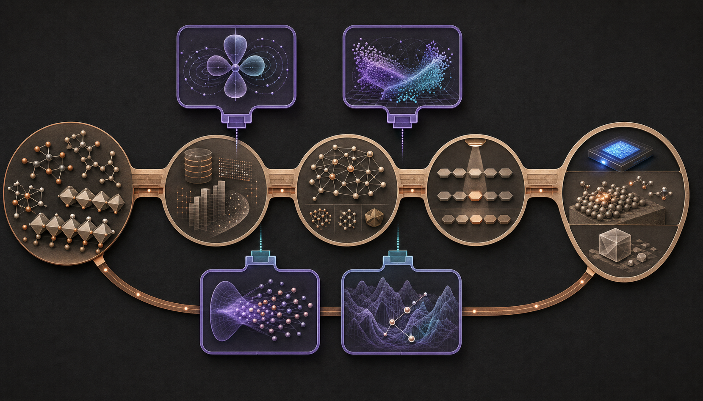
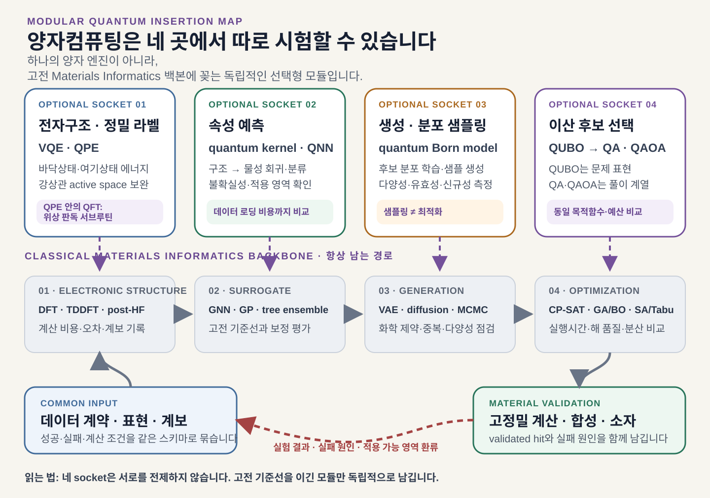
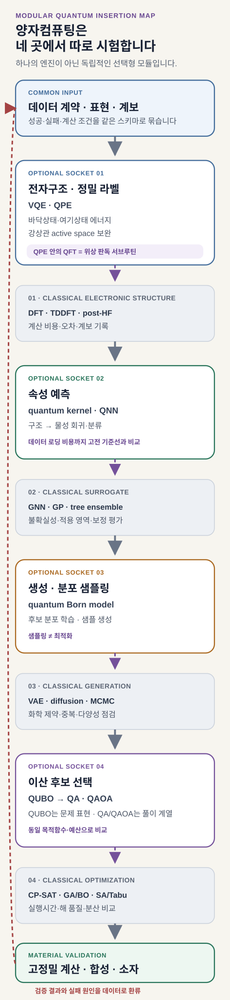
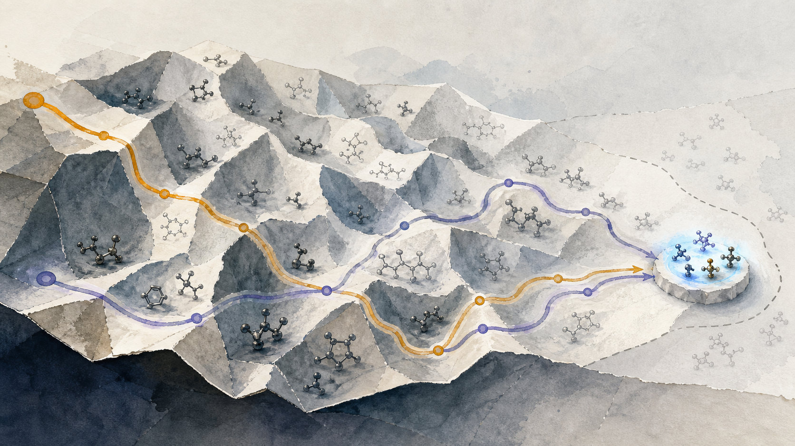
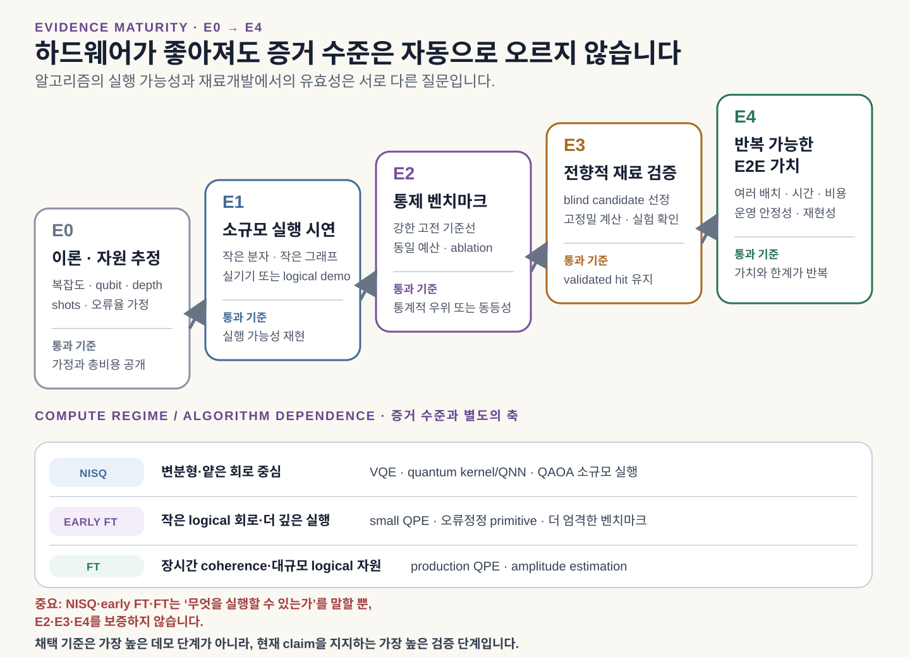
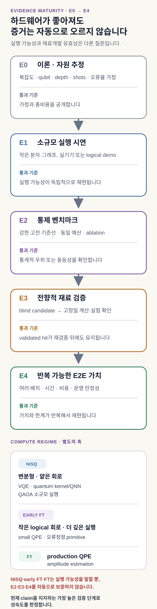
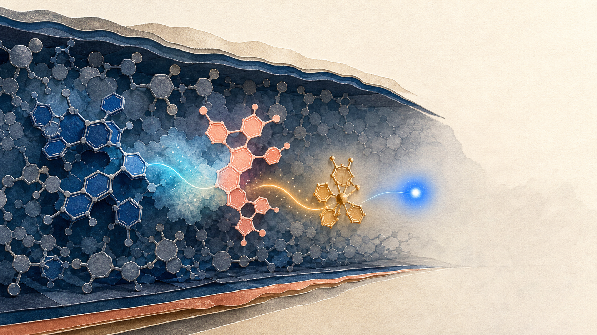
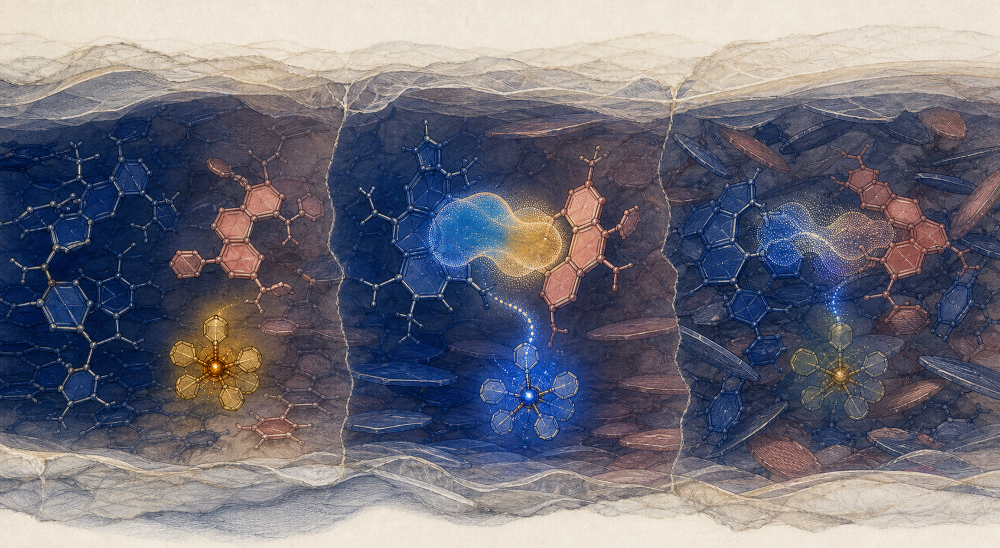
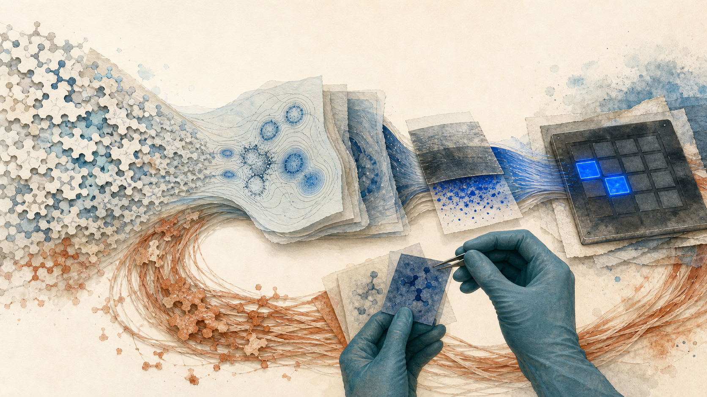

# 양자컴퓨팅은 재료 역설계의 어디를 바꿀 수 있는가

<figure class="article-hero-figure">
  
  <figcaption><strong>그림 1.</strong> 구리색 경로는 재료정보학의 고전 폐루프이고, 보라색 네 패널은 독립적으로 교체할 수 있는 양자 모듈입니다. 어느 모듈도 전체 파이프라인을 대표하거나 다른 모듈보다 앞서지 않습니다.</figcaption>
</figure>

하나의 후보 물질이 실험대에 오르기까지 적어도 네 종류의 계산을 거칩니다. 먼저 전자상태와 물성을 계산하고, 그 결과로 빠른 예측 모델을 학습합니다. 넓은 화학공간에서 새 후보를 만든 뒤에는 여러 제약을 만족하는 조합과 실험 순서를 골라야 합니다. 고정밀 계산과 실제 측정에서 얻은 성공·실패 정보는 다시 자료로 돌아갑니다.

양자컴퓨팅은 이 네 계산을 한꺼번에 맡는 엔진이 아닙니다. 전자구조에는 QPE(Quantum Phase Estimation)와 VQE(Variational Quantum Eigensolver), 물성 학습에는 quantum kernel과 양자신경망(QNN), 후보 생성과 표본추출에는 QCBM·QBM과 annealer, 이산 선택에는 quantum annealing(QA)과 QAOA(Quantum Approximate Optimization Algorithm)를 각각 시험할 수 있습니다.

각 모듈이 받는 입력과 내놓는 출력, 실패 원인과 필요한 하드웨어는 서로 다릅니다. QA가 잘 작동해도 전자구조 계산이 좋아지는 것은 아니며, QML의 예측오차가 낮아져도 생성 후보의 합성 가능성이 보장되지는 않습니다.

> **양자 모듈의 채택 조건** — 고전 재료정보학 폐루프가 공통 기반으로 남습니다. 각 양자 후보 서브루틴은 같은 문제, 정확도와 전체 검증 예산을 받은 강한 고전 방법보다 이득을 남길 때 채택합니다.

## 재료 역설계에는 서로 다른 계산 계약이 겹쳐 있습니다

Materials Informatics, 즉 재료정보학의 역설계는 원하는 성능과 제약을 먼저 정한 뒤 이를 만족할 구조, 조성, 공정 조건을 찾습니다. 자료의 계보와 표현, 물성 계산, 대리모델, 후보 생성과 선택, 고정밀 검증이 하나의 폐루프를 이룹니다. 이 글의 핵심 소켓은 전자구조, 학습, 생성·표본추출, 최적화의 네 가지입니다. 뒤에서 다루는 QAE는 이 지도 밖에 덧붙이는 오류보정 시대의 장기 확장 모듈입니다.

교체 단위는 입력과 출력의 계약입니다. 하드웨어 이름만으로 역할을 정할 수는 없습니다. 예를 들어 전자구조 모듈은 원자 배치와 Hamiltonian을 받아 에너지·상태·관측량을 내놓습니다. 대리모델은 재료 표현과 학습 자료를 받아 물성 예측과 불확실성을 돌려줍니다. 생성모델은 목표 조건에서 후보 분포를 만들고, 최적화 모듈은 명시된 목적함수와 제약 아래에서 선택된 조합을 냅니다.

| 계산 계약 | 강한 고전 기준선 | 양자 후보 | 채택 여부를 가르는 지표 |
| --- | --- | --- | --- |
| 구조·환경 → 전자상태·에너지 | DFT·TDDFT, coupled cluster, CASSCF·DMRG, 고전 embedding | VQE·qEOM, QPE | 정확도, active-space 편향, 상태 준비, 논리 큐비트·회로 자원, 전체 시간 |
| 재료 표현 → 물성·불확실성 | GNN·equivariant model, GP, GBDT, kernel | quantum kernel, QNN, quantum reservoir | 계열 밖 오차, 불확실성 보정, encoding·shot·학습비용 |
| 목표 조건 → 후보 분포 | VAE·diffusion, autoregressive model | QCBM·QBM hybrid generator | 분포 충실도, 유효성, 다양성, 모드 포괄성 |
| 에너지 모델 → 표본 | Gibbs sampling, MCMC, parallel tempering | annealer-assisted sampling | 목표 분포 오차, 유효 표본 수, 표본당 전체 비용 |
| 목적함수·제약 → 선택된 조합 | CP-SAT·MILP, BO·GA, SA·Tabu | QUBO를 푸는 QA·QAOA | 제약 만족률, 목표 도달시간, 검증 예산당 재검증 통과 후보 |
| 장기 확장: 확률모형·oracle → 기대값 | Monte Carlo, quasi-Monte Carlo | QAE 기반 quantum Monte Carlo | oracle 포함 질의·전체 시간, 오차, 오류보정 자원 |

<figure class="figure-panel">
  
  
  
  <figcaption><strong>그림 2.</strong> 네 소켓은 모두 사용해야 하는 순차 단계가 아닙니다. 전자구조 해법 하나만 바꾸거나 선택 문제에서만 QA·QAOA를 시험할 수 있으며, 고정밀 계산과 실험 검증은 공통 기준점으로 남습니다.</figcaption>
</figure>

이 구조는 촉매, 배터리, 고분자, 반도체와 발광재료로 확장하기 쉽습니다. 분야가 바뀌면 설계 대상, 물성 label과 validator가 달라지지만, 각 모듈의 입출력과 비교 규칙은 유지할 수 있습니다.

## 전자구조 모듈: QPE·VQE와 embedding의 역할

DFT는 전자밀도와 교환–상관 범함수로 다전자 문제를 다루는 전자구조 방법입니다. QFT(Quantum Fourier Transform)는 양자 상태를 Fourier basis로 바꾸는 연산이며, 표준 QPE에서 고유위상을 판독하는 데 쓰입니다. 분자 에너지 계산을 맡는 양자 후보는 QPE·VQE 계열입니다. [IBM Quantum의 QFT·QPE 설명](https://quantum.cloud.ibm.com/learning/modules/computer-science/qft)도 두 역할을 분리합니다.

> **전자구조 모듈의 실제 흐름** — DFT·고전 embedding으로 환경과 active space를 정합니다 → 선택된 전자 Hamiltonian을 VQE 또는 QPE로 풉니다 → 표준 QPE에서는 QFT가 위상 판독을 돕습니다 → 에너지와 관측량을 다시 고전 학습·검증 폐루프에 돌려줍니다.

양자 전자구조의 더 정확한 표현은 다음과 같습니다. 고전 계산이 basis, orbital, environment와 active space를 정해 전자 Hamiltonian을 만들고, 그중 고전적으로 어려운 상관 문제를 VQE·QPE 계열 해법에 보냅니다. 이 결과를 다시 DFT·embedding·분자동역학과 물성 계산에 돌려줍니다. 양자 해법은 DFT 전체를 대신하기보다 selected CI, FCI 또는 다중참조 active-space 해법의 자리에 해당합니다.

[2014년 VQE 최초 실험](https://www.nature.com/articles/ncomms5213)은 He–H⁺의 작은 Hamiltonian을 광자 프로세서와 고전 optimizer로 풀었습니다. 긴 coherent evolution 대신 짧은 회로를 여러 번 측정한다는 장점이 있었지만, ansatz bias와 측정 횟수, noise와 optimizer라는 새 비용이 생겼습니다. [2024년 12-qubit UCC 실험](https://www.nature.com/articles/s41567-024-02530-z)도 범위를 넓혔지만, 현재 실험이 작은 문제와 고전적으로 검증 가능한 ansatz에 제한된다는 경계를 분명히 둡니다.

QPE는 오류보정 양자컴퓨터에서 더 정확한 에너지를 얻을 장기 경로입니다. Qubitization은 QPE가 위상을 읽을 Hamiltonian-dependent unitary를 구현하는 대표적인 block-encoding·simulation 기법입니다. [Low와 Chuang의 원 논문](https://doi.org/10.22331/q-2019-07-12-163)은 두 역할의 결합을 설명합니다. Hamiltonian encoding과 긴 coherent circuit에 더해, 목표 고유상태와 충분히 겹치는 초기상태도 필요합니다. [2023년 Nature Communications 분석](https://www.nature.com/articles/s41467-023-37587-6)은 이 상태 준비와 반복 비용을 포함하면 일반적인 바닥상태 양자화학에서 지수적 우위가 자동으로 따라오지 않는다고 지적했습니다.

따라서 가까운 설계는 DFT에 양자 active-space 해법을 결합하는 형태입니다. [2024년 MgO 결함 연구](https://www.nature.com/articles/s41524-024-01477-2)는 periodic range-separated DFT 환경 안의 작은 fragment Hamiltonian을 VQE와 qEOM으로 풀었습니다. 원자 배치와 장거리 환경은 고전 계산이 맡고, 국소화된 어려운 전자상태만 양자 회로에 넘긴 사례입니다.

전자구조 모듈을 평가할 때는 에너지 오차 하나만 보지 않습니다. basis와 active space를 공개하고, 상태 overlap, 물리·논리 qubit, 회로 깊이, shots, 오류완화 또는 오류보정 비용, 전체 경과시간을 함께 기록해야 합니다. 여기상태라면 상태 순서, oscillator strength, singlet–triplet gap과 geometry dependence도 확인해야 합니다.

## 학습 모듈: QML의 입력비용과 일반화

Quantum kernel 가운데 대표적인 fidelity kernel은 고전 descriptor를 양자상태로 인코딩하고 두 상태의 fidelity를 kernel 값으로 사용합니다. Projected kernel은 국소 관측량 등으로 낮은 차원의 특징을 만든 뒤 고전 kernel을 구성합니다. QNN은 parameterized quantum circuit의 측정값을 예측 함수로 학습합니다. 이 방법들은 작은 자료에서 새로운 표현을 제공할 가능성이 있지만, Hilbert space가 지수적으로 크다는 사실만으로 예측 우위가 생기지는 않습니다.

[Havlíček 등의 2019년 실험](https://www.nature.com/articles/s41586-019-0980-2)은 양자 feature space를 이용한 분류를 보였지만 실용 재료 자료에서의 우위 증명은 아니었습니다. [2021년 Power of Data 연구](https://www.nature.com/articles/s41467-021-22539-9)는 주어진 자료에서 고전 모델이 양자 모델의 예측을 배울 수 있는지까지 봐야 한다고 설명합니다. 회로가 고전적으로 시뮬레이션하기 어렵다는 사실과 실제 예측 이득은 서로 다른 주장입니다.

입력 비용도 빠뜨릴 수 없습니다. 고전 벡터를 amplitude나 angle로 인코딩하는 회로, N개 표본의 kernel matrix를 측정하는 횟수, 유한 shots의 통계오차가 전체 비용에 들어갑니다. 표현력이 높은 회로가 항상 유리한 것도 아닙니다. [2018년 barren plateau 연구](https://www.nature.com/articles/s41467-018-07090-4)는 무작위 변분 회로에서 gradient가 qubit 수에 따라 지수적으로 작아질 수 있음을 보였고, [2024년 quantum kernel 집중 연구](https://www.nature.com/articles/s41467-024-49287-w)는 embedding, entanglement, global measurement와 noise가 서로 다른 입력의 kernel 값을 구분하기 어렵게 만들 수 있음을 보였습니다.

재료 대리모델에 QML을 넣는다면 같은 scaffold 또는 composition split을 사용해야 합니다. GNN, Gaussian process, boosting, classical kernel에 같은 자료 수와 hyperparameter budget을 주고, 평균오차와 함께 계열 밖 예측과 불확실성 보정을 비교합니다. QPU 호출과 encoding을 포함한 비용에서 이득이 남지 않으면 고전 모델이 기준 모듈로 남습니다.

## 후보를 만드는 표본추출과 고르는 최적화는 다른 문제입니다

생성·표본추출과 최적화는 모두 여러 bitstring을 내놓을 수 있지만 목적이 다릅니다. 생성모델은 목표 자료의 분포를 배우거나 다양한 후보를 표본화합니다. 최적화는 주어진 비용함수를 낮추는 제약 만족 해를 찾습니다. 낮은 에너지 표본이 많이 나왔다는 사실만으로 목표 분포를 잘 학습했다고 말할 수 없습니다.

### 생성·표본추출은 분포 충실도를 묻습니다

QCBM은 회로가 만든 Born probability를 학습하고, QBM은 Hamiltonian의 Gibbs 분포를 모델링합니다. 고전 RBM의 표본추출을 양자 어닐러에 맡기는 방식은 또 다른 범주입니다. 세 방법을 모두 “양자 생성모델”로 뭉치면 무엇이 개선됐는지 알기 어렵습니다.

[2019년 QCBM 연구](https://www.nature.com/articles/s41534-019-0157-8)는 작은 합성 분포에서 shallow circuit의 생성 학습을 실증했습니다. 분자 설계에서는 양자 회로가 latent prior 일부를 맡고 encoder, decoder, validity 검사와 property model은 고전적으로 남는 경우가 많습니다. [2023년 annealer-assisted 분자 생성 연구](https://www.nature.com/articles/s41598-023-32703-4)도 이런 hybrid 구조를 보였지만, 유효성 손실과 접근·학습비용 때문에 양자 생성 우위를 입증한 결과로 읽을 수는 없습니다.

평가 지표는 분포 수준에 둡니다. objective의 최솟값만으로는 충분하지 않습니다. held-out likelihood 또는 적절한 divergence, mode coverage, 유효·고유·합성 가능 후보 비율, effective sample size와 property-conditioned hit를 함께 봅니다. 양자 sampler의 표본이 정확한 Boltzmann 분포라는 가정도 effective temperature와 freeze-out 조건 아래에서 따로 검증해야 합니다.

### QUBO는 문제 형식이고, QA와 QAOA는 해법입니다

QUBO(Quadratic Unconstrained Binary Optimization)는 이진 변수의 선형·이차 항으로 목적함수를 쓰는 정식화입니다. [D-Wave 공식 model 문서](https://docs.dwavequantum.com/en/latest/concepts/models.html)는 QUBO를 최소화할 binary quadratic objective로 정의합니다. QUBO 자체는 양자 알고리즘이 아닙니다. 같은 QUBO를 전수탐색·정확해법, CP-SAT·MILP, simulated annealing, tabu search, QA가 풀 수 있으며, gate model에서는 QAOA cost Hamiltonian으로 옮길 수 있습니다.

QA는 transverse-field Ising 계를 시간에 따라 변화시켜 낮은 에너지 bitstring을 얻는 analog 방식입니다. QAOA는 cost와 mixer unitary를 번갈아 적용하고 각도를 고전 optimizer로 학습하는 gate-based 변분 알고리즘입니다. [QAOA 원 논문](https://arxiv.org/abs/1411.4028)의 구성처럼 두 방법은 같은 해법이 아니며, 제약을 처리하는 방식과 하드웨어 비용도 다릅니다.

<figure class="figure-panel">
  
  <figcaption><strong>그림 3.</strong> 주황색과 보라색 경로는 같은 후보 지형을 지나 동일한 validator로 들어갑니다. 이 편집 장면은 특정 QUBO의 실제 energy surface를 재현하지 않고, 같은 검증 조건의 비교를 설명합니다.</figcaption>
</figure>

분자 설계의 선행 사례에는 가능성과 한계가 함께 기록돼 있습니다. [2023년 Ajagekar와 You 연구](https://www.nature.com/articles/s41524-023-01099-0)는 GraphConv fingerprint, conditional RBM, QUBO와 D-Wave를 연결했습니다. [2026년 Digital Discovery 연구](https://doi.org/10.1039/D6DD00012F)는 고정된 CDDD 표현과 선형 예측기를 QUBO에 연결하고, D-Wave의 양자·고전 hybrid BQM 해법과 SA를 비교했습니다. 두 다목적 조건에서 hybrid 해법의 공동 목표 충족률이 더 높았지만, 이 방법은 문제 분해와 고전 휴리스틱을 포함하므로 QA 하드웨어 단독의 우위로 해석할 수 없습니다. 해독된 분자의 validity도 51.9–54.1%였고 latent objective와 실제 물성 사이의 오차가 남았습니다.

OLED와 직접 맞닿은 [2023년 Alq₃ 중수소 치환 연구](https://spj.science.org/doi/10.34133/icomputing.0037)는 6개 치환 위치, 64개 조합을 양자화학·factorization machine·QUBO·VQE/QAOA로 연결했습니다. 이는 재료 파이프라인의 작은 최적화 모듈을 보여주는 좋은 PoC입니다. 동시에 탐색공간이 작고 고전 계산과 문제 축소·후처리가 큰 역할을 했으므로, QAOA 단독의 실용 우위로 확대해서는 안 됩니다.

QA는 논리 변수를 physical-qubit chain으로 옮기는 minor embedding, chain break, coefficient precision과 topology 비용이 있습니다. QAOA는 non-native 연결에서 SWAP과 two-qubit gate가 늘고, 회로 깊이와 noise, parameter optimization이 병목이 됩니다. 비교에는 anneal 또는 circuit 실행시간과 함께 embedding·compilation, queue, 반복 측정, decoding과 고전 후처리를 포함한 목표 도달시간을 사용해야 합니다.

## 장기 확장 모듈: 불확실성 계산

Active learning과 robust design에서는 후보의 평균 성능만큼 실패확률과 기대효용이 중요합니다. Quantum Amplitude Estimation(QAE)은 확률분포와 utility를 coherent state와 reversible oracle로 준비할 수 있을 때 Monte Carlo 기대값 추정의 query 수를 거의 제곱근 수준으로 줄일 이론적 가능성이 있습니다. [Montanaro의 2015년 연구](https://pmc.ncbi.nlm.nih.gov/articles/PMC4614442/)는 이 일반적인 quantum Monte Carlo 경로를 제시했습니다.

그러나 이 이득은 oracle model 안의 이야기입니다. 고전 DFT, 복잡한 neural surrogate나 실제 실험을 coherent reversible oracle로 바꾸는 비용이 크면 장점이 사라집니다. 긴 Grover power와 오류보정도 필요합니다. 따라서 QAE는 현재 PoC의 중심보다, 이미 빠른 확률모형을 양자회로로 준비할 수 있는 fault-tolerant 시기의 불확실성 엔진으로 두는 편이 정확합니다.

## 성숙도는 증거 단계와 하드웨어 시기를 함께 봐야 합니다

양자 알고리즘을 한 줄의 순위로 놓을 수는 없습니다. VQE·QML·QAOA는 현재 장치에서 작은 실험을 할 수 있지만 noise와 학습성 문제가 큽니다. QPE 계열과 QAE는 이론적 성질이 더 선명한 대신 오류보정 하드웨어에 의존합니다. 따라서 알고리즘의 약속과 end-to-end 검증 수준을 분리해야 합니다.

<figure class="figure-panel">
  
  
  <figcaption><strong>그림 4.</strong> E0의 이론적 speedup과 E4의 반복 가능한 설계 가치는 다른 주장입니다. 이 리뷰에서 확인한 공개 재료·분자 사례는 대체로 E1 소형 실증 또는 제한된 E2 도메인 벤치마크에 있으며, 고정밀 계산이나 실험을 사전에 정한 기준으로 통과하는 E3·E4가 다음 과제입니다.</figcaption>
</figure>

| 후보 모듈 | 현재 확인 가능한 증거 | 가까운 검증 질문 | 장기 조건 |
| --- | --- | --- | --- |
| VQE·qEOM | 작은 molecule·active space, embedding PoC | 오류완화 결과가 강한 active-space 해법과 같은 오차·비용에서 경쟁하는가 | 더 낮은 error, 측정 효율, 확장 가능한 ansatz |
| QPE 계열 | 알고리즘·자원 추정 중심 | 좋은 초기상태와 Hamiltonian simulation을 포함한 전체 자원이 현실적인가 | fault-tolerant logical qubit와 긴 coherent circuit |
| quantum kernel·QNN | 소형 자료·hardware 또는 simulator PoC | 실제 재료 split에서 고전 모델보다 불확실성 보정·계열 밖 예측 이득이 남는가 | 효율적 encoding, 학습 가능성, 측정 scaling |
| QCBM·QBM generator | 작은 분포·hybrid generator PoC | 분포 충실도와 유효 후보가 고전 생성모델보다 나은가 | scalable training과 검증 가능한 generative advantage |
| annealer-assisted sampler | 작은 RBM·latent 표본추출 PoC | 같은 energy model에서 목표 분포와 전체 비용이 MCMC보다 나은가 | 보정 가능한 표본 분포와 반복 가능한 이득 |
| QA·QAOA 최적화 | 작은 QUBO·도메인 PoC | embedding·compilation·후처리를 포함해 재검증 통과 후보가 늘어나는가 | 문제 구조와 hardware가 맞는 반복 가능한 benchmark |
| QAE | oracle/query 복잡도 근거 | materials uncertainty를 reversible oracle로 준비할 수 있는가 | fault-tolerant coherent oracle |

이 리뷰에서 확인한 공개 근거만 보면, 어느 모듈도 재료 역설계 전반의 양자우위를 입증했다고 보기 어렵습니다. 그렇다고 모두 같은 단계에 있는 것도 아닙니다. 작은 계산 계약을 고정하고 증거 사다리의 다음 한 칸을 목표로 삼는 것이 더 생산적입니다.

## 청색 OLED는 네 모듈을 한꺼번에 점검하는 좋은 스트레스 테스트입니다

<figure class="figure-panel">
  
  <figcaption><strong>그림 5.</strong> 이 유즈케이스는 donor·acceptor co-host가 만든 charge-transfer exciplex, 별도의 phosphorescent dopant, 박막과 소자 조건을 함께 다룹니다. 그림은 이 관계를 일반화한 편집 일러스트레이션입니다.</figcaption>
</figure>

청색 OLED는 높은 여기 에너지, 전하 균형, 에너지 전달, 박막 배열과 열화가 얽혀 있습니다. 계산 화면에서 좋아 보이는 분자도 이웃 분자와 전하를 주고받는 방식이 달라지거나, 여기상태와 packing이 예상과 어긋나면 소자에서 빛을 잃습니다. 높은 T₁이나 적절한 HOMO/LUMO만으로 효율과 수명을 함께 설명하기 어렵습니다.

Exciplex-forming co-host형 PhOLED에서는 donor와 acceptor host가 만날 때 charge-transfer 여기상태가 생기고, 그 에너지가 별도의 phosphorescent dopant로 전달됩니다. [2022년 Nature Photonics 연구](https://www.nature.com/articles/s41566-022-00958-4)처럼 이 구조의 실제 소자는 세 구성요소와 계면, 전하 균형을 함께 다룹니다. host와 dopant 두 항목만 적은 표현으로는 이 유즈케이스의 설계 대상을 정확히 담기 어렵습니다.

<figure class="figure-panel">
  
  <figcaption><strong>그림 6.</strong> 같은 donor–acceptor 조합도 거리, 배향과 주변 packing에 따라 전하이동 상태와 dopant로의 에너지 전달이 달라집니다. 따라서 개별 분자, pair geometry, 계면과 소자 조건을 한 자료 계약에 묶어야 합니다.</figcaption>
</figure>

이 유즈케이스에서 네 모듈은 다음처럼 나뉩니다.

| OLED 설계 질문 | 양자 후보 모듈 | 반드시 남는 고전·실험 계층 |
| --- | --- | --- |
| 작은 active space의 S₁·T₁, charge-transfer와 다중참조 상태 | VQE·qEOM, 장기적으로 QPE | geometry·환경 DFT/TDDFT, embedding, spectroscopy |
| 분자·donor–acceptor pair·소자 조건에서 물성 예측 | quantum kernel·QNN | GNN·GP·boosting 기준선, 불확실성 보정, 계열 밖 split |
| 목표 조건에 맞는 scaffold·fragment 후보 분포 | QCBM·QBM hybrid generator | fragment grammar, decoder, validity·합성 가능성 검사 |
| 고정된 energy model에서 latent 표본 생성 | annealer-assisted sampling | Gibbs·MCMC·parallel tempering, 분포 보정 |
| co-host·dopant·치환기 또는 실험 batch 선택 | QUBO를 푸는 QA·QAOA | enumeration·CP-SAT·SA·Tabu·BO, 고정밀 재계산 |

[2021년 TADF 양자계산 연구](https://www.nature.com/articles/s41524-021-00540-6)는 이 분업을 일찍 보여줬습니다. 구조와 큰 환경은 고전 TDDFT/TDA가 맡고, HOMO–LUMO의 매우 작은 active space에서 qEOM-VQE와 VQD로 S₁·T₁을 계산했습니다. 의미 있는 방법 실증이지만 전체 OLED 전자구조나 소자 계산을 대체한 것은 아닙니다.

고전 역설계도 이미 높은 기준선을 세웠습니다. [2018년 blue PhOLED host 연구](https://www.nature.com/articles/s41524-018-0128-1)는 약 6,000개의 DFT 자료에서 생성모델을 학습하고, 생성 후보를 DFT로 다시 계산한 뒤 세 물질을 합성·측정했습니다. [2025년 MR-TADF 연구](https://doi.org/10.1126/sciadv.adr1326)와 [blue TADF host 가상선별 연구](https://doi.org/10.1016/j.cej.2025.159697)는 후보 선별을 합성 또는 소자 제작으로 연결했습니다. [2026년 JACS 연구](https://doi.org/10.1021/jacs.5c16369)는 green PSF OLED용 exciplex host를 다뤘습니다. 청색 OLED와 인접한 이 연구는 ML 선별을 host 합성과 소자 검증까지 연결한 비교 기준입니다.

이 연구들의 발광 구조, 색, 소자 조건과 평가 지표는 서로 다르므로 최고 EQE만 한 줄에 놓고 비교해서는 안 됩니다. 양자 모듈이 겨뤄야 할 상대도 논문 사이의 최고 수치가 아닙니다. 같은 설계공간, 목적함수와 검증 예산을 받은 강한 고전 모듈입니다.

## 확장 가능한 PoC는 한 번에 하나의 교체 가설을 시험합니다

네 양자 모듈을 동시에 넣으면 결과가 좋아져도 원인을 알 수 없습니다. 첫 PoC는 하나의 입출력 계약을 고정하고 나머지를 같은 고전 파이프라인으로 유지해야 합니다.

- **전자구조 트랙**은 동일한 geometry와 active space에서 VQE·qEOM을 FCI·DMRG·selected CI와 비교합니다. 에너지, 상태 순서와 관측량, 측정비용을 함께 봅니다.
- **학습 트랙**은 동일한 scaffold/pair split에서 quantum kernel·QNN을 GNN·GP·classical kernel과 비교합니다. 불확실성 보정과 계열 밖 성능을 사전 등록합니다.
- **생성·표본추출 트랙**은 두 수준을 분리합니다. 종단 생성에서는 같은 자료와 validator 아래에서 QCBM·QBM hybrid generator를 VAE·diffusion·autoregressive model과 비교합니다. 표본추출만 시험할 때는 같은 RBM 또는 energy model을 고정하고 annealer를 Gibbs sampling·MCMC·parallel tempering과 비교합니다.
- **최적화 트랙**은 같은 QUBO 또는 명시된 constraint contract를 CP-SAT·MILP·SA·Tabu, QA와 QAOA에 연결합니다. 가능한 작은 문제는 exact enumeration으로 optimum과 gap을 확인합니다.

<figure class="figure-panel">
  
  <figcaption><strong>그림 7.</strong> 후보의 가치는 고정밀 계산과 실제 검증을 통과하면서 드러납니다. OLED에서는 박막·소자 시험이 마지막 기준이지만, 다른 재료 분야에서는 합성, 촉매 활성, 전지 수명 또는 기계 특성 시험으로 validator를 바꿀 수 있습니다. 탈락 이유도 다음 학습 자료로 돌려보냅니다.</figcaption>
</figure>

모든 트랙의 공통 지표는 **고정밀 평가 또는 실험 1회당 재검증 통과 후보 수**입니다. 보조 지표로 전체 경과시간, 비용, 제약 만족률, 다양성, 불확실성 보정과 반복 안정성을 둡니다. QPU 실행시간만 따로 떼어 speedup을 말하지 않으며, 자료 준비, encoding, active-space 선택, embedding·compilation, shots, queue, decoding과 고전 후처리를 포함합니다.

중단 조건도 먼저 정할 수 있습니다. active-space·surrogate·QUBO 근사 오차가 해법 차이보다 크거나, encoding과 측정비용을 포함하면 고전 기준선이 일관되게 우수하거나, 재검증에서 차이가 사라지면 해당 양자 모듈을 제거합니다. 이때 남는 고전 파이프라인과 실패 원인도 완전한 연구 결과입니다.

반대로 여러 seed와 문제 크기에서 개선이 반복되고, 같은 검증 예산으로 더 많은 유효 후보를 남기며, 전체 비용에서도 이득이 유지된다면 증거 사다리의 다음 단계로 이동할 수 있습니다. 결론의 범위는 “이 계산 계약에서 이 양자 서브루틴이 유효했다”로 제한합니다. 이를 양자 파이프라인 전체의 승리로 넓히지는 않습니다.

## 연구 맥락과 공개 경계

[김현중 외 SID 2024 논문](https://doi.org/10.1002/sdtp.17753)은 DFT로 만든 blue TADF 여기상태 자료를 GNN이 학습해 물성을 예측하고 역설계 전략을 뒷받침한 연구입니다. 생성 후보의 합성이나 PhOLED 소자 검증까지 수행한 결과는 아닙니다. DFT·excited-state analysis와 GNN 연구 경험은 이 하이브리드 파이프라인의 데이터·전자구조·학습 모듈을 설계할 기반이 됩니다.

현재 공개 근거에 맞는 제안은 다음 정도입니다.

> DFT·양자화학과 GNN 기반 OLED 물성예측 경험을 바탕으로, 재료 역설계의 전자구조·대리모델·생성·이산 최적화 단계를 분리하고 각 단계에서 양자 후보 서브루틴을 강한 고전 기준선과 비교하는 검증형 파이프라인을 설계합니다. 청색 OLED는 여기상태, 분자쌍, 박막과 소자 조건을 함께 요구하는 첫 유즈케이스이며, 양자 모듈의 채택은 고정밀 계산과 실험 검증 뒤에 결정합니다.

공개본에는 연구 질문, 공개 논문, 모듈 인터페이스, 비교 방법과 중단 규칙을 남길 수 있습니다. 회사 내부 분자 구조, 물성 DB, 합성경로, 소자 recipe, 공급사, aging 결과와 미공개 IP는 분리해야 합니다. VQE label, QML advantage, QA·QAOA의 재검증 통과 후보 개선, 생성 후보와 자동 합성 폐루프는 아직 검증된 성과가 아닙니다.

재료 역설계의 양자화는 하나의 극적인 교체보다 여러 작은 계약의 검증으로 진행될 가능성이 큽니다. 가까운 시기에는 작은 active space, 제한된 학습 자료와 QUBO형 선택 문제에서 hybrid PoC가 쌓일 것입니다. 오류보정 하드웨어가 성숙하면 QPE와 QAE 같은 모듈의 범위가 넓어질 수 있습니다. 그 사이에도 데이터 계보, 고전 계산, 강한 기준선과 실험 검증은 사라지지 않습니다. 오히려 양자 모듈의 실제 가치를 판단하는 기준으로 더 중요해집니다.

## 참고문헌

1. [Kohn and Sham, Self-Consistent Equations Including Exchange and Correlation Effects](https://doi.org/10.1103/PhysRev.140.A1133)
2. [Peruzzo et al., A variational eigenvalue solver on a photonic quantum processor](https://www.nature.com/articles/ncomms5213)
3. [Lee et al., Evaluating the evidence for exponential quantum advantage in ground-state quantum chemistry](https://www.nature.com/articles/s41467-023-37587-6)
4. [Battaglia et al., Active space embedding with applications in quantum computing](https://www.nature.com/articles/s41524-024-01477-2)
5. [Low and Chuang, Hamiltonian Simulation by Qubitization](https://doi.org/10.22331/q-2019-07-12-163)
6. [Zhao et al., Experimental quantum computational chemistry with optimized UCC ansatz](https://www.nature.com/articles/s41567-024-02530-z)
7. [Dalton et al., Gate errors in VQE for quantum chemistry](https://www.nature.com/articles/s41534-024-00808-x)
8. [Gao et al., Quantum computing for electronic transitions in TADF emitters](https://www.nature.com/articles/s41524-021-00540-6)
9. [Havlíček et al., Supervised learning with quantum-enhanced feature spaces](https://www.nature.com/articles/s41586-019-0980-2)
10. [Huang et al., Power of data in quantum machine learning](https://www.nature.com/articles/s41467-021-22539-9)
11. [McClean et al., Barren plateaus in quantum neural network training landscapes](https://www.nature.com/articles/s41467-018-07090-4)
12. [Thanasilp et al., Exponential concentration in quantum kernel methods](https://www.nature.com/articles/s41467-024-49287-w)
13. [Benedetti et al., A generative modeling approach for shallow quantum circuits](https://www.nature.com/articles/s41534-019-0157-8)
14. [Gircha et al., Hybrid quantum-classical machine learning for generative chemistry](https://www.nature.com/articles/s41598-023-32703-4)
15. [Farhi et al., A Quantum Approximate Optimization Algorithm](https://arxiv.org/abs/1411.4028)
16. [Gao et al., Quantum-Classical Computational Molecular Design of Deuterated OLED Emitters](https://spj.science.org/doi/10.34133/icomputing.0037)
17. [Ajagekar and You, Molecular design with QC-based deep learning and optimization](https://www.nature.com/articles/s41524-023-01099-0)
18. [Deguchi and Taki, Property-agnostic molecular inverse design via quantum annealing](https://doi.org/10.1039/D6DD00012F)
19. [Vuffray et al., Programmable Quantum Annealers as Noisy Gibbs Samplers](https://doi.org/10.1103/PRXQuantum.3.020317)
20. [D-Wave binary quadratic and QUBO model documentation](https://docs.dwavequantum.com/en/latest/concepts/models.html)
21. [D-Wave minor-embedding documentation](https://docs.dwavequantum.com/en/latest/quantum_research/embedding_intro.html)
22. [Montanaro, Quantum speedup of Monte Carlo methods](https://pmc.ncbi.nlm.nih.gov/articles/PMC4614442/)
23. [Kim et al., Deep-learning-based inverse design of blue OLED molecules](https://www.nature.com/articles/s41524-018-0128-1)
24. [Sun et al., Exceptionally stable blue phosphorescent OLEDs](https://www.nature.com/articles/s41566-022-00958-4)
25. [Kim et al., Machine learning-driven deep-blue MR-TADF molecular design](https://doi.org/10.1126/sciadv.adr1326)
26. [An et al., Blue OLED hosts via deep learning and high-throughput screening](https://doi.org/10.1016/j.cej.2025.159697)
27. [An et al., Machine Learning-Guided Discovery of Sterically Protected High Triplet Exciplex Hosts for Ultra-Bright Green OLEDs](https://doi.org/10.1021/jacs.5c16369)
28. [Kim et al., Machine Learning Strategy Towards Inverse Design of Blue TADF Emitter](https://doi.org/10.1002/sdtp.17753)
29. [IBM Quantum, Quantum Fourier transform](https://quantum.cloud.ibm.com/learning/modules/computer-science/qft)

## 작성 정보

- 작성자: 김현중
- 최초 작성: 2026-07-11 · 구조·근거·시각 전면 개정: 2026-07-12
- 출발 자료: 개인 CV와 공개 논문, 청색 PhOLED 역설계 PPTX·기술수요 제안, 기존 Deep Research 산출물
- 근거 원칙: peer-reviewed 1차 논문과 공식 기술 문서를 우선하고, 이론·소형 실증·도메인 검증·종단 가치를 분리
- 시각 자료: 관계를 설명하는 원본 편집 일러스트레이션 5종과 desktop/mobile 결정론적 SVG 도식 2종
